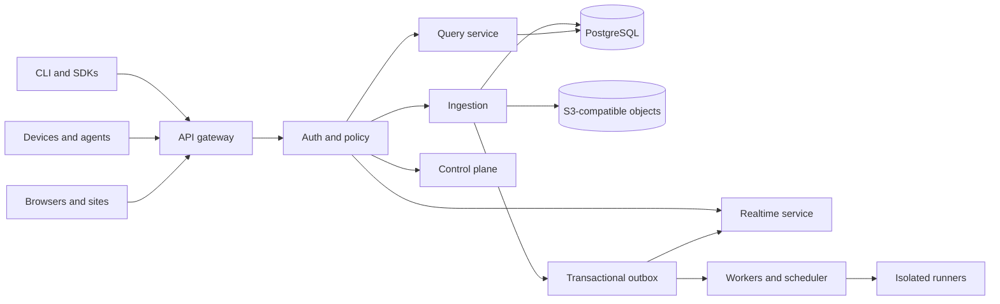

# Intern implementation guide: understanding and building the go-go-datadrop MVP

> **Who this is for.** You have just been handed the DATADROP-1 ticket. You know
> Go, HTTP, and SQL. You know nothing about Wolfram Data Drop, OpenDrop, or why
> this repository exists. By the end of this document you should be able to
> implement any of the eight MVP tasks, and — more importantly — explain to
> someone else *why* each one is shaped the way it is.
>
> **How to read it.** §1–§4 are conceptual and should be read once, in order.
> §5–§6 explain the evidence base (the imported sources) so you know which
> documents to trust for what. §7–§13 are the specification — keep them open
> while coding. §14 is the review checklist. §15 is a glossary; skim it now and
> come back when a term bites you.
>
> **Implementation status (2026-07-24): v0.1 is built.** Every task in §13 is
> done and the acceptance demo in §1 runs as an automated test. This guide
> remains the specification and the onboarding path — read it to understand
> *why* the code is shaped the way it is — but where it says "you will build",
> read "the code does". Three things changed during implementation and are
> marked inline: the SQLite lock mode moved into the DSN (§12.2), the CSV
> export is bounded rather than streamed (§10.6), and the package layout gained
> a few files (§12.1). The deviations flagged in §16.1 and §16.4 were adopted.

---

## Table of contents

1. [What we are building, in one page](#1-what-we-are-building-in-one-page)
2. [The product idea and why it is not "just a database"](#2-the-product-idea-and-why-it-is-not-just-a-database)
3. [The conceptual model: drops, streams, events, schemas](#3-the-conceptual-model-drops-streams-events-schemas)
4. [The v0.1 cut line: what is in, what is deliberately out](#4-the-v01-cut-line-what-is-in-what-is-deliberately-out)
5. [The evidence base: the five imported sources](#5-the-evidence-base-the-five-imported-sources)
6. [The two reference implementations, and what to take from each](#6-the-two-reference-implementations-and-what-to-take-from-each)
7. [System architecture](#7-system-architecture)
8. [Data model](#8-data-model)
9. [The event envelope](#9-the-event-envelope)
10. [HTTP API reference](#10-http-api-reference)
11. [CLI API reference](#11-cli-api-reference)
12. [Package-by-package implementation guide](#12-package-by-package-implementation-guide)
13. [The eight MVP tasks, in dependency order](#13-the-eight-mvp-tasks-in-dependency-order)
14. [Testing, validation, and the review checklist](#14-testing-validation-and-the-review-checklist)
15. [Glossary](#15-glossary)
16. [Open questions and known inconsistencies](#16-open-questions-and-known-inconsistencies)
17. [File reference index](#17-file-reference-index)

---

## 1. What we are building, in one page

`go-go-datadrop` is a **self-hostable, CLI-first, programmable research data
inbox**. Concretely, v0.1 is a single Go binary that you point at a SQLite file
and a TCP port, and which then gives you:

- a **named destination** (a *drop*) that you can create in one command;
- an **HTTP endpoint** that accepts JSON and appends it to an immutable, ordered
  log;
- a **CLI** (`datadrop push`) that does the same thing without you writing
  `curl` incantations;
- **optional JSON Schema validation**, in either "reject bad data" or "accept
  and warn" mode;
- **queries** — the latest N events, or everything in a time window;
- a **live stream** over Server-Sent Events, so `datadrop tail --follow` shows
  events as they land;
- **exports** in CSV, NDJSON, and JSON, so your data is never trapped;
- **bearer-token auth** and an **audit log** of every write.

That is the entire v0.1. It is small on purpose. The single sentence that best
captures the intent, from the upstream design document, is:

> **A drop begins as a place to send data and becomes a portable, programmable,
> live data object.**
> — `sources/opendrop-design.md` §1

The MVP builds only the first half of that sentence ("a place to send data"),
but every structural decision — the event envelope, the per-stream sequence, the
schema table keyed by stream — exists so that the second half can be added later
*without migrating the data*. When you are tempted to simplify something in a way
that would make the later half impossible, that is the line you should not
cross. §4 tells you exactly where that line is.

### The 60-second demo we are trying to make work

This is the acceptance test for v0.1. If this sequence works end to end against
one binary and one SQLite file, we are done:

```bash
# Terminal 1
datadrop serve --addr :8080 --db ./datadrop.db --token secret

# Terminal 2
export DATADROP_TOKEN=secret
datadrop create greenhouse
datadrop push greenhouse temperature=21.7 humidity=0.48
datadrop push greenhouse temperature=22.1 humidity=0.47
datadrop query greenhouse --limit 10
datadrop tail greenhouse --follow          # blocks, prints new events live
datadrop export greenhouse --format csv > readings.csv
```

Compare `sources/opendrop-design.md` §8.1 ("CLI quick start") and §34 Scenario A
("shell to live page"). We drop the "live page" half — no web console in v0.1 —
but the shell half must work exactly.

---

## 2. The product idea and why it is not "just a database"

### 2.1 The problem

Suppose you are a researcher with a sensor on a greenhouse, or a scraper
producing rows, or an experiment emitting measurements. To store that data
somewhere durable and look at it, you currently have to assemble roughly ten
things: an HTTP endpoint, authentication, a database, schema validation,
time-series queries, file storage, a dashboard, alerting, a deployment story, and
a safe runtime if you want any custom logic. Each is available; the *integration
cost* is the problem. (`sources/opendrop-design.md` §2.)

The opposite failure is a closed platform that is easy right up until you want to
leave it. Wolfram Data Drop is the reference for the *interaction pattern* — a
named "databin" that receives incremental entries with metadata, which you can
then query by time and compute over — and the thing to avoid is its coupling to a
proprietary language and hosted-only model. (`sources/opendrop-design.md` §3.)

`go-go-datadrop` aims at the middle: integrated enough to be useful in 60
seconds, ordinary enough to work with `curl` and pipes and SQL, open enough to
self-host and export.

### 2.2 The design principles that actually constrain your code

There are eight principles in `sources/opendrop-design.md` §6. Five of them will
change code you write this week:

- **§6.1 — The simple path must remain simple.** `printf '{"t":22.8}' | datadrop
  push greenhouse` must keep working forever, even after the product grows
  schemas, views, functions and sites. Practically: never make a required
  parameter out of something that can have a sensible default. A drop always has
  a default stream named `events`.

- **§6.2 — Raw input is evidence.** Preserve what was submitted. Do not
  normalize a temperature into Kelvin and throw the original away. Practically:
  the `data` column stores the submitted JSON (compacted, not rewritten); any
  derived value is a separate, traceable thing.

- **§6.3 — Events are logically immutable.** There is no `UPDATE` on an event in
  the ordinary API. A correction is a *new event* that supersedes an old one.
  Hard deletion exists for legal and privacy reasons but is a privileged,
  audited, out-of-band operation. Practically: your store package exposes
  `AppendEvent`, `QueryEvents` — and no `UpdateEvent`.

- **§6.6 — Open formats are the exit strategy.** JSON, NDJSON, CSV, JSON Schema,
  CloudEvents. No internal-only format may be the only export path. This is why
  "export" is an MVP task and not a v0.3 nice-to-have.

- **§6.8 — Scale must be optional.** A single user must not need Kubernetes,
  Kafka, or a separate analytics cluster. This is the whole justification for
  DR-2 (SQLite only in v0.1). The logical architecture must *permit* Postgres and
  a message bus later; the base deployment must be one binary and one file.

### 2.3 Why the event log, specifically

The core storage abstraction is an **append-only, ordered log per stream**, not a
mutable table. Three properties fall out of that choice and all three are things
users want:

1. **Ordering is server-assigned and total.** Every event gets a monotonically
   increasing `seq` within its stream. Device clocks are unreliable; sequence is
   not. Ordering is defined by sequence, not by the producer's timestamp
   (`sources/opendrop-design.md` §10.3).
2. **Resumption is trivial.** A client that disconnects remembers the last `seq`
   it saw and asks for everything after it. This is what makes `tail --follow`
   robust and what makes the realtime hub allowed to be lossy (§6.4).
3. **History is auditable.** Nothing is overwritten, so "what did this value look
   like on Tuesday" is answerable by construction.

If you have used Kafka, this is the same mental model with a SQLite table instead
of a segment file, and with one partition per `(drop, stream)`.

---

## 3. The conceptual model: drops, streams, events, schemas

### 3.1 The full model (long-term)

The upstream design has a large resource hierarchy
(`sources/opendrop-design.md` §7):

```text
Instance
└── Organization
    └── Drop
        ├── Streams          ← ordered append-only event sequences
        ├── Schemas          ← versioned JSON Schema payload contracts
        ├── Views            ← saved, parameterized queries
        ├── Functions        ← uploaded code + declared capabilities
        ├── Triggers         ← what invokes a function
        ├── Sites            ← presentation projects bound to views
        ├── Devices          ← independently revocable producer identities
        ├── Assets           ← content-addressed blobs
        ├── Capabilities     ← scoped, revocable authority
        ├── Snapshots        ← stable references to high-water marks
        └── Audit history
```

### 3.2 The v0.1 model (what you implement)

v0.1 implements only the marked part:

```text
Instance  (one process, one SQLite file)
└── Drop                       ✅ implemented
    ├── Streams                ✅ implemented (default: "events")
    ├── Schemas                ✅ implemented (strict | permissive)
    ├── Events                 ✅ implemented (the append-only log)
    └── Audit history          ✅ implemented (write-side only)

    ├── Views                  ❌ deferred (Milestone 2)
    ├── Functions / Triggers   ❌ deferred (Milestone 4)
    ├── Sites                  ❌ deferred (Milestone 3)
    ├── Devices                ❌ deferred (Milestone 5)
    ├── Assets                 ❌ deferred
    ├── Capabilities           ❌ deferred (single static token instead)
    └── Snapshots              ❌ deferred
```

There is no `Organization` in v0.1: a drop name is globally unique within the
instance. This is a real simplification and it is deliberate — see §16 for what
it costs.

### 3.3 Definitions you must internalize

| Term | Definition | v0.1 representation |
|---|---|---|
| **Drop** | A named destination. The unit of naming, sharing, export, and (later) forking. `greenhouse` is a drop. | Row in `drops` |
| **Stream** | An ordered, append-only sequence of events inside a drop. Every drop has `events` by default. | Column on `events` + row in `stream_heads` |
| **Event** | One immutable record appended to a stream. Carries an envelope (id, time, source, type) and a payload (`data`). | Row in `events` |
| **Sequence (`seq`)** | A monotonically increasing integer within one `(drop, stream)`. Server-assigned. The authoritative ordering. | Column on `events`, reserved via `stream_heads` |
| **Schema** | A versioned JSON Schema document that payloads on a stream are validated against, plus a *mode* saying how strictly. | Row in `schemas` |
| **Schema mode** | `strict` = reject invalid payloads; `permissive` = accept and attach warnings. | Column on `schemas` |
| **Envelope** | The server-supplied metadata wrapper around a user payload. CloudEvents-compatible. | §9 |
| **Audit record** | An append-only record of a mutating operation: who, what, when. | Row in `audit_log` |

---

## 4. The v0.1 cut line: what is in, what is deliberately out

This section exists so that you can answer "should I build this?" without asking.
It restates `design/01-mvp-design.md` §2 with the reasoning attached.

### 4.1 In scope

| Capability | Why it is in v0.1 |
|---|---|
| One binary running an HTTP server | The product *is* a self-hostable appliance; without this there is nothing to demo. |
| Append-only event streams keyed by drop name | The core storage abstraction (§2.3). Everything else is a view over it. |
| Ingestion over HTTP `POST` **and** `datadrop push` | The design is "CLI-first" (§5.1 goal 2). A CLI that shells out to `curl` is not CLI-first. |
| JSON Schema validation, strict + permissive | Goal 4: "schema optionality with a growth path". Shipping *no* validation makes the growth path a migration. |
| Latest-N and time-range queries | The minimum useful read API (`sources/opendrop-design.md` §13.1). |
| SSE subscription | Makes the data feel live; also proves the durable-cursor + hub split works before anything harder is built on it. |
| CSV / NDJSON / JSON export | Principle §6.6. The exit strategy must exist from day one or it never gets built. |
| SQLite storage | DR-2. Zero-ops single-node. |
| Bearer token auth | DR-3. Something must gate writes; the *right* answer (DPoP/OAuth) is a v0.2 project. |
| Audit log of writes | Cheap now, expensive to retrofit, and it is in the design's first-release cut line (§33). |

### 4.2 Explicitly out of scope

Each of these is fully designed in the sources and is **not** your problem:

- OAuth, DPoP, browser sessions, ATproto identity/federation, MST/CAR repos.
- Saved views and the DropSQL query language (`sources/opendrop-design.md` §13.2).
- WASI/OCI function runtimes, scheduled jobs, triggers (§15).
- Rich live sites, the web console, Web Components (§9, §16).
- IoT edge agent, MQTT, device twins (§17).
- Parquet cold storage, DuckDB (§20.7).
- Multi-node, NATS JetStream, object storage.
- Snapshots, fork/remix, computation receipts (§27).

> **Rule of thumb.** If a feature requires a second process, a second datastore,
> or a sandbox, it is not v0.1.

### 4.3 The forward-compatibility constraints

These are the things you *must* get right now because changing them later is a
data migration, not a refactor:

1. **The event envelope is CloudEvents-shaped** (DR-4, §9). Adding fields later
   is additive; changing the shape is not.
2. **Sequences are per `(drop, stream)`**, not per drop and not global. The
   design's §21 primary key is `(stream_id, sequence)`. If you make sequence
   per-drop now, adding a second stream later renumbers history.
3. **`received_at` (server) and `time` (producer) are separate columns.**
   Conflating them destroys the ability to distinguish "when it happened" from
   "when we heard about it", which is the entire point of §10.3 and of the
   offline-edge scenario (§34 Scenario E).
4. **Event IDs are globally unique and client-supplyable.** This is what makes
   idempotent retries possible (§10.4). Even if v0.1 does not implement the full
   `Idempotency-Key` ledger, the `id` column must be a unique key so that a
   naive retry with the same id is a no-op rather than a duplicate.

---

## 5. The evidence base: the five imported sources

Everything under `sources/` was produced in a single ChatGPT conversation on
2026-07-23 and imported by the prior session (see
`reference/01-investigation-diary.md` for how). Knowing which document to trust
for what saves you a lot of time.

| File | Lines | What it is | Trust it for |
|---|---:|---|---|
| `sources/opendrop-design.md` | 2,530 | The full design document: product model, event/schema model, ingestion, query, functions, sites, IoT, security, storage, governance, roadmap, acceptance. | **The canonical vocabulary and long-term direction.** Every "§N" reference in this guide. |
| `sources/opendrop-browser-pds-profile.md` | 1,207 | An architecture amendment proposing a browser-native PDS layer: DID/OAuth/PKCE/DPoP, static apps as OAuth public clients, one-use WebSocket tickets. | v0.2+ identity work. **Not v0.1.** |
| `sources/open-source-wolfram-datadrop-transcript.md` | 3,954 | The full conversation transcript that produced the above. | Archaeology — *why* a decision was made, when the design doc only records *what*. |
| `sources/opendrop-pod-mvp.zip` | 71 files | A **standalone** Go MVP pod with its own `go.mod`. | **Structural precedent for v0.1.** See §6. |
| `sources/tinyidp-opendrop-source.tar.gz` | 43 files | A Go vertical slice built as an overlay on `go-go-golems/tiny-idp`. | Store/stream/DPoP patterns; the service/store test split. |

### 5.1 Reading order for a new intern

1. This guide (§1–§4).
2. `design/01-mvp-design.md` — the scope decision, ~370 lines. Read it fully.
3. `sources/opendrop-design.md` §6 (principles), §7 (model), §8 (CLI UX), §10
   (events), §11 (schema), §13 (query), §14 (realtime). ~400 lines total.
4. `reference/01-investigation-diary.md` — how the sources arrived, and what
   failed while retrieving them.
5. The `opendrop-pod` archive: `internal/store/streams.go`,
   `internal/realtime/hub.go`, `internal/server/feed.go`. ~400 lines of Go.
6. This guide again (§7–§13), while writing code.

Skip on first pass: the transcript, the browser-PDS profile, design §15–§17
(functions/sites/IoT), §23–§28 (security architecture, ops, PARC ideas,
extensibility).

### 5.2 How to open the archives

```bash
cd /path/to/go-go-datadrop
TICKET=ttmp/2026/07/24/DATADROP-1--go-go-datadrop-mvp-research-data-storage-server

mkdir -p /tmp/dd-refs && cd /tmp/dd-refs
unzip -q "$OLDPWD/$TICKET/sources/opendrop-pod-mvp.zip"
tar xzf "$OLDPWD/$TICKET/sources/tinyidp-opendrop-source.tar.gz"

ls opendrop-pod/internal        # app dpop identity oauth realtime script server store webassets weborigin
ls tinyidp-opendrop-source/cmd/tinyidp-opendrop/internal/opendrop
```

Do **not** extract these into the repository. They are read-only reference
material; the ticket keeps them as archives on purpose.

---

## 6. The two reference implementations, and what to take from each

This is the single highest-leverage section of this guide. `design/01-mvp-design.md`
repeatedly says "port the hub/broadcaster pattern" and "port the store/stream
model" without saying what those patterns *are*. Here they are.

### 6.1 Side-by-side

| | `opendrop-pod` | `tinyidp-opendrop` |
|---|---|---|
| Shape | **Standalone binary**, own `go.mod` | Overlay command inside `tiny-idp` |
| Server entry | `cmd/opendrop-pod/main.go` | `cmd/tinyidp-opendrop/main.go` |
| CLI | `cmd/dropctl/main.go` (9 KB) | none (browser client instead) |
| Store | `internal/store/{open,records,streams,spaces,scripts,sites,security,types}.go` | `internal/opendrop/store*.go` (7 files) |
| Realtime | `internal/realtime/hub.go` + `internal/server/feed.go` | `internal/opendrop/{hub,stream}.go` |
| Identity | `internal/oauth/introspector.go` + `internal/dpop/` | TinyIDP OAuth + `dpop.go` |
| Scripts | `internal/script/{runner,dispatcher,backend}.go` (goja) | `internal/opendrop/scripts.go` |
| Web | `internal/webassets/web/` (embedded console) | `internal/opendrop/web/` |
| SQLite driver | `github.com/mattn/go-sqlite3` (**CGO**) | same family |

**DR-1 chose "standalone binary".** That makes `opendrop-pod` the closer
structural precedent: it already is a standalone binary with a server `cmd/` and
a CLI `cmd/`. Roughly:

> **v0.1 ≈ `opendrop-pod` − identity − scripts − sites − web console, + JSON
> Schema validation + a real CLI + export.**

### 6.2 Pattern 1 — SQLite open, from `opendrop-pod/internal/store/open.go`

What to copy: the structure, the connection-pool setting, the hardening.
What **not** to copy: the DSN string (wrong driver — see §12.2).

```go
func Open(ctx context.Context, path string) (*Store, error) {
    absolutePath, _ := filepath.Abs(path)
    os.MkdirAll(filepath.Dir(absolutePath), 0o700)

    // Reject symlinks / non-regular files at the store path.
    if info, err := os.Lstat(absolutePath); err == nil {
        if info.Mode()&os.ModeSymlink != 0 || !info.Mode().IsRegular() {
            return nil, errors.New("store path must be a regular file, not a symlink")
        }
    }

    db, err := sql.Open("sqlite3", dsn)   // ← driver-specific, see §12.2
    db.SetMaxOpenConns(1)                 // ← the important line
    db.SetMaxIdleConns(1)

    store := &Store{db: db, path: absolutePath, now: time.Now}
    if err := db.PingContext(ctx); err != nil { /* ... */ }
    if err := store.migrate(ctx); err != nil { /* ... */ }
    return store, nil
}
```

Three things to notice:

- **`SetMaxOpenConns(1)`.** SQLite in WAL mode allows concurrent readers but a
  single writer. Serializing at the pool removes `SQLITE_BUSY` from your life
  entirely, at the cost of throughput. For a single-node MVP this is the right
  trade (and DR-2 documents the ceiling as a v0.3 concern).
- **`now func() time.Time` on the struct.** Injectable clock. Your tests will
  need it; retrofitting it is annoying.
- **PRAGMAs matter.** `journal_mode=WAL`, `busy_timeout=5000`,
  `foreign_keys=on`, `synchronous=FULL`. The last one is what makes "the response
  is sent only after durable commit" (`sources/opendrop-design.md` §20.3) true
  rather than aspirational.

### 6.3 Pattern 2 — Sequence reservation, from `opendrop-pod/internal/store/streams.go`

This is the **core storage invariant** of the whole system. Read it twice.

```go
func (s *Store) AppendEvent(ctx, actor, space, stream string, data, meta json.RawMessage) (Event, Change, error) {
    compactedData, _ := compactJSON(data)          // normalize whitespace only
    now := s.now().UTC()
    eventID, _ := randomOpaque(18)

    tx, _ := s.db.BeginTx(ctx, nil)
    defer tx.Rollback()                            // no-op after a successful Commit

    // 1. Ensure a head row exists for this (space, stream).
    tx.ExecContext(ctx, `INSERT INTO stream_heads(space_name,stream,sequence)
                         VALUES(?,?,0) ON CONFLICT(space_name,stream) DO NOTHING`, space, stream)

    // 2. Read it, increment, write it back — all inside the transaction.
    var sequence int64
    tx.QueryRowContext(ctx, `SELECT sequence FROM stream_heads
                             WHERE space_name=? AND stream=?`, space, stream).Scan(&sequence)
    sequence++
    tx.ExecContext(ctx, `UPDATE stream_heads SET sequence=?
                         WHERE space_name=? AND stream=?`, sequence, space, stream)

    // 3. Insert the event with the reserved sequence.
    tx.ExecContext(ctx, `INSERT INTO stream_events(space_name,stream,sequence,event_id,...)
                         VALUES(?,?,?,?,...)`, space, stream, sequence, eventID /* ... */)

    // 4. Insert a change record (the durable feed cursor).
    change, _ := insertJSONChange(ctx, tx, Change{Kind: "stream.append" /* ... */}, event)

    tx.Commit()
    return event, change, nil
}
```

Why this shape and not `MAX(seq)+1` or an `AUTOINCREMENT` column:

- **`MAX(seq)+1` is a race** unless you are inside a transaction *and* serialized;
  with `SetMaxOpenConns(1)` it would work, but it also does an index seek on a
  growing table on every write. The head row is O(1).
- **`AUTOINCREMENT` is global**, not per-stream. You need per-`(drop, stream)`
  monotonicity (§4.3 constraint 2).
- **The `UNIQUE(drop_name, stream, seq)` index is the safety net.** If the
  reservation logic is ever wrong, the insert fails loudly rather than silently
  producing two events with the same sequence.

> **Invariant to preserve:** *reservation and insert happen in one transaction,
> and the response is not sent until that transaction commits.* This is the whole
> of `sources/opendrop-design.md` §20.3 steps 7–12.

### 6.4 Pattern 3 — The realtime hub, from `opendrop-pod/internal/realtime/hub.go`

The hub's own doc comment states the contract, and it is worth quoting exactly:

> *"Hub distributes committed changes to in-process subscribers. Persistence and
> resumption come from the changes table; the hub is only a low-latency hint."*

```go
type Hub struct {
    mu     sync.Mutex
    nextID uint64
    spaces map[string]map[uint64]chan store.Change
    buffer int
}

func (h *Hub) Subscribe(space string) (<-chan store.Change, func()) {
    // register a buffered channel under a fresh id; return a sync.Once'd cancel
}

func (h *Hub) Publish(change store.Change) {
    h.mu.Lock(); defer h.mu.Unlock()
    subscribers := h.spaces[change.Space]
    for id, channel := range subscribers {
        select {
        case channel <- change:
        default:                       // ← the important branch
            delete(subscribers, id)    // slow subscriber: evict
            close(channel)             // and tell it, by closing
        }
    }
}
```

**Read the `default:` branch again.** When a subscriber's buffer is full, the hub
does *not* block and does *not* grow the buffer. It evicts the subscriber and
closes its channel. The HTTP handler sees the closed channel, emits a `reset`
frame telling the client its cursor, and hangs up. The client reconnects with
`?after=<cursor>` and replays from the durable table.

This is `sources/opendrop-design.md` §14.3 (backpressure) implemented in eleven
lines, and it is the reason a slow browser tab cannot exhaust server memory.

Common ways this gets built wrong:

- ❌ Making the channel unbuffered — every publish now blocks on the slowest
  reader, which serializes ingest behind SSE clients.
- ❌ Making the buffer unbounded (a slice + condvar) — memory grows without limit.
- ❌ Blocking with a timeout — you have reintroduced the ingest-latency coupling,
  just less obviously.
- ✅ Bounded buffer + evict on full + durable replay on reconnect.

### 6.5 Pattern 4 — Durable-cursor streaming, from `opendrop-pod/internal/server/feed.go`

The handler is "replay history, then tail live", and the two halves share one
cursor variable:

```go
func (s *Server) handleSubscribe(w http.ResponseWriter, r *http.Request) {
    flusher, ok := w.(http.Flusher)
    if !ok { /* 500 StreamingUnavailable */ }

    w.Header().Set("Content-Type", "text/event-stream")   // pod uses NDJSON; we use SSE
    w.Header().Set("Cache-Control", "no-store")
    w.Header().Set("X-Accel-Buffering", "no")             // defeat nginx buffering
    w.WriteHeader(http.StatusOK)

    channel, cancel := s.hub.Subscribe(space)
    defer cancel()

    cursor := parseInt64(r.URL.Query().Get("cursor"), 0)

    // Phase 1: durable replay, paged, until we catch up.
    if !s.writeChangeHistory(r, encoder, flusher, space, &cursor) { return }

    // Phase 2: live tail.
    heartbeat := time.NewTicker(15 * time.Second)
    defer heartbeat.Stop()
    for {
        select {
        case <-r.Context().Done():
            return
        case change, open := <-channel:
            if !open {                                   // evicted by the hub
                encoder.Encode(map[string]any{"type": "reset", "cursor": cursor,
                                              "reason": "slow_consumer"})
                flusher.Flush()
                return
            }
            if change.Cursor <= cursor { continue }      // dedupe the replay overlap
            encoder.Encode(change)
            cursor = change.Cursor
            flusher.Flush()
        case <-heartbeat.C:
            encoder.Encode(map[string]any{"type": "heartbeat", "cursor": cursor})
            flusher.Flush()
        }
    }
}
```

Four details that are easy to miss and painful to debug:

1. **Subscribe to the hub *before* replaying history.** If you replay first and
   subscribe second, events that commit in between are lost forever. Subscribing
   first means you may see them twice — which is why…
2. **…`if change.Cursor <= cursor { continue }` exists.** The overlap between
   replay and live tail is deduped by cursor, not by trying to make the window
   exact.
3. **`http.Flusher` is mandatory.** Without `Flush()` after each write, Go's
   response buffering means the client sees nothing until the buffer fills.
   `X-Accel-Buffering: no` does the same job for an nginx in front.
4. **Heartbeats.** Without periodic traffic, idle connections get reaped by
   proxies and NAT tables. 15 s is the reference value.

### 6.6 What the TinyIDP slice contributes

The `tinyidp-opendrop` archive is worth opening for exactly one thing in v0.1:
its **test split**, which `design/01-mvp-design.md` §8 asks you to mirror.

```text
internal/opendrop/
  store.go            store_test.go       ← storage-level tests
  store_records.go
  store_streams.go
  service.go          service_test.go     ← service-level tests (over a real store)
  service_http.go
  service_records.go
  scripts.go          scripts_test.go
  dpop.go             dpop_test.go
```

The pattern: `store_test.go` tests SQL-level invariants (sequence monotonicity,
uniqueness, round-tripping) against a temp-file database; `service_test.go` tests
behaviour (validation modes, error mapping, auth) against a real store rather
than a mock. There is no mock layer. For a system whose interesting bugs are all
in the SQL and the concurrency, that is the correct choice.

---

## 7. System architecture

### 7.1 The long-term architecture, for context

The design's target deployment (`sources/opendrop-design.md` §20.1–§20.2) is five
units and a transactional outbox:



### 7.2 The v0.1 architecture

We collapse all of that into one process and one file:

```text
   datadrop push            HTTP POST /v1/drops/{name}/events
   (CLI, cobra)                        │
          └─────────────┬──────────────┘
                        ▼
        ┌───────────────────────────────────────────────┐
        │  datadrop serve  (single binary, net/http)     │
        │                                               │
        │   ┌────────────┐                              │
        │   │   auth     │  bearer token middleware      │
        │   └─────┬──────┘                              │
        │         ▼                                     │
        │   ┌────────────┐   envelope construction      │
        │   │  ingest    │   ULID id, seq reservation   │
        │   │            │   JSON Schema validation     │
        │   └─────┬──────┘                              │
        │         ▼                                     │
        │   ┌────────────┐                              │
        │   │   store    │──────► SQLite  (WAL, 1 conn) │
        │   │            │        drops, events,        │
        │   └─────┬──────┘        stream_heads,         │
        │         │               schemas, audit_log    │
        │         ├──────────────┐                      │
        │         ▼              ▼                      │
        │   ┌──────────┐   ┌───────────┐                │
        │   │  query   │   │ stream hub│  in-process    │
        │   │ latest-N │   │  fan-out  │  fan-out       │
        │   │  range   │   └─────┬─────┘                │
        │   └────┬─────┘         │                      │
        │        │               ▼                      │
        │        │         SSE  /events/stream          │
        │        ▼                                      │
        │   ┌──────────┐                                │
        │   │  export  │  CSV / NDJSON / JSON           │
        │   └──────────┘                                │
        └───────────────────────────────────────────────┘
```

Mapping to the long-term architecture:

| Long-term unit | v0.1 equivalent |
|---|---|
| `dropd` (API, auth, ingest, query, subscriptions) | the whole binary |
| `drop-worker` (imports, exports, compaction) | not needed; export is synchronous |
| `drop-runner` (WASI/OCI) | absent |
| `drop-agent` (edge) | absent |
| PostgreSQL | SQLite |
| S3 object storage | absent (no attachments in v0.1) |
| Transactional outbox | **replaced by**: the `events` table itself is the durable feed; the hub is a hint (§6.4) |

That last row is the one architectural liberty v0.1 takes, and it is safe: with a
single process there is no consumer that needs at-least-once delivery *across*
processes. When a second process appears (Milestone 6 fan-out), the outbox comes
back.

### 7.3 The ingest path, step by step

This is `sources/opendrop-design.md` §20.3 reduced to v0.1:

```text
 1. Authenticate the bearer token.                            [pkg/server: auth middleware]
 2. Resolve the drop; 404 if it does not exist.               [pkg/store: GetDrop]
 3. Enforce the max body size.                                [http.MaxBytesReader]
 4. Decode the body into a payload (plain JSON or envelope).  [pkg/server: decodeIngest]
 5. Assign an event id (ULID) if the client did not supply one.
 6. Look up the active schema for (drop, stream); validate.   [pkg/schema: Validate]
       strict     → invalid ⇒ 422, nothing is stored
       permissive → invalid ⇒ store, attach warnings to meta
 7. BEGIN.
 8.   Reserve the next seq from stream_heads.                 [pkg/store: AppendEvent]
 9.   INSERT the event.
10.   INSERT the audit record.
11. COMMIT.
12. Publish to the hub (AFTER commit, never before).          [pkg/stream: Hub.Publish]
13. Respond 201 with {id, seq, received_at}.
```

**Step 12 is after step 11 on purpose.** Publishing before commit means a
subscriber can observe an event that then fails to commit. Publishing after
commit means a crash between 11 and 12 loses the *notification* but not the
*data* — and the client's next reconnect replays it from the durable table. That
asymmetry is exactly what makes the lossy hub acceptable.

### 7.4 Concurrency model

| Concern | v0.1 answer |
|---|---|
| Concurrent writes | Serialized by `db.SetMaxOpenConns(1)`. Documented ceiling; DR-2 accepts it. |
| Concurrent reads | Also serialized by the single connection. WAL would allow more; raising the cap is a later tuning task and requires re-checking the seq reservation under real concurrency. |
| SSE subscribers | One goroutine per connection, each holding a bounded channel. Evicted when slow. |
| Shutdown | `http.Server.Shutdown(ctx)` on SIGINT/SIGTERM, then `store.Close()`. Subscribers exit via `r.Context().Done()`. |
| Goroutine management | `errgroup` per AGENT.md, for the server + signal handler pair. |

---

## 8. Data model

### 8.1 The schema as `design/01-mvp-design.md` §5.1 wrote it, with corrections

The ticket's design doc gives a draft schema. It has two gaps (see §16.1); the
version below is the corrected one you should implement. **Changes from the draft
are marked.**

```sql
-- Migration 0001: initial schema

CREATE TABLE drops (
  name        TEXT PRIMARY KEY,
  created_at  TEXT NOT NULL,              -- RFC3339 UTC
  retention   TEXT,                       -- e.g. "90d"; parsed but not enforced in v0.1
  public_read INTEGER NOT NULL DEFAULT 0  -- 0/1; when 1, reads skip auth
);

-- CHANGED: added `stream`; the sequence is unique per (drop, stream).
CREATE TABLE events (
  id          TEXT PRIMARY KEY,           -- envelope id (ULID); client-supplyable
  drop_name   TEXT NOT NULL REFERENCES drops(name) ON DELETE CASCADE,
  stream      TEXT NOT NULL DEFAULT 'events',
  seq         INTEGER NOT NULL,           -- per (drop, stream), server-assigned
  source      TEXT,                       -- CloudEvents `source`
  type        TEXT,                       -- CloudEvents `type`
  subject     TEXT,                       -- CloudEvents `subject`
  time        TEXT NOT NULL,              -- producer observation time, RFC3339 UTC
  received_at TEXT NOT NULL,              -- server ingest time, RFC3339 UTC
  data        TEXT NOT NULL,              -- compacted JSON payload
  meta        TEXT,                       -- compacted JSON: warnings, schema ref, etc.
  UNIQUE(drop_name, stream, seq)
);

CREATE INDEX idx_events_drop_stream_time ON events(drop_name, stream, time);
CREATE INDEX idx_events_drop_stream_recv ON events(drop_name, stream, received_at);

-- NEW: the O(1) sequence allocator (§6.3).
CREATE TABLE stream_heads (
  drop_name   TEXT NOT NULL REFERENCES drops(name) ON DELETE CASCADE,
  stream      TEXT NOT NULL,
  sequence    INTEGER NOT NULL DEFAULT 0,
  PRIMARY KEY (drop_name, stream)
);

CREATE TABLE schemas (
  drop_name   TEXT NOT NULL REFERENCES drops(name) ON DELETE CASCADE,
  stream      TEXT NOT NULL,
  version     INTEGER NOT NULL,
  spec        TEXT NOT NULL,              -- the JSON Schema document, verbatim
  mode        TEXT NOT NULL,              -- 'strict' | 'permissive'
  created_at  TEXT NOT NULL,
  PRIMARY KEY (drop_name, stream, version)
);

CREATE TABLE audit_log (
  id          INTEGER PRIMARY KEY AUTOINCREMENT,
  ts          TEXT NOT NULL,
  actor       TEXT,                       -- token label, or "anonymous"
  action      TEXT NOT NULL,              -- 'drop.create' | 'event.append' | 'schema.put'
  drop_name   TEXT,
  detail      TEXT                        -- JSON: {"event_id":..., "seq":...}
);

CREATE INDEX idx_audit_ts ON audit_log(ts);
```

### 8.2 Entity relationships

```text
        drops
          │ 1
          ├──────────────┬──────────────────┐
          │ N            │ N                │ N
      events        stream_heads          schemas
   (the log)      (seq allocator)     (validation contracts)
          │
          │ referenced by drop_name in
          ▼
      audit_log  (not a foreign key: audit outlives the drop)
```

Note that `audit_log.drop_name` is deliberately **not** a foreign key. If a drop
is deleted, its audit trail must survive — that is the whole point of an audit
trail (`sources/opendrop-design.md` §23.5).

### 8.3 Migrations

Use a trivial embedded-SQL migration runner rather than a dependency:

```go
// pkg/store/migrations.go
//go:embed migrations/*.sql
var migrationFS embed.FS

func (s *Store) migrate(ctx context.Context) error {
    // 1. CREATE TABLE IF NOT EXISTS schema_migrations (version INTEGER PRIMARY KEY,
    //    applied_at TEXT NOT NULL)
    // 2. read sorted migrations/NNNN_*.sql from the embedded FS
    // 3. for each with version > current: BEGIN; exec; INSERT version; COMMIT
    // 4. never re-run or roll back; forward-only
}
```

Forward-only, one transaction per migration, version tracked in the database.
This is enough for v0.1 and does not lock us out of a real migration tool later.

### 8.4 Time representation

Every timestamp column is **RFC3339 with UTC and millisecond precision**, stored
as `TEXT`:

```go
func utcText(t time.Time) string {
    return t.UTC().Format("2006-01-02T15:04:05.000Z07:00")
}
```

Why text and not an INTEGER epoch:

- Lexicographic ordering of RFC3339-UTC strings equals chronological ordering, so
  `WHERE time >= ? AND time < ?` and `ORDER BY time` work directly on the text.
- It is human-readable in `sqlite3` and in exports.
- It round-trips through JSON with no conversion.

The cost is ~24 bytes per timestamp instead of 8. At MVP volumes, irrelevant.

> **Trap:** always format with a fixed-width fractional part (`.000`). If you use
> `time.RFC3339Nano`, Go *strips trailing zeros*, so `...:05.100Z` and
> `...:05.1Z` are different strings that compare incorrectly. This is a real bug
> that will bite you in a range query and be very hard to see.

---

## 9. The event envelope

### 9.1 The MVP envelope (DR-4)

`design/01-mvp-design.md` §5.2 adopts a minimal CloudEvents subset:

```json
{
  "specversion": "1.0",
  "id": "01J2KZ1Z4G6W8P4PGH7JNFSMQ9",
  "source": "device:sensor-7",
  "type": "io.datadrop.greenhouse.reading.v1",
  "subject": "greenhouse/zone-a",
  "time": "2026-07-23T18:42:31.418Z",
  "data": { "temperature": 21.7, "humidity": 0.48 },
  "meta": { "received_at": "2026-07-23T18:42:31.507Z" }
}
```

Plus two server-assigned fields on the response and on reads:

```json
{
  "stream": "events",
  "seq": 18442
}
```

### 9.2 Field-by-field reference

| Field | Type | Who sets it | Required | Notes |
|---|---|---|---|---|
| `specversion` | string | server | yes | Always `"1.0"`. Present so consumers can branch later. |
| `id` | string | client *or* server | yes | ULID if server-assigned. **Unique across the instance.** A repeat with the same id is a no-op (idempotent retry), not a duplicate. |
| `source` | string | client | no | Free-form producer identity, e.g. `device:sensor-7`, `cli:manuel@host`. Defaults to the token label. |
| `type` | string | client | no | Reverse-DNS event type. Defaults to `io.datadrop.event`. |
| `subject` | string | client | no | Sub-addressing within the drop, e.g. `greenhouse/zone-a`. |
| `time` | RFC3339 | client, else server | yes | **Observation time.** Defaults to `received_at` when the client does not supply it. |
| `data` | any JSON | client | yes | The payload. Validated against the stream schema. |
| `meta` | object | server (merged) | no | Server annotations: `received_at`, `schema_version`, `warnings[]`. |
| `stream` | string | client (query/path), else `"events"` | yes | Which log inside the drop. |
| `seq` | integer | **server only** | yes | Per-`(drop, stream)` monotonic. Client values are ignored. |

### 9.3 The two accepted request shapes

The design's §10.1/§10.2 split ("simple input" vs "canonical envelope") means the
ingest endpoint accepts **both**. Discriminate on the presence of `specversion`:

```text
DecodeRequest(body, contentType) →
    if contentType is "application/cloudevents+json":
        → envelope mode
    parse body as generic JSON
    if it is an object AND has key "specversion":
        → envelope mode: read id/source/type/subject/time/data/meta from the object
    else:
        → simple mode: the entire body IS `data`; everything else defaults
```

This means `printf '{"temperature":22.8}' | datadrop push greenhouse` and a full
CloudEvents POST hit the same handler. Principle §6.1 in practice.

> **Edge case to handle explicitly:** a payload that legitimately contains a
> `specversion` key at top level would be misread as an envelope. The escape
> hatch is the explicit `Content-Type: application/cloudevents+json` check above,
> plus a `?mode=simple` query parameter for the pathological case. Document
> whichever you ship.

### 9.4 Idempotency in v0.1

`sources/opendrop-design.md` §10.4 specifies a full `Idempotency-Key` ledger. v0.1
implements the **cheap 80%**: because `events.id` is the primary key, a retry that
resends the same envelope with the same `id` fails the insert with a uniqueness
violation, which the store maps to a sentinel error, which the handler turns into
`200 OK` with the *original* event's `{id, seq}` rather than `201 Created`.

```text
AppendEvent(...) →
    ...INSERT...
    if err is UNIQUE constraint on events.id:
        existing := SELECT ... WHERE id = ?
        return existing, ErrAlreadyExists
```

That covers the "device retries after a timeout" case, which is the one that
actually matters. The full ledger (keyed by writer + endpoint + content hash,
detecting *key reuse with different content* as a conflict) is a v0.2 task.

---

## 10. HTTP API reference

All paths are under `/v1`. All requests and responses are `application/json`
unless stated. All mutating endpoints require `Authorization: Bearer <token>`.

### 10.1 Endpoint summary

| Method | Path | Auth | Purpose |
|---|---|---|---|
| `POST` | `/v1/drops` | write | Create a drop |
| `GET` | `/v1/drops` | read | List drops |
| `GET` | `/v1/drops/{name}` | read | Inspect a drop (counts, last event) |
| `POST` | `/v1/drops/{name}/events` | write | **Append an event** |
| `GET` | `/v1/drops/{name}/events` | read | Query: latest-N / range / after-seq |
| `GET` | `/v1/drops/{name}/events/stream` | read | SSE subscription |
| `GET` | `/v1/drops/{name}/export` | read | Export CSV / NDJSON / JSON |
| `PUT` | `/v1/drops/{name}/schemas/{stream}` | write | Register a schema version |
| `GET` | `/v1/drops/{name}/schemas/{stream}` | read | Read the active schema |
| `GET` | `/healthz` | none | Liveness |

"read" auth means: the token is required, *unless* the drop has
`public_read = 1`.

### 10.2 `POST /v1/drops`

```http
POST /v1/drops
Authorization: Bearer <token>
Content-Type: application/json

{ "name": "greenhouse", "retention": "90d", "public_read": false }
```

```http
201 Created
{ "name": "greenhouse", "created_at": "2026-07-24T12:00:00.000Z",
  "retention": "90d", "public_read": false }
```

Errors: `400` invalid name (`^[a-z0-9][a-z0-9_-]{0,62}$`), `409` already exists.

### 10.3 `POST /v1/drops/{name}/events` — the ingest endpoint

Simple mode:

```http
POST /v1/drops/greenhouse/events
Authorization: Bearer <token>
Content-Type: application/json

{ "temperature": 21.7, "humidity": 0.48 }
```

Envelope mode:

```http
POST /v1/drops/greenhouse/events?stream=events
Authorization: Bearer <token>
Content-Type: application/cloudevents+json

{ "specversion": "1.0", "id": "01J2KZ...", "source": "device:sensor-7",
  "type": "io.datadrop.greenhouse.reading.v1", "time": "2026-07-23T18:42:31.418Z",
  "data": { "temperature": 21.7 } }
```

Success:

```http
201 Created
{ "id": "01J2KZ1Z4G6W8P4PGH7JNFSMQ9", "drop": "greenhouse", "stream": "events",
  "seq": 18442, "received_at": "2026-07-23T18:42:31.507Z",
  "warnings": [] }
```

| Status | Condition |
|---|---|
| `201` | Appended. |
| `200` | Idempotent replay: an event with this `id` already exists; body is the original. |
| `400` | Malformed JSON, or `data` is absent in envelope mode. |
| `401` | Missing/invalid bearer token. |
| `404` | Drop does not exist. |
| `413` | Body exceeds `--max-body-bytes` (default 1 MiB). |
| `422` | Schema validation failed in `strict` mode. Body lists the failing instance paths. |

Permissive-mode validation failure is **not** an error: it returns `201` with a
populated `warnings` array, and the same warnings are persisted into
`events.meta.warnings`.

Error body (a problem document, per `sources/opendrop-design.md` §18.2):

```json
{
  "code": "SchemaValidationFailed",
  "detail": "payload does not satisfy schema version 3",
  "request_id": "01J2KZ...",
  "errors": [
    { "path": "/temperature", "message": "expected number, got string" },
    { "path": "/humidity",    "message": "missing required property" }
  ]
}
```

### 10.4 `GET /v1/drops/{name}/events` — query

| Parameter | Type | Default | Meaning |
|---|---|---|---|
| `stream` | string | `events` | Which stream. |
| `limit` | int | `50` | Max rows; hard cap `1000`. |
| `order` | `asc`\|`desc` | `desc` | `desc` = latest-N. |
| `from` | RFC3339 | — | Inclusive lower bound. |
| `to` | RFC3339 | — | Exclusive upper bound. |
| `after` | int | — | Return only `seq > after`. The cursor form. |
| `time_field` | `time`\|`received_at` | `time` | Which timestamp `from`/`to` filter on. |

```http
GET /v1/drops/greenhouse/events?limit=2&order=desc
```

```json
{
  "drop": "greenhouse",
  "stream": "events",
  "count": 2,
  "events": [
    { "specversion": "1.0", "id": "01J2KZ...", "seq": 18442,
      "time": "2026-07-23T18:42:31.418Z", "received_at": "2026-07-23T18:42:31.507Z",
      "source": "device:sensor-7", "type": "io.datadrop.event",
      "data": { "temperature": 21.7 }, "meta": {} }
  ],
  "next_after": 18441
}
```

`from`/`to` and `after` compose: `?after=100&to=2026-07-24T00:00:00Z` is legal
and means "events after sequence 100 that were observed before midnight".

### 10.5 `GET /v1/drops/{name}/events/stream` — SSE

```http
GET /v1/drops/greenhouse/events/stream?after=18440
Accept: text/event-stream
```

```text
retry: 3000

event: append
id: 18441
data: {"specversion":"1.0","id":"01J2KY...","seq":18441,"data":{"temperature":21.6}}

event: append
id: 18442
data: {"specversion":"1.0","id":"01J2KZ...","seq":18442,"data":{"temperature":21.7}}

: heartbeat

event: reset
data: {"reason":"slow_consumer","cursor":18442}
```

Contract:

- The SSE `id:` field carries the **sequence**. Browsers automatically resend it
  as `Last-Event-ID` on reconnect; honour that header as equivalent to `?after=`.
- Phase 1 replays everything with `seq > after` from the database, then phase 2
  tails the hub (§6.5). Duplicates across the boundary are deduped by sequence.
- A `: heartbeat` comment line every 15 s keeps the connection alive.
- An `event: reset` frame means "you were evicted; reconnect with this cursor".
- Headers: `Content-Type: text/event-stream`, `Cache-Control: no-store`,
  `X-Accel-Buffering: no`.

### 10.6 `GET /v1/drops/{name}/export`

Takes the same query parameters as §10.4 plus `format`:

| `format` | Content-Type | Shape |
|---|---|---|
| `json` | `application/json` | `{"events":[...]}` — one document |
| `ndjson` | `application/x-ndjson` | one envelope per line |
| `csv` | `text/csv` | flattened: envelope columns, then a union of `data.*` keys |

CSV flattening rules (be explicit; this is where interoperability breaks):

- Fixed leading columns: `id, drop, stream, seq, time, received_at, source, type, subject`.
- Then one column per distinct key observed in `data` across the result set,
  sorted lexicographically, named `data.<key>`.
- Nested objects use dotted paths: `data.location.lat`.
- Arrays and objects that cannot be flattened are emitted as compact JSON in the
  cell.
- Missing values are empty cells, not `null`.
- Written with `encoding/csv`, flushing periodically, so a large export does not
  buffer the whole result set in memory.

> Note the tension: computing the union of `data` keys requires seeing every row
> before writing the header. **What shipped:** CSV buffers up to the `limit` cap
> (`datadrop.MaxLimit`, 1000 rows) rather than scanning twice, and says so in
> the handler's doc comment. NDJSON and JSON have no such constraint and stream
> properly via `store.EachEvent`. Anyone raising `MaxLimit` must revisit
> `exportCSV`, or exports begin silently omitting rows.

### 10.7 `PUT /v1/drops/{name}/schemas/{stream}`

```http
PUT /v1/drops/greenhouse/schemas/events?mode=strict
Content-Type: application/json

{
  "$schema": "https://json-schema.org/draft/2020-12/schema",
  "type": "object",
  "required": ["temperature"],
  "properties": {
    "temperature": { "type": "number", "x-drop-semantic": "temperature",
                     "x-drop-unit": "Cel" },
    "humidity":    { "type": "number", "minimum": 0, "maximum": 1 }
  }
}
```

```http
201 Created
{ "drop": "greenhouse", "stream": "events", "version": 3, "mode": "strict" }
```

- Each `PUT` creates a **new version** (`MAX(version)+1`). Schemas are immutable
  once written (`sources/opendrop-design.md` §11.4).
- The highest version is the active one. v0.1 does not implement multi-version
  acceptance or compatibility classification — that is Milestone 2.
- `x-drop-*` extension keywords are **stored verbatim and ignored** by the
  validator. They are the hook for the semantic layer (§11.5) and must survive
  round-tripping.
- The document itself is validated as a well-formed JSON Schema at `PUT` time;
  a malformed schema is `400`, not a runtime surprise on the next ingest.

---

## 11. CLI API reference

Per `design/01-mvp-design.md` §5.4, one binary, cobra-based.

### 11.1 Global flags

| Flag | Env | Default | Meaning |
|---|---|---|---|
| `--addr` | `DATADROP_ADDR` | `http://localhost:8080` | Server base URL (client commands) |
| `--token` | `DATADROP_TOKEN` | — | Bearer token |
| `--log-level` | `DATADROP_LOG_LEVEL` | `info` | zerolog level (AGENT.md requirement) |
| `--output` | — | `table` | `table` \| `json` \| `ndjson` \| `csv` |

### 11.2 Commands

```bash
# Run the server.
datadrop serve --addr :8080 --db ./datadrop.db --token secret \
               --max-body-bytes 1048576 --log-level debug

# Create a drop.
datadrop create greenhouse --public-read --retention 90d

# Append an event from key=value pairs (values are JSON-parsed, else strings).
datadrop push greenhouse temperature=21.7 humidity=0.48 note=hello

# Append from stdin: a single JSON object, or NDJSON with --ndjson.
printf '{"temperature":22.8}' | datadrop push greenhouse --stdin
cat readings.ndjson | datadrop push greenhouse --stdin --ndjson

# Read.
datadrop query greenhouse --limit 25
datadrop query greenhouse --from 2026-07-01T00:00:00Z --to 2026-07-02T00:00:00Z
datadrop tail greenhouse                 # last 10, then exit
datadrop tail greenhouse --follow        # last 10, then stream forever

# Export.
datadrop export greenhouse --format csv > readings.csv
datadrop export greenhouse --format ndjson --from 2026-07-23T00:00:00Z

# Schemas.
datadrop schema put greenhouse --file schemas/readings.json --mode strict
datadrop schema show greenhouse
```

### 11.3 `push` value parsing

`temperature=21.7` must become the number `21.7`, not the string `"21.7"`. The
rule:

```text
for each key=value argument:
    if value parses as valid JSON (number, bool, null, object, array, string)
        → use the parsed value
    else
        → use the raw string
```

So `note=hello` → `"hello"` (not valid JSON, falls through to string),
`temperature=21.7` → `21.7`, `tags=["a","b"]` → an array, `raw='"21.7"'` → the
string `"21.7"` (explicitly quoted). Provide `--string k=v` to force string
interpretation when the heuristic is wrong.

### 11.4 Pipe-friendly behaviour (`sources/opendrop-design.md` §8.3)

These are requirements, not suggestions:

- stdin is accepted wherever a file is;
- **stdout carries results, stderr carries diagnostics** — so `datadrop query ...
  | jq` works even at `--log-level debug`;
- exit codes are stable: `0` ok, `1` generic, `2` usage, `3` auth, `4` not found,
  `5` validation;
- `--json` / `--ndjson` / `--quiet` behave consistently across commands;
- no interactive prompts when stdin is not a TTY;
- shell completion is generated (cobra gives this for free).

---

## 12. Package-by-package implementation guide

### 12.1 Layout (as built)

```text
go-go-datadrop/
├── cmd/
│   └── datadrop/
│       ├── main.go              # os.Exit(cli.Execute())
│       └── smoke_test.go        # the §1 acceptance demo, end to end
├── pkg/
│   ├── datadrop/                # shared domain vocabulary, no dependencies
│   │   ├── event.go             # Envelope, EventMeta, Violation, AppendResult
│   │   ├── drop.go              # Drop, DropStats, AuditRecord, audit actions
│   │   ├── schema.go            # Schema, Mode, ParseMode
│   │   └── query.go             # EventQuery, Order, TimeField, Normalize
│   ├── store/
│   │   ├── store.go             # Open, Close, migrate, clock, time format
│   │   ├── drops.go             # CreateDrop, GetDrop, ListDrops, DropStats
│   │   ├── events.go            # AppendEvent, QueryEvents, EachEvent
│   │   ├── schemas.go           # PutSchema, ActiveSchema
│   │   ├── helpers.go           # ULID, audit, actor context, compactJSON
│   │   ├── errors.go            # sentinels + SQLite constraint classification
│   │   └── migrations/0001_init.sql
│   ├── schema/
│   │   └── validate.go          # Compile, Validate, version-keyed Cache
│   ├── stream/
│   │   └── hub.go               # Subscribe/Publish fan-out (§6.4)
│   ├── server/
│   │   ├── server.go            # Server, ServeMux routing, lifecycle
│   │   ├── middleware.go        # recover, request id, logging, auth
│   │   ├── problem.go           # problem documents + sentinel mapping
│   │   ├── handlers_drops.go    # create / list / inspect
│   │   ├── handlers_events.go   # ingest + query
│   │   ├── handlers_stream.go   # SSE
│   │   ├── handlers_schema.go   # put / show
│   │   └── handlers_export.go   # CSV / NDJSON / JSON
│   ├── client/
│   │   └── client.go            # typed HTTP client incl. an SSE parser
│   └── cli/
│       ├── root.go              # cobra root, flags, exit-code mapping
│       ├── serve.go             # the server command
│       ├── push.go              # create/list/inspect/push + key=value parsing
│       ├── read.go              # query/tail/export/schema
│       └── output.go            # table / json / ndjson rendering
└── ttmp/…                       # docmgr workspace (this ticket)
```

Two structural notes worth the extra files: `pkg/datadrop` is a dependency-free
leaf so `pkg/client` can speak the server's exact types without importing the
persistence layer, and the `pkg/cli` split is by *lifecycle* (serve vs. write
vs. read vs. render) rather than one file per command, which keeps the shared
flag structs next to their users.

Rationale: `pkg/` (not `internal/`) matches AGENT.md and the repo template, and
keeps the door open for third parties to import the client and the envelope type.
`cmd/datadrop` is a *new* directory alongside the template's
`cmd/go-go-datadrop`; see §16.3 for the naming decision that is still open.

### 12.2 `pkg/store` — the SQLite layer

**Dependency:** `modernc.org/sqlite` (DR-2: pure Go, CGO-free). Note the driver
name is `"sqlite"`, **not** `"sqlite3"`, and the DSN syntax differs from the
reference's `mattn/go-sqlite3`:

```go
import _ "modernc.org/sqlite"

// mattn/go-sqlite3 (what the reference uses — DO NOT COPY):
//   file:/path/db?_journal_mode=WAL&_busy_timeout=5000&_foreign_keys=on
//
// modernc.org/sqlite (what we use):
dsn := "file:" + absolutePath +
    "?_pragma=journal_mode(WAL)" +
    "&_pragma=busy_timeout(5000)" +
    "&_pragma=foreign_keys(on)" +
    "&_pragma=synchronous(FULL)"

db, err := sql.Open("sqlite", dsn)
```

This is the single most likely source of a confusing early failure: copy the
reference's DSN literally and the PRAGMAs are silently ignored, so you get no WAL
and no foreign keys, and you find out weeks later.

Core API:

```go
type Store struct {
    db   *sql.DB
    path string
    now  func() time.Time      // injectable for tests
}

func Open(ctx context.Context, path string) (*Store, error)
func (s *Store) Close() error

func (s *Store) CreateDrop(ctx context.Context, d Drop) (Drop, error)
func (s *Store) GetDrop(ctx context.Context, name string) (Drop, error)
func (s *Store) ListDrops(ctx context.Context) ([]Drop, error)

func (s *Store) AppendEvent(ctx context.Context, e Event) (Event, error)
func (s *Store) QueryEvents(ctx context.Context, q EventQuery) ([]Event, error)

func (s *Store) PutSchema(ctx context.Context, sc Schema) (Schema, error)
func (s *Store) ActiveSchema(ctx context.Context, drop, stream string) (Schema, error)

func (s *Store) Audit(ctx context.Context, rec AuditRecord) error
```

`AppendEvent` pseudocode, combining §6.3 and §9.4:

```text
AppendEvent(ctx, e):
    if e.Stream == "":  e.Stream = "events"
    if e.ID == "":      e.ID = ulid.Make()
    e.ReceivedAt = now().UTC()
    if e.Time.IsZero(): e.Time = e.ReceivedAt
    e.Data = compactJSON(e.Data)

    BEGIN IMMEDIATE
        INSERT INTO stream_heads(drop_name, stream, sequence)
            VALUES(?, ?, 0) ON CONFLICT DO NOTHING
        SELECT sequence FROM stream_heads WHERE drop_name=? AND stream=?
        seq := sequence + 1
        UPDATE stream_heads SET sequence = ? WHERE drop_name=? AND stream=?

        INSERT INTO events(id, drop_name, stream, seq, source, type, subject,
                           time, received_at, data, meta)
            VALUES(...)
        ── if UNIQUE violation on events.id:
               ROLLBACK
               existing := SELECT ... FROM events WHERE id = ?
               return existing, ErrAlreadyExists

        INSERT INTO audit_log(ts, actor, action, drop_name, detail)
            VALUES(now, actor, 'event.append', drop, json{event_id, seq})
    COMMIT

    e.Seq = seq
    return e, nil
```

Two notes:

- **`BEGIN IMMEDIATE`, not `BEGIN` — and it has to come from the DSN.**
  SQLite's deferred transactions acquire the write lock lazily, which can
  produce `SQLITE_BUSY` when the reservation's read tries to upgrade.
  `IMMEDIATE` takes the write lock up front. **`database/sql` has no API for
  SQLite's `BEGIN` variants**, so this is necessarily a connection-level
  setting: add `_txlock=immediate` to the DSN (modernc.org/sqlite accepts
  `deferred`, `immediate`, `exclusive`). A helper that calls `BeginTx` and
  claims to begin immediately is a no-op — that mistake was made and corrected
  during implementation; see the diary Step 4.
- **The `ErrAlreadyExists` path must roll back before re-reading**, otherwise the
  aborted statement leaves the transaction in an error state.

`QueryEvents` builds SQL dynamically. Keep it boring and always parameterized:

```text
QueryEvents(ctx, q):
    sql   := "SELECT id, drop_name, stream, seq, source, type, subject,
                     time, received_at, data, meta FROM events
              WHERE drop_name=? AND stream=?"
    args  := [q.Drop, q.Stream]

    if q.After  > 0:  sql += " AND seq > ?";                  args += q.After
    if q.From  != "": sql += " AND " + q.TimeField + " >= ?"; args += q.From
    if q.To    != "": sql += " AND " + q.TimeField + " < ?";  args += q.To

    sql += " ORDER BY seq " + (q.Order == "asc" ? "ASC" : "DESC")
    sql += " LIMIT ?";  args += clamp(q.Limit, 1, 1000)
```

`q.TimeField` is the **only** part of the string that is not a bound parameter,
so it must be validated against an allowlist (`{"time", "received_at"}`) before
it goes anywhere near the query. Same for `q.Order`. Everything else is `?`.

### 12.3 `pkg/schema` — JSON Schema validation

**Dependency:** `github.com/santhosh-tekuri/jsonschema/v6` (draft 2020-12
support, which the design's §11.1 example requires).

> Note: `design/01-mvp-design.md` §4 suggests `xeipuuv/jsonschema`. That library
> is draft-07 only and is effectively unmaintained. The design's own §11.1
> example declares `"$schema": "https://json-schema.org/draft/2020-12/schema"`,
> which `xeipuuv` cannot compile. Use `santhosh-tekuri/jsonschema/v6`; this is a
> deliberate, documented deviation (§16.4).

```go
type Mode string
const (
    ModeStrict     Mode = "strict"
    ModePermissive Mode = "permissive"
)

type Violation struct {
    Path    string `json:"path"`     // JSON Pointer, e.g. "/temperature"
    Message string `json:"message"`
}

type Result struct {
    Valid      bool
    Violations []Violation
}

// Compile parses and validates a JSON Schema document. Errors here are 400s.
func Compile(spec []byte) (*Compiled, error)

// Validate checks a payload. It never returns an error for "invalid payload" —
// invalidity is data, carried in Result. Errors are for internal failures only.
func (c *Compiled) Validate(payload []byte) (Result, error)
```

Caching matters: compiling a schema is expensive and would otherwise happen on
every ingest. Cache compiled schemas keyed by `(drop, stream, version)` in a
`sync.Map` or a small LRU, invalidated on `PutSchema`.

Mode handling lives in the handler, not here:

```text
ingest:
    sc, err := store.ActiveSchema(drop, stream)
    if err is ErrNotFound:
        → no schema registered; accept unconditionally (design §11.2 "open")
    result := compiled.Validate(payload)
    if !result.Valid:
        if sc.Mode == strict:      → 422 with result.Violations; store nothing
        if sc.Mode == permissive:  → store, meta.warnings = result.Violations, 201
```

**Extension keywords.** `x-drop-semantic`, `x-drop-unit`,
`x-drop-canonical-unit` (§11.1) are unknown to the validator. Configure the
compiler to *ignore* unknown keywords rather than error on them, and make sure
`GET /schemas/{stream}` returns the document byte-for-byte as submitted so the
extensions survive.

### 12.4 `pkg/stream` — the hub

Port §6.4 directly, with drop+stream as the key instead of "space":

```go
type Hub struct {
    mu      sync.Mutex
    nextID  uint64
    topics  map[string]map[uint64]chan Event   // key: drop + "/" + stream
    buffer  int                                // default 256
}

func NewHub(buffer int) *Hub
func (h *Hub) Subscribe(drop, stream string) (<-chan Event, func())
func (h *Hub) Publish(e Event)                // evicts slow subscribers
```

Keep the doc comment from the reference, because it *is* the contract:

```go
// Hub distributes committed events to in-process subscribers. Persistence and
// resumption come from the events table; the hub is only a low-latency hint.
// A subscriber that cannot keep up is disconnected and expected to resume from
// its last durable sequence.
```

Write a test that proves the eviction: subscribe with `buffer=1`, publish 3
events without reading, assert the channel is closed.

### 12.5 `pkg/server` — HTTP

**Constraint from AGENT.md:** `net/http` with `*http.ServeMux` only. No chi, gin,
or echo. Go 1.22+ pattern syntax gives you everything you need:

```go
mux := http.NewServeMux()
mux.HandleFunc("GET /healthz",                           s.handleHealth)
mux.HandleFunc("POST /v1/drops",                         s.handleCreateDrop)
mux.HandleFunc("GET /v1/drops",                          s.handleListDrops)
mux.HandleFunc("GET /v1/drops/{name}",                   s.handleGetDrop)
mux.HandleFunc("POST /v1/drops/{name}/events",           s.handleAppendEvent)
mux.HandleFunc("GET /v1/drops/{name}/events",            s.handleQueryEvents)
mux.HandleFunc("GET /v1/drops/{name}/events/stream",     s.handleStreamEvents)
mux.HandleFunc("GET /v1/drops/{name}/export",            s.handleExport)
mux.HandleFunc("PUT /v1/drops/{name}/schemas/{stream}",  s.handlePutSchema)
mux.HandleFunc("GET /v1/drops/{name}/schemas/{stream}",  s.handleGetSchema)

// Path parameters:  name := r.PathValue("name")
```

Middleware chain, outermost first:

```text
recover  →  requestID  →  logging (zerolog)  →  auth  →  mux
```

- **recover** turns a panic into a `500` problem document plus a logged stack,
  instead of killing the connection.
- **requestID** generates a ULID, puts it in the context and the
  `X-Request-Id` response header, and includes it in every problem document
  (`sources/opendrop-design.md` §18.2 requires this).
- **auth** compares the bearer token with `subtle.ConstantTimeCompare`. Skip for
  `/healthz`, and for `GET` routes on drops whose `public_read = 1` — which means
  auth needs to look the drop up, so either do the check inside the handler or
  make the middleware drop-aware. A small helper called at the top of each read
  handler is simpler and less surprising than a clever middleware.

Error responses always use the problem document from §10.3. Write one helper and
never hand-roll an error body:

```go
func writeProblem(w http.ResponseWriter, r *http.Request, status int,
                  code, detail string, errs ...Violation)
```

### 12.6 `pkg/client` and `pkg/cli`

The CLI must be a **thin client of the public HTTP API** (design §12.2) — not a
second implementation that talks to SQLite directly. That is what keeps the CLI
honest: if `datadrop push` works, `curl` works.

The one exception is `datadrop serve`, which obviously constructs the store and
server in-process.

```go
type Client struct {
    BaseURL string
    Token   string
    HTTP    *http.Client
}

func (c *Client) CreateDrop(ctx context.Context, d Drop) (Drop, error)
func (c *Client) Push(ctx context.Context, drop, stream string, ev Envelope) (AppendResult, error)
func (c *Client) Query(ctx context.Context, drop string, q Query) ([]Envelope, error)
func (c *Client) Stream(ctx context.Context, drop string, after int64) (<-chan Envelope, error)
func (c *Client) Export(ctx context.Context, drop, format string, q Query) (io.ReadCloser, error)
```

`Stream` parses SSE on the client side. SSE is line-oriented and trivial to parse
by hand — `bufio.Scanner`, accumulate `event:` / `id:` / `data:` lines, dispatch
on a blank line — so do not add a dependency for it.

### 12.7 Logging

AGENT.md requires zerolog plus a `--log-level` flag. This repo additionally uses
**logcopter** (see `pkg/logcopter.go`, generated, and the `logcopter-generate` /
`logcopter-check` Makefile targets). Each package gets a generated `log` variable
scoped to its area, so:

- run `make logcopter-generate` (i.e. `go generate ./...`) after adding packages;
- `make logcopter-check` is what CI runs — keep it green;
- use `log.Debug().Str("drop", name).Int64("seq", seq).Msg("appended event")`.

---

## 13. The eight MVP tasks, in dependency order

These are `docmgr task list --ticket DATADROP-1` items 1–8, expanded. Each is a
commit boundary.

### Task 1 — Skeleton *(the first MVP slice)*

> "`cmd/datadrop/main.go` with cobra `serve`/`create`/`push`/`tail`/`query`/`export`
> stubs; `net/http` ServeMux; SQLite open/close"

**Deliverable:** a binary that starts, opens a database file, serves `/healthz`,
and shuts down cleanly on SIGINT. Every other subcommand exists and prints a
"not implemented" message with the correct usage text.

**Definition of done:**
- `go build ./...` and `go test ./...` pass.
- `datadrop --help` lists all subcommands.
- `datadrop serve --db /tmp/x.db` creates the file, logs a listen line, responds
  `200` on `/healthz`, and exits 0 on Ctrl-C.
- `datadrop serve --db /tmp/x.db` run twice in a row works (migrations are
  idempotent).
- `--log-level debug` visibly changes output.

**Why this first:** it fixes the module layout, the dependency set, the cobra
wiring, and the store lifecycle — the four things that are annoying to change
once six handlers depend on them.

### Task 2 — Store

Implement §8's schema as `0001_init.sql`, plus `CreateDrop` / `GetDrop` /
`ListDrops` / `AppendEvent` / `QueryEvents` / `PutSchema` / `ActiveSchema` /
`Audit`. Tests: sequence monotonicity under a loop of 1,000 appends; uniqueness
violation on duplicate id returns `ErrAlreadyExists` with the original row;
round-tripping of `data` and `meta` JSON; time-range boundary conditions
(inclusive `from`, exclusive `to`).

### Task 3 — Ingest

`POST /v1/drops/{name}/events`, both request shapes (§9.3), ULID assignment,
schema validation with both modes, the problem-document error mapping, and the
audit write. This is the task where §7.3's ordering (publish after commit)
matters.

### Task 4 — Query

`GET /v1/drops/{name}/events` with all of §10.4's parameters, plus
`datadrop query` and non-following `datadrop tail`.

### Task 5 — Stream

`pkg/stream.Hub`, `GET .../events/stream` with the replay-then-tail structure of
§6.5, `Last-Event-ID` support, heartbeats, the `reset` frame, and
`datadrop tail --follow`.

### Task 6 — Export

`GET .../export` in all three formats, plus `datadrop export`. Get the CSV
flattening rules of §10.6 exactly right and test them against a heterogeneous
result set (events with different `data` keys).

### Task 7 — Auth + audit

Bearer middleware with constant-time comparison, `public_read` handling, and
audit records for `drop.create`, `event.append`, `schema.put`. Confirm tokens
never appear in logs (§18.2 last bullet).

### Task 8 — Tests + docs

Mirror the reference's store/service test split (§6.6); write the README
quickstart matching §1's 60-second demo; add an end-to-end CLI smoke test that
runs the whole demo against a temp database and a random port.

---

## 14. Testing, validation, and the review checklist

### 14.1 Test layers

| Layer | What it covers | Where |
|---|---|---|
| Store unit tests | SQL invariants: sequence monotonicity, uniqueness, JSON round-trip, range boundaries | `pkg/store/*_test.go`, against a temp-file DB |
| Schema unit tests | strict rejects / permissive warns; unknown `x-drop-*` keywords survive; malformed schema is rejected at `PUT` | `pkg/schema/validate_test.go` |
| Hub unit tests | fan-out to N subscribers; slow subscriber evicted and channel closed; cancel is idempotent | `pkg/stream/hub_test.go` |
| Handler tests | status codes, problem documents, auth, SSE framing | `pkg/server/*_test.go`, via `httptest.Server` |
| CLI smoke test | the §1 demo end to end | `cmd/datadrop/smoke_test.go` or a `scripts/` shell test |

### 14.2 Property tests worth writing

`sources/opendrop-design.md` §35.1 asks for property tests. Two are cheap and
catch real bugs:

1. **Sequence monotonicity.** Append N events concurrently from M goroutines;
   assert the returned sequences are exactly `1..N` with no gaps and no repeats.
2. **Cursor stability.** For any `after` value, `QueryEvents(after=k)` returns
   exactly the events with `seq > k`, and paging through with
   `after = last.seq` visits every event exactly once.

### 14.3 Manual validation (per AGENT.md, use tmux)

```bash
tmux new-session -d -s dd 'go run ./cmd/datadrop serve --db /tmp/dd.db --token t --log-level debug'
sleep 1 && tmux capture-pane -p -t dd | tail -20

export DATADROP_TOKEN=t
go run ./cmd/datadrop create greenhouse
go run ./cmd/datadrop push greenhouse temperature=21.7
curl -s -H "Authorization: Bearer t" localhost:8080/v1/drops/greenhouse/events | jq .
curl -sN -H "Authorization: Bearer t" localhost:8080/v1/drops/greenhouse/events/stream &
go run ./cmd/datadrop push greenhouse temperature=22.1     # should appear in the stream

tmux kill-session -t dd
lsof-who -p 8080 -k        # AGENT.md: always use this to free the port
```

### 14.4 Review checklist

Correctness:

- [ ] Sequence reservation and event insert are in **one** transaction.
- [ ] The HTTP response is sent only **after** commit.
- [ ] The hub is published to **after** commit, never before.
- [ ] `time` (producer) and `received_at` (server) are distinct columns and are
      never conflated.
- [ ] A duplicate `id` returns the original event, not a second row.
- [ ] `strict` mode stores nothing on validation failure; `permissive` stores and
      warns.
- [ ] Timestamps are formatted with fixed-width fractional seconds (§8.4).

Safety:

- [ ] `q.TimeField` and `q.Order` are allowlisted; everything else is a bound
      parameter. No string concatenation of user input into SQL.
- [ ] `http.MaxBytesReader` caps the request body; oversize returns `413`.
- [ ] `limit` is clamped server-side (max 1000) regardless of what the client
      asks.
- [ ] Bearer comparison is `subtle.ConstantTimeCompare`.
- [ ] Tokens never reach a log line or a problem document.
- [ ] Drop names are validated against the regex before hitting the database.

Streaming:

- [ ] Subscribe happens **before** history replay.
- [ ] The replay/live overlap is deduped by sequence.
- [ ] `http.Flusher` is used after every frame; missing-Flusher returns `500`.
- [ ] Slow subscribers are evicted, not buffered.
- [ ] `Last-Event-ID` is honoured as equivalent to `?after=`.
- [ ] Heartbeats are emitted on an idle connection.

Hygiene:

- [ ] `gofmt -w`, `make lint`, `make logcopter-check` all clean.
- [ ] `var _ Interface = &Foo{}` assertions where interfaces are implemented
      (AGENT.md).
- [ ] Errors wrapped with `github.com/pkg/errors` (AGENT.md).
- [ ] `context.Context` is the first parameter everywhere it belongs.
- [ ] No backwards-compatibility shims (AGENT.md) — this is a greenfield v0.1.

---

## 15. Glossary

| Term | Meaning |
|---|---|
| **ATproto** | The AT Protocol (Bluesky's federation protocol). Appears in the browser-PDS profile; entirely out of v0.1 scope. |
| **CloudEvents** | A CNCF specification for a common event envelope (`specversion`, `id`, `source`, `type`, `time`, `data`). We adopt a subset (DR-4). |
| **CAR / MST** | Content-addressed archive / Merkle search tree — ATproto repository formats. Deferred. |
| **DPoP** | Demonstrating Proof-of-Possession: an OAuth extension binding a token to a client-held key so a stolen token is useless. Both references implement it; v0.1 does not (DR-3). |
| **Drop** | A named data destination. See §3.3. |
| **DropSQL** | The design's parameterized SQL subset for saved views (§13.2). Deferred to Milestone 2. |
| **Envelope** | The server-supplied metadata wrapper around a payload. §9. |
| **Hub** | The in-process publish/subscribe fan-out for live events. Explicitly lossy. §6.4. |
| **Idempotency key** | A client-supplied token that makes a retried write a no-op. v0.1 approximates it with the unique event `id` (§9.4). |
| **NDJSON** | Newline-delimited JSON: one JSON document per line. Our streaming/export format. |
| **Outbox** | The transactional-outbox pattern: write work items in the same transaction as the data, and have a worker drain them. In the long-term design; v0.1 substitutes the events table itself (§7.2). |
| **PDS** | Personal Data Server (ATproto). The browser-PDS profile's subject. Deferred. |
| **Permissive mode** | Accept an invalid payload but attach warnings. Equivalent to the upstream design's `warn` mode (§16.2). |
| **SSE** | Server-Sent Events: a one-way `text/event-stream` HTTP protocol with automatic browser reconnection via `Last-Event-ID`. Our live transport. |
| **Sequence / seq** | Server-assigned monotonic integer per `(drop, stream)`. The authoritative ordering. |
| **Stream** | An ordered append-only log inside a drop. Default name `events`. |
| **Strict mode** | Reject an invalid payload before it enters the stream. |
| **TinyIDP** | `go-go-golems/tiny-idp`, a small OAuth identity provider. The host of one reference implementation. Not a v0.1 dependency (DR-1). |
| **ULID** | Universally Unique Lexicographically Sortable Identifier: 128-bit, time-prefixed, base32. Sorts by creation time as a string, which is why we prefer it to UUIDv4 for event ids. |
| **WASI** | WebAssembly System Interface — the design's default sandbox for user functions (§15.1 Tier B). Deferred to Milestone 4. |

---

## 16. Open questions and known inconsistencies

These are real gaps between the ticket's documents. Each has a recommendation;
none should be silently resolved by whoever writes the code without noting it.

### 16.1 The `events` table has no `stream` column

`design/01-mvp-design.md` §5.1 defines `events(drop_name, seq, ...)` with
`UNIQUE(drop_name, seq)`, but `schemas(drop_name, stream, version)` is keyed *by
stream*. A schema can therefore be registered for a stream that no event can be
attributed to, and `PUT /v1/drops/{name}/schemas/{stream}` has no matching read
path at ingest time.

Both reference implementations key events by `(space, stream, sequence)`, and the
upstream design's §21 uses `PRIMARY KEY (stream_id, sequence)`.

**Recommendation (adopted in §8.1):** add `stream TEXT NOT NULL DEFAULT 'events'`
to `events`, make the uniqueness `(drop_name, stream, seq)`, and add a
`stream_heads` table for O(1) sequence allocation. This is a strict superset of
the draft — with a single default stream the observable behaviour is identical —
and it removes the inconsistency. **Flagged for review.**

### 16.2 Schema-mode vocabulary does not match between documents

- `sources/opendrop-design.md` §11.2 defines **four** modes: `open`, `suggest`,
  `warn`, `strict`, defaulting to `suggest`.
- `design/01-mvp-design.md` §3.1 describes **three**: `strict`, `permissive`,
  `observed`, and scopes v0.1 to `strict` + `permissive`.

The mapping is: MVP `permissive` = upstream `warn`; MVP `observed` = upstream
`suggest` (inference); upstream `open` = the v0.1 behaviour when no schema is
registered at all.

**Recommendation:** implement `strict` and `permissive` as the two stored modes,
treat "no schema registered" as `open`, and record this mapping in the README so
the vocabulary can be reconciled in Milestone 2 without archaeology. **Flagged
for review.**

### 16.3 Binary name and command directory (ticket task 11, still open)

The design says the binary is `datadrop`; the repo template ships
`cmd/go-go-datadrop/main.go`; ticket task 1 says to create `cmd/datadrop/main.go`.

**Recommendation:** create `cmd/datadrop/` as the real entry point per task 1,
and leave `cmd/go-go-datadrop/` alone for now rather than deleting a
template-owned path unilaterally. Resolve task 11 explicitly, then remove the
loser.

### 16.4 JSON Schema library (deviation from `design/01-mvp-design.md` §4)

The design names `xeipuuv/jsonschema`, which supports draft-07 only, while §11.1
of the upstream design uses draft 2020-12. **Recommendation:** use
`github.com/santhosh-tekuri/jsonschema/v6`. Documented in §12.3.

### 16.5 SQLite driver DSN

The reference `opendrop-pod` uses `mattn/go-sqlite3` (CGO); DR-2 mandates
`modernc.org/sqlite` (pure Go). Driver name and DSN pragma syntax both differ.
See §12.2. This is not a decision, just a trap.

### 16.6 Retention is stored but not enforced

`drops.retention` exists in the schema and in the CLI, but nothing deletes
anything in v0.1. **Recommendation:** parse and store it (so the field is not
retro-fitted later), document clearly in the README that it is inert in v0.1, and
make enforcement a later task. Storing an unenforced policy silently would be
worse than either implementing or omitting it.

---

## 17. File reference index

### 17.1 Ticket documents

| Path | What |
|---|---|
| `ttmp/2026/07/24/DATADROP-1--*/index.md` | Ticket landing page; decision summary |
| `ttmp/2026/07/24/DATADROP-1--*/design/01-mvp-design.md` | v0.1 scope, DR-1…DR-4, phased plan |
| `ttmp/2026/07/24/DATADROP-1--*/design/02-intern-implementation-guide.md` | **This document** |
| `ttmp/2026/07/24/DATADROP-1--*/reference/01-investigation-diary.md` | How the sources were retrieved |
| `ttmp/2026/07/24/DATADROP-1--*/reference/02-implementation-diary.md` | Implementation record; append a step per change |
| `ttmp/2026/07/24/DATADROP-1--*/tasks.md` | The task list |
| `ttmp/2026/07/24/DATADROP-1--*/changelog.md` | What changed, when, why |
| `ttmp/2026/07/24/DATADROP-1--*/sources/README.md` | Source inventory |

### 17.2 Upstream design sections you will actually open

| Section | Topic |
|---|---|
| `sources/opendrop-design.md` §6 | Design principles (the ones that constrain code) |
| §7 | Conceptual model / resource hierarchy |
| §8 | CLI UX, command surface, pipe-friendly rules |
| §10 | Event model, envelope, idempotency, corrections, quarantine |
| §11 | JSON Schema, modes, inference, semantic registry |
| §12 | Ingestion interfaces (HTTP, CLI/SDK, MQTT, imports) |
| §13 | Query model, DropSQL, output formats, budgets |
| §14 | Real-time: SSE framing, live-view strategies, backpressure |
| §18 | API design: resource paths, conventions, capabilities |
| §19 | Authorization, principal types, policy actions |
| §20 | System architecture, ingestion transaction, outbox, storage |
| §21 | Suggested database model and indexes |
| §22 | Retention, hard deletion, export |
| §29 | Recommended technology choices |
| §30 | Repository structure |
| §32–§34 | Roadmap, first-release cut line, acceptance criteria |
| §35 | Testing strategy |

### 17.3 Reference implementation files worth reading

Extract per §5.2, then:

| Path (inside `opendrop-pod/`) | Why |
|---|---|
| `internal/store/open.go` | SQLite open, pool sizing, migration entry, hardening |
| `internal/store/streams.go` | **The sequence reservation pattern** (§6.3) |
| `internal/store/types.go` | Event/Change struct shapes |
| `internal/realtime/hub.go` | **The fan-out + eviction pattern** (§6.4) |
| `internal/realtime/hub_test.go` | How to test eviction |
| `internal/server/feed.go` | **Replay-then-tail streaming** (§6.5) |
| `internal/server/util.go` | Problem-document helpers, body decoding with limits |
| `internal/server/server.go` | Routing and middleware composition |
| `cmd/dropctl/main.go` | A CLI that is a thin client of the HTTP API |
| `docs/PROTOCOL.md`, `docs/ARCHITECTURE.md` | The pod's own write-ups |

| Path (inside `tinyidp-opendrop-source/`) | Why |
|---|---|
| `cmd/tinyidp-opendrop/internal/opendrop/store_test.go` | The store-test style to mirror |
| `.../internal/opendrop/service_test.go` | The service-test style to mirror |
| `BUILD-REPORT.md`, `VALIDATION.txt` | What that slice proved and how it was checked |

### 17.4 Repository files

| Path | Why |
|---|---|
| `AGENT.md` (workspace root) | **Binding constraints**: `net/http` only, cobra, zerolog + `--log-level`, `pkg/errors`, `errgroup`, tmux for servers, no backwards-compat shims |
| `go-go-datadrop/Makefile` | `test`, `build`, `lint`, `logcopter-generate`, `logcopter-check` |
| `go-go-datadrop/go.mod` | Module `github.com/go-go-golems/go-go-datadrop` |
| `go-go-datadrop/pkg/logcopter.go` | Generated per-package logger; re-run `go generate ./...` after adding packages |
| `go-go-datadrop/lefthook.yml` | Pre-commit hooks |
| `go.work` (workspace root) | Includes `glazed`, `go-go-goja`, `go-go-datadrop`. Build with `GOWORK=off` to match CI and the Makefile. |
