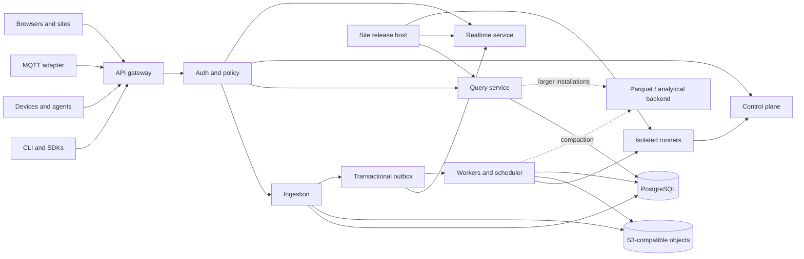

# OpenDrop: Design for an Open-Source Programmable Data Drop

**Status:** Concept design  
**Version:** 0.1  
**Date:** 2026-07-23  
**Working name:** OpenDrop  
**Audience:** maintainers, contributors, operators, product designers, and early adopters

---

## Contents

- [Executive summary](#1-executive-summary)
- [Problem, product thesis, goals, and principles](#2-problem-statement)
- [Conceptual model and user experience](#7-conceptual-model)
- [Events, schemas, ingestion, queries, and real-time updates](#10-event-model)
- [Functions, rich sites, and IoT/edge](#15-functions-scripts-and-automations)
- [API, identity, architecture, storage, and security](#18-api-design)
- [Operations, standards, PARC ideas, and extensibility](#24-operations-and-deployment)
- [Technology choices, governance, and roadmap](#29-recommended-technology-choices)
- [Acceptance, testing, risks, decisions, and open questions](#34-acceptance-criteria)

---

## 1. Executive summary

OpenDrop is a self-hostable, open-source, CLI-first **programmable data inbox**.

A user should be able to create a drop, pipe data into it, and immediately receive:

- a durable append-only event stream;
- a URL and stable API;
- an inspectable schema;
- time-range and “latest N” queries;
- a generated live page;
- streaming updates;
- export in open formats.

The same drop can later grow—without migrating its data—into a complete data application containing typed streams, saved queries, transformations, alerts, scheduled jobs, device identities, custom APIs, and rich live websites.

The primary product idea is:

> **A drop begins as a place to send data and becomes a portable, programmable, live data object.**

The system should preserve the attractive properties of Wolfram Data Drop: extremely low-friction ingestion, metadata on each entry, semantic interpretation, immediate inspection, time-oriented retrieval, permissions, and a short path from captured data to computation and visualization. It should not attempt to clone Wolfram’s proprietary knowledge base or language. Instead, it should use open standards, open formats, explicit semantic metadata, and plugins.

The recommended first implementation is deliberately conservative:

- a modular monolith for the API, control plane, ingestion, query coordination, and real-time subscriptions;
- PostgreSQL as the first production event store and metadata database;
- S3-compatible object storage for attachments, imports, deployment bundles, and exports;
- a transactional outbox rather than a mandatory message broker;
- Server-Sent Events for the default live protocol;
- isolated script runners, with WASI as the default untrusted runtime and OCI-based Python/Node runtimes as administrator-enabled options;
- static-first websites with scoped live-query bindings and optional server functions;
- an edge agent with local buffering and MQTT support;
- later, optional NATS JetStream and Parquet/DuckDB or another analytical backend for larger installations.

This avoids turning a simple data-drop product into a distributed-systems installation exercise.

---

## 2. Problem statement

Capturing a small amount of live data is still unnecessarily fragmented. A developer commonly has to assemble:

1. an HTTP endpoint;
2. authentication and device credentials;
3. a database;
4. schema validation;
5. time-series queries;
6. file storage;
7. a dashboard;
8. alerting or scheduled jobs;
9. a deployment system for custom presentation;
10. a secure runtime for user code.

Each component is individually available, but the integration cost is high. This is especially visible in laboratories, maker projects, civic sensing, internal tools, education, personal analytics, field research, small industrial systems, and early IoT prototypes.

The opposite failure mode is an integrated platform that is easy only while the user remains inside one vendor’s language, cloud, data model, or UI.

OpenDrop should occupy the middle:

- integrated enough to be useful immediately;
- ordinary enough to work with `curl`, pipes, SQL, JavaScript, Python, MQTT, and Git;
- open enough to self-host, inspect, extend, export, and migrate;
- constrained enough to operate securely.

---

## 3. Reference model and design interpretation

Wolfram Data Drop provides the reference interaction pattern: a databin receives incrementally added entries from APIs and other interfaces; entries carry metadata such as timestamps and source information; data semantics interpret raw values; users can retrieve recent entries or time ranges; and permissions determine who can read or write. Its surrounding platform connects captured data to time-series operations, visualizations, reports, alerts, and APIs. [R1–R5]

OpenDrop should retain the interaction pattern but separate it from any one computation language.

### 3.1 What to preserve

The following ideas are central:

| Reference idea | OpenDrop interpretation |
|---|---|
| One named destination for incremental data | A drop with a default `events` stream |
| Add data from almost anywhere | HTTP, CLI, SDKs, MQTT, imports, forms, and connectors |
| Metadata on each entry | Stable event envelope with event time, ingest time, source, sequence, schema, and provenance |
| Semantic interpretation | JSON Schema plus open semantic extensions and registries |
| Immediate computation and visualization | Saved queries, auto-generated lenses, functions, and live sites |
| Easy sharing | Scoped capabilities, public views, embeds, and exportable snapshots |
| Time-series access | Latest-N, cursor, time-range, windowing, and downsampling |
| Permission control | User, service, device, site, function, and capability identities |

### 3.2 What not to clone

OpenDrop should not attempt to reproduce:

- a universal proprietary entity knowledge base;
- a proprietary symbolic expression format;
- a language-specific object API as the only full-featured interface;
- automatic semantic conversion that silently changes submitted values;
- a hosted-only operating model.

The semantic layer should be explicit, inspectable, versioned, and replaceable.

---

## 4. Product thesis

OpenDrop is not merely a time-series database, dashboard system, serverless runtime, IoT broker, form backend, or static-site host. It is a coherent path through all of them.

A useful product sentence is:

> **Create a URL, send it data, inspect the stream, add meaning, attach behavior, and publish the result.**

The system uses **progressive disclosure**:

1. A beginner needs only `drop create` and `drop put`.
2. A developer can add a schema, saved query, or site.
3. An operator can introduce quotas, identity, retention, and isolated runners.
4. A large installation can replace storage and messaging components without changing the public object model.

The drop is the unit of comprehension, sharing, export, forking, and historical replay.

---

## 5. Goals and non-goals

### 5.1 Goals

OpenDrop should provide:

1. **Fast first success.** A user can create a writable endpoint and see the first event without designing infrastructure.
2. **Excellent CLI ergonomics.** Every important operation works non-interactively, accepts stdin, and has machine-readable output.
3. **Durable append semantics.** An acknowledged event is durably recorded before triggers or visualizations run.
4. **Schema optionality with a growth path.** Schemaless input works; inferred schemas are suggestions; strict contracts are available.
5. **Rich, live presentation.** Every drop has an automatic page and can host a custom site with real-time data bindings.
6. **Safe programmable behavior.** Users can upload scripts, define triggers, schedule jobs, and expose HTTP functions under explicit capabilities and resource limits.
7. **Open data portability.** Data, schemas, code, views, and site configuration can be exported without a vendor account.
8. **IoT suitability.** Constrained and intermittently connected devices can authenticate, batch, buffer, and resume.
9. **Operational simplicity.** A useful installation runs with a small number of conventional dependencies.
10. **Inspectability.** UI actions, function runs, data derivations, permissions, and live updates are explainable.
11. **Reproducibility.** A drop and site can be rendered or replayed at an earlier sequence or time.
12. **Extensibility.** Connectors, semantic types, runtimes, actions, storage engines, and visual lenses have documented plugin contracts.

### 5.2 Non-goals

The first versions should not be:

- a general-purpose cloud hosting service;
- a replacement for a high-volume event-streaming platform;
- a full business-intelligence suite;
- a collaborative notebook environment;
- a universal ontology or natural-language knowledge engine;
- a remote shell or unrestricted container host;
- a safety-critical industrial control plane;
- a globally distributed multi-region database;
- an attempt to make arbitrary code execution part of the ingestion transaction.

These can be integration points or later extensions, but they should not distort the initial design.

---

## 6. Design principles

### 6.1 The simple path must remain simple

A drop always has a default stream named `events`. This command must remain valid even after the product gains advanced features:

```bash
printf '{"temperature_c": 22.8}' | drop put greenhouse
```

Users should not need to understand organizations, schemas, brokers, jobs, views, or deployment releases before the first event.

### 6.2 Raw input is evidence

The system should preserve the submitted representation or a content hash and source asset whenever practical. Parsing, normalization, and semantic conversion must be traceable. Derived values must not erase the evidence from which they came.

### 6.3 Events are logically immutable

Corrections normally append a replacement, retraction, or superseding event. Administrative hard deletion must still exist for privacy, legal, malware, and incident-response requirements. The design is therefore “immutable by ordinary API,” not “physically impossible to delete.”

### 6.4 Data and behavior are siblings, not the same thing

A drop contains streams and can reference behavior, but event storage does not execute arbitrary methods. Functions consume messages through declared interfaces. This preserves the useful “living object” idea without coupling durable data to hidden process memory.

### 6.5 Capabilities before ambient authority

A script begins with no database password, unrestricted network, shared filesystem, or implicit access to every stream. It receives explicit capabilities: read these views, append to these streams, use these secrets, call these destinations, and consume these resources.

### 6.6 Open formats are the exit strategy

The system should prefer JSON, NDJSON, CSV, JSON Schema, CloudEvents-compatible envelopes, OpenAPI, MQTT, Parquet, Arrow-compatible tabular results, OCI artifacts, and ordinary Git repositories. Internal optimizations must not become the only export path.

### 6.7 Inspectability is a product feature

Every generated visualization should reveal its source query. Every UI mutation should be copyable as a CLI command or API request. Every derived value should show its provenance. Every function run should show its input event, code version, capabilities, logs, outputs, and retry history.

### 6.8 Scale must be optional

A single-user installation should not require Kubernetes, Kafka, or a separate analytical cluster. The logical architecture should permit those components later, but the base deployment should be understandable and recoverable by one operator.

---

## 7. Conceptual model

The core resource hierarchy is:

```text
Instance
└── Organization
    └── Drop
        ├── Streams
        ├── Schemas
        ├── Views
        ├── Functions and triggers
        ├── Sites and releases
        ├── Devices
        ├── Assets
        ├── Capabilities
        ├── Snapshots
        └── Audit history
```

### 7.1 Resources

| Resource | Purpose |
|---|---|
| **Organization** | Tenant, ownership, policy, quota, and identity boundary |
| **Drop** | Portable data application; the primary unit of naming, sharing, export, and forking |
| **Stream** | Ordered append-only sequence of events; every drop has `events` by default |
| **Schema** | Immutable, versioned payload contract and semantic metadata |
| **View** | Saved, parameterized, permissionable query; may be live or materialized |
| **Function** | Immutable version of uploaded code and its declared capabilities |
| **Trigger** | Event, schedule, HTTP, manual, or data-quality condition that invokes a function |
| **Site** | Presentation project bound to views and functions |
| **Release** | Immutable deployment of a site or function bundle |
| **Device** | Independently revocable producer identity, metadata record, and optional digital twin |
| **Asset** | Content-addressed blob: image, source import, attachment, build, export, or site file |
| **Capability** | Scoped, revocable authority usable by a person, device, site, or integration |
| **Snapshot** | Stable reference to stream high-water marks and code/site versions |
| **Run** | One invocation of a function, including inputs, outputs, logs, limits, and status |

### 7.2 The drop as a capsule

A drop is more than a database table. Its portable manifest can contain:

```text
drop metadata
stream definitions
schema versions
saved views
quality rules
function source or artifact references
trigger definitions
site source and release references
permissions
retention policy
device descriptions
export manifests
```

Data may be included as a full snapshot, a bounded time range, or only as external content-addressed references.

---

## 8. Primary user experience

### 8.1 CLI quick start

A representative flow:

```bash
# Select or create a server context.
drop context add local http://localhost:8080
drop login

# Create a drop. It automatically receives an "events" stream and generated page.
drop create greenhouse

# Append an event from command-line fields.
drop put greenhouse \
  --set temperature_c=22.8 \
  --set humidity_ratio=0.54

# Append JSON from stdin.
printf '{"temperature_c":23.1,"humidity_ratio":0.56}' |
  drop put greenhouse

# Follow new events.
drop tail greenhouse --follow

# Open the generated web page.
drop open greenhouse
```

The first event should cause the web page to show:

- current event count;
- recent events;
- inferred field names and types;
- an editable schema suggestion;
- sensible chart or map suggestions;
- copyable ingestion snippets;
- live updates without refreshing.

Nothing should require a custom site or script at this stage.

### 8.2 Growing the drop

The same user can later run:

```bash
drop schema propose greenhouse
drop schema edit greenhouse
drop schema mode greenhouse warn

drop view create greenhouse/hourly-temperature \
  --file views/hourly-temperature.sql

drop fn deploy functions/heat-alert \
  --trigger stream:greenhouse/events

drop site deploy site/ --drop greenhouse
```

The product should not force a migration from a “simple bin” model to a separate “application” model. A drop grows in place.

### 8.3 Pipe-friendly behavior

The CLI should follow these rules:

- stdin is accepted wherever an input file is accepted;
- stdout contains primary results; diagnostics go to stderr;
- nonzero exit codes are stable and documented;
- `--json`, `--ndjson`, and `--quiet` are available consistently;
- interactive prompts are disabled when stdin is not a terminal;
- retries do not duplicate events when an idempotency key is present;
- every mutating command supports `--dry-run` where meaningful;
- shell completion is generated from the command schema;
- configuration follows platform-standard config directories;
- environment variables can override context, token, and output mode.

### 8.4 CLI command surface

| Command family | Representative commands |
|---|---|
| Context and auth | `drop context`, `drop login`, `drop whoami` |
| Drops | `drop create`, `drop list`, `drop inspect`, `drop delete`, `drop fork` |
| Ingestion | `drop put`, `drop import`, `drop upload` |
| Reading | `drop get`, `drop tail`, `drop export` |
| Query | `drop query`, `drop view create`, `drop view run` |
| Schema | `drop schema show`, `propose`, `diff`, `promote`, `mode` |
| Functions | `drop fn deploy`, `invoke`, `logs`, `rollback`, `replay` |
| Sites | `drop site dev`, `deploy`, `open`, `logs`, `rollback`, `domain` |
| Access | `drop token create`, `drop share`, `drop policy`, `drop revoke` |
| Devices | `drop device create`, `provision`, `rotate`, `twin`, `command` |
| Operations | `drop doctor`, `drop usage`, `drop audit`, `drop snapshot` |

Aliases may reduce typing, but the long forms should remain explicit and scriptable.

---

## 9. Web console and generated pages

### 9.1 Drop page

A drop’s default page should look approximately like this:

```text
┌─────────────────────────────────────────────────────────────────────┐
│ OpenDrop / field-lab / greenhouse                    ● receiving     │
├─────────────────────────────────────────────────────────────────────┤
│ Live  Data  Schema  Views  Automations  Site  Devices  Access  History │
├─────────────────────────────────────────────────────────────────────┤
│  18,442 events       last event 2s ago       schema: suggested      │
│                                                                     │
│  Temperature                                                      ⋮ │
│  ┌───────────────────────────────────────────────────────────────┐  │
│  │                        live chart                             │  │
│  └───────────────────────────────────────────────────────────────┘  │
│                                                                     │
│  Recent events                                                      │
│  time                 temperature_c   humidity_ratio   source        │
│  14:03:12.120          23.1            0.56             sensor-7     │
│  14:03:07.104          23.0            0.55             sensor-7     │
│                                                                     │
│  [Copy curl] [Copy CLI] [Create alert] [Edit site] [Export]         │
└─────────────────────────────────────────────────────────────────────┘
```

### 9.2 Required sections

**Live** shows current values, recent activity, generated lenses, and connection health.

**Data** offers a virtualized table, time-range picker, filters, field selection, attachment inspection, and download.

**Schema** shows observed and declared types, semantic labels, units, compatibility, rejected events, and quality checks.

**Views** provides a query editor, result preview, parameters, caching policy, and live-update strategy.

**Automations** shows function versions, triggers, schedules, runs, retries, dead letters, and external actions.

**Site** provides release history, preview, routes, domains, logs, data bindings, and a code editor when enabled.

**Devices** shows producer identity, last seen time, reported/desired twin state, clock quality, firmware metadata, and revocation.

**Access** shows effective permissions, capabilities, tokens, public links, and an explanation of why a principal can perform an action.

**History** is the drop’s timeline: schema changes, deployments, policy changes, imports, deletions, and snapshots.

### 9.3 Inspectable generation

Generated elements must be transparent:

- “Why this chart?” shows the inferred type and query.
- “Copy as CLI” emits the equivalent command.
- “Copy as API” emits a complete request.
- “Promote to view” saves a generated query as version-controlled configuration.
- “Edit site” creates a source project from the generated page rather than trapping the user in a visual builder.

---

## 10. Event model

### 10.1 Simple input

The easy endpoint accepts a plain JSON value:

```json
{
  "temperature_c": 23.1,
  "humidity_ratio": 0.56
}
```

The server supplies the event envelope.

### 10.2 Canonical envelope

Internally and on advanced APIs, an event resembles:

```json
{
  "specversion": "1.0",
  "id": "0190e6cf-7d8c-7ab2-a971-0a4c9262d5a1",
  "source": "device:field-lab/sensor-7",
  "type": "io.opendrop.measurement",
  "subject": "field-lab/greenhouse/events",
  "time": "2026-07-23T18:03:12.120Z",
  "datacontenttype": "application/json",
  "data": {
    "temperature_c": 23.1,
    "humidity_ratio": 0.56
  },
  "dropsequence": 18442,
  "dropreceivedat": "2026-07-23T18:03:12.228Z",
  "dropschema": "sha256:34b7...",
  "droptrace": "00-...",
  "dropquality": "accepted"
}
```

The shape is CloudEvents-compatible, with OpenDrop extension attributes. Plain-object ingestion remains the default; advanced clients may submit structured or binary-mode CloudEvents.

### 10.3 Required semantics

Each accepted event has:

- a globally unique event ID;
- a monotonically increasing sequence within its stream;
- an ingestion timestamp assigned by the server;
- an optional observation timestamp supplied by the producer;
- a producer identity or anonymous capability identity;
- a content type;
- a schema version or explicit `untyped` marker;
- provenance metadata;
- an immutable acceptance record.

Ordering is defined by stream sequence, not by device clock. Observation time is used for domain analysis; ingestion time is used for durability and operational ordering.

### 10.4 Idempotency

All write APIs accept an `Idempotency-Key`.

The server stores a bounded key-to-result ledger scoped to the writer and endpoint. Repeating the same key and content returns the original event ID and sequence. Reusing a key with different content returns a conflict.

Device SDKs and the edge agent should generate keys from device identity, local boot/session ID, and local sequence.

### 10.5 Corrections and retractions

An event may include:

```json
{
  "dropsupersedes": "event-id",
  "dropreason": "sensor calibration correction"
}
```

Retraction is a separate event type. Default queries can hide superseded values while provenance views expose the complete history.

### 10.6 Rejected and quarantined input

Schema-invalid, oversized, malicious, or unparsable input is not inserted into the main stream.

Depending on policy, it is:

- rejected without retention;
- retained as a restricted quarantine record;
- redirected to a named dead-letter stream;
- accepted with warnings in permissive mode.

Quarantine access is more restricted than normal stream access because it may contain secrets, malware, or personal data submitted by an attacker.

---

## 11. Schema and semantic layer

### 11.1 Base format

Payload contracts use JSON Schema. OpenDrop adds extension keywords rather than inventing a closed schema language:

```json
{
  "$schema": "https://json-schema.org/draft/2020-12/schema",
  "type": "object",
  "required": ["temperature", "humidity"],
  "properties": {
    "temperature": {
      "type": "number",
      "x-drop-semantic": "temperature",
      "x-drop-unit": "Cel",
      "x-drop-canonical-unit": "K"
    },
    "humidity": {
      "type": "number",
      "minimum": 0,
      "maximum": 1,
      "x-drop-semantic": "relative-humidity",
      "x-drop-unit": "1"
    },
    "location": {
      "x-drop-semantic": "geo-point",
      "oneOf": [
        {
          "type": "object",
          "required": ["lat", "lon"]
        },
        {
          "type": "string"
        }
      ]
    }
  }
}
```

### 11.2 Schema modes

Each stream has one of four modes:

| Mode | Behavior |
|---|---|
| `open` | Accept valid JSON or declared binary content; observe shape but do not validate |
| `suggest` | Accept input and produce schema/semantic suggestions |
| `warn` | Validate; accept compatible input and attach warnings |
| `strict` | Reject incompatible input before it enters the main stream |

The default is `suggest`.

### 11.3 Inference

Inference examines observed events and proposes:

- primitive and nested types;
- optional versus frequently present fields;
- timestamp-like strings;
- coordinates;
- units indicated by names or values;
- enum candidates;
- identifiers;
- likely sensitive fields;
- chart and form affordances.

Inference never silently promotes itself to a strict schema. A user or policy must approve a version.

### 11.4 Schema evolution

Schema versions are immutable and content-addressed. Promotion creates a new version and records compatibility against prior versions:

- backward compatible;
- forward compatible;
- fully compatible;
- breaking;
- unknown.

A stream can accept multiple schema versions. Saved views state which versions they support and how missing fields are handled.

### 11.5 Semantic registry

The core project should ship a small open registry for:

- time and duration;
- units and quantities;
- geospatial points, paths, and regions;
- currency values;
- identifiers and references;
- media and attachment types;
- quality flags;
- privacy classifications.

Organizations can add namespaced types such as `org.example.vibration-rms`.

Semantic plugins can provide:

- validators;
- parsers;
- canonicalizers;
- renderers;
- form controls;
- chart suggestions;
- indexes;
- query functions.

This is deliberately smaller and more explicit than a universal knowledge engine.

### 11.6 Raw and canonical representations

The platform can retain:

1. submitted representation;
2. parsed representation;
3. canonical representation;
4. derived projections.

The default read API returns the submitted parsed representation. Clients explicitly request canonical values or a named projection. The UI must indicate which representation is shown.

---

## 12. Ingestion interfaces

### 12.1 HTTP

Core endpoints accept:

- a single JSON event;
- NDJSON batches;
- JSON arrays for small batches;
- CSV imports;
- multipart events with attachments;
- CloudEvents structured and binary modes;
- pre-signed blob uploads followed by an event reference.

Preferred authenticated request:

```bash
curl -X POST \
  -H "Authorization: Bearer $DROP_TOKEN" \
  -H "Content-Type: application/json" \
  -H "Idempotency-Key: sensor-7:boot-83:18442" \
  --data '{"temperature_c":23.1}' \
  https://drop.example/v1/drops/field-lab/greenhouse/events
```

A URL-only capability may be enabled for constrained devices, but header credentials are preferred. Proxies and access logs must redact capability paths.

### 12.2 CLI and SDKs

The CLI is a thin, high-quality client of the public API. Official SDKs should initially cover:

- JavaScript/TypeScript;
- Python;
- Go;
- a small C client suitable for embedded gateways.

SDKs must expose the event ID, stream sequence, server receive time, retry status, and request trace ID rather than hiding them.

### 12.3 MQTT

The gateway can map MQTT topics to streams:

```text
drop/{organization}/{drop}/{stream}
```

Authentication determines which topic prefixes a device can publish or subscribe to. MQTT is an adapter, not the internal source of truth. The adapter converts messages into the canonical event envelope, preserving topic, QoS, retained flag, and broker metadata.

### 12.4 Imports

`drop import` handles:

- CSV;
- NDJSON;
- JSON arrays;
- Parquet;
- archived drop bundles;
- connector-defined formats.

Large imports are jobs. The source file becomes a content-addressed asset, and each generated event points to the import job, row or record position, parser version, and schema version.

### 12.5 Forms and email

Schema-generated web forms are a useful early connector. Email ingestion is possible but should be an optional service because sender authentication, attachment handling, spam, and privacy complicate the core deployment.

---

## 13. Query model

### 13.1 Simple event API

The stable simple-read API supports:

- latest N;
- first N;
- sequence range;
- observation-time range;
- ingestion-time range;
- field projection;
- source filter;
- schema-version filter;
- opaque cursor pagination;
- ascending or descending order.

Example:

```bash
drop get greenhouse \
  --since 1h \
  --fields observed_at,temperature_c \
  --limit 500
```

Offsets should not be used for large streams. Cursors encode the stream, sequence boundary, query shape, and snapshot high-water mark.

### 13.2 DropSQL

Analytics use a documented, parameterized SQL subset called **DropSQL**. It includes:

- selection and projection;
- typed field access;
- joins among streams in the same authorized scope;
- time windows;
- aggregates;
- interpolation and resampling extensions;
- geospatial predicates when enabled;
- safe user parameters;
- explicit scan limits.

It excludes filesystem access, arbitrary extension loading, unsafe functions, and backend administration.

A saved view consists of:

```yaml
name: hourly-temperature
parameters:
  from:
    type: timestamp
  to:
    type: timestamp
query: |
  SELECT
    time_bucket('1 hour', observed_at) AS hour,
    avg(temperature) AS mean_temperature
  FROM greenhouse.events
  WHERE observed_at >= :from AND observed_at < :to
  GROUP BY hour
  ORDER BY hour
limits:
  max_scanned_bytes: 100MB
  timeout: 10s
```

The first implementation can compile the supported subset to PostgreSQL. Larger installations may target an analytical backend without changing saved-view contracts.

### 13.3 Output formats

Queries return:

- JSON;
- NDJSON;
- CSV;
- Arrow-compatible tabular streams;
- Parquet export jobs;
- HTML tables for generated pages.

Every response includes a query ID, snapshot/high-water mark, execution statistics, truncation status, and cache status.

### 13.4 Query budgets

Public and embedded views should normally expose saved, parameterized queries rather than arbitrary SQL.

Budgets include:

- maximum scanned bytes;
- maximum result rows and bytes;
- timeout;
- concurrency;
- memory;
- refresh frequency;
- live-subscriber count.

A query that exceeds a budget fails clearly; it is not silently truncated unless the caller explicitly requested a limit.

---

## 14. Real-time model

### 14.1 Default protocol

Server-Sent Events are the default browser protocol because most live views are server-to-client and need simple reconnection. WebSocket support is added for bidirectional applications and device command channels.

An SSE stream carries:

```text
event: append
id: stream-sequence-or-view-cursor
data: {...}

event: invalidate
id: view-version-and-high-water-mark
data: {"view":"hourly-temperature"}

event: policy
data: {"reason":"capability-expired"}
```

Clients resume with `Last-Event-ID`.

### 14.2 Live view strategies

Each view declares one strategy:

| Strategy | Use |
|---|---|
| `append` | Results map directly to newly appended events |
| `delta` | Built-in incremental aggregate can emit a patch |
| `invalidate` | Client is told to refetch at a new high-water mark |
| `materialized` | Background job refreshes a stored result |
| `manual` | No automatic live updates |

The platform should not pretend every arbitrary SQL query can be incrementally maintained.

### 14.3 Backpressure

Slow subscribers receive bounded buffers. When a client falls behind, the server emits an invalidation cursor instead of retaining unlimited per-client state. The client refetches a snapshot and resumes.

---

## 15. Functions, scripts, and automations

### 15.1 Three execution tiers

OpenDrop should support three tiers rather than treating every automation as a general container.

#### Tier A: declarative expressions

For filters, routing, validation, simple transforms, templates, and alert conditions:

- DropSQL;
- a bounded expression language;
- CloudEvents-compatible filtering;
- no arbitrary I/O.

This tier is fast, auditable, and safe enough to run close to ingestion.

#### Tier B: WASI components

The default untrusted programmable runtime:

- no ambient filesystem or network authority;
- explicit host functions for querying, emitting events, state, secrets, logs, and actions;
- CPU, memory, wall-clock, output, and invocation limits;
- immutable artifact per version;
- deterministic replay mode where supported.

#### Tier C: isolated OCI runtimes

Python, Node, R, or custom dependency stacks run in a hardened container or microVM pool:

- administrator opt-in;
- no host mounts;
- read-only root filesystem;
- ephemeral writable scratch;
- seccomp and namespace isolation;
- egress proxy;
- separate worker nodes for multi-tenant deployments;
- stronger limits and lower default concurrency.

A self-hosting administrator can choose a simpler trust model, but the public architecture must not assume trusted scripts.

### 15.2 Function manifest

```yaml
apiVersion: drop.open/v1alpha1
kind: Function
metadata:
  name: heat-alert
spec:
  runtime: python
  entrypoint: handler.py:handle

  trigger:
    type: stream
    stream: greenhouse/events
    filter: data.temperature_c > 35

  permissions:
    read:
      - view: greenhouse/recent-temperature
    append:
      - stream: greenhouse/alerts
    state:
      - namespace: heat-alert
    secrets:
      - pager-service-token
    actions:
      - notifier: operations-webhook
    network: []

  limits:
    timeout: 5s
    memory: 128MiB
    cpu: 250m
    output: 1MiB

  retry:
    attempts: 8
    backoff: exponential
    deadLetter: greenhouse/function-errors
```

### 15.3 Function API

Representative Python:

```python
from opendrop import Context, Event

def handle(ctx: Context, event: Event) -> None:
    temperature = event.data["temperature_c"]

    if temperature <= 35:
        return

    ctx.emit(
        "greenhouse/alerts",
        {
            "kind": "heat",
            "temperature_c": temperature,
            "source_event": event.id,
        },
        idempotency_key=f"heat:{event.id}",
    )

    ctx.action(
        "operations-webhook",
        {
            "summary": f"Greenhouse temperature is {temperature} C",
            "event_id": event.id,
        },
        idempotency_key=f"notify:heat:{event.id}",
    )
```

The function does not receive a database credential. Platform operations are host calls checked against the manifest.

### 15.4 Delivery and exactly-once platform effects

Trigger delivery is at least once. The platform should make internal effects effectively once per run:

1. A run receives a stable `run_id` derived from trigger, function version, and input event or schedule occurrence.
2. The runner stages `emit`, state mutations, and connector actions.
3. On success it submits a commit request.
4. The control plane atomically:
   - verifies the run has not already committed;
   - appends output events;
   - applies declared state mutations;
   - enqueues external connector actions;
   - advances the trigger checkpoint;
   - records the run result.
5. Repeated commits return the prior result.

Direct unrestricted network calls cannot be made exactly once. The recommended pattern is `ctx.action`, which creates an idempotent, durable connector job with its own retry ledger.

### 15.5 Triggers

Supported trigger types:

- event appended to a stream;
- event matching a filter;
- saved view invalidated;
- schedule or cron;
- HTTP request;
- form submission;
- device status transition;
- manual invocation;
- import completion;
- quality-rule failure.

Functions must never execute synchronously in the default ingestion critical path. A separate bounded validation expression may reject an event before commit.

### 15.6 Build and release pipeline

Source upload and runtime execution are separate:

```text
source + lockfile
        ↓
isolated build
        ↓
tests and policy checks
        ↓
SBOM + content hash + signature
        ↓
immutable function version
        ↓
deployment pointer
```

The platform should also accept prebuilt WASI or OCI artifacts so operators can use an external CI system.

### 15.7 Development and replay

```bash
drop fn dev functions/heat-alert \
  --events fixtures/greenhouse.ndjson

drop fn replay heat-alert \
  --from 2026-07-01 \
  --to 2026-07-02 \
  --branch simulation-7
```

Replay should support:

- a frozen clock;
- deterministic random seed;
- mocked secrets;
- disabled or recorded external actions;
- output to a branch stream;
- comparison against a prior function version.

---

## 16. Rich live websites

### 16.1 Site modes

A drop can be presented in four progressively more powerful modes:

1. **Generated page:** automatic live table, charts, maps, forms, and metadata.
2. **Live document:** Markdown or MDX plus OpenDrop web components.
3. **Static application:** arbitrary HTML/CSS/JavaScript built by the user.
4. **Dynamic application:** static frontend plus scoped server functions and HTTP routes.

### 16.2 Site project

A project can contain:

```text
drop.toml
site/
  index.md
  dashboard.ts
  styles.css
  components/
functions/
  summary.py
views/
  latest.sql
  hourly.sql
schemas/
  readings.json
```

Representative `drop.toml`:

```toml
[project]
name = "greenhouse-monitor"
drop = "field-lab/greenhouse"

[site]
source = "site"
output = "dist"
auth = "public"
snapshot_policy = "latest"

[[bindings]]
name = "latest"
view = "greenhouse/latest"
live = "append"

[[bindings]]
name = "hourly"
view = "greenhouse/hourly-temperature"
live = "invalidate"

[[routes]]
path = "/api/summary"
function = "summary"
methods = ["GET"]
```

### 16.3 Browser client

```ts
import { OpenDrop } from "@opendrop/client";

const drop = new OpenDrop({
  endpoint: window.__OPENDROP_ENDPOINT__,
  capability: window.__OPENDROP_SITE_CAPABILITY__,
});

const hourly = drop.liveView("hourly-temperature", {
  from: "-24h",
  to: "now",
});

hourly.on("snapshot", renderChart);
hourly.on("delta", applyDelta);
hourly.on("invalidate", () => hourly.refresh());
```

The deployed site receives a short-lived capability scoped to declared views and routes. It does not receive the owner’s token.

### 16.4 Framework-neutral live components

The project should ship standards-based web components:

```html
<drop-value view="latest" field="temperature_c"></drop-value>

<drop-line-chart
  view="hourly-temperature"
  x="hour"
  y="mean_temperature">
</drop-line-chart>

<drop-event-table
  stream="events"
  fields="observed_at,temperature_c,humidity_ratio"
  follow>
</drop-event-table>
```

These components should work in plain HTML and coexist with React, Vue, Svelte, or another framework.

### 16.5 Server rendering and routes

Dynamic routes run through the same function/capability model as automations. A route function receives:

- a normalized HTTP request;
- route parameters;
- declared view capabilities;
- scoped secrets;
- a response builder.

It does not receive arbitrary access to the control plane.

Server rendering may be cached by:

- site release;
- route and parameters;
- auth scope;
- view high-water marks;
- explicit time-to-live.

### 16.6 Deployment

`drop site deploy` creates an immutable release containing:

- static artifact hashes;
- build provenance;
- site configuration;
- view bindings;
- function version references;
- required capabilities;
- content-security policy;
- migration or compatibility notes.

Deployment is an atomic pointer change. Rollback changes the pointer to an earlier release.

### 16.7 Preview and branches

Every release can receive an expiring preview URL. A preview can bind to:

- live production data with read-only permissions;
- a snapshot;
- a simulation branch;
- fixture data.

This is essential for testing a redesigned page without accidentally invoking production actions.

### 16.8 Custom domains and embedding

Sites can use custom domains with automatic TLS. Individual lenses can be embedded using read-only, view-scoped capabilities and strict origin policy. Public write capabilities should never be embedded in frontend code.

---

## 17. IoT and edge design

### 17.1 Edge agent

`drop-agent` is a small daemon for gateways and single-board computers. It provides:

- local SQLite spool;
- store-and-forward delivery;
- batching and compression;
- clock-offset and clock-quality metadata;
- token or certificate rotation;
- protocol adapters;
- local transforms and filtering;
- health reporting;
- remote configuration with signed versions;
- safe rollback.

Example configuration:

```yaml
instance: https://drop.example
device: field-lab/gateway-2

sources:
  - name: room-sensors
    type: mqtt
    broker: mqtt://127.0.0.1:1883
    topic: sensors/+/reading

pipeline:
  - decode: json
  - map:
      drop: field-lab/greenhouse
      stream: events
  - batch:
      maxEvents: 100
      maxDelay: 2s

buffer:
  path: /var/lib/drop-agent/spool.db
  maxBytes: 2GB
  overflow: stop-oldest-source
```

### 17.2 Device identity

Each device has an independently revocable identity and narrowly scoped publish/subscribe permissions.

Provisioning options:

- one-time claim code;
- administrator-generated token;
- mutual TLS;
- hardware-backed key when available;
- gateway-delegated identities for constrained leaf devices.

A compromised sensor must not grant access to all devices or the organization.

### 17.3 Digital twin

The optional twin is represented as explicit streams and materialized state:

```text
reported-state   device → platform
desired-state    authorized operator/function → device
commands         platform → device
acknowledgments  device → platform
events           device observations
```

Commands require:

- a distinct permission from event ingestion;
- target identity;
- monotonic command sequence;
- expiration;
- acknowledgment policy;
- audit record;
- optional human approval;
- no generic remote shell.

OpenDrop can import or export W3C Web of Things descriptions so device properties, actions, and events map to known platform affordances. [R12]

### 17.4 Offline behavior

The edge agent preserves local order and event IDs. On reconnect, it submits batches with idempotency keys. The server assigns stream sequence at acceptance.

The UI distinguishes:

- event observation time;
- gateway receipt time;
- server ingestion time;
- estimated clock error;
- delayed upload.

This prevents a disconnected device from appearing to have produced “current” data when it merely uploaded old measurements.

### 17.5 Edge computation

A restricted subset of declarative transforms and WASI functions can run in the agent. Function packages are signed and versioned. Edge outputs record the function version and original event ID so the cloud can reproduce or audit the transformation.

---

## 18. API design

### 18.1 Resource paths

Representative endpoints. The shorter `/v1/drops/{drop}/events` is an ingestion/read alias for the default `events` stream:

```text
POST   /v1/drops
GET    /v1/drops/{drop}
PATCH  /v1/drops/{drop}
DELETE /v1/drops/{drop}

POST   /v1/drops/{drop}/streams
POST   /v1/drops/{drop}/streams/{stream}/events
GET    /v1/drops/{drop}/streams/{stream}/events
POST   /v1/drops/{drop}/streams/{stream}/imports

POST   /v1/drops/{drop}/query
POST   /v1/drops/{drop}/views
GET    /v1/drops/{drop}/views/{view}
GET    /v1/drops/{drop}/views/{view}/live

POST   /v1/drops/{drop}/functions
POST   /v1/drops/{drop}/functions/{function}/versions
POST   /v1/drops/{drop}/functions/{function}/invoke
GET    /v1/drops/{drop}/runs/{run}

POST   /v1/drops/{drop}/sites
POST   /v1/drops/{drop}/sites/{site}/releases
POST   /v1/drops/{drop}/sites/{site}/rollback

POST   /v1/drops/{drop}/capabilities
POST   /v1/drops/{drop}/snapshots
POST   /v1/drops/{drop}/exports
```

### 18.2 API conventions

- OpenAPI is the source of truth for HTTP shape.
- Mutations accept idempotency keys.
- Errors use a consistent problem document containing machine code, human detail, request ID, and relevant field paths.
- List APIs use opaque cursor pagination.
- ETags protect concurrent metadata updates.
- Long-running work returns a job resource.
- Every response includes a trace/request ID.
- Versioning is explicit for incompatible behavior; additive fields do not require a new endpoint version.
- Tokens never appear in normal response logs or analytics.

### 18.3 Capability API

A capability can be constrained by:

- organization, drop, stream, view, function, or route;
- actions such as read, append, query, deploy, invoke, or command;
- time range;
- maximum event size and rate;
- IP or network boundary where appropriate;
- allowed origins for browser use;
- expiration;
- use count;
- parameter bounds;
- required schema;
- device identity.

The console must show the effective policy in plain language.

---

## 19. Authorization and identity

### 19.1 Principal types

- human user;
- group;
- organization role;
- service account;
- device;
- function version;
- site release;
- edge agent;
- share capability;
- anonymous public reader or writer when explicitly enabled.

### 19.2 Policy model

Use a small set of resource actions:

```text
drop.read_metadata
stream.append
stream.read
stream.manage
schema.promote
view.execute
function.deploy
function.invoke
site.deploy
device.command
capability.issue
audit.read
```

RBAC handles common roles. Attribute and capability checks handle narrow access. Functions and sites are principals, not merely code running as the owner.

### 19.3 Public write endpoints

Public writes are high risk. They require a separate ingress capability with:

- payload size cap;
- event rate cap;
- schema or content-type restriction;
- optional per-source quota;
- abuse and anomaly detection;
- quarantine policy;
- revocation without changing the drop identity;
- no read permission by default.

Browser forms can add CAPTCHA or proof-of-work through a connector, but these are not substitutes for rate limits and quotas.

---

## 20. System architecture

### 20.1 Recommended deployment units

The first codebase should compile into a small set of deployable units:

| Unit | Responsibilities |
|---|---|
| `dropd` | HTTP API, auth, control plane, ingestion, simple queries, subscriptions, site gateway |
| `drop-worker` | imports, exports, compaction, materialized views, connector actions, scheduled jobs |
| `drop-runner` | isolated WASI and container execution |
| `drop-agent` | edge collection, buffering, protocol adapters |
| `drop-web` | static console assets, usually served by `dropd` or a CDN |

The code should be modular internally so large operators can split services later.

### 20.2 Logical architecture



### 20.3 Ingestion transaction

For each request:

1. Authenticate the principal.
2. Resolve the target stream and effective policy.
3. Apply rate, size, and content limits.
4. Parse the envelope and payload.
5. Assign event ID if absent.
6. Validate the event and select schema version.
7. Open a database transaction.
8. Reserve the next stream sequence.
9. Insert the accepted event.
10. Insert outbox records for live updates, triggers, indexing, and usage.
11. Commit.
12. Return the event ID, sequence, receive time, and trace ID.

The response is sent only after durable commit. Trigger execution is not part of the request latency.

### 20.4 Transactional outbox

The outbox is the reliability bridge between accepted events and asynchronous work. A worker claims records with leases, publishes or processes them, and marks completion. Crashes result in replay.

This permits a base installation without a broker. At larger scale, outbox workers publish to NATS JetStream or another configured event bus. The broker is an implementation detail; stream sequence in the event store remains authoritative.

### 20.5 Storage responsibilities

**PostgreSQL** stores:

- organizations and identity references;
- drops, streams, schemas, views, functions, triggers, sites, and policy;
- accepted event rows in the first production version;
- run and action ledgers;
- outbox;
- audit metadata;
- usage and retention state.

**Object storage** stores:

- attachments;
- original import files;
- large raw payloads;
- source and build artifacts;
- site releases;
- exports;
- backups and cold segments.

**Optional analytical storage** stores:

- compacted Parquet segments;
- materialized projections;
- high-volume event tables;
- long-retention aggregates.

### 20.6 Why PostgreSQL first

A single transactional database reduces the number of failure boundaries, makes acknowledged writes and outbox records atomic, simplifies backup and restore, and keeps the first deployment understandable.

The event storage interface must nevertheless be explicit. A large installation may replace event rows with ClickHouse, an Iceberg/Parquet lake, or another backend while PostgreSQL remains the control plane.

### 20.7 Cold storage path

Cold storage is a later optimization, not a prerequisite:

1. A compactor selects a closed sequence range.
2. It writes a sorted Parquet segment with schema and statistics.
3. It records a manifest and checksum.
4. It verifies the segment by reading it.
5. It advances the cold high-water mark transactionally.
6. Retention policy may delete or compress the corresponding hot rows.
7. Queries read cold data through DuckDB workers or another engine and union it with hot rows above the high-water mark.

The manifest, not an object-store listing, is authoritative.

---

## 21. Suggested database model

A simplified event table:

```sql
CREATE TABLE events (
    organization_id UUID NOT NULL,
    drop_id          UUID NOT NULL,
    stream_id        UUID NOT NULL,
    sequence         BIGINT NOT NULL,
    event_id         UUID NOT NULL,
    observed_at      TIMESTAMPTZ,
    received_at      TIMESTAMPTZ NOT NULL,
    producer_id      UUID,
    event_type       TEXT NOT NULL,
    content_type     TEXT NOT NULL,
    schema_id        UUID,
    data             JSONB,
    metadata         JSONB NOT NULL DEFAULT '{}',
    raw_asset_id     UUID,
    content_hash     BYTEA NOT NULL,
    supersedes_id    UUID,
    deleted_at       TIMESTAMPTZ,
    PRIMARY KEY (stream_id, sequence),
    UNIQUE (organization_id, event_id)
);
```

Important indexes:

```sql
CREATE INDEX events_stream_observed
    ON events (stream_id, observed_at, sequence);

CREATE INDEX events_stream_received
    ON events (stream_id, received_at, sequence);

CREATE INDEX events_producer
    ON events (stream_id, producer_id, sequence);
```

JSON indexes should be created selectively from promoted schemas or query workload, not automatically for every key.

A stream record stores its next sequence or uses a sequence allocator. Sequence allocation must avoid a global bottleneck; it is scoped per stream and may allocate bounded blocks when ingestion is distributed.

---

## 22. Storage, retention, and deletion

### 22.1 Retention policy

A stream can declare:

```yaml
retention:
  raw: 30d
  parsed: 180d
  canonical: 180d
  rollups:
    - interval: 1m
      keep: 2y
    - interval: 1h
      keep: forever
  attachments: 30d
```

Policy can be based on time, event count, bytes, or explicit legal hold.

### 22.2 Hard deletion

Hard deletion is an asynchronous privileged operation:

1. authorize and record the request;
2. mark affected records unavailable;
3. cancel or invalidate exports and caches;
4. delete or rewrite hot rows;
5. rewrite affected cold segments;
6. delete unreferenced blobs;
7. preserve a minimal non-content audit record where legally allowed;
8. issue a deletion completion report.

Per-tenant or per-drop encryption keys can accelerate cryptographic erasure, but key deletion does not replace index, cache, replica, or backup lifecycle controls.

### 22.3 Export

Exports support:

- event envelope as NDJSON;
- table projection as CSV;
- Parquet;
- assets plus manifest;
- complete `.dropbundle`;
- schema-only or code-only package;
- a snapshot at a sequence/time.

A complete export contains checksums and enough metadata to import into another compatible server.

---

## 23. Security architecture

### 23.1 Threat model

| Threat | Required controls |
|---|---|
| Leaked human or device token | Narrow scopes, expiration, rotation, hashed token storage, audit, revocation, log redaction |
| Public-ingest abuse | Rate and byte quotas, schema limits, quarantine, anomaly controls, per-capability revocation |
| Cross-tenant data access | Organization keys on every row, database row-level policies where practical, authorization at service boundary, object-prefix isolation |
| Script escape | Separate runner, WASI or hardened container, no host mounts, no ambient network, resource limits, runner patching |
| SSRF and cloud metadata access | Egress proxy, DNS/IP validation, destination allowlists, blocked link-local and metadata ranges |
| Secret exfiltration | Per-function secret grants, handle-based access, egress restrictions, rotation, log redaction |
| Query denial of service | Scan budgets, timeouts, concurrency queues, saved public views, cancellation |
| Duplicate or replayed writes | Idempotency ledger, request timestamps where signed, bounded replay windows |
| Supply-chain compromise | Locked dependencies, isolated builds, artifact hashes, signatures, SBOM, trusted registries |
| Device takeover | Per-device identity, independent revocation, publish-only scopes, fleet anomaly detection |
| Malicious import or attachment | Content limits, type verification, malware scanning hook, isolated preview, no automatic execution |
| Destructive administrator action | Confirmation policy, audit trail, delayed deletion option, backups, restore drills |

### 23.2 Script isolation

User code must run outside the API process. Runners should be replaceable and independently scalable.

Default restrictions:

- no network;
- no inherited environment other than non-secret metadata;
- no writable persistent filesystem;
- no host path mounts;
- read-only code package;
- bounded scratch;
- bounded stdout/stderr;
- bounded child processes or none;
- no privileged containers;
- no access to the container runtime socket;
- no access to database credentials;
- explicit secret and data host calls.

### 23.3 Secret handling

Secrets are never committed to drop source bundles.

A function receives a secret handle. The host can:

- return the value when policy allows;
- perform an action on behalf of the function without revealing the value;
- issue a short-lived downstream credential;
- redact known secret values from logs.

The second and third forms are preferred.

### 23.4 Browser security

Site releases receive:

- strict content-security policy;
- origin-bound, short-lived capabilities;
- separate public and authenticated route scopes;
- CSRF protection for cookie-authenticated mutations;
- no owner credentials in built assets;
- dependency and asset integrity metadata;
- isolated preview domains where possible.

### 23.5 Audit

Audit records cover:

- authentication and token lifecycle;
- policy changes;
- public-link creation;
- schema promotion;
- function and site deployment;
- secret grants;
- device commands;
- imports and exports;
- deletion;
- administrator impersonation or break-glass access.

Audit export should be supported independently of event retention.

---

## 24. Operations and deployment

### 24.1 Deployment profiles

#### Laptop

```text
dropd
SQLite
local object directory
optional local runner
```

Purpose: development, demos, personal projects, tests.

#### Server

```text
one or more dropd instances
PostgreSQL
S3-compatible object storage
drop-worker
drop-runner
reverse proxy / TLS
```

Purpose: teams, laboratories, schools, small fleets, internal services.

#### Cluster

```text
stateless dropd replicas
high-availability PostgreSQL
object storage
NATS JetStream or another event bus
worker pools
separate runner pools
analytical event backend
Kubernetes or equivalent scheduler
```

Purpose: larger multi-tenant or high-ingestion installations.

All profiles expose the same logical API. Features that cannot be safely provided in laptop mode should fail explicitly.

### 24.2 Packaging

The project should publish:

- single binaries where practical;
- container images;
- Docker Compose reference deployment;
- Helm chart;
- systemd units;
- configuration reference;
- backup and restore commands;
- upgrade and compatibility notes.

### 24.3 Observability

The platform emits OpenTelemetry-compatible traces, metrics, and logs. A single request trace should connect:

```text
HTTP or MQTT acceptance
database commit
outbox processing
live notification
trigger invocation
function commit
connector action
site refresh
```

Operators need both instance-level and per-organization usage views.

Key signals include:

- accepted, rejected, and quarantined events;
- ingest latency and commit failures;
- outbox age;
- subscriber lag;
- query scanned bytes and cancellations;
- function queue delay, duration, retries, and limits;
- connector failures;
- object-store errors;
- compaction progress;
- token and policy denials;
- storage by drop and representation.

### 24.4 Backup and recovery

A production plan includes:

- PostgreSQL point-in-time recovery;
- object-store versioning or immutable backup;
- configuration and key backup;
- artifact and manifest consistency checks;
- documented full-instance and single-drop restore;
- periodic restore drills;
- protection against backing up ephemeral or revoked credentials as active secrets.

The durability claim applies only to events acknowledged after a successful commit under the configured replication mode.

### 24.5 Upgrades

- Database migrations are versioned and restartable.
- Event and bundle formats are backward readable.
- Plugin API versions are explicit.
- Runners advertise supported ABI/runtime versions.
- An upgrade preflight command checks database, object store, plugins, bundles, and rollback compatibility.
- Site and function releases remain pinned to their runtime contract until deliberately rebuilt.

---

## 25. Open standards and interoperability

The public contracts should align with established standards:

| Concern | Standard or format | OpenDrop use |
|---|---|---|
| Event envelope | CloudEvents | Accepted and emitted for interoperable event transport |
| Payload validation | JSON Schema | Stream contracts, generated forms, compatibility |
| HTTP description | OpenAPI | Public API, clients, tests, documentation |
| IoT messaging | MQTT 5 | Device and gateway ingestion/subscription |
| Device model | W3C Web of Things Thing Description | Import/export of properties, actions, and events |
| Tabular exchange | Arrow-compatible streams and Parquet | Analytical results and portable bulk export |
| Compute package | WASI and OCI | Sandboxed functions and full dependency runtimes |
| Observability | OpenTelemetry | Traces, metrics, and logs |
| Source | Git | Reviewable site, schema, and function projects |

The project should be compatible rather than dogmatic. For example, simple clients can post plain JSON without constructing a CloudEvent.

---

## 26. PARC-inspired design ideas

The useful Xerox PARC lesson is not a retro graphical style. It is that computing can be a **malleable medium**: users can inspect a running world, redefine how information is presented, and create new behavior inside the same environment. Smalltalk’s message-oriented object model and the Dynabook vision of a programmable personal medium are especially relevant. [R13–R15]

OpenDrop can translate those ideas into modern distributed, security-conscious form.

### 26.1 Message-oriented drops

A drop receives events as messages. Functions subscribe and respond through declared capabilities. The event store is not shared mutable memory. This produces loose coupling and replayable behavior.

### 26.2 Lenses

A **lens** is a named presentation of data:

- table;
- number;
- chart;
- map;
- image wall;
- form;
- narrative;
- custom web component;
- downloadable API representation.

Lenses are first-class, versioned, embeddable objects backed by a view. Users can fork a generated lens and edit its query or code.

### 26.3 Live inspector

Every object has an inspector:

- event inspector;
- schema inspector;
- function inspector;
- policy inspector;
- site binding inspector;
- device inspector;
- provenance inspector.

The inspector is also an editor when the principal has permission. Changes create versions rather than silently altering hidden state.

### 26.4 The system image, rebuilt as a snapshot

Smalltalk systems famously emphasized a live image. OpenDrop should avoid opaque process snapshots but preserve the useful experience through explicit snapshots:

```text
stream high-water marks
schema versions
view versions
function versions
site release
declared state versions
capability set
```

A snapshot can render the site, replay behavior, or create a fork.

### 26.5 Direct manipulation with a code escape hatch

Dragging a field onto a chart should create a visible query and component declaration. Setting an alert in the UI should produce a visible trigger definition. The user can stay in the UI or open the generated source.

### 26.6 End-user programming

A low-code recipe editor can compose:

```text
when event matches condition
→ convert unit
→ append derived event
→ update state
→ notify
```

The recipe has a source representation, tests, version history, and a direct path to a function project.

---

## 27. Additional differentiating ideas

### 27.1 Time-machine URLs

Every generated page and saved view can accept an authorized historical context:

```text
?at_sequence=18442
?snapshot=snap_01...
```

The page displays the data and code versions that were active at that point. This is useful for incident reports, scientific records, demonstrations, and debugging.

### 27.2 “Explain this value”

A value in a chart can open a provenance graph:

```text
raw device message
→ accepted event
→ schema version and unit conversion
→ function version
→ derived event
→ saved view query
→ site release and chart component
```

Each edge is backed by an ID, timestamp, and code/configuration hash.

### 27.3 Fork and remix

```bash
drop fork community/air-quality my-lab/air-quality \
  --snapshot latest \
  --include code,schemas,site \
  --exclude identities,secrets
```

Forking makes example applications, education, reproducible research, and community templates substantially more useful.

### 27.4 Simulation branches

A branch is a separate stream namespace fed by replay, synthetic data, or changed functions. Sites can preview against a branch. Promotion merges configuration, not hidden process state.

### 27.5 Data postcards

A data postcard is a small, signed, immutable publication:

- snapshot or bounded time range;
- selected fields;
- one or more lenses;
- provenance summary;
- optional expiration;
- export button.

It is safer and more reproducible than sharing an unrestricted live stream.

### 27.6 Local-first field annotations

Human annotations, tags, and field notes can use a local-first synchronization model while sensor events remain append-only. This permits offline fieldwork without applying conflict-resolution semantics to measurement events.

### 27.7 Computation receipts

Each function run can produce a signed receipt containing:

- code hash;
- input IDs or snapshot;
- runtime contract;
- capabilities;
- resource usage;
- outputs;
- action IDs;
- result hash.

Receipts support reproducibility and third-party verification without exposing secrets.

### 27.8 Software-defined retention

Retention is a small policy program:

```text
keep raw vibration samples for 7 days
keep anomaly windows for 2 years
keep one-minute aggregates for 1 year
keep manually starred events forever
```

A dry-run view must show exactly which events and assets a policy would remove.

---

## 28. Extensibility

### 28.1 Plugin classes

- ingestion connector;
- protocol adapter;
- semantic type;
- parser and canonicalizer;
- visual lens;
- action/notifier;
- function runtime;
- object store;
- event/query backend;
- identity provider;
- malware scanner;
- export format.

### 28.2 Plugin contract

Plugins declare:

- API version;
- capabilities required;
- configuration schema;
- secret fields;
- resource requirements;
- network destinations;
- health checks;
- supported input/output schemas;
- upgrade compatibility;
- signature and publisher identity.

Untrusted plugins should run out of process. In-process plugins are reserved for trusted, version-pinned core extensions.

### 28.3 Connector actions

External side effects should normally be represented as durable connector jobs:

```yaml
action:
  provider: webhook
  destination: operations
  body:
    event: "${event.id}"
    temperature: "${event.data.temperature_c}"
  idempotencyKey: "heat:${event.id}"
```

This gives the platform consistent retries, audit, redaction, and rate limits.

---

## 29. Recommended technology choices

These are implementation recommendations, not permanent public contracts.

| Area | Recommendation |
|---|---|
| Core server | Go modular monolith |
| CLI and edge agent | Go |
| Sandboxed runner | Rust service embedding Wasmtime |
| Web console | TypeScript |
| Framework-neutral components | Standards-based custom elements |
| Control and initial event store | PostgreSQL |
| Object storage | S3-compatible API; MinIO-compatible local deployment |
| Optional durable bus | NATS JetStream |
| Cold analytical files | Parquet |
| Cold query worker | DuckDB initially |
| Full script runtime | Hardened OCI containers or microVMs |
| Authentication | OIDC plus local bootstrap administrator |
| API | REST/OpenAPI; SSE; optional WebSocket |
| Instrumentation | OpenTelemetry |
| Packaging | binaries, containers, Compose, Helm |

### 29.1 Why a Go core

The core requires reliable networking, concurrency, single-binary distribution, a strong standard library, and broad contributor accessibility. The isolated runner can use Rust where direct Wasmtime integration and a smaller trusted-computing base are more important.

### 29.2 Why an optional bus

NATS JetStream provides stored and replayable messages, making it a reasonable scale-out path, but a mandatory bus would duplicate durability concerns in the first deployment. The PostgreSQL outbox is sufficient until independent consumer scaling or higher fan-out justifies the additional component. [R9]

### 29.3 Why Parquet and DuckDB later

Parquet is a compressed columnar format, and DuckDB can query it with projection and filter pushdown. This makes the pair useful for portable cold storage and analytical scans without making them the first transactional write path. [R7–R8]

### 29.4 Why WASI

WASI’s capability-oriented sandbox matches the function model: a module starts without ambient authority and receives only explicitly granted host capabilities. It should be the default untrusted runtime, while full Python and Node environments remain available through stronger process isolation. [R6]

---

## 30. Repository structure

```text
/
├── cmd/
│   ├── drop/
│   ├── dropd/
│   ├── drop-worker/
│   └── drop-agent/
├── core/
│   ├── auth/
│   ├── drops/
│   ├── streams/
│   ├── schemas/
│   ├── query/
│   ├── realtime/
│   ├── functions/
│   ├── sites/
│   ├── devices/
│   ├── policy/
│   └── audit/
├── runner/
│   ├── wasi/
│   ├── container/
│   └── host-api/
├── web/
│   ├── console/
│   └── components/
├── sdk/
│   ├── js/
│   ├── python/
│   ├── go/
│   └── c/
├── plugins/
│   ├── mqtt/
│   ├── webhook/
│   └── semantics/
├── deploy/
│   ├── compose/
│   ├── helm/
│   └── systemd/
├── api/
│   ├── openapi/
│   └── schemas/
├── docs/
│   ├── design/
│   ├── rfcs/
│   ├── operations/
│   └── security/
└── examples/
```

The server and CLI should derive command/API documentation from machine-readable definitions where practical.

---

## 31. Open-source licensing and governance

A sensible starting model is:

- **AGPL-3.0-or-later** for server-side services, preserving source availability for modified hosted versions;
- **Apache-2.0** for SDKs, CLI libraries, schemas, and web components to maximize adoption;
- a clear plugin exception or separate plugin SDK license if needed;
- Developer Certificate of Origin rather than a broad copyright assignment;
- public RFCs for changes to the event, bundle, plugin, and capability contracts;
- a documented security disclosure process;
- reproducible release artifacts and signed checksums;
- opt-in, documented product telemetry only.

The license choice is strategic and should be confirmed before accepting substantial outside contributions. Apache-2.0 for the entire project is a reasonable alternative when embedding and commercial adoption are more important than preventing closed hosted forks.

Longer term, trademark and core governance should be held by a neutral organization rather than a single hosting vendor.

---

## 32. Implementation roadmap

No phase should require redesigning the public drop, stream, event, schema, view, function, or site concepts.

### Milestone 0: contracts and skeleton

- resource IDs and naming;
- event envelope;
- OpenAPI draft;
- JSON Schema extensions;
- capability vocabulary;
- repository and RFC process;
- single-node development environment;
- conformance fixtures.

### Milestone 1: useful data drop

- organizations and users;
- create/list/inspect drops;
- default stream;
- HTTP and CLI ingestion;
- durable commit and idempotency;
- event reads, cursors, latest-N, and time range;
- generated live page;
- SSE append feed;
- export NDJSON/CSV;
- audit basics;
- Docker Compose deployment.

### Milestone 2: schemas and views

- inference and schema modes;
- schema promotion and compatibility;
- saved DropSQL views;
- query budgets;
- generated charts/forms;
- view-scoped capabilities;
- Parquet export;
- data-quality rules.

### Milestone 3: sites

- static and live-document projects;
- scoped browser client;
- web components;
- immutable releases;
- preview and rollback;
- custom domains;
- snapshot-bound rendering.

### Milestone 4: functions

- declarative trigger tier;
- WASI runner and host API;
- Python container runner for trusted/admin-enabled deployments;
- run ledger, retries, dead letters;
- atomic platform-effect commit;
- secrets and connector actions;
- replay and simulation branches;
- HTTP route functions.

### Milestone 5: devices and edge

- MQTT adapter;
- device identities;
- `drop-agent` with local spool;
- batching and resume;
- twin state;
- command acknowledgments;
- W3C WoT description import/export;
- signed edge functions.

### Milestone 6: scale and federation

- optional NATS fan-out;
- cold Parquet segments and manifests;
- DuckDB query workers or pluggable analytical backend;
- horizontal sequence allocation;
- cross-instance export/import and mirrors;
- richer governance and plugin registry.

---

## 33. First public release cut line

A credible first public release should include:

- self-hosting with a documented Compose deployment;
- CLI login, create, put, tail, get, query, inspect, export;
- JSON and NDJSON ingestion;
- default generated live page;
- schema suggestion and warn/strict modes;
- saved views and view-scoped public sharing;
- SSE;
- static custom site deployment;
- one safe function runtime;
- retries and dead-letter inspection;
- tokens, device credentials, quotas, and audit;
- complete drop export and import;
- backup and restore documentation.

It should explicitly defer:

- multi-region operation;
- arbitrary long-running services;
- collaborative browser IDE features;
- a large connector marketplace;
- automatic natural-language semantics;
- complex stream joins at unbounded scale;
- opaque “AI decides the schema” behavior.

---

## 34. Acceptance criteria

The architecture is successful when the following scenarios work cleanly.

### Scenario A: shell to live page

A new user starts the reference deployment, creates a drop, pipes JSON to it, follows it in the terminal, and sees a live generated page without editing server configuration.

### Scenario B: safe public sensor

An operator issues a publish-only device capability with a rate and schema limit. Revoking it stops one device without rotating all credentials. Duplicate retries do not duplicate events.

### Scenario C: custom data site

A developer creates two saved views, deploys a static JavaScript site bound only to those views, receives live updates, previews against a snapshot, and rolls back a release.

### Scenario D: uploaded script

A developer uploads a function, grants it read access to one view and append access to one alert stream, tests it with fixtures, deploys it, observes retries, and replays historical events into a simulation branch.

### Scenario E: disconnection

An edge agent buffers data while offline, reconnects, uploads in order without duplication, and displays observation time separately from delayed ingestion time.

### Scenario F: exit

An administrator exports a complete drop and imports it into a different OpenDrop installation with streams, schemas, views, functions, site source, and assets intact. Secrets and identities are intentionally excluded or remapped.

### Scenario G: audit and explanation

An operator selects a chart point and traces it to the source event, schema version, function run, saved view, and site release.

---

## 35. Testing strategy

### 35.1 Correctness

- property tests for sequence monotonicity and idempotency;
- schema compatibility fixture suite;
- cursor stability tests;
- event-time versus ingest-time tests;
- hard-delete and retention tests;
- export/import round trips;
- high-water-mark consistency tests.

### 35.2 Failure testing

Kill processes at each boundary:

- after event insert but before outbox insert;
- after transaction commit but before response;
- while an outbox record is leased;
- after function execution but before effect commit;
- during connector delivery;
- during site pointer change;
- during Parquet segment write and manifest commit.

The expected result must be documented for every point.

### 35.3 Security

- sandbox escape regression suite;
- SSRF corpus;
- cross-tenant authorization tests;
- capability attenuation tests;
- malicious import/attachment tests;
- log-secret redaction tests;
- query budget and cancellation tests;
- dependency and artifact verification tests.

### 35.4 Compatibility

- old CLI against new server;
- new CLI against supported old server;
- old bundle import;
- pinned function runtime ABI;
- plugin API conformance;
- SDK-generated request fixtures.

### 35.5 Usability

Track:

- time to first accepted event;
- time to first live page;
- number of concepts encountered before first success;
- recovery from invalid schema and expired token;
- success of copyable CLI/API snippets;
- successful export before account or instance deletion.

---

## 36. Major risks and mitigations

| Risk | Consequence | Mitigation |
|---|---|---|
| Product surface becomes too broad | Slow delivery and inconsistent UX | Preserve the drop path; stage functions, sites, and IoT behind stable core resources |
| Arbitrary code compromises the service | Data breach or host takeover | Out-of-process runners, WASI default, container tier opt-in, explicit capabilities |
| Semantic inference is confidently wrong | Corrupted meaning and misleading charts | Suggestions only, raw retention, visible confidence, human promotion |
| PostgreSQL event rows become expensive | Query and retention pressure | Partitioning, selective indexes, compacted cold path, pluggable backend |
| Live queries overload the database | Noisy-neighbor failures | Saved views, budgets, invalidation protocol, materialization, cache |
| Dual hot/cold storage becomes inconsistent | Missing or duplicate query results | Manifest high-water marks, verification, bounded ownership of sequence ranges |
| Public writes become a spam sink | Cost and unsafe data | Separate capabilities, quotas, quarantine, schema restrictions, revocation |
| Plugin ecosystem fragments contracts | Incompatibility | Versioned plugin API, conformance tests, signed registry, narrow extension points |
| “Easy” UI hides irreversible actions | Data loss or insecure sharing | Explain effective policy, dry-run retention, explicit public-write warnings, audit |
| Local and cluster modes diverge | Bugs and poor portability | Shared conformance suite and same public APIs; explicit unsupported features |

---

## 37. Key architectural decisions

1. **The drop is the primary user object.**
2. **Every drop has a default append-only stream.**
3. **Plain JSON is the easiest input; CloudEvents compatibility is the advanced envelope.**
4. **JSON Schema plus namespaced extensions is the schema and semantic contract.**
5. **PostgreSQL and an outbox form the first durable core.**
6. **A broker is optional, not required for basic correctness.**
7. **Queries have a stable simple API and a bounded SQL subset.**
8. **SSE is the default live transport.**
9. **Functions run asynchronously and out of process.**
10. **WASI is the default untrusted code tier; full language containers are stronger-isolation tiers.**
11. **Internal function effects commit through the control plane, not direct database access.**
12. **Websites bind to scoped views and routes, not owner credentials.**
13. **Device commands are a distinct, audited capability and never a generic shell.**
14. **Export includes data, meaning, behavior, and presentation.**
15. **Snapshots and provenance provide the “live system image” experience without opaque process state.**

---

## 38. Open questions

These require prototypes or governance decisions:

1. Should the public event envelope be strictly CloudEvents-shaped or merely compatible at adapters?
2. Should DropSQL use a custom parser, a PostgreSQL-derived subset, or an analytical engine as its canonical semantics?
3. Which unit registry and semantic namespace should be mandatory in core?
4. How much Python support can be safely enabled in a low-operations self-hosted deployment?
5. Should the first site format be Markdown/MDX, plain web projects, or both?
6. Is AGPL the right server license for the intended contributor and hosting community?
7. How should sequence allocation scale without weakening per-stream order?
8. Which cold analytical backend should be the first officially supported one?
9. Should collaborative editing be implemented in the platform or delegated to Git-based workflows?
10. Which capabilities are safe to attenuate and delegate through share links?
11. How should cryptographic event-chain integrity interact with legitimate deletion?
12. What is the smallest semantic plugin API that still enables useful custom types?

The recommended approach is to prototype questions 1, 2, 4, and 5 before freezing the v1 API.

---

## 39. Conclusion

OpenDrop should feel smaller than its architecture.

At first contact, it is:

```bash
drop create greenhouse
printf '{"temperature_c":23.1}' | drop put greenhouse
drop open greenhouse
```

Underneath, it is a durable event system with open schemas, scoped capabilities, live queries, safe computation, deployable websites, edge buffering, provenance, snapshots, and an exit path.

The distinctive idea is not “another hosted database.” It is a **malleable live data medium**:

- data arrives as messages;
- meaning can be added without losing raw evidence;
- behavior is attached through explicit capabilities;
- presentation is programmable;
- every result is inspectable;
- the whole object can be exported, forked, replayed, and self-hosted.

That combination is close to the spirit of Data Drop, updated with modern open standards, object-capability security, IoT resilience, and the PARC principle that users should be able to reshape the medium itself.

---

## References consulted

- **R1.** Wolfram, *Using the Wolfram Data Drop*.
- **R2.** Wolfram, *Wolfram Data Drop: Universal Data Accumulator*.
- **R3.** Wolfram, *Web API — Adding Data*.
- **R4.** Wolfram, *Databin Contents* and *Data Semantics*.
- **R5.** Wolfram, *Programmatic Access*, *Large Databins*, and *Databin Administration*.
- **R6.** WASI.dev, capability-based sandbox documentation.
- **R7.** DuckDB documentation, reading and querying Parquet.
- **R8.** Apache Parquet and DuckDB documentation on columnar analytical storage.
- **R9.** NATS documentation, JetStream storage and replay.
- **R10.** CloudEvents specification.
- **R11.** JSON Schema and OpenAPI specifications.
- **R12.** W3C, *Web of Things Thing Description 2.0*.
- **R13.** Computer History Museum, *Smalltalk at 50*.
- **R14.** Computer History Museum, *From Smalltalk to Squeak*.
- **R15.** Alan Kay and Adele Goldberg, *Personal Dynamic Media*.
- **R16.** OASIS, *MQTT Version 5.0*.
- **R17.** OpenTelemetry documentation.
