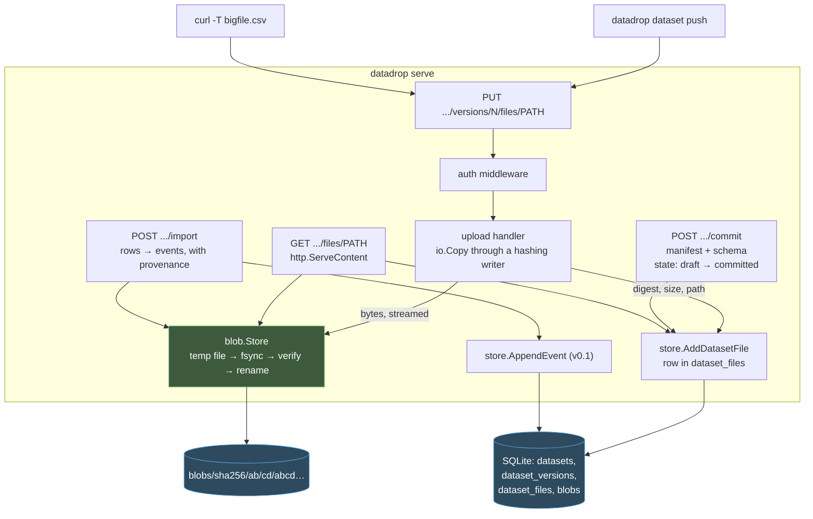
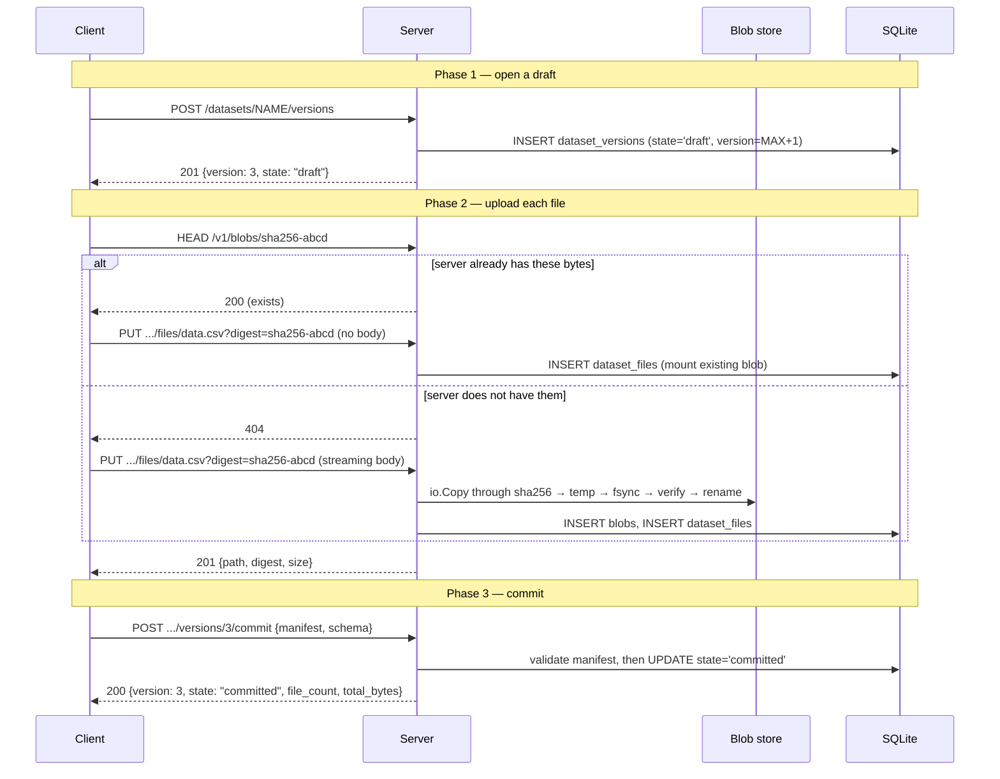

# Dataset upload and retrieval: intern implementation guide

> **Who this is for.** You have read the DATADROP-1 guide, or you have worked on
> the v0.1 event store. You understand drops, streams, events, and the append
> path. You now need to add something the v0.1 model deliberately cannot
> express: a large, finite, immutable body of data with a description attached.
>
> **How to read it.** §1–§4 explain what a dataset *is* and why it cannot be
> modelled as a stream. §5–§13 are the specification — data model, blob store,
> HTTP surface, CLI, package plan. §14 is testing and review. §15 lists what is
> deliberately deferred.
>
> **Implementation status (2026-07-24): built.** All eleven tasks in §13.2 are
> done and the acceptance criteria are automated tests. This guide remains the
> specification and the onboarding path — read it to understand *why* the code
> is shaped as it is — but where it says "you will build", read "the code does".
> Two things changed during implementation and are marked inline: the version
> allocator became a counter on the `datasets` row rather than `MAX(version)+1`
> (§7), and a dataset schema violation is advisory by default during import
> rather than fatal (§11).

---

## Table of contents

1. [The gap in v0.1](#1-the-gap-in-v01)
2. [What a dataset is](#2-what-a-dataset-is)
3. [Why datasets are not streams](#3-why-datasets-are-not-streams)
4. [Design commitments](#4-design-commitments)
5. [Architecture](#5-architecture)
6. [The content-addressed blob store](#6-the-content-addressed-blob-store)
7. [Data model](#7-data-model)
8. [The manifest](#8-the-manifest)
9. [Upload protocol](#9-upload-protocol)
10. [Retrieval](#10-retrieval)
11. [Materializing a dataset into a stream](#11-materializing-a-dataset-into-a-stream)
12. [HTTP and CLI reference](#12-http-and-cli-reference)
13. [Package plan and implementation order](#13-package-plan-and-implementation-order)
14. [Testing and review checklist](#14-testing-and-review-checklist)
15. [Deferred, and why](#15-deferred-and-why)
16. [File reference index](#16-file-reference-index)

---

## 1. The gap in v0.1

v0.1 stores events: small JSON payloads, appended one at a time, ordered by a
server-assigned sequence, queried by count or time window. That model is a good
fit for a sensor emitting a reading every thirty seconds. It is a poor fit — and
in places an actively wrong one — for the other half of what research data looks
like.

Consider a 400 MB CSV of measurements from a completed experiment, a directory
of instrument output files, or a scraped corpus delivered as one NDJSON dump.
Pushing those through `POST /events` fails for four independent reasons:

- **Size.** The ingest path caps request bodies at 1 MiB and buffers the body in
  memory to decode it. Neither is negotiable for a 400 MB file.
- **Granularity.** Splitting a CSV into 18,000 individual events discards the
  fact that they arrived as one artifact. There is then no object to cite, no
  checksum to verify, and no way to say "give me exactly the file that produced
  this analysis".
- **Description.** An event carries `source`, `type`, and `subject`. A dataset
  needs a title, a description, a license, provenance, a row count, and column
  documentation. There is nowhere to put any of that.
- **Immutability with revision.** A stream is append-only and unbounded. A
  dataset is finite and complete, but gets *corrected* — v2 supersedes v1 as a
  whole. The stream model has no notion of a version of the entire body.

DATADROP-2 adds the missing object. The upstream design already names it: an
**asset** is a "content-addressed blob: image, source import, attachment, build,
export, or site file" (§7.1), imports make "the source file a content-addressed
asset" (§12.4), and exports produce "assets plus manifest" (§22.3). This ticket
builds that layer and the dataset object on top of it.

## 2. What a dataset is

A **dataset** is a named, versioned collection of files inside a drop, where
each version carries a manifest describing the contents.

```text
Drop  greenhouse
├── Streams                        ← v0.1: unbounded, append-only, live
│   └── events                        seq 1, 2, 3, …
└── Datasets                       ← v0.2: finite, versioned, immutable
    └── readings-2026
        ├── version 1  (committed)    manifest + readings.csv + README.md
        ├── version 2  (committed)    manifest + readings.csv (corrected)
        └── version 3  (draft)        being uploaded right now
```

The four nouns, precisely:

| Term | Definition |
|---|---|
| **Dataset** | A stable name within a drop. It has no content of its own; it is a container for versions. `greenhouse/readings-2026`. |
| **Dataset version** | An immutable, numbered snapshot: a manifest, an optional schema, and zero or more files. Versions are monotonic and never rewritten. |
| **File** | A logical path (`data/readings.csv`) within a version, pointing at a blob. |
| **Blob** | Bytes, addressed by their SHA-256 digest. Shared across versions, datasets, and drops. |

The separation between *file* and *blob* is the one that does real work, and §6
explains why.

## 3. Why datasets are not streams

It is tempting to model a dataset as a stream whose events happen to be large,
or as a stream with one event per row. Both collapse under load-bearing
requirements, and the reasons are worth stating because they also explain the
shape of the data model.

**A stream's identity is its sequence; a dataset's identity is its content.**
Two events with identical payloads are two distinct events at distinct
positions. Two uploads of identical bytes are the *same blob*, and should occupy
storage once. That difference is not an optimization detail — it determines
whether the primary key is a position or a digest.

**A stream is never complete; a dataset is complete or it is a draft.** Querying
a stream at any moment returns whatever has arrived so far, and that is correct
behaviour. Returning a half-uploaded dataset is never correct: an analysis run
against 300 MB of a 400 MB file produces wrong results silently. The dataset
model therefore needs an explicit commit boundary, and readers must never
observe a version before that boundary.

**A stream's unit of correction is one event; a dataset's is the whole body.**
Correcting a stream appends a superseding event. Correcting a dataset means
replacing the file — every row of it, possibly with a different row count and
different columns. Version numbers on the whole artifact express that; per-row
supersession does not.

**A stream is read incrementally; a dataset is read whole or by byte range.**
The v0.1 read API pages by sequence. A dataset consumer wants either the entire
file streamed to disk, or bytes 100 MB through 150 MB because their download was
interrupted. Those are HTTP `Range` requests, not cursor pagination.

The two models coexist rather than compete, and §11 describes the bridge between
them: a dataset can be *materialized* into a stream, with each row becoming an
event that carries provenance back to the dataset version and row number it came
from.

## 4. Design commitments

These are the properties the implementation must preserve. Each is stated with
what breaks if it is dropped, in the same style as the v0.1 guide §4.3.

**Blobs are addressed by their content hash, never by a location or an
identifier the server invents.** The digest is the integrity check, the
deduplication key, and the citation identity, all at once. If blobs were keyed
by a generated identifier, verifying that a downloaded file is the file that was
uploaded would require a separate checksum column that nothing enforces, and
identical uploads would consume storage repeatedly.

**A version is invisible until it is committed.** Readers resolving `latest`, or
listing versions, must never see a draft. Without this, a consumer can read a
version mid-upload and get a truncated file with no indication that anything is
wrong. Draft state lives in the same table with a `state` column, and every read
path filters on it.

**Committed versions are immutable.** Files cannot be added, replaced, or
removed after commit; a correction is a new version. This is what makes a
digest-plus-version pair a stable citation. Without it, "dataset v2 of
`readings-2026`" is not a reference to anything in particular.

**Uploads and downloads stream; neither side buffers a whole file in memory.**
A 4 GB dataset must work on a server with 512 MB of RAM. This constrains the
implementation more than it appears to: it rules out `io.ReadAll`, rules out
decoding into `[]byte` before hashing, and means the digest must be computed
*while* writing rather than afterwards.

**A blob is never visible at its final path until it is complete and verified.**
Write to a temporary file, fsync, verify the digest, then rename. A crash
mid-upload must leave no partially written blob that a later reader would treat
as complete.

## 5. Architecture

Datasets add one storage medium — the filesystem — alongside the existing SQLite
metadata database. The split follows the upstream design's §20.5: the database
holds descriptions and references, the object store holds bytes.



Two boundaries are worth naming. The blob store knows nothing about datasets,
drops, or manifests — it is a content-addressed key-value store over the
filesystem, and it could be swapped for S3 without touching anything above it.
The dataset store knows nothing about how bytes are persisted — it records
digests and sizes. That separation is what makes the eventual object-storage
backend a contained change.

## 6. The content-addressed blob store

### 6.1 Why content addressing

Addressing a blob by `sha256:abcd…` rather than by a generated identifier buys
four things simultaneously, and it is worth being explicit that they are four
separate benefits rather than one:

- **Deduplication is automatic.** A 2 GB file unchanged between version 1 and
  version 2 is stored once and referenced twice. For datasets that get corrected
  by re-uploading the whole body with one column fixed, this is the difference
  between linear and constant storage growth.
- **Integrity verification is free.** There is no separate checksum to store, to
  keep in sync, or to forget to check. Re-reading the file and re-hashing it
  either produces the address it is stored at, or the file is corrupt.
- **Upload can be skipped.** A client that knows the digest of what it is about
  to send can ask whether the server already has it and skip the transfer
  entirely. This is how container registries avoid re-uploading layers, and it is
  the single largest practical win for repeated dataset publication.
- **The digest is the citation.** `sha256:abcd…` identifies those exact bytes
  independently of this server, this drop, and this dataset name. That is the
  property that makes a dataset reference reproducible.

### 6.2 On-disk layout

```text
<data-dir>/
├── datadrop.db
└── blobs/
    ├── tmp/                        ← in-progress uploads, swept on startup
    │   └── upload-01KYAG…
    └── sha256/
        └── ab/
            └── cd/
                └── abcd1234…       ← the full digest is the filename
```

The two-level fanout on the first four hex characters keeps any single directory
to roughly 65,536 entries at worst. A flat directory with a million files makes
directory reads pathological on most filesystems and makes operational tasks
like listing unusable.

Temporary files live in a sibling directory on the *same filesystem* as the
final location. This is a requirement, not a preference: `os.Rename` is only
atomic within a filesystem. If `tmp/` were on `/tmp` and the blobs on a mounted
volume, the rename would degrade to a copy, and the atomicity guarantee — the
thing that prevents a partial blob from becoming visible — would silently
disappear.

### 6.3 The write path

```
Put(ctx, reader) → (digest, size, error):

    tmp = create a temp file in <root>/tmp/
    defer: if not renamed, remove tmp

    hasher = sha256.New()
    size   = io.Copy(io.MultiWriter(tmp, hasher), reader)   -- streams; no buffering
    digest = "sha256:" + hex(hasher.Sum(nil))

    tmp.Sync()                       -- the bytes are on disk before we claim they are
    tmp.Close()

    final = <root>/sha256/ab/cd/abcd…
    if final already exists:
        remove tmp                   -- dedup: someone already stored these bytes
        return digest, size

    MkdirAll(dirname(final))
    os.Rename(tmp, final)            -- atomic within the filesystem
    return digest, size
```

Four details in that sequence are load-bearing:

**`io.MultiWriter` hashes while writing.** Hashing after the write would require
reading the file back — doubling the I/O — or holding it in memory, which is
excluded by the streaming commitment.

**`Sync` before `Rename`.** Without the fsync, a crash after the rename can leave
a file that exists at its final path with unwritten contents. The rename is
atomic with respect to the directory entry, not with respect to the data.

**Existence check before rename, not before write.** Checking first and skipping
the write introduces a race: two concurrent uploads of the same new blob both
see it missing. Writing unconditionally and discarding on collision is correct
under concurrency and costs one temp file in the rare collision case.

**The temp file is removed on every failure path.** A deferred cleanup that
checks whether the rename happened prevents `tmp/` from accumulating garbage
from interrupted uploads. Startup also sweeps `tmp/`, because a crash bypasses
the defer entirely.

### 6.4 Verifying a client-supplied digest

When a client sends `?digest=sha256:…`, the server must verify rather than
trust. Verification happens after the copy, comparing the computed digest to the
claimed one; on mismatch the temp file is discarded and the request fails with
400.

Trusting a client-supplied digest without verification would let a client poison
the store: upload arbitrary bytes under the digest of a different file, and every
subsequent reader of that digest gets the attacker's content while believing the
hash guarantees otherwise. The whole integrity argument for content addressing
rests on the server being the one that computes the hash.

### 6.5 Garbage collection

Blobs are referenced by `dataset_files` rows. Deleting a version orphans its
blobs. Reference counting in the database is possible but adds a write to every
upload path and is easy to get wrong under concurrency; for v0.2 the simpler and
more auditable approach is an explicit sweep:

```
GC(minAge):
    referenced = SELECT DISTINCT digest FROM dataset_files
    for each blob file on disk:
        if its digest is not in referenced and its mtime is older than minAge:
            delete it
```

The **grace period** is not optional. Without it, a blob written seconds ago into
a draft version whose `dataset_files` row has not yet been inserted is
unreferenced, and would be deleted out from under an in-flight upload. A
one-hour default makes that race impossible in practice.

## 7. Data model

Migration `0002_datasets.sql`. The v0.1 conventions carry over unchanged:
RFC3339 fixed-width text timestamps, JSON stored verbatim with selected fields
extracted into columns for indexing, and audit rows that outlive their subject.

```sql
-- Content-addressed bytes. One row per distinct digest, regardless of how many
-- datasets or versions reference it.
CREATE TABLE blobs (
    digest     TEXT PRIMARY KEY,        -- "sha256:<64 hex chars>"
    size_bytes INTEGER NOT NULL,
    created_at TEXT NOT NULL
);

-- A stable name within a drop. Holds no content itself.
CREATE TABLE datasets (
    drop_name  TEXT NOT NULL REFERENCES drops (name) ON DELETE CASCADE,
    name       TEXT NOT NULL,
    created_at TEXT NOT NULL,
    PRIMARY KEY (drop_name, name)
);

-- An immutable numbered snapshot. `state` is the commit boundary: readers
-- filter on state = 'committed' everywhere, without exception.
CREATE TABLE dataset_versions (
    drop_name    TEXT NOT NULL,
    dataset_name TEXT NOT NULL,
    version      INTEGER NOT NULL,
    state        TEXT NOT NULL,               -- 'draft' | 'committed'
    manifest     TEXT NOT NULL DEFAULT '{}',  -- verbatim JSON
    schema_spec  TEXT,                        -- optional JSON Schema, verbatim
    title        TEXT,                        -- extracted from the manifest
    license      TEXT,                        -- extracted
    row_count    INTEGER,                     -- extracted; NULL when unknown
    file_count   INTEGER NOT NULL DEFAULT 0,
    total_bytes  INTEGER NOT NULL DEFAULT 0,
    created_at   TEXT NOT NULL,
    committed_at TEXT,                        -- NULL while draft
    PRIMARY KEY (drop_name, dataset_name, version),
    FOREIGN KEY (drop_name, dataset_name)
        REFERENCES datasets (drop_name, name) ON DELETE CASCADE
);

CREATE INDEX idx_dataset_versions_state
    ON dataset_versions (drop_name, dataset_name, state, version);

-- A logical path within a version, pointing at a blob.
CREATE TABLE dataset_files (
    drop_name    TEXT NOT NULL,
    dataset_name TEXT NOT NULL,
    version      INTEGER NOT NULL,
    path         TEXT NOT NULL,               -- "data/readings.csv"
    digest       TEXT NOT NULL REFERENCES blobs (digest),
    size_bytes   INTEGER NOT NULL,
    media_type   TEXT,
    PRIMARY KEY (drop_name, dataset_name, version, path),
    FOREIGN KEY (drop_name, dataset_name, version)
        REFERENCES dataset_versions (drop_name, dataset_name, version) ON DELETE CASCADE
);

CREATE INDEX idx_dataset_files_digest ON dataset_files (digest);
```

Three modelling decisions deserve justification.

**`title`, `license`, and `row_count` are extracted from the manifest into
columns.** The manifest is stored verbatim so nothing a user writes is lost, but
listing datasets should not require parsing every manifest. This is the same
pattern v0.1 uses for events: `data` verbatim, envelope fields in columns.

**`state` rather than a separate drafts table.** A draft becomes a committed
version in place, so a state column is one `UPDATE` where two tables would be a
delete plus an insert plus the risk of the version number changing between them.
The cost is that every read path must remember the filter — which is why the
guide states it as a commitment in §4 and the review checklist asks about it in
§14.

**`idx_dataset_files_digest` exists for garbage collection**, which asks "is this
digest referenced anywhere". Without the index that question is a full scan of
every file row on every GC pass.

## 8. The manifest

The manifest is a JSON document describing the version. It is stored verbatim,
so a producer can record whatever their field requires, and a small set of
fields is recognized and indexed.

```json
{
  "title": "Greenhouse readings, 2026 season",
  "description": "Temperature and humidity from sensor-7, 30-second interval.",
  "license": "CC-BY-4.0",
  "source": "device:sensor-7",
  "row_count": 18442,
  "format": "csv",
  "columns": [
    { "name": "observed_at",   "type": "string", "format": "date-time" },
    { "name": "temperature_c", "type": "number", "unit": "Cel" },
    { "name": "humidity",      "type": "number", "unit": "1" }
  ],
  "tags": ["greenhouse", "temperature", "2026"],
  "provenance": {
    "instrument": "DHT22",
    "calibrated_at": "2026-06-01"
  }
}
```

**Recognized fields** (extracted into columns, and type-checked): `title`,
`license`, `row_count`. Everything else is preserved and returned but not
interpreted.

**No field is required.** A dataset uploaded with an empty manifest is legal.
The upstream design's principle that the simple path must stay simple applies
here as much as it does to event ingestion: `datadrop dataset push greenhouse
readings --file data.csv` must work without the user writing any metadata, and
metadata must be addable later by publishing a new version.

The manifest is validated as well-formed JSON at commit time, and the recognized
fields are type-checked. A `row_count` of `"lots"` is a 400 at commit rather
than a surprise when something later tries to use it as a number.

### 8.1 The schema

A version may carry a JSON Schema describing one *record* of the dataset — a CSV
row or an NDJSON line. It is stored verbatim, exactly as stream schemas are in
v0.1, and reuses `pkg/schema` for compilation and validation.

The schema has two uses. It is served on retrieval, so a consumer knows the
shape before downloading 400 MB. And it is applied during materialization (§11),
where each row is validated before becoming an event.

Note what the schema is *not*: it does not validate the file at upload time.
Validating a 400 MB CSV during upload would mean parsing it in the request path,
which conflicts with the streaming commitment and would make upload latency a
function of file size twice over. Validation happens at materialization, where
parsing is happening anyway.

## 9. Upload protocol

### 9.1 Why staged rather than single-shot

The obvious design is one request: `POST` the manifest and the file together as
multipart. It is rejected for three reasons.

A multipart body must be parsed sequentially, so a manifest that appears *after*
the file part cannot be read until the whole file has been consumed — and if the
manifest then turns out to be invalid, 400 MB has already been transferred and
written. Ordering the parts fixes that but relies on client cooperation that
nothing enforces.

Multi-file datasets in one multipart body make partial failure ambiguous. If the
third of five files fails, what state is the version in? With staged uploads,
each file is its own request with its own success or failure, and the version
simply remains a draft until the client commits.

Most importantly, a staged protocol makes the **digest precheck** possible,
which is the difference between re-uploading an unchanged 2 GB file and not.

The protocol is therefore three phases:



### 9.2 The digest precheck

The client hashes the file locally, asks whether the server has that digest, and
skips the transfer if so. This is the largest practical win in the whole ticket
for the common workflow of republishing a dataset with one file changed.

```
push(dataset, files):
    version = POST .../versions                       -- open a draft
    for each local file:
        digest = sha256 of the local file             -- one local read
        if HEAD /v1/blobs/{digest} is 200:
            PUT .../files/{path}?digest={digest}      -- no body: mount it
        else:
            PUT .../files/{path}?digest={digest}      -- stream the bytes
    POST .../versions/{version}/commit  {manifest}
```

The bodyless mount form must still verify that the digest exists *and* record a
`dataset_files` row; it is a metadata operation, not a no-op.

### 9.3 The single-shot convenience form

The staged protocol is correct but verbose for the overwhelmingly common case of
one file with no metadata. A convenience endpoint wraps it:

```
PUT /v1/drops/{drop}/datasets/{name}/data?path=readings.csv
    → opens a draft, uploads the body as one file, commits with an empty manifest
    → returns the committed version
```

This exists so that `curl -T readings.csv` works, which the design's CLI
ergonomics goals require. It is implemented *in terms of* the staged operations
rather than as a parallel path, so there is one commit implementation and one
place where the state transition can be wrong.

### 9.4 What upload must reject

| Condition | Status | Reason |
|---|---|---|
| Version is already committed | `409` | Committed versions are immutable |
| Path already present in this version | `409` | Replacing a file is a new version, not a mutation |
| Computed digest ≠ supplied `?digest=` | `400` | The server hashes; the client asserts; a mismatch is a corrupt transfer |
| Malformed path (absolute, `..`, empty) | `400` | Path traversal; see below |
| Drop or dataset does not exist | `404` | |
| Body exceeds `--max-upload-bytes` | `413` | A separate, much larger cap than the 1 MiB event cap |

**Path validation is a security control, not a formatting nicety.** A logical
path of `../../etc/passwd` must be rejected. Note that logical paths never touch
the filesystem in this design — files are stored under their digest, and the path
is only a database string — which means path traversal cannot escape the blob
directory even if validation were missing. Validation is still required, because
the path *is* used when a client downloads a whole dataset to a local directory,
and that is where traversal becomes exploitable. Reject anything that is
absolute, contains a `..` element, is empty, or contains a NUL byte.

## 10. Retrieval

### 10.1 Serving bytes

Downloading a file is `http.ServeContent` over an `*os.File`, and using the
standard library here rather than hand-rolling is a deliberate choice:

```go
func (s *Server) handleDownloadFile(w http.ResponseWriter, r *http.Request) {
    // … resolve drop, dataset, version, path; authorize …

    file, err := s.blobs.Open(record.Digest)   // *os.File
    defer file.Close()

    w.Header().Set("Content-Type", mediaTypeOr(record, "application/octet-stream"))
    w.Header().Set("ETag", strconv.Quote(record.Digest))
    w.Header().Set("Content-Disposition", contentDisposition(record.Path))

    http.ServeContent(w, r, record.Path, committedAt, file)
}
```

`ServeContent` supplies, correctly and for free:

- **`Range` requests**, including multi-range, so an interrupted 4 GB download
  resumes rather than restarting;
- **`If-None-Match` against the ETag**, so a client that already has the file
  gets a 304 rather than the bytes;
- **`If-Modified-Since`**, correct `Content-Length`, and `Accept-Ranges`.

Hand-rolling `Range` parsing is a well-known source of off-by-one errors and of
subtle incorrectness around unsatisfiable ranges. There is no reason to.

**The ETag is the digest**, which makes it a genuinely strong validator: two
responses with the same ETag are byte-identical by construction, not by
convention.

### 10.2 Resolving `latest`

`latest` resolves to the highest **committed** version:

```sql
SELECT MAX(version) FROM dataset_versions
 WHERE drop_name = ? AND dataset_name = ? AND state = 'committed'
```

The `state` filter is the whole point. A draft version 4 must not shadow
committed version 3 for a reader asking for `latest`; a consumer would otherwise
see a dataset appear to change and then fail to download.

### 10.3 Retrieving a whole dataset

`GET .../versions/{v}/archive` streams the version as a `tar` archive: the
manifest as `manifest.json`, the schema as `schema.json` when present, and every
file at its logical path. `tar` rather than `zip` because it can be written as a
pure stream without seeking back to patch a central directory, which matters
when the total exceeds memory.

This is what makes a dataset portable in the sense the upstream design's §22.3
export requires: one artifact containing the bytes, the description, and the
checksums needed to verify them elsewhere.

## 11. Materializing a dataset into a stream

This is the bridge between the two halves of the product, and it is what the
upstream design's §12.4 specifies: "the source file becomes a content-addressed
asset, and each generated event points to the import job, row or record
position, parser version, and schema version."

```
POST /v1/drops/{drop}/datasets/{name}/versions/{v}/import?path=data.csv&stream=events

for each row in the file:
    payload = decode the row          -- CSV → object using the header row
                                      -- NDJSON → the line itself
    if a schema is attached:
        validate. CHANGED DURING IMPLEMENTATION: permissive is the DEFAULT and
        strict is opt-in via ?strict=true. A bulk operation has a partial-failure
        state that a single append does not: aborting a 100,000-row import on row
        40,000 leaves the stream in a state nobody asked for.

    AppendEvent({
        drop:   drop,
        stream: stream,
        data:   payload,
        meta:   { "dataset": name, "dataset_version": v,
                  "dataset_path": path, "row": n,
                  "digest": "sha256:…" }
    })
```

Every generated event therefore carries a complete provenance chain back to the
exact bytes and the exact row it came from. That is what makes the derived events
auditable, and it is the property the design's §6.2 — raw input is evidence —
requires.

Two design points:

**Import is synchronous and bounded in v0.2.** The upstream design makes large
imports background jobs with progress reporting. v0.2 caps the row count
(`--max-rows`, default 100,000) and returns a summary. A job system is a
different ticket; a bounded synchronous import is useful immediately and does not
prejudge that design.

**Import is not idempotent by default, and this must be documented.** Running it
twice produces two sets of events, because event identifiers are freshly
generated. A client wanting idempotency supplies deterministic identifiers
derived from `(digest, row)` — which the CLI does by default, so that re-running
an interrupted import resumes rather than duplicates. This exploits the v0.1
same-identifier replay behaviour rather than adding new machinery.

## 12. HTTP and CLI reference

### 12.1 HTTP endpoints

All under `/v1`. Write operations require `Authorization: Bearer <token>`; reads
follow the drop's `public_read` flag, exactly as v0.1.

| Method | Path | Purpose |
|---|---|---|
| `GET` | `/v1/drops/{drop}/datasets` | List datasets in a drop |
| `GET` | `/v1/drops/{drop}/datasets/{name}` | Dataset metadata and its committed versions |
| `POST` | `/v1/drops/{drop}/datasets/{name}/versions` | Open a draft version |
| `PUT` | `/v1/drops/{drop}/datasets/{name}/versions/{v}/files/{path...}` | Upload or mount a file |
| `POST` | `/v1/drops/{drop}/datasets/{name}/versions/{v}/commit` | Commit with a manifest and optional schema |
| `DELETE` | `/v1/drops/{drop}/datasets/{name}/versions/{v}` | Delete a version |
| `GET` | `/v1/drops/{drop}/datasets/{name}/versions/{v}` | Version manifest, schema, file list |
| `GET` | `/v1/drops/{drop}/datasets/{name}/versions/{v}/files/{path...}` | Download one file (Range, ETag) |
| `GET` | `/v1/drops/{drop}/datasets/{name}/versions/{v}/archive` | Stream the version as tar |
| `POST` | `/v1/drops/{drop}/datasets/{name}/versions/{v}/import` | Materialize rows into a stream |
| `PUT` | `/v1/drops/{drop}/datasets/{name}/data` | Single-shot: upload one file and commit |
| `HEAD` | `/v1/blobs/{digest}` | Does the server already hold these bytes? |

`{v}` accepts either an integer or the literal `latest`. `{path...}` uses Go
1.22's trailing wildcard so that paths containing slashes work.

### 12.2 Representative exchanges

Opening a draft:

```http
POST /v1/drops/greenhouse/datasets/readings-2026/versions
Authorization: Bearer secret

201 Created
{ "drop": "greenhouse", "dataset": "readings-2026", "version": 3,
  "state": "draft", "created_at": "2026-07-24T18:00:00.000Z" }
```

Uploading:

```http
PUT /v1/drops/greenhouse/datasets/readings-2026/versions/3/files/data/readings.csv?digest=sha256:abcd…
Authorization: Bearer secret
Content-Type: text/csv

<400 MB streamed>

201 Created
{ "path": "data/readings.csv", "digest": "sha256:abcd…",
  "size_bytes": 419430400, "deduplicated": false }
```

Committing:

```http
POST /v1/drops/greenhouse/datasets/readings-2026/versions/3/commit
Content-Type: application/json

{ "manifest": { "title": "Greenhouse readings, 2026 season",
                "license": "CC-BY-4.0", "row_count": 18442 },
  "schema": { "type": "object", "required": ["temperature_c"] } }

200 OK
{ "version": 3, "state": "committed", "file_count": 1,
  "total_bytes": 419430400, "committed_at": "2026-07-24T18:04:12.000Z" }
```

Downloading a byte range:

```http
GET /v1/drops/greenhouse/datasets/readings-2026/versions/latest/files/data/readings.csv
Range: bytes=104857600-209715199

206 Partial Content
Content-Range: bytes 104857600-209715199/419430400
ETag: "sha256:abcd…"
```

### 12.3 CLI

```bash
# Publish a dataset. Hashes locally, skips upload for blobs the server has,
# and commits with the supplied metadata.
datadrop dataset push greenhouse readings-2026 \
    --file data/readings.csv --file README.md \
    --title "Greenhouse readings, 2026 season" \
    --license CC-BY-4.0 \
    --schema schemas/reading.json

# Or supply a complete manifest document.
datadrop dataset push greenhouse readings-2026 --file data.csv --manifest manifest.json

# Inspect.
datadrop dataset list greenhouse
datadrop dataset show greenhouse readings-2026
datadrop dataset show greenhouse readings-2026 --version 2

# Retrieve. Writes files at their logical paths under the output directory.
datadrop dataset get greenhouse readings-2026 --output ./downloaded/
datadrop dataset get greenhouse readings-2026 --version 2 --file data/readings.csv -o -

# Materialize into a stream, with provenance on every event.
datadrop dataset import greenhouse readings-2026 --path data/readings.csv --stream events

# Housekeeping.
datadrop dataset rm greenhouse readings-2026 --version 3
datadrop dataset gc
```

`push` implements the staged protocol internally. `get` verifies each downloaded
file's digest against the manifest before reporting success — the client performs
the same integrity check the server does, so corruption in transit is caught at
the point of use.

## 13. Package plan and implementation order

### 13.1 New and changed packages

```text
pkg/blob/
    store.go          Put (streaming, hashing, atomic), Open, Stat, Exists,
                      Delete, GC, SweepTemp
    digest.go         digest parsing, formatting, path derivation
pkg/datadrop/
    dataset.go        Dataset, DatasetVersion, DatasetFile, Manifest, states
pkg/store/
    datasets.go       CreateDatasetVersion, AddDatasetFile, CommitDatasetVersion,
                      ListDatasets, GetDatasetVersion, ResolveLatest,
                      DeleteDatasetVersion, ReferencedDigests
    migrations/0002_datasets.sql
pkg/server/
    handlers_datasets.go   list / show / open draft / commit / delete
    handlers_blobs.go      upload, download, HEAD, archive
    handlers_import.go     materialization
pkg/client/
    datasets.go       the staged upload flow and download helpers
pkg/cli/
    dataset.go        push / list / show / get / import / rm / gc
```

### 13.2 Task order

The order is chosen so that each step is independently testable and nothing is
built on an unverified foundation.

1. **`pkg/blob`** — the content-addressed store, standalone. Tests cover
   streaming, dedup, digest mismatch, atomicity, temp sweep, and GC's grace
   period. No HTTP, no SQLite.
2. **Migration + domain types** — `0002_datasets.sql` and the `pkg/datadrop`
   structs, including manifest parsing and path validation.
3. **`pkg/store/datasets.go`** — metadata operations with the draft/committed
   state machine. Tests cover version monotonicity, the commit transition,
   immutability rejection, and that draft versions are invisible to every read.
4. **Upload endpoints** — open draft, PUT file with streaming and the mount fast
   path, commit with manifest validation.
5. **Download endpoints** — `ServeContent`, `latest` resolution, `HEAD /v1/blobs`.
6. **Listing and inspection** — datasets, versions, file lists.
7. **Archive** — streaming tar.
8. **CLI** — the staged push, get with verification, and the rest.
9. **Import** — materialization with provenance and deterministic identifiers.
10. **Deletion and GC.**
11. **Tests and docs** — end-to-end smoke covering a multi-file publish, a
    deduplicated republish, a ranged download, and an import.

### 13.3 Configuration

```bash
datadrop serve \
    --db ./datadrop.db \
    --blobs ./blobs \                   # defaults to <db-dir>/blobs
    --max-upload-bytes 5368709120 \     # 5 GiB; separate from --max-body-bytes
    --token secret
```

`--max-body-bytes` (1 MiB) continues to govern JSON request bodies. Upload bodies
need their own, much larger, limit; conflating them would either cripple uploads
or remove the protection that the small cap provides on every other endpoint.

## 14. Testing and review checklist

### 14.1 Test layers

| Layer | What it must establish |
|---|---|
| `pkg/blob` | Identical content yields one file; a mismatched digest is rejected and leaves no blob; an interrupted write leaves no file at the final path; GC respects the grace period; `tmp/` is swept at startup |
| `pkg/store` | Version numbers are monotonic per dataset; a committed version rejects further files; draft versions are invisible to list, show, and `latest`; deleting a version orphans but does not delete blobs |
| `pkg/server` | Upload streams without buffering; the mount path records a row without a body; `Range` returns 206 with the right `Content-Range`; `If-None-Match` on the digest returns 304; `latest` skips drafts |
| `pkg/client` / `pkg/cli` | `push` skips upload when the server has the digest; `get` verifies digests and fails loudly on mismatch |
| End-to-end | Publish two versions sharing an unchanged file, confirm one blob on disk; ranged download; import and verify provenance in event meta |

### 14.2 Review checklist

Correctness:

- [ ] Every read path filters `state = 'committed'`. Every one.
- [ ] `latest` resolves over committed versions only.
- [ ] Committed versions reject file additions with 409.
- [ ] Version numbers are allocated inside the same transaction that inserts the row.
- [ ] Uploading identical bytes twice yields one file on disk and two `dataset_files` rows.

Integrity and safety:

- [ ] The server computes the digest; a client-supplied digest is verified, never trusted.
- [ ] Blobs are written to a temp file on the same filesystem, fsynced, then renamed.
- [ ] Every failure path removes the temp file, and startup sweeps `tmp/`.
- [ ] Logical paths reject absolute paths, `..` elements, empty strings, and NUL bytes.
- [ ] `datadrop dataset get` verifies each file's digest after download.
- [ ] Upload size is capped by `--max-upload-bytes`, separately from `--max-body-bytes`.

Streaming:

- [ ] No upload or download path calls `io.ReadAll` or otherwise holds a file in memory.
- [ ] Download uses `http.ServeContent` rather than hand-rolled `Range` handling.
- [ ] The archive endpoint writes tar as a stream and never buffers the whole archive.

Hygiene:

- [ ] `gofmt`, `make lint`, `make logcopter-check` clean.
- [ ] Errors wrapped with `github.com/pkg/errors`; `context.Context` threaded through.
- [ ] Audit rows written for version creation, commit, and deletion.

## 15. Deferred, and why

| Deferred | Why |
|---|---|
| S3 / object-storage backend | `pkg/blob` is an interface boundary; adding a second implementation is contained and not needed for a single-node appliance. |
| Chunked resumable upload with offsets | `Range` on download plus the digest precheck on upload covers the practical cases. True resumable upload needs a session model that should be designed once, not twice. |
| Parquet, DuckDB, columnar query over datasets | The upstream design places these in a later milestone. Datasets are retrievable and materializable without them. |
| Background import jobs with progress | v0.2 caps import at a row count and returns synchronously. A job system is its own ticket. |
| Reference-counted blob deletion | An explicit `gc` sweep with a grace period is simpler to reason about and to audit than a counter that must be maintained correctly on every path. |
| Signed manifests, citation identifiers | The digest already provides content identity; signing needs a key-management story that does not exist yet. |
| Dataset-level access control | Datasets inherit the drop's `public_read` flag, as streams do. Per-dataset capabilities belong with the v0.2 identity work. |

## 16. File reference index

### 16.1 This ticket

| Path | What |
|---|---|
| `ttmp/2026/07/24/DATADROP-2--*/index.md` | Ticket landing page |
| `ttmp/2026/07/24/DATADROP-2--*/design/01-intern-implementation-guide.md` | **This document** |
| `ttmp/2026/07/24/DATADROP-2--*/reference/01-implementation-diary.md` | Chronological implementation record |
| `ttmp/2026/07/24/DATADROP-2--*/tasks.md` | Task breakdown |

### 16.2 DATADROP-1 material this builds on

| Path | Why it matters here |
|---|---|
| `ttmp/.../DATADROP-1--*/design/02-intern-implementation-guide.md` | The v0.1 conceptual model, conventions, and review checklist |
| `ttmp/.../DATADROP-1--*/sources/opendrop-design.md` §7.1 | The asset concept |
| … §12.4 | Imports, and the provenance requirements for materialized events |
| … §20.5 | The metadata-database / object-storage split |
| … §22.3 | Export as "assets plus manifest" |

### 16.3 Existing code to read first

| Path | Why |
|---|---|
| `pkg/store/store.go` | Migration runner, DSN, time format — all reused unchanged |
| `pkg/store/events.go` | The transactional discipline the dataset store mirrors |
| `pkg/server/handlers_export.go` | The existing streaming-response pattern |
| `pkg/server/middleware.go` | `authorizeRead`, `pathName`, the auth model datasets inherit |
| `pkg/schema/validate.go` | Reused verbatim for dataset schemas |
| `pkg/client/client.go` | The request plumbing the staged upload extends |
