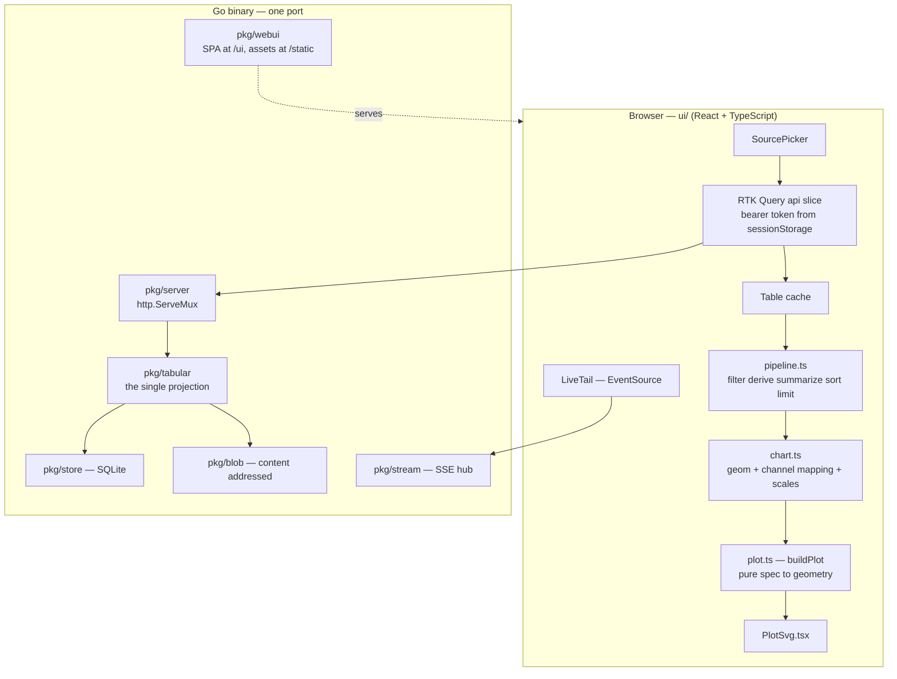
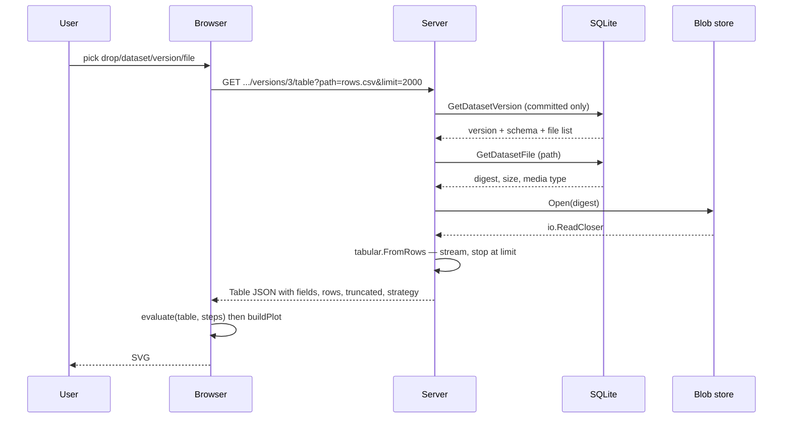
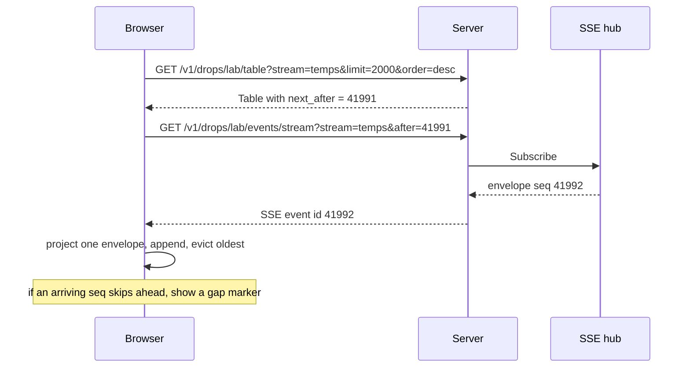

# Web UI visualization workbench: intern implementation guide

> **Audience.** You have just joined the project. You know Go and TypeScript. You
> have never seen this codebase, and you have never implemented a plotting
> library. This guide is written so that you can read it front to back, then open
> the first file and start typing.
>
> **What you should have read first.** The two guides that precede this one:
> `ttmp/2026/07/24/DATADROP-1--*/design/02-intern-implementation-guide.md`
> (the event log, streams, envelopes, SSE) and
> `ttmp/2026/07/24/DATADROP-2--*/design/01-intern-implementation-guide.md`
> (blobs, datasets, versions, manifests). This guide assumes both.

## Table of contents

1. [What you are building](#1-what-you-are-building)
2. [The one idea](#2-the-one-idea)
3. [Current state of the server](#3-current-state-of-the-server)
4. [Why the browser must not infer types](#4-why-the-browser-must-not-infer-types)
5. [Design commitments](#5-design-commitments)
6. [The typed table](#6-the-typed-table)
7. [The row budget](#7-the-row-budget)
8. [Architecture](#8-architecture)
9. [The four new endpoints](#9-the-four-new-endpoints)
10. [Serving the UI from the Go binary](#10-serving-the-ui-from-the-go-binary)
11. [Frontend scaffold and data layer](#11-frontend-scaffold-and-data-layer)
12. [The grammar of graphics, in the browser](#12-the-grammar-of-graphics-in-the-browser)
13. [The plot engine](#13-the-plot-engine)
14. [Live tail](#14-live-tail)
15. [Export and permalink](#15-export-and-permalink)
16. [Testing](#16-testing)
17. [Decision records](#17-decision-records)
18. [Task order and package plan](#18-task-order-and-package-plan)
19. [Deferred, and why](#19-deferred-and-why)
20. [File reference index](#20-file-reference-index)

---

## 1. What you are building

go-go-datadrop currently has no user interface. It has an HTTP API, a Go client,
and a cobra CLI. To look at data you either pipe `datadrop read` into `jq`, or
you download a dataset file and open it in something else. Every question of the
form *"is this sensor drifting?"* or *"what does the distribution of this column
look like?"* requires leaving the system.

DATADROP-3 adds a **visualization workbench**: a single-page web application,
served by the same binary on the same port, that can point at either

- an **event stream** — `GET /v1/drops/lab/events?stream=temps`, an unbounded
  append-only log of JSON envelopes, or
- a **dataset version file** — `GET /v1/drops/lab/datasets/census/versions/3/files/rows.csv`,
  a finite immutable blob with an optional JSON Schema,

and draw a chart from it: scatter, line, bar, area, with colour, size and facet
channels, on top of a small transformation pipeline (filter, derive, summarize,
sort, limit).

The design is directly modelled on an existing artifact,
`/home/manuel/code/wesen/2026-03-29--serve-claude-experiments/imports/pbui-gog.jsx`,
a 2772-line single-file React grammar-of-graphics workbench, and on the ticket
that produced it (`SERVE-20260723-PBUI-GOG`). That artifact is the *proof that
the interaction model works*. This guide is about what changes when the same
model is put on top of a real server instead of three generated mock datasets.

The short answer to what changes: **the server knows things the browser was
previously forced to guess**, and the honest design hands those things over
rather than re-deriving them.

### 1.1 Concretely, at the end of this ticket

```
$ datadrop serve --db ./lab.db --blobs ./blobs
15:04:05 INF datadrop server listening addr=:8080
15:04:05 INF web UI mounted at http://localhost:8080/ui
```

Open `http://localhost:8080/ui`. You get:

- a **source picker** listing every drop, its streams (with event counts), and
  its datasets (with committed versions and their files);
- a **table view** of the selected source, typed, with a banner if it was
  truncated;
- a **pipeline editor** — a stack of steps, each toggleable, each showing what
  the schema looks like after it;
- an **encoding editor** — geom plus the `x`, `y`, `color`, `size`, `facet`
  channels, only offering fields whose type the channel can accept;
- a **plot** rendered as SVG, faceted, with a legend and axis ticks;
- a **live** toggle for stream sources that tails SSE and pushes new rows in;
- **PNG** and **CSV** download, and a permalink that encodes the whole chart
  specification in the URL fragment.

---

## 2. The one idea

Read this section twice. Everything else in the ticket is a consequence of it.

A chart does not consume "a stream" or "a dataset". A chart consumes a **table**:
an ordered list of named, typed columns, plus rows. `geom_point` needs to know
that `x` is quantitative so it can build a linear scale; it does not need to know
that the numbers arrived as CSV cells inside a blob addressed by SHA-256, or as
`data.temp_c` inside a CloudEvents envelope with sequence 41 991.

So the entire feature factors into two halves that meet at one type:

```
        ┌──────────────────────────┐
        │  event stream            │──┐
        └──────────────────────────┘  │   projection      ┌───────────┐
                                      ├──────────────────▶│   Table   │
        ┌──────────────────────────┐  │   (server, Go)    └───────────┘
        │  dataset version file    │──┘                         │
        └──────────────────────────┘                            │ grammar of
                                                                │ graphics
                                                                │ (browser, TS)
                                                                ▼
                                                            ┌───────┐
                                                            │  SVG  │
                                                            └───────┘
```

The left half is a **projection** and it belongs on the server: only the server
holds the bytes, only the server knows the dataset's JSON Schema, and only the
server can apply a row cap before megabytes cross the network. The right half is
a **grammar of graphics** and it belongs in the browser: it is interactive, it
must respond in milliseconds to a dropdown change, and it needs no privileges.

The seam between them is a single JSON document. Nothing else crosses it.

Two consequences worth stating out loud, because they will each save you a day:

1. **There is exactly one place where a source becomes a table.** If you find
   yourself writing a second CSV parser — in the browser, say, because the
   dataset download endpoint already returns CSV bytes — stop. You are about to
   build a system where the chart and the CSV export disagree about what the
   columns are.
2. **The grammar of graphics never learns where a table came from.** The pipeline
   engine, the encoding model and the plot engine take a `Table` and a
   `ChartSpec`. They take nothing else. This is what makes them unit-testable
   without a server, and it is why §12 and §13 can be developed and tested before
   §9 exists.

---

## 3. Current state of the server

Before designing anything, know exactly what is already there. Every claim below
has a file reference; check them.

### 3.1 The route table

`pkg/server/server.go:108-150` registers 21 routes on a plain `*http.ServeMux`.
Per `AGENT.md` there is no third-party router and there will not be one; Go 1.22
pattern syntax (`GET /v1/drops/{name}/events`, and `{path...}` for trailing
wildcards) covers everything.

The relevant existing routes:

| Route | What it gives you |
|---|---|
| `GET /v1/drops` | every drop name |
| `GET /v1/drops/{name}/events` | a page of envelopes, `?stream=&after=&from=&to=&limit=&order=&time_field=` |
| `GET /v1/drops/{name}/events/stream` | SSE, replay-then-tail, `Last-Event-ID` |
| `GET /v1/drops/{name}/export?format=csv` | events flattened to a table — *as bytes* |
| `GET /v1/drops/{name}/datasets` | datasets in a drop |
| `GET /v1/drops/{name}/datasets/{dataset}` | one dataset with its committed versions |
| `GET .../versions/{version}` | one version with its file list |
| `GET .../versions/{version}/files/{path...}` | file bytes, with Range/ETag/304 |

Notice what is missing: **there is no route that lists the streams in a drop.**
Streams are created implicitly by appending to them (`pkg/store/events.go`), so
"what streams exist" is only recoverable from `stream_heads`. The UI's source
picker cannot be built without it. That is task 2.

### 3.2 The flattening rules already exist, in the wrong package

`pkg/server/handlers_export.go:162-297` implements the CSV export. Read
`flattenJSON` and `flattenValue` carefully; their contract is pinned in the
comment at `:157-161`:

- fixed envelope columns first (`id, drop, stream, seq, time, received_at,
  source, type, subject`), then `data.<key>` columns sorted by name;
- nested objects use dotted paths (`data.location.lat`);
- arrays and anything else become compact JSON in the cell;
- a missing value is an empty cell, **not** the string `null`.

The table projection must produce *exactly these columns*. If it does not, then
"download this chart's data as CSV" hands the user a file whose columns do not
match the chart they are looking at. Rather than reimplement the rules and hope,
move `flattenJSON`/`flattenValue` into `pkg/tabular` and have both callers use
them. That is not refactoring for its own sake; it is the mechanism that makes
the two agree.

### 3.3 The row readers already exist, also in the wrong package

`pkg/server/handlers_import.go:274-382` implements `readCSVRows` and
`readNDJSONRows`, used by the dataset-to-stream materializer. They already handle
the awkward parts: ragged rows (`FieldsPerRecord = -1`), blank header cells
(`column_3`), an empty file importing zero rows, and a row cap that reports
truncation rather than hiding it.

`csvValue` at `:335-353` is the piece to read most closely. CSV has no types, so
it converts a cell that parses as a float into a JSON number, `true`/`false` into
a JSON boolean, and leaves everything else a string — while explicitly rejecting
the forms `strconv.ParseFloat` accepts but JSON cannot represent (`0x1p-2`,
infinities). The table projection wants exactly this behaviour, so these three
functions move into `pkg/tabular` alongside the flattener.

### 3.4 Datasets already carry a schema

`pkg/datadrop/dataset.go:57-61`:

```go
// Schema is an optional JSON Schema describing one record of the dataset —
// a CSV row or an NDJSON line. It is applied during materialization, not at
// upload time.
Schema json.RawMessage `json:"schema,omitempty"`
```

This is the single most important fact in the ticket. See §4.

### 3.5 Authentication is a static bearer token

`pkg/server/middleware.go:132-187`. `authenticate` gates mutating endpoints;
`authorizeRead` gates reads, with an exemption for drops marked `public_read`.
There are no sessions, no cookies, and no per-user identity — the audit actor is
the constant string `"token"` precisely so that a credential can never reach a
log line (`:25-30`).

Whatever the UI does about auth, it must not introduce the first cookie. See
DR-4.

### 3.6 The event query already clamps

`pkg/datadrop/query.go:56-60` — `DefaultLimit = 50`, `MaxLimit = 1000`, and
`Normalize()` clamps regardless of what the client asks for. The stream table
endpoint inherits this machinery rather than inventing a parallel one, which
means a table request cannot become a way to bypass the query cap.

---

## 4. Why the browser must not infer types

The grammar of graphics needs each column to be one of three types. The
vocabulary comes from Wilkinson via Vega-Lite, and the whole system uses these
three letters:

| Code | Name | Used for | Scale |
|---|---|---|---|
| `q` | quantitative | continuous magnitudes | linear or log, with a numeric domain |
| `n` | nominal | unordered categories | band / discrete, with a category list |
| `t` | temporal | instants | time axis, ordered, formatted as dates |

The reference artifact infers these by sniffing strings — `pbui-gog.jsx:328-336`:

```js
function inferType(values) {
  const nonEmpty = values.filter((v) => v !== "" && v != null);
  if (!nonEmpty.length) return "n";
  if (nonEmpty.every(isNum)) return "q";
  if (nonEmpty.length >= 3 && nonEmpty.filter(isISODate).length / nonEmpty.length > 0.8) return "t";
  return "n";
}
```

That is the correct design *for that artifact*, which has no server and receives
a CSV file dropped onto a browser window. It is the wrong design here, for three
independent reasons.

**Reason 1 — the answer is already known.** A dataset version can carry a JSON
Schema (§3.4). If it says `{"properties": {"station_id": {"type": "string"}}}`,
then `station_id` is nominal, full stop. A sniffer looking at `["01","02","03"]`
concludes quantitative, plots station identifiers on a linear axis, and draws a
regression through them. The producer wrote down the answer and the system threw
it away.

**Reason 2 — the disagreement is invisible.** Event payloads are JSON, so a
number is *already* a number on the wire. If the browser re-derives types from
the rendered strings, then a payload `{"n": 3}` and a CSV cell `3` are treated
identically — which they are not, because the CSV cell might be a zero-padded
code and the JSON number cannot be. Two components deciding the same question by
different methods will eventually disagree, and nothing will report it.

**Reason 3 — sniffing requires the data.** The whole point of the row budget
(§7) is that the browser sees a *bounded sample*. Type inference on a sample can
be wrong in a way that inference on the whole file would not be — the first 5000
rows of a column may all parse as numbers while row 90 000 holds `"N/A"`. If the
server does the inference it can at least say *how* it decided, and it is the
component in a position to widen the sample later without changing the protocol.

So: **the server produces the typed table, and every field says where its type
came from.**

```json
{"name": "data.temp_c", "type": "q", "inferred_from": "values"}
{"name": "data.station", "type": "n", "inferred_from": "schema"}
{"name": "time",         "type": "t", "inferred_from": "envelope"}
```

`inferred_from` is not decoration. It is what lets the UI say *"typed from the
dataset schema"* versus *"guessed from 500 sampled values"*, and it is what makes
a wrong guess a visible, reportable thing rather than a mystery.

The client may **override** a type — that is a user decision about presentation
and it stays local to the chart spec. The client may not **derive** one.

---

## 5. Design commitments

Five commitments. Each is discharged by a decision record in §17.

1. **One projection.** Every source becomes a `tabular.Table` on the server.
   There is no CSV parser, no NDJSON reader, and no type sniffer in the browser.
   (DR-1)
2. **Types come from the server, with provenance.** Schema beats observation,
   observation beats default, and the field says which happened. (DR-2)
3. **The row budget is explicit and always reported.** A table that was cut off
   says so, in the payload and on the screen. Silence is not an option. (DR-3)
4. **The UI is read-only and cookie-free.** It issues `GET` requests carrying a
   bearer token from `sessionStorage`. No cookie is ever set, so no request is
   ever ambiently authenticated, so CSRF is structurally impossible. (DR-4)
5. **The grammar of graphics is pure.** `evaluate(table, steps)` and
   `buildPlot(table, spec, w, h)` are total functions of their arguments with no
   I/O, no React, and no globals. (DR-5)

---

## 6. The typed table

### 6.1 The type

New package `pkg/tabular`. It imports `pkg/datadrop` and nothing else from this
repository — in particular it must not import `pkg/store` or `pkg/server`, so
that it stays testable without a database.

```go
// FieldType is the visual-encoding type of a column.
type FieldType string

const (
    TypeQuantitative FieldType = "q"
    TypeNominal      FieldType = "n"
    TypeTemporal     FieldType = "t"
)

// TypeSource records how a field's type was decided, so that a wrong guess is
// visible rather than mysterious.
type TypeSource string

const (
    SourceSchema   TypeSource = "schema"   // the dataset version's JSON Schema
    SourceEnvelope TypeSource = "envelope" // a fixed event-envelope column
    SourceValues   TypeSource = "values"   // observed across the sampled rows
    SourceDefault  TypeSource = "default"  // nothing to go on
)

type Field struct {
    Name         string     `json:"name"`
    Type         FieldType  `json:"type"`
    InferredFrom TypeSource `json:"inferred_from"`

    // Distinct is the number of distinct observed values, capped at
    // maxDistinctTracked. It lets the UI warn before it tries to draw a
    // 40 000-category legend.
    Distinct int `json:"distinct,omitempty"`

    // NullCount is how many sampled rows had no value for this column.
    NullCount int `json:"null_count,omitempty"`
}

// Table is the single currency of the visualization layer.
type Table struct {
    Source SourceRef        `json:"source"`
    Fields []Field          `json:"fields"`
    Rows   []map[string]any `json:"rows"`

    RowCount int `json:"row_count"`

    // Truncated reports that the source held more rows than the budget
    // allowed. It is never omitted when true — see §7.
    Truncated bool `json:"truncated"`

    // Strategy names how the returned rows were selected from the source.
    Strategy string `json:"strategy"` // "head" | "latest"

    // NextAfter, for stream sources, is the cursor to resume a live tail from.
    NextAfter int64 `json:"next_after,omitempty"`
}

// SourceRef identifies where a table came from, so a permalink can reopen it.
type SourceRef struct {
    Kind    string `json:"kind"` // "stream" | "dataset"
    Drop    string `json:"drop"`
    Stream  string `json:"stream,omitempty"`
    Dataset string `json:"dataset,omitempty"`
    Version int    `json:"version,omitempty"`
    Path    string `json:"path,omitempty"`
}
```

Two shape decisions worth defending.

**Rows are `[]map[string]any`, not `[][]any`.** A columnar or positional encoding
is smaller on the wire and would be the right call at a hundred thousand rows.
At the row budget we actually ship (§7), the difference is a few hundred
kilobytes, and the map form means a row that is missing a key is simply missing
it rather than needing a null sentinel, and the browser code reads
`row["data.temp_c"]` instead of `row[fieldIndex.get("data.temp_c")]`. Choose the
readable one until measurement says otherwise. The columnar form is listed as a
deferred item in §19 with the exact trigger for revisiting it.

**Field names are the flattened dotted paths**, not the original JSON structure.
`data.location.lat` is a column. This follows §3.2 and it is what makes the CSV
export and the chart agree.

### 6.2 Inference

```
inferFieldType(name, schemaProps, observed) -> (FieldType, TypeSource)

  1. if name is a fixed envelope column:
       "seq"                        -> (q, envelope)
       "time", "received_at"        -> (t, envelope)
       "id","drop","stream","source","type","subject" -> (n, envelope)

  2. if schemaProps has an entry for this column:
       "number" | "integer"         -> (q, schema)
       "boolean"                    -> (n, schema)
       "string" with format
            "date-time"|"date"|"time" -> (t, schema)
       "string"                     -> (n, schema)
       anything else / absent type  -> fall through to 3

  3. across the observed values, ignoring nulls and empty strings:
       none observed                -> (n, default)
       every value is a JSON number -> (q, values)
       every value is a JSON bool   -> (n, values)
       at least 3 values and >80% of them parse as RFC3339
                                    -> (t, values)
       otherwise                    -> (n, values)
```

Getting the *type* right is not the whole job. A schema that declares
`station_id` a string must also reach the **CSV reader**, because `CSVValue`
coerces `"001"` to the number 1 and by the time a row is a JSON object the
original text no longer exists. `ReadOptions.TextColumns` carries the schema's
string columns down to the reader for exactly this reason. Typing a column
correctly while having already destroyed its contents is a subtle way to solve
half a problem.

Notes an intern will trip over:

- **Step 2 only applies to dataset sources.** An event stream may have a schema
  registered (`PUT /v1/drops/{name}/schemas/{stream}`), and it is tempting to use
  it. Do not, in this ticket: the stream schema describes `data`, while the table
  columns include envelope fields and are dotted-path flattened, so the mapping
  from schema property to column name is not the identity. Getting that mapping
  right is a real piece of work; §19 records it as deferred rather than doing it
  badly here.
- **The 80% threshold in step 3 is borrowed from the reference artifact**
  (`pbui-gog.jsx:334`). It exists so that a mostly-dates column with a few
  `"unknown"` entries still gets a time axis. Keep the number; keep the comment
  explaining that it is a tolerance for dirty data, not a confidence measure.
- **`isRFC3339` must be strict.** Go's `time.Parse(time.RFC3339, s)` is the right
  check. Do not use a regex that accepts `2026-13-45`, and do not use a
  heuristic that accepts bare integers as Unix epochs — a column of epoch
  seconds is quantitative until a human says otherwise, because guessing wrong
  turns a perfectly good scatter plot into an unreadable date axis.

### 6.3 The two adapters

```go
// FromEvents projects a page of envelopes into a table.
// Envelope columns first, then flattened data.* columns sorted by name.
func FromEvents(ref SourceRef, events []datadrop.Envelope) (Table, error)

// FromRows projects a delimited or line-oriented file into a table.
// schemaProps may be nil; it is the "properties" object of the version's
// JSON Schema when one exists.
func FromRows(ref SourceRef, r io.Reader, format Format, limit int, schemaProps map[string]PropType) (Table, error)
```

`FromEvents` takes an already-fetched page because the store's query path already
handles ordering, time filters, cursors and the limit clamp; re-implementing any
of that inside `pkg/tabular` would duplicate `pkg/datadrop/query.go`.

`FromRows` takes an `io.Reader` because a dataset file is a blob that may be
gigabytes; it must stream and stop at `limit` rather than read the file into
memory. This is the same commitment the blob store makes in v0.2 and the same
reason `readCSVRows` returns a `truncated` flag instead of an error.

---

## 7. The row budget

A dataset file may be five gigabytes (`server.DefaultMaxUploadBytes`, 5 GiB, at
`pkg/server/server.go:58`). A browser SVG stops being interactive somewhere
around twenty thousand marks. These two numbers do not meet, and pretending they
do is how visualization tools acquire a reputation for hanging.

So there is a **row budget**, and it is a first-class part of the protocol.

```go
// DefaultTableRows is the number of rows a table request returns when the
// caller does not ask for a specific count.
const DefaultTableRows = 2_000

// MaxTableRows is the hard cap. A caller asking for more gets this many and a
// Truncated flag; it is not an error, because "give me everything" is a
// reasonable thing to ask and a 400 would be unhelpful.
const MaxTableRows = 50_000
```

### 7.1 Selection strategy

Given more rows than the budget, which rows do you return? Three options:

| Strategy | Cost | Bias | Verdict |
|---|---|---|---|
| **head** — first *N* in file order | one streaming pass, stop early | strong: you see the beginning of the file | ship it |
| **latest** — last *N* by sequence | free for streams (`order=desc`), impossible for a streaming file read without a second pass | none for "what is happening now" | ship it, for streams only |
| **stride** — every *k*-th row | needs the total row count, so either a full pre-pass or a manifest `row_count` | none for an ordered file | defer |

v0.3 ships **head** for dataset files and **latest** for streams (which is simply
the existing `order=desc` behaviour, and is the right default for a timeseries —
a chart of a live sensor should open showing the recent past, not the first
readings ever taken).

`stride` is genuinely better for "show me the shape of this 10-million-row file",
and the manifest already has an optional `row_count`
(`pkg/datadrop/dataset.go:84`) that would make it a single pass. It is deferred
in §19 with that note, not forgotten.

### 7.2 Truncation is never silent

This project has already made this decision twice. `ImportResult.Truncated`
exists (`pkg/datadrop/dataset.go:198`) with the comment *"Reaching the cap is
reported as Truncated rather than passed over in silence"*. Do the same here, and
carry it all the way to the screen:

- the JSON payload sets `"truncated": true` and names the `"strategy"`;
- the UI renders a persistent amber banner above the chart: *"This chart
  describes a sample, not the whole source. Showing the first 2 000 of at least
  2 000 rows (strategy: head)."*;
- the banner is **not** dismissible, because a user who dismisses it and then
  screenshots the chart has produced a misleading artifact;
- and the source picker carries a **row-budget control** (500 / 2 000 / 10 000 /
  50 000), because the banner tells the user to raise the limit and advice that
  cannot be acted on is worse than no advice.

Note the phrasing "at least". A streaming reader that stops at the cap does not
know the total. Claiming a total you did not count is worse than admitting you
did not count it.

---

## 8. Architecture



Read the diagram for what is *not* there. There is no arrow from `pipe` back to
`routes`: the transformation pipeline never asks the server to do anything. There
is no arrow from the browser to `store`. And `tabular` sits between the routes
and both storage layers, which is the structural expression of DR-1.

### 8.1 Request lifecycle, dataset source



### 8.2 Request lifecycle, stream source with live tail



---

## 9. The four new endpoints

All four are `GET`, all four go through `authorizeRead`, and none of them mutates
anything. Register them in `pkg/server/server.go:Handler()` next to their
siblings.

### 9.1 `GET /v1/drops/{name}/streams`

The source picker needs to know what streams exist. Streams are created
implicitly, so the only record of them is `stream_heads`
(`pkg/store/migrations/0001_init.sql:38-43`), which is exactly the right table:
one row per `(drop, stream)`, holding the last allocated sequence.

```sql
-- pkg/store/events.go
SELECT h.stream,
       h.sequence,
       (SELECT COUNT(*)   FROM events e
          WHERE e.drop_name = h.drop_name AND e.stream = h.stream) AS event_count,
       (SELECT MAX(e.received_at) FROM events e
          WHERE e.drop_name = h.drop_name AND e.stream = h.stream) AS last_received_at
  FROM stream_heads h
 WHERE h.drop_name = ?
 ORDER BY h.stream
```

Response:

```json
{
  "drop": "lab",
  "count": 2,
  "streams": [
    {"stream": "events", "sequence": 12, "event_count": 12, "last_received_at": "2026-07-24T18:03:11.412Z"},
    {"stream": "temps",  "sequence": 41991, "event_count": 41991, "last_received_at": "2026-07-24T19:00:02.004Z"}
  ]
}
```

Two things to get right:

- **`sequence` and `event_count` can differ.** The head is the high-water mark of
  *allocated* sequences; a retention sweep that deletes old rows lowers the count
  and must not lower the head. Report both and label them clearly, because a user
  who sees them diverge has learned something true about their data.
- **The counting subqueries are O(rows).** For a drop with millions of events
  this is a slow endpoint. It is called once when the picker opens, not per
  keystroke. If it becomes a problem the fix is a `?counts=false` parameter, not
  a cached counter table that can drift. Note the cost in the handler comment so
  the next person does not discover it in production.

### 9.2 `GET /v1/drops/{name}/table`

Projects a window of an event stream.

| Parameter | Default | Notes |
|---|---|---|
| `stream` | `events` | normalized by `datadrop.NormalizeStream` |
| `from`, `to` | none | RFC3339, same parsing as the events endpoint |
| `time_field` | `time` | `time` or `received_at`; allowlisted in `ParseTimeField` |
| `after` | none | sequence cursor |
| `order` | `desc` | `desc` gives the "latest N" default |
| `limit` | `DefaultTableRows` | clamped to `MaxTableRows` |

Implementation is short because it reuses everything:

```
handleStreamTable:
    dropName  := pathName(...)                      // validates the name
    authorizeRead(dropName)                          // 401 unless public_read
    query     := s.parseEventQuery(w, r, dropName)   // existing helper
    limit     := parseTableLimit(r)                  // NOT the 1000 event cap

    // Ask for one row MORE than the budget. Getting it back proves a remainder
    // exists; not getting it proves one does not.
    query.Limit    = limit + 1
    query.LimitCap = tabular.MaxTableRows + 1

    if _, err := s.store.GetDrop(...); err != nil { writeStoreError; return }

    events := s.store.QueryEvents(ctx, query)
    truncated := len(events) > limit
    if truncated { events = events[:limit] }

    table := tabular.FromEvents(ref, events)
    table.Truncated = truncated
    table.Strategy  = "latest" if query.Order == desc else "head"
    writeJSON(200, table)
```

Two subtleties, both discovered by a failing test rather than by reasoning.

**The limit clamp.** `parseEventQuery` calls `EventQuery.Normalize()`, which
clamps `Limit` to `datadrop.MaxLimit` (1000) — and so does `QueryEvents`, which
normalizes again. Setting `query.Limit` after `parseEventQuery` is therefore not
enough: the store clamps it straight back. The shipped answer is a new
`EventQuery.LimitCap` field that the handler sets and no URL can, so one query
path and one clamp serve two different budgets. Write a test that asks for 5 000
rows and asserts it gets 5 000 — otherwise the next person to touch `Normalize`
will silently cap every chart at a thousand points and nothing will fail.

**Truncation is answered, not guessed.** Treating a full page as evidence of a
remainder reports truncation for a stream holding exactly `limit` events, which
is a lie in the direction that makes users stop believing the banner. Asking for
`limit + 1` costs one row and gives an exact answer — and it matches
`tabular.FromRows`, where the reader hits EOF and genuinely knows.

Rows are returned in the order the store produced them. For `order=desc` that
means newest first, which is wrong for a line chart; the browser sorts by the `x`
channel anyway (`buildPlot` sorts each line group, §13.4), so do **not** reverse
on the server. Doing it in both places is how you get a chart that is correct
only for one of the two orderings.

### 9.3 `GET /v1/drops/{name}/datasets/{dataset}/versions/{version}/table`

Projects one file of a committed dataset version.

| Parameter | Default | Notes |
|---|---|---|
| `path` | required | the logical path; validated by `ValidateDatasetPath` |
| `format` | from extension, then media type | `csv`, `ndjson`, or `json` |
| `limit` | `DefaultTableRows` | clamped to `MaxTableRows` |

`{version}` accepts `latest`, resolved by the existing `s.resolveVersion` helper
over **committed versions only** — a draft must never reach a reader
(`pkg/datadrop/dataset.go:12-26`).

```
handleDatasetTable:
    drop, dataset := s.datasetPath(...)
    authorizeRead(drop)
    version       := s.resolveVersion(...)            // "latest" -> N
    found         := s.store.GetDatasetVersion(ctx, ..., includeDrafts=false)
    file          := s.store.GetDatasetFile(ctx, ..., path)
    format        := param or formatFromPath(path, file.MediaType)

    props := parseSchemaProperties(found.Schema)      // nil when absent
    body  := s.blobs.Open(blob.Digest(file.Digest))
    defer body.Close()

    table := tabular.FromRows(ref, body, format, limit, props)
    writeJSON(200, table)
```

Three notes:

- **`format=json`** is new — neither the importer nor the export handles a JSON
  *array* file, but datasets frequently are one. `FromRows` should stream-decode
  with `json.Decoder`: read the opening `[`, then `Decode` one element at a time
  with `dec.More()`. Do not `json.Unmarshal` the whole file; that reintroduces
  the memory problem the blob store exists to avoid.
- **`ValidateDatasetPath` still matters here.** As the v0.2 work established,
  `http.ServeMux` cleans URL paths before routing, so traversal in the *path* is
  unreachable — but `path` here is a **query parameter**, which nothing
  normalizes. This is the live vector. Validate it, and write the test against
  the query form, not the URL form.
- **A dataset row has no envelope columns.** Its fields are the CSV header, or
  the flattened keys of each NDJSON/JSON object. Use the same flattener, so a
  nested `{"loc": {"lat": 1}}` becomes `loc.lat` here and `data.loc.lat` in a
  stream table — same rules, different prefix, and the prefix difference is
  visible in the field names rather than hidden.

### 9.4 `GET /v1/drops/{name}/sources`

Optional convenience: one call returning the drop's streams *and* its datasets
with committed versions and file lists, so the picker populates in a single round
trip instead of `1 + 2N`.

```json
{
  "drop": "lab",
  "streams": [ ... as §9.1 ... ],
  "datasets": [
    {"name": "census", "versions": [
        {"version": 3, "committed_at": "...", "file_count": 2, "total_bytes": 660123,
         "files": [{"path": "rows.csv", "size_bytes": 660000, "media_type": "text/csv"}]}
    ]}
  ]
}
```

Build this **last**, and only if the picker actually feels slow. It is pure
aggregation over §9.1 and the existing dataset endpoints; shipping it early means
maintaining a second copy of the response shape before you know you need it.

---

## 10. Serving the UI from the Go binary

### 10.1 Mount points

`AGENT.md` says static files always live under `/static/`. The
`go-web-frontend-embed` skill says the SPA is served at a mount point with a
fallback to `index.html`. Both are satisfiable:

| Path | Handler | Purpose |
|---|---|---|
| `GET /` | redirect (302) to `/ui/` | so `http://localhost:8080` does something useful |
| `GET /ui/{path...}` | SPA handler → `index.html` | every UI route returns the shell |
| `GET /static/{path...}` | file server over the embedded FS | hashed JS/CSS bundles |

Vite is configured with `base: "/static/"` so every asset URL it emits already
points at the right prefix. Nothing under `/v1/` is touched, and because the SPA
handler is registered at `/ui/` rather than `/`, it cannot shadow an API route —
which is the failure mode the skill warns about.

### 10.2 Embed always, override at runtime

*(This section describes what shipped. The design first proposed a pair of
`//go:build embed` / `//go:build !embed` files, per the `go-web-frontend-embed`
skill. That pattern exists to give a developer a disk-backed asset path without
a rebuild — but the Vite dev server on :5173, proxying `/v1` to the Go server,
gives the same thing with hot reload and no build tags at all. Two build
configurations that must both compile is a real cost; a runtime flag is not.)*

```go
// pkg/webui/webui.go

// "all:" matters. Without it embed skips names beginning with "_" or ".", and
// Vite emits such names often enough that a chunk goes missing and the failure
// only appears as a 404 in a browser console.
//
//go:embed all:dist
var assets embed.FS

// Assets returns the filesystem the UI is served from. A non-empty dir serves
// from disk instead, so a running server can be pointed at a fresh build.
func Assets(dir string) fs.FS {
    if dir != "" {
        return os.DirFS(dir)
    }
    sub, err := fs.Sub(assets, "dist")
    if err != nil {
        return assets // unreachable: "dist" is embedded above
    }
    return sub
}
```

`pkg/webui/dist` is committed, which is what makes this work: embedding needs the
files present at compile time, and a `go install` of this module must not require
a JavaScript toolchain. Until `make ui` is first run, `dist/index.html` is a
placeholder that says so — the API starts and serves regardless.

`serve` gains `--ui-dir` (serve from a directory) and `--no-ui` (do not mount the
routes at all).

### 10.3 The build step

`make ui` runs `bun --cwd ui install --frozen-lockfile` then `bun --cwd ui run
build`, and Vite writes straight into `pkg/webui/dist` — no copy step between
`ui/dist` and the Go tree, because a copy step is one more thing that can be
stale.

It is deliberately **not** wired into `make build` or into `go generate ./...`.
Both are run by anyone building the Go module, and neither may require bun.

### 10.4 The SPA handler

```
serveUI(w, r):
    p := strings.TrimPrefix(r.URL.Path, "/ui")
    p = strings.TrimPrefix(p, "/")
    if p == "" { p = "index.html" }

    f, err := fsys.Open(p)
    if err != nil {
        // unknown UI route: return the shell so client-side routing works
        f, err = fsys.Open("index.html")
        if err != nil { 503; return }
    }
    defer f.Close()
    http.ServeContent(w, r, name, modTime, f.(io.ReadSeeker))
```

`http.ServeContent` gives Range, `ETag` and `304` handling for free — the same
function the dataset download path already uses
(`pkg/server/handlers_datasets.go`), for the same reasons.

---

## 11. Frontend scaffold and data layer

### 11.1 Stack and layout

Per `AGENT.md`: bun, React, RTK Query, TypeScript, Bootstrap. Vite is the
bundler; bun is the package manager and task runner.

```
ui/
  package.json
  vite.config.ts          base: "/static/", build.outDir: "dist"
  tsconfig.json
  index.html
  src/
    main.tsx              mount, Bootstrap CSS import
    App.tsx               layout: picker | editors | plot
    api/
      client.ts           RTK Query createApi, prepareHeaders
      types.ts            wire types mirroring pkg/tabular
    model/
      table.ts            Table, Field, FieldType helpers
      pipeline.ts         Step, evaluate, schemaAfter          (pure)
      chart.ts            ChartSpec, defaultChart, channel rules (pure)
      plot.ts             buildPlot                             (pure)
      permalink.ts        encode/decode a spec into the URL hash
    components/
      TokenBar.tsx
      SourcePicker.tsx
      TruncationBanner.tsx
      PipelineEditor.tsx
      EncodingEditor.tsx
      PlotSvg.tsx
      DataTable.tsx
      LiveToggle.tsx
    export/
      png.ts              SVG -> canvas -> PNG blob
      csv.ts              Table -> RFC4180 CSV
  test/
    pipeline.test.ts
    plot.test.ts
    infer.test.ts
```

`model/` has no React import. That is a rule, not a convention: it is what makes
`bun test` able to run the whole grammar of graphics headlessly (§16.2).

### 11.2 The API slice

```ts
export const api = createApi({
  reducerPath: "datadrop",
  baseQuery: fetchBaseQuery({
    baseUrl: "/v1",
    prepareHeaders: (headers) => {
      const token = sessionStorage.getItem("datadrop-token");
      if (token) headers.set("Authorization", `Bearer ${token}`);
      return headers;
    },
  }),
  tagTypes: ["Drops", "Streams", "Datasets", "Table"],
  endpoints: (build) => ({
    listDrops:   build.query<DropList, void>({ query: () => "/drops", providesTags: ["Drops"] }),
    listStreams: build.query<StreamList, string>({ query: (d) => `/drops/${d}/streams` }),
    listDatasets:build.query<DatasetList, string>({ query: (d) => `/drops/${d}/datasets` }),
    streamTable: build.query<Table, StreamTableArgs>({ query: (a) => ({ url: `/drops/${a.drop}/table`, params: a.params }) }),
    datasetTable:build.query<Table, DatasetTableArgs>({
      query: (a) => ({ url: `/drops/${a.drop}/datasets/${a.dataset}/versions/${a.version}/table`, params: a.params }),
    }),
  }),
});
```

`baseUrl: "/v1"` and no `credentials` option, so the browser sends no cookies.
See DR-4.

### 11.3 The token

`TokenBar` is a single input plus a save button. It writes `sessionStorage`. It
never writes `localStorage` (a token that outlives the tab is a token that
outlives the user's attention) and it never puts the token in a URL, a query
parameter, or a permalink.

`fetchBaseQuery` surfaces a 401 as `{status: 401}`; catch it globally and render
a banner reading *"this drop needs a token"* with focus moved to the input,
rather than an empty chart and a console error.

### 11.4 The source picker

Three cascading selects plus a file list:

```
drop      [ lab            ▾ ]
kind      ( ) stream   (•) dataset
dataset   [ census         ▾ ]     version [ 3 (latest) ▾ ]
file      [ rows.csv  660 kB  text/csv ]
                                         [ Load table ]
```

For `kind = stream` the second row becomes a stream select showing
`temps — 41 991 events, last 2 minutes ago`. Loading is explicit — a button, not
an effect on every select change — because each load is a request that can be
expensive and a picker that fires on every keystroke is how you DoS your own
server.

---

## 12. The grammar of graphics, in the browser

This section and the next are ports of `pbui-gog.jsx` with the dataset registry
replaced by a `Table` argument. Read `pbui-gog.jsx:556-660` (the pipeline) and
`:924-1117` (the plot engine) alongside them.

### 12.1 The pipeline

Five step kinds, applied in order, each toggleable:

```ts
type Step =
  | { id: string; kind: "filter";    on: boolean; field: string; op: "=" | "≠" | ">" | "<"; value: string }
  | { id: string; kind: "derive";    on: boolean; name: string; op: "+" | "-" | "*" | "/" | "log10"; a: string; b?: string }
  | { id: string; kind: "summarize"; on: boolean; by: string; fn: "mean" | "sum" | "min" | "max" | "count"; field: string }
  | { id: string; kind: "sort";      on: boolean; field: string; dir: "asc" | "desc" }
  | { id: string; kind: "limit";     on: boolean; n: number };
```

```ts
function evaluate(table: Table, steps: Step[]): { rows: Row[]; fields: Field[]; err: string | null }
```

Semantics, pinned so the tests and the implementation agree:

- **filter** — an unconfigured filter (empty `value`) passes everything rather
  than dropping every row. A filter naming a field that the pipeline no longer
  produces sets `err` and is skipped; it does not throw. Comparisons on a
  quantitative field are numeric, on anything else string-wise.
- **derive** — appends a quantitative field, replacing any existing field of the
  same name. Non-finite results (`0/0`, `log10` of a non-positive number) make
  the row **drop out**. That is the reference behaviour
  (`pbui-gog.jsx:622`) and it is defensible — a chart cannot plot NaN — but it
  is surprising, so the UI shows *"derive removed 12 rows"* next to the step.
- **summarize** — collapses to exactly two columns: the grouping key and the
  aggregate, named `mean_mass_g` or plain `count`. This is a deliberate
  simplification of a real group-by; document it in the step editor
  (*"summarize keeps only the group key and the aggregate"*) so nobody spends an
  afternoon looking for their other columns.
- **sort** — stable, numeric for quantitative fields, `localeCompare` otherwise.
- **limit** — head of the current rows, minimum 1.

`schemaAfter(table, steps, uptoExclusive)` computes only the *field list* after
the first *k* steps, without touching rows. The step editors use it so that step
3's field dropdown offers exactly what steps 1 and 2 produce — including
`mean_mass_g`, which does not exist in the source table.

### 12.2 The chart specification

```ts
type Geom = "point" | "line" | "bar" | "area";
type Channel = "x" | "y" | "color" | "size" | "facet";

interface ChartSpec {
  source: SourceRef;
  steps: Step[];
  geom: Geom;
  mapping: Record<Channel, string | null>;
  yScale: "linear" | "log";
  typeOverrides?: Record<string, FieldType>;  // §4: override, never derive
}
```

`defaultChart(table)` picks something drawable rather than something empty: a
temporal field on `x` if one exists (and then `geom: "line"`), otherwise the
first quantitative field; the first-or-second quantitative field on `y`; a
nominal field on `color`. A workbench that opens on a blank canvas with five
empty dropdowns teaches nothing.

Two ranking rules turned out to be necessary, and both were found by opening the
result rather than by reading the code:

- **Payload columns outrank envelope columns.** "First quantitative field" on a
  stream table is `seq`, and "first nominal field" is `id`. The naive rule
  produced a chart of the row number against time — a straight line that says
  nothing — with a legend holding one entry per row.
- **A colour candidate must have between 2 and 8 distinct values.** The server
  reports `Field.Distinct`, so a 120-value identifier column can be skipped
  instead of producing a legend longer than the chart.

Channel type rules, enforced in the editor by filtering the dropdown rather than
by rejecting a selection:

| Channel | Accepts |
|---|---|
| `x` | any |
| `y` | quantitative only |
| `color` | any; quantitative gets a continuous ramp, otherwise categorical |
| `size` | quantitative only |
| `facet` | nominal or temporal |

---

## 13. The plot engine

`buildPlot(table, spec, W, H, mini)` is a pure function returning **drawable
geometry** — no SVG, no React:

```ts
interface Plot {
  problems: string[];
  panels: Panel[];          // one per facet value
  legend: LegendEntry[];
  xTicks: Tick[];
  yTicks: Tick[];
  padL: number; padB: number; legendW: number;
  rowsOut: number;
}

interface Panel { x0: number; y0: number; w: number; h: number; title: string | null; marks: Mark[] }

type Mark =
  | { kind: "c"; x: number; y: number; r: number; fill: string; row: Row }   // circle
  | { kind: "r"; x: number; y: number; w: number; h: number; fill: string; row: Row } // rect
  | { kind: "p"; d: string; stroke?: string; fill?: string; fillOpacity?: number };   // path
```

Splitting geometry from rendering is what makes the engine testable: a test
asserts *"the point for row 3 lands at x = 214.5"* without a DOM, a browser, or a
snapshot file.

Every mark that corresponds to a single row carries that `row`. `PlotSvg` uses it
for the tooltip and for click-to-filter; the reference artifact uses the same
trick to wrap marks in `<datum>` presentations (`pbui-gog.jsx:928`).

### 13.1 Refuse to draw, with a reason

```
problems = []
if err from evaluate                              -> push it
for each mapped channel not present in the output -> "color ↦ mass_g is not in the pipeline output"
if x unmapped or unknown                          -> "map x to a field"
if y unmapped or unknown                          -> "map y to a field"
if rows.length == 0                               -> "pipeline output is empty — a filter step is too strict"
if geom == bar and x is quantitative              -> "bar wants a nominal or temporal x (or summarize first)"
if y is not quantitative                          -> "y must be quantitative for geom <g>"
if problems -> return { problems, rows }
```

An empty chart with a sentence explaining why is a usable product. An empty chart
with a silent `NaN` in the transform is not.

### 13.2 Scales

- **x, quantitative** — linear over `[min, max]` padded by 5% each side; a
  degenerate domain (`min == max`) is widened by ±1 so the division is defined.
- **x, temporal** — *continuous*, not a band. Values parse to epoch milliseconds
  and scale linearly, and ticks land on round **units of time** (1s, 5s, 15s,
  30s, 1m, 5m, …, 1h, 3h, 6h, 12h, 1d, 7d, 1mo, 1y) rather than on round numbers
  of milliseconds — see `ui/src/model/time.ts`.

  The reference artifact bands a temporal x, which is right for twenty-four
  monthly buckets and wrong for a sensor stream: it gives one slot per reading,
  draws uneven intervals evenly, and labels the axis with full ISO strings. The
  exception is `geom: "bar"`, which keeps the band because a bar needs a discrete
  slot to have a width — and a bar chart of a raw timestamp column is almost
  always a missing `summarize` step.

  Everything is UTC. The table view shows the stored timestamps verbatim, and an
  axis that silently shifted them into the reader's zone would disagree with the
  rows underneath it.
- **x, nominal** — a band scale over the sorted distinct values; position is
  `(i + 0.5) / n`, which centres marks in their band.
- **y** — always quantitative. `bar` and `area` extend the domain to include
  zero, because a bar whose baseline is not zero misrepresents magnitude. Log
  scale is honoured only when the domain is strictly positive; otherwise it is
  silently linear *and* the UI disables the toggle with a tooltip, so "silently"
  never actually happens on screen.
- **colour** — quantitative gets a two-stop hex interpolation; nominal takes an
  eight-entry palette, categories sorted, capped at eight with the remainder
  greyed and the legend reading *"+ 12 more"*.
- **size** — square-root scale on radius, so that *area* is proportional to
  value. Linear radius exaggerates large values by the square; this is the single
  most common quantitative-encoding error and the comment in the code should say
  so.

### 13.3 Ticks

`niceTicks(lo, hi, n)` (`pbui-gog.jsx:930-940`): take the raw step `span/n`, round
it to the nearest 1, 2, 5 or 10 times a power of ten, and walk from the first
multiple at or above `lo`. Port it as-is and unit-test it — `niceTicks(0, 97, 5)`
must give `[0, 20, 40, 60, 80]`, not `[0, 19.4, 38.8, …]`.

Categorical x-axes stride their labels: at most `floor(panelWidth / 34)` of them,
so labels never overlap.

### 13.4 Marks by geom

- **point** — one circle per row, skipping non-finite `y`.
- **line** and **area** — group rows by the colour category (or one group), sort
  each group along `x`, emit one path. A group with fewer than two points
  degrades to circles rather than emitting a path with a single vertex. Note the
  sort: this is why §9.2 does not reverse rows on the server.
- **bar** — group by the `x` category; within a group, *n* rows become *n* bars
  side by side filling 72% of the band. Heights are measured from the baseline,
  which is `y(0)` clamped into the domain, so negative values draw downward
  correctly.

### 13.5 Facets

A non-quantitative `facet` field partitions the rows into up to six panels
sharing one set of scales. Shared scales are the point of faceting — panels with
independent axes cannot be compared, which is the only reason to put them side by
side. Grid: 1 column for 1 panel, 2 for 2–4, 3 for 5–6.

---

## 14. Live tail

Only for stream sources, and only behind an explicit toggle.

```
onEnable:
    es = new EventSource(`/v1/drops/${drop}/events/stream?stream=${s}&after=${table.next_after}`)
    // addEventListener("append"), NOT onmessage — see below.
    es.addEventListener("append", (m) => {
        env = JSON.parse(m.data)
        if (env.seq > lastSeq + 1) markGap(lastSeq, env.seq)
        lastSeq = env.seq
        rows.push(projectEnvelope(env))          // same flattening rules as the server
        if (rows.length > budget) rows.shift()
    }
onDisable / unmount:
    es.close()
```

Five things this design must be honest about.

- **The frames are named, so `onmessage` never fires.** The server writes
  `event: append` (`pkg/server/handlers_stream.go:106`), and
  `EventSource.onmessage` fires only for *unnamed* frames. Using it produces a
  connection that opens, stays open, reports no error, and delivers nothing —
  which is considerably harder to notice than a failure would be. Listen with
  `addEventListener("append", …)`.
- **`EventSource` cannot send an `Authorization` header.** This is a hard browser
  limitation, not an oversight. For a token-protected drop the live toggle is
  therefore disabled with the tooltip *"live tail needs a public-read drop"*. The
  alternatives are a query-parameter token (which lands in server logs and
  browser history — no) or a `fetch`-based SSE reader over
  `ReadableStream` (which works and is the right follow-up; §19).
- **The hub is deliberately lossy.** `pkg/stream/hub.go` evicts a slow subscriber
  rather than growing an unbounded queue, and a v0.1 decision records this as
  intentional. So a gap is *expected*, not exceptional. Detect it by comparing
  sequences, draw a vertical dashed rule on the chart at the gap, and offer
  *"reload table"* — never quietly interpolate across it.
- **Projection happens twice.** The server projects the initial page; the browser
  projects each arriving envelope. That is a violation of DR-1 in miniature, and
  it is accepted only because the alternative is a round trip per event. It is
  contained by `ui/src/model/live.ts` implementing exactly the flattening rules
  of §3.2 and nothing else, and by `pkg/tabular/fixture_test.go` writing both the
  input envelopes and the projection it produced into
  `ui/test/fixtures/envelope-projection.json`, which `ui/test/live.test.ts`
  asserts against. Regenerate with:

  ```bash
  go test ./pkg/tabular -run TestWriteLiveProjectionFixture -update
  ```

  Building that fixture immediately found a divergence worth knowing about: the
  SSE endpoint marshals an envelope with Go's default time encoding, which is
  RFC3339Nano and strips trailing zeros, so the instant the table endpoint
  reports as `…05.100Z` arrives over SSE as `…05.1Z`. Two spellings of one
  instant in one column, which a nominal axis renders as two categories.
  `canonicalTime` normalizes via `Date#toISOString`, which happens to produce
  exactly the canonical form.
- **New columns can appear.** An arriving event may have a payload key no earlier
  row had. Add the field (typed by observation, `inferred_from: "values"`) and
  leave earlier rows missing it. Do not re-request the table; do not drop the
  event.

---

## 15. Export and permalink

### 15.1 PNG

```
svgToPngBlob(svgEl, scale = 2):
    xml    = new XMLSerializer().serializeToString(svgEl)
    xml    = ensure xmlns + explicit width/height attributes
    url    = "data:image/svg+xml;charset=utf-8," + encodeURIComponent(xml)
    img    = new Image(); img.src = url; await img.decode()
    canvas = scale * (W, H); ctx.drawImage(img, 0, 0)
    return await canvas.toBlob("image/png")
```

The SVG is same-origin inline content with no external images, so the canvas is
never tainted and `toBlob` succeeds. Fonts render with whatever the browser
resolves, which can differ slightly from the screen; say so in the tooltip rather
than pretending it is pixel-exact.

### 15.2 CSV

Serialize the **pipeline output**, not the source table — the user is asking for
the data behind the chart they are looking at. RFC 4180 quoting: wrap any field
containing a comma, quote or newline in quotes and double any interior quote.
Round-trip test: exporting and re-importing must reproduce the same rows.

### 15.3 Permalink

The chart spec is small JSON. Put it in the URL fragment:

```
#chart=<base64url(JSON.stringify(spec))>
```

The **fragment**, not a query parameter, for one specific reason: fragments are
never sent to the server, so a shared link cannot put a filter value — which may
be a patient identifier or an internal hostname — into an access log. The spec
contains a `SourceRef` but never a token.

On load, decode; on any spec change, `history.replaceState` (not `pushState` —
one dropdown change should not add a back-button entry).

---

## 16. Testing

### 16.1 Go

| Layer | File | What it must cover |
|---|---|---|
| projection | `pkg/tabular/tabular_test.go` | inference precedence (schema beats values beats default); RFC3339 strictness; flattening parity with the export golden; `csvValue` typing; truncation flag set exactly when the cap is hit |
| streams | `pkg/store/events_test.go` | `ListStreams` returns heads and counts; head ≠ count after a delete |
| handlers | `pkg/server/handlers_table_test.go` | limit above `MaxLimit` is honoured up to `MaxTableRows`; `?path=../../etc/passwd` is rejected **as a query parameter**; a draft version is 404; `latest` resolves; 401 without a token on a private drop and 200 on a `public_read` drop |
| end to end | `cmd/datadrop/table_smoke_test.go` | boot the server, append 5 typed events, GET the table, assert field types and `inferred_from`; push a CSV dataset, GET its table, assert schema-derived types |

**Parity test, specifically.** Generate a small event set, call the CSV export
handler and the table handler, and assert the export's `data.*` header equals the
table's non-envelope field names in order. That single test is what keeps the two
from drifting.

### 16.2 TypeScript

`bun test`, on the pure modules only:

- `pipeline.test.ts` — each step kind; a filter on a missing field sets `err`
  without throwing; `derive` drops non-finite rows; `summarize` output shape;
  `schemaAfter` sees derived fields.
- `plot.test.ts` — `niceTicks` golden values; a bar chart on a quantitative `x`
  returns a `problems` entry; a facet with three values returns three panels
  sharing a y domain; size is sqrt-scaled (radius ratio for values 1 and 4 is 2,
  not 4).
- `live.test.ts` — `projectEnvelope` agrees with the Go-generated fixture
  (`test/fixtures/envelope-projection.json`); `canonicalTime` normalizes the SSE
  spelling onto the table spelling; `appendEnvelope` adds new columns, holds the
  row budget, and reports a sequence gap.
- `time.test.ts` — the tick ladder, label granularity, and that 120 timestamps
  produce a handful of ticks rather than 120 slots.
- `export.test.ts` — RFC 4180 quoting, and that a permalink round-trips and
  never carries a credential.

Derive golden values **independently** — by hand or with a separate tool — not by
printing what the implementation currently produces. A golden copied from the
code under test asserts only that the code has not changed, which is not the same
as asserting it is right. This project has already been bitten by a test that
could not fail.

### 16.3 Browser

The Playwright MCP tooling is available in this environment; use it for one
end-to-end check rather than a suite:

1. `datadrop serve` on a scratch database seeded with a stream and a CSV dataset;
2. navigate to `/ui`;
3. pick the drop, the stream, load;
4. assert the SVG contains more than one `circle`;
5. switch geom to `bar`, assert the problem banner appears (quantitative `x`);
6. add a `summarize` step, assert the bars render;
7. screenshot for the diary.

### 16.4 Lint and build

`make lint` (golangci-lint), `go build ./...` **and** `go build -tags embed ./...`
— the tagged build is the one that ships and it is the one that breaks when a
`//go:embed` path is wrong.

---

## 17. Decision records

### DR-1 — One projection, on the server

- **Context.** Both sources could be converted to a table in the browser: the
  dataset download endpoint already returns CSV bytes, and the events endpoint
  already returns envelopes.
- **Options.** (a) browser-side conversion, reusing the reference artifact's CSV
  parser and type sniffer; (b) server-side conversion to a typed table;
  (c) server-side for datasets, browser-side for streams.
- **Decision.** (b).
- **Rationale.** Only the server holds the dataset's JSON Schema, and only the
  server can apply a row cap before the bytes are on the wire. (c) is the worst
  of both: two implementations of the same rules that must agree and have no
  mechanism forcing them to.
- **Consequences.** Two new endpoints and a new package. The browser has no CSV
  code at all. The CSV export and the chart necessarily agree, because they share
  `flattenJSON`. A file format the server cannot read cannot be charted — Parquet
  is the obvious example, and it is now a server-side task rather than a
  browser-side impossibility.
- **Status.** accepted.

### DR-2 — Types come from the server, with provenance

- **Context.** Every field needs one of `q`/`n`/`t` before a scale can be built.
- **Options.** (a) sniff in the browser, as the reference artifact does; (b)
  infer on the server from the schema when present and from values otherwise;
  (c) require an explicit type in every request.
- **Decision.** (b), with `inferred_from` on every field.
- **Rationale.** §4. The producer may have already written the answer down; a
  sniffer overrules them silently.
- **Consequences.** `Field` carries an extra string. The UI can distinguish
  "known" from "guessed" and label it. A user override is a chart-local
  presentation choice, stored in `ChartSpec.typeOverrides`, and never written
  back to the source.
- **Status.** accepted.

### DR-3 — The row budget is explicit, and truncation is loud

- **Context.** Datasets go to 5 GiB; SVG interactivity dies around 20 000 marks.
- **Options.** (a) stream everything and let the browser cope; (b) a cap that
  silently returns the first *N*; (c) a cap that returns *N* and says so, naming
  the selection strategy.
- **Decision.** (c). `head` for files, `latest` for streams.
- **Rationale.** A truncated chart that looks complete is worse than no chart —
  it is a wrong answer with a picture attached. The project already made this
  call for `ImportResult.Truncated`.
- **Consequences.** Every table response carries `truncated` and `strategy`. The
  UI banner is not dismissible. `stride` sampling is a known better answer for
  large files and is deferred, not denied.
- **Status.** accepted.

### DR-4 — Bearer token in `sessionStorage`, no cookies, read-only UI

- **Context.** The API authenticates with a static bearer token; browsers do not
  attach those automatically.
- **Options.** (a) a login endpoint setting a session cookie; (b) a token entered
  in the UI and attached by the fetch layer; (c) UI only on token-less servers.
- **Decision.** (b).
- **Rationale.** (a) would make every existing mutating endpoint reachable with
  ambient authority from any origin the browser can be induced to load, and the
  server has no CSRF defence because it has never needed one. Not introducing the
  first cookie keeps that property. `sessionStorage` over `localStorage` bounds
  the credential's lifetime to the tab.
- **Consequences.** The user types a token per session. `EventSource` cannot
  carry the header, so live tail requires a `public_read` drop until the
  fetch-based SSE reader lands (§19). The UI issues only `GET`, so a compromised
  bundle can read exactly what the token could already read and can write
  nothing.
- **Status.** accepted.

### DR-5 — The grammar of graphics is pure

- **Context.** The pipeline and plot engine could read from a store, a React
  context, or a module-level dataset registry — the reference artifact uses a
  module-level `DATASETS` global (`pbui-gog.jsx:181`).
- **Options.** (a) mirror the reference artifact's globals; (b) pass `Table` and
  `ChartSpec` explicitly.
- **Decision.** (b).
- **Rationale.** The global works in a single-file artifact with three built-in
  datasets and becomes a liability the moment two charts point at two sources.
  Explicit arguments also mean `bun test` can exercise the whole engine with no
  DOM and no server.
- **Consequences.** Slightly more plumbing in components. `model/` imports
  nothing from React, which is enforceable by review and by a lint rule.
- **Status.** accepted.

### DR-6 — SPA at `/ui`, assets at `/static`, redirect from `/`

- **Context.** `AGENT.md` mandates `/static/` for assets; the embed skill mounts
  SPAs at `/` with a fallback.
- **Options.** (a) SPA at `/` with a fallback, assets at `/assets`; (b) SPA at
  `/ui`, assets at `/static`, `/` redirects.
- **Decision.** (b).
- **Rationale.** A fallback handler at `/` returns `index.html` for anything
  unmatched, including a mistyped `/v1/drop`, which turns an API 404 into an HTML
  page — a genuinely confusing failure for a client author. Mounting at `/ui`
  means the API's 404s stay 404s.
- **Consequences.** Vite needs `base: "/static/"`. One extra redirect handler.
- **Status.** accepted.

---

## 18. Task order and package plan

### 18.1 New and changed packages

| Package | Status | Contents |
|---|---|---|
| `pkg/tabular` | new | `Table`, `Field`, `SourceRef`, `FromEvents`, `FromRows`, inference, `flattenJSON` (moved), `readCSVRows`/`readNDJSONRows`/`csvValue` (moved) |
| `pkg/webui` | new | `assets()` under both build tags, SPA handler, generate program, committed `dist/` |
| `pkg/server` | changed | four handlers; `handlers_export.go` and `handlers_import.go` call `pkg/tabular` instead of owning the helpers |
| `pkg/store` | changed | `ListStreams` |
| `ui/` | new | the React application |
| `cmd/datadrop` | changed | one smoke test; `serve` logs the UI URL |

### 18.2 Order

The order is chosen so that each task is independently reviewable and the
frontend can be developed against a real server from task 4 onward.

1. **`pkg/tabular`** — move the helpers, add the types and inference, test in
   isolation. Nothing else changes behaviour; the export and import handlers must
   still pass their existing tests unmodified, which is the proof the move was
   faithful.
2. **`ListStreams` + `GET /v1/drops/{name}/streams`.**
3. **`GET /v1/drops/{name}/table`.**
4. **`GET .../versions/{version}/table`.** — the API is now complete; the
   frontend has something to talk to.
5. **`pkg/webui`** — mounts, build tags, generate program, a placeholder
   `index.html`. Prove `/ui` serves and `/v1` still 404s properly.
6. **Frontend scaffold** — vite, RTK Query, token bar, source picker, raw table
   display. No charting yet; this proves the whole data path end to end.
7. **`model/`** — pipeline, chart spec, plot engine, with `bun test`. Pure
   TypeScript, no UI. This is the largest single task.
8. **Editors and `PlotSvg`** — the charting UI proper.
9. **Live tail.**
10. **PNG, CSV, permalink.**
11. **Tests, Playwright check, README, Makefile targets.**

### 18.3 Configuration

`serve` gains no required flags. Two optional ones:

- `--ui/--no-ui` (default on) — mounting the SPA is free when assets are absent
  (it registers a 503 handler), but an operator running a headless ingest node
  may want the route gone entirely.
- `--table-max-rows` — overrides `MaxTableRows` for an operator who knows their
  clients. It cannot be raised from the browser.

---

## 19. Deferred, and why

| Deferred | Why now | Trigger to revisit |
|---|---|---|
| `stride` sampling | needs a total row count; `head` is honest and one pass | a user charts a file over ~1 M rows, or manifests reliably carry `row_count` |
| Columnar wire format | at 2 000 rows the saving is noise | median table response exceeds ~2 MB |
| Server-side aggregation | the pipeline is client-side and fast at the row budget | someone wants a chart over a whole 5 GiB file |
| Stream schemas used for typing | schema describes `data`, table columns are flattened and prefixed; the mapping is real work | after DATADROP-3 ships and the mapping can be designed properly |
| Saved views on the server | permalinks cover sharing without a new table and a new lifecycle | users start pasting permalinks into a wiki as a workaround |
| `fetch`-based SSE reader | `EventSource` is 5 lines; the fetch reader is ~60 with reconnect and buffer handling | the first person needs live tail on a token-protected drop |
| Parquet and Arrow sources | a Go Parquet reader is a dependency and a week | a user uploads one and asks |
| Multiple charts side by side | the reference artifact's tiling window manager is ~400 lines and orthogonal to everything here | after the single-chart path is proven |
| Deck/slide export | `SERVE-20260723-PBUI-GOG` design-doc/02 has a full design ready to port | when someone wants to present from datadrop |
| gzip on table responses | JSON tables compress ~8:1 and `net/http` will not do it automatically | measured latency on a real network, not a localhost benchmark |
| Surfacing the 2^53 integer limit in the UI | the server preserves a 17-digit identifier exactly; `JSON.parse` cannot, so the table view shows it approximately. Affects display, not the chart | a user reports an identifier that does not match their source |
| A `Map` instead of `indexOf` in `buildPlot` | `categories.indexOf` and `xCategories.indexOf` run inside per-mark loops; colour is bounded at 8 but the x category list is not | the row budget rises, or a bar chart over a high-cardinality x feels slow |

---

## 20. File reference index

### 20.1 This ticket

- `ttmp/2026/07/24/DATADROP-3--*/design/01-web-ui-visualization-workbench-intern-implementation-guide.md` — this document
- `ttmp/2026/07/24/DATADROP-3--*/reference/01-implementation-diary.md` — the diary; write a step per commit
- `ttmp/2026/07/24/DATADROP-3--*/tasks.md` — the eleven tasks

### 20.1a What shipped

This guide has been reconciled with the implementation; the places where the
design changed under contact are marked in the text above. The code:

| File | What it is |
|---|---|
| `pkg/tabular/table.go` | `Table`, `Field`, `SourceRef`, the row budget |
| `pkg/tabular/flatten.go` | the dotted-path walker, shared with the CSV export |
| `pkg/tabular/rows.go` | CSV / NDJSON / JSON readers, `TextColumns` |
| `pkg/tabular/infer.go` | the type ladder and its provenance |
| `pkg/tabular/builder.go` | column ordering and per-column statistics |
| `pkg/tabular/project.go` | `FromEvents`, `FromRows` |
| `pkg/tabular/fixture_test.go` | writes the fixture the browser is tested against |
| `pkg/server/handlers_table.go` | the three endpoints |
| `pkg/store/events.go` | `ListStreams` |
| `pkg/webui/webui.go` | the embedded UI and its mounts |
| `ui/src/model/table.ts` | the wire types and cell helpers |
| `ui/src/model/pipeline.ts` | the five verbs, `evaluate`, `schemaAfter` |
| `ui/src/model/chart.ts` | `ChartSpec`, channel rules, `defaultChart` |
| `ui/src/model/plot.ts` | `buildPlot` — spec to geometry |
| `ui/src/model/time.ts` | the continuous time axis |
| `ui/src/model/live.ts` | the browser-side envelope projection |
| `ui/src/model/permalink.ts` | the URL-fragment codec |
| `cmd/datadrop/table_smoke_test.go` | the end-to-end acceptance test |

### 20.2 Existing code to read before writing any

Read these in order. It is about ninety minutes and it will save several days.

- `pkg/server/server.go:108-150` — the route table you are extending
- `pkg/server/handlers_export.go:148-297` — the flattening contract you must preserve
- `pkg/server/handlers_import.go:274-411` — the row readers you are moving
- `pkg/datadrop/dataset.go:44-73,125-164` — version state, schema, path validation
- `pkg/datadrop/query.go:56-135` — the clamp and the cursor
- `pkg/datadrop/event.go:39-79` — the envelope you are flattening
- `pkg/store/migrations/0001_init.sql:38-43` — `stream_heads`
- `pkg/stream/hub.go` — why live tail can lose events
- `pkg/blob/store.go` — `Open` by digest, which the dataset table path uses
- `AGENT.md:50-56` — the frontend rules this design follows

### 20.3 The reference artifact

`/home/manuel/code/wesen/2026-03-29--serve-claude-experiments/imports/pbui-gog.jsx`

- `:181-206` — the dataset registry this design replaces with a `Table` argument
- `:294-369` — CSV parsing and type inference, deliberately **not** ported (§4, DR-1)
- `:556-660` — the pipeline engine, ported nearly verbatim (§12.1)
- `:661-903` — `World`, the multi-document state model, mostly not needed for one chart
- `:904-922` — `fieldStats`, worth porting for the field inspector
- `:924-1117` — `buildPlot`, the core of §13
- `:425-555` — the ZIP writer and `svgToPngBlob`; only the PNG half is in scope (§15.1)

And its ticket:
`/home/manuel/code/wesen/2026-03-29--serve-claude-experiments/ttmp/2026/07/23/SERVE-20260723-PBUI-GOG--*/`

- `design-doc/01-zip-export-bundles-implementation-guide.md` — the export design; §15 borrows its PNG path
- `design-doc/02-slide-deck-builder-design-and-implementation-guide.md` — deferred here (§19), ready to port later

### 20.4 Preceding tickets

- `ttmp/2026/07/24/DATADROP-1--*/design/02-intern-implementation-guide.md` — events, streams, SSE, schemas
- `ttmp/2026/07/24/DATADROP-2--*/design/01-intern-implementation-guide.md` — blobs, datasets, versions, manifests

---

## Working rule for this ticket

When something in the browser and something in Go both need to know the same
fact, the Go side owns it and the browser is told. When the browser is told
something it could not have known, the payload says how the server knew. And when
either side gives you less than the whole answer, it says so on the screen.
