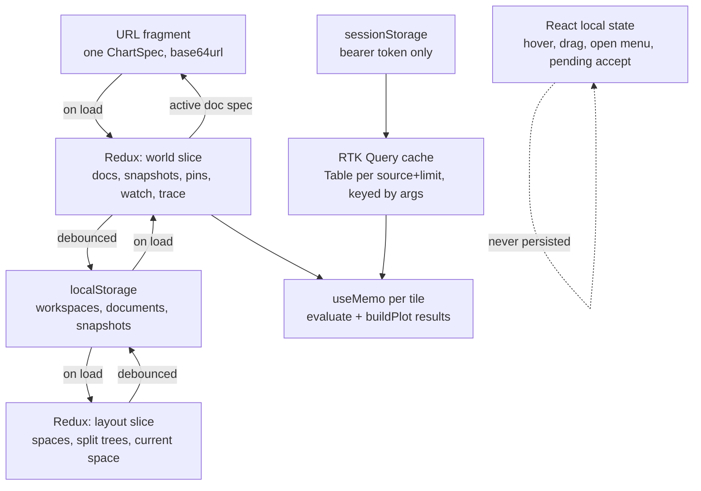
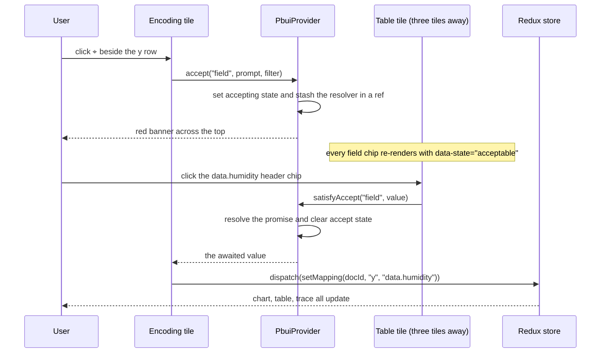
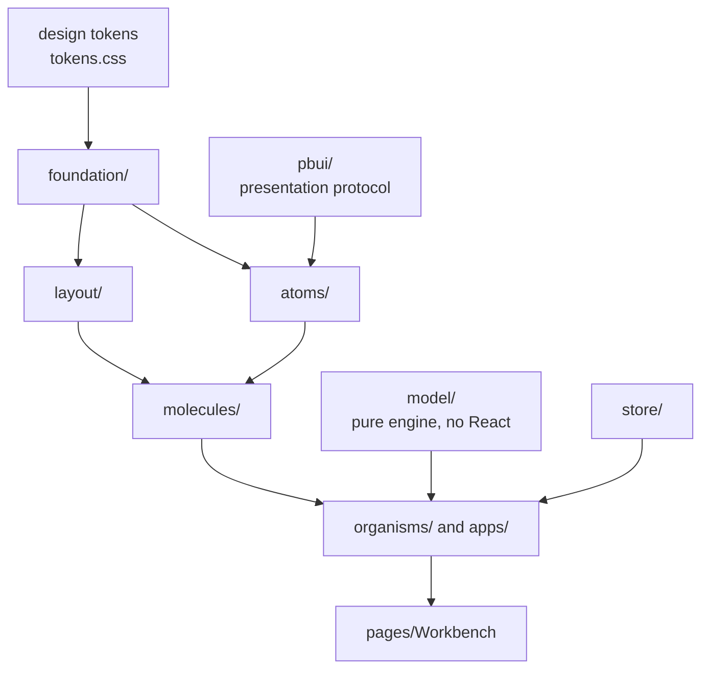

# PBUI shell: analysis, design, and implementation guide

## Who this is for

You have just joined the project. You know React and TypeScript. You have
probably never used a Lisp machine, and you may not have written a chart with
ggplot2. Neither is a prerequisite — but both traditions are load-bearing here,
so this guide explains them before it explains the code.

Read it in order. Sections 1 to 5 are analysis: what exists, what the reference
prototype does, and precisely where the two disagree. Sections 6 to 11 are
design: the object model, the interaction protocol, the window manager, and the
component system. Sections 12 to 17 are implementation: what to build, in what
order, and how to know each phase is finished. Sections 18 to 21 are reference
material you will come back to rather than read once.

One thing to be clear about up front, because it is the axis everything else
turns on. `ui/src/` splits cleanly in two:

- **2 569 lines that stay.** `model/` — the transformation pipeline, the scales,
  the tick ladder, the facet layout, the temporal axis, the live projection —
  plus `api/`, `export/` and the 58 tests over them. This is the half of the
  prototype that is genuinely hard to get right, it is already ported, and it is
  green. It does not change.
- **1 341 lines that are deleted.** `components/` and `App.tsx`: eight
  components written for a fixed three-column layout with props threaded from a
  single root, and the root that threads them.

The second half is being demolished rather than migrated (§4.4, DR-17). That is
a deliberate decision and it is cheap, because those files are small and because
their *value* is not the code — it is a handful of hard-won behaviours encoded
in them. §4.4 extracts those behaviours before the delete, and it is the section
to read twice.

The work of this ticket is the half of the prototype we never ported: the
*interaction* model.

## Table of contents

1. What you are building
2. The two ideas being fused
3. Reading the reference artifact
4. What already exists in go-go-datadrop
5. Gap analysis: prototype against production
6. Design commitments
7. The object model
8. The PBUI core: presentations, accept, menus
9. The window manager
10. The design system: foundation, atoms, molecules, organisms
11. Storybook
12. The applications, one by one
13. Wiring the grammar to live data
14. Performance
15. Accessibility and keyboard control
16. Testing
17. Migration plan
18. Decision records
19. Deferred, and why
20. API reference index
21. File reference index

---

## 1. What you are building

### 1.1 The three-sentence version

Today the datadrop web UI draws **one** chart, in a fixed three-column layout,
from **one** source, with the specification held in React state. It works, it is
tested, and it is the wrong shape for the thing it wants to become.

You are replacing the shell — not the engine — with a *presentation-based user
interface*: a tiled workbench in which every visible thing is a typed, live
object with a context menu of verbs, in which any command can pause and ask you
to point at its argument anywhere on screen, and in which a chart is not a
picture but a composition you can take apart.

Alongside that, you are converting the component layer from a flat
`ui/src/components/` directory into a layered design system — foundation,
layout, atoms, molecules, organisms, pages — with a Storybook that documents
every layer and exercises every state.

### 1.2 What it looks like when it is finished

A user opens `http://localhost:8090/ui/` and gets a screen divided into tiles.
The tile arrangement is a *workspace*, and there are several of them along the
top: `build`, `explore`, `gallery`, `help`, plus four tutorial workspaces.

In the `build` workspace: a **pipeline** tile on the left showing
`lab/temps ⊳ filter station ≠ roof ⊳ group station → mean_temp_c`, an
**encoding** tile below it showing `x ↦ time`, `y ↦ mean_temp_c`,
`color ↦ station`, a **chart** tile on the right drawing the result, and a
**table** tile under it showing the rows behind the chart.

The user right-clicks a dot in the chart. A menu appears headed
`<datum> station=north time=…`, offering *Keep only station = north*. They click
it. A new `filter` step appears in the pipeline tile — a real step, with a
checkbox that disables it without deleting it. The chart redraws. The table
redraws. The trace tile logs `step_added`.

They click `⌖` beside the `y` row in the encoding tile. A red banner appears
across the top: `ACCEPTING <field> — MAP Y of chart α ↦ click a FIELD anywhere`.
Every field chip on screen — in the data browser, in the table headers, in the
pipeline's output schema strip — starts pulsing. They click `data.humidity` in a
table header three tiles away. The chart re-encodes.

At the very bottom of the window, a black bar has been narrating the whole time:
whatever is under the pointer, it says what that object is and what a left-click
and a right-click will do to it.

### 1.3 What it replaces

`ui/src/App.tsx` — 252 lines that hard-code one source, one spec, one chart, one
table, and a Bootstrap `row`/`col` grid. Everything it does survives; it becomes
the default `build` workspace, assembled out of tiles rather than columns.

---

## 2. The two ideas being fused

The prototype is not one design. It is two, from two different decades and two
different research traditions, bolted together in a way that turns out to be
more than additive. You need both.

### 2.1 Presentation-based user interfaces (Genera, CLIM)

In an ordinary program, output is dead. A function computes a value, formats it
to a string, prints it, and the connection between the pixels and the object is
gone. If the user wants to act on what they see, they must retype it, or the
programmer must anticipate the action and attach a specific button to it.

The Lisp machines took the other road. On Symbolics **Genera**, and in its
standardised descendant **CLIM** (the Common Lisp Interface Manager), a program
does not print an object — it *presents* it. A presentation is a triple:

```
presentation = (presentation-type, object, visual representation)
```

The visual representation is what is on screen. The object is the live thing.
The presentation type is what makes the pair useful: it is the type as the
*interface* understands it, which is not always the type the language
understands. A pathname and a string are both strings to Lisp; to CLIM one is a
`pathname` presentation and the other is a `string`, and that distinction is
what lets the interface offer *Delete file* on one and not the other.

Four consequences follow, and all four are in the prototype:

- **Everything displayed remains a handle.** A file name printed by a directory
  listing forty minutes ago is still a live pathname. Right-clicking it offers
  the verbs of its type.

- **Commands accept objects by pointing.** A command that needs an argument of
  type `pathname` can *accept* one. The interface enters a mode in which every
  presentation of a matching type — in any window, from any application,
  produced at any time — becomes a valid click target and highlights itself.
  This is the single most important idea in the whole system. It means arguments
  are not typed, they are *indicated*, and the set of valid indications is
  computed from types rather than enumerated by the programmer.

- **The mouse documentation line.** A permanently visible strip that describes
  the object under the pointer and states what each mouse button will do to it.
  The interface explains itself continuously, so nothing needs to be memorised
  and no tooltip needs to be hunted.

- **Translators.** CLIM's deepest idea: a *presentation translator* is a
  declared rule saying "when a command is accepting type A and the user clicks a
  presentation of type B, here is how to produce an A from that B." Click a
  directory when a file is wanted, and a translator can turn it into that
  directory's default file. We are not building general translators (see §8.6),
  but you should know the idea exists, because two features in this design are
  special cases of it.

The prototype implements the first three faithfully, in about eighty lines. The
`P` component (`pbui-gog.jsx:54-77`) is the whole presentation mechanism; the
`accept` function (`pbui-gog.jsx:2551`) is the whole command protocol; the black
bar at `pbui-gog.jsx:2738-2744` is the mouse documentation line.

### 2.2 The grammar of graphics

The other half comes from Leland Wilkinson's *The Grammar of Graphics* (1999) as
popularised by R's **ggplot2** and the surrounding **tidyverse**. Its claim is
that charts are not a fixed catalogue of types — pie, bar, scatter — but a small
grammar whose sentences are charts:

```
chart  =  data
       ⊳  transformations          (filter, mutate, group_by + summarise, arrange, slice)
       ⊳  aesthetic mappings       (x, y, colour, size, facet)  ↦  fields
       ⊳  a geometry               (point, line, bar, area)
       ⊳  scales and coordinates   (linear, log, banded, continuous)
```

The correspondence in the prototype is deliberately close:

| Grammar | R / tidyverse | Prototype | Ported to |
|---|---|---|---|
| transformations | `filter`, `mutate`, `group_by` + `summarise`, `arrange`, `slice` | the pipeline app, five step kinds | `ui/src/model/pipeline.ts` |
| aesthetic mappings | `aes(x =, y =, colour =, size =)` | the encoding app, five channels | `ui/src/model/chart.ts` |
| geometry | `geom_point`, `geom_line`, `geom_bar`, `geom_area` | four geom chips | `ChartSpec.geom` |
| small multiples | `facet_wrap` with shared scales | the `facet` channel | `plot.ts` panels |
| scale transform | `scale_y_log10` | the y-scale toggle | `ChartSpec.yScale` |

The property that matters for us is that a chart specification is *data*. It is
a plain object. Consequently: freezing one is a deep copy; comparing two is a
diff; sharing one is JSON in a URL; storing one is a database row. Everything in
§7.3 and §12.7 falls out of this single fact.

### 2.3 Why fusing them is more than the sum

Take the grammar on its own and you get ggplot2: you compose a chart by writing
an expression. Take presentations on its own and you get a very nice file
browser. Put them together and the parts of the chart expression become objects
on screen — and then the chart stops being an output.

Concretely: a mark in a scatter plot is drawn from a row. Present it as
`<datum>` and it acquires the verbs of its type, one of which is *Keep only
station = north*. Running that verb does not filter the picture — it appends a
`filter` step to the document's pipeline, which the pipeline tile immediately
shows, which the user can then disable with a checkbox to A/B their own
decision. The click on the chart and the step in the pipeline are the same act
seen from two surfaces.

The same argument applies to a legend swatch (`<cat>` — *keep / exclude / facet
by this field*), to a table header (`<field>` — *map to y*), and to the output
schema strip of the pipeline itself, whose `mean_temp_c` chip did not exist in
the source data and is nonetheless a first-class field you can map, sort or
filter on.

That is the thesis of this ticket: **a chart built from typed objects can be
edited by pointing at itself.**

### 2.4 What R and Shiny do, and what we do instead

Since the request names both, it is worth being precise about the relationship.

**ggplot2** composes by *text*. You write `ggplot(d, aes(wing, mass, colour =
species)) + geom_point() + facet_wrap(~island)`. The expression is durable,
diffable, and version-controllable; it is also invisible to anyone who does not
already know the grammar, and every change is a round trip through an editor.

**Shiny** composes by *widgets bound to a reactive graph*. A `selectInput` feeds
a reactive expression which feeds a `renderPlot`. The graph is real and the
updates are fine-grained, but the set of things the user may change is fixed in
advance by whoever wrote the app: if the author did not put a control for
`facet`, there is no facet.

**This workbench** composes by *pointing at objects*. The expression still
exists — it is the document, a `ChartSpec`, serialisable and shareable (§7.3) —
but it is constructed by indicating its parts rather than typing them, and the
set of available manipulations is derived from the *types of the objects on
screen* rather than from a hand-written control panel. Adding a new verb to
every field chip everywhere in the application is one entry in one registry.

There is a real trade-off and you should say it out loud when someone asks: text
composes better than pointing. You cannot loop, you cannot parameterise, and you
cannot code-review a series of clicks. What you can do is discover — which is
what an exploratory workbench is for. The permalink (§20.2) is the escape hatch
back to text.

---

## 3. Reading the reference artifact

The prototype is a single 2 772-line JSX file:

```
/home/manuel/code/wesen/2026-03-29--serve-claude-experiments/imports/pbui-gog.jsx
```

Read it. All of it, once, before you write anything. It is dense but it is
linear, and the header comment (`:4-26`) states the thesis better than any
summary. Here is the map.

| Lines | Region | Verdict |
|---|---|---|
| 4–26 | Header comment: the thesis | Read first |
| 29–44 | Palette `C`, `clamp`, `fmt` | Becomes design tokens (§10.3) |
| 49–52 | `UICtx`, `useUI`, `typeMatches` | Port with changes (§8.1) |
| 54–77 | `P` — **the** presentation component | Port, expand (§8.1) |
| 81–91 | `Pres` — default visual for a re-presented object | Port (§8.2) |
| 93–206 | Deterministic RNG and three synthetic datasets | Becomes Storybook fixtures only (§11.4) |
| 208–423 | CSV import, OPFS and localStorage persistence | **Drop** (§5.5) |
| 425–555 | Zero-dependency ZIP writer, SVG→PNG, download | Defer (§19); PNG path already exists |
| 557–659 | Pipeline engine: `mkStep`, `schemaAfter`, `evaluate`, `stepLabel` | **Already ported** — `model/pipeline.ts` |
| 661–902 | `World` — documents, snapshots, decks, trace | Port as reducers (§7.2) |
| 904–922 | `fieldStats`, `describeDataset` | Port with a window caveat (§8.2) |
| 924–1117 | Plot engine: `niceTicks`, `hexLerp`, `buildPlot` | **Already ported** — `model/plot.ts` |
| 1119–1242 | Window manager: split tree, divider, tile chrome | Port as reducers + organisms (§9) |
| 1244–1317 | Shared UI bits: `Btn`, `Sel`, `FieldChip`, `DocChip`, `DocBar` | Becomes atoms and molecules (§10.5) |
| 1319–1428 | `PlotSVG` and `MiniPlot` | Merge into the existing `PlotSvg.tsx` (§12.5) |
| 1430–1469 | Tiny markdown renderer | Defer with the deck (§19) |
| 1476–1540 | `exportDeck`, `bundleDataset` | Defer (§19) |
| 1541–2181 | The applications | Port one at a time (§12) |
| 2183–2338 | Four hands-on tutorials with working ▶ buttons | Port — see §12.12, it is cheaper than it looks |
| 2340–2401 | About/help and the empty-tile launcher | Port (§12.11) |
| 2403–2422 | `APPS` registry | Port (§9.2) |
| 2427–2456 | `initialSpaces` — the default workspace layouts | Port, retarget (§9.4) |
| 2458–2772 | `App()` — the shell: menus, accept, drag, workspaces | Port, **decompose** (§8, §9) |

### 3.1 The five layers hiding in one file

Strip the file down and it is five layers, and they are almost perfectly stacked
even though nothing in the file enforces the stacking:

```
  5. shell            App(), workspaces, menus, accept plumbing        2458-2772
  4. applications     DataApp, PipelineApp, EncodeApp, ChartApp, …     1541-2401
  3. window manager   split tree, tiles, drag-dock                     1119-1242
  2. PBUI core        P, Pres, UICtx, accept                             49-91
  1. engine           pipeline, plot, World                        557-659, 924-1117
```

Layer 1 is pure and testable; it is the layer we already have. Layer 2 is tiny
and general; it is the layer this ticket is really about. Layers 3–5 are large
but mechanical.

### 3.2 The one thing to notice about `App()`

`App()` is 314 lines. Roughly 100 of them are `labelFor`, `describe` and
`actionsFor` (`:2554-2681`) — three parallel `if`-chains over the presentation
type. Every new presentation type means editing three places in the largest
function in the file.

That is the single structural defect worth fixing on the way in. In our version
those three functions become one **registry** with one entry per type (§8.2),
which is also what makes each type independently storyable.

---

## 4. What already exists in go-go-datadrop

### 4.1 The model layer is already the prototype's engine

This is the good news and it is worth checking yourself before you believe it.
`ui/src/model/` was written as a direct port. Its own comments name the source
lines:

| Our module | Ported from | Deliberate change |
|---|---|---|
| `model/pipeline.ts` | `pbui-gog.jsx:556-660` | `evaluate(table, steps)` takes a `Table` argument instead of reading a module-level `DATASETS` registry |
| `model/plot.ts` | `pbui-gog.jsx:924-1117` | Explicit `Plot` return type; category and facet overflow are reported rather than silently sliced |
| `model/chart.ts` | `pbui-gog.jsx:671-682` | `defaultChart` ranks payload columns above envelope metadata and requires a colour candidate to have 2–8 distinct values |
| `model/table.ts` | (new) | The server's wire types, including `inferred_from` |
| `model/time.ts` | (new) | Continuous temporal axis with a round-unit tick ladder |
| `model/live.ts` | (new) | SSE envelope projection matching `pkg/tabular` |
| `model/permalink.ts` | (new) | A `ChartSpec` in the URL fragment |

Nothing in `ui/src/model/` imports React. That is a rule, not a habit: it is
what lets `bun test` exercise the entire grammar of graphics with no DOM and no
server, and it is why 58 model tests run in well under a second. **Do not break
it.** The PBUI core goes in a *sibling* directory, `ui/src/pbui/`, not inside
`model/`.

The pipeline verbs, the five channels, the four geoms, the facet layout, the
band-versus-continuous x decision, the square-root size scale, the log-scale
fallback, and the "refuse to draw and say why" behaviour are all already
implemented and tested. You will not touch any of it.

### 4.2 The shell is not

`ui/src/App.tsx` holds, in React `useState`:

```
source     SourceRef | null        one source
spec       ChartSpec | null        one chart
limit      number                  one row budget
liveTable  Table | null            one live tail
gaps       number                  one gap counter
```

and lays out `SourcePicker`, `EncodingEditor`, `PlotSvg`, `DataTable`,
`PipelineEditor` in a fixed `col-xl-3 / col-xl-6 / col-xl-3` grid.

There are no presentations, no accept protocol, no object menus, no mouse
documentation line, no tiles, no workspaces, no second chart, no snapshots, and
no trace. Every one of those is this ticket.

### 4.3 The server contract, briefly

You do not need to change the Go side at all. What you need to know about it:

- **Tables are typed by the server, with provenance.** `GET
  /v1/drops/{drop}/table?stream=…` and `GET
  /v1/drops/{drop}/datasets/{ds}/versions/{v}/table?path=…` both return
  `{source, fields, rows, row_count, truncated, strategy, next_after}`, and each
  field carries `type` (`q`/`n`/`t`), `inferred_from` (`schema`, `envelope`,
  `values`, `default`), `distinct`, `distinct_capped` and `null_count`. See
  `pkg/tabular/table.go` and DATADROP-3 §6.

- **Rows are a window, not a dataset.** The default budget is 2 000 rows and the
  ceiling is 50 000 (`tabular.DefaultTableRows`, `tabular.MaxTableRows`). The
  server determines truncation exactly, by requesting `limit + 1` rows and
  discarding the extra, so `truncated` is never a guess.

- **A live tail is SSE.** `GET /v1/drops/{drop}/events/stream?stream=…&after=N`
  emits **named** events (`event: append`). `EventSource.onmessage` will not see
  them; you must `addEventListener("append", …)`. This cost an afternoon once.

- **Auth is a static bearer token**, held in `sessionStorage`, sent as an
  `Authorization` header. No cookies are ever set, so no request is ever
  ambiently authenticated. A drop marked `public_read` needs no token at all.

### 4.4 The salvage list

`ui/src/components/` and `ui/src/App.tsx` are deleted in phase 0 (DR-17). They
are 1 341 lines and rewriting them against the new contract is less work than
retrofitting presentation-awareness and store selectors onto components built to
receive threaded props.

**But they are not worthless, and the value is not the code.** Four of those
files encode defects that were found *only* by driving a browser during
DATADROP-3 — three of which produced a screen that looked like it was working,
with no error anywhere. Delete the files without extracting these and you will
reintroduce them, and you will find them the same expensive way.

Read this table before you run `git rm`. Every row is a behaviour that must
reappear in the component that replaces it.

| From | The behaviour | Why it exists |
|---|---|---|
| `LiveToggle.tsx` | `addEventListener("append", …)`, **never** `EventSource.onmessage` | The server writes *named* SSE frames. `onmessage` fires only for unnamed ones, so the tail connects, reports no error, and delivers nothing. Diagnosed by comparing a console `EventSource` against `curl -N`. |
| `SourcePicker.tsx` | the file list comes from `useGetDatasetVersionQuery`, not from the dataset detail | The dataset detail response omits per-version files by design. The symptom is an empty file list with no error and nothing in the console. |
| `TruncationBanner.tsx` | the banner is **not** dismissible | A chart drawn from 2 000 of 40 000 rows that looks complete is worse than no chart. It also names the row budget and tells the user to raise it — which is why "raise the budget" must be reachable from where the advice is read (§13.1). |
| `PlotSvg.tsx` | **no scale arithmetic in the renderer** — every coordinate comes from `buildPlot` | If a mark is in the wrong place the bug is in `model/plot.ts`, where a unit test can find it without a browser. The moment the renderer computes a position, that stops being true. |
| `App.tsx:108-114` | `logUnavailable` — the log toggle is *disabled with a reason*, not silently ignored | A log scale needs a strictly positive domain. `plot.ts` falls back silently as a second line of defence; the first line is refusing to offer the option. Becomes a selector (§20.3). |
| `DataTable.tsx` | render a few hundred rows and count the rest | The cheapest place in the whole application to accidentally mount 50 000 DOM nodes. |
| `EncodingEditor.tsx` | a mapped field no longer in the pipeline output renders stale, with a warning | Turns "my chart went blank" into "y points at a column your summarize step removed". |

Three more behaviours already live in `model/` and `api/`, which are **not**
deleted, so they are safe — but know where they are, because a rewrite that
"simplifies" one of them is a regression:

- `model/chart.ts:defaultChart` — payload columns rank above envelope metadata,
  and a colour candidate must have 2–8 distinct values. Without the first rule
  the workbench opens by charting the row number against time; without the
  second it opens with a legend longer than the chart.
- `model/plot.ts:244` — `continuousX`, so a temporal x is a continuous scale
  rather than one band per distinct timestamp. The band version draws uneven
  intervals evenly and labels the axis with full ISO strings.
- `api/client.ts` — the token is in `sessionStorage`, there is no `credentials`
  option, and every endpoint is a `GET`. Three security decisions in twenty
  lines (§5.6).

---

## 5. Gap analysis: prototype against production

The prototype runs in a browser with three synthetic tables it generates itself.
Everything below is a place where that assumption is load-bearing and ours is
different. Work through all seven before designing anything; six of them change
a decision later in this document.

### 5.1 A global registry versus a fetched value

The prototype keeps `DATASETS` as a module-level mutable object
(`pbui-gog.jsx:181-206`) and every function that needs data looks the dataset up
by id: `evaluate(datasetId, steps)`, `schemaAfter(datasetId, …)`,
`fieldStats(datasetId, …)`, `buildPlot(chart, …)` — which reaches into the
global via `chart.datasetId`.

That works because there are exactly three datasets, they are always resident,
and they never change. In our world a table is fetched, may be several megabytes,
may be truncated, may be a live tail that is different from second to second, and
two documents may point at two different sources — or at the same source with
two different row budgets.

**Already resolved.** `model/pipeline.ts` and `model/plot.ts` take the `Table` as
an argument. The consequence for the shell is that a *document* stores a
`SourceRef`, and the table for it comes from the RTK Query cache. Two documents
on the same source share one cache entry for free, because RTK Query keys by
serialised arguments.

### 5.2 Inference in the browser versus types with provenance

The prototype infers a column's type from its string values
(`pbui-gog.jsx:328-336`): all-numeric is `q`, more than 80 % ISO-date-shaped is
`t`, otherwise `n`. It then *coerces* quantitative columns to JavaScript numbers
in place (`:359-361`).

We deliberately do not do this. DATADROP-3 DR-2 places inference on the server,
because the server is the only party that has the dataset's declared JSON Schema
— and because a coercion cannot be undone by a later layer. A CSV column of
zero-padded station identifiers (`001`, `002`) sniffs as numeric; coerce it and
`"001"` becomes `1` and the padding is gone before any schema can object.

**Consequences for this ticket:**

- A `<field>` presentation must show *provenance*, not just type. A field typed
  `q` because a schema says so and a field typed `q` because 2 000 sampled values
  happened to parse are different facts, and a user deciding whether to trust a
  chart needs the difference. `TYPE_SOURCE_LABEL` in `model/table.ts` already
  has the wording.
- A per-chart type override is a legitimate verb on a field
  (`ChartSpec.typeOverrides` already exists), and its menu entry must say that it
  changes *this chart* and is never written back.

### 5.3 Complete data versus a window

The prototype's row count is the truth. Ours is a window with four properties
the prototype has no concept of:

- `truncated` — there were more rows than the budget
- `strategy` — `head` for datasets, `latest` for streams
- a live tail that appends and evicts
- sequence gaps, because the SSE hub drops a slow subscriber rather than
  queueing without bound

**Consequences.** The source binding of a document must itself be presentable, so
that "raise the row budget" is a verb rather than a control buried in one panel
(§13.1). Any statistic shown in the inspector must be labelled as being over the
loaded window. And the truncation banner must not be dismissible — a chart drawn
from 2 000 of 40 000 rows that looks complete is worse than no chart.

### 5.4 `bump()` versus a store with per-tile subscriptions

The prototype's `World` mutates in place and calls one callback
(`pbui-gog.jsx:709`), which the root component turns into
`force(x => x + 1)` (`:2459-2464`). Every keystroke in every step editor
re-renders the entire tree.

At three datasets of 90 rows this is invisible. At fifteen tiles over a 50 000-row
table, each running `evaluate` and `buildPlot`, it is a frozen browser. And the
mutation pattern defeats memoisation outright: the object identity of
`d.chart.steps` does not change when a step is edited in place, so a `useMemo`
keyed on it never invalidates — and, worse, sometimes fails to invalidate when it
should.

**Decision (DR-7, §18).** The world becomes Redux state with immutable updates,
alongside the RTK Query cache that is already there. Tiles subscribe with
selectors, so a tile showing document β does not recompute when α changes.

### 5.5 OPFS uploads versus a server that already stores datasets

The prototype can ingest a pasted or dropped CSV, infer its schema, register it,
and persist the raw text into the origin-private file system with a localStorage
index (`pbui-gog.jsx:208-423`). It is a genuinely nice piece of work and we are
not porting it.

The reason is not effort. datadrop *has* a dataset service: versioned, content
addressed, schema carrying, digest verified, shareable. A CSV that lives only in
one browser's OPFS has no version, no schema, no provenance, no access control
and no URL — a second, invisible data store with none of the properties the
first one was built for. If a user wants to chart a local CSV, the answer is
`datadrop dataset push`, and a future ticket may put that behind a button.

**What we keep from that region:** the RFC-4180 parser's *shape* is already
reproduced server-side in `pkg/tabular/rows.go`, and the deterministic seeded RNG
(`pbui-gog.jsx:94-105`) is a good idea we reuse to *generate committed Storybook
fixtures once* (§11.4) — not at story render time.

### 5.6 No auth versus a bearer token

The prototype has no credentials to leak. We do.

**Rules, all of them already true of the current UI and all of which the shell
must not break:**

- The token lives in `sessionStorage`, never `localStorage`. A credential that
  outlives the tab outlives the user's attention.
- The token is **never** part of a `ChartSpec`, a snapshot, a permalink, a
  persisted workspace, or the trace log. A snapshot is designed to be shared; a
  snapshot that carries a bearer token is a credential-exfiltration feature.
- The UI issues only `GET`s. This is what keeps the read-only workbench from
  introducing a write surface.
- Persisted workspace layouts (§9.5) hold tile arrangements and document
  specifications. Audit that payload for anything token-shaped before shipping.

### 5.7 Inline styles versus a design system

Every one of the prototype's ~600 style objects is inline, with colours pulled
from the `C` object. There is no theming, no dark mode, no reuse across
components, and nothing can be documented in isolation.

`AGENT.md` mandates Bootstrap for this project, and the current UI uses it.
Those are not in conflict, and §10.3 resolves the seam: Bootstrap keeps the grid,
the utilities and the form controls; the PBUI vocabulary — chips, tiles,
presentations, accept highlighting — gets tokenised CSS modules with a
`data-part` contract.

### 5.8 Summary table

| # | Prototype assumes | We have | Resolution |
|---|---|---|---|
| 1 | global `DATASETS`, always resident | fetched, budgeted, possibly live tables | already resolved in `model/`; documents hold a `SourceRef` |
| 2 | browser-side type sniffing, in-place coercion | server types with provenance | present provenance; overrides are per-chart verbs |
| 3 | complete data | a window: truncated, strategy, tail, gaps | present the source binding; never hide truncation |
| 4 | mutate + `force()` re-render | fifteen tiles over 50 000 rows | Redux world, selector subscriptions, memo by identity |
| 5 | OPFS/localStorage CSV upload | a versioned dataset service | drop it; `dataset push` is the path |
| 6 | no credentials | bearer token in `sessionStorage` | never serialise the token; GET only |
| 7 | inline styles | Bootstrap + a design-system mandate | Bootstrap for layout, tokens + `data-part` for PBUI |

---

## 6. Design commitments

These are the rules the rest of the document derives from. Each is expanded into
a decision record in §18.

1. **The engine does not change.** `ui/src/model/` stays pure, React-free, and
   fully tested. Everything new goes in `ui/src/pbui/`, `ui/src/store/` and
   `ui/src/components/`.

2. **A presentation is one component and one registry entry.** Adding a
   presentation type must never mean editing three `if`-chains.

3. **Accept is typed and filtered.** A command may accept a presentation type
   *and a predicate*. If a channel cannot use nominal fields, nominal chips do
   not light up.

4. **Documents are state; tiles are views.** Several tiles may show one document
   and stay in lockstep because they read one object, not copies of it.

5. **A document is an identity plus a `ChartSpec`.** No parallel type. This is
   what makes snapshots, permalinks and persistence one mechanism instead of
   three.

6. **The world is serialisable.** Documents, snapshots, workspaces and layout are
   plain JSON. Promises and DOM handles live in React refs, never in the store.

7. **The design system is layered, and the layering is enforced.** Foundation →
   layout/atoms → molecules → organisms → pages, with a lint rule, not a
   convention.

8. **Every public component has a story.** A component that cannot be rendered in
   Storybook in isolation is a component with a hidden dependency.

9. **Truncation, gaps, dropped rows and overflow are always visible.** The
   prototype could assume its data was complete. We cannot, so every place where
   the view is not the whole truth says so.

---

## 7. The object model

### 7.1 The presentation type vocabulary

This table is the contract. Every entry is a presentation type: a value shape, a
place it appears, and a set of verbs. When you add a type, you add a row here and
a file in `ui/src/pbui/types/`.

| Type | Value shape | Where it appears | Primary verb (left-click) | Menu verbs |
|---|---|---|---|---|
| `field` | `{ docId, name }` | data browser, table headers, pipeline schema strip, encoding rows, legend title | none (menu) | map to x/y/colour/size/facet; filter on; group by; sort by; override type; inspect; watch |
| `source` | `SourceRef` | source app, document bar, truncation notice | load into the active document | new document from; raise the row budget; reload; inspect |
| `doc` | `docId` | charts app, every document bar, watchlist | make active | snapshot; duplicate; rename; delete; inspect; watch |
| `step` | `stepId` | pipeline app | toggle on/off | enable/disable; move up; move down; remove; inspect |
| `geom` | `Geom` | encoding app | use in this document | inspect (states its type requirements) |
| `channel` | `{ docId, channel }` | encoding app | accept a field for it | clear; inspect the accepted types |
| `datum` | `{ docId, row }` | chart marks, table row numbers | inspect | keep only *k* = *v*; exclude *k* = *v*; watch |
| `cat` | `{ docId, field, value }` | legend swatches, banded axis labels | none (menu) | keep only; exclude; facet by; watch |
| `chart` | `snapshotId` | gallery, compare, watchlist | restore into the active document | restore as a new document; pin A; pin B; delete; inspect |
| `tile` | `leafId` | tile title bars | none (menu) | split right; split below; swap with…; close |
| `workspace` | `spaceId` | workspace strip | switch to | rename; duplicate; delete |

Two notes on the shapes.

**Why `datum`, `cat`, `channel` and `field` carry a `docId`.** In the prototype
some verbs act on "the active document" and some act on the document that
produced the object, and the difference is a running source of surprise: clicking
a mark in a chart tile showing β while α is active must filter β, not α. The
prototype gets this right for marks (`pbui-gog.jsx:1361`, `mkDatum` closes over
`docId`) and wrong for fields (`:2599`, `world.setMapping(null, …)` targets the
active document). We carry the owning document on every presentation minted
inside a document-bound tile. Where there genuinely is no owner — a field chip in
the data browser — `docId` is `null` and the verb falls back to the active
document, and the menu header says which one.

**Why `field` is not just a name.** A field's type depends on the document,
because the document's pipeline may have created it (`mean_temp_c`) and because
the document may override its type. `{docId, name}` lets the registry resolve the
effective type through `schemaAfter(table, steps, undefined, overrides)`.

### 7.2 The world

```ts
// ui/src/store/world.ts
interface WorldState {
  docs: Record<DocId, Doc>;
  docOrder: DocId[];              // stable display order
  activeDocId: DocId | null;      // the target of ambient verbs
  snapshots: Record<SnapId, Snapshot>;
  snapshotOrder: SnapId[];
  pins: [SnapId | null, SnapId | null];   // compare A / B
  watch: WatchEntry[];
  trace: TraceEntry[];            // capped ring, see below
}

interface Doc {
  id: DocId;
  name: string;                   // α, β, γ … then user-renamed
  spec: ChartSpec;                // model/chart.ts — unchanged
  limit: number;                  // the row budget for this document's source
}

interface Snapshot {
  id: SnapId;
  name: string;
  at: string;                     // ISO instant
  spec: ChartSpec;                // frozen deep copy
  limit: number;
}

interface WatchEntry { id: string; ptype: PresentationType; value: unknown }

interface TraceEntry {
  seq: number;
  type: string;                   // "step_added", "encoded", "doc_activated", …
  data: Record<string, string | number | boolean>;
  note?: string;
}
```

Three deliberate differences from `pbui-gog.jsx:685-902`:

- **Records plus an order array**, not arrays. Every verb in the prototype does
  `this.docs.find(d => d.id === id)`; with fifteen tiles re-rendering that is a
  linear scan per tile per frame. A record gives O(1) lookup, and the order array
  keeps display order stable and reorderable.

- **The trace is capped.** The prototype's `trace` grows without bound
  (`:710`). At one entry per keystroke in a step editor, a long session is a
  memory leak with a scrollbar. Cap it at 500 entries and drop from the front;
  the trace is a teaching surface, not an audit log of record.

- **No `decks`, `slides`, `presentingDeck`.** Deferred (§19).

### 7.3 A document is an identity plus a `ChartSpec`

This is the simplification that pays for itself repeatedly. `ChartSpec` already
holds everything the prototype's `chart` object held:

```ts
// ui/src/model/chart.ts — existing, unchanged
interface ChartSpec {
  source: SourceRef;
  steps: Step[];
  geom: Geom;
  mapping: Record<Channel, string | null>;
  yScale: "linear" | "log";
  typeOverrides?: Record<string, FieldType>;
}
```

Because a document *is* a spec with a name:

- **Snapshotting** is a deep copy of `doc.spec`. Nothing else.
- **A permalink** is `hashForSpec(doc.spec)` — already implemented in
  `model/permalink.ts`, already base64url in the fragment so filter values never
  reach a server access log.
- **Persisting the workspace** serialises documents with no extra encoder.
- **Compare A/B** diffs two specs, field by field, with no bespoke type.
- **Restoring a snapshot into a document** is one assignment.
- **Duplicating a document** is `structuredClone(spec)` plus a new id.

If you find yourself writing a `SnapshotSpec` type that is *almost* a
`ChartSpec`, stop: you have re-introduced the thing this decision removes.

The one field that is *not* in `ChartSpec` is `limit`, the row budget. It is a
property of how much of the source we loaded rather than of what to draw, and it
belongs to the document rather than the specification. It travels with a
snapshot so a restore reproduces the same window.

### 7.4 The layout

```ts
// ui/src/store/layout.ts
type Node =
  | { id: NodeId; type: "leaf"; app: AppId; docId: DocId | null }
  | { id: NodeId; type: "split"; dir: "row" | "col"; a: Node; b: Node; ratio: number };

interface Workspace { id: SpaceId; name: string; tree: Node }

interface LayoutState {
  spaces: Workspace[];
  currentSpaceId: SpaceId;
}
```

A binary split tree, exactly as in `pbui-gog.jsx:1126-1152`. A leaf holds *which
application* and, for the four document-bound applications, *which document*. It
holds no application state whatsoever — that is §7.5 and it is the property that
makes swapping two tiles a two-field exchange (`:2506-2509`) rather than a state
migration.

### 7.5 State ownership

Getting this wrong is the most expensive mistake available here, so it gets a
diagram and a table.



| Lives in | Holds | Why there |
|---|---|---|
| RTK Query cache | `Table` per `(source, limit)` | already implemented; two documents on one source share one entry and one request |
| Redux `world` | documents, snapshots, pins, watchlist, trace | serialisable, selector-subscribable, time-ordered |
| Redux `layout` | workspaces and split trees | same, and independent of the world so a layout change never invalidates a chart memo |
| React local (root) | pending accept, open menu, mouse-doc text, drag state | contains a **promise resolver** and screen coordinates — neither is serialisable, and neither should survive a reload |
| React local (tile) | text being typed into a step editor before commit | keystroke-rate state must not reach the store |
| `useMemo` per tile | `evaluate` and `buildPlot` output | derived; keyed on table identity and spec identity |
| `sessionStorage` | the bearer token, and nothing else | §5.6 |
| `localStorage` | workspaces, documents, snapshots | survives reload; never the token |
| URL fragment | the active document's spec | shareable; never sent to the server |

The rule that catches most mistakes: **if it cannot be `JSON.stringify`d, it does
not go in Redux.** The accept protocol's `resolve` function is the canonical
violation, and §8.3 handles it explicitly.

---

## 8. The PBUI core: presentations, accept, menus

Everything in this section lives in `ui/src/pbui/`. It knows nothing about
charts. In principle you could lift the directory into a different application
and present pathnames with it.

```
ui/src/pbui/
  PbuiProvider.tsx      the context, the accept plumbing, the menu state
  Presentation.tsx      the P component
  usePbui.ts            the hook
  registry.ts           PresentationType → descriptor
  types/                one file per presentation type
    field.tsx  source.tsx  doc.tsx  step.tsx  geom.tsx
    channel.tsx  datum.tsx  cat.tsx  chart.tsx  tile.tsx  workspace.tsx
  ObjectMenu.tsx        the context menu (molecule, but PBUI-owned)
  AcceptBanner.tsx      the accept-mode banner
  MouseDocLine.tsx      the bottom bar
  parts.ts              data-part names
  pbui.module.css       presentation, acceptable, hover styling
```

### 8.1 `<Presentation>` — the one component

The prototype's `P` (`pbui-gog.jsx:54-77`) in our idiom:

```tsx
// ui/src/pbui/Presentation.tsx
interface PresentationProps {
  ptype: PresentationType;
  value: unknown;
  /** Mouse-doc text. Defaults to the registry's label for this type. */
  doc?: string;
  /** Render as an SVG <g> rather than an HTML <span>. */
  svg?: boolean;
  /** Render as a block-level <div>. */
  block?: boolean;
  /** The left-click default verb, if this presentation has one. */
  onActivate?: () => void;
  activateDoc?: string;
  children: React.ReactNode;
}

export function Presentation(props: PresentationProps) {
  const pbui = usePbui();
  const acceptable = pbui.isAcceptable(props.ptype, props.value);

  // Inside an <svg> the renderer silently discards HTML elements, so a
  // <span> wrapper means the marks are never drawn at all. This is the single
  // sharpest edge in the whole component; the prototype documents it at :56-58.
  const Tag = props.svg ? "g" : props.block ? "div" : "span";

  return (
    <Tag
      data-part="presentation"
      data-ptype={props.ptype}
      data-state={acceptable ? "acceptable" : undefined}
      className={styles.presentation}
      onContextMenu={(e) => {
        e.preventDefault();
        e.stopPropagation();
        pbui.openMenu(props.ptype, props.value, e.clientX, e.clientY);
      }}
      onClick={(e) => {
        e.stopPropagation();
        if (acceptable) {
          e.preventDefault();
          pbui.satisfyAccept(props.ptype, props.value);
        } else if (props.onActivate) {
          props.onActivate();
        } else {
          pbui.openMenu(props.ptype, props.value, e.clientX, e.clientY);
        }
      }}
      onMouseEnter={() => pbui.setMouseDoc(describeForBar(props, pbui, acceptable))}
      onMouseLeave={() => pbui.setMouseDoc(null)}
    >
      {props.children}
    </Tag>
  );
}
```

Four behaviours worth stating explicitly, because each is a decision:

- **Right-click always opens the menu.** Even in accept mode. A user who entered
  accept mode by mistake must still be able to interrogate what they are pointing
  at without committing to it.

- **In accept mode, left-click satisfies rather than activates.** A dataset chip
  whose default verb is "load into the active document" must not load anything
  while a command is waiting for it. The mouse-doc line announces the change
  (`L: ACCEPT`), so the user is told before they commit.

- **Left-click with no default verb opens the menu.** Otherwise chips with no
  obvious primary action are dead to the left hand, and users do not discover
  the right button.

- **`stopPropagation` on both handlers.** Presentations nest — a `<datum>` mark
  inside a `<tile>` inside a `<workspace>` — and without this the outermost one
  wins, which is exactly backwards. The most specific presentation is the
  innermost one.

Three things this component must **not** do: fetch, dispatch a domain action
directly, or know what a chart is. Everything type-specific is resolved through
the registry.

### 8.2 The registry

The prototype's `labelFor`, `describe` and `actionsFor` (`pbui-gog.jsx:2554-2681`)
become one descriptor per type:

```ts
// ui/src/pbui/registry.ts
export interface ActionContext {
  dispatch: AppDispatch;
  getState: () => RootState;
  accept: AcceptFn;
  /** The document a verb targets when the presentation names none. */
  activeDocId: DocId | null;
  layout: LayoutOps;
}

export interface PresentationDescriptor<V = unknown> {
  ptype: PresentationType;
  /** One line, for menu headers, the mouse-doc bar and the trace. */
  label(value: V, state: RootState): string;
  /** The full object, for the inspector. Must be JSON-serialisable. */
  describe(value: V, state: RootState): unknown;
  /** The menu. Order matters: the first entry is the most likely one. */
  actions(value: V, ctx: ActionContext): Action[];
  /** The default visual, used when an app re-presents an object it did not create. */
  Chip: React.ComponentType<{ value: V }>;
  /** Accent colour token for the chip's left border. */
  tone: string;
}

export interface Action {
  label: string;
  run(): void | Promise<void>;
  /** Shown greyed with this reason rather than hidden, when the verb is unavailable. */
  disabledBecause?: string;
}
```

A real entry, abbreviated:

```tsx
// ui/src/pbui/types/field.tsx
export const fieldDescriptor: PresentationDescriptor<FieldRef> = {
  ptype: "field",
  tone: "var(--pbui-tone-field)",

  label: ({ name }) => name,

  describe: (ref, state) => {
    const { field, stats, window } = resolveField(ref, state);
    return {
      presentationType: "field",
      name: ref.name,
      type: TYPE_LABEL[field.type],
      typeSource: TYPE_SOURCE_LABEL[field.inferred_from],
      distinct: field.distinct_capped ? `${field.distinct}+` : field.distinct,
      nullCount: field.null_count,
      // Never present a statistic without the window it was computed over.
      statisticsOver: window.truncated
        ? `the loaded window: ${window.rowCount} of at least ${window.rowCount + 1} rows`
        : `all ${window.rowCount} rows`,
      ...stats,
    };
  },

  actions: (ref, ctx) => {
    const doc = targetDoc(ref.docId, ctx);
    const type = effectiveFieldType(ref, ctx.getState());
    const acts: Action[] = [];

    for (const channel of CHANNELS) {
      const accepted = CHANNEL_ACCEPTS[channel].includes(type);
      acts.push({
        label: `Map to ${channel}  (chart ${doc.name})`,
        // Shown and disabled, not hidden: the user learns why y refuses a
        // nominal column, which a missing menu entry would never teach.
        disabledBecause: accepted
          ? undefined
          : `${channel} accepts ${CHANNEL_ACCEPTS[channel].join(", ")}`,
        run: () => ctx.dispatch(setMapping({ docId: doc.id, channel, field: ref.name })),
      });
    }

    acts.push({
      label: "Filter on this field",
      run: () => ctx.dispatch(addStep({ docId: doc.id, kind: "filter", field: ref.name })),
    });
    if (type !== "q") {
      acts.push({
        label: "Group by + count",
        run: () => ctx.dispatch(addStep({ docId: doc.id, kind: "summarize", by: ref.name, fn: "count" })),
      });
    }
    acts.push({ label: "Sort output by (descending)", run: () => /* … */ });
    acts.push({
      label: `Read as ${type === "q" ? "nominal" : "quantitative"} in this chart only`,
      run: () => ctx.dispatch(setTypeOverride({ docId: doc.id, field: ref.name, type: /* … */ })),
    });
    acts.push({ label: "Inspect", run: () => ctx.dispatch(inspect(/* … */)) });
    acts.push({ label: "Add to watchlist", run: () => ctx.dispatch(watchAdd(/* … */)) });
    return acts;
  },

  Chip: FieldChip,
};
```

The payoff: adding *Copy column name* to every field chip in the application is
one line here. And `field.tsx` can be tested with `bun test` against a fixture
state, with no DOM, because `actions` is a pure function returning closures.

**On `describe` and honesty.** The prototype's `fieldStats`
(`pbui-gog.jsx:904-918`) reports a mean and a standard deviation over whatever
rows it has, and it has all of them. Ours does not. Every statistic the inspector
shows carries the window it was computed over. This is the same principle as the
non-dismissible truncation banner, applied one level down.

### 8.3 The accept protocol

This is the heart of the system. Sequence:



The API:

```ts
// ui/src/pbui/PbuiProvider.tsx
export interface AcceptRequest<V = unknown> {
  ptype: PresentationType | PresentationType[];
  prompt: string;
  /** Narrows which presentations of that type light up. */
  filter?: (value: V, state: RootState) => boolean;
}

export type AcceptFn = <V>(req: AcceptRequest<V>) => Promise<AcceptResult<V> | null>;
export interface AcceptResult<V> { ptype: PresentationType; value: V }
```

Implementation notes, each of which is a decision you would otherwise make wrong:

- **The resolver lives in a ref, not in Redux.** A promise `resolve` is a
  function; Redux state must be serialisable (§7.5). The provider keeps
  `pendingRef.current = { req, resolve }` and a `useState` flag so that
  presentations re-render into their acceptable state. A stale resolver after a
  hot reload is a hung command, so clear the ref on unmount.

- **`filter` is what makes accept *typed* rather than merely *kinded*.** The
  prototype accepts any `<field>` for any channel, and the plot engine then
  refuses to draw with `y must be quantitative for geom point`. Better: pass
  `filter: (ref, state) => CHANNEL_ACCEPTS.y.includes(typeOf(ref, state))`, so the
  nominal chips never light up and the invalid state is unreachable. This is the
  one place we improve on the prototype rather than porting it, and the machinery
  — `CHANNEL_ACCEPTS` in `model/chart.ts` — already exists.

- **Escape aborts and resolves `null`.** Every caller must handle `null`; the
  `if (!r) return;` at `pbui-gog.jsx:1735` is the pattern. A command that ignores
  the abort applies a change the user cancelled.

- **Accept is modal but not blocking.** The rest of the interface stays live:
  you can switch workspaces mid-accept and click a chip there. The prototype's
  banner advertises this (`:2715`) and it is genuinely useful — it is how you
  map a field from a dataset you are not currently looking at.

- **Nested accepts are refused.** If a command is already accepting, a second
  `accept()` resolves `null` immediately rather than replacing the first. Two
  pending resolvers and one click is a bug you will not enjoy finding.

- **A live tail pauses during accept.** See §13.2; this is not optional.

### 8.4 The object menu

`ObjectMenu.tsx` renders `registry[ptype].actions(value, ctx)` at the click
coordinates, with a header naming the type, the label, and — for verbs that
target the active document ambiently — *which* document. That header is what
makes an ambient verb safe: `<field> data.temp_c → chart α` tells you where the
change will land before you commit.

Keep the prototype's clamping so the menu never opens off-screen
(`pbui-gog.jsx:2753`), and add what the prototype lacks: `Escape` closes, arrow
keys move the highlight, `Enter` runs, and the menu is a `role="menu"` with
`role="menuitem"` children.

Disabled entries render greyed with their `disabledBecause` as the title. Hiding
an unavailable verb hides the reason it is unavailable.

### 8.5 The mouse documentation line

A single strip at the bottom of the window, always present, three regions:

```
[ ACCEPT MODE ]  <field> data.temp_c (quantitative, from the sampled values)  —  L: ACCEPT   R: menu     [ 6 tiles · 9 workspaces ]
```

- The left region is the shell mode: `READY`, `ACCEPT MODE`, `MOVING APP`.
- The centre is the object under the pointer and what the buttons do. When
  nothing is hovered and a command is accepting, it shows the prompt.
- The right is ambient counts.

Two additions over the prototype. First, mirror the centre region into an
`aria-live="polite"` region so the same information reaches a screen reader
(§15). Second, the text is composed from the registry's `label` plus the
presentation's own `doc` prop, so a type gets consistent phrasing everywhere
without every call site restating it.

### 8.6 Translators: what we are not building

CLIM's presentation translators let a click on a type-B presentation satisfy a
type-A request through a declared conversion. We are not building the general
mechanism, because a rule set that can fire implicitly is hard to explain and
harder to debug, and because two hard-coded conversions cover the cases that
actually arise:

- Accepting a `<field>` and clicking a `<cat>`: a category knows its field, so
  the accept is satisfied with `value.field`.
- Accepting a `<source>` and clicking a `<doc>`: a document knows its source.

Implement these as two entries in a small `CONVERSIONS` table consulted by
`isAcceptable` and `satisfyAccept`. If a third case appears, that is the moment
to reconsider the general mechanism — not before.

---

## 9. The window manager

### 9.1 The split tree

Straight from `pbui-gog.jsx:1128-1152`, as pure reducers in
`ui/src/store/layout.ts`. All five are total, all five return the input unchanged
when the id is absent, and all five have unit tests:

```ts
updateNode(tree, id, fn)   // replace one node, structurally sharing the rest
removeLeaf(tree, id)       // the sibling absorbs the space
findLeaf(tree, id)         // or null
countLeaves(tree)          // for the status bar
cloneTree(tree)            // fresh ids throughout — for duplicating a workspace
```

`updateNode` returns the *same object* when nothing below changed
(`pbui-gog.jsx:1131-1133`). That is not a micro-optimisation: it is what lets
`React.memo` on `SplitView` skip an entire untouched subtree when one tile
changes. Preserve it, and test it — `expect(updateNode(t, "absent", f)).toBe(t)`.

### 9.2 Tiles are views

The application registry (`pbui-gog.jsx:2403-2422`) becomes:

```ts
// ui/src/apps/registry.ts
export interface AppDescriptor {
  id: AppId;
  title: string;
  tone: string;              // token name, not a hex value
  /** Document-bound apps get a docId and show a document bar. */
  docBound: boolean;
  Component: React.ComponentType<{ leafId: NodeId; docId: DocId | null }>;
}
```

`docBound` is `true` for exactly four applications — chart, table, pipeline,
encoding — and it is what drives the document bar (`DocBar`,
`pbui-gog.jsx:1302-1317`): a strip at the top of the tile naming the document,
with a dropdown to re-point the tile and a `＋` to spawn a new document into it.

The property that makes the whole design work: **a tile holds no application
state.** Swapping two tiles exchanges two fields, `app` and `docId`
(`pbui-gog.jsx:2506-2509`). Closing a tile loses nothing. Opening a second chart
tile on the same document produces two views that move in lockstep, because they
read one object rather than two copies.

### 9.3 Drag to dock

Grab the `⠿` handle in a tile's title bar and drag. The provider tracks
`{from, x, y, over, zone}`, hit-tests the pointer against registered tile
elements, and computes a zone from proximity to the nearest edge
(`pbui-gog.jsx:2523-2528`):

```
zone(rect, x, y):
    dl, dr, dt, db = distances to left, right, top, bottom
    band = min(min(rect.w, rect.h) * 0.3, 110)
    m = min(dl, dr, dt, db)
    if m > band:  return "center"        // swap the two applications
    return whichever edge produced m     // split-dock, source tile closes
```

Centre swaps; an edge splits the target and moves the dragged application into
the new half. A translucent overlay names the outcome *before* the release, which
is the difference between a discoverable gesture and a mystery.

Divider dragging snaps at ¼, ⅓, ½, ⅔, ¾ within 2.2 % (`pbui-gog.jsx:1153-1155`),
and the divider changes colour when snapped so the snap is visible rather than
merely felt.

Two things the prototype does that you must keep: set `document.body.style.
userSelect = "none"` for the duration of a drag, or the browser selects text
across the whole window; and register tile elements in a ref map keyed by leaf id
with an `isConnected` check at hit-test time, or a closed tile leaves a phantom
drop target (`:2530-2531`).

### 9.4 Workspaces

Named tile arrangements sharing one world. Switching is a state change, not a
remount of the data: the documents, snapshots and cached tables are the same
objects.

Ship the prototype's nine (`pbui-gog.jsx:2427-2456`), retargeted:

| Workspace | Layout | For |
|---|---|---|
| `build` | pipeline + encoding, chart + table | the daily cockpit; this is today's `App.tsx`, tiled |
| `explore` | sources, chart, inspector | finding a stream, seeing what is in it |
| `gallery` | snapshots, compare, trace | reviewing and A/B-ing |
| `help` | about, watchlist, trace | reference |
| `1·objects` | tutorial 1, sources, inspector | presentations and accept |
| `2·pipeline` | tutorial 2, pipeline, table | the five verbs |
| `3·encode` | tutorial 3, encoding, chart | channels, geoms, facets, scales |
| `4·charts` | tutorial 4, charts, gallery | documents and snapshots |

The prototype's `deck` workspace is deferred with the deck application.

### 9.5 Persistence and identity

Layout and world are written to `localStorage` on change, debounced, and restored
on load (`pbui-gog.jsx:224-245`).

The prototype has a subtle correctness fix worth understanding before you delete
it: node ids are `"n" + counter++`, so after a reload the counter restarts at 1
and the next new tile collides with a restored one. It walks the restored tree
and bumps the counter past the highest id (`:236-238`). A collision here is a
duplicate React key *and* a hit-test that returns the wrong tile — a memorably
confusing bug.

**We remove the class of bug instead of fixing the instance:** ids come from
`crypto.randomUUID()`. No counter, no reseeding, no collision, and ids stay
unique across workspaces, tabs and exported layouts. Do the same for document,
step and snapshot ids. (`model/pipeline.ts:34` still uses a module-level counter
for step ids; that is fine while steps never outlive a session, and it must
change in the phase that persists documents.)

Restoration must be **defensive**. A layout written by a previous version, or
hand-edited, or truncated by a full quota, must produce the default workspaces
and a console warning — never a blank screen. Validate: the tree is well formed,
every leaf's `app` is in the registry, every `docId` still exists (else `null`,
which falls back to the active document), and every `ratio` is in `[0.1, 0.9]`.

---

## 10. The design system

### 10.1 Why atomic decomposition fits this particular UI

Two properties of a presentation-based interface make the atoms/molecules/
organisms split unusually natural here, rather than a ceremony imposed on it.

**Presentations are already atoms.** A field chip, a document chip, a geom chip,
a legend swatch: each is a small, self-contained visual with one input and no
dependencies beyond the PBUI context. They appear in six places each. They are
exactly what an atom is for.

**Applications are already organisms.** Each tile application is a feature block
with a clear boundary, its own state selectors, and no knowledge of its
neighbours. The prototype proves this by construction — you can drag any
application into any tile and it works.

The middle layer is where the prototype has nothing and we need something: the
step row, the channel row, the schema strip, the legend, the panel frame, the
data grid, the document bar. In the prototype each is inline JSX inside its
application, duplicated where two applications need it (`FieldChip` is defined
once, but the "row of chips with a label" pattern is written out four times).

### 10.2 Layout

```
ui/src/
  model/                       pure engine — unchanged, no React
  pbui/                        the presentation protocol (§8)
  store/                       Redux slices: world, layout, plus the RTK Query api
  apps/                        organisms bound to the tile registry
  components/
    foundation/                tokens made usable in React
      Text/ Heading/ Caption/ Divider/ VisuallyHidden/ Kbd/
    layout/                    structural primitives
      Stack/ Split/ Surface/ Toolbar/ AppBody/
    atoms/                     smallest product controls and chips
      Chip/ FieldChip/ TypeBadge/ ProvenanceBadge/ GeomChip/ DocChip/
      SourceChip/ StepKindChip/ CategorySwatch/ Button/ IconButton/
      Select/ NumberInput/ TextInput/ Checkbox/ Spinner/
      MarkCircle/ MarkRect/ MarkPath/          (SVG atoms)
    molecules/
      ChannelRow/ StepRow/ SchemaStrip/ Legend/ AxisX/ AxisY/ PanelFrame/
      DataGrid/ TruncationNotice/ GapNotice/ DocBar/ TileTitleBar/
      SourceRow/ SnapshotCard/ StepEditors/    (five, one per step kind)
    organisms/
      Tile/ SplitView/ WorkspaceStrip/ StatusBar/
    pages/
      Workbench/
  fixtures/                    committed deterministic tables for stories and tests
```

The dependency direction is one-way and enforced:



Enforce it with `eslint-plugin-import`'s `no-restricted-paths`, one zone per
layer. A convention that is only written down is a convention that has already
been broken somewhere you have not looked yet.

### 10.3 Tokens, and living with Bootstrap

`AGENT.md` mandates Bootstrap and the current UI uses it. The resolution is a
division of labour, not a fight:

- **Bootstrap owns** the page grid, spacing and display utilities, form
  controls, buttons in ordinary chrome, alerts, cards, and the reset.
- **The design system owns** the PBUI vocabulary: chips, tiles, presentation
  highlighting, accept pulsing, the mouse-doc bar, plot chrome. These get CSS
  modules keyed on `data-part`.

The prototype's palette (`pbui-gog.jsx:29-44`) becomes the token layer, defined
once and aliased onto Bootstrap's own custom properties where they overlap so a
theme change moves both:

```css
/* ui/src/styles/tokens.css */
:root {
  /* surfaces */
  --pbui-paper: #ffffff;
  --pbui-pane: #ffffff;
  --pbui-pane-alt: #f1f1ee;
  --pbui-ink: #23262b;
  --pbui-faint: #7b8087;
  --pbui-line: #d9d9d4;
  --pbui-selected: #fdeec6;

  /* presentation-type tones — the left border of every chip */
  --pbui-tone-field: #7aa6c9;
  --pbui-tone-source: #7cae9b;
  --pbui-tone-doc: #c2503a;
  --pbui-tone-step: #a99fc9;
  --pbui-tone-chart: #e0b95c;
  --pbui-tone-cat: #d59a86;

  /* field-type tones — quantitative, nominal, temporal */
  --pbui-type-q: #7aa6c9;
  --pbui-type-n: #e0b95c;
  --pbui-type-t: #7cae9b;

  /* the categorical palette; must equal PALETTE in model/plot.ts */
  --pbui-cat-1: #3b6fb6;  --pbui-cat-2: #c0504d;
  --pbui-cat-3: #d6a419;  --pbui-cat-4: #7a9a6b;
  --pbui-cat-5: #8f7bb0;  --pbui-cat-6: #c07a94;
  --pbui-cat-7: #5fa9a0;  --pbui-cat-8: #8892a8;

  --pbui-space-1: 2px;  --pbui-space-2: 4px;  --pbui-space-3: 6px;
  --pbui-space-4: 10px; --pbui-space-5: 16px; --pbui-space-6: 24px;
  --pbui-radius-0: 0;   --pbui-shadow-hard: 2px 2px 0 var(--pbui-ink);
  --pbui-font-mono: "IBM Plex Mono", ui-monospace, Menlo, monospace;

  /* bridge to Bootstrap so one theme moves both */
  --bs-body-color: var(--pbui-ink);
  --bs-body-bg: var(--pbui-paper);
  --bs-border-color: var(--pbui-line);
}
```

**One trap, and it is a real one.** The categorical palette exists twice: as CSS
tokens for legend swatches rendered in HTML, and as the `PALETTE` array in
`model/plot.ts:15-18`, because `buildPlot` must put a concrete colour on each
mark and it is a pure function with no access to the DOM. Keep `model/plot.ts`
authoritative, generate the token block from it, and add a unit test asserting
the two agree. A legend whose swatches disagree with its marks is a bug that
survives review because both halves look right in isolation.

### 10.4 The part and state contract

```ts
// ui/src/pbui/parts.ts
export const PARTS = {
  presentation: "presentation",
  chip: "chip",
  chipLabel: "chip-label",
  chipType: "chip-type",
  tile: "tile",
  tileTitle: "tile-title",
  tileBody: "tile-body",
  divider: "divider",
  menu: "menu",
  menuItem: "menu-item",
  acceptBanner: "accept-banner",
  mouseDoc: "mouse-doc",
  panel: "panel",
  legend: "legend",
  legendSwatch: "legend-swatch",
  axis: "axis",
} as const;
```

States go on `data-state`: `acceptable`, `active`, `disabled`, `dragging`,
`snapped`, `stale`, `empty`, `truncated`. Roles go on `data-role` where a
consumer needs to target semantics rather than structure: `data-role="q"` on a
type badge, `data-role="schema"` on a provenance badge.

Keep the parts list short. Every part is a public API you will be asked not to
break.

### 10.5 The component inventory

`ui/src/components/` today is eight flat files, all deleted in phase 0. This
table is therefore a **specification for their replacements**, not a refactoring
plan: the "today" column names the file to read for reference and then remove,
and the salvage list in §4.4 names the behaviours that must survive the removal.

Rewriting rather than retrofitting is the cheaper path here for a specific
reason. Every existing component receives its data as threaded props from one
root — `EncodingEditor` takes `(fields, spec, logUnavailable, onChange)`, and
`onChange` is `setSpec` from `useState`. The replacements read a document from a
store selector and emit presentations. That is a different component with the
same rendered output, and pretending otherwise produces a component with two
data paths.

| Reference file | Layer | Becomes | What changes |
|---|---|---|---|
| `PlotSvg.tsx` | organism `apps/ChartApp` + molecules `PanelFrame`, `AxisX`, `AxisY`, `Legend` + SVG atoms | `ChartCanvas` | marks wrapped in `<Presentation svg ptype="datum">`; legend swatches in `<Presentation ptype="cat">` |
| `PipelineEditor.tsx` | organism `apps/PipelineApp` + molecules `StepRow`, five `StepEditors` | | step kind chips become `<step>` presentations; `+ filter…` uses `accept("field")` |
| `EncodingEditor.tsx` | organism `apps/EncodingApp` + molecule `ChannelRow` | | `⌖` per channel triggers a filtered `accept`; geom buttons become `<geom>` presentations |
| `DataTable.tsx` | organism `apps/TableApp` + molecule `DataGrid` | | headers become `<field>`; row numbers become `<datum>` |
| `SourcePicker.tsx` | organism `apps/SourceApp` + molecule `SourceRow` | | drops, streams and dataset files become `<source>` presentations |
| `TokenBar.tsx` | organism `TokenBar` (shell chrome) | | unchanged behaviour |
| `TruncationBanner.tsx` | molecule `TruncationNotice` | | gains a `<source>` presentation so *raise the budget* is a verb |
| `LiveToggle.tsx` | molecule `LiveToggle` | | pauses during accept mode (§13.2) |
| — | atoms | `Chip`, `FieldChip`, `TypeBadge`, `ProvenanceBadge`, `GeomChip`, `DocChip`, `SourceChip`, `StepKindChip`, `CategorySwatch`, `IconButton`, `Select`, `NumberInput`, `Checkbox` | new; several extracted from `pbui-gog.jsx:1244-1317` |
| — | molecules | `SchemaStrip`, `DocBar`, `TileTitleBar`, `SnapshotCard`, `GapNotice` | new |
| — | organisms | `Tile`, `SplitView`, `WorkspaceStrip`, `StatusBar`, and the nine remaining apps | new |
| `App.tsx` | page | `pages/Workbench` | becomes shell assembly only |

**The atom that does the most work** is `Chip`, because every presentation chip
is a `Chip` with a tone, a label, an optional type badge and an optional
provenance badge. Get it right once:

```tsx
// ui/src/components/atoms/Chip/Chip.tsx
interface ChipProps {
  tone?: string;              // a CSS variable reference
  label: string;
  badge?: React.ReactNode;    // type letter, distinct count, provenance dot
  emphasis?: "normal" | "strong";
  state?: "active" | "stale" | "disabled";
}
```

`FieldChip` is then `Chip` plus a `TypeBadge` plus a `ProvenanceBadge`, wrapped
in a `Presentation`. `DocChip`, `GeomChip` and `SourceChip` are the same shape
with different tones and badges. If you find yourself writing a fourth chip
implementation, you have missed the abstraction.

---

## 11. Storybook

### 11.1 Setup

Storybook 9 with the React + Vite builder, run with bun, sharing the existing
`ui/vite.config.ts`:

```bash
cd ui
bun add -d storybook @storybook/react-vite \
  @storybook/addon-docs @storybook/addon-a11y @storybook/addon-vitest \
  @vitest/browser playwright
```

```ts
// ui/.storybook/main.ts
import type { StorybookConfig } from "@storybook/react-vite";

const config: StorybookConfig = {
  stories: ["../src/**/*.stories.@(ts|tsx)"],
  addons: ["@storybook/addon-docs", "@storybook/addon-a11y", "@storybook/addon-vitest"],
  framework: { name: "@storybook/react-vite", options: {} },
  // The app is served from /static/ by pkg/webui; Storybook is not served by Go
  // at all, so it keeps the default base.
  docs: { autodocs: "tag" },
};
export default config;
```

```tsx
// ui/.storybook/preview.tsx
import "bootstrap/dist/css/bootstrap.min.css";
import "../src/styles/tokens.css";
import { withPbui, withStore, withTile } from "./decorators";

export const decorators = [withPbui, withStore, withTile];

export const parameters = {
  controls: { expanded: true },
  a11y: { test: "error" },        // a11y violations fail the run, not just warn
};
```

Scripts in `ui/package.json`:

```json
{
  "scripts": {
    "storybook": "storybook dev -p 6006",
    "build-storybook": "storybook build -o storybook-static",
    "test-storybook": "vitest --project=storybook"
  }
}
```

Two operational rules:

- **`storybook-static/` is gitignored and never embedded.** `pkg/webui` embeds
  `all:dist` and only `dist`. A build output directory that silently ends up
  inside the Go binary is a several-megabyte regression nobody notices until a
  release.
- **`make ui` builds the app; `make storybook` builds the storybook.** They are
  separate targets because CI runs them at different times.

### 11.2 The three decorators that make a PBUI component storyable

A `FieldChip` needs a PBUI context. A `PipelineApp` needs a store with a
document and a cached table. A `StepRow` needs to be inside something tile-shaped
to lay out correctly. Without decorators, every story would build all three by
hand and most components would be unstorybookable — which is precisely the smell
the layering is meant to remove.

```tsx
// ui/.storybook/decorators.tsx

/**
 * A PBUI context whose effects are visible instead of real.
 *
 * openMenu and accept are Storybook actions, so a story can assert that
 * right-clicking a chip asked for the right menu without mounting the shell.
 * The mouse-doc line renders inside the decorator, so every chip story shows
 * its own hover documentation — which turns the story into the reference for
 * what that chip says it does.
 */
export const withPbui: Decorator = (Story, ctx) => (
  <PbuiProvider
    initialAccepting={ctx.parameters.pbui?.accepting ?? null}
    onOpenMenu={action("openMenu")}
    onAccept={action("accept")}
  >
    <Story />
    <MouseDocLine />
  </PbuiProvider>
);

/** A real Redux store, preloaded from a fixture world. */
export const withStore: Decorator = (Story, ctx) => (
  <Provider store={makeStore(ctx.parameters.world ?? fixtureWorld)}>
    <Story />
  </Provider>
);

/** Tile-shaped chrome, so organisms lay out the way they will in the shell. */
export const withTile: Decorator = (Story, ctx) =>
  ctx.parameters.tile === false ? <Story /> : (
    <div data-part="tile" style={{ width: 420, height: 520, display: "flex", flexDirection: "column" }}>
      <Story />
    </div>
  );
```

### 11.3 Required stories, by layer

| Layer | Required stories |
|---|---|
| foundation | the token sheet: every colour, spacing and type role, rendered as swatches |
| atoms | `Default`, every variant (the three field types, the four provenances), `Acceptable` (via `parameters.pbui.accepting`), `Disabled`, `LongLabel` |
| molecules | `Default`, `Empty`, `Overflowing`, plus the states specific to it — `StepRow` needs `Disabled` and `DroppedRows`; `TruncationNotice` needs `Truncated` and `AtCeiling` |
| organisms | `Default`, `Loading`, `Error`, `EmptySource`, `Truncated`, `Live`, and at least one `play` interaction test |
| pages | `Build`, `Explore`, `Gallery`, and `AcceptInProgress` |

The states that must appear somewhere, because each is a real screen the user
will meet and none is reachable by clicking around casually:

- no token entered, drop is not `public_read` → the 401 path
- source chosen, table still loading
- table loaded but every row filtered away by a too-strict step
- table truncated at the ceiling, where "raise the limit" is not available
- a live tail with a sequence gap
- a colour channel with more than eight categories (legend overflow)
- a facet channel with more than six values (panels dropped)
- a `derive` step that dropped rows to non-finite values
- accept mode active, with acceptable and non-acceptable chips side by side

### 11.4 Fixtures

Stories must be deterministic or every screenshot diff is noise. Two sources:

- **`ui/test/fixtures/envelope-projection.json`** already exists and is generated
  by the Go side (`pkg/tabular/fixture_test.go` under `-update`). It is the
  ground truth for the live-tail projection and is already asserted against by
  `ui/test/live.test.ts`. Stories that need a realistic stream table use it.

- **`ui/src/fixtures/`** — committed JSON tables, generated once by a script
  using the prototype's seeded RNG (`pbui-gog.jsx:94-105`) so the numbers are
  plausible and stable. Ship three, mirroring the prototype's shapes because the
  tutorials refer to them: a wide numeric table with three categories, a
  timeseries with four series over 24 intervals, and a small table for bar
  charts.

  Generate them with `bun run scripts/make-fixtures.ts` and **commit the JSON**.
  Do not call the generator at story render time: a story that computes its own
  data is a story whose failure could be in the generator.

Each fixture ships as a full `Table`, with `fields`, `inferred_from`, `distinct`
and `truncated`, so the components see exactly the shape the server sends.

### 11.5 Interaction tests

The accept protocol is the highest-value thing to test and the hardest to test
any other way. As a `play` function it is direct:

```tsx
// ui/src/apps/EncodingApp/EncodingApp.stories.tsx
export const MapYByAccepting: Story = {
  parameters: { world: worldWithOneDocument, tile: false },
  play: async ({ canvasElement, step }) => {
    const canvas = within(canvasElement);

    await step("start accepting a field for y", async () => {
      await userEvent.click(canvas.getByRole("button", { name: /accept a field for y/i }));
      await expect(canvas.getByRole("status", { name: /accepting/i })).toBeInTheDocument();
    });

    await step("only quantitative chips light up", async () => {
      await expect(canvas.getByTestId("chip-data.temp_c")).toHaveAttribute("data-state", "acceptable");
      // The filter is the point: y refuses nominal fields, so the chip never
      // becomes clickable and the invalid state is unreachable.
      await expect(canvas.getByTestId("chip-data.station")).not.toHaveAttribute("data-state", "acceptable");
    });

    await step("clicking satisfies the accept", async () => {
      await userEvent.click(canvas.getByTestId("chip-data.temp_c"));
      await expect(canvas.getByTestId("channel-y")).toHaveTextContent("data.temp_c");
    });
  },
};
```

Run these in CI with `@storybook/addon-vitest`, which executes `play` functions
in a real browser via Playwright. Two more worth writing early: right-clicking a
mark adds a filter step to the correct document, and dragging a tile onto
another tile's centre swaps the applications.

### 11.6 Accessibility in the loop

`@storybook/addon-a11y` with `test: "error"` runs axe on every story and fails
the build on a violation. Turn it on in the first phase, not the last: a colour
contrast problem in the token sheet is a five-minute fix on day one and a
sixty-story repaint in month three.

---

## 12. The applications, one by one

Each subsection states: what the application is for, what it *presents*, what it
*accepts*, which selectors it reads, and where it comes from. Build them in the
order given; each one is usable before the next exists.

### 12.1 Sources (`apps/SourceApp`) — from `SourcePicker.tsx` + `DataApp` (`:1541-1625`)

Browses drops, then their streams and datasets, then a dataset version's files.

- **Presents** `<source>` for every stream and every dataset file; `<field>`
  for the columns of the currently loaded table.
- **Accepts** nothing.
- **Reads** `useListDropsQuery`, `useListStreamsQuery`, `useListDatasetsQuery`,
  `useGetDatasetVersionQuery`.
- **Default verb** on a `<source>`: load it into the active document.
- **Row budget** is a control here and a verb on `<source>` — the truncation
  notice tells the user to raise it, and advice you cannot act on from where you
  read it is worse than no advice.

One inherited lesson: the dataset *detail* response omits per-version files by
design, so the file list needs `useGetDatasetVersionQuery`. An empty file list
with no error is the symptom.

Drop the prototype's entire CSV upload region (`:1583-1600`) — §5.5.

### 12.2 Charts (`apps/ChartsApp`) — from `:2145-2181`

The document manager: one card per live document with a thumbnail, its source,
its step count, its geom and its x/y mapping.

- **Presents** `<doc>` per card.
- **Accepts** nothing.
- **Verbs** per card: set active, duplicate, snapshot, rename inline, delete.
- The active document is marked, unmissably. Ambient verbs — those fired from a
  chip that names no document — land there, and a user who cannot see which
  document is active cannot predict where a menu entry will act.

Thumbnails call `buildPlot(table, spec, W, H, { mini: true })`. See §14.2 before
you point one at a 50 000-row table.

### 12.3 Pipeline (`apps/PipelineApp`) — from `PipelineEditor.tsx` + `:1724-1786`

The chain of five verbs, each row a live object.

- **Presents** `<step>` per row; `<field>` in the output schema strip;
  `<source>` in the header.
- **Accepts** `<field>` when adding a `filter` (any type) or a `summarize`
  (nominal or temporal only — pass the filter).
- **Reads** `schemaAfter(table, steps, i)` per row, so step 3's dropdowns offer
  exactly what steps 1 and 2 produce — including `mean_temp_c`, which is in no
  source.

The checkbox that disables a step without deleting it (`:1768`) is not a
convenience. It is what makes a pipeline an experiment rather than a recording:
you A/B your own transform by toggling it, and the chart, table and out-schema
all answer immediately.

Keep showing `dropped[step.id]` — the count of rows a `derive` removed because
the expression was not finite. `evaluate` already returns it; a silent
disappearance of rows is the kind of thing that gets found three weeks later.

### 12.4 Encoding (`apps/EncodingApp`) — from `EncodingEditor.tsx` + `:1791-1844`

Five channel rows, four geom chips, the y-scale toggle.

- **Presents** `<channel>` per row, `<field>` for whatever is mapped, `<geom>`
  per chip.
- **Accepts** `<field>` per channel, **filtered by `CHANNEL_ACCEPTS`** — this is
  §8.3's improvement over the prototype and this is where it shows.
- A mapped field no longer in the pipeline output renders with
  `data-state="stale"` and a warning. The prototype does this (`:1818`) and it is
  what turns "my chart went blank" into "y points at a column your summarize step
  removed".
- The log toggle is disabled, with a reason, when the y domain is not strictly
  positive. `App.tsx:108-114` already computes `logUnavailable`; move it into a
  selector.

### 12.5 Chart (`apps/ChartApp`) — from `PlotSvg.tsx` + `:1849-1868`

Draws the plot and makes it clickable.

- **Presents** `<datum>` per mark, `<cat>` per legend swatch, `<field>` for the
  legend title, `<source>` and `<geom>` in the header.
- **Accepts** nothing.
- **Reads** a memoised `buildPlot(table, spec, w, h)`.

The SVG presentation trap from §8.1 lives here: mark wrappers must render `<g>`,
not `<span>`, or nothing draws at all and the console says nothing.

`PlotSvg.tsx` today does no scale arithmetic — every coordinate comes from
`buildPlot`. Keep it that way. If a mark is in the wrong place, the bug is in
`model/plot.ts` and a unit test can find it without a browser.

Two additions: a `mini` variant for thumbnails, and a `data-chart-doc={docId}`
attribute on the `<svg>` so the PNG exporter can find the right chart when
several are on screen (`pbui-gog.jsx:1368`, `:1530`).

### 12.6 Table (`apps/TableApp`) — from `DataTable.tsx` + `:1630-1672`

The pipeline's output relation.

- **Presents** `<field>` per header, `<datum>` per row number.
- **Accepts** nothing.
- Renders at most a few hundred rows with a count of the remainder. This is the
  cheapest place in the application to accidentally render 50 000 DOM rows.

Right-clicking a row number offers *keep only* / *exclude* for its nominal
columns — the same verbs as a chart mark, because it is the same presentation
type. That equivalence is the point.

### 12.7 Gallery (`apps/GalleryApp`) — from `:1873-1906`

Snapshots: frozen specifications with live thumbnails.

- **Presents** `<chart>` per snapshot.
- **Accepts** nothing.
- **Verbs**: restore into the active document; restore as a *new* document (fork
  the past); pin as compare A or B; delete.

A snapshot is `structuredClone(doc.spec)` plus a name, an instant and the row
budget (§7.3). It does not hold rows: it holds how to get them. Restoring one
whose source has since been deleted must produce a document that reports the
problem rather than a blank tile — the plot engine's "refuse to draw and say why"
path already handles it if the table query errors cleanly.

### 12.8 Compare (`apps/CompareApp`) — from `:1911-1946`

Two pinned snapshots side by side, thumbnails plus specifications.

- **Presents** `<chart>` for each pinned snapshot.
- **Accepts** `<chart>` for each slot.

Worth one improvement the prototype does not have: render the two specifications
as an aligned diff — same source, same steps, differing mapping — rather than two
independent summaries. Comparing two charts is almost always asking *what is
different*, and making the reader do that diff by eye is work the machine can do.

### 12.9 Inspector (`apps/InspectorApp`) — from `:2080-2088`

Shows `registry[ptype].describe(value, state)` as formatted JSON, with the title
naming the type and the label.

Everything §8.2 says about honesty applies here, because this is where it
surfaces: no statistic without its window.

### 12.10 Watchlist (`apps/WatchlistApp`) — from `:2089-2110`

A scratchpad of pinned objects of any type, re-presented through
`registry[ptype].Chip`. A watched field is still a live field: it can be mapped,
filtered or inspected from the watchlist exactly as from a table header. This is
the clearest demonstration in the product that presentations are handles rather
than pictures, which is why it is worth the small amount of code.

- **Accepts** a *union*: `["field", "source", "doc", "step", "datum", "cat", "chart"]`.
  The accept API takes an array (`pbui-gog.jsx:2095`), which is why `ptype` is
  `PresentationType | PresentationType[]`.

### 12.11 Trace, About, Launcher — from `:2122-2141`, `:2340-2401`

- **Trace**: every dispatched verb, colour-coded by kind, newest at the bottom,
  capped at 500 entries (§7.2). It is the audit trail *and* the teaching device:
  a user who does not understand what a click did can read what it did.
- **About**: the glossary of presentation types, rendered with live chips of each
  type. It stays correct because it renders the real components.
- **Launcher**: what an empty tile shows — a button per application.

### 12.12 The tutorials — from `:2183-2338`

Four guided workspaces, each pairing a lesson tile with the tiles it discusses.
Every lesson step has a `▶` button that performs the action *for real*, so the
user watches the neighbouring tiles react.

Port them, and port them early rather than last. The reason is not pedagogy, it
is maintenance: a `▶` button dispatches exactly the action the UI dispatches, so
the tutorial is executable documentation that **cannot silently rot**. Rename an
action creator and the tutorial fails to compile. Compare that with a screenshot
walkthrough, which is wrong within a month and tells no one.

The lessons map cleanly onto our world once `seabirds` becomes a real drop:
tutorial 1 teaches hover, right-click and accept; tutorial 2 the five pipeline
verbs; tutorial 3 channels, geoms, facets and scales; tutorial 4 documents,
snapshots and compare. Seed a `tutorial` drop from `ui/src/fixtures/` with a
small script so the lessons have data that behaves the way the text says.

---

## 13. Wiring the grammar to live data

Four places where the production world intrudes on the prototype's model, all of
them user-visible.

### 13.1 Two limits with the same name

There are two `limit`s and they are unrelated:

- **The row budget** — `?limit=` on the table request. How much of the source was
  fetched. Server-clamped to `tabular.MaxTableRows` (50 000). Property of the
  document's source binding.
- **The `limit` step** — the pipeline's fifth verb. How many rows survive the
  transform. Property of the specification.

`limit 10` after a `sort` is a leaderboard. A row budget of 10 is a broken chart
that looks fine. Consequences for the UI:

- The step chip says `limit 10 rows`; the source binding says `2 000 of 40 000+
  rows loaded`. Never the bare word "limit" alone in either place.
- *Raise the row budget* is a verb on `<source>`, reachable from the truncation
  notice, the source app and the document bar.
- At the ceiling, say so and say what to do instead: filter server-side with
  `from`/`to`, or narrow the source.

### 13.2 A live tail inside a presentation-based interface

Live tail and accept mode interact badly, and the interaction is not obvious
until you meet it: you enter accept mode, aim at a mark, an event arrives, the
scales rescale, every mark moves, and you click a different row than the one you
were pointing at.

**Pause the tail while a command is accepting.** Buffer arriving envelopes,
show `paused — N events buffered` in the accept banner, and flush on resolve or
abort. `LiveToggle` already owns the `EventSource`; give it the accept flag from
the PBUI context.

The same argument applies, more weakly, to an open object menu. Pause there too;
the menu is short-lived and the surprise is the same.

And the inherited trap, which will cost you an afternoon if you rewrite the
subscription: the server writes **named** SSE events (`event: append`).
`EventSource.onmessage` fires only for unnamed frames, so a tail that looks
connected delivers nothing, silently, with no error anywhere. Use
`addEventListener("append", …)`.

### 13.3 Gaps

The SSE hub drops a subscriber that falls behind rather than queueing without
bound, so a gap in the sequence is expected behaviour rather than a fault.
`appendEnvelope` already detects one (`model/live.ts:146`) and `App.tsx` already
counts them.

In the shell the gap notice belongs to the *document*, not the page, because two
documents may tail two streams. Interpolating across a gap would invent data;
mark it and offer *reload the table for a complete window*.

### 13.4 Type overrides are a verb

`ChartSpec.typeOverrides` exists and nothing in the current UI sets it. In the
shell it becomes a menu entry on `<field>`: *Read as nominal in this chart only*.
Two things the wording must carry: it affects one chart, and it does not change
what the server said — the provenance badge keeps reporting `from the dataset
schema` next to the overridden type.

---

## 14. Performance

The prototype has three synthetic tables of at most 96 rows. We have up to
50 000 rows, up to fifteen tiles, and a tail that can fire many times a second.
Three specific cliffs.

### 14.1 N tiles times `evaluate`

Every document-bound tile needs `evaluate(table, steps, overrides)` and the chart
tile also needs `buildPlot`. Two chart tiles and a table tile on one document is
three evaluations of the same thing per render.

Memoise per document, not per tile:

```ts
// ui/src/store/selectors.ts
export const selectPipeline = createSelector(
  [selectTableForDoc, selectDocSpec],
  (table, spec) => (table && spec ? evaluate(table, spec.steps, spec.typeOverrides) : null),
);
```

For this to work at all, three identities must be stable:

- The `Table` object — RTK Query gives a stable reference until the query
  refetches. Free.
- `spec.steps` — only if reducers update immutably. This is the concrete reason
  §5.4 rejected the prototype's mutate-and-`bump()` pattern; with in-place
  mutation `steps` keeps its identity through an edit and the memo never
  invalidates, which is worse than no memo.
- The selector instance per document — `createSelector` memoises one argument
  set, so use a factory (`makeSelectPipeline(docId)`) or `weakMapMemoize`, or
  two documents will thrash a single-entry cache.

`buildPlot` additionally depends on width and height, so debounce container
resize; a drag of a tile divider must not re-run twenty plot builds per second.

### 14.2 Thumbnails and honest sampling

The gallery and the charts application render a `MiniPlot` per card. Ten
snapshots over a 50 000-row table is ten full pipeline evaluations and ten full
mark sets for a 190 × 112 image.

Sample. A thumbnail drawn from every *k*-th row, chosen so at most ~2 000 rows
reach `buildPlot`, is visually indistinguishable at that size. Two rules make
sampling honest:

- **Sample after the pipeline, not before.** Sampling first changes what a
  `summarize` computes, and a thumbnail whose mean differs from the chart's is a
  lie in a small typeface.
- **Never sample the main chart.** A thumbnail is a navigational aid; a chart is
  a claim about data. Different standards of care.

Mark sampled thumbnails with `data-state="sampled"` so the distinction survives
into any future export path.

### 14.3 Mark count

50 000 points is 50 000 SVG nodes, each wrapped in a `<g>` presentation with
three event handlers. That is a browser that stops responding.

Cap marks per panel at 5 000 and report the cap the way the plot engine already
reports facet and category overflow — as a `problems`-adjacent notice, visible,
naming what to do (`limit`, `summarize`, or a narrower source). A silent cap is
the same defect as a silent truncation and deserves the same treatment.

---

## 15. Accessibility and keyboard control

The prototype is mouse-only, as Genera largely was. That is not acceptable for
something we ship, and the fixes are cheap if they are done in the first phase.

- **The mouse-doc line is mirrored to `aria-live="polite"`.** The single most
  valuable line of accessibility work here: the thing that makes the interface
  self-documenting for a sighted user becomes the thing that announces it to a
  screen reader.
- **Presentations are focusable.** `tabIndex={0}`, `role="button"`, `Enter` for
  the default verb, `ContextMenu` key or `Shift+F10` for the menu.
- **Accept mode is keyboard-navigable.** While accepting, `Tab` and `Shift+Tab`
  cycle *only* acceptable presentations — a roving tabindex over the acceptable
  set. `Escape` aborts. Announce entry into accept mode through the live region.
- **The object menu is a real menu**: `role="menu"`, arrow keys, `Enter`,
  `Escape`, focus returned to the presentation on close.
- **Tiles are landmarks.** Each tile is a `<section>` with an `aria-label` naming
  the application and, for document-bound applications, the document.
- **Do not encode meaning in colour alone.** Acceptable presentations pulse *and*
  gain an outline; the prototype's `@media (prefers-reduced-motion: reduce)` rule
  (`pbui-gog.jsx:2706`) disables the pulse, so the outline must carry the meaning
  on its own.
- **Charts get a text alternative.** `<svg role="img">` with an `aria-label`
  built from the specification: "line chart of data.temp_c against time,
  coloured by data.station, 4 series, 720 rows". `PlotSvg.tsx` already has the
  `role="img"`; the label is currently the word "chart".

`@storybook/addon-a11y` with `test: "error"` (§11.6) keeps all of this from
regressing.

---

## 16. Testing

Four layers, three of which already exist.

### 16.1 The pure model — unchanged

58 `bun test` assertions over `model/`. They do not change and they must not
break. If a change to the shell requires a change to `model/`, that is a signal
worth stopping on.

### 16.2 The shell reducers — new, pure, cheap

`store/world.ts` and `store/layout.ts` are reducers: `(state, action) => state`.
Test them with no DOM. The list that matters:

- `updateNode` returns the identical object when nothing changed
- `removeLeaf` promotes the sibling; removing the last leaf is refused
- `cloneTree` produces entirely fresh ids and shares no node objects
- deleting the active document reassigns `activeDocId` rather than leaving it
  dangling (`pbui-gog.jsx:736-742`)
- deleting the last document is refused
- a snapshot is unaffected by later mutation of the document it came from — the
  test that catches a shallow copy
- restoring a snapshot into a document does not alias the snapshot's `steps`
  array
- the trace ring drops from the front at 500 entries
- restoring a malformed persisted layout yields the defaults, not a throw

### 16.3 The presentation registry — pure, and worth it

`actions(value, ctx)` returns closures over a mock `ctx`. Assert the *set* of
labels for a field of each type, that y's map entry is disabled with a reason for
a nominal field, and that a verb on a `{docId: "d2"}` field dispatches against
`d2` while the active document is `d1`. That last one is §7.1's whole rationale
and it is one assertion.

### 16.4 Components — Storybook play functions

§11.5. Run in CI through `@storybook/addon-vitest`.

### 16.5 The browser — Playwright, on the real binary

The Go smoke test (`cmd/datadrop/table_smoke_test.go`) already proves the UI is
served, does not shadow the API, and returns typed tables. Extend the browser
check to drive the shell: load a source, right-click a mark, assert a step
appeared, run an accept, assert the encoding changed.

Do this even though the play functions cover similar ground. Reading DATADROP-3's
diary is worth ten minutes here: **four defects were found only by driving a
browser**, and three of them produced a screen that looked like it was working —
a chart drew the row number instead of the measurement; a temporal axis was a
band scale labelled with full ISO strings; a live tail connected and delivered
nothing. None raised an error anywhere. A workbench this dynamic will have more
of them, and only a browser will find them.

### 16.6 Lint and build

- `bun run typecheck` — strict, no implicit `any`
- `bun run lint` — including the layer boundary rule from §10.2
- `bun run build` then `make ui` — the committed `dist` must be regenerated,
  because `pkg/webui` embeds it and a stale bundle ships a stale UI
- `bun run build-storybook` — must succeed, output must not be committed

---

## 17. Migration plan

Six phases. The React shell is demolished in phase 0 rather than migrated
(DR-17), which removes the "keep it working at every commit" constraint and with
it two awkward steps: re-layering eight components that were going to be deleted
anyway, and proving the accept protocol inside a shell it does not fit.

**Storybook is the development surface for phases 0 to 2.** That is not a
consolation prize for having broken the app — it is what a design system is for,
and it is a better place to build a `<field>` chip than a running server is.

### The dark period, and why it is safe

Between deleting `App.tsx` in phase 0 and assembling `pages/Workbench` in phase
3, `bun run build` has no application to build. Three things make that a
non-event:

- **`pkg/webui` embeds a committed `ui/dist`.** The bundle is a snapshot taken
  at the last `make ui`. Demolishing the *source* does not touch it, so
  `go build ./...`, `go test ./...` and the running binary keep serving the
  DATADROP-3 UI throughout. **Do not run `make ui` during the dark period** — it
  is the one command that would replace a working bundle with a broken one. Add
  the rule to the diary on day one; it is exactly the kind of thing that gets
  rediscovered at the wrong moment.
- **`bun test` stays green the whole way.** The 58 model tests do not depend on
  a single React component.
- **`cmd/datadrop/table_smoke_test.go` stays green**, because it asserts against
  the served bundle and the API, neither of which moves.

Phase 3 ends the dark period, and the first `make ui` after it is the moment to
check the binary again.

### Phase 0 — Demolition and foundations

`git rm ui/src/App.tsx ui/src/components/*`, having first walked §4.4 and
recorded every salvaged behaviour in the diary. Then: `tokens.css` generated
from `model/plot.ts`'s palette, the layer directories, the import-boundary lint
rule, Storybook with the three decorators, the fixture generator and its
committed JSON, and a minimal `main.tsx` that mounts a store `Provider` around
nothing.

*Done when:* `bun run storybook` opens on the token sheet, `bun test` is green,
`go test ./...` is green, and the a11y addon passes on every story that exists.

### Phase 1 — The PBUI core, proven in Storybook

`ui/src/pbui/` complete: provider, `Presentation`, registry, three type
descriptors (`field`, `source`, `doc`), object menu, accept, mouse-doc line.
Plus the atoms that carry them: `Chip`, `FieldChip`, `TypeBadge`,
`ProvenanceBadge`, `SourceChip`, `DocChip`.

The proof is a `Playground` story: a fixture table rendered as a schema strip and
a data grid, a button that starts an `accept("field")` filtered to quantitative
fields, and the mouse-doc line underneath. Right-clicking a chip opens a real
menu. Accepting a chip resolves a real promise.

*Done when:* the accept-flow play function passes in CI; a nominal chip does not
light up for a quantitative accept; `Escape` aborts and resolves `null`.

*This is the phase that proves the design.* Building it against fixtures rather
than a server is the point — if the protocol needs a running backend to feel
right, the protocol is wrong.

### Phase 2 — The store

`world` and `layout` slices with reducers and the §16.2 test list. Documents,
snapshots, workspaces, `localStorage` persistence with defensive restoration,
and the selector factories from §14.1.

Still no application on screen. Stories gain the `withStore` decorator and the
fixture world, so organisms built in phase 4 have somewhere to read from.

*Done when:* the reducer suite is green, `cloneTree` shares no nodes, deleting
the active document reassigns `activeDocId`, a snapshot survives mutation of its
source document, and a corrupted persisted payload yields defaults with a
warning rather than a throw.

### Phase 3 — The shell, and the app runs again

Split tree, tile chrome, snapping dividers, drag-to-dock, the workspace strip,
the status bar, the launcher, the application registry, document bars — and
`pages/Workbench` assembling them. Enough applications to be usable: source,
pipeline, encoding, chart, table.

This is the phase that ends the dark period. Run `make ui`, check the binary,
extend the Playwright smoke test.

*Done when:* `/ui/` serves the tiled workbench; a user can split, close, swap and
dock tiles; two chart tiles on one document move in lockstep; the `build`
workspace does everything the deleted `App.tsx` did.

The last clause is the acceptance test that matters. Keep a screenshot of the
old UI and walk it: pick a source, set a row budget, edit the pipeline, remap a
channel, toggle log, see truncation, tail live, export PNG and CSV, copy a
permalink.

### Phase 4 — The remaining applications

Gallery, compare, inspector, watchlist, trace, charts, about, in §12 order. Each
is one organism with stories, landing independently.

*Done when:* every application in the registry is reachable from the launcher and
has `Default`, `Loading`, `Error` and `Empty` stories.

### Phase 5 — Multiple documents and snapshots

Several live documents, snapshots, restore, restore-as-new, compare pins.

*Done when:* two documents on two sources can be edited side by side without
interference; a snapshot survives later mutation of its document; a permalink
opens the document it encodes.

### Phase 6 — Tutorials and polish

The four tutorial workspaces, the about application's live glossary, the seeded
tutorial drop, the keyboard and accessibility work from §15, the performance caps
from §14.

*Done when:* a new user can be handed the URL with no other instruction.

---

## 18. Decision records

Continuing the numbering from DATADROP-3, which ended at DR-6.

### DR-7 — The world is Redux state, not a mutable object with a notify hook

**Context.** The prototype's `World` mutates in place and re-renders the whole
tree through one callback (`pbui-gog.jsx:709`, `:2459-2464`).

**Decision.** Documents, snapshots, pins, watchlist and trace become a Redux
slice with immutable updates, alongside the RTK Query cache already present.

**Why.** Three reasons, in order of weight. Fifteen tiles over 50 000 rows cannot
afford a whole-tree re-render per keystroke; selector subscriptions confine each
update to the tiles that care. In-place mutation defeats `useMemo` outright,
because `steps` keeps its identity through an edit — the memo never invalidates,
which is worse than having no memo. And serialisable state makes persistence,
permalinks and snapshot equality fall out rather than needing three encoders.

**Cost.** More ceremony per verb than `world.setGeom(id, g)`. Accepted.

### DR-8 — A document is an identity plus a `ChartSpec`

**Decision.** No separate document-spec type. `Doc = {id, name, limit, spec:
ChartSpec}`, and a snapshot is a frozen `spec` with a name and an instant.

**Why.** Snapshotting, permalinks, persistence, duplication and compare all
become operations on one serialisable value. `model/permalink.ts` already
encodes a `ChartSpec` and needs no change.

**Consequence.** If a future feature wants per-document state that is not part of
the chart specification — a scroll position, a hover — it goes beside `spec`, not
inside it. `limit` is the first such field and it is deliberate.

### DR-9 — One presentation component, one registry entry per type

**Context.** The prototype spreads each type across `labelFor`, `describe` and
`actionsFor` in the 314-line `App()` (`pbui-gog.jsx:2554-2681`).

**Decision.** One `PresentationDescriptor` per type in `pbui/types/`, holding
`label`, `describe`, `actions`, `Chip` and `tone`.

**Why.** Adding a type touches one file. Adding a verb to every chip of a type is
one line. Each descriptor is a pure function testable without a DOM, and each
chip is independently storyable.

### DR-10 — Accept is typed *and* filtered

**Context.** The prototype accepts any `<field>` for any channel and lets the
plot engine refuse afterwards (`pbui-gog.jsx:1821-1823`, then
`plot.ts` reporting `y must be quantitative`).

**Decision.** `accept()` takes an optional predicate. A channel passes
`CHANNEL_ACCEPTS[channel]`, so fields it cannot use never light up.

**Why.** The invalid state becomes unreachable rather than reported. The refusal
path stays as a second line of defence, because a permalink or a pipeline change
can still produce an invalid mapping.

**Cost.** The menu must still *offer* the invalid mapping, disabled with a
reason, or the user never learns why y refuses a nominal column. Hiding a verb
hides its rule.

### DR-11 — Tiles hold no application state

**Decision.** A leaf holds `app` and `docId`. Everything else is in the world.

**Why.** Swapping two tiles is a two-field exchange; closing one loses nothing;
two tiles on one document are two views of one object rather than two copies that
drift. This is the property the whole window manager rests on.

### DR-12 — Ids are UUIDs, not counters

**Context.** The prototype's counter-based ids collide after a reload, which it
fixes by walking the restored tree and bumping the counter
(`pbui-gog.jsx:236-238`).

**Decision.** `crypto.randomUUID()` for node, document, snapshot and step ids.

**Why.** Removes the class of bug rather than the instance, and keeps ids unique
across tabs and exported layouts. The failure the prototype guards against — a
duplicate React key plus a hit-test returning the wrong tile — is memorably hard
to diagnose.

### DR-13 — Bootstrap for chrome, tokens plus `data-part` for the PBUI vocabulary

**Decision.** Bootstrap keeps the grid, utilities, form controls and alerts. The
presentation vocabulary gets CSS modules over a token layer, with a `data-part`
contract. Bootstrap's custom properties are aliased onto the tokens.

**Why.** `AGENT.md` mandates Bootstrap. Bootstrap has no vocabulary for a typed,
acceptable, hoverable presentation, and expressing one in utility classes would
scatter it across every call site.

**Revisited under DR-17.** This decision originally had a second leg — *the
existing UI is built on Bootstrap and rewriting that buys nothing* — and
demolishing the React shell removes it. So the question is now open on its
merits, and the honest answer is that this workbench uses very little Bootstrap:
tiles, split trees, chips, menus and a mouse-doc bar are all bespoke, and the
prototype uses none at all. What remains is the reset, the form controls, and a
handful of utilities — perhaps 15 % of what a conventional application uses.

**Decision stands**, on two grounds: `AGENT.md` is explicit, and the reset plus
form controls are genuinely worth the ~30 kB gzipped rather than hand-rolling
accessible selects and checkboxes. But this is now a cheap decision to reverse,
and if the token layer ends up fighting Bootstrap's specificity in phase 1, drop
it rather than working around it — flag it in the diary and ask.

**Watch item.** The categorical palette exists in both CSS and
`model/plot.ts:15-18`. Generate the tokens from the module and assert agreement
in a test (§10.3).

### DR-14 — No client-side CSV import or OPFS persistence

**Decision.** Drop `pbui-gog.jsx:208-423` entirely.

**Why.** datadrop already has a versioned, content-addressed, schema-carrying,
access-controlled dataset service. A CSV in one browser's OPFS has no version, no
schema, no provenance, no access control and no URL. Two data stores where one
has all the properties the other lacks is not a feature.

**Alternative offered.** `datadrop dataset push`. A later ticket may put it
behind a button — as an upload to the server, not to the browser.

### DR-15 — A live tail pauses during accept

**Decision.** Buffer arriving envelopes while a command is accepting or a menu is
open; flush on resolve or abort; show the buffered count.

**Why.** Rescaling under the pointer makes the user click a different object than
the one they aimed at. This is not a theoretical risk: the y domain moves on
almost every arriving event.

### DR-16 — Every public component has a story, and a11y violations fail the build

**Decision.** A component that cannot render in Storybook in isolation does not
ship. `@storybook/addon-a11y` runs with `test: "error"` from phase 0.

**Why.** A component that needs the whole shell to render has a hidden
dependency, and the states that matter most here — accept mode, truncation,
gaps, overflow, the 401 path — are hard to reach by clicking and trivial to
reach as a story. Deferring accessibility turns a five-minute token fix into a
sixty-story repaint.

**Strengthened by DR-17.** With the React shell demolished, Storybook is not a
supplementary surface — for phases 0 to 2 it is the *only* surface. A component
without a story is a component nobody has ever seen.

### DR-17 — Demolish the React shell rather than migrating it

**Context.** `ui/src/components/` (8 files, 1 089 lines) and `ui/src/App.tsx`
(252 lines) were written for a fixed three-column layout, receiving data as props
threaded from one root. `ui/src/model/`, `ui/src/api/` and `ui/test/` (2 569
lines, 58 green tests) are independent of all of it.

**Decision.** Delete `components/` and `App.tsx` in phase 0. Keep `model/`,
`api/`, `export/`, `main.tsx` and `ui/test/` unchanged.

**Why.** Retrofitting is more work than rewriting and produces a worse result.
Every existing component takes its data as props and reports changes through a
callback owned by the root; every replacement reads a document from a store
selector and emits presentations. Supporting both paths during a migration means
each component carries two data flows and neither is the real one. The files are
small enough that the rewrite is measured in hours.

The bigger gain is what the constraint was costing. "Keep it working at every
commit" forced two steps that existed only to satisfy it: re-layering eight
components scheduled for deletion, and proving the accept protocol inside a shell
with no tiles, no documents and no second chart — the one context in which it
cannot be judged.

**Cost, stated plainly.** There is a window — phase 0 to phase 3 — in which
`bun run build` has no application. That window is bounded by the phase-3
acceptance test, and the committed `ui/dist` keeps the Go binary serving the
DATADROP-3 UI throughout (§17). The one rule: **do not run `make ui` during it.**

**What must not be deleted with it.** `model/` is the ported prototype engine and
the four browser-found fixes from DATADROP-3 live in it. Re-porting `evaluate`
and `buildPlot` from the JSX would discard 58 tests and reintroduce a temporal
axis rendered as a band scale. §4.4 lists what to extract from the components
themselves before they go.

---

## 19. Deferred, and why

Not "never". Not this ticket.

| Deferred | Prototype reference | Why not now |
|---|---|---|
| Slide decks and present mode | `:1951-2075` | A publishing feature on top of snapshots. Needs snapshots to exist and be trusted first. |
| ZIP export bundles | `:425-555`, `:1476-1540` | The PNG and CSV exports already work. A bundle format is a compatibility commitment. |
| The markdown renderer | `:1430-1469` | Only the deck needs it. |
| General CLIM translators | — | Two hard-coded conversions cover the observed cases (§8.6). Revisit at the third. |
| Server-persisted workspaces | — | `localStorage` first. Sharing a workspace is a real feature and a real API design; earn it. |
| Multi-source joins | — | The grammar has no join verb and adding one is a project, not a step. |
| Undo/redo | — | Falls out cheaply once the world is serialisable Redux state, but it needs a considered granularity — per keystroke is useless. |
| Dark theme | — | The token layer makes it a token sheet, once the tokens have settled. |

---

## 20. API reference index

### 20.1 Server endpoints the workbench uses

All `GET`, all through `authorizeRead`, none mutating.

| Endpoint | Returns | Used by |
|---|---|---|
| `/v1/drops` | `{drops: [{name, created_at, public_read, retention}]}` | source app |
| `/v1/drops/{drop}/streams` | `{streams: [{stream, sequence, event_count, last_received_at}]}` | source app |
| `/v1/drops/{drop}/datasets` | `{datasets: [{drop, name, created_at, versions}]}` | source app |
| `/v1/drops/{drop}/datasets/{ds}/versions/{v}` | `DatasetVersion` including `files` | source app — the file list is **only** here |
| `/v1/drops/{drop}/table?stream=&limit=&order=&from=&to=` | `Table` | every document on a stream source |
| `/v1/drops/{drop}/datasets/{ds}/versions/{v}/table?path=&limit=&format=` | `Table` | every document on a dataset source |
| `/v1/drops/{drop}/events/stream?stream=&after=` | SSE, **named event `append`** | live tail |

`Table` wire shape (`pkg/tabular/table.go`, `ui/src/model/table.ts`):

```jsonc
{
  "source":    { "kind": "stream", "drop": "lab", "stream": "temps" },
  "fields":    [ { "name": "data.temp_c", "type": "q",
                   "inferred_from": "values",     // schema | envelope | values | default
                   "distinct": 118, "distinct_capped": false, "null_count": 0 } ],
  "rows":      [ { "seq": 1, "time": "2026-07-24T14:00:00.000Z", "data.temp_c": 21.5 } ],
  "row_count": 720,
  "truncated": false,
  "strategy":  "latest",          // "head" for datasets
  "next_after": 720               // where a live tail resumes
}
```

### 20.2 Existing TypeScript modules — do not change these

```ts
// model/table.ts
type FieldType = "q" | "n" | "t";
type TypeSource = "schema" | "envelope" | "values" | "default";
interface Field  { name; type; inferred_from; distinct?; distinct_capped?; null_count? }
interface Table  { source; fields; rows; row_count; truncated; strategy; next_after? }
effectiveType(field, overrides?): FieldType
typeMap(fields, overrides?): Record<string, FieldType>
asNumber(v): number      // NaN, never 0, for a missing measurement
asText(v): string
fmt(v, digits?): string
TYPE_LABEL, TYPE_SOURCE_LABEL, EMPTY_TABLE

// model/pipeline.ts
type Step = filter | derive | summarize | sort | limit      // discriminated on `kind`
newStep(kind, fields): Step
aggregateName(fn, field): string
stepLabel(step): string
schemaAfter(table, steps, upto?, overrides?): Field[]
evaluate(table, steps, overrides?): { rows, fields, err, dropped }
AGGREGATES, DERIVE_OPS, FILTER_OPS

// model/chart.ts
interface ChartSpec { source; steps; geom; mapping; yScale; typeOverrides? }
CHANNEL_ACCEPTS: Record<Channel, FieldType[]>    // the accept filter (DR-10)
defaultChart(table): ChartSpec                   // payload-first, colour needs 2–8 distinct
describeSource(source): string
sameSource(a, b): boolean
GEOMS, CHANNELS

// model/plot.ts
buildPlot(table, spec, width, height, options?): Plot
interface Plot { problems; panels; legend; legendTitle; legendOverflow;
                 facetOverflow; xTicks; yTicks; padL; padB; legendW;
                 width; height; rowsOut }
niceTicks(lo, hi, n?): number[]
lerpHex(a, b, t): string
PALETTE, RAMP_LOW, RAMP_HIGH, NEUTRAL, MAX_CATEGORIES, MAX_FACETS

// model/time.ts
toInstant(v): number          // epoch ms, NaN if unparseable
timeTicks(lo, hi, n): { at, label }[]
formatInstant(ms, step): string

// model/live.ts
interface Envelope { id; drop?; stream?; seq; time; received_at; source?; type?; subject?; data? }
flattenValues(prefix, value, out): void      // mirrors pkg/tabular/flatten.go
canonicalTime(v): string                     // RFC3339Nano to the table's spelling
projectEnvelope(e): Row
appendEnvelope(table, e, budget): { table, gap }
ENVELOPE_COLUMNS, DATA_PREFIX

// model/permalink.ts
encodeSpec(spec) / decodeSpec(s) / specFromHash(hash) / hashForSpec(spec) / syncHash(spec)

// api/client.ts
useListDropsQuery, useListStreamsQuery, useListDatasetsQuery,
useGetDatasetQuery, useGetDatasetVersionQuery,
useStreamTableQuery, useDatasetTableQuery
readToken() / writeToken(t)
streamURL(source, after): string
```

### 20.3 New modules — proposed signatures

```ts
// pbui/PbuiProvider.tsx
interface PbuiContext {
  accept: AcceptFn;
  accepting: AcceptRequest | null;
  isAcceptable(ptype, value): boolean;
  satisfyAccept(ptype, value): void;
  abortAccept(): void;
  openMenu(ptype, value, x, y): void;
  closeMenu(): void;
  setMouseDoc(text: string | null): void;
  labelFor(ptype, value): string;
}
usePbui(): PbuiContext

// pbui/registry.ts
registry: Record<PresentationType, PresentationDescriptor>
describeFor(ptype, value, state): unknown
actionsFor(ptype, value, ctx): Action[]

// store/world.ts — action creators
newDoc, setActiveDoc, renameDoc, duplicateDoc, deleteDoc,
setDocSource, setDocLimit,
addStep, updateStep, toggleStep, moveStep, removeStep,
setMapping, setGeom, setYScale, setTypeOverride,
filterToCategory,
snapshot, restoreSnapshot, restoreAsNewDoc, deleteSnapshot, pinSnapshot,
watchAdd, watchRemove, inspect, trace

// store/layout.ts — action creators
splitLeaf, closeLeaf, setLeafApp, setLeafDoc, setRatio,
swapTiles, dockTile,
addSpace, removeSpace, renameSpace, cloneSpace, setCurrentSpace

// store/selectors.ts
selectActiveDoc, selectDoc(docId), selectTableForDoc(docId),
makeSelectPipeline(docId), makeSelectPlot(docId, w, h),
selectSchemaAfter(docId, upto), selectLogUnavailable(docId)
```

---

## 21. File reference index

### 21.1 This ticket

```
ttmp/2026/07/24/DATADROP-4--pbui-shell-…/
  index.md
  tasks.md
  changelog.md
  design/01-pbui-shell-analysis-design-and-implementation-guide.md   ← this document
  reference/01-implementation-diary.md                               ← keep it as you go
```

### 21.2 The reference artifact

```
/home/manuel/code/wesen/2026-03-29--serve-claude-experiments/imports/pbui-gog.jsx
/home/manuel/code/wesen/2026-03-29--serve-claude-experiments/ttmp/2026/07/23/
  SERVE-20260723-PBUI-GOG--pbui-grammar-of-graphics-csv-import-opfs-persistence-and-zip-export-bundles/
    design-doc/01-zip-export-bundles-implementation-guide.md
    design-doc/02-slide-deck-builder-design-and-implementation-guide.md
    reference/01-implementation-diary.md
```

Key line ranges are tabulated in §3. The four you will open most often:
`P` at `:54-77`, `evaluate` at `:593-651`, `buildPlot` at `:947-1117`, and
`actionsFor` at `:2588-2681`.

### 21.3 Existing code to read before writing any

Read the two deleted-in-phase-0 groups **first**, while they still exist. §4.4
is the checklist; this is the reading order.

| File | Why |
|---|---|
| `ui/src/App.tsx` | what you are replacing; it is short, and it is deleted in phase 0 |
| `ui/src/components/*.tsx` | deleted in phase 0 — read for the behaviours in §4.4, then remove |
| `ui/src/model/pipeline.ts` | the ported pipeline engine and its comments |
| `ui/src/model/plot.ts` | the ported plot engine; note the band-versus-continuous x decision at `:244` |
| `ui/src/model/chart.ts` | `ChartSpec`, `CHANNEL_ACCEPTS`, `defaultChart` |
| `ui/src/model/table.ts` | the wire types and `TYPE_SOURCE_LABEL` |
| `ui/src/model/live.ts` | the contained violation of one-projection-on-the-server, and why it is contained |
| `ui/src/api/client.ts` | RTK Query slice, token handling, `streamURL` |
| `ui/src/components/PlotSvg.tsx` | the renderer with no scale arithmetic in it |
| `pkg/tabular/table.go` | `Field`, `TypeSource`, `DefaultTableRows`, `MaxTableRows` |
| `pkg/server/handlers_table.go` | the `limit + 1` truncation trick and the `?path=` validation |
| `pkg/webui/webui.go` | why the SPA is at `/ui` and not at `/` |
| `cmd/datadrop/table_smoke_test.go` | what the end-to-end test already guarantees |

### 21.4 Files removed, and files added by phase

```
Phase 0   DELETE  ui/src/App.tsx
          DELETE  ui/src/components/{PlotSvg,PipelineEditor,EncodingEditor,
                                     DataTable,SourcePicker,TokenBar,
                                     TruncationBanner,LiveToggle}.tsx
          KEEP    ui/src/model/  ui/src/api/  ui/src/export/  ui/test/
          EDIT    ui/src/main.tsx   (mount a store Provider)

          ADD     ui/src/styles/tokens.css        (generated from model/plot.ts)
                  ui/src/components/{foundation,layout,atoms,molecules,organisms,pages}/
                  ui/.storybook/{main.ts,preview.tsx,decorators.tsx}
                  ui/src/fixtures/*.json  +  ui/scripts/make-fixtures.ts
                  ui/eslint.config.js             (the layer boundary rule)

Phase 1   ADD     ui/src/pbui/{PbuiProvider.tsx,Presentation.tsx,usePbui.ts,
                               registry.ts,parts.ts,pbui.module.css,
                               ObjectMenu.tsx,AcceptBanner.tsx,MouseDocLine.tsx}
                  ui/src/pbui/types/{field,source,doc}.tsx
                  ui/src/components/atoms/{Chip,FieldChip,TypeBadge,
                                           ProvenanceBadge,SourceChip,DocChip}/

Phase 2   ADD     ui/src/store/{index.ts,world.ts,layout.ts,selectors.ts,persist.ts}
                  ui/src/store/*.test.ts          (the §16.2 list)

Phase 3   ADD     ui/src/components/organisms/{Tile,SplitView,WorkspaceStrip,StatusBar}/
                  ui/src/components/pages/Workbench/Workbench.tsx
                  ui/src/apps/registry.ts
                  ui/src/store/spaces.ts          (default workspace presets)
                  ui/src/apps/{SourceApp,PipelineApp,EncodingApp,ChartApp,TableApp}/
          ── the dark period ends here: run `make ui`, check the binary ──

Phase 4   ADD     ui/src/apps/{ChartsApp,GalleryApp,CompareApp,InspectorApp,
                               WatchlistApp,TraceApp,AboutApp,LauncherApp}/
                  ui/src/pbui/types/{step,geom,channel,datum,cat,chart,tile,workspace}.tsx

Phase 6   ADD     ui/src/apps/tutorials/{Tut1,Tut2,Tut3,Tut4}/
                  ui/scripts/seed-tutorial-drop.ts
```

### 21.5 Preceding tickets

- **DATADROP-1** — the storage server: drops, events, SSE hub, blob store.
- **DATADROP-2** — datasets: versions, manifests, schemas, content addressing.
- **DATADROP-3** — the current web UI: `pkg/tabular`, the table endpoints,
  `pkg/webui`, and the whole of `ui/src/model/`. Its design document
  (`design/01-…-intern-implementation-guide.md`) and its diary are the direct
  prerequisites for this one; §4 of that document explains why the browser does
  not infer types, and its diary records the four defects only a browser found.

---

## Working rule for this ticket

The prototype is a proof that the interaction model works. It is not a
specification and it is not production code: it assumes complete data, no
credentials, three resident datasets, and a browser that can afford to re-render
everything on every keystroke. Every one of those assumptions is false here.

So: **port the interaction, re-derive the plumbing.** When the prototype and this
guide disagree, the guide wins and the disagreement is worth a line in the diary.
When the prototype does something you do not understand, find the comment — it
almost always explains itself, and the explanations are usually the reason the
line is written the strange way it is.

And keep the engine sacred. `ui/src/model/` is tested, it is correct, and it is
the only part of this system that a bad afternoon cannot silently break.

The React shell, by contrast, is not sacred and is deleted on day one (DR-17).
The distinction is worth holding on to, because it is the same distinction twice:
**the parts of this system that took the longest to get right are the pure ones**
— the pipeline, the scales, the tick ladder, the projection — and they are pure
precisely because getting them right required being able to test them without a
browser. Everything you build in this ticket that turns out to be hard should be
pushed in the same direction: a reducer, a selector, a registry entry, a pure
function from a spec to geometry. What is left over is the part that has to be
looked at, and that is what Storybook is for.
