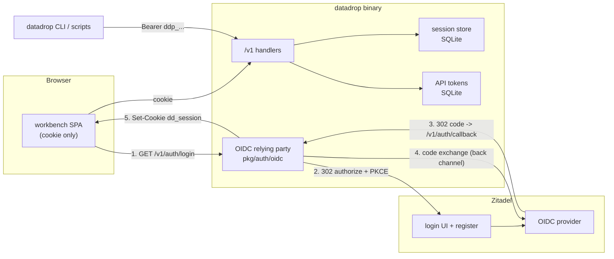
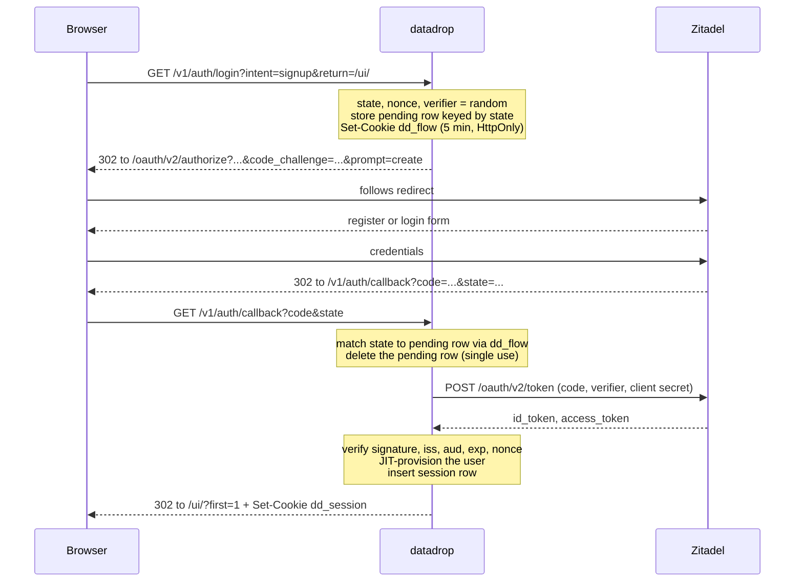
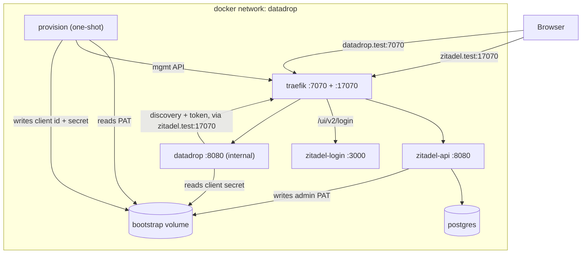
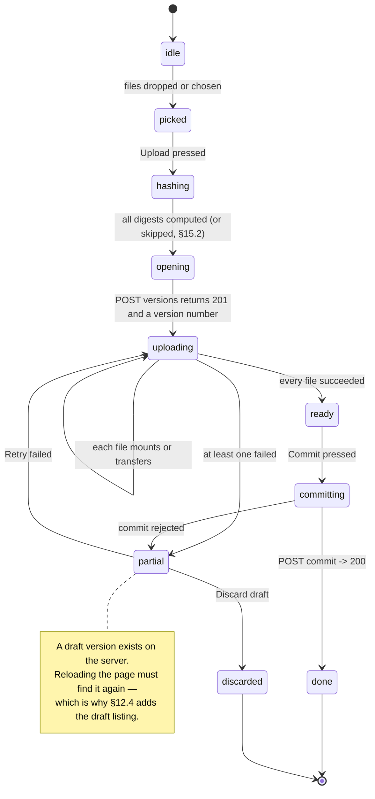

# User accounts with Zitadel: analysis, design, and implementation guide

## Who this is for

You have just joined the project. You know Go and TypeScript. You have used a
"Sign in with…" button and you may have configured an OAuth application once,
but you have probably never had to *hold the other end* of that protocol — to
decide what a session is, where a credential lives, how it is revoked, and what
exactly a request is allowed to do once it arrives.

That is what this ticket is about, and it is a different kind of work from
DATADROP-3 and DATADROP-4. Those two were about *shape*: getting the data model
and the interaction model right, where being wrong meant an ugly chart or a
confusing menu. This one is about *boundaries*, where being wrong means one
user reading another user's data, or a leaked credential that cannot be
revoked. There is no chart to look at that tells you it is working. The
compensating discipline is that every decision below is written down with its
alternatives, and every boundary has a test that fails loudly when it moves.

Read the guide in order.

- **§1–§5 are analysis.** What we are building, what the current auth model can
  and cannot express, the vocabulary you need, exactly what exists in the
  repository today, and what Zitadel is.
- **§6–§12 are the server design.** The identity model, authorization, sessions,
  API tokens, the Go package layout, the database migration, and the full HTTP
  reference.
- **§13 is the deployment stack.** The docker compose file, what each service is
  for, the self-provisioning bootstrap, and the two traps that eat an afternoon.
- **§14–§15 are the frontend.** New presentation types and verbs, four new
  tiles, two hardwired workspaces, and the browser side of the staged upload
  protocol.
- **§16–§21 are plan and reference.** Security checklist, testing strategy, the
  phased implementation order, the design records, and lookup tables you will
  come back to rather than read once.

One framing to carry through all of it. There are two systems here and it is
important not to blur them:

- **Zitadel answers "who is this person?"** It owns passwords, MFA, email
  verification, the registration form, and the session at the identity provider.
  We will never store a password, and we will never write a login form.
- **datadrop answers "what may this person do here?"** It owns drops, datasets,
  ownership, membership, API tokens, and the audit trail. Zitadel has no opinion
  about any of that and must not acquire one.

Every time you are unsure where a piece of behaviour belongs, ask which of those
two questions it answers. It is the single most useful heuristic in this
document, and §5.4 is where it earns its keep.

## Table of contents

1. What you are building
2. Why a single static token is not enough
3. The vocabulary
4. What exists in go-go-datadrop today
5. Zitadel: what it is, what it gives us, what it costs
6. The identity model
7. Authorization: ownership, membership, and the root principal
8. Sessions: the browser side
9. API tokens: the machine side
10. The Go package layout
11. The database migration
12. HTTP API reference
13. The docker compose stack
14. The frontend
15. The upload tile in detail
16. Security review checklist
17. Testing strategy
18. Implementation plan
19. Design records
20. Reference tables
21. Glossary and further reading

***

## 1. What you are building

At the end of this ticket, a person who has never touched the system can open
`http://datadrop.test:7070/ui/`, land on a sign-in screen, click **Create account**,
fill in a form served by Zitadel, come back to the workbench signed in as
themselves, drag a CSV onto a tile, and get a chart of it — and then mint an API
token and push more data to the same drop from a shell script.

Concretely, four things get built.

**A real identity for a request.** Today every authenticated request is the same
anonymous bearer of one shared secret; `pkg/server/middleware.go:27` names the
audit actor `"token"` with an honest comment saying there is nothing else to
say. After this ticket, a request resolves to a `Principal` carrying a stable
user id, and the audit trail carries that id.

**A deployment that stands itself up.** `docker compose up -d --wait` brings up
PostgreSQL, Zitadel, Zitadel's login UI, a reverse proxy, a one-shot
provisioning job, and datadrop — with the OIDC application created, the client
id and secret handed to datadrop, and self-registration switched on. No manual
console clicking. The provisioning job is idempotent, because you will run it
more than once.

**Four tiles and two hardwired workspaces.** `signin`, `profile`, `tokens` and
`upload`, built as PBUI applications like every other tile, in two workspaces
that are defined in code and cannot be deleted: `welcome` (shown when signed
out) and `account`.

**A staged browser uploader.** Drag files onto the upload tile; the browser
hashes them, opens a draft version, uploads only the bytes the server does not
already have, commits, and offers to materialize the result into a stream. This
is the first time the web UI writes anything, which is a deliberate and narrow
retirement of an invariant — see DR-27.

### 1.1 What is explicitly out of scope

Naming what we are *not* doing is as load-bearing as naming what we are, because
each of these is a plausible thing for a reviewer to expect.

- **Organisations and teams inside datadrop.** A drop gets an owner and a member
  list. There is no group, no nested org, no role hierarchy. Zitadel has all of
  that and we are deliberately not mirroring it (§5.4).
- **Password, MFA, and email management in our UI.** These belong to the
  identity provider. The profile tile links out to Zitadel's account page.
- **Accepting Zitadel access tokens as datadrop credentials.** Tempting, and
  rejected in DR-19 with reasons.
- **Per-dataset or per-stream ACLs.** The unit of sharing is the drop, as it has
  been since DATADROP-1.
- **Migrating existing drops to an owner.** Migration 0003 leaves `owner_id`
  NULL on existing rows and DR-25 explains why guessing is worse than leaving
  them unowned.
- **Enforcing retention.** Still stored, still not enforced, still documented as
  such. Unchanged by this ticket.

### 1.2 The one-paragraph architecture

datadrop becomes an OIDC *relying party* and a *backend for frontend*. The
browser never sees an OIDC token. It performs a redirect dance whose only
lasting artefact is an opaque, HttpOnly session cookie pointing at a row in
datadrop's own SQLite database. Machine clients — the `datadrop` CLI, scripts,
CI — use datadrop-issued API tokens that look like `ddp_<id>_<secret>`, are
stored hashed, and are revocable individually. Both credential kinds resolve
through one function to one `Principal` type, and every handler asks the same
question of that principal. Zitadel is reachable only during the redirect dance
and by the one-shot provisioning job; if Zitadel is down, existing sessions and
every API token keep working, and only new sign-ins fail.

That last sentence is a design goal, not an accident. Write it on a sticky note.



Note what does **not** appear in that diagram: an arrow from the browser to
Zitadel carrying a token, and an arrow from the API handlers to Zitadel. Step 4
is the only back-channel call, and it happens once per sign-in.

***

## 2. Why a single static token is not enough

It is worth being precise about what breaks, because "we need users" is a
statement of desire rather than of requirements, and the requirements are what
determine the design.

Today `Config.Token` (`pkg/server/server.go:34`) is one string. Everyone who can
write holds the same string. From that single fact, six concrete failures
follow.

**You cannot revoke one person.** Rotating the token logs out every client
simultaneously, including the ingest scripts on machines you do not administer.
The cost of revocation is therefore high enough that in practice nobody revokes,
which is the actual failure — not the theoretical one.

**You cannot attribute a write.** `audit_log.actor` is the constant `"token"`
(`pkg/server/middleware.go:27`). Every row in the audit trail says the same
thing, so the audit trail answers "was there a write" and never "who wrote
this". An audit trail that cannot attribute is a log.

**You cannot separate read from write, or scope from scope.** The token is
all-or-nothing. A CI job that only needs to append events to one drop holds a
credential that can delete every dataset version in the database.

**You cannot let a stranger in.** There is no signup, because there is nothing
to sign up *to* — no per-user state exists. Sharing the system means sharing the
credential, and a shared credential is not sharing.

**Read policy is a single boolean per drop.** `public_read` (`0001_init.sql:16`)
is the only expressible rule, so the only two sharing states are "everyone with
the token" and "the entire internet". There is no "these three people".

**A leaked credential is unbounded and undetectable.** A static token in a shell
history has no expiry, no last-used timestamp, no distinctive prefix that a
secret scanner could match, and no per-credential audit. You cannot tell whether
it leaked, when it was last used, or what it did.

The design in §6–§9 exists to fix exactly these six things and nothing more. If
you find yourself adding a mechanism, check it against this list; if it does not
address one of these, it is scope creep and belongs in a later ticket.

### 2.1 The requirement that shapes everything else

Of the six, one has architectural consequences far beyond its apparent size:
**machine clients must keep working without a browser.** The `datadrop` CLI is
the primary interface (`README.md` calls the project "CLI-first"), it runs on
headless machines and inside CI, and `cmd/datadrop/smoke_test.go` exercises it
end to end.

This rules out the simplest possible design — "everything is an OIDC session" —
and it is why §9 exists at all. Any scheme where the only way to obtain a
credential involves a browser redirect makes `curl` a second-class citizen, and
`curl` is not a second-class citizen here; the README's quick start is built out
of it.

So: two credential kinds, one principal. That is not a compromise, it is the
requirement.

***

## 3. The vocabulary

Skip this section if these terms are already yours. If they are not, the rest of
the guide will read as fog, and the fog is entirely avoidable — there are only
about a dozen words.

**OAuth 2.0** is a delegation protocol: it lets a user grant an application
limited access to a resource without handing over their password. It says
nothing about *who the user is*.

**OpenID Connect (OIDC)** is a thin identity layer on top of OAuth 2.0. It adds
the **ID token** — a signed JWT asserting "this person authenticated, here is
their stable identifier and some claims about them". OIDC is what you want when
the question is "who is this?", which is our question.

**Identity provider (IdP) / OpenID Provider (OP).** The system that holds the
credentials and performs the authentication. Here: Zitadel.

**Relying party (RP) / client.** The application that outsources authentication
to the IdP. Here: datadrop. You will see both words; they mean the same thing.

**Claims.** Key/value assertions inside the ID token or returned from the
userinfo endpoint. The ones we care about: `sub`, `email`, `email_verified`,
`name`, `preferred_username`.

**`sub` (subject).** The stable, opaque, provider-assigned identifier for a
user. It is the only claim that is guaranteed stable. Email addresses change;
display names change; `sub` does not. **Everything in our database keys on
`sub`, never on email.** This is the single most common design error in this
area and §6.3 returns to it.

**Authorization Code flow.** The redirect dance. The browser is sent to the IdP;
after authenticating, the IdP redirects back with a short-lived, single-use
`code`; the application exchanges that code for tokens over a back channel that
the browser cannot see. The code goes through the browser; the tokens do not.

**PKCE** (RFC 7636, "pixie"). The client generates a random `code_verifier`,
sends `code_challenge = SHA256(verifier)` with the authorization request, and
sends the raw `verifier` with the code exchange. An attacker who intercepts the
code cannot use it without the verifier. Originally for mobile apps that cannot
keep a secret; RFC 9700 (OAuth 2.0 Security Best Current Practice) now
recommends it for **all** clients, confidential ones included. We use it.

**`state`.** An opaque random value round-tripped through the redirect. It binds
the callback to the request that started it, which is what stops an attacker
from feeding you a callback for a login you never initiated (CSRF on the login
endpoint itself). Must be single-use.

**`nonce`.** A random value sent in the authorization request and echoed inside
the ID token. It binds the ID token to *this* authentication, defeating replay
of a previously issued token.

**Confidential vs public client.** A confidential client can keep a secret,
because it runs on a server. A public client cannot — a SPA's "secret" is in the
bundle, which is to say it is published. datadrop is a confidential client
running server side; the SPA is not a client at all under this design, which is
the point of §8.

**BFF (backend for frontend).** The pattern where the server-side application
performs the OAuth flow and holds the tokens, exposing only a session cookie to
the browser. The browser's credential is a cookie whose value means nothing
outside our server.

**PAT (personal access token).** A long-lived credential minted by an
application for a user, presented directly (usually as a bearer token) with no
redirect. GitHub's `ghp_…` tokens are the archetype. Ours are `ddp_…`.

**Scope.** Two unrelated uses of the same word, which is unfortunate and worth
flagging now. *OAuth scopes* (`openid`, `email`, `profile`) are what we request
from Zitadel. *datadrop scopes* (`drops:read`, `drops:write`, …) are what an
API token is allowed to do here. They never mix, and §9.4 keeps them apart.

**Session.** In this document, always *our* session: a row in datadrop's
database, referenced by an opaque cookie. Zitadel also has a session concept
(the user's login state at the IdP). When both appear in one sentence, they are
labelled "datadrop session" and "IdP session".

**JIT provisioning.** Creating the local user record on first successful sign-in
rather than by an out-of-band sync. §6.3.

**JWKS.** The IdP's published set of public keys, used to verify ID token
signatures. Fetched from the discovery document and cached; Zitadel's docs warn
that keys rotate without notice, so the cache must refresh on an unknown key id
rather than only on a timer.

***
## 4. What exists in go-go-datadrop today

Before designing anything, read the code that is there. This section is a map,
with line references, of every place the current authentication model touches
the system. Every one of these is a place you will edit.

### 4.1 The auth surface, file by file

| File | What it holds | Fate |
|---|---|---|
| `pkg/server/middleware.go:126-146` | `authenticate` — constant-time compare of `Config.Token`, writes a 401 problem document | rewritten as `authorize(w, r, scope)` |
| `pkg/server/middleware.go:155-181` | `authorizeRead` — token, else `public_read` on the target drop | extended with membership |
| `pkg/server/middleware.go:184-191` | `bearerToken` — parses the `Authorization` header | kept verbatim |
| `pkg/server/middleware.go:27` | `ActorLabel = "token"` | replaced by the principal's label |
| `pkg/server/middleware.go:194-196` | `auditContext` — tags the context with the actor | rewritten to carry the principal |
| `pkg/server/server.go:31-36` | `Config.Token` | joined by `Config.Auth`, `Config.OIDC`, `Config.ExternalURL` |
| `pkg/server/server.go:110-170` | the route table | gains `/v1/auth/*`, `/v1/me/*` |
| `pkg/server/server.go:172-177` | the middleware chain | gains a principal-resolving middleware |
| `pkg/cli/serve.go:59-70` | the `serve` flag surface | gains `--auth`, `--oidc-*`, `--external-url`, `--session-key` |
| `pkg/cli/serve.go:100-102` | the "no token configured" warning | extended per mode |
| `pkg/store/helpers.go:122-127` | `WithActor` / `ActorFromContext` | value becomes a user id |
| `pkg/store/migrations/0001_init.sql:12-17` | `drops` — name, created_at, retention, public_read | gains `owner_id` in 0003 |
| `pkg/store/migrations/0001_init.sql:57-64` | `audit_log` — actor is free text | unchanged in shape, changed in content |
| `ui/src/api/client.ts:10-38` | `readToken`/`writeToken` in `sessionStorage` | kept for the token mode, joined by a session |

Count the call sites before you start, so you can check you got them all:

```bash
grep -rn "s.authenticate(\|s.authorizeRead(" pkg/server/ | wc -l
```

### 4.2 The three shapes of a request today

Every handler in `pkg/server/` opens with one of exactly three prologues, and
recognising them is how you will do the mechanical part of this ticket quickly.

```go
// (a) mutating: requires the token, unconditionally
if !s.authenticate(w, r) { return }

// (b) reading: requires the token unless the drop is public
if !s.authorizeRead(w, r, dropName) { return }

// (c) unauthenticated: /healthz, and everything under /ui and /static
```

The shape survives. `(a)` becomes `p, ok := s.authorize(w, r, ScopeDropsWrite)`
and `(b)` becomes `p, ok := s.authorizeDrop(w, r, dropName, RoleReader)`. The
`if !… { return }` idiom, which the codebase already uses consistently and which
`middleware.go:122` documents as deliberate, is preserved — it is a good idiom
and there is no reason to churn it.

### 4.3 The staged upload protocol, as it exists

The upload tile drives an API that is already built and already correct. Read
it before designing the tile, because the tile's job is to *expose* this
protocol honestly, not to invent one.

```
POST   /v1/drops/{d}/datasets/{s}/versions              -> 201 {version: N, state: "draft"}
PUT    /v1/drops/{d}/datasets/{s}/versions/{N}/files/{path...}?digest=sha256:…
GET    /v1/blobs/{digest}  (HEAD)                        -> 200 if the bytes are already held
POST   /v1/drops/{d}/datasets/{s}/versions/{N}/commit    -> 200, version becomes immutable
POST   /v1/drops/{d}/datasets/{s}/versions/{N}/import    -> materialize rows into a stream
```

Two properties of this protocol are worth internalising because the tile depends
on both:

**Digest mounting.** `handleUploadDatasetFile`
(`pkg/server/handlers_blobs.go:34-88`) accepts a `PUT` with `?digest=` and *no
body*. If the server already holds those bytes it records the metadata row and
transfers nothing. Its doc comment calls this "the fast path that makes
republishing a dataset with one changed file cheap, and it is why the upload
protocol is staged at all." A browser that hashes before it uploads gets this
for free, and re-uploading a 400 MB file after fixing a typo in a 2 KB README
costs 2 KB.

**Drafts are invisible.** `handleGetDatasetVersion`
(`pkg/server/handlers_datasets.go:74-96`) passes `includeDrafts=false` with the
comment "a reader must never observe a version that is still being assembled",
and `store.ListDatasetVersions` (`pkg/store/datasets.go:440`) is documented as
returning "a dataset's committed versions, newest first".

That second property is correct for readers and is a **genuine gap for the
uploader**, which §4.5 picks up.

### 4.4 The frontend's current relationship to the server

`ui/src/api/client.ts` opens with:

> Every endpoint here is a GET. The workbench reads and never writes, which is
> what makes the auth model below safe: a compromised bundle can read exactly
> what the token could already read, and can write nothing.

and, on the storage of the token:

> sessionStorage, not localStorage: a credential that outlives the tab is a
> credential that outlives the user's attention. And no cookie is ever set, so
> no request is ever ambiently authenticated — which is why the read-only UI
> cannot introduce a CSRF surface onto the mutating endpoints it never calls.

Both paragraphs become false in this ticket. That is not a problem, but it is
exactly the kind of comment that quietly rots into a lie, so **updating these
two comments is an acceptance criterion of phase 5**, not an afterthought. The
reasoning they contain is still the reasoning we want; it is the premises that
change, and the new comment must say what the new premises are.

The defensive machinery already in place, which this ticket leans on:

- `ui/src/store/persist.ts:34` — `FORBIDDEN` matches `token|authorization|auth|
  bearer|secret|password|apikey|api_key` as a key name anywhere in the persisted
  payload, and `findSecrets` walks the tree cycle-safely. There is already a
  test asserting the persisted payload is clean. A token secret that leaks into
  a chart specification therefore fails a test rather than shipping.
- `ui/test/layers.test.ts` — the one-way import graph. New code must be placed
  in a layer, and the new layer edges are named in §14.7.

### 4.5 What is missing, discovered by reading

Three gaps only become visible when you try to build the tiles. Each is a
required API change, not a nice-to-have.

**A client cannot see its own draft.** Open a version, upload three of five
files, reload the page: the draft version number is gone and nothing in the API
will tell you it exists. `GET …/versions/{N}` returns 404 for a draft and there
is no listing that includes drafts. The upload tile must be able to resume or
discard, so §12.4 adds `GET …/datasets/{s}/versions?state=draft`, authorized to
principals who may write the drop.

**There is no "who am I".** The SPA has no way to ask the server about the
current principal, which it needs on every load to decide between the `welcome`
and `account` workspaces. §12.2 adds `GET /v1/me`.

**There is no per-drop membership.** `public_read` is the only sharing
primitive. §7 adds `drop_members`.

***

## 5. Zitadel: what it is, what it gives us, what it costs

### 5.1 What it is

Zitadel is an open-source identity and access management server written in Go.
It stores users, runs the login and registration UI, implements OIDC, OAuth 2.0,
SAML and SCIM, and exposes management APIs. It is event-sourced over PostgreSQL,
which is why the compose stack has a database service and why first-boot does a
noticeable amount of work.

Two structural facts about a modern Zitadel deployment shape our compose file
(§13) and surprise people who last looked at it a few versions ago:

- **The login UI is a separate service.** Since the "Login v2" work, the
  authentication UI is a Next.js application (`ghcr.io/zitadel/zitadel-login`)
  that talks to the core API as a machine user holding the `IAM_LOGIN_CLIENT`
  role. The core writes that machine user's personal access token to a shared
  volume on first boot and the login container reads it from there.
- **Therefore there is a reverse proxy.** The core API and the login UI must
  appear on *one* origin, because the OIDC issuer identity is an origin. The
  official compose uses Traefik with path-based routing: `/ui/v2/login` to the
  login service, everything else to the core.

The upstream compose file — which §13 adapts rather than replaces — is at
`https://raw.githubusercontent.com/zitadel/zitadel/main/deploy/compose/docker-compose.yml`.
Read it once in full. It is the reference; ours is a superset with datadrop and
a provisioning job added.

### 5.2 What we actually use

Very little, and that is on purpose (DR-18).

| Zitadel feature | Used how | Where |
|---|---|---|
| OIDC discovery | one GET at startup, cached | `pkg/auth/oidc` |
| Authorization Code + PKCE | the sign-in redirect | `/v1/auth/login`, `/v1/auth/callback` |
| ID token + JWKS | verify the assertion, read `sub`/`email`/`name` | code exchange |
| `prompt=create` | the **Create account** button | §6.5 |
| RP-initiated logout | `/v1/auth/logout` with `id_token_hint` | §8.6 |
| Login policy `allowRegister` | set once at provisioning | §13.5 |
| Management API v1 | create project + OIDC app at provisioning | §13.5 |

The userinfo endpoint is available and we deliberately do not call it on every
request; §6.4 explains why the ID token's claims are enough.

### 5.3 The endpoints, verified

From Zitadel's endpoint reference, relative to the instance origin:

| Purpose | Path |
|---|---|
| Discovery | `/.well-known/openid-configuration` |
| Authorization | `/oauth/v2/authorize` |
| Token | `/oauth/v2/token` |
| Userinfo | `/oidc/v1/userinfo` |
| End session | `/oidc/v1/end_session` |
| Introspection | `/oauth/v2/introspect` |
| Revocation | `/oauth/v2/revoke` |
| JWKS | `/oauth/v2/keys` |

**Do not hard-code any of these.** Fetch the discovery document and read the
endpoints out of it. That is one line with `go-oidc`, it is what makes DR-18
true rather than aspirational, and it is how you find out early that your issuer
URL is wrong (§13.3) instead of at the token exchange.

### 5.4 What it costs, and the boundary that keeps the cost down

Adopting an IdP creates a standing temptation: Zitadel has organisations,
projects, roles, grants, metadata, and a rich management API, so why build
membership in datadrop at all?

Three reasons, and this is the heuristic from the introduction doing its work.

**It answers the wrong question.** Zitadel's roles describe what a user is
within an *identity* system. A drop's member list describes what a user may do
to a *dataset*. Modelling the second in the first means a drop is a Zitadel
project and adding a collaborator is a management API call — a network round
trip, an availability dependency, and an inconsistency window on every
permission check.

**It breaks the availability property.** §1.2 promises that a Zitadel outage
affects only new sign-ins. Putting authorization data in Zitadel means an outage
takes down every request.

**It makes the IdP non-swappable.** DR-18 says a different OIDC provider should
be a configuration change. That is only true if nothing but authentication
depends on the provider.

So the boundary is:

- **Zitadel holds:** credentials, MFA, email verification, the user's name and
  email, the registration flow, the IdP session.
- **datadrop holds:** the `users` table (keyed on `sub`), drops, ownership,
  membership, API tokens, sessions, audit.

The `users` table duplicates `email` and `name` from Zitadel. That duplication
is a cache, it is refreshed on every sign-in, and it is never authoritative —
§6.3 says exactly what that means when they disagree.

### 5.5 Choosing the Go library

| Option | For | Against |
|---|---|---|
| `github.com/coreos/go-oidc/v3` + `golang.org/x/oauth2` | small, provider-neutral, does discovery + JWKS + verification and nothing else; `x/oauth2` has first-class PKCE helpers since v0.13 | you write the handlers, the state store, and the cookie yourself |
| `github.com/zitadel/oidc/v3/pkg/client/rp` | `AuthURLHandler` / `CodeExchangeHandler` do the dance; `WithPKCE` handles the verifier | opinionated about cookies and state, which are precisely the two things we want to own; and it is the IdP vendor's library, which cuts against DR-18 |

**Choose `coreos/go-oidc` + `x/oauth2`.** The handlers we would be handed are
about forty lines we want to write anyway, because the session decision in §8 is
the heart of this ticket and it should not be a library's default. The relevant
`x/oauth2` API:

```go
verifier := oauth2.GenerateVerifier()                   // 32 octets, RFC 7636
url := cfg.AuthCodeURL(state, oauth2.S256ChallengeOption(verifier),
                              oidc.Nonce(nonce))
tok, err := cfg.Exchange(ctx, code, oauth2.VerifierOption(verifier))
```

Add to `go.mod`:

```
github.com/coreos/go-oidc/v3 v3.x
golang.org/x/oauth2 v0.3x
```

Both are pure Go with small dependency trees, which matters: `go.mod` currently
has eleven direct requirements and the project's single-binary story is one of
its selling points.

***

## 6. The identity model

### 6.1 The Principal

One type, produced by one function, consumed by every handler.

```go
// pkg/auth/principal.go

type Kind uint8

const (
    KindAnonymous Kind = iota // no credential presented
    KindRoot                  // the static --token: unlimited, unattributed
    KindSession               // a browser session cookie
    KindToken                 // a datadrop API token
)

// Principal is the answer to "who is making this request".
//
// It is computed once per request by the resolver middleware and carried in the
// context. Handlers never re-derive it and never look at headers themselves.
type Principal struct {
    Kind    Kind
    UserID  string   // "" for Anonymous and Root
    Scopes  ScopeSet // what the *credential* permits; see §9.4
    TokenID string   // set for KindToken, for audit and last-used tracking
    Label   string   // the audit actor string; never the credential itself
}

func (p Principal) IsAuthenticated() bool { return p.Kind != KindAnonymous }
```

`Label` deserves a note. `middleware.go:24-27` already establishes the rule that
the audit actor is never the credential, with the comment "Tokens must never
reach a log line, an audit row, or a response body". That rule is unchanged and
now has something useful to say instead:

| Kind | Label |
|---|---|
| `KindRoot` | `"root"` |
| `KindSession` | `"user:" + UserID` |
| `KindToken` | `"user:" + UserID + " via token:" + TokenID` |
| `KindAnonymous` | `""` |

`TokenID` is the *public* half of the token (§9.2), so it is safe in a log and
is exactly what you need when you are told a credential leaked and have to work
out what it did.

### 6.2 The resolver

```
resolve(request) -> Principal:

    # 1. Authorization: Bearer …
    if header present:
        raw = bearerToken(request)
        if authMode has a static token and constant_time_eq(raw, staticToken):
            return Principal{Kind: Root, Scopes: ALL, Label: "root"}
        if raw starts with "ddp_":
            return resolveAPIToken(raw)          # §9.3
        return Anonymous                          # unknown bearer: not an error yet

    # 2. Cookie
    if cookie "dd_session" present:
        return resolveSession(cookie.Value)       # §8.4

    return Anonymous
```

Four properties of this function are deliberate and each is a place to get it
wrong.

**Bearer wins over cookie.** A request carrying both is treated as the bearer's.
This makes an explicit credential beat an ambient one, which is the safe
direction: it means a token-authenticated `curl` from a browser-logged-in
developer behaves as the token, not as the human.

**The resolver never writes a response.** It resolves or returns anonymous. The
401 is written by `authorize`, which knows what was required. A resolver that
writes its own 401 makes `/healthz` and the SPA shell unreachable without
special-casing.

**A bad credential resolves to anonymous, not to an error.** A request with a
garbage bearer token to a `public_read` drop should succeed, because the drop is
public. Conflating "presented something invalid" with "denied" breaks that, and
it also leaks whether a token id exists.

**The static token check is first and constant-time.** Preserve
`subtle.ConstantTimeCompare` from `middleware.go:139`. Do not be tempted to
`switch` on a prefix before comparing; the static token is operator-chosen and
may be anything, including something starting with `ddp_`.

### 6.3 The `users` table and JIT provisioning

A user row is created the first time a `sub` completes a sign-in.

```sql
CREATE TABLE users (
    id          TEXT PRIMARY KEY,   -- our id: "usr_" + 22 chars of base32
    subject     TEXT NOT NULL,      -- the OIDC `sub`
    issuer      TEXT NOT NULL,      -- the OIDC issuer URL
    email       TEXT,               -- cached from claims, NOT authoritative
    name        TEXT,               -- cached from claims, NOT authoritative
    created_at  TEXT NOT NULL,
    last_seen_at TEXT NOT NULL,
    disabled    INTEGER NOT NULL DEFAULT 0,
    UNIQUE (issuer, subject)
);
```

Five decisions are encoded in that table.

**The key is `(issuer, subject)`, not `subject` alone.** `sub` is only unique
within an issuer. Including the issuer means pointing a deployment at a second
IdP, or migrating between them, produces distinct users rather than a silent
account merge — which is the failure mode you least want to discover in
production.

**We mint our own `id` rather than using `sub` as the primary key.** `sub` is an
opaque provider string of unbounded shape; ours appears in foreign keys, audit
rows, URLs and log lines. A stable local identifier that we control means
changing IdP does not rewrite half the database, and it means an audit row does
not contain a foreign system's identifier forever.

**Email is a cache and is never a key.** People change email addresses, and
providers reuse them. `users.email` exists so the UI can show something without
a network call. Any code that looks up a user *by* email is a bug. Consider a
CI grep for `WHERE email` as a cheap guard.

**Claims are refreshed on every sign-in, not on every request.** The sign-in is
the only moment we have a fresh assertion. Between sign-ins, a name change at
the IdP is invisible here, and that is an acceptable staleness for a display
name. Do not "fix" it by calling userinfo per request — that is a network round
trip on the hot path to keep a display string fresh.

**`disabled` is ours, not the IdP's.** An operator must be able to lock an
account out of datadrop without touching Zitadel — for instance because that
account is uploading garbage, which is a datadrop problem and not an identity
problem. A disabled user's sessions and tokens all fail at resolve time.

The provisioning step in pseudocode:

```
onSuccessfulSignIn(idToken):
    claims = verify(idToken)                      # signature, iss, aud, exp, nonce

    if requireVerifiedEmail and not claims.email_verified:
        return error "email not verified"          # §13.6 for why this defaults off locally

    user = users.findBy(issuer=claims.iss, subject=claims.sub)
    if user is null:
        user = users.insert(id=newUserID(), issuer=claims.iss, subject=claims.sub,
                            email=claims.email, name=displayName(claims))
        audit("user.create", actor="user:"+user.id)
    else:
        users.update(user.id, email=claims.email, name=displayName(claims),
                     last_seen_at=now)

    if user.disabled:
        return error "account disabled"

    return user
```

`displayName(claims)` prefers `name`, then `preferred_username`, then the local
part of `email`, then `"(unnamed)"`. It must never return empty, because the
whole UI treats a user's name as a display string and a blank chip is a bug
report.

### 6.4 Why the ID token is enough

A recurring instinct is to call `/oidc/v1/userinfo` after the exchange "to get
the full profile". We do not, for three reasons.

- The ID token from the code exchange already carries `sub`, and with the
  `email` and `profile` scopes it carries `email`, `email_verified`, `name` and
  `preferred_username`. That is the complete set we store.
- It is signed and verified locally against JWKS, so it needs no network call
  and cannot be affected by an IdP that is briefly unavailable at that instant.
- One fewer call means one fewer failure mode in the most fragile part of the
  flow.

The caveat, and it is real: Zitadel's documentation notes that when an access
token is issued, some claims may be omitted from the ID token unless "User Info
inside ID Token" is enabled on the application. Our provisioning (§13.5) sets
`idTokenUserinfoAssertion: true` for exactly this reason. If you skip that, the
symptom is a signed-in user with a blank name and no email, and the cause is
three layers away from the symptom — which is why it is called out here and
again in §13.7.

### 6.5 Signup

There is no signup form in datadrop. There is a button that starts the same
redirect as sign-in with one extra parameter:

```
GET /v1/auth/login?intent=signup
  -> 302 to {authorization_endpoint}?…&prompt=create
```

`prompt=create` comes from the OIDC "Initiating User Registration" extension and
Zitadel honours it by showing the registration form instead of the login form.
It requires the login policy's `allowRegister` to be true, which §13.5 sets at
provisioning time.

Everything after that is identical to sign-in: the callback arrives, the claims
verify, no user row exists for that `sub`, and JIT provisioning creates one. **A
signup and a first sign-in are the same code path**, which is why there is
nothing more to say about signup than one query parameter. That is the payoff
for putting registration at the IdP.

The one thing to get right is the *destination*. A first-time user should land
somewhere that explains what to do next, so the callback redirects to the
`account` workspace on first sign-in and to the last-used workspace otherwise.
That single bit — "was this user just created" — is the only difference the flow
carries, and it is passed as a query parameter to the SPA, not stored.

***
## 7. Authorization: ownership, membership, and the root principal

Authentication asks who. Authorization asks what they may do. These are
different questions and the code keeps them in different functions, because the
commonest authorization bug in the world is a handler that checked the first and
believed it had answered the second.

### 7.1 The unit of sharing is the drop

A drop already is "the unit of naming, sharing, and export"
(`pkg/datadrop/drop.go:11`). We take that comment at its word and add ownership
and membership at exactly that level — not at the dataset, not at the stream.

```sql
ALTER TABLE drops ADD COLUMN owner_id TEXT REFERENCES users (id);

CREATE TABLE drop_members (
    drop_name TEXT NOT NULL REFERENCES drops (name) ON DELETE CASCADE,
    user_id   TEXT NOT NULL REFERENCES users (id) ON DELETE CASCADE,
    role      TEXT NOT NULL,           -- 'reader' | 'writer' | 'admin'
    added_at  TEXT NOT NULL,
    added_by  TEXT,                    -- user id, for the audit trail
    PRIMARY KEY (drop_name, user_id)
);

CREATE INDEX idx_drop_members_user ON drop_members (user_id);
```

Three roles, deliberately few:

| Role | May |
|---|---|
| `reader` | read events, streams, tables, datasets, exports |
| `writer` | everything a reader may, plus append events, upload and commit datasets, put schemas |
| `admin` | everything a writer may, plus manage members, set `public_read`, delete versions, delete the drop |

The owner is an implicit `admin` and cannot be removed from their own drop. The
index on `user_id` is not optional: "which drops may I see" is the query behind
every listing the UI does, and without it, it is a full scan on every page load.

### 7.2 The decision function

```
// role a principal effectively holds on a drop
effectiveRole(principal, drop) -> Role | none:

    if principal.Kind == Root:            return admin      # §7.4
    if principal.Kind == Anonymous:       return drop.public_read ? reader : none

    if drop.owner_id == principal.UserID: return admin
    if member := drop_members[drop.name, principal.UserID]: return member.role
    if drop.public_read:                  return reader
    return none


authorizeDrop(principal, drop, required) -> bool:
    role = effectiveRole(principal, drop)
    if role is none or role < required:   return false

    # A credential can only ever NARROW what the user may do (§9.4).
    return principal.Scopes.permits(required)
```

The last two lines are the important ones and DR-24 is about them.

**Rights are the intersection of membership and credential scope, computed at
request time.** A token is not a capability that carries rights of its own; it
is a *narrowed view* of its owner's rights. The consequences:

- Removing someone from a drop instantly narrows every token they hold. There is
  no token to hunt down and revoke.
- A token can never be minted with more power than its owner has, and it cannot
  grow into more power later. Escalation by minting is impossible by
  construction rather than by a check at mint time.
- The check is two cheap lookups on the hot path, both indexed.

The alternative — baking a drop list into the token at mint time — is faster by
one query and wrong in a way that only shows up during an incident, when
revoking access does not revoke access.

### 7.3 Unowned drops

`owner_id` is nullable and existing rows get NULL. An unowned drop is:

- readable by anyone if `public_read` is set, exactly as today;
- otherwise readable and writable only by the root principal;
- claimable: `POST /v1/drops/{name}/claim` sets `owner_id` to the caller, and
  it fails with 409 if the drop already has an owner.

DR-25 covers why we do not guess an owner. Briefly: any automatic assignment is
a silent grant of access to data the recipient may never have been entitled to,
and it happens at migration time when nobody is watching. NULL is honest, it is
visibly incomplete in the UI, and claiming is one click.

### 7.4 The root principal and the auth modes

`--token` does not go away. It becomes one of three modes.

```
--auth=none    no credential is required for anything.        Local development.
--auth=token   the static --token is the only credential.     Today's behaviour.
--auth=oidc    OIDC sessions and API tokens.                  The new default for the compose stack.
```

In `oidc` mode a `--token` may *also* be set, and it yields the root principal.
This is not a backwards-compatibility shim — it is an operator break-glass and a
test fixture, and it is the reason `cmd/datadrop/smoke_test.go` and the seeding
scripts keep working without acquiring a browser dependency. It is guarded:

- startup logs `WARN` naming the mode and whether a root token is configured;
- `--auth=oidc` with no `--oidc-issuer` is a **startup error**, not a warning,
  because a server that silently falls back to open is the worst outcome in this
  entire document;
- root actions are audited with actor `"root"`, which is distinguishable in the
  audit trail from every real user.

The mode is reported by `GET /v1/me` so the SPA can render the right shell
(§14.6) rather than guessing from a 401.

### 7.5 What each existing endpoint requires

This table is the mechanical part of phase 2. Work down it.

| Endpoint | Today | After |
|---|---|---|
| `POST /v1/drops` | token | authenticated; caller becomes `owner_id` |
| `GET /v1/drops` | token or public | authenticated → drops they may read; anonymous → `public_read` only |
| `GET /v1/drops/{n}` | `authorizeRead` | `reader` |
| `POST /v1/drops/{n}/events` | token | `writer` + `drops:write` |
| `GET /v1/drops/{n}/events` | `authorizeRead` | `reader` |
| `GET /v1/drops/{n}/events/stream` | `authorizeRead` | `reader` |
| `GET /v1/drops/{n}/export` | `authorizeRead` | `reader` |
| `GET /v1/drops/{n}/streams` | `authorizeRead` | `reader` |
| `GET /v1/drops/{n}/table` | `authorizeRead` | `reader` |
| `PUT /v1/drops/{n}/schemas/{s}` | token | `writer` + `drops:write` |
| `GET /v1/drops/{n}/schemas/{s}` | `authorizeRead` | `reader` |
| `GET …/datasets`, `…/datasets/{d}` | `authorizeRead` | `reader` |
| `POST …/versions` | token | `writer` + `datasets:write` |
| `PUT …/files/{path…}` | token | `writer` + `datasets:write` |
| `POST …/commit` | token | `writer` + `datasets:write` |
| `POST …/import` | token | `writer` + `drops:write` |
| `DELETE …/versions/{v}` | token | `admin` |
| `GET …/versions/{v}/archive`, `…/table`, `…/files/…` | `authorizeRead` | `reader` |
| `HEAD /v1/blobs/{digest}` | token | authenticated (see below) |
| `POST /v1/blobs/gc` | token | root or `admin` scope |
| `GET /healthz` | open | open |

**`HEAD /v1/blobs/{digest}` needs a moment's thought.** It answers "do you
already hold these bytes", which is an existence oracle over content: an
attacker who can guess a file's exact bytes can confirm the server holds it.
That is a weak leak and the endpoint is load-bearing for the upload fast path,
so the resolution is to require authentication (not membership) and to
rate-limit it. Document the leak rather than pretending it is not one.

`POST /v1/blobs/gc` deletes unreferenced bytes across the whole database. It is
an instance-wide operation and there is no per-drop sense in which a member may
perform it, so it requires root or the `admin` scope.

***

## 8. Sessions: the browser side

### 8.1 The three ways to do this, and why we pick the third

| | A. Tokens in JS | B. Zitadel access token as our Bearer | C. BFF + session cookie |
|---|---|---|---|
| SPA is an OIDC client | yes (public) | yes (public) | no |
| Where the refresh token lives | browser | browser | nowhere (§8.3) |
| XSS blast radius | full tokens exfiltrated, valid at the IdP | same | one HttpOnly cookie, unreadable by script |
| Token validation cost | — | JWKS verify or introspect per request | one indexed SQLite lookup |
| Revocation | wait for expiry | wait for expiry, or introspection per request | `DELETE FROM sessions` |
| CSRF surface | none (no ambient credential) | none | **real, must be handled (§8.5)** |
| Works if the IdP is down | until expiry | until expiry, or not at all if introspecting | yes, indefinitely |
| CLI parity | no | no | no — solved separately by §9 |

**C, the BFF.** The deciding argument is the third row. A cross-site scripting
bug in a data-visualisation application that renders user-supplied column names
is not a hypothetical, and the difference between "the attacker steals a
credential that is valid at the identity provider" and "the attacker can make
requests while the page is open" is the difference between a bad week and a very
bad quarter.

The cost of C is that we take on CSRF, which we had previously eliminated by
having no ambient credential at all. That is a real cost, it is paid in §8.5,
and it is paid with a mechanism that is checkable in one place.

Option B deserves a sentence of its own because it looks elegant: let Zitadel's
access token be datadrop's credential, validate it by JWKS or introspection,
done. It fails on revocation (a JWT is valid until it expires, and introspection
is a network call on every request), on the CLI (which would need a browser to
get one), and on DR-18 (accepting a foreign token format is a coupling that is
very hard to undo).

### 8.2 The flow, precisely



The pending-flow row holds `state`, `nonce`, `verifier`, `return`, `created_at`,
and nothing else. It is deleted on use and swept after five minutes. It lives in
SQLite rather than in memory because a restart mid-flow should produce a clean
"please try again" rather than a mystery, and because a future two-process
deployment should not be a rewrite.

`return` must be validated as a *path* on our own origin — leading `/`, no
`//`, no scheme. An unvalidated return parameter is an open redirect, and an
open redirect on a login endpoint is a phishing primitive.

### 8.3 What the session row holds — and what it does not

```sql
CREATE TABLE sessions (
    id            TEXT PRIMARY KEY,   -- sha256 of the cookie value, hex
    user_id       TEXT NOT NULL REFERENCES users (id) ON DELETE CASCADE,
    created_at    TEXT NOT NULL,
    last_seen_at  TEXT NOT NULL,
    expires_at    TEXT NOT NULL,      -- absolute deadline, never extended
    id_token      TEXT,               -- for RP-initiated logout only
    user_agent    TEXT,               -- for "your sessions" in the profile tile
    ip            TEXT
);

CREATE INDEX idx_sessions_user ON sessions (user_id);
CREATE INDEX idx_sessions_expiry ON sessions (expires_at);
```

**There is no refresh token here, and that is the interesting decision (DR-20).**

The reflex is to store the refresh token so the session can be renewed silently.
Ask what we would use it for. We call no API on the user's behalf: authorization
is entirely local (§7), and the profile is a cache refreshed at sign-in (§6.3).
The refresh token would exist purely to extend our own session — a lifetime we
already control directly.

So we drop it. What we get:

- the most sensitive artefact in the whole flow is never persisted, so it cannot
  leak from our database, our backups, or our logs;
- session lifetime is one number in our config instead of an emergent property
  of two systems' expiry settings;
- re-authentication is a redirect, and because the user is usually still signed
  in *at Zitadel*, that redirect is invisible — no form, no prompt.

What we give up: a user whose IdP session has also expired sees a login form
after our absolute deadline. That is correct behaviour, not a regression.

Lifetimes: **absolute 12 hours, idle 2 hours.** `expires_at` is set once and
never extended; idle timeout is `now - last_seen_at > 2h`. Extending the
absolute deadline on activity is how a session becomes immortal, and an immortal
session is a credential with no expiry wearing a different hat.

`id_token` is stored solely to pass as `id_token_hint` to the end-session
endpoint (§8.6). It contains PII — note it in whatever data inventory this
deployment keeps — and it is deleted with the row on sign-out.

### 8.4 The cookie

```go
http.SetCookie(w, &http.Cookie{
    Name:     "dd_session",
    Value:    raw,                    // 32 bytes from crypto/rand, base64url
    Path:     "/",
    HttpOnly: true,
    Secure:   externalURL.Scheme == "https",
    SameSite: http.SameSiteLaxMode,
    MaxAge:   int(absoluteLifetime.Seconds()),
})
```

- **The value is stored hashed.** `sessions.id` is `sha256(raw)`. A dump of the
  database therefore does not hand over live sessions. The value has 256 bits of
  entropy from a CSPRNG, so a fast hash is right and a slow KDF would only add
  latency to every request — same reasoning as §9.2.
- **`Secure` is conditional, and that is a compromise.** The `__Host-` prefix
  would be stricter but mandates `Secure`, and the local compose stack runs on
  plain HTTP. Browsers treat `http://localhost` as a secure context, so a
  `Secure` cookie does work there — but not for a colleague hitting your machine
  by IP or hostname, which is exactly how the stack gets demoed. So: `Secure`
  follows the configured external URL's scheme, and **`--auth=oidc` over
  `http://` logs a prominent startup warning unless the host is a
  potentially-trustworthy one** — `localhost`, `127.0.0.1`, `::1`, or any name
  ending in `.localhost`. That last case is not pedantry: §13.3 puts the compose
  stack on `datadrop.test`, and browsers treat the whole `.localhost`
  suffix as a secure context — which is also what makes `crypto.subtle`
  available to the uploader (§15.2).
- **`SameSite=Lax`** lets the top-level redirect back from Zitadel carry the
  cookie, which `Strict` would break for the navigation immediately after
  sign-in. Lax is not the CSRF defence; §8.5 is.

### 8.5 CSRF

`ui/src/api/client.ts` currently notes that having no cookie is what keeps CSRF
off the table. Introducing one puts it back on, so:

> **Rule.** A request whose method is not GET or HEAD, authenticated **by
> cookie**, is rejected unless its `Origin` header exactly equals the configured
> external origin.

```go
func (s *Server) checkOrigin(r *http.Request, p auth.Principal) bool {
    if p.Kind != auth.KindSession       { return true } // bearer is not ambient
    if r.Method == "GET" || r.Method == "HEAD" { return true }

    origin := r.Header.Get("Origin")
    if origin == "" {
        // Every browser sends Origin on cross-origin unsafe requests. Absent
        // means a non-browser client, which cannot have our cookie ambiently.
        // Reject anyway: a cookie-authenticated request with no Origin has no
        // legitimate source, and being strict here costs us nothing.
        return false
    }
    return origin == s.cfg.ExternalOrigin
}
```

Why `Origin` rather than a double-submit token:

- it is sent by every browser on every unsafe cross-origin request, and cannot
  be set or forged by page JavaScript;
- it requires no state, no token minting, no rotation, and no coordination with
  the SPA;
- there is exactly one place to read, and one test to write.

`SameSite=Lax` is defence in depth behind it, not the primary control. If you
later add a `Sec-Fetch-Site: same-origin` check, add it *alongside* the origin
check, not instead of it.

**This is the check most likely to be forgotten on a new endpoint.** Which is
why it goes in the middleware, applies to every non-GET route under `/v1`, and
gets an explicit test enumerating the mutating routes (§17.3).

### 8.6 Sign-out

Two levels, and the UI must be honest about which one it is doing.

**Local sign-out** — `POST /v1/auth/logout`: delete the session row, clear the
cookie. The user is signed out of datadrop and still signed in at Zitadel, so
clicking **Sign in** signs them straight back in with no prompt. This is
correct, and it surprises people, so the tile says so in as many words.

**Full sign-out** — `POST /v1/auth/logout?global=1`: do the above, then redirect
to Zitadel's `end_session_endpoint` with `id_token_hint` and
`post_logout_redirect_uri` pointing back at `/ui/`. The post-logout URI must be
registered on the application (§13.5) or Zitadel refuses the redirect — a very
common five-minute confusion.

### 8.7 Sweeping

Expired sessions and stale pending flows accumulate. A goroutine started by
`Server.Serve` deletes rows past `expires_at` and pending flows older than five
minutes, every five minutes, and on startup.

The resolver must not depend on the sweeper: it checks `expires_at` and the idle
deadline itself. The sweeper is hygiene, not enforcement. A sweeper that is also
the enforcement mechanism means a paused process is an authorization bypass.

***

## 9. API tokens: the machine side

### 9.1 What they are for

The CLI, CI jobs, ingest scripts, and anything else without a browser. A token
belongs to a user, carries a subset of that user's rights, has a name, an
optional expiry, and can be revoked individually.

### 9.2 Format and storage

```
ddp_7f3k9m2qx4vb_8h2n6p4r9tzw3xk5mcqf7bdy1sav0jne
└┬─┘└─────┬─────┘ └──────────────┬─────────────────┘
 │        │                      └─ secret: 20 bytes, base32, 160 bits
 │        └─ id: 8 bytes, base32, public, stored in plaintext
 └─ fixed prefix
```

Each part earns its place.

**The `ddp_` prefix** makes a leaked token findable. GitHub's secret scanning,
`gitleaks`, and a two-line pre-commit hook can all match a distinctive prefix; a
bare base64 blob is indistinguishable from every other base64 blob in a repo.
This is cheap and it is the single highest-value byte-for-byte decision in the
format.

**The separate public id** turns verification into one indexed lookup instead of
a scan-and-compare over every token hash in the table. It is also what makes
`TokenID` safe to put in audit rows and log lines (§6.1).

**Base32 (Crockford, no padding)** rather than base64: case-insensitive on the
wire, no `+`/`/` to be mangled by shells, URL-safe, and unambiguous when read
aloud or copied out of a terminal.

**Storage is `sha256(secret)`, not bcrypt/argon2.** This is deliberate and it is
the opposite of the rule for passwords, so it needs the reason. A slow KDF
exists to make brute-forcing a *low-entropy human-chosen* secret expensive. Our
secret is 160 bits from `crypto/rand`; it is not brute-forceable at any cost. A
KDF would add tens of milliseconds to every API request and buy nothing. Compare
in constant time.

```sql
CREATE TABLE api_tokens (
    id           TEXT PRIMARY KEY,   -- the public id, e.g. "7f3k9m2qx4vb"
    user_id      TEXT NOT NULL REFERENCES users (id) ON DELETE CASCADE,
    name         TEXT NOT NULL,
    secret_hash  TEXT NOT NULL,      -- hex sha256 of the secret half
    scopes       TEXT NOT NULL,      -- space-separated, e.g. "drops:read drops:write"
    created_at   TEXT NOT NULL,
    expires_at   TEXT,               -- NULL = no expiry
    last_used_at TEXT,
    revoked_at   TEXT
);

CREATE INDEX idx_api_tokens_user ON api_tokens (user_id);
```

Revocation is a timestamp rather than a delete, so a revoked token id still
resolves in the audit trail. The tokens tile hides revoked tokens behind a
"show revoked" toggle rather than losing them.

### 9.3 Verification

```
resolveAPIToken(raw) -> Principal:
    id, secret = parse(raw)                         # reject on shape, cheaply
    row = api_tokens[id]
    if row is null:                    return Anonymous
    if not constant_time_eq(sha256(secret), row.secret_hash): return Anonymous
    if row.revoked_at is not null:     return Anonymous
    if row.expires_at is not null and row.expires_at <= now: return Anonymous
    if users[row.user_id].disabled:    return Anonymous

    touchLastUsed(row.id)                           # see below
    return Principal{Kind: Token, UserID: row.user_id,
                     Scopes: parse(row.scopes), TokenID: row.id,
                     Label: "user:"+row.user_id+" via token:"+row.id}
```

Note the ordering: **hash comparison happens before the revoked and expired
checks.** Reversing it turns the endpoint into an oracle for "does this token id
exist and is it live", answerable without knowing the secret.

`touchLastUsed` must not write on every request. A busy ingest loop would turn
one indexed read into one write per event, and SQLite writes serialise. Keep an
in-memory map of `tokenID -> lastWrittenAt` and flush at most once per minute
per token. `last_used_at` is for a human answering "is this token still in use";
minute granularity is ample.

### 9.4 Scopes

```go
const (
    ScopeDropsRead    = "drops:read"
    ScopeDropsWrite   = "drops:write"
    ScopeDatasetsWrite = "datasets:write"
    ScopeAdmin        = "admin"
)
```

Four, and resist adding a fifth without a concrete need. Every scope is a thing
a user must understand while creating a token, and a token-creation form with
fifteen checkboxes gets "select all" clicked every time — at which point scopes
have made things worse, not better.

Remember §7.2: **scopes narrow, they never grant.** A token with `admin` held by
a user who is merely a `reader` on a drop is a reader on that drop. This is why
the token tile can offer the scopes freely without the operator having to reason
about escalation.

Sessions carry all four scopes implicitly: a human at a browser is acting with
their full rights, and a per-session scope restriction would be a feature nobody
asked for.

### 9.5 The one-time secret

The full token string is returned exactly once, in the `201` response to
`POST /v1/me/tokens`, and is never recoverable afterwards.

This has consequences that reach into the frontend and are easy to get wrong:

- the response is never cached by RTK Query;
- the secret is held in React component state, never in Redux, so it cannot
  reach `persist.ts` — and if that discipline slips, `findSecrets`
  (`ui/src/store/persist.ts:34`) fails a test rather than shipping a leak;
- the secret is **not** part of a `<token>` presentation's value, so it can
  never reach the inspector, the watchlist, or the trace (§14.3);
- the UI shows it in a panel with a copy button and a plain warning that it will
  not be shown again, and the panel closes on navigation.

### 9.6 The CLI

`pkg/client/client.go:391-392` already sends `Authorization: Bearer <token>` and
`pkg/cli/root.go:78-79` already has a `--token` flag defaulting to
`os.Getenv("DATADROP_TOKEN")`. **A
`ddp_…` token works with today's CLI unchanged**, which is the payoff for
choosing an opaque bearer format over anything cleverer.

The only CLI addition worth making in this ticket is `datadrop whoami`, hitting
`GET /v1/me` and printing the user, the token id, and the scopes. It takes
twenty lines and it is the first thing anyone runs when a credential does not
work.

Device-code flow (`datadrop login` opening a browser) is a reasonable future
addition and is out of scope; the tokens tile covers the need for now.

***
## 10. The Go package layout

### 10.1 New and changed packages

```
pkg/
  auth/                      NEW — the whole identity model, no HTTP, no SQL
    principal.go             Principal, Kind, Label
    scope.go                 ScopeSet, parse, permits
    role.go                  Role, ordering, effectiveRole
    token.go                 mint, parse, hash, verify a ddp_ token
    oidc.go                  the relying party: discovery, auth URL, exchange, verify
    auth_test.go
  store/
    migrations/0003_accounts.sql   NEW
    users.go                 NEW — CRUD on users
    sessions.go              NEW — CRUD + sweep on sessions and pending flows
    tokens.go                NEW — CRUD on api_tokens
    members.go               NEW — ownership and drop_members
    drops.go                 CHANGED — owner_id, and listing filtered by principal
  server/
    middleware.go            CHANGED — resolver, authorize, authorizeDrop, checkOrigin
    handlers_auth.go         NEW — /v1/auth/login, /callback, /logout
    handlers_me.go           NEW — /v1/me, /v1/me/tokens, /v1/me/sessions
    handlers_members.go      NEW — /v1/drops/{n}/members, /claim
    server.go                CHANGED — Config, routes, chain
  cli/
    serve.go                 CHANGED — flags
    whoami.go                NEW
deploy/
  compose/                   NEW — the stack (§13)
```

### 10.2 Why `pkg/auth` holds no HTTP and no SQL

`pkg/auth` is pure: it takes values and returns values. Token minting and
parsing, scope arithmetic, role comparison, claim validation, and the
`effectiveRole` decision all live there and are all testable with literals.

This mirrors the discipline the frontend already enforces — `ui/src/model/` is
"pure, React-free, and tested, and it is the part of the system a bad afternoon
cannot silently break" (DATADROP-4's index). Authorization deserves the same
treatment for the same reason, and more so: an authorization test that needs an
HTTP server and a database is a test nobody writes exhaustively, and
exhaustively is the only way worth writing them.

The one wrinkle is `oidc.go`, which necessarily makes network calls to the
discovery and token endpoints. It is confined to that file, behind an interface
that the server package depends on, so the rest of `pkg/auth` stays pure and the
server's tests can substitute a fake provider:

```go
type Provider interface {
    AuthCodeURL(state, nonce, verifier string, signup bool) string
    Exchange(ctx context.Context, code, verifier, nonce string) (Claims, string, error)
    EndSessionURL(idToken, postLogoutRedirect string) string
}
```

Three methods. Everything an OIDC relying party needs for this design, and a
fake implementation is about fifteen lines — which is what makes the callback
handler's tests worth having.

### 10.3 The middleware chain

```go
return chain(mux,
    s.recoverMiddleware,
    s.requestIDMiddleware,
    s.loggingMiddleware,
    s.principalMiddleware,   // NEW: resolve, put in context. Never rejects.
)
```

`principalMiddleware` runs innermost so a panic during resolution is still
caught and still carries a request id. It resolves and stores; it never writes a
response. Rejection is a per-handler decision because the required scope and role
are per-handler facts (`middleware.go:151-154` already argues this for
`authorizeRead`, and the argument generalises).

The logging middleware gains the principal's label, which is what turns the
access log into something you can answer questions with.

### 10.4 The handler prologue, after

```go
func (s *Server) handleAppendEvent(w http.ResponseWriter, r *http.Request) {
    dropName, ok := pathName(w, r, "drop", "name")
    if !ok { return }

    // Resolves the principal from the context, checks membership on this drop,
    // checks the credential's scope, and checks Origin for cookie-authenticated
    // unsafe methods. Writes the problem document on failure.
    p, ok := s.authorizeDrop(w, r, dropName, auth.RoleWriter, auth.ScopeDropsWrite)
    if !ok { return }

    ctx := auth.WithPrincipal(r.Context(), p)   // audit attribution
    …
}
```

One call, one `if`, the same shape the codebase already uses. The CSRF check
lives inside `authorizeDrop` rather than beside it precisely so that it cannot
be forgotten: there is no way to authorize a mutating request without passing
through it.

### 10.5 Configuration

```go
type Config struct {
    // … existing fields …

    // Auth selects the authentication mode: "none", "token" or "oidc".
    Auth string

    // Token remains the static root credential. In oidc mode it is optional
    // and is a break-glass; in token mode it is the only credential.
    Token string

    // ExternalURL is the origin the browser reaches this server on, e.g.
    // "http://datadrop.test:7070". It is NOT cosmetic: it determines the OIDC
    // redirect URI, the Secure attribute on the session cookie, and the Origin
    // value that the CSRF check compares against. Getting it wrong produces
    // three unrelated-looking failures.
    ExternalURL string

    OIDC OIDCConfig

    // SessionKey seeds nothing cryptographic today, because session values are
    // random rather than signed. Reserved and unused; do not add it "for
    // symmetry" without a use.
}

type OIDCConfig struct {
    Issuer       string   // e.g. "http://zitadel.test:17070"
    ClientID     string
    ClientSecret string
    Scopes       []string // default: openid, profile, email
    RequireVerifiedEmail bool
    SessionLifetime time.Duration // absolute; default 12h
    SessionIdle     time.Duration // default 2h
}
```

Corresponding `serve` flags, each with a `DATADROP_`-prefixed environment
fallback so the compose file can supply them without a shell:

```
--auth string                     none|token|oidc            [$DATADROP_AUTH]
--external-url string             browser-facing origin      [$DATADROP_EXTERNAL_URL]
--oidc-issuer string                                         [$DATADROP_OIDC_ISSUER]
--oidc-client-id string                                      [$DATADROP_OIDC_CLIENT_ID]
--oidc-client-secret string                                  [$DATADROP_OIDC_CLIENT_SECRET]
--oidc-client-secret-file string  read the secret from a file
--oidc-require-verified-email     default true
--session-lifetime duration       default 12h
--session-idle duration           default 2h
```

`--oidc-client-secret-file` is not decoration. §13.5 writes the client secret to
a shared volume, and passing a secret by file rather than by environment keeps
it out of `docker inspect`, out of the process environment that any child
process inherits, and out of a crash dump of the compose configuration.

Startup validation, in `runServe`, before anything binds:

```
if auth == "oidc":
    require issuer, client id, client secret, external URL   -> else fatal
    if external URL is http and host is not localhost/127.0.0.1:
        WARN "session cookies will be sent over plaintext HTTP"
    if token != "":
        WARN "a root token is configured alongside OIDC; it bypasses all ownership checks"
if auth == "token" and token == "":
    fatal "--auth=token requires --token"
if auth == "none":
    WARN "authentication is disabled; every request is the root principal"
```

Note the asymmetry: misconfiguring `oidc` is **fatal**, misconfiguring in the
open direction is a **warning that names the consequence**. A server that
degrades quietly to open is the failure this whole document exists to prevent.

***

## 11. The database migration

`pkg/store/migrations/0003_accounts.sql`. Follow the house style of the first
two: the file explains itself, and the explanations are about *why*, not what.

```sql
-- Accounts: users, sessions, API tokens, and per-drop membership.
--
-- See ttmp/2026/07/25/DATADROP-5--*/design/01-*.md for the rationale. The
-- load-bearing points:
--
--   * users are keyed on (issuer, subject), never on email. `sub` is the only
--     stable identifier an OIDC provider promises; email addresses change and
--     are reused. `email` and `name` here are a refreshed-at-sign-in cache and
--     are never authoritative (guide §6.3).
--   * sessions store the SHA-256 of the cookie value, not the value. A dump of
--     this file must not hand over live sessions.
--   * NO refresh token is stored. datadrop calls no API on the user's behalf,
--     so the only thing a refresh token could do here is extend a lifetime we
--     already control directly (guide §8.3, DR-20).
--   * drops.owner_id is NULLable and existing rows stay NULL. Guessing an owner
--     at migration time is a silent grant of access to data (DR-25).

CREATE TABLE users (
    id           TEXT PRIMARY KEY,
    issuer       TEXT NOT NULL,
    subject      TEXT NOT NULL,
    email        TEXT,
    name         TEXT,
    created_at   TEXT NOT NULL,
    last_seen_at TEXT NOT NULL,
    disabled     INTEGER NOT NULL DEFAULT 0,
    UNIQUE (issuer, subject)
);

CREATE TABLE sessions (
    id           TEXT PRIMARY KEY,          -- hex sha256 of the cookie value
    user_id      TEXT NOT NULL REFERENCES users (id) ON DELETE CASCADE,
    created_at   TEXT NOT NULL,
    last_seen_at TEXT NOT NULL,
    expires_at   TEXT NOT NULL,
    id_token     TEXT,
    user_agent   TEXT,
    ip           TEXT
);
CREATE INDEX idx_sessions_user   ON sessions (user_id);
CREATE INDEX idx_sessions_expiry ON sessions (expires_at);

-- A sign-in in progress. Deleted on use; swept after five minutes. In the
-- database rather than in memory so that a restart mid-flow is a clean "try
-- again" rather than a mystery, and so a second process is not a rewrite.
CREATE TABLE auth_flows (
    state      TEXT PRIMARY KEY,
    nonce      TEXT NOT NULL,
    verifier   TEXT NOT NULL,
    return_to  TEXT NOT NULL,
    created_at TEXT NOT NULL
);

CREATE TABLE api_tokens (
    id           TEXT PRIMARY KEY,          -- the public half, safe to log
    user_id      TEXT NOT NULL REFERENCES users (id) ON DELETE CASCADE,
    name         TEXT NOT NULL,
    secret_hash  TEXT NOT NULL,             -- hex sha256 of the secret half
    scopes       TEXT NOT NULL,
    created_at   TEXT NOT NULL,
    expires_at   TEXT,
    last_used_at TEXT,
    revoked_at   TEXT                       -- soft delete: the audit trail
);                                          -- must still resolve the id
CREATE INDEX idx_api_tokens_user ON api_tokens (user_id);

ALTER TABLE drops ADD COLUMN owner_id TEXT REFERENCES users (id);
CREATE INDEX idx_drops_owner ON drops (owner_id);

CREATE TABLE drop_members (
    drop_name TEXT NOT NULL REFERENCES drops (name) ON DELETE CASCADE,
    user_id   TEXT NOT NULL REFERENCES users (id) ON DELETE CASCADE,
    role      TEXT NOT NULL,
    added_at  TEXT NOT NULL,
    added_by  TEXT,
    PRIMARY KEY (drop_name, user_id)
);
CREATE INDEX idx_drop_members_user ON drop_members (user_id);
```

### 11.1 Two SQLite specifics that will bite

**`ALTER TABLE … ADD COLUMN` with a `REFERENCES` clause is accepted but the
constraint is not retroactively enforced**, and SQLite requires the added column
to have a NULL or constant default. Both are fine here — the column is nullable
and NULL is the intended value — but do not extend this pattern to a `NOT NULL`
column with a computed default without reading SQLite's ALTER TABLE
restrictions first.

**Foreign keys are only enforced if `PRAGMA foreign_keys = ON`** is set on every
connection. Check `pkg/store/store.go`'s connection setup; if it is not already
enabled, the `ON DELETE CASCADE` clauses above are documentation rather than
behaviour, and deleting a user leaves orphaned tokens that still authenticate.
**Verify this explicitly with a test** that inserts a user and a token, deletes
the user, and asserts the token is gone. It is a two-minute test and the failure
mode it catches is a live credential belonging to a deleted account.

### 11.2 Ordering

The migration runner in `pkg/store/store.go:183` uses a `schema_migrations`
table and applies files in order. 0003 must run in one transaction: a partially
applied accounts migration leaves a server that starts, resolves nothing, and
denies everything.

***

## 12. HTTP API reference

All paths under `/v1`. Errors are the existing problem documents
(`pkg/server/problem.go`). New error codes: `Forbidden` (403 — authenticated but
not permitted, distinct from `Unauthorized`), `CrossOrigin` (403), and
`AlreadyOwned` (409).

### 12.1 Authentication

#### `GET /v1/auth/login`

Starts a sign-in. **Not** an API call — a navigation.

| Param | Meaning |
|---|---|
| `intent` | `signin` (default) or `signup`; the latter adds `prompt=create` |
| `return` | a path on this origin to land on afterwards; default `/ui/` |

`302` to the provider's authorization endpoint. Sets a short-lived `dd_flow`
cookie binding the browser to the pending flow row.

`return` is validated as a path: must start with `/`, must not start with `//`,
must contain no scheme. Anything else is replaced with `/ui/` silently — an
invalid return is not worth an error page, but it is worth a debug log.

#### `GET /v1/auth/callback`

The redirect URI registered with the provider. Params `code` and `state`, or
`error` and `error_description` when the user cancelled or the provider refused.

On success: exchanges the code, verifies the ID token, provisions or refreshes
the user, creates a session, sets `dd_session`, and `302`s to the validated
`return` with `?first=1` appended when the user row was just created.

On failure: `302` to `/ui/?auth_error=<code>` — never a raw error page. The SPA
renders the failure inside the sign-in tile, which is both nicer and avoids
reflecting provider-supplied text into an HTML response.

#### `POST /v1/auth/logout`

Deletes the session and clears the cookie. `?global=1` additionally `302`s to
the provider's end-session endpoint with `id_token_hint`.

Requires the CSRF origin check (§8.5). It is `POST` rather than `GET`
specifically so that it does; a `GET /logout` can be triggered by any
`` on any page on the internet, which is a real, if petty, nuisance.

### 12.2 The current principal

#### `GET /v1/me`

The endpoint the SPA calls on every load. Never 401s — an anonymous caller gets
an anonymous answer, because "you are not signed in" is information the sign-in
screen needs, not an error.

```json
{
  "auth_mode": "oidc",
  "authenticated": true,
  "kind": "session",
  "user": {
    "id": "usr_3kf9m2qx4vb8h2n6p4r9tz",
    "email": "ada@example.org",
    "name": "Ada Lovelace",
    "created_at": "2026-07-25T14:02:11Z"
  },
  "scopes": ["drops:read", "drops:write", "datasets:write", "admin"],
  "token_id": null,
  "signup_enabled": true,
  "provider": {
    "account_url": "http://datadrop.test:7070/ui/console/users/me"
  }
}
```

`auth_mode` and `signup_enabled` are what let the SPA render the correct shell
without probing. `provider.account_url` is the "manage your account at the
identity provider" link in the profile tile, derived from the issuer rather than
hard-coded (§14.5).

Anonymous:

```json
{"auth_mode": "oidc", "authenticated": false, "kind": "anonymous",
 "scopes": [], "signup_enabled": true}
```

### 12.3 Tokens and sessions

| Method | Path | Requires | Purpose |
|---|---|---|---|
| `GET` | `/v1/me/tokens` | authenticated | list the caller's tokens; **never** includes a secret |
| `POST` | `/v1/me/tokens` | session only | mint; the only response that ever carries a secret |
| `DELETE` | `/v1/me/tokens/{id}` | authenticated | revoke (sets `revoked_at`) |
| `GET` | `/v1/me/sessions` | session only | the caller's active sessions |
| `DELETE` | `/v1/me/sessions/{id}` | session only | revoke one; `{id}` may be `others` |

**`POST /v1/me/tokens` requires a session, not just authentication.** A token
must not be able to mint another token. Without that rule, revocation stops
working: revoke the leaked token and its offspring survive, and there is no way
to enumerate what it created. Minting requires a human at a browser.

Request:

```json
{"name": "ci-ingest", "scopes": ["drops:write"], "expires_in": "90d"}
```

Response `201`:

```json
{
  "id": "7f3k9m2qx4vb",
  "name": "ci-ingest",
  "scopes": ["drops:write"],
  "created_at": "2026-07-25T14:20:00Z",
  "expires_at": "2026-10-23T14:20:00Z",
  "token": "ddp_7f3k9m2qx4vb_8h2n6p4r9tzw3xk5mcqf7bdy1sav0jne"
}
```

`token` appears in this one response and nowhere else, ever. Add a test that
`GET /v1/me/tokens` contains no field whose value starts with `ddp_`.

### 12.4 Membership, ownership, and the draft listing

| Method | Path | Requires | Purpose |
|---|---|---|---|
| `GET` | `/v1/drops/{n}/members` | `reader` | list members |
| `PUT` | `/v1/drops/{n}/members/{userId}` | `admin` | add or change a role |
| `DELETE` | `/v1/drops/{n}/members/{userId}` | `admin` | remove; 409 on the owner |
| `POST` | `/v1/drops/{n}/claim` | authenticated | take ownership of an unowned drop; 409 if owned |
| `GET` | `/v1/drops/{n}/datasets/{d}/versions?state=draft` | `writer` | **new** (§4.5) — the caller's resumable drafts |

The draft listing is the fix for the gap §4.5 found. It is gated on `writer`
rather than `reader` deliberately: `handlers_datasets.go:88-89` says "a reader
must never observe a version that is still being assembled", and that stays
true. A writer observing a half-assembled version is a different thing — it is
the person assembling it.

Adding a member needs a user id, and a human knows an email address. So:

#### `GET /v1/users/lookup?email=…`

`admin` on at least one drop. Returns `{"id": "...", "name": "..."}` or `404`.
It deliberately returns nothing else — this is an existence oracle over email
addresses, so it is rate-limited, audited, and restricted to people who already
administer something. Alternatives (an invite flow keyed on email, resolved when
the invitee first signs in) are better and are a later ticket; this is the
minimum that makes sharing usable, and its exposure is written down rather than
overlooked.

### 12.5 Changed responses

`GET /v1/drops` gains per-drop fields:

```json
{"drops": [
  {"name": "greenhouse", "created_at": "…", "public_read": false,
   "owner_id": "usr_3kf9…", "your_role": "admin"}
]}
```

`your_role` is computed for the caller: `admin` | `writer` | `reader` | `null`.
It exists so the UI can grey out an action it knows will 403 rather than
offering it and failing — which is the same principle as DATADROP-4's
`disabledBecause` on a menu entry (`ui/src/pbui/verbs.ts:57-64`): show the rule,
do not hide it.

***
## 13. The docker compose stack

### 13.1 What is in it and why

`deploy/compose/`:

```
docker-compose.yml
.env.example
provision.sh              the one-shot bootstrap
Dockerfile.datadrop       multi-stage build of the single binary
README.md                 five lines: copy .env, up --wait, open the URL
```

| Service | Image | Why it exists |
|---|---|---|
| `postgres` | `postgres:17-alpine` | Zitadel's event store. Not ours — datadrop keeps its SQLite file. |
| `zitadel-api` | `ghcr.io/zitadel/zitadel` | the core: OIDC provider, APIs, console |
| `zitadel-login` | `ghcr.io/zitadel/zitadel-login` | the Login v2 UI, a separate Next.js service (§5.1) |
| `proxy` | `traefik:v3` | puts core, login and datadrop on **one** hostname each, on one port |
| `provision` | `alpine` + `curl`/`jq` | creates the project, the OIDC app, and the login policy; writes the client credentials to a volume; exits |
| `datadrop` | built here | the application |

**datadrop keeps SQLite.** A reviewer will ask why we run PostgreSQL and then
do not use it. Because the storage engine is not what this ticket is about, the
single-file store is one of the project's defining properties, and coupling
datadrop to Postgres to save one container would be the largest change in the
ticket and entirely incidental to it.



### 13.2 The trap that eats the afternoon

**An OIDC issuer is an identity, not an address.** The issuer string in the
discovery document must match the URL the relying party used, exactly, and it
must also be the URL the browser is redirected to. If datadrop fetches discovery
from `http://zitadel-api:8080/.well-known/openid-configuration`, the document
comes back saying `"issuer": "http://zitadel.test:17070"`, and `go-oidc`
correctly refuses it:

```
oidc: issuer did not match the issuer returned by provider,
expected "http://zitadel-api:8080" got "http://zitadel.test:17070"
```

That is the good outcome. The bad one is that you "fix" it with the escape hatch
and then discover, three steps later, that the browser is being redirected to a
hostname it cannot resolve.

There are two ways out and you should understand both.

**The fix (what this stack does): one URL that works from everywhere.**

- Have the proxy listen on **7070 and 17070 inside the network and publish both
  1:1**, so the port is identical on both sides.
- Use hostnames ending in **`.test`**, pointed at 127.0.0.1 in your
  `/etc/hosts` and at the proxy's fixed address inside the network
  (`extra_hosts`). `http://zitadel.test:17070` is then one string that means the
  same thing to the browser and to the datadrop container.

> **Correction, from building this.** An earlier draft of this section used
> `*.localhost` and a docker network alias, on the reasoning that browsers
> resolve `*.localhost` to loopback for free and a network alias would redirect
> it inside the network. **That does not work, and it cannot be made to work.**
>
> RFC 6761 reserves `localhost` *and every subdomain of it* for loopback, and
> resolvers apply that rule **before** consulting `/etc/hosts`. Inside a
> container `zitadel.test` therefore means that container. Neither a
> network alias nor an `extra_hosts` entry overrides it:
>
> ```
> $ getent hosts zitadel.test      # inside the container
> 10.77.0.2   zitadel.test         # DNS says: the proxy
>
> $ curl -v http://zitadel.test:17070/debug/healthz
> * Host zitadel.test:17070 was resolved.
> *   Trying [::1]:17070...             # ...but curl goes to loopback
> ```
>
> That discrepancy — `getent` consults NSS, libc's resolver applies the RFC 6761
> shortcut first — is what makes the failure hard to read.
>
> `.test` is reserved by the same RFC but carries no resolution rule, so it can
> be pointed anywhere. The cost is one `/etc/hosts` line, which this section
> previously listed as a fallback and which is now a requirement.

**The escape hatch (know it exists, do not reach for it first):**

```go
ctx = oidc.InsecureIssuerURLContext(ctx, "http://zitadel.test:17070")
provider, err := oidc.NewProvider(ctx, "http://zitadel-api:8080")
```

This fetches from one URL while expecting a different issuer. It is legitimate —
it exists for exactly this split-horizon situation — but it only fixes the
back channel. The authorization redirect still goes through the browser, so the
browser must be able to reach the issuer's hostname regardless. Reaching for the
escape hatch first means fixing half the problem and being confused by the other
half.

### 13.3 Hostnames and ports

| Reached at | Serves |
|---|---|
| `http://datadrop.test:7070/ui/` | the workbench |
| `http://datadrop.test:7070/v1/…` | the API |
| `http://zitadel.test:17070/` | Zitadel console and OIDC endpoints |
| `http://zitadel.test:17070/ui/v2/login/` | the login and registration UI |

**Two ports, one proxy.** Port 8080 is spoken for on the development machines
this runs on — commonly by another Zitadel — so the stack takes 7070 and 17070.
Traefik gets one entrypoint per port and each router binds the entrypoint
matching its host, which keeps §13.2's property intact: every published port is identical inside and outside
the network, so a single URL string means the same thing to the browser and to
the datadrop container. Changing either port means changing it in exactly one
place — `.env` — because the redirect URI, the issuer, the cookie's `Secure`
decision and the CSRF origin are all derived from `DATADROP_BASE` and
`ZITADEL_BASE`.

So: `ZITADEL_DOMAIN=zitadel.test`, `ZITADEL_EXTERNALPORT=17070`,
`ZITADEL_EXTERNALSECURE=false`, and datadrop's
`--external-url=http://datadrop.test:7070` with
`--oidc-issuer=http://zitadel.test:17070`.

The redirect URI registered on the application is therefore
`http://datadrop.test:7070/v1/auth/callback`, and the post-logout URI is
`http://datadrop.test:7070/ui/`. Both are registered in §13.5. A mismatch
of a single character — a trailing slash, `http` versus `https`, `localhost`
versus `127.0.0.1` — produces a provider-side error page rather than a datadrop
error, which is why the provisioning script derives both from one variable
instead of restating them.

### 13.4 The compose file

Abridged to the parts that carry a decision; the Traefik router labels follow
upstream's file and are mechanical.

```yaml
name: datadrop

services:
  postgres:
    image: postgres:17-alpine
    environment:
      POSTGRES_USER: ${POSTGRES_USER}
      POSTGRES_PASSWORD: ${POSTGRES_PASSWORD}
      POSTGRES_DB: zitadel
    healthcheck:
      test: ["CMD-SHELL", "pg_isready -U ${POSTGRES_USER} -d zitadel"]
      interval: 5s
      timeout: 10s
      retries: 20
    volumes: [postgres-data:/var/lib/postgresql/data]
    networks: [datadrop]

  zitadel-api:
    image: ghcr.io/zitadel/zitadel:${ZITADEL_VERSION}
    user: "0"
    command: start-from-init --masterkey "${ZITADEL_MASTERKEY}"
    environment:
      ZITADEL_PORT: 8080
      ZITADEL_EXTERNALDOMAIN: ${ZITADEL_DOMAIN}      # zitadel.test
      ZITADEL_EXTERNALPORT: ${ZITADEL_EXTERNALPORT}  # 17070
      ZITADEL_EXTERNALSECURE: "false"
      ZITADEL_TLS_ENABLED: "false"
      ZITADEL_DATABASE_POSTGRES_DSN: ${ZITADEL_DATABASE_POSTGRES_DSN}

      # The initial human admin. Console login: zitadel-admin@zitadel.<domain>
      ZITADEL_FIRSTINSTANCE_ORG_HUMAN_PASSWORDCHANGEREQUIRED: "false"

      # An IAM_OWNER *machine* user whose personal access token is written to
      # the shared volume. This is what makes provisioning scriptable: without
      # it the only credential that exists is a password behind an interactive
      # login. Applied ONLY on first init — see §13.7.
      ZITADEL_FIRSTINSTANCE_PATPATH: /zitadel/bootstrap/admin.pat
      ZITADEL_FIRSTINSTANCE_ORG_MACHINE_MACHINE_USERNAME: provisioner
      ZITADEL_FIRSTINSTANCE_ORG_MACHINE_MACHINE_NAME: datadrop provisioner
      ZITADEL_FIRSTINSTANCE_ORG_MACHINE_PAT_EXPIRATIONDATE: "2099-01-01T00:00:00Z"

      # The Login v2 service authenticates as its own machine user.
      ZITADEL_FIRSTINSTANCE_LOGINCLIENTPATPATH: /zitadel/bootstrap/login-client.pat
      ZITADEL_FIRSTINSTANCE_ORG_LOGINCLIENT_MACHINE_USERNAME: login-client
      ZITADEL_FIRSTINSTANCE_ORG_LOGINCLIENT_MACHINE_NAME: IAM_LOGIN_CLIENT
      ZITADEL_FIRSTINSTANCE_ORG_LOGINCLIENT_PAT_EXPIRATIONDATE: "2099-01-01T00:00:00Z"

      ZITADEL_DEFAULTINSTANCE_FEATURES_LOGINV2_REQUIRED: "true"
      ZITADEL_DEFAULTINSTANCE_FEATURES_LOGINV2_BASEURI: ${ZITADEL_BASE}/ui/v2/login/
      ZITADEL_OIDC_DEFAULTLOGINURLV2: ${ZITADEL_BASE}/ui/v2/login/login?authRequest=
      ZITADEL_OIDC_DEFAULTLOGOUTURLV2: ${ZITADEL_BASE}/ui/v2/login/logout?post_logout_redirect=
    healthcheck:
      test: ["CMD", "/app/zitadel", "ready"]
      interval: 10s
      timeout: 30s
      retries: 12
      start_period: 20s
    volumes: [bootstrap:/zitadel/bootstrap:rw]
    depends_on:
      postgres: {condition: service_healthy}
    networks: [datadrop]
    labels: [...]           # /ui/v2/login -> login, everything else -> api

  zitadel-login:
    image: ghcr.io/zitadel/zitadel-login:${ZITADEL_VERSION}
    user: "0"
    environment:
      ZITADEL_API_URL: http://zitadel-api:8080
      NEXT_PUBLIC_BASE_PATH: /ui/v2/login
      ZITADEL_SERVICE_USER_TOKEN_FILE: /zitadel/bootstrap/login-client.pat
      CUSTOM_REQUEST_HEADERS: Host:${ZITADEL_DOMAIN},X-Forwarded-Proto:http
    volumes: [bootstrap:/zitadel/bootstrap:ro]
    depends_on:
      zitadel-api: {condition: service_healthy}
    networks: [datadrop]

  proxy:
    image: traefik:v3
    command:
      - --providers.docker=true
      - --providers.docker.exposedbydefault=false
      - --entrypoints.dd.address=:7070         # SAME port inside and out (§13.2)
      - --entrypoints.zitadel.address=:17070   # ditto, for the issuer origin
    ports: ["7070:7070", "17070:17070"]
    volumes: ["/var/run/docker.sock:/var/run/docker.sock:ro"]
    networks:
      datadrop:
        aliases:
          # This is the line that makes one issuer URL work from both the
          # browser and the datadrop container. Deleting it produces the
          # "issuer did not match" error in §13.2.
          - ${ZITADEL_DOMAIN}
          - ${DATADROP_DOMAIN}

  provision:
    image: alpine:3
    restart: "no"
    entrypoint: ["/bin/sh", "/provision.sh"]
    environment:
      ZITADEL_BASE: ${ZITADEL_BASE}
      DATADROP_BASE: ${DATADROP_BASE}
    volumes:
      - bootstrap:/bootstrap:rw
      - ./provision.sh:/provision.sh:ro
    depends_on:
      zitadel-api: {condition: service_healthy}
      proxy: {condition: service_started}
    networks: [datadrop]

  datadrop:
    build: {context: ../.., dockerfile: deploy/compose/Dockerfile.datadrop}
    command:
      - serve
      - --addr=:8080
      - --db=/data/datadrop.db
      - --auth=oidc
      - --external-url=${DATADROP_BASE}
      - --oidc-issuer=${ZITADEL_BASE}
      - --oidc-client-id-file=/bootstrap/datadrop-client-id
      - --oidc-client-secret-file=/bootstrap/datadrop-client-secret
      # Local stack only: the compose has no SMTP, so a self-registered user can
      # never verify their address. See §13.6 — this line is a development
      # affordance and must be removed for anything real.
      - --oidc-require-verified-email=false
    volumes:
      - datadrop-data:/data
      - bootstrap:/bootstrap:ro
    depends_on:
      provision: {condition: service_completed_successfully}
    networks: [datadrop]
    labels: [...]           # Host(`datadrop.test`) -> this service

networks:
  datadrop:
    name: datadrop

volumes:
  postgres-data:
  datadrop-data:
  bootstrap:
```

`depends_on: {provision: {condition: service_completed_successfully}}` is what
makes `docker compose up -d --wait` correct rather than racy: datadrop does not
start until the client credentials exist on the volume.

### 13.5 The provisioning script

Four calls, all against Zitadel's Management and Admin v1 REST APIs. Paths are
verified from `proto/zitadel/management.proto` and `proto/zitadel/admin.proto`.

```sh
#!/bin/sh
set -eu
apk add --no-cache curl jq >/dev/null

PAT=$(cat /bootstrap/admin.pat)
AUTH="Authorization: Bearer $PAT"
JSON="Content-Type: application/json"
API="$ZITADEL_BASE"

# ── 1. allow self-registration ────────────────────────────────────────────────
# UpdateLoginPolicy is a full replacement, not a patch: PUT with only
# allowRegister resets every other field to its zero value, which switches off
# username/password login and locks everyone out. Read, merge, write.
curl -fsS "$API/admin/v1/policies/login" -H "$AUTH" \
  | jq '.policy | {allowUsernamePassword, allowRegister: true, allowExternalIdp,
                   forceMfa, hidePasswordReset, ignoreUnknownUsernames,
                   passwordlessType, defaultRedirectUri}' \
  | curl -fsS -X PUT "$API/admin/v1/policies/login" -H "$AUTH" -H "$JSON" -d @- >/dev/null

# ── 2. the project (idempotent via search) ────────────────────────────────────
PROJECT_ID=$(curl -fsS -X POST "$API/management/v1/projects/_search" \
  -H "$AUTH" -H "$JSON" -d '{"queries":[{"nameQuery":{"name":"datadrop","method":"TEXT_QUERY_METHOD_EQUALS"}}]}' \
  | jq -r '.result[0].id // empty')

if [ -z "$PROJECT_ID" ]; then
  PROJECT_ID=$(curl -fsS -X POST "$API/management/v1/projects" \
    -H "$AUTH" -H "$JSON" -d '{"name":"datadrop"}' | jq -r '.id')
fi

# ── 3. the OIDC application ───────────────────────────────────────────────────
APP_ID=$(curl -fsS -X POST "$API/management/v1/projects/$PROJECT_ID/apps/_search" \
  -H "$AUTH" -H "$JSON" -d '{}' \
  | jq -r '.result[] | select(.name=="workbench") | .id' | head -1)

if [ -z "$APP_ID" ]; then
  RESP=$(curl -fsS -X POST "$API/management/v1/projects/$PROJECT_ID/apps/oidc" \
    -H "$AUTH" -H "$JSON" -d "{
      \"name\": \"workbench\",
      \"redirectUris\": [\"$DATADROP_BASE/v1/auth/callback\"],
      \"postLogoutRedirectUris\": [\"$DATADROP_BASE/ui/\"],
      \"responseTypes\": [\"OIDC_RESPONSE_TYPE_CODE\"],
      \"grantTypes\": [\"OIDC_GRANT_TYPE_AUTHORIZATION_CODE\"],
      \"appType\": \"OIDC_APP_TYPE_WEB\",
      \"authMethodType\": \"OIDC_AUTH_METHOD_TYPE_BASIC\",
      \"accessTokenType\": \"OIDC_TOKEN_TYPE_BEARER\",
      \"idTokenUserinfoAssertion\": true,
      \"devMode\": true
    }")
  APP_ID=$(echo "$RESP" | jq -r '.appId')
  CLIENT_ID=$(echo "$RESP" | jq -r '.clientId')
  CLIENT_SECRET=$(echo "$RESP" | jq -r '.clientSecret')
else
  # The app exists but the secret was shown once and is gone. Regenerating is
  # the only way to recover a known value, and it is safe here because the only
  # holder is the datadrop container we are about to (re)start.
  CLIENT_ID=$(curl -fsS "$API/management/v1/projects/$PROJECT_ID/apps/$APP_ID" \
    -H "$AUTH" | jq -r '.app.oidcConfig.clientId')
  CLIENT_SECRET=$(curl -fsS -X POST \
    "$API/management/v1/projects/$PROJECT_ID/apps/$APP_ID/oidc_config/_generate_client_secret" \
    -H "$AUTH" -H "$JSON" -d '{}' | jq -r '.clientSecret')
fi

# ── 4. hand the credentials to datadrop ───────────────────────────────────────
printf '%s' "$CLIENT_ID"     > /bootstrap/datadrop-client-id
printf '%s' "$CLIENT_SECRET" > /bootstrap/datadrop-client-secret
chmod 600 /bootstrap/datadrop-client-secret
echo "provisioned project=$PROJECT_ID app=$APP_ID"
```

Five things in that script are worth understanding rather than copying.

**Read-merge-write on the login policy.** `UpdateLoginPolicy` replaces the whole
policy. A `PUT` carrying only `allowRegister: true` sets
`allowUsernamePassword` to `false` — and you have just locked every user,
including the admin, out of an instance whose only other credential is a
machine PAT. The `jq` merge is the entire point of that step.

**`OIDC_AUTH_METHOD_TYPE_BASIC`, not `NONE`.** datadrop is a confidential
client: it runs server-side and can hold a secret. `NONE` would be right for a
SPA acting as its own client, which under §8's design it is not. We use PKCE
*as well*, per RFC 9700 — the two are complementary, not alternatives, and this
is the most common point of confusion in the whole configuration.

**`idTokenUserinfoAssertion: true`.** §6.4's dependency. Without it the ID token
may omit `email` and `name`, and the symptom (a signed-in user with a blank
name) is three layers away from the cause.

**`devMode: true` permits the plain-`http` redirect URI.** It is a local-stack
affordance. Anything real gets HTTPS and this flag goes.

**Idempotency is by search, not by a marker file.** A marker file records what
the script did, not what the server has; the two drift the first time someone
deletes the app in the console. Searching asks the actual system.

### 13.6 Email verification, and why it is off here

Zitadel sends a verification mail on self-registration. This compose has no SMTP
service, so the mail goes nowhere, and a self-registered user is permanently
unverified.

The options were: ship a mail catcher (Mailpit) so the flow is realistic;
auto-verify via the management API; or default the check off locally. We default
it off, with `--oidc-require-verified-email=false` appearing **once, in the
compose file, with a comment saying it is a development affordance**, and the
server's own default being `true`.

The reasoning is that this flag is a security control and the safe value belongs
in the code, where it applies to every deployment that does not explicitly opt
out. Making the local stack the exception means anyone who deploys this without
reading the compose file gets the strict behaviour. Adding Mailpit is a good
follow-up; it is not on the critical path for signup working.

### 13.7 The things that will go wrong

**`ZITADEL_FIRSTINSTANCE_*` is applied only on first init.** Change one of those
variables and restart, and nothing happens — the instance already exists. The
fix is `docker compose down -v`, which destroys the Postgres volume. Every
minute spent confused about this is a minute you could have spent knowing it,
so it is in `.env.example` in capitals.

**A stale bootstrap volume.** `down` without `-v` keeps the volume, so
`admin.pat` survives while the database that issued it is gone — or vice versa.
Symptom: `provision` fails with `401`. Fix: `down -v`, or delete the volume.

**Zitadel's first boot is slow.** Thirty to ninety seconds on a laptop while it
initialises the event store and runs projections. The healthcheck's
`start_period: 20s` and 12 retries cover it. If you see `provision` fail
immediately, check whether you removed a `depends_on: service_healthy`.

**The hostnames are not in `/etc/hosts`.** `.test` has no automatic
resolution — that is exactly why it was chosen (§13.2) — so one line is
required:

```
127.0.0.1 zitadel.test datadrop.test
```

`curl -sS http://zitadel.test:17070/debug/healthz` tells you in one second.

**Traefik reads the whole docker socket.** Another compose project's labels are
picked up here unless the provider is constrained, which produces
`EntryPoint doesn't exist` errors for routers you never wrote and, worse,
foreign routers competing for your hostnames. The stack scopes it with
`--providers.docker.constraints=Label(`datadrop.stack`,`true`)`.

**A named volume inherits its ownership from the image.** `/data` must exist in
the image owned by the runtime user, or the volume arrives owned by root and a
non-root container crash-loops with `unable to open database file (14)` —
naming neither permissions nor the volume. And a distroless image has no shell,
so a healthcheck needs `datadrop healthcheck`; without one, `up --wait` reports
a crash-looping container as healthy.

### 13.8 Make targets

```make
compose-up:
	cd deploy/compose && cp -n .env.example .env || true
	cd deploy/compose && docker compose up -d --build --wait
	@echo "workbench:  http://datadrop.test:7070/ui/"
	@echo "zitadel:    http://zitadel.test:17070/  (zitadel-admin@zitadel.test / Password1!)"

compose-down:
	cd deploy/compose && docker compose down

compose-nuke:          ## the one that actually resets first-instance config
	cd deploy/compose && docker compose down -v
```

`compose-nuke` gets its own target and a comment because §13.7's first trap is
the one everyone hits, and the remedy is destructive enough that it should not
be improvised at 6pm.

***

## 14. The frontend

### 14.1 The invariant that changes

`ui/src/api/client.ts` says the workbench "reads and never writes". After this
ticket it writes, in exactly four places, and the comment must say so:

```
POST   /v1/me/tokens          mint an API token
DELETE /v1/me/tokens/{id}     revoke one
POST   /v1/auth/logout        sign out
        the dataset upload triad: open version, PUT files, commit
```

The chart workbench itself — sources, tables, charts, pipelines, snapshots —
remains entirely read-only. That is worth defending, so defend it with a test
rather than a comment (DR-27):

```ts
// ui/test/api-surface.test.ts
test("the set of mutating endpoints is exactly the reviewed set", () => {
  expect(mutationEndpointNames(api).sort()).toEqual([
    "commitDatasetVersion",
    "createToken",
    "logout",
    "openDatasetVersion",
    "revokeToken",
    "uploadDatasetFile",
  ]);
});
```

A change-detector test is usually a smell. Here it is the point: this is a
security boundary, and the desired behaviour when someone adds a fifth mutation
is that a test fails and a human looks. Name it so the failure message explains
itself.

### 14.2 Where the credential lives now

Two modes, and the SPA must handle both because `--auth=token` does not go away.

| Mode | Credential | Sent how |
|---|---|---|
| `token` | the static token, typed by the user | `sessionStorage`, `Authorization: Bearer` — unchanged |
| `oidc` | the session cookie | automatically by the browser |

RTK Query's `fetchBaseQuery` currently sets no `credentials` option, with a
comment explaining that cookies must not be attached. That becomes:

```ts
baseQuery: fetchBaseQuery({
  baseUrl: "/v1",
  // Same-origin only. The SPA is served from the same origin as the API
  // (pkg/webui mounts at /ui on the API server), so "same-origin" attaches the
  // session cookie for our own requests and never for anything else. This is
  // the line that makes the BFF session usable, and it is also why the server
  // enforces an Origin check on every unsafe method (guide §8.5).
  credentials: "same-origin",
  prepareHeaders: (headers) => {
    // Still supported: a static token in --auth=token mode. A bearer beats the
    // cookie server-side (§6.2), so setting both is well-defined.
    const token = readToken();
    if (token) headers.set("Authorization", `Bearer ${token}`);
    return headers;
  },
}),
```

The `?first=1` and `?auth_error=` query parameters set by the callback are read
once on boot and stripped from the URL with `history.replaceState`, so a
bookmark or a reload does not replay them.

### 14.3 New presentation types

The vocabulary in `ui/src/pbui/types.ts` gains four members:

```ts
export type PresentationType =
  | "field" | "source" | "doc" | "step" | "geom" | "channel"
  | "datum" | "cat" | "chart" | "tile" | "workspace"
  | "user"      // a person: the signed-in user, a drop member
  | "token"     // an API token, BY ID — never carrying a secret
  | "member"    // a (drop, user, role) triple
  | "upload";   // one file in an upload batch
```

```ts
export interface UserRef   { id: string; name: string; email: string | null }
export interface TokenRef  { id: string; name: string; scopes: string[];
                             expiresAt: string | null; revokedAt: string | null }
export interface MemberRef { drop: string; user: UserRef; role: Role }
export interface UploadRef { batchId: string; path: string; size: number;
                             digest: string | null; state: UploadState }
```

**`TokenRef` has no secret field, and that is a load-bearing absence.** A
presentation value flows into the inspector, the watchlist, the trace, and
`localStorage` via `persist.ts`. Put the secret in the value and it reaches all
four. Leave it out and it cannot, structurally — and `findSecrets`
(`ui/src/store/persist.ts:34`) is a second net under the first.

The same rule for verbs: `createToken` carries a name and scopes; the secret
exists only in the HTTP response and in one component's state.

New verbs on the `Verb` union:

```ts
| { kind: "createToken"; name: string; scopes: string[]; expiresIn: string | null }
| { kind: "revokeToken"; tokenId: string }
| { kind: "setMemberRole"; drop: string; userId: string; role: Role }
| { kind: "removeMember"; drop: string; userId: string }
| { kind: "claimDrop"; drop: string }
| { kind: "retryUpload"; batchId: string; path: string }
| { kind: "cancelUpload"; batchId: string }
| { kind: "signIn"; intent: "signin" | "signup" }
| { kind: "signOut"; global: boolean }
```

These remain plain serialisable data, which is what DATADROP-4's DR on verbs
bought us: a descriptor test asserts that right-clicking a token chip yields
`{kind: "revokeToken", tokenId: "7f3k…"}` with no store, no Provider, no DOM.

`describeVerb` must be extended too — it feeds the trace, and an unlabelled verb
shows up as a bare kind string.

### 14.4 New descriptors

One file each under `ui/src/pbui/descriptors/`, following the existing shape
(`registry.ts:25-41`).

| Type | Verbs, most likely first | `disabledBecause` when |
|---|---|---|
| `user` | Inspect · Watch · Copy id | — |
| `token` | Revoke · Inspect | already revoked: "this token is already revoked" |
| `member` | Set role → reader/writer/admin · Remove | the owner: "the owner's role cannot be changed" |
| `upload` | Retry · Remove from batch · Inspect | succeeded: "already uploaded" |

The `disabledBecause` column is not decoration. `verbs.ts:57-64` argues that
hiding an unavailable verb hides the rule that makes it unavailable, and
permissions are the case where that matters most: a user who never sees "Remove
member" greyed out with "you are a writer on this drop" never learns why they
cannot do it, and files a bug instead.

### 14.5 The four tiles

Each is a PBUI application registered with `registerApp`
(`ui/src/apps/registry.ts:37`), none is document-bound, and each composes
existing molecules rather than inventing layout.

#### `signin` — the way in

Shown when `GET /v1/me` reports `authenticated: false` in `oidc` mode.

- **Sign in** and **Create account**, both plain links to
  `/v1/auth/login?intent=…` — full navigations, not `fetch`. An OIDC redirect
  cannot be done with XHR, and trying is a standard afternoon lost to CORS.
- The second button is hidden when `signup_enabled` is false.
- In `token` mode the tile shows the existing token field instead, so the same
  tile serves both modes and there is one place that knows about credentials.
- `?auth_error=` renders inline here, in our own words. Provider error text is
  shown only in the tooltip and only as text, never as markup.

#### `profile` — who you are

- Name, email, member since, from `GET /v1/me`.
- The drops you can see, each a `<source>` presentation with `your_role` as a
  `TypeBadge` — reusing existing atoms so this tile is about forty lines.
- Active sessions, each with user agent and last-seen, and **Revoke** on each
  plus **Revoke all others**.
- **Manage your account →** linking to the provider's console.

That last point is where §5.4's boundary becomes visible to a user, so the tile
says it in one sentence: *"Your name, email, password and two-factor settings
live in the identity provider."* Users are not confused by a boundary; they are
confused by an unexplained one.

#### `tokens` — the way in for machines

- A table of tokens: name, id, scopes, created, expires, last used.
- **New token** opens an inline form (name, scope checkboxes, expiry select).
- On `201`, a panel shows the full token once, with a copy button and a plain
  warning. Dismissing it is irreversible and the panel says so.
- Each row is a `<token>` presentation, so **Revoke** is in the object menu, in
  the same place as every other verb in the workbench.

The new-token form is disabled with an explanation when the caller is
token-authenticated rather than session-authenticated (§12.3). Again: show the
rule.

#### `upload` — the way in for data

§15 in full.

### 14.6 The hardwired workspaces

`ui/src/store/spaces.ts` gains two presets and a property:

```ts
export interface Workspace {
  id: string;
  name: string;
  tree: Node;
  /**
   * A pinned workspace is defined in code, not by the user. It is re-created
   * from source on every load, cannot be deleted, and its tree is replaced by
   * the code-defined one even when a stored layout exists.
   *
   * This is what makes "hardwired" true rather than aspirational: without it, a
   * user who closed the account space in one release has no account space in
   * the next, and the only route back is clearing localStorage.
   */
  pinned?: boolean;
}
```

```ts
{ id: "ws-welcome", name: "welcome", pinned: true,
  tree: split("row", leaf("signin"), leaf("about"), 0.42) },

{ id: "ws-account", name: "account", pinned: true,
  tree: split("row",
          leaf("profile"),
          split("col", leaf("tokens"), leaf("upload"), 0.5),
          0.38) },
```

Pinned spaces use **fixed ids** rather than `newId()`, which is what lets the
merge in `persist.ts` match them across reloads:

```
mergePinned(restored, codeDefined):
    out = []
    for space in codeDefined where space.pinned:
        out.push(space)                       # code wins, always
    for space in restored:
        if space.id is not a pinned id:
            out.push(space)                   # user-created spaces survive
    return out
```

Note the asymmetry: pinned spaces are taken from code wholesale, user spaces
from storage. A user may add tiles to the account space in a session, and lose
them on reload. That is the intended meaning of hardwired, and the workspace
strip shows a small lock glyph so it is not a surprise.

**Signed-out routing.** `ui/src/components/pages/Workbench` gains one gate:

```
if authMode == "oidc" and not authenticated:
    force currentSpaceId = "ws-welcome"
    hide the workspace strip
    do not mount any other space
```

One gate, at the shell, not per tile. A per-tile check is a promise to remember
it on every future tile, and that promise is always broken. It is not a security
boundary either way — the server denies the data regardless — but it is the
difference between a sign-in screen and twelve tiles all saying "401".

### 14.7 Layers

`ui/test/layers.test.ts` enumerates permitted imports. The additions:

- The four tiles live in `apps/`, which may already import `foundation`,
  `layout`, `atoms`, `molecules`, `pbui`, `model`, `api`, `store`. **No change
  needed.**
- New atoms `UserChip`, `TokenChip`, `RoleBadge` go in `atoms/`, which may
  import `foundation`, `layout`, `pbui`, `model`. **No change needed.**
- The new descriptors are in `pbui/`, which may import `model` and `foundation`
  only. They must therefore hold **no components** — the same constraint
  `registry.ts:19-24` documents, for the same reason. `TokenChip` lives in
  `atoms/` and the type-to-chip mapping lives there with it.
- A new `session` slice under `store/` holds the `GET /v1/me` result. `store`
  may import `model`, `api`, `pbui`. **No change needed.**

If you find yourself wanting to widen `ALLOWED`, stop and re-read
`layers.test.ts:31-45` — the last time that instinct arose, the declared
dependency was backwards and widening the rule would have declared a cycle.

***
## 15. The upload tile in detail

### 15.1 The state machine

A batch is one drop-and-dataset with a list of files. The tile is a rendering of
this machine and nothing else; every transition is either a user action or an
HTTP response.



Two states carry the design.

**`partial` is a first-class state, not an error banner.** A five-file upload
where the fourth fails is the normal case on a flaky connection, and the useful
response is "retry the fourth", not "start again". Because uploads are keyed by
content digest, retrying is cheap and re-uploading an already-transferred file
costs nothing.

**`opening` is separate from `uploading`.** The version number comes from the
server and everything downstream needs it. Folding the two together means
discovering, at the first `PUT`, that you never had a version.

### 15.2 Hashing in the browser

```ts
/**
 * Compute the digest a dataset file will be stored under.
 *
 * Two payoffs: the server's mount fast path (handlers_blobs.go:34-88) skips the
 * transfer entirely when it already holds these bytes, and the digest we assert
 * is verified server-side, so corruption in transit is a 400 rather than a
 * silently wrong dataset.
 *
 * Web Crypto has no streaming digest — SubtleCrypto.digest takes one
 * ArrayBuffer — so this reads the whole file into memory. That is fine for the
 * files a person drags onto a browser tile and not fine for a 4 GB archive, so
 * above the threshold we skip the assertion and let the server hash while it
 * writes. Skipping is honest: the server hashes regardless, and the only thing
 * lost is the mount fast path.
 */
const HASH_LIMIT = 64 * 1024 * 1024; // 64 MiB

export async function digestOf(file: File): Promise<string | null> {
  if (file.size > HASH_LIMIT) return null;
  const buffer = await file.arrayBuffer();
  const hash = await crypto.subtle.digest("SHA-256", buffer);
  const hex = [...new Uint8Array(hash)]
    .map((b) => b.toString(16).padStart(2, "0"))
    .join("");
  return `sha256:${hex}`;
}
```

`crypto.subtle` is only defined in a **secure context**. Over plain HTTP on a
non-loopback host it is `undefined`, and the failure is a `TypeError` deep
inside the uploader rather than anything that names the cause. So: feature-detect
once at module load, fall back to no-digest uploads, and say so in the tile —
*"digests unavailable over plain HTTP; files will be uploaded in full."* This is
the same secure-context boundary as the session cookie's `Secure` attribute
(§8.4), showing up in a completely different place, which is why §13.3 puts the
stack on `.localhost` rather than on an IP address.

### 15.3 The upload loop

```
uploadBatch(drop, dataset, files):
    version = POST /v1/drops/{drop}/datasets/{dataset}/versions   # 201

    for file in files:                       # concurrency 3, see below
        digest = await digestOf(file)

        if digest is not null:
            head = HEAD /v1/blobs/{digest}
            if head.status == 200:
                # The server already holds these bytes: record metadata, send
                # nothing. A 400 MB file re-published unchanged costs one
                # round trip.
                PUT …/files/{path}?digest={digest}          # no body
                continue

        PUT …/files/{path}?digest={digest}  with the file as the body

    # Nothing is observable to a reader until this succeeds.
    POST …/versions/{version}/commit  {"manifest": {...}}
```

**Concurrency of three.** One is slow on many small files; ten is worse, not
better — the bottleneck is a single SQLite writer and the blob store's
atomic-rename publish, and the extra sockets just queue with more memory held.
Three is empirical and should be a named constant with this sentence next to it.

**The path is the logical path inside the dataset**, and it must satisfy
`ValidateDatasetPath` server-side. A `webkitRelativePath` from a dropped
directory can contain `..`, backslashes on Windows, or a leading `/`; normalise
in the tile and show the normalised path in the table, so the user can see what
they are actually publishing before they commit.

**The manifest.** `commit` takes a manifest whose `title`, `license` and
`row_count` are extracted into columns (`0002_datasets.sql:13-15`). The tile
offers title and license fields and leaves `row_count` alone — guessing a row
count from a file the browser has not parsed would put a wrong number in a
column that listings display.

### 15.4 Resume

On mount, the tile asks `GET …/versions?state=draft` (§12.4). A draft found
means an interrupted batch, and the tile offers, in this order:

1. **Resume** — list the files already in the draft, diff against what the user
   has now selected, upload the difference.
2. **Discard** — `DELETE …/versions/{v}`, which the existing handler already
   supports for a draft.

Without §12.4 neither is possible and the only recovery is a stranded draft
holding blob references that `POST /v1/blobs/gc` will not collect. That is a
slow disk leak with no user-visible cause, which is the kind of bug that gets
found a year later by someone else.

### 15.5 After the commit

Offer the two things a person actually wants next, as verbs on the resulting
`<source>` presentation:

- **Open in a chart** — `newDoc` pointed at the dataset's table, which lands
  them in the workbench with their data drawn. This is the payoff for the whole
  ticket and it should be one click.
- **Import into a stream** — `POST …/import`, materializing rows as events that
  point back at the exact bytes and row they came from.

***

## 16. Security review checklist

Work down this list before calling the ticket done. Each line is a specific
thing to look at, and most correspond to a test in §17.

**Credentials**

- [ ] No token, session value, client secret, or ID token appears in any log
      line, audit row, error message, or response body other than the one-time
      mint response.
- [ ] `sessions.id` stores `sha256(cookie)`, not the cookie.
- [ ] `api_tokens.secret_hash` stores `sha256(secret)`, not the secret.
- [ ] Every credential comparison is constant-time.
- [ ] The client secret reaches datadrop by file, not by environment variable.
- [ ] `GET /v1/me/tokens` contains no value beginning `ddp_`.
- [ ] Revoking a token takes effect on the next request — no positive cache.

**Session**

- [ ] Cookie is `HttpOnly`, `Path=/`, `SameSite=Lax`, and `Secure` whenever the
      external URL is `https`.
- [ ] Absolute expiry is never extended by activity.
- [ ] Idle timeout is enforced in the resolver, not only by the sweeper.
- [ ] `state` is single-use and its row is deleted before the code exchange.
- [ ] `nonce` is verified against the ID token.
- [ ] `return` is validated as a same-origin path — no open redirect.
- [ ] Sign-out deletes the row; the cookie alone being cleared is not enough.

**Authorization**

- [ ] Every handler that mutates calls `authorize*` before touching the store.
- [ ] Every handler that reads a drop resolves membership, not just
      authentication.
- [ ] The CSRF origin check covers every non-GET route under `/v1`.
- [ ] Scopes narrow and never grant (§7.2).
- [ ] A token cannot mint a token.
- [ ] `POST /v1/blobs/gc` is root or `admin` only.
- [ ] An unowned drop is not readable by an arbitrary authenticated user.
- [ ] `PRAGMA foreign_keys = ON`, verified by a test that deletes a user and
      asserts their tokens are gone.

**OIDC**

- [ ] The issuer in the discovery document is compared, not assumed.
- [ ] ID token signature, `iss`, `aud`, `exp` and `nonce` are all verified.
- [ ] JWKS refreshes on an unknown key id, not only on a timer.
- [ ] `--auth=oidc` with missing configuration is fatal at startup.
- [ ] `--oidc-require-verified-email` defaults to **true** in the code.

**Frontend**

- [ ] `credentials: "same-origin"`, never `"include"`.
- [ ] The mutating-endpoint set test exists and passes (§14.1).
- [ ] No token secret enters Redux; `findSecrets` passes on the persisted
      payload.
- [ ] Provider-supplied error text is rendered as text, never as markup.
- [ ] The two stale comments in `ui/src/api/client.ts` are rewritten.

***

## 17. Testing strategy

### 17.1 The shape of it

| Layer | Tool | What it proves |
|---|---|---|
| `pkg/auth` | `go test`, table-driven, no I/O | token format, scope arithmetic, role ordering, `effectiveRole` |
| `pkg/store` | `go test` against a temp SQLite file | migration, cascades, uniqueness, sweeping |
| `pkg/server` | `go test` with `httptest` and a fake `Provider` | the whole flow, and the authorization matrix |
| `ui` | `bun test` | descriptors, verbs, the session slice, the API surface |
| end to end | `cmd/datadrop/*_smoke_test.go` | the CLI still works with a `ddp_` token |

The fake provider (§10.2) is what makes the server tests worth writing: the
callback handler is exercised with a controlled ID token, including the failure
cases, without a network or a container.

### 17.2 The authorization matrix

The single most valuable test in this ticket. Build a fixture with:

- users α (owner of drop A), β (writer on A), γ (reader on A), δ (nothing);
- drops A (private, owned), B (public_read, owned by α), C (unowned, private);
- credentials: α's session, α's token with `drops:read` only, δ's session,
  anonymous, root.

Then assert the full cross product of principal × drop × operation against an
expected table written as a literal. It is a large table, it is tedious to
write, and it is the only artefact that will still be telling the truth in a
year. Some entries that must be in it:

| Principal | Drop | Operation | Expected |
|---|---|---|---|
| α session | A | append event | 200 |
| α token (`drops:read`) | A | append event | **403** — scope narrows (§7.2) |
| β session | A | delete version | 403 — writer, not admin |
| γ session | A | read table | 200 |
| δ session | A | read table | 403 |
| δ session | B | read table | 200 — `public_read` |
| anonymous | B | read table | 200 |
| anonymous | A | read table | 401 |
| δ session | C | read table | 403 — unowned is not unprotected |
| root | C | read table | 200 |
| α session, β removed from A | A (as β's token) | append | **403 immediately** |

That last row is the property from §7.2 stated as a test, and it is the one that
would silently regress if someone "optimised" the check by caching rights on the
token.

### 17.3 Tests that pin a decision

Each of these exists to make a specific decision in this document expensive to
undo by accident.

- **The mutating-endpoint set** (§14.1) — the read-only workbench.
- **No `ddp_` in a listing response** — the one-time secret.
- **CSRF coverage**: enumerate the mux's non-GET `/v1` routes, fire each with a
  session cookie and a foreign `Origin`, assert 403 for all of them. Failing to
  add the check to a new route becomes a failing test rather than a hole.
- **Foreign keys are on**: delete a user, assert their tokens no longer
  authenticate.
- **Sweeper is not enforcement**: with the sweeper stopped, an expired session
  must still be rejected.
- **`persist.ts` has no secrets**: extend the existing `findSecrets` test to a
  payload built after minting a token in the tokens tile.

### 17.4 Manual verification

The acceptance walk, done in a browser, in this order — each step is a phase
gate in §18:

1. `make compose-up`. Open `http://datadrop.test:7070/ui/`. Expect the
   `welcome` workspace and nothing else.
2. **Create account**, register at Zitadel, land back signed in with `?first=1`
   and the `account` workspace.
3. Profile tile shows your name and email — if it shows a blank name, §6.4's
   `idTokenUserinfoAssertion` is off.
4. Create a drop. It is owned by you. Sign out; it is invisible to anonymous.
5. Mint a token with `drops:write`. Copy it once.
   `DATADROP_TOKEN=ddp_… datadrop whoami` names you and the token id.
   `datadrop push` works.
6. Mint a `drops:read` token; `datadrop push` with it returns 403.
7. Revoke it; the next call fails immediately.
8. Drag a CSV onto the upload tile. Watch it hash, mount or transfer, and
   commit. Open it in a chart.
9. Re-upload the same file to a new version: every file mounts, nothing
   transfers, and it finishes in under a second.
10. Kill the browser mid-upload, reload: the tile offers to resume or discard.
11. Register a second user; they see none of your drops. Add them as a reader;
    they see the drop and cannot write. Promote to writer; they can.
12. `docker compose stop zitadel-api`. Your existing session and every token
    still work; only sign-in fails. **This is §1.2's promise and step 12 is the
    only place it gets checked.**

***
## 18. Implementation plan

Seven phases. Each ends with a green `go test ./...` and `bun test`, a commit,
and a diary step. The order is chosen so that **the system is never in a state
where it is running but its authorization is half-applied** — which is why
phase 2 is one commit and not five.

### Phase 0 — the pure core

`pkg/auth` with no HTTP and no SQL: `Principal`, `Kind`, `ScopeSet`, `Role`,
token mint/parse/verify, `effectiveRole`.

*Done when:* `go test ./pkg/auth` covers the token round trip, a mangled token,
scope narrowing, role ordering, and every branch of `effectiveRole` — with no
database and no server.

### Phase 1 — the schema and the stores

Migration 0003, plus `store/users.go`, `sessions.go`, `tokens.go`,
`members.go`, and `owner_id` on drops.

*Done when:* migration is applied by the existing runner; the cascade test
passes; the sweeper deletes expired rows; nothing in `pkg/server` has changed
yet.

### Phase 2 — authorization, applied everywhere at once

The resolver middleware, `authorize`, `authorizeDrop`, `checkOrigin`, and
**every** existing handler converted. Auth modes and startup validation.
`GET /v1/me`. Still no OIDC — `--auth=token` maps the static token to the root
principal, so the whole suite passes on the new code path.

*Done when:* the §17.2 matrix passes for root, anonymous, and token principals;
the CSRF enumeration test passes; `cmd/datadrop` smoke tests are untouched and
green.

Doing this as one commit is deliberate. A half-converted handler table is a
system where some endpoints check ownership and some do not, which is worse than
either end state and is invisible to every test that only exercises the happy
path.

### Phase 3 — OIDC

`pkg/auth/oidc.go`, `handlers_auth.go`, JIT provisioning, sessions, sign-out.
The fake `Provider` and its tests.

*Done when:* the callback handler's tests cover success, a bad `state`, a
replayed `state`, a bad `nonce`, an expired ID token, an unverified email with
the flag on, and a disabled user — all without a network.

### Phase 4 — the compose stack

`deploy/compose/`, `provision.sh`, the Dockerfile, the make targets.

*Done when:* `make compose-nuke && make compose-up` on a clean machine produces
a working sign-up in a browser, twice in a row. Twice matters: the second run
proves the provisioning script's idempotency, which is the part that is wrong
the first time you write it.

### Phase 5 — the account tiles

`session` slice, the four presentation types and descriptors, the new atoms,
the four tiles, the two pinned workspaces, the signed-out gate, and the two
rewritten comments in `ui/src/api/client.ts`.

*Done when:* §17.4 steps 1–7 pass in a browser, the descriptor tests assert the
verbs, and the mutating-endpoint set test is in place.

### Phase 6 — the uploader

The batch state machine, browser hashing, the mount fast path, concurrency,
resume, and the draft listing endpoint (§12.4).

*Done when:* §17.4 steps 8–10 pass, including the "re-upload transfers nothing"
check, which is the one that proves the digest path is actually wired.

### Phase 7 — sharing and documentation

Membership endpoints, the members UI in the profile tile, `datadrop whoami`,
`README.md`, and a diary entry naming the residual risks.

*Done when:* §17.4 steps 11–12 pass.

### 18.1 Ordering constraints worth stating

- **Phase 2 before phase 3.** Sessions are one more way to produce a
  `Principal`. Building them before the thing that consumes principals means
  building against a moving target.
- **Phase 4 before phase 5.** The tiles need a real IdP to develop against. A
  mocked sign-in flow proves nothing about redirect URIs, and redirect URIs are
  where the time goes.
- **Phase 6 last of the features.** The uploader is the only part that depends
  on a *correct* end-to-end authorization story; building it earlier means
  debugging two things at once.

***

## 19. Design records

**DR-18 — Zitadel is an OIDC provider, not a dependency.**
datadrop speaks only standard OIDC: discovery, authorization code with PKCE, ID
token verification, RP-initiated logout. No Zitadel SDK at runtime; all
Zitadel-specific code is in `deploy/compose/provision.sh`, which runs once and is
not part of the binary. *Consequence:* Keycloak, Authentik, Auth0 or Entra are a
configuration change. *Cost:* no in-app editing of name, email, password or MFA;
§14.5 turns that cost into an explicit link and one sentence of explanation.

**DR-19 — the backend holds the tokens; the browser holds a cookie.**
Rejected: tokens in JavaScript (XSS steals credentials valid at the IdP) and
accepting Zitadel access tokens as datadrop credentials (no revocation without
per-request introspection, no CLI story, and a coupling that is hard to undo).
*Cost:* CSRF becomes real, and is paid in DR-21.

**DR-20 — no refresh token is stored.**
We call no downstream API on the user's behalf, so a refresh token could only
extend a session whose lifetime we already set directly. Dropping it means the
most sensitive artefact in the flow never touches our database or our backups.
*Cost:* after the absolute deadline the user is redirected to the IdP — usually
invisibly, since their IdP session is typically still live.

**DR-21 — CSRF is defended by an `Origin` check, with `SameSite=Lax` behind it.**
`Origin` is sent by every browser on unsafe cross-origin requests, cannot be
forged by page JavaScript, needs no state or token minting, and is one function
with one test. Bearer-authenticated requests skip it, because a bearer token is
not an ambient credential.

**DR-22 — two credential kinds, one `Principal`.**
Sessions and API tokens resolve through one function to one type. Handlers ask
one question. *Consequence:* every future credential kind (device code, service
account, signed webhook) is a new resolver branch and touches no handler.

**DR-23 — `ddp_<id>_<secret>`, stored as SHA-256 of the secret half.**
The prefix makes leaks findable by secret scanners; the separate public id makes
verification one indexed lookup and makes the id safe to log and audit; base32
survives shells and copy-paste. A slow KDF is deliberately **not** used: the
secret is 160 bits from a CSPRNG, so a KDF adds latency to every request and
buys nothing. This is the opposite of the rule for passwords and the difference
is entropy, not fashion.

**DR-24 — rights are the intersection of membership and scope, computed per
request.**
A token narrows its owner's rights; it never carries rights of its own. Removing
a member instantly narrows every token they hold, with nothing to hunt down.
Escalation by minting is impossible by construction. *Cost:* two indexed lookups
on the hot path, which is the right price.

**DR-25 — existing drops stay unowned.**
`owner_id` is NULL after migration and is claimed explicitly. Assigning an owner
automatically is a silent grant of access to data, performed at migration time
when nobody is watching. NULL is honest, visible in the UI, and one click to
resolve.

**DR-26 — three auth modes, and misconfiguration fails closed.**
`none`, `token`, `oidc`. A root token may coexist with OIDC as an operator
break-glass and a test fixture — not a compatibility shim. `--auth=oidc` with
missing configuration is a **startup error**; the open direction is a warning
that names the consequence.

**DR-27 — the workbench stops being read-only, narrowly and provably.**
Four mutating endpoints, none of them in the chart workbench, pinned by a test
asserting the exact set. A change-detector test is normally a smell; on a
security boundary it is the mechanism — the desired outcome when someone adds a
fifth is that a human looks.

**DR-28 — a token's presentation value never contains its secret.**
Presentation values flow to the inspector, the watchlist, the trace and
`localStorage`. `TokenRef` carries an id; the secret exists only in the HTTP
response and in one component's state. `findSecrets`
(`ui/src/store/persist.ts:34`) is the second net.

**DR-29 — hardwired workspaces are code-defined, fixed-id, and merged over
storage.**
`welcome` and `account` are re-created from source on every load and cannot be
deleted. Without this, a user who closed the account space in one release has no
account space in the next. *Cost:* tiles a user adds to a pinned space are lost
on reload; the workspace strip shows a lock glyph so this is stated rather than
discovered.

**DR-30 — the browser hashes before it uploads, up to 64 MiB.**
Enables the server's mount fast path and gives end-to-end integrity. Web Crypto
has no streaming digest, so above the threshold the assertion is skipped and the
server hashes while writing — losing only the fast path. Requires a secure
context, which is one of the reasons §13.3 uses `.localhost` rather than an IP.

**DR-31 — one signed-out gate at the shell, not per tile.**
A per-tile check is a promise to remember it on every future tile. It is not a
security boundary in either case — the server denies the data regardless — but
it is the difference between a sign-in screen and twelve tiles saying "401".

***

## 20. Reference tables

### 20.1 New endpoints at a glance

| Method | Path | Auth |
|---|---|---|
| `GET` | `/v1/auth/login` | none (navigation) |
| `GET` | `/v1/auth/callback` | none (navigation) |
| `POST` | `/v1/auth/logout` | session |
| `GET` | `/v1/me` | none (anonymous answer) |
| `GET` | `/v1/me/tokens` | authenticated |
| `POST` | `/v1/me/tokens` | session only |
| `DELETE` | `/v1/me/tokens/{id}` | authenticated |
| `GET` | `/v1/me/sessions` | session only |
| `DELETE` | `/v1/me/sessions/{id\|others}` | session only |
| `GET` | `/v1/users/lookup?email=` | `admin` on some drop |
| `GET` | `/v1/drops/{n}/members` | `reader` |
| `PUT` | `/v1/drops/{n}/members/{userId}` | `admin` |
| `DELETE` | `/v1/drops/{n}/members/{userId}` | `admin` |
| `POST` | `/v1/drops/{n}/claim` | authenticated |
| `GET` | `/v1/drops/{n}/datasets/{d}/versions?state=draft` | `writer` |

### 20.2 Zitadel endpoints used

| Purpose | Method + path |
|---|---|
| Discovery | `GET /.well-known/openid-configuration` |
| Authorization | `GET /oauth/v2/authorize` |
| Token | `POST /oauth/v2/token` |
| JWKS | `GET /oauth/v2/keys` |
| End session | `GET /oidc/v1/end_session` |
| Login policy (read) | `GET /admin/v1/policies/login` |
| Login policy (replace) | `PUT /admin/v1/policies/login` |
| Find project | `POST /management/v1/projects/_search` |
| Create project | `POST /management/v1/projects` |
| Find apps | `POST /management/v1/projects/{projectId}/apps/_search` |
| Create OIDC app | `POST /management/v1/projects/{projectId}/apps/oidc` |
| Read app | `GET /management/v1/projects/{projectId}/apps/{appId}` |
| Regenerate secret | `POST /management/v1/projects/{projectId}/apps/{appId}/oidc_config/_generate_client_secret` |

The `management/v1` and `admin/v1` REST surfaces are marked deprecated in
favour of Connect-RPC v2 services (`zitadel.project.v2.ProjectService`,
`zitadel.application.v2.ApplicationService`). They still work, they are far
easier to drive from a shell script, and the provisioning script is the only
thing that uses them. Migrating it to v2 is a self-contained follow-up; if you
do, verify the Connect paths against the running instance rather than inferring
them, because the v2 protos carry no `google.api.http` annotations to read them
off.

### 20.3 OIDC application configuration

| Field | Value | Why |
|---|---|---|
| `appType` | `OIDC_APP_TYPE_WEB` | server-side confidential client |
| `authMethodType` | `OIDC_AUTH_METHOD_TYPE_BASIC` | we can hold a secret; PKCE is used *as well*, not instead |
| `responseTypes` | `[OIDC_RESPONSE_TYPE_CODE]` | authorization code only |
| `grantTypes` | `[OIDC_GRANT_TYPE_AUTHORIZATION_CODE]` | no refresh token (DR-20), no implicit |
| `redirectUris` | `{base}/v1/auth/callback` | exact match, no trailing slash |
| `postLogoutRedirectUris` | `{base}/ui/` | required for RP-initiated logout |
| `idTokenUserinfoAssertion` | `true` | §6.4 — without it, blank names |
| `devMode` | `true` locally | permits a plain-`http` redirect URI |

### 20.4 Files you will create or change

| Path | New? |
|---|---|
| `pkg/auth/{principal,scope,role,token,oidc}.go` | new |
| `pkg/store/migrations/0003_accounts.sql` | new |
| `pkg/store/{users,sessions,tokens,members}.go` | new |
| `pkg/store/drops.go` | changed — `owner_id`, principal-filtered listing |
| `pkg/server/{handlers_auth,handlers_me,handlers_members}.go` | new |
| `pkg/server/middleware.go` | rewritten |
| `pkg/server/server.go` | changed — `Config`, routes, chain |
| every `pkg/server/handlers_*.go` | changed — one prologue each |
| `pkg/cli/serve.go` | changed — flags and validation |
| `pkg/cli/whoami.go` | new |
| `deploy/compose/*` | new |
| `ui/src/pbui/types.ts`, `verbs.ts` | changed |
| `ui/src/pbui/descriptors/{user,token,member,upload}.ts` | new |
| `ui/src/components/atoms/{UserChip,TokenChip,RoleBadge}/` | new |
| `ui/src/apps/{SignInApp,ProfileApp,TokensApp,UploadApp}/` | new |
| `ui/src/store/session.ts` | new |
| `ui/src/store/spaces.ts`, `persist.ts` | changed — pinned workspaces |
| `ui/src/api/client.ts` | changed — mutations, cookies, two comments |
| `ui/src/components/pages/Workbench/` | changed — the signed-out gate |
| `README.md`, `Makefile` | changed |

### 20.5 A note for anyone reading AGENT.md

`AGENT.md` says *"When building web applications, use bootstrap CSS unless
otherwise indicated."* It has been otherwise indicated for this application
since DATADROP-4, whose index explains the override. The four new tiles use the
same tokens, CSS modules and `data-part` contract as every other tile. Do not
introduce a framework for the account screens; they are the same design system.

`AGENT.md` also says *"Don't add backwards compatibility layers or adapters
unless explicitly asked."* The `--auth=token` mode is not one: it is a supported
deployment mode for headless single-user installations, and it is what keeps the
CLI smoke tests free of a browser dependency. DR-26 states this so the next
reader does not delete it as cruft.

***

## 21. Glossary and further reading

### 21.1 The words, in one line each

| Term | One line |
|---|---|
| **BFF** | the server does OAuth and holds the tokens; the browser gets a cookie |
| **Claim** | a key/value assertion about a user inside an ID token |
| **Confidential client** | a client that can keep a secret because it runs on a server |
| **ID token** | a signed JWT asserting that a user authenticated |
| **Issuer** | the IdP's identity, a URL that must match exactly (§13.2) |
| **JIT provisioning** | creating the local user row on first sign-in |
| **JWKS** | the IdP's published public keys, used to verify signatures |
| **`nonce`** | binds an ID token to one authentication; defeats replay |
| **PAT** | a long-lived token minted for a user, used without a redirect |
| **PKCE** | proves the party redeeming a code is the one that requested it |
| **Principal** | our type for "who is making this request" |
| **Public client** | a client that cannot keep a secret, e.g. a SPA |
| **RP** | relying party: the application outsourcing authentication |
| **Scope (OAuth)** | what we ask the IdP for: `openid`, `email`, `profile` |
| **Scope (datadrop)** | what an API token may do here: `drops:write`, … |
| **`state`** | binds a callback to the request that started it |
| **`sub`** | the stable opaque user identifier; the only one you may key on |

### 21.2 Worth reading, in this order

1. **RFC 9700, OAuth 2.0 Security Best Current Practice.** The single most
   useful document here. It is why we use PKCE on a confidential client and why
   implicit flow does not appear anywhere.
2. **OpenID Connect Core, §3.1 (Authorization Code Flow).** The normative
   description of the dance in §8.2. §3.1.3.7 is the ID token validation list;
   check §16 against it.
3. **Zitadel's compose deployment guide** and the compose file in
   `deploy/compose/` of the Zitadel repository. Ours is that file plus datadrop
   and provisioning.
4. **RFC 7636 (PKCE)** — short, and the `S256` section makes §5.5's three lines
   of `x/oauth2` obvious rather than magic.
5. **`ttmp/2026/07/24/DATADROP-4--*/design/01-*.md`** — the PBUI guide. §7 (the
   object model) and §10.2 (the layer graph) are the parts §14 assumes you have
   read.

### 21.3 Where to start reading the code

Once phase 2 is in, the tour is four files in this order:

1. `pkg/auth/principal.go` — the type everything else is about.
2. `pkg/server/middleware.go` — resolve, authorize, check origin. If you read
   only one file, read this one.
3. `pkg/server/handlers_auth.go` — the redirect dance, end to end, in about a
   hundred and fifty lines.
4. `ui/src/store/session.ts` — how the SPA learns who it is, and the one gate in
   `Workbench` that follows from it.

And the one command that answers "why am I getting a 403":

```bash
DATADROP_TOKEN=ddp_… datadrop whoami
```
