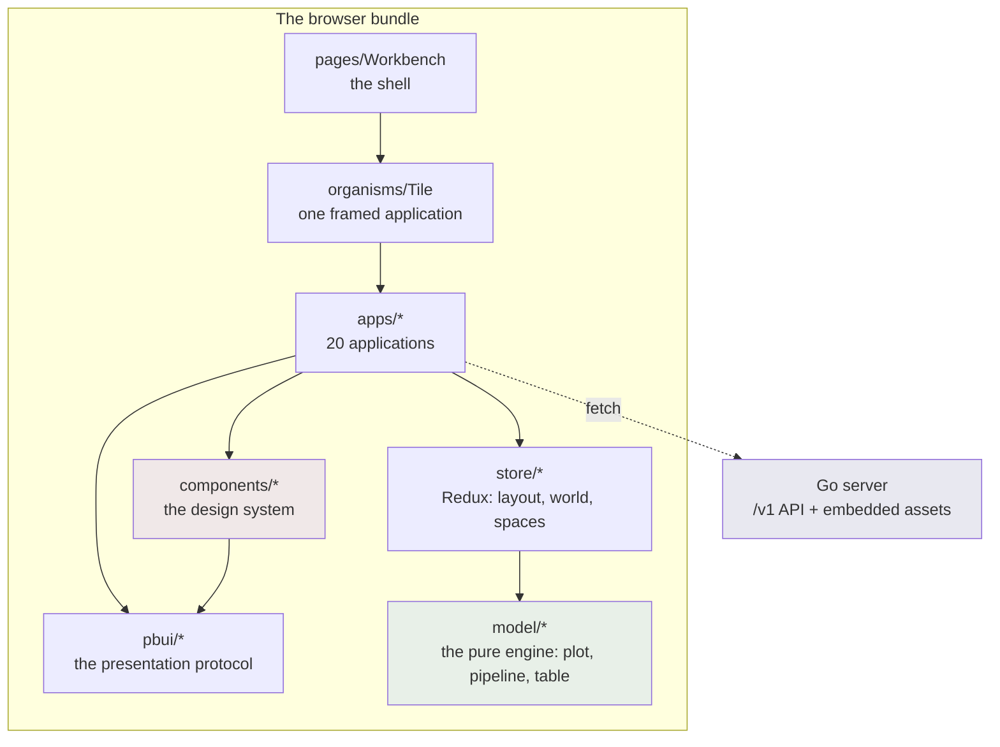

# Design system coverage and decomposition

## How to read this guide

You are an intern joining a codebase that is roughly 20 000 lines of Go and
7 000 lines of TypeScript. Nobody expects you to hold all of it. This guide is
written so that you can start work after Part I, and it is ordered so that each
part answers the question the previous part raises.

- **Part I (§1–§8) is analysis.** What the system is, what its rules are, what
  it actually contains today, and what is wrong with that. Read all of it. §5
  is the part people skip and then get wrong.
- **Part II (§9–§14) is the reference.** Another package in the same
  organisation has already solved this problem at five times the scale. We
  study what it does, and — just as important — decide what not to copy.
- **Part III (§15–§22) is design.** The target inventory, component by
  component, with the rule that decides which layer each one lands in, and the
  decision records that make those choices reviewable.
- **Part IV (§23–§29) is implementation.** Six phases, ordered so the system
  is never half-migrated, with pseudocode, the full props reference, and how to
  verify each step.

Two conventions used throughout. `file.ts:120` is a real line, clickable in
most editors, accurate as of the commit named in §29.4. A block marked
**PSEUDOCODE** is illustrative and will not compile.

***

# Part I — Analysis

## 1. What this ticket is, and what it is not

The one-sentence version: *the datadrop workbench has a design system with 24
components and five Storybook stories, while the application code that sits on
top of it contains 42 hand-written `<button>` elements, 14 hand-written
`<input>` elements, 80 inline style objects, and six copies of the same button
style constant — three of which have already drifted apart.*

This ticket does two things, and it matters that they are two:

1. **Coverage.** Every public component gets a story, with a defined set of
   required states. Today two components out of 24 have one.
2. **Decomposition.** The primitives currently written inline inside
   applications get extracted into `atoms`, `molecules` and `organisms`, so
   that they exist once, are named, and are reachable from a story.

It is tempting to describe this as "add more stories". That framing is wrong
and will produce the wrong work. A story is a *rendering of a component in a
state*. If the thing you want to see has no component — if it is nine lines of
JSX in the middle of a 491-line application file — then there is nothing to
write a story for. **Coverage is downstream of decomposition.** Most of the
effort in this ticket is the extraction; the stories are what make the
extraction worth having.

### 1.1 What this ticket is not

- **Not a visual redesign.** Every extracted component must render
  pixel-identically to the code it replaces. If a screen looks different
  afterwards, that is a defect, not an improvement. §28.3 explains how to check
  this without a screenshot-diffing tool.
- **Not a CSS framework adoption.** DR-13 (DATADROP-4) rejected one. The
  reasoning has not changed and is restated in §4.
- **Not a rewrite of the applications.** The applications keep their behaviour,
  their data fetching and their names. They get shorter because the JSX moves
  out, not because the logic changes.
- **Not a migration to the reference package's tokens or components.** We study
  its structure (Part II). We do not depend on it. §11 says why.

## 2. The system you are joining

datadrop is a small server that stores datasets and streams, plus a browser
workbench for looking at them. The workbench is a single-page application built
into the Go binary and served from `/ui/`.

The workbench is a **tiling workspace**. The screen is divided into rectangular
tiles; each tile runs one *application* chosen from a registry; applications
that are bound to a *document* stay in lockstep because they read the same
object rather than copies of it. There are 20 applications today: charts,
tables, pipelines, a trace viewer, tutorials, and — added in DATADROP-5 — sign
in, profile, tokens and upload.

The interface is **presentation-based**, which is the single most important
idea in the codebase and the subject of §5. Briefly: things on screen are not
just pixels, they are *presentations of objects*. Right-clicking a field name
in a table gives you a menu of the operations that make sense for a field,
because the thing under the cursor knows what it is.



The design system is the box this ticket is about. Everything else is context
you need in order not to break it.

### 2.1 Where the code is

```text
ui/
  .storybook/main.ts          story glob, vite overrides
  .storybook/preview.tsx      global decorators
  .storybook/withPbui.tsx     the decorator that supplies a PbuiProvider
  src/
    styles/tokens.css         137 lines. the entire visual vocabulary
    styles/reset.css          126 lines
    model/                    pure functions. no React, no DOM, no fetch
    api/client.ts             RTK Query. every wire type
    pbui/                     the presentation protocol (§5)
    store/                    Redux slices
    components/
      foundation/             4 directories
      layout/                 4
      atoms/                  9
      molecules/              2
      organisms/              4
      pages/                  1
    apps/                     20 applications, 3 528 lines
    fixtures/                 sample tables, for stories and tests
  test/                       13 bun test files, 166 tests
```

## 3. The layer graph, and the test that enforces it

The component directories are not a filing convention. They are a **dependency
order**, and it is checked on every `bun test` by `ui/test/layers.test.ts`.

The rule is one-way: a file may import from layers below it and never from
layers above. The permitted edges are declared as a literal table in that file
(`layers.test.ts:29`), and the test walks every import in `src/` and fails with
the offending specifier named.

| Layer | May import |
|---|---|
| `model` | nothing at all, not even React |
| `api`, `export` | `model` |
| `pbui` | `model`, `foundation` |
| `store` | `model`, `api`, `pbui` |
| `foundation` | nothing |
| `layout` | `foundation` |
| `atoms` | `foundation`, `layout`, `pbui`, `model` |
| `molecules` | the above, plus `atoms`, `store` |
| `organisms` | the above, plus `molecules`, `api`, **`apps`** |
| `pages` | everything |
| `apps` | everything except `organisms` and `pages` |

Four things about this table are worth understanding before you change
anything.

**`model` imports nothing, including React.** This is the invariant the whole
test file exists to protect, and it is stated as its own test so a failure says
so rather than appearing as one line in a list. It is what lets `bun test`
exercise the entire grammar of graphics — scales, marks, layouts, pipelines —
with no DOM and no server, in milliseconds.

**`pbui` may not import `atoms`.** The presentation *protocol* holds no React
components. A descriptor says what a field is called, what its full description
is, and which verbs apply to it; the chip that draws it lives in `atoms`, and
the type-to-chip mapping lives there too. Putting a component in a descriptor
would make `pbui -> atoms` a required edge and close a cycle, because atoms
import pbui for `PARTS`.

**`molecules` may not import `api`.** This is the rule that decided where
`MemberList` lives. It fetches, so it cannot be a molecule; `organisms` may
import `api`, but `apps` may not import `organisms`, so a component that one
application uses and that fetches has exactly one legal home: beside that
application. §12 revisits this, because it is the constraint that currently
blocks the cleanest version of this ticket.

**`organisms -> apps` is the one edge that looks wrong.** It exists because
`organisms/Tile/Tile.tsx:2` imports `appFor` to resolve an application id to a
component. The reverse edge is forbidden by a separate test
(`layers.test.ts:167`) precisely so the pair stays acyclic. §12.3 removes this
edge, and that removal is what makes the organisms in Part III possible.

## 4. The visual vocabulary

There is no CSS framework. `ui/src/styles/tokens.css` is 137 lines and is the
whole language: nine surface and text colours, eight presentation tones, three
field-type tones, an eight-colour categorical palette generated from
`model/plot.ts`, five font sizes, four border styles, two shadows, and six
spacing steps.

```css
--pbui-fs-micro: 8.5px;   /* type badges, facet titles           */
--pbui-fs-tiny:  9.5px;   /* section labels, trace rows          */
--pbui-fs-small: 10.5px;  /* chips, controls, table cells        */
--pbui-fs-base:  11.5px;  /* prose inside a tile                 */
--pbui-fs-title: 13px;    /* tile titles, headings               */

--pbui-space-1: 2px;  --pbui-space-2: 4px;  --pbui-space-3: 6px;
--pbui-space-4: 10px; --pbui-space-5: 16px; --pbui-space-6: 24px;

--pbui-border-hair: 1px solid var(--pbui-ink);
--pbui-radius: 0;                       /* everywhere. always. */
--pbui-shadow-hard: 2px 2px 0 var(--pbui-ink);
```

The look — monospace at 8.5 to 13px, hairline hard borders, zero radius, an
unblurred shadow — is not decoration. It is what lets fifteen tiles fit on a
screen and stay readable, and identical chip geometry across six contexts is
what makes a legend swatch and a table header read as the same *kind* of
object. That sameness is the premise of a presentation-based interface, and it
is the reason a `Button` atom is worth more here than in an ordinary
application: when every control is 6px of horizontal padding and a 1px border,
a control that is 8px wrong is visible.

Two token facts that will matter to you:

- **The categorical palette is generated.** `--pbui-cat-1` through
  `--pbui-cat-8` are written by `bun run tokens` from `PALETTE` in
  `model/plot.ts`, and `test/tokens.test.ts` proves the two still agree. Never
  hand-edit the block between the `BEGIN GENERATED PALETTE` markers. A legend
  that disagrees with its marks is a bug that survives review, because both
  halves look right in isolation.
- **Contrast is tested, at two thresholds.** Text colours are held to 4.5:1 on
  both `--pbui-pane` and `--pbui-pane-alt`; the 4px tone edge of a chip is a
  non-text graphic and is held to 3:1. `--pbui-faint` was darkened from the
  prototype's `#7b8087` for exactly this reason. If you introduce a colour, the
  token test will tell you which threshold you missed.

## 5. PBUI: the presentation protocol

Read this section twice. Everything in Part III about which layer a component
belongs to depends on understanding what a presentation is.

### 5.1 The idea

In an ordinary web application, a field name in a table header is a string in a
`<th>`. In this workbench it is a **presentation**: a rendered thing that
carries a reference to the object it depicts and a declaration of that object's
type. Because it carries them, the interface can offer operations on the object
without the surrounding code knowing anything about it.

Concretely, `<Presentation>` wraps its children and attaches three behaviours:

- **right-click** opens a menu of the verbs that apply to this object type;
- **hover** writes a one-line description into the mouse-documentation bar at
  the bottom of the window;
- **click, while a command is waiting for an argument**, satisfies that command
  — the "accept" protocol.

```tsx
<Presentation
  ptype="member"
  value={{ drop, user: { id, name, email }, role, isOwner }}
  doc={`<member> ${name} — ${role}`}
>
  <Chip label={name} tone="var(--pbui-tone-source)" />
</Presentation>
```

`Presentation` is the live wrapper. `Chip` is the dumb visual body: no click
handling, no context, no knowledge of what it depicts. Keeping the two apart is
what lets a chip be rendered in a story with no provider, and what stops the
"acceptable" appearance from being reimplemented per chip.

### 5.2 Descriptors

For each presentation type there is one descriptor, in
`pbui/descriptors/<type>.ts`, implementing four members:

```ts
export interface PresentationDescriptor<V = unknown> {
  ptype: PresentationType;
  label(value: V, env: PbuiEnvironment): string;      // one line
  describe(value: V, env: PbuiEnvironment): unknown;  // the full object
  actions(value: V, env: PbuiEnvironment): Action[];  // the menu
  tone: string;                                        // a token name
}
```

There are eleven: `field`, `source`, `doc`, `cat`, `datum`, `geom`, `step`,
`user`, `token`, `member`, `upload`. `actions` is pure — value and environment
in, serialisable verbs out — so a test can assert the exact verb a menu entry
produces with a literal environment, no store, no provider and no DOM. That is
what `test/descriptors.test.ts` does.

**Descriptors hold no React.** `registry.ts:22` says so and explains why. When
Part III adds components for uploads, tokens and members, the descriptors do
not change: the mapping from a presentation type to the chip that draws it
lives in `atoms`.

### 5.3 The `data-part` contract

`pbui/parts.ts` exports a small closed set of `data-part` names —
`presentation`, `chip`, `chip-label`, `chip-badge`, `role-badge`, `menu`,
`menu-item`, `tile`, `tile-title`, `tile-body`, and a few more — plus
`data-state` values (`acceptable`, `active`, `disabled`, `stale`, `dragging`,
`truncated`).

These are a **public styling API**. A theme targets them; renaming one breaks
that theme silently. The file's own comment sets the policy: keep the list
short, because every entry is something you will be asked not to change.

This matters for Part III because the reference package uses the same technique
under a different name (`data-rag-*`), and §13 decides whether new components
get a `data-part` and on what rule.

### 5.4 `data-state`, and why meaning is never carried by colour alone

`Chip.module.css` has a `.stale` rule that sets a dashed border *and* a danger
colour, with a comment naming the defect it exists to prevent: a mapping whose
field the pipeline no longer produces must not read as simply "unset". WCAG
1.4.1 is the formal version of the rule. Practically: every state an extracted
component can be in must be distinguishable without colour, and every such
state needs a story, which is why §18 makes states a coverage requirement
rather than a suggestion.

## 6. What the design system contains today

Twenty-four component directories.

| Layer | Count | Components |
|---|---|---|
| `foundation` | 4 | `Text` (+`SectionLabel`), `Divider`, `VisuallyHidden`, `Kbd` |
| `layout` | 4 | `Stack`, `Surface`, `Toolbar`, `AppBody` |
| `atoms` | 9 | `Chip`, `TypeBadge`, `ProvenanceBadge`, `FieldChip`, `SourceChip`, `DocChip`, `UserChip`, `TokenChip`, `RoleBadge` |
| `molecules` | 2 | `DocBar`, `TruncationNotice` |
| `organisms` | 4 | `Tile`, `SplitView`, `WorkspaceStrip`, (`NodeView`) |
| `pages` | 1 | `Workbench` |

The shape of that table is the finding. **Nine atoms and two molecules** is not
a design system that ran out of things to name; it is a design system whose
middle was never built, because the applications were written first and each
one solved its own layout inline.

Note also what the atoms are: with the exception of `Chip` itself, all nine are
*presentation* chips — a field, a source, a document, a user, a token, a role.
They are the vocabulary of §5. What is entirely missing is the vocabulary of
*controls*: there is no button, no text input, no select, no checkbox.

## 7. The evidence

This section is the argument for the ticket. Every number is reproducible with
the command shown; run them yourself before you start, because they are also
your baseline.

### 7.1 Hand-written form controls

```bash
cd ui/src
grep -roE '<button\b' --include='*.tsx' apps components pbui | grep -v '.stories.' | wc -l   # 42
grep -roE '<select\b' --include='*.tsx' apps components pbui | grep -v '.stories.' | wc -l   # 9
grep -roE '<input\b'  --include='*.tsx' apps components pbui | grep -v '.stories.' | wc -l   # 14
grep -ro 'style={{' --include='*.tsx' . | wc -l                                              # 80
```

Forty-two buttons. The design system has none.

### 7.2 The same style object, six times

```bash
grep -rn "const btn: React.CSSProperties" --include='*.tsx' apps
```

```text
apps/GalleryApp/GalleryApp.tsx:111
apps/EncodingApp/EncodingApp.tsx:181
apps/PipelineApp/PipelineApp.tsx:278
apps/CompareApp/CompareApp.tsx:109
apps/SourceApp/SourceApp.tsx:180
apps/ChartsApp/ChartsApp.tsx:114
```

All six declare the same four properties. They differ in exactly one:

```ts
// GalleryApp, CompareApp, ChartsApp
fontSize: "var(--pbui-fs-tiny)",     //  9.5px
// EncodingApp, PipelineApp, SourceApp
fontSize: "var(--pbui-fs-small)",    // 10.5px
```

**The drift has already happened.** Buttons in the gallery, the compare view
and the chart list are one font size; buttons in the encoding editor, the
pipeline editor and the source browser are another. Nobody decided that. It is
the ordinary end state of copy-paste, and it is visible on screen — 9.5px and
10.5px monospace differ by about a pixel of cap height and are noticeably
different weights of grey at a glance.

This is the single most useful fact in the analysis, because it converts an
aesthetic argument ("components are nicer") into an empirical one: *the
duplication has already produced an inconsistency that no one intended and no
one caught.* A `Button` atom with a `size` prop makes the divergence a
deliberate, reviewable, one-word choice.

### 7.3 The same input style, four times

```bash
grep -rn 'font: "inherit", padding: "2px 4px", border: "var(--pbui-border-hair)"' \
  --include='*.tsx' apps
```

```text
apps/UploadApp/UploadApp.tsx:265        the dataset name
apps/TokensApp/TokensApp.tsx:141        the token name
apps/ProfileApp/MemberList.tsx:138      the invitee's email
apps/SignInApp/SignInApp.tsx:105        the bearer token
```

Four copies, character-identical. These four are also the four inputs added by
DATADROP-5, written within a few hours of each other by one author — which is
the point. Duplication does not require a large team or a long time. It
requires only that there be nothing to import.

### 7.4 The application files

```bash
find apps -name '*.tsx' | xargs wc -l | tail -1     # 3528 total
wc -l apps/UploadApp/UploadApp.tsx                  # 491
```

`UploadApp.tsx` is 491 lines. Roughly 130 of them are the uploader's protocol
driver — open a draft, hash, skip what the server has, upload, commit — and
that is genuinely application logic. The remaining ~250 lines of JSX contain, in
order: a drop selector, a dataset name input, a warning line, a resumable-draft
panel with two buttons per row, a file-choose button, a drag-and-drop surface, a
secure-context warning, a per-item queue listing, a success panel with a "open
in a chart" action, and a footnote. Every one of those is a component that does
not exist.

### 7.5 What Storybook covers

```bash
find ui/src -name '*.stories.*'
```

```text
ui/src/components/foundation/Foundation.stories.tsx     Design System/Foundation/Tokens
ui/src/pbui/Pbui.stories.tsx                            Design System/PBUI/Playground  (×3)
```

Two files. Five stories. Twenty-four components, of which **two** appear in a
story at all — and one of those two (`Foundation`) is a token sheet rather than
a component story.

`.storybook/main.ts` opens with a comment stating the intent:

> Storybook is the development surface for phases 0 to 2 [...] It is not a
> supplementary artifact here: a component without a story is a component
> nobody has ever seen.

That sentence is currently true of 22 components out of 24.

### 7.6 The three defects that proves

DATADROP-5 shipped three UI defects that were found only by opening a browser
and clicking:

- identity-provider prose was rendered in token-authentication mode, where
  there is no identity provider;
- a "Signed in on" heading rendered with an empty body for the root principal,
  which has no session;
- a tooltip read "you are a admin".

Each is a *state* of a component: `SignInPanel` in token mode, `ProfilePanel`
for a principal with no user record, `RoleBadge` for the role whose name begins
with a vowel. None of the three is reachable by clicking in the ordinary flow —
you need a server in token mode, a root credential, and an admin membership
respectively. Each would have been a two-line story.

This is the return on the ticket, stated concretely: **the defects Storybook
catches are exactly the ones manual testing does not, because they live in
states that are expensive to reach and cheap to render.**

## 8. Summary of the analysis

- The design system has a strong foundation (tokens, contrast tests, a layer
  graph that is actually enforced) and a strong protocol (`pbui`).
- Its *middle* is missing. Nine of eleven atoms are presentation chips; there
  are no control atoms and almost no molecules.
- The application layer has absorbed that missing middle: 42 buttons, 14
  inputs, 9 selects, 80 inline style objects, and duplicated style constants
  that have measurably drifted.
- Story coverage is 2 of 24, and the defect record from the last ticket matches
  the shape you would predict from that.

***

# Part II — The reference structure

## 9. `@go-go-golems/rag-evaluation-site`

The package at
`/home/manuel/workspaces/2026-07-13/rag-eval-ttc/rag-evaluation-system/packages/rag-evaluation-site`
is the same organisation's answer to the same problem, five times larger and
several months further along. We use it as the structural reference.

### 9.1 What is in it

| Layer | Count | Character |
|---|---|---|
| `foundation` | 8 | `Text`, `Caption`, `CodeText`, `StatusText`, `Divider`, `VisuallyHidden` |
| `atoms` | 19 | `Button`, `TextInput`, `SelectInput`, `CheckboxRow`, `IconButton`, `Tag`, `MeterBar`, `ErrorCallout`, badges and swatches |
| `layout` | 15 | `AppShell`, `SidebarShell`, `Panel`, `Stack`, `Inline`, `SplitPane`, `TabList`, `FormRow`, `ScrollRegion`, `TileGrid`, `DashboardGrid` |
| `molecules` | 47 | `DataTable`, `MetadataGrid`, `KeyValueStrip`, `EmptyState`, `FileDropZone`, `UploadQueueList`, `Pagination`, `SearchField`, `StepList`, diagram and card families |
| `organisms` | 27 | `TranscriptReaderPanel`, `ContextDiagramPanel`, `MediaLibraryPanel`, `FormDialog`, `ConfirmDialog`, shells |
| — | **116** | with **127** story files across **334** `.tsx` files |

More story files than components. That is the ratio this ticket is aiming at,
not because the number is a target but because it is what "every public
component, every meaningful state" produces.

### 9.2 The five-layer split, and the question each layer answers

The reference's `GUIDELINES.md` states the test that decides a layer, and it is
better than the usual atomic-design description because it is phrased as a
question about the component rather than about its size:

> If a component answers "where do regions go?" it belongs in layout. If it
> answers "what domain data is shown?" it does not.

Extended across all five:

| Layer | The question it answers |
|---|---|
| foundation | "How is this text rendered?" |
| atoms | "What is this single control or marker?" |
| layout | "Where do regions go?" |
| molecules | "What reusable data or content pattern is this?" |
| organisms | "What feature panel is this, and what DTO does it take?" |

Note that `layout` sits *after* `atoms` in that list but *below* molecules in
the dependency order. The reference and datadrop agree on the graph
(`foundation -> layout -> atoms -> molecules -> organisms`); they differ only in
how far along it they have got.

## 10. What the reference does that we should copy

### 10.1 One folder per public component

Every public component is a directory, not a file:

```text
src/components/atoms/Button/
  Button.tsx            the component
  Button.module.css     local anatomy only
  Button.stories.tsx    the review surface
  index.ts              export * from "./Button"
  Button.widget.tsx     optional: the Widget IR adapter
  Button.widget.yaml    optional: the IR manifest
```

datadrop already does this for its 24 components, minus the stories. The
addition this ticket makes is that **the stories file is not optional** — §19
makes its absence a test failure.

### 10.2 A layer barrel

Each layer has an `index.ts` re-exporting every folder, so consumers import
from the layer rather than from a path:

```ts
// components/atoms/index.ts
export * from "./AnnotationBadge";
export * from "./Button";
export * from "./CheckboxRow";
```

datadrop does this too, but with named re-exports rather than `export *`
(`components/atoms/index.ts`). Keep the named form: it makes the barrel a
readable inventory and it stops a component leaking an internal helper by
accident.

### 10.3 Storybook title prefixes as a contract

```text
Design System/Foundation/<Primitive>
Design System/Atoms/<Atom>
Design System/Layout/<Primitive>
Component Library/Molecules/<Component>
Component Library/Organisms/<Component>
```

The sidebar then reads as the dependency order, which turns Storybook into a
map of the architecture rather than an alphabetical list. datadrop's
`.storybook/main.ts` already documents this exact hierarchy in a comment — it
simply has almost no stories to fill it.

### 10.4 Required story states

The reference names them:

> default/populated, empty, overflow/dense, selected/active, disabled,
> error/warning, alternate layout direction

This is the most directly transferable thing in the reference, and §19 adapts
it. Compare it against §7.6: all three DATADROP-5 defects are in this list
(alternate mode, empty, and a text-generation bug in a populated state).

### 10.5 Identity attributes on every component

`data-rag-atom="Button"`, and equivalents on molecules and organisms. The
reference uses them for visual-diff extraction and prototype-parity checks.
datadrop has the same mechanism under `data-part` (§5.3) but applies it only to
presentation-related elements. §13 decides how far to extend it.

### 10.6 Pure logic in a `.logic.ts` beside the component

`TimeGrid/TimeGrid.logic.ts` holds the interval-packing algorithm;
`MonthGrid/MonthGrid.logic.ts` holds calendar-cell construction. They are
tested by `scripts/focused-checks.mjs`, a plain Node script with `assert` and
no test framework, no DOM and no renderer:

```js
const packed = packTimeGridColumn([...], 8 * 60, 4 * 60);
assert.deepEqual(ids(packed), [
  { id: "a", lane: 0, lanes: 2 },
  { id: "b", lane: 1, lanes: 2 },
]);
```

datadrop arrived at the same pattern independently and better:
`apps/UploadApp/upload.ts` is a pure state machine — `digestOf`, `normalisePath`,
`phaseOf`, `pendingAfterResume`, `pooled` — tested by `test/upload.test.ts` with
no DOM, no server and no file picker. §17.4 generalises it: **when a component
extraction reveals a pure function, the function goes in a `.logic.ts` beside
the component and gets tested directly.**

## 11. What the reference does that we should not copy

Copying a structure wholesale is how you end up with a folder called `widgets`
containing nothing. Four things are deliberately left behind.

**The Widget IR layer.** The reference has a JSON-serialisable UI description
language (`widgets/ir.ts`), a `WidgetRenderer`, per-component `.widget.tsx`
adapters, `.widget.yaml` manifests, and a Goja DSL so that server-side
JavaScript can author pages. That is a large and coherent piece of engineering
for a product whose pages are defined server-side. datadrop's UI is authored in
TypeScript and compiled into the binary; there is no server-side page author to
serve. Adding an IR would be adding a second way to describe every component
with no consumer for it. **Not adopted.**

**The palette-provider global.** The reference exposes four palettes through a
Storybook toolbar and a `PaletteProvider`. datadrop has exactly one palette,
generated from `model/plot.ts` and contrast-tested at two thresholds (§4). A
palette switcher would imply the alternatives are equally valid, and they have
not been tested. **Not adopted.**

**`export *` barrels.** See §10.2. **Adapted, not copied.**

**The publishing apparatus.** `dist/`, `prepare-dist.mjs`, `consumer-smoke.mjs`,
npm trusted publishing. The reference is a published package with external
consumers. datadrop's UI has exactly one consumer, `pkg/webui`, which embeds the
built assets. **Not adopted.**

## 12. The one structural change we must make

Here is where the reference's structure and datadrop's current graph collide,
and it is worth being precise because it decides the shape of Part III.

### 12.1 The collision

The reference's organisms are **presentational panels with DTO-shaped props**.
`GUIDELINES.md` is explicit:

> Organisms may be domain-specific, but they still must be presentational. They
> should accept data and callbacks; containers decide where data comes from.

In datadrop, the containers are the applications in `apps/`. So the natural
target is: `apps/TokensApp/TokensApp.tsx` keeps the RTK Query hooks and becomes
thin; `components/organisms/TokensPanel` receives `tokens`, `onMint`,
`onRevoke` and renders.

But `apps` may not import `organisms` (§3). The extraction is illegal under the
current graph.

### 12.2 Why that edge exists

`organisms -> apps` exists for exactly one import:

```ts
// components/organisms/Tile/Tile.tsx:2
import { appFor, allApps } from "../../../apps/registry";
```

`Tile` renders a framed application and needs to resolve an id to a component.
`apps/registry.ts` is 49 lines: an `AppDescriptor` interface, a `Map`,
`registerApp`, `appFor`, `allApps`. It imports two types (`DocId` from `pbui`,
`NodeId` from `store`) and nothing else. It is not an application. It is the
*contract* that applications register against, and it lives in `apps/` for
historical reasons only.

### 12.3 The change

Move `apps/registry.ts` to its own layer.

```text
src/appkit/registry.ts      the AppDescriptor contract and the Map
```

with the graph entry

```ts
appkit: ["model", "pbui", "store"],
```

and the two consequent edits:

```diff
-organisms: [..., "api", "apps"],
+organisms: [..., "api", "appkit"],
-apps: ["foundation", "layout", "atoms", "molecules", "pbui", "model", "store", "api"],
+apps: [..., "organisms", "appkit"],
```

The `apps -> organisms -> apps` cycle cannot form because `organisms` no longer
names `apps` at all. The separate acyclicity test (`layers.test.ts:167`) becomes
unnecessary in its current form and is replaced by the graph walk, which now
expresses the constraint directly.

This is a 49-line file move plus about a dozen import-path edits. It is the
smallest change that unblocks the largest part of the ticket, and §22 records it
as DR-33.

## 13. Identity attributes: `data-part` versus `data-rag-*`

The reference tags every component (`data-rag-atom="Button"`). datadrop tags
only the presentation-related elements, under a policy that says the list is a
public API and should stay short (§5.3).

Both positions are defensible and they optimise for different things: the
reference wants an extraction target for visual diffing; datadrop wants a small
promise surface.

**The decision (DR-34, §22): keep `PARTS` small and closed; do not add an entry
per new component.** Add a `data-part` only when a name is needed by something
outside the component — a theme, a test selector used across files, or the
`pbui` menu machinery. New components get a `data-testid` where a test needs a
handle, which is not a public API and can be renamed freely.

The reason is the one in `parts.ts`: every entry is something you will be asked
not to change. Twenty-five new entries is twenty-five new promises in exchange
for a visual-diff capability nobody has asked for and no tooling here consumes.

## 14. Guidelines as an artifact

The reference has `GUIDELINES.md` at the package root: non-negotiable rules,
layer ownership, Storybook conventions, typography rules, CSS module rules, and
a review checklist. It is referenced from the package README and from the
tickets that use it.

datadrop's equivalents are scattered: the ten visual rules are in the DATADROP-4
guide §10.3 and rendered as a story; the layer graph is a comment in a test; the
token policy is a comment in `tokens.css`. Each is well written and each is
findable only if you already know it exists.

§25 makes `ui/GUIDELINES.md` a deliverable of this ticket. It is not new policy
— it is the existing policy in one place, with the review checklist that makes
it usable during a code review.

***

# Part III — Design

## 15. The target inventory

The table below is the deliverable of this ticket, stated as a list. "Existing"
means the component exists and needs only a story; "new" means it must be
extracted. The **Source** column names where the code comes from, so no
extraction starts from a blank file.

### 15.1 Foundation (4 existing, 1 new)

| Component | Status | Source / note |
|---|---|---|
| `Text`, `SectionLabel` | existing | needs a story |
| `Divider` | existing | needs a story |
| `VisuallyHidden` | existing | needs a story |
| `Kbd` | existing | needs a story |
| `CodeText` | **new** | digests, token ids, dataset paths, issuer URLs — currently `<span style={{fontSize}}>` in five places |

Foundation stays deliberately small. The reference's `Caption` and `StatusText`
are `Text` variants here (`size="tiny" tone="faint"` and `tone`), and adding
them would give two ways to express one thing.

### 15.2 Layout (4 existing, 3 new)

| Component | Status | Source / note |
|---|---|---|
| `Stack` | existing | needs a story |
| `Surface` | existing | needs a story: `tone`, `inverted` |
| `Toolbar` | existing | needs a story: `tight` |
| `AppBody` | existing | needs a story |
| `Inline` | **new** | a row with a gap and no toolbar semantics; `Toolbar` is currently used for this in ~12 places where nothing is a control |
| `FormRow` | **new** | label + control + hint; the `<label><input/></label>` pattern in `TokensApp.tsx:155` |
| `ScrollRegion` | **new** | `TableApp`, `TraceApp`, `GalleryApp` each set `overflow: auto` inline |

### 15.3 Atoms (9 existing, 10 new)

| Component | Status | Source / note |
|---|---|---|
| `Chip` | existing | needs a story: tone, badge, `strong`, all three `state` values |
| `TypeBadge`, `ProvenanceBadge`, `RoleBadge` | existing | need stories; `RoleBadge` needs the article-selection fix (§7.6) |
| `FieldChip`, `SourceChip`, `DocChip`, `UserChip`, `TokenChip` | existing | need stories |
| `Button` | **new** | the six `const btn` objects (§7.2) |
| `IconButton` | **new** | the `✕`/`⌖`/`↕` buttons in `Tile`, `SplitView`, `EncodingApp` |
| `TextInput` | **new** | the four identical style literals (§7.3) |
| `SelectInput` | **new** | nine raw `<select>` elements |
| `CheckboxRow` | **new** | `TokensApp.tsx:155` scopes, `TokensApp.tsx:203` show-revoked |
| `Swatch` | **new** | the 11×11 colour square in `ChartApp.tsx:195` |
| `StateGlyph` | **new** | `✓ / ✕ / ·` for upload item state; must not carry meaning by colour (§5.4) |
| `ScopeChip` | **new** | one token scope; currently `token.scopes.join(" ")` |
| `CountBadge` | **new** | `[128]` distinct counts, truncation counts |
| `LinkAction` | **new** | `SignInApp.tsx:63` — an `<a>` that must look like a `Button` because an OIDC redirect cannot be a `fetch` |

`LinkAction` deserves a note, because "why is this not just a Button?" is the
first question a reviewer will ask. An OIDC authorization request is a
navigation, not an XHR; attempting it with `fetch` is a standard afternoon lost
to CORS. The element must therefore be an `<a href>`, and the atom exists so
that its appearance is shared with `Button` rather than approximated.

### 15.4 Molecules (2 existing, 14 new)

| Component | Status | Source / note |
|---|---|---|
| `DocBar` | existing | needs a story |
| `TruncationNotice` | existing | needs a story |
| `EmptyState` | **new** | "none yet", "no drops yet", "nothing here" — eight sites |
| `ErrorNotice` | **new** | `<Text tone="danger">{error}</Text>` — nine sites |
| `Callout` | **new** | `<Surface tone="alt" role="status">` panels: draft waiting, published, secure-context warning |
| `KeyValueList` | **new** | `SourceApp`, `InspectorApp` metadata pairs |
| `Legend` | **new** | `ChartApp.tsx:183-215`, also needed by `ChartsApp` |
| `ScopeChecklist` | **new** | `TokensApp.tsx:151-172` |
| `FileDropZone` | **new** | `UploadApp.tsx:330-372` |
| `UploadItemRow` | **new** | `UploadApp.tsx:428-455` |
| `UploadQueueList` | **new** | the map over `batch.items` plus the phase toolbar |
| `DraftResumeList` | **new** | `UploadApp.tsx:276-310` |
| `TokenRow` | **new** | `TokensApp.tsx:210-243` |
| `MemberRow` | **new** | `MemberList.tsx:79-125`, presentational half |
| `MemberInvite` | **new** | `MemberList.tsx:130-155`, presentational half |
| `StepRow` | **new** | `PipelineApp.tsx:110-160` |
| `ChannelRow` | **new** | `EncodingApp.tsx:95-140` — note this component already exists twice, once in the app and once in `Pbui.stories.tsx:29`, which is itself evidence |

`ChannelRow` is worth pausing on. `Pbui.stories.tsx` needed a channel row to
demonstrate the accept protocol, and — having no component to import — wrote a
second one. The story and the application have been drifting independently ever
since. This is the same failure as §7.2 in a different costume.

### 15.5 Organisms (4 existing, 5 new)

| Component | Status | Source / note |
|---|---|---|
| `Tile` | existing | needs stories: focused, dragging, with and without a doc bar |
| `SplitView` / `NodeView` | existing | needs stories: horizontal, vertical, nested |
| `WorkspaceStrip` | existing | needs stories: pinned spaces, overflow, rename in progress |
| `SignInPanel` | **new** | from `SignInApp` — the OIDC and token modes are the two states that produced defect 1 |
| `ProfilePanel` | **new** | from `ProfileApp` — the no-user-record state produced defect 2 |
| `TokensPanel` | **new** | from `TokensApp` |
| `UploadPanel` | **new** | from `UploadApp` |
| `MemberPanel` | **new** | from `MemberList`, composed of `MemberRow` + `MemberInvite` |

All five depend on §12.3. They are presentational: props in, callbacks out, no
hooks, no `api` import. That is what makes their awkward states cheap to render
in a story, which is the entire point.

### 15.6 The totals

| Layer | Now | After | New |
|---|---|---|---|
| foundation | 4 | 5 | 1 |
| layout | 4 | 7 | 3 |
| atoms | 9 | 19 | 10 |
| molecules | 2 | 16 | 14 |
| organisms | 4 | 9 | 5 |
| pages | 1 | 1 | 0 |
| **total** | **24** | **57** | **33** |

Fifty-seven components, every one with a story. Compare the reference's 116 —
we are aiming at roughly half its size, for an application with roughly half the
surface, which is the right order of magnitude.

## 16. The rule that decides a layer

When you are holding a piece of extracted JSX and do not know where it goes,
apply these in order. The first one that answers, wins.

1. **Does it fetch, mutate, or read the store?** If it fetches or mutates, it
   is an organism or it stays in the application. If it only reads the store, it
   may be a molecule. (`molecules` may import `store`; it may not import `api`.)
2. **Does it name a domain noun?** "Upload item", "token", "member", "pipeline
   step" — then it is a molecule or an organism, never layout.
3. **Does it answer "where do regions go?"** Then it is layout, and it must not
   know any domain noun.
4. **Is it a single control or marker with no composition?** Then it is an atom.
5. **Does it take a DTO and a set of callbacks and render a whole feature?**
   Then it is an organism.

Two worked examples.

*`FileDropZone`.* It does not fetch (the application does). It names a domain
noun only weakly — "files" is generic. It is not "where do regions go", because
it draws a bordered target with hover and drag states. It composes (a border, a
label, a hidden input, a button). So: **molecule**. It takes `onFiles(files)`
and `disabled`, and knows nothing about drops or datasets.

*`MemberRow`.* It names a domain noun. It does not fetch — but `MemberList`
does. So `MemberRow` is the presentational half: it takes a `MemberRef`, a
`canEdit` boolean and `onRoleChange`/`onRemove` callbacks, and it is a
**molecule**. `MemberPanel` composes rows and the invite form and is an
**organism** because it takes the whole DTO. `MemberList` in `apps/` keeps the
five RTK Query hooks and becomes about 40 lines.

## 17. Extraction, application by application

This is the working list. Each entry names the file, the line range, what comes
out, and the one thing to be careful about.

### 17.1 `UploadApp.tsx` (491 lines → target ~180)

| Lines | Extract as | Layer | Careful |
|---|---|---|---|
| 240–268 | `UploadTargetForm` (drop select + dataset name) | molecule | the writable-drops filter stays in the app; the molecule takes an options array |
| 276–310 | `DraftResumeList` | molecule | the "choose the files again first" disabled reason is a prop, not a hard-coded string |
| 313–330 | (button) → `Button` | atom | |
| 332–372 | `FileDropZone` | molecule | the hidden `<input type="file">` and its `accept` list move with it |
| 375–383 | `Callout` variant="warning" | molecule | the `canHash()` call stays in the app |
| 386–425 | `UploadQueueList` header + phase actions | molecule | phase→action mapping is pure; put it in `upload.ts` (already there: `phaseOf`) |
| 428–455 | `UploadItemRow` | molecule | keep the `Presentation` wrapper *outside* the row, in the list, so the row stays renderable without a provider |
| 458–480 | `Callout` variant="ok" with an action | molecule | |
| whole | `UploadPanel` | organism | |

The `Presentation` note in row 7 is the general rule and §20.2 states it
formally: **extracted components do not wrap themselves in `Presentation`.**
The wrapper is applied by the caller. Otherwise every story needs a provider and
the component cannot be rendered in isolation, which is the property we are
buying.

### 17.2 `TokensApp.tsx` (262 → ~90)

| Lines | Extract as | Layer |
|---|---|---|
| 136–150 | `TextInput` + `SelectInput` | atoms |
| 151–172 | `ScopeChecklist` | molecule |
| 173–186 | `Button` (with a `busy` prop for "minting…") | atom |
| 196–207 | `CheckboxRow` | atom |
| 210–243 | `TokenRow` | molecule |
| 243–247 | `EmptyState` | molecule |
| whole | `TokensPanel` | organism |

The one-time secret display (the panel that shows the minted token exactly
once) becomes `Callout variant="ok"` with a `CodeText` body. **The secret must
not become a prop with a default, must not be logged, and must not be given a
Storybook control that persists in a URL.** The story uses a literal
`ddp_exampleexample_…` value that is not a real token shape. DR-28 from
DATADROP-5 still governs.

### 17.3 `MemberList.tsx` (177 → ~45) and `ProfileApp.tsx` (186 → ~70)

`MemberList` splits cleanly into `MemberRow` + `MemberInvite` (molecules) and
`MemberPanel` (organism); the app keeps `useListMembersQuery`,
`useSetMemberMutation`, `useRemoveMemberMutation`, `useClaimDropMutation` and
`useLazyLookupUserQuery` and passes callbacks down.

The email lookup is an existence oracle over addresses, restricted server-side
to callers who already administer something. **That constraint lives in the
server and must not be re-implemented in the component.** `MemberInvite` takes
`onAdd(email, role)` and an `error` string; it does not know that the lookup
exists.

### 17.4 `PipelineApp.tsx` (299 → ~120) and `EncodingApp.tsx` (195 → ~80)

`StepRow` and `ChannelRow` are the extractions. Both applications also define
`const btn` and `const input` (§7.2), which disappear.

`EncodingApp`'s channel-accept behaviour — clicking `⌖` puts a command into the
waiting state, and only fields the channel can accept stay live — is the accept
protocol, and it is the thing `Pbui.stories.tsx` duplicates. After extraction,
`Pbui.stories.tsx` imports `ChannelRow` and the duplication is gone. **This is a
required part of the task, not a nice-to-have:** leaving two channel rows in the
tree after building the component is worse than leaving one, because now there
are three.

`PipelineApp` step reordering (`↑`/`↓`/`×`) reveals a pure function — "move
step *i* to *j*, clamped" — that should become `pipeline.logic.ts` beside the
molecule and be tested directly, following §10.6.

### 17.5 `ChartApp.tsx` (260 → ~150)

`Legend` (molecule) and `Swatch` (atom) come out of lines 183–215. The SVG
plotting itself stays: it is a direct rendering of the pure `buildPlot` output
from `model/plot.ts`, and breaking it into components would put a React boundary
in the middle of a single `<svg>` for no benefit.

This is worth saying explicitly because "extract everything" is the wrong
instinct. The test is §16: the SVG does not answer any of the five questions
usefully — it is one indivisible rendering of one pure data structure.

### 17.6 The remaining applications

`GalleryApp`, `CompareApp`, `ChartsApp`, `SourceApp`, `WatchlistApp`,
`TraceApp`, `TableApp`, `InspectorApp`, `LauncherApp`, `AboutApp` and the four
tutorials need only the mechanical substitution: `Button`, `TextInput`,
`SelectInput`, `EmptyState`, `ErrorNotice`, `ScrollRegion`. No new components
come out of them. Together they account for six of the nine `EmptyState` sites
and three of the six `const btn` copies.

## 18. The story coverage contract

Adapted from §10.4, with datadrop's states.

### 18.1 Required states, by layer

| Layer | Required stories |
|---|---|
| foundation | every variant of every enumerated prop, on one page |
| atoms | default, each variant, `disabled`, each `data-state` value the atom supports |
| layout | default, dense/tight, overflow, nested (where composable) |
| molecules | populated, **empty**, overflow/truncated, error, and each interaction state |
| organisms | populated, empty, **the awkward mode** (§18.2), loading if it has one, error |

### 18.2 "The awkward mode"

Each of the five new organisms has a state that is expensive to reach by
clicking and cheap to render in a story. These are mandatory:

- `SignInPanel` — **token mode** (`auth_mode: "token"`, no provider) and **OIDC
  mode with signup disabled**. Defect 1 lived here.
- `ProfilePanel` — **an authenticated principal with no user record** (root).
  Defect 2 lived here.
- `TokensPanel` — **not mintable** (authenticated by a token, not a session),
  which must render the form disabled with the reason visible rather than
  hidden.
- `UploadPanel` — **not a secure context** (`canHash()` false), **a draft
  waiting**, and **partial failure with a retry**.
- `MemberPanel` — **reader's view** (no editor, with the reason shown), **an
  unowned drop** (the claim affordance), and **admin with a lookup failure**.

Every one of these is two lines of props. Every one is a state that a person
testing by hand has to build a server for.

### 18.3 The states that are not required

Do not write a story per data permutation. Three tokens, four tokens and five
tokens are the same story. The rule: **a state is worth a story if a reviewer
could look at it and say "that is wrong"**. Row count cannot be wrong; an empty
list with no message can.

## 19. Enforcement

A convention that is only written down is a convention that has already been
broken somewhere nobody has looked. That sentence is the opening comment of
`layers.test.ts` and it is the reason this ticket ships two tests rather than a
checklist.

### 19.1 The coverage test

New file, `ui/test/stories.test.ts`.

**PSEUDOCODE**

```ts
const LAYERS = ["foundation", "layout", "atoms", "molecules", "organisms"];
const TITLE_PREFIX = {
  foundation: "Design System/Foundation/",
  layout:     "Design System/Layout/",
  atoms:      "Design System/Atoms/",
  molecules:  "Component Library/Molecules/",
  organisms:  "Component Library/Organisms/",
};

test("every public component has a story", () => {
  const missing = [];
  for (const layer of LAYERS)
    for (const dir of componentDirs(layer))
      if (!exists(join(dir, `${basename(dir)}.stories.tsx`)))
        missing.push(`${layer}/${basename(dir)}`);
  expect(missing).toEqual([]);
});

test("every story title uses its layer's prefix", () => {
  // parse `title:` out of the meta literal; no need to execute the module
  const wrong = [];
  for (const file of storyFiles())
    if (!titleOf(file).startsWith(TITLE_PREFIX[layerOf(file)]))
      wrong.push(`${file}: ${titleOf(file)}`);
  expect(wrong).toEqual([]);
});

test("every component directory has the required files", () => {
  // Component.tsx, index.ts, Component.stories.tsx. CSS module optional:
  // several atoms are pure composition and correctly have no CSS of their own.
  ...
});
```

Parsing the title with a regular expression rather than importing the module is
deliberate: importing a story file pulls in React, the CSS modules and the whole
component tree, which turns a 200 ms test into a bundling exercise. The title is
a literal string in every file we write, and §25's guidelines require it to
stay one.

### 19.2 The anti-regression test

Second, and more interesting: a test that fails when someone hand-writes a
control that now has an atom.

**PSEUDOCODE**

```ts
const BANNED = [
  { pattern: /<button\b/,  atom: "Button or IconButton" },
  { pattern: /<select\b/,  atom: "SelectInput" },
  { pattern: /<input\b(?![^>]*type="file")/, atom: "TextInput or CheckboxRow" },
  { pattern: /const \w+: React\.CSSProperties/, atom: "a CSS module" },
];

// Atoms are where the raw elements are allowed to live, and the file-input
// inside FileDropZone is a deliberate exception carried by the pattern above.
const ALLOWED_DIRS = ["components/atoms", "components/molecules/FileDropZone"];
```

This is a change detector, and change detectors earn their keep only when the
thing they detect is a decision rather than a detail. Here it is a decision: a
raw `<button>` outside `atoms/` after this ticket means either the author did
not know `Button` exists — which the test fixes — or `Button` is missing a
variant, which is a design conversation the test forces to happen.

Two practical notes. Give the failure message the atom's name, not a rule id.
And provide an escape hatch: a line-level `// eslint-disable`-style comment is
overkill with no eslint, so use an explicit allowlist in the test with a
required comment explaining each entry. An escape hatch that requires writing a
sentence is one people use honestly.

### 19.3 What the existing tests already give us

- `layers.test.ts` — the graph, updated by §12.3.
- `test/api-surface.test.ts` — pins the mutating endpoint set. Extraction must
  not change it; if it does, something moved a fetch.
- `test/tokens.test.ts` — contrast at two thresholds, and the generated palette
  matching `model/plot.ts`. New components using new colours will fail it, which
  is the desired behaviour.

## 20. Rules for the extracted components

### 20.1 No fetching below `organisms`

Enforced by `layers.test.ts` for `api`. Not enforced for a bare `fetch()` call,
so the anti-regression test (§19.2) should include `/\bfetch\(/` outside `api/`
and `apps/`. `UploadApp` uses raw `fetch` deliberately — the payload is a `File`
and caching a 400 MB upload would be actively harmful — so `UploadPanel` takes
an `onUpload` callback and never calls it itself.

### 20.2 Components do not wrap themselves in `Presentation`

Stated in §17.1 and repeated because it is the mistake most likely to be made
by someone who has just understood §5 and is enthusiastic about it.

```tsx
// WRONG — now the story needs a PbuiProvider and the component cannot be
// rendered in isolation, which is the whole property we are buying.
export function MemberRow({ member }: { member: MemberRef }) {
  return <Presentation ptype="member" value={member} doc={...}>
    <Chip label={member.user.name} />
  </Presentation>;
}

// RIGHT — the caller decides whether this row is a live presentation.
export function MemberRow({ member, canEdit, onRoleChange, onRemove }: MemberRowProps) {
  return <Toolbar tight><Chip label={member.user.name} .../> ... </Toolbar>;
}
```

There is one exception, and it is already in the tree: `atoms/*Chip` components
are the *bodies* of presentations and are correctly provider-free. It is the
wrapping that must not be internalised.

### 20.3 No new styling API

From the reference's rule 4, which datadrop should adopt verbatim: no generic
`Box`, no component that accepts `padding`, `gap`, `color`, `fontSize` and
`display` as an unbounded API. `Stack` takes `gap` from the six-step scale and
`direction`; that is a bounded recipe, not a style prop.

### 20.4 CSS modules own local anatomy only

Allowed: layout anatomy, state selectors, overflow behaviour, borders and
backgrounds built from tokens. Not allowed: raw colours where a token exists,
font literals, global selectors, utility classes.

Inline styles remain legal for exactly three things: dynamic geometry (an SVG
bar's width), CSS variable plumbing (`style={{ "--ctx-fill": color }}`), and a
tone passed as a variable reference (`Chip`'s `borderLeftColor`). Everything
else moves to the module.

### 20.5 Every state must survive a greyscale screenshot

The formal version is WCAG 1.4.1; the practical version is §5.4's `.stale`
rule. `StateGlyph` exists because the upload item states — queued, hashing,
sending, done, failed — were distinguished by a colour and a word, and the word
was inside a `<span style={{color: faint}}>`. The glyph carries it.

## 21. Anti-goals

Stated so a reviewer can reject work that drifts:

- **No component count target.** 57 is a consequence of §15, not a quota. If an
  extraction produces a component used once, with no state worth a story, that
  is a sign it should have stayed inline.
- **No premature generalisation.** `TokenRow` takes a token. It does not take a
  `renderCell` prop, a column configuration, or a generic `T`. The reference has
  a `DataTable` with recipes because it has 47 molecules and a real need; we do
  not, yet.
- **No visual change.** §28.3.
- **No behaviour change.** In particular, none of the security properties of
  DATADROP-5 may move: the bearer token stays in `sessionStorage`, secrets stay
  out of Redux and out of presentation values, `credentials` stays
  `"same-origin"`. The api-surface test is one guard; a reviewer reading §20.1
  is the other.
- **No Storybook-only components.** If it exists only to make a story look
  good, it does not exist.

## 22. Decision records

Numbering continues from DATADROP-5, which ended at DR-31.

**DR-32 — Coverage follows decomposition, not the reverse.**
Write no story for a component that should not exist, and extract before
covering. *Alternative:* story the applications as pages. *Cost:* page-level
stories would need the store, the provider and RTK Query mocks; they test
integration, not components, and they would not have caught any of the three
DATADROP-5 defects, all of which are states of a subcomponent.

**DR-33 — `apps/registry.ts` moves to `src/appkit/`, and the `organisms -> apps`
edge is deleted.**
It is a contract, not an application. *Alternative:* leave the graph and put the
five panels in `molecules`. *Cost:* molecules may not import `api`, which is
fine for presentational panels — but it also means `Tile` keeps an import of
`apps`, and the next person to write a panel that needs `api` faces the same
wall. Move the 49-line file once.

**DR-34 — `PARTS` stays small; new components get `data-testid`, not
`data-part`.**
See §13. *Alternative:* tag every component like the reference. *Cost:* 25 new
entries in a list the codebase promises not to change, in exchange for a
visual-diff capability with no consumer here.

**DR-35 — Coverage is a test, not a checklist.**
`ui/test/stories.test.ts` fails when a component directory has no story file.
*Alternative:* a review checklist. *Cost:* the existing checklist for layer
boundaries was a comment until it became `layers.test.ts`, and it was violated
in the interim.

**DR-36 — Raw form elements outside `atoms/` are a test failure.**
See §19.2. *Alternative:* trust. *Cost:* §7.2 is what trust produced in three
weeks.

**DR-37 — No Widget IR, no palette provider, no publishing apparatus.**
See §11. *Alternative:* mirror the reference exactly. *Cost:* three subsystems
with no consumer in this repository.

**DR-38 — Extracted components never wrap themselves in `Presentation`.**
See §20.2. *Alternative:* internalise it so callers cannot forget. *Cost:* every
story needs a provider, and the component can no longer be rendered in
isolation — which is the property the ticket exists to create.

**DR-39 — `ui/GUIDELINES.md` becomes the single home for UI policy.**
See §14 and §25. *Alternative:* leave the policy distributed across a design
guide, a test comment and a CSS comment. *Cost:* all three are excellent and
none is findable by someone who does not already know it exists.

***

# Part IV — Implementation

## 23. The phases

Ordered so that the system is never half-migrated and each phase is independently
committable and revertible.

| Phase | Work | Why here |
|---|---|---|
| 0 | Baseline: record the §7 numbers, add `make storybook` to CI docs | the numbers are the acceptance criteria |
| 1 | Control atoms: `Button`, `IconButton`, `TextInput`, `SelectInput`, `CheckboxRow`, `LinkAction` + stories | the highest-duplication, lowest-risk change |
| 2 | Mechanical substitution across all 20 applications | banks the value of phase 1; no new components |
| 3 | Stories for the 24 existing components; `stories.test.ts` turned on | coverage for what already exists, before adding more |
| 4 | Remaining atoms and all 14 molecules + stories | the bulk of the new surface |
| 5 | DR-33 graph change; the five organisms; applications become containers | the structural change, after the value is banked |
| 6 | `GUIDELINES.md`, the anti-regression test, final numbers | the durable artifacts |

Phase 2 before phase 3 is deliberate. Substituting `Button` into 42 call sites
is where a visual regression would be introduced; doing it while the tree is
otherwise unchanged makes `git diff` readable. Phase 5 last is deliberate for
the same reason: it is the only phase that moves files across layers.

## 24. Phase 1 in detail

### 24.1 `Button`

```tsx
// components/atoms/Button/Button.tsx
import type { ButtonHTMLAttributes, ReactNode } from "react";
import styles from "./Button.module.css";

export type ButtonVariant = "default" | "primary" | "danger";
export type ButtonSize = "tiny" | "small";

export interface ButtonProps extends ButtonHTMLAttributes<HTMLButtonElement> {
  variant?: ButtonVariant;
  /** 9.5px or 10.5px. See §7.2: the six copies disagreed, so this is explicit. */
  size?: ButtonSize;
  /** Pressed/toggled. Sets aria-pressed; callers do not set it themselves. */
  selected?: boolean;
  /** Disables and shows a label instead of the children. */
  busy?: string;
  children?: ReactNode;
}

export function Button({
  variant = "default", size = "small", selected = false, busy,
  className, children, disabled, ...rest
}: ButtonProps) {
  return (
    <button
      type="button"
      disabled={disabled || busy !== undefined}
      aria-pressed={selected || undefined}
      className={cx(styles.root, styles[variant], styles[size], selected && styles.selected, className)}
      {...rest}
    >
      {busy ?? children}
    </button>
  );
}
```

```css
/* Button.module.css — the six `const btn` objects, reconciled. */
.root {
  border: var(--pbui-border-hair);
  background: var(--pbui-pane-alt);
  padding: 0 var(--pbui-space-3);
  font: inherit;
  font-weight: 700;
  border-radius: var(--pbui-radius);
}
.tiny  { font-size: var(--pbui-fs-tiny); }
.small { font-size: var(--pbui-fs-small); }
.root:disabled { opacity: 0.4; }
.selected { background: var(--pbui-selected); }
.danger   { color: var(--pbui-danger); }
.root:focus-visible {
  outline: var(--pbui-focus-ring);
  outline-offset: var(--pbui-focus-offset);
}
```

Two notes on this that are not obvious.

**`opacity: 0.4` reproduces existing behaviour, and it is wrong.** `PipelineApp`
and `EncodingApp` both write `style={{ ...btn, opacity: mapped ? 1 : 0.4 }}` for
an unavailable action. At 0.4 on `--pbui-pane-alt` the label falls well below
3:1 and the button remains clickable, because opacity is not `disabled`. Phase 1
reproduces it exactly so the substitution is provably a no-op; **phase 6 fixes
it** by using the real `disabled` attribute and a contrast-checked disabled
style. Do not fix it in phase 1 — mixing a refactor with a fix makes the diff
unreviewable, and this is the second-order kind of bug where the fix needs its
own story to review.

**`aria-pressed` is set by the atom, not the caller.** `Pbui.stories.tsx:186`
currently writes `<Button selected aria-pressed>` by hand. Making the atom own
the mapping is what stops half the call sites forgetting it.

### 24.2 The story that phase 1 must produce

```tsx
const meta = { title: "Design System/Atoms/Button", component: Button } satisfies Meta<typeof Button>;

export const Variants: Story = { render: () => (
  <Inline>
    <Button>Default</Button>
    <Button variant="primary">Primary</Button>
    <Button variant="danger">Remove</Button>
    <Button selected>Selected</Button>
    <Button disabled>Disabled</Button>
    <Button busy="minting…">Mint token</Button>
  </Inline>
) };

export const BothSizes: Story = { render: () => (
  <Stack gap={2}>
    <Inline><Button size="tiny">tiny — 9.5px</Button><Button size="small">small — 10.5px</Button></Inline>
    <Text size="tiny" tone="faint">
      Six copies of this style existed; three used each size (guide §7.2).
    </Text>
  </Stack>
) };
```

The second story is doing documentation work: it puts the finding from §7.2 on
screen, next to the two sizes, so the next person choosing a size sees that the
choice is real.

## 25. Phase 6: `ui/GUIDELINES.md`

Structure, mirroring the reference (§14) with datadrop's content:

1. **Non-negotiable rules** — the ten visual rules from DATADROP-4 §10.3, the
   layer graph, "no CSS framework" with DR-13's reasoning, "a component without
   a story is a component nobody has ever seen".
2. **Layer ownership** — §16's five questions.
3. **Storybook conventions** — title prefixes, required states (§18).
4. **Token rules** — never hand-edit the generated palette; both contrast
   thresholds; the type scale is closed.
5. **CSS module rules** — §20.4.
6. **Presentation rules** — §20.2 and the `PARTS` policy (DR-34).
7. **Review checklist** — the copyable list below.

```markdown
- [ ] Correct layer, by the five questions in GUIDELINES §2.
- [ ] No `api` import below `organisms`; no bare `fetch` below `apps`.
- [ ] Typography via `Text`/`SectionLabel`/`CodeText`, not a font literal.
- [ ] Colours, borders and surfaces from tokens.
- [ ] CSS module owns local anatomy only; no utility classes.
- [ ] Folder has Component.tsx, index.ts, Component.stories.tsx.
- [ ] Story title uses the layer's prefix.
- [ ] Every state in GUIDELINES §3 has a story, including the empty one.
- [ ] No state distinguished by colour alone.
- [ ] The component does not wrap itself in `Presentation`.
- [ ] `bun run --cwd=ui typecheck` and `bun test --cwd ui` pass.
```

## 26. API reference: the new components

Props only; behaviour is in §15 and §17.

### 26.1 Atoms

```ts
Button        { variant?: "default"|"primary"|"danger"; size?: "tiny"|"small";
                selected?: boolean; busy?: string } & ButtonHTMLAttributes
IconButton    { glyph: string; label: string; size?: ButtonSize;
                tone?: "default"|"danger" } & ButtonHTMLAttributes
                // `label` is required: it becomes aria-label. A glyph-only
                // button with no accessible name is unusable by a screen reader.
TextInput     { value: string; onValueChange(v: string): void; label: string;
                placeholder?: string; type?: "text"|"password"; invalid?: boolean;
                width?: "narrow"|"normal"|"wide" }
                // `label` becomes aria-label. `onValueChange` rather than
                // `onChange` so callers cannot forget `.target.value`.
SelectInput   { value: string; onValueChange(v: string): void; label: string;
                options: Array<{ value: string; label: string }>;
                placeholder?: string; size?: ButtonSize }
CheckboxRow   { checked: boolean; onCheckedChange(b: boolean): void;
                label: string; size?: "tiny"|"small"; disabled?: boolean }
LinkAction    { href: string; children: ReactNode; size?: ButtonSize } & AnchorAttributes
Swatch        { color: string; size?: number }        // color is a resolved value or a var()
StateGlyph    { state: UploadState | "ok" | "error" | "pending" }
ScopeChip     { scope: string }
CountBadge    { count: number; title?: string }
CodeText      { children: ReactNode; truncate?: boolean; title?: string }  // foundation
```

### 26.2 Layout

```ts
Inline        { children: ReactNode; gap?: 1|2|3|4|5|6; align?: "start"|"center"|"baseline";
                wrap?: boolean }
FormRow       { label: string; hint?: string; error?: string; children: ReactNode }
ScrollRegion  { children: ReactNode; maxHeight?: number|string; axis?: "y"|"both" }
```

### 26.3 Molecules

```ts
EmptyState        { message: string; hint?: string }
ErrorNotice       { message: string; size?: "tiny"|"small" }
Callout           { variant: "info"|"ok"|"warning"; title?: string;
                    children: ReactNode; actions?: ReactNode }
KeyValueList      { entries: Array<{ key: string; value: ReactNode }>; dense?: boolean }
Legend            { title: string; entries: LegendEntry[]; overflow?: number;
                    renderEntry?(e: LegendEntry): ReactNode }
                    // renderEntry is how ChartApp re-attaches `Presentation`
                    // without the molecule knowing pbui exists (DR-38).
ScopeChecklist    { available: readonly string[]; selected: string[];
                    onSelectedChange(s: string[]): void; disabled?: boolean }
FileDropZone      { onFiles(files: FileList): void; disabled?: boolean;
                    disabledReason?: string; accept?: string; label?: string }
UploadItemRow     { path: string; size: number; state: UploadState;
                    digest: string|null; error: string|null }
UploadQueueList   { items: UploadItemProps[]; phase: UploadPhase;
                    renderItem?(i: UploadItemProps): ReactNode }
DraftResumeList   { drafts: DraftSummary[]; onResume(v: number): void;
                    onDiscard(v: number): void; resumeDisabledReason?: string }
TokenRow          { token: TokenSummary; onRevoke?(id: string): void }
MemberRow         { member: MemberRef; canEdit: boolean;
                    onRoleChange?(role: Role): void; onRemove?(): void;
                    renderChip?(m: MemberRef): ReactNode }
MemberInvite      { roles: readonly Role[]; error?: string|null;
                    onAdd(email: string, role: Role): void }
StepRow           { step: Step; index: number; canMoveUp: boolean;
                    onChange(s: Step): void; onMove(d: -1|1): void; onRemove(): void }
ChannelRow        { channel: Channel; mapped: string|null; accepts: FieldType[];
                    onAcceptRequest(): void; onClear(): void;
                    renderMapped?(name: string): ReactNode }
```

The `renderEntry` / `renderChip` / `renderMapped` props are the mechanism that
keeps molecules provider-free while still letting a caller make their contents
live presentations (DR-38). The default renders a plain chip; `ChartApp` passes
a function that wraps it in `Presentation`.

### 26.4 Organisms

```ts
SignInPanel   { mode: "oidc"|"token"; signupEnabled: boolean;
                issuer?: string|null; error?: string|null;
                returnPath: string; onUseToken?(token: string): void }
ProfilePanel  { user: UserSummary|null; kind: PrincipalKind; scopes: string[];
                drops: DropMembership[]; provider?: { issuer: string; accountUrl: string }|null;
                onSignOut(): void }
TokensPanel   { tokens: TokenSummary[]; mintable: boolean; mintableReason?: string;
                minting: boolean; minted: CreatedToken|null; error: string|null;
                showRevoked: boolean; onShowRevokedChange(b: boolean): void;
                onMint(req: MintRequest): void; onRevoke(id: string): void }
UploadPanel   { drops: WritableDrop[]; batch: Batch|null; drafts: DraftSummary[]|null;
                canHash: boolean; onPick(files: FileList): void;
                onTargetChange(drop: string, dataset: string): void;
                onRun(v?: number, uploaded?: string[]): void; onCommit(): void;
                onDiscardDraft(v: number): void; onOpenInChart(): void }
MemberPanel   { members: MemberRef[]; owner: string|null; yourRole: Role;
                unowned: boolean; error: string|null;
                onClaim(): void; onAdd(email: string, role: Role): void;
                onRoleChange(userId: string, role: Role): void;
                onRemove(userId: string): void }
```

## 27. File reference

### 27.1 Created

```text
ui/GUIDELINES.md
ui/test/stories.test.ts
ui/test/no-raw-controls.test.ts
ui/src/appkit/registry.ts                      (moved from src/apps/registry.ts)
ui/src/components/foundation/CodeText/{CodeText.tsx,.module.css,.stories.tsx,index.ts}
ui/src/components/layout/{Inline,FormRow,ScrollRegion}/…
ui/src/components/atoms/{Button,IconButton,TextInput,SelectInput,CheckboxRow,
                         LinkAction,Swatch,StateGlyph,ScopeChip,CountBadge}/…
ui/src/components/molecules/{EmptyState,ErrorNotice,Callout,KeyValueList,Legend,
                             ScopeChecklist,FileDropZone,UploadItemRow,UploadQueueList,
                             DraftResumeList,TokenRow,MemberRow,MemberInvite,
                             StepRow,ChannelRow}/…
ui/src/components/organisms/{SignInPanel,ProfilePanel,TokensPanel,UploadPanel,
                             MemberPanel}/…
ui/src/components/molecules/StepRow/pipeline.logic.ts
```

Plus a `.stories.tsx` in each of the 24 existing component directories.

### 27.2 Modified

```text
ui/test/layers.test.ts                    DR-33: appkit added, organisms->apps removed
ui/src/components/organisms/Tile/Tile.tsx import path
ui/src/components/pages/Workbench/…       import path
ui/src/apps/*                             substitution; the five account apps become containers
ui/src/pbui/Pbui.stories.tsx              imports ChannelRow instead of redefining it
ui/src/components/{foundation,layout,atoms,molecules,organisms}/index.ts   barrels
Makefile                                  storybook targets already added under DATADROP-5
```

### 27.3 Not modified

`ui/src/model/*`, `ui/src/api/client.ts`, `ui/src/store/*`, `ui/src/styles/*`,
and every Go file. If a diff touches one of these, stop and explain why in the
diary: none of the work described here needs a new token, a new endpoint or a
new reducer.

## 28. Verification

### 28.1 Per commit

```bash
bun run --cwd=ui typecheck
bun test --cwd ui
make lint
```

Note the `--cwd=` with the equals sign. `bun --cwd ui run typecheck` prints
bun's usage page and exits 0 without running anything; that bug is why the
`ui-test` target went weeks without typechecking (DATADROP-5 playbook).

### 28.2 Storybook

```bash
make storybook          # http://localhost:6006
make build-storybook    # must succeed; it is the closest thing to an integration test
```

The sidebar after phase 4 should read as the dependency order, top to bottom.
If a component appears under the wrong heading, its `title` is wrong and
`stories.test.ts` should have caught it.

### 28.3 Proving there is no visual change

There is no screenshot-diffing tool in this repository and this ticket should
not add one. Three cheaper checks, in increasing order of confidence:

1. **The CSS module is a transcription.** For each atom, put the original
   inline style object and the new module side by side in the commit message.
   `Button` has four properties; the diff is checkable by reading.
2. **`build-storybook` plus a manual sweep.** After phase 2, open the workbench
   and visit each of the 20 applications. This is 10 minutes and it is what
   catches a `Toolbar` that lost its `tight`.
3. **The generated-palette test.** `test/tokens.test.ts` already fails if a
   colour drifts from `model/plot.ts`. It does not cover layout, but it does
   cover the one class of change that a manual sweep is worst at seeing.

Record which of the three you ran in the diary. "I read the transcription and
swept the applications" is a real answer; "it looks fine" is not.

### 28.4 The acceptance numbers

Re-run §7's commands. The targets:

| Measure | Before | After |
|---|---|---|
| `<button>` outside `atoms/` | 42 | 0 |
| `<select>` outside `atoms/` | 9 | 0 |
| `<input>` outside `atoms/` and `FileDropZone` | 14 | 0 |
| `const …: React.CSSProperties` | 6 | 0 |
| component directories | 24 | 57 |
| directories with a story | 2 | 57 |
| `apps/*.tsx` total lines | 3 528 | ≤ 2 400 |

The last row is a guide, not a gate. Lines moving from `apps/` into
`components/` is the point; lines *disappearing* would mean behaviour was lost.

## 29. Practical notes for whoever picks this up

### 29.1 Start here

Read §5, then open `ui/src/components/atoms/Chip/Chip.tsx` and
`Chip.module.css`. Together they are 80 lines and they demonstrate every
convention this ticket propagates: a dumb visual body, a `data-part`, a
`data-state`, a CSS module that owns anatomy only, tokens for every value, and a
comment that explains the constraint rather than the code.

Then run `make storybook` and open `Design System/PBUI/Playground`. The
`AcceptFlow` story drives the accept protocol end to end with a play function
against fixtures. It is the best single demonstration of why a story is worth
more than a screenshot.

### 29.2 The trap

The trap is enthusiasm for `Presentation`. Having understood §5, the natural
instinct is to make every extracted component a live presentation. DR-38 says
not to, and §20.2 shows the shape of the mistake. If you find yourself importing
`pbui` into a molecule for anything other than a *type*, stop and re-read §16.

### 29.3 Open questions

These are genuinely undecided. Raise them rather than guessing.

- **Should `apps/tutorials/*` be extracted at all?** Four files, 332 lines,
  written as prose-with-controls. They may be better served by a `Tutorial`
  organism with a step DTO — or they may be exactly the case where inline JSX is
  correct, because each is a one-off document.
- **Does `Legend` belong in `molecules` or in `organisms`?** It is currently
  used by one application and takes a `renderEntry` escape hatch, which is a
  smell in both directions.
- **Is `busy?: string` on `Button` the right shape,** or should it be
  `busy?: boolean` plus a `busyLabel`? The string form is shorter at the four
  call sites that need it and admits a label that is not a translation of the
  original.
- **Should the anti-regression test cover `style={{`?** There are 80
  occurrences, and §20.4 keeps three legitimate categories. A test would need to
  distinguish them, and a test that cannot state its rule crisply is a test that
  will be disabled.

### 29.4 Provenance

Every line number in this guide is accurate as of the commit that adds this
document. Line numbers drift; the surrounding comments do not, so if a reference
misses, grep for the quoted comment rather than trusting the number.

The reference package was read at
`/home/manuel/workspaces/2026-07-13/rag-eval-ttc/rag-evaluation-system/packages/rag-evaluation-site`
on 2026-07-25, at version 0.1.19. Its `GUIDELINES.md` is the single most useful
file in it and is worth reading in full before phase 4.
