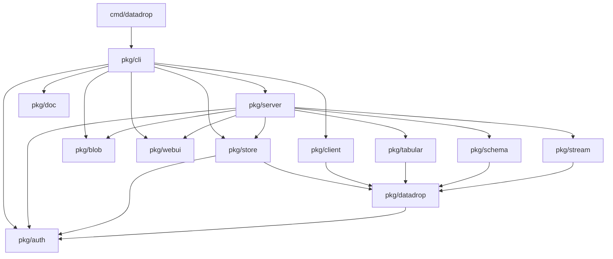
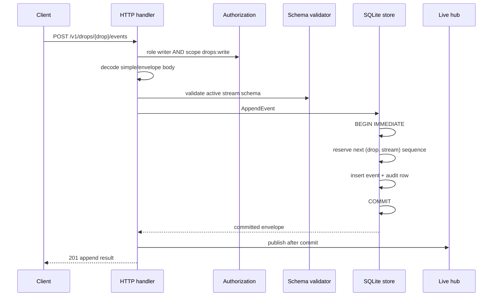
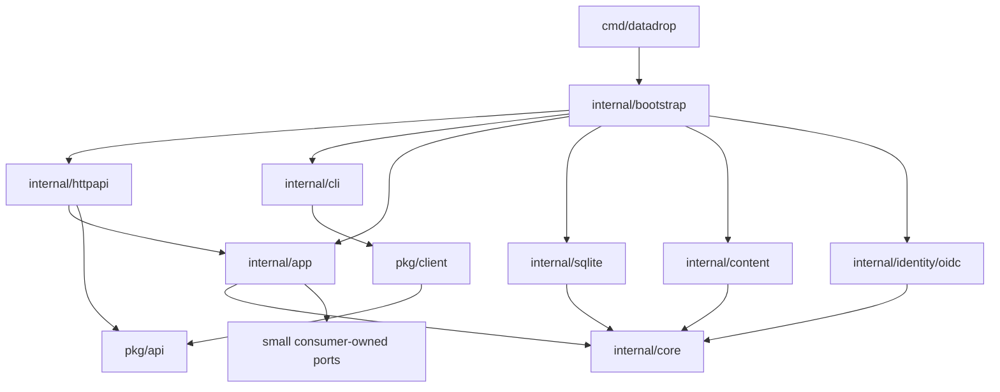

# The smaller datadrop

## Go backend architecture review and hard-cutover refactoring guide

> **Audience.** This guide is written for a new intern who knows Go, SQL, and
> HTTP but has never seen datadrop. Part I explains the product and follows the
> important runtime flows. Part II reviews the code as it exists. Part III
> proposes a smaller target architecture. Part IV is an implementation plan.
>
> **Scope.** This review covers `cmd/datadrop` and all Go code under `pkg/`,
> including the Go adapter that embeds the frontend. It does **not** review
> React, TypeScript, Redux, PBUI, Storybook, CSS, or files under `ui/`; those are
> the requested second step.
>
> **Compatibility premise.** There are no legacy users. Recommendations
> therefore prefer deletion, explicit contracts, and one-time migrations over
> aliases, fallback behavior, deprecation periods, or adapters.

---

# Executive summary

`go-go-datadrop` is no longer the small v0.1 event inbox its oldest comments
still describe. It is a modular-monolith product with event streams, immutable
bulk datasets, content-addressed file storage, JSON Schema validation, typed
table projection, SSE, OIDC login, sessions, API tokens, drop membership,
embedded help, an embedded SPA, a typed HTTP client, and a CLI. The Go surface is
23,320 lines including tests, with 14 packages, 41 HTTP routes, 293 exported
declarations, and a 56 MiB binary with 481 transitive build dependencies.

The implementation is not uniformly overengineered. Three components are
already good reusable units and should survive: the filesystem blob store, the
bounded live-event hub, and the streaming row readers/table builder. The major
problem is **composition**. HTTP handlers perform use cases directly, one
4,076-line `server` package owns every feature, one 2,768-line concrete `Store`
owns every persistence concern, and `pkg/datadrop` combines domain entities,
HTTP requests, HTTP responses, persistence fields, authorization values, audit
actions, validation, and compatibility helpers.

The highest-priority findings are behavioral, not aesthetic:

1. descending event pagination is incorrect: `next_after` repeats the current
   page because `after` always means `seq > cursor`;
2. many state changes and their audit records are separate transactions, so the
   server can return 500 after the change succeeded and can lose the audit row;
3. strict dataset import can commit thousands of rows before rejecting a later
   invalid row, while doing one SQLite transaction per row;
4. authorization-aware drop listing ignores credential scopes and performs
   repeated full-ACL scans;
5. persistence `User` values are serialized directly, leaking OIDC issuer and
   subject fields from member responses; even `/v1/me` claims to blank both but
   blanks only `Subject`;
6. the documented rate limit on the email existence oracle does not exist;
7. blob GC, digest mounting, and metadata commits are not coordinated, so GC can
   race a mount and leave metadata pointing at missing bytes.

The recommended hard cutover is a **small modular monolith**, not microservices
and not a forest of interfaces. Keep one binary and SQLite. Make only `pkg/api`
and `pkg/client` public. Move implementation under `internal/`. Put use-case
orchestration in four cohesive application services—events, datasets, access,
and accounts—so HTTP and CLI code adapt inputs and outputs rather than perform
business transactions. Keep SQLite as one implementation, but make every
mutation and audit append one transaction. Separate reusable mechanics
(content storage, row decoding, live fan-out, pure authorization) from product
policy, initially as internal packages; publish separate modules only when a
second real consumer exists.

## Verdict by area

| Area | Verdict | Action |
|---|---|---|
| Event model | Sound core, broken descending cursor contract | Keep append-only model; hard-cut cursor API |
| Dataset model | Sound immutable/versioned concept; incomplete draft and GC lifecycle | Keep model; centralize lifecycle in a dataset service |
| Blob store | Strong reusable mechanics | Keep, rename around a narrow content-store contract, add reconciliation/coordination |
| Schema validation | Small and well isolated | Keep; separate cache keying from product entities |
| Live hub | Correct bounded-loss design | Keep and make generic enough for event notifications |
| Authorization rules | Pure core is good; persistence/application use is inefficient and inconsistent | Keep policy functions; replace whole-ACL loading with principal-specific access facts |
| OIDC | Necessary protocol complexity, in the wrong package | Move provider adapter out of pure authz package |
| HTTP server | Main accidental-complexity hotspot | Split routing/transport from application services |
| Store | Too broad, concrete, and transactionally inconsistent | Replace method pile with cohesive query/transaction units |
| Domain package | Kitchen-sink public API | Split internal core entities from public wire contracts |
| HTTP client | Useful but incomplete and unsafe to configure | Make immutable/options-based; unify all requests; add timeouts and feature coverage |
| CLI | Hybrid Cobra/Glazed/manual rendering | Complete DATADROP-9 as a hard cutover; remove shims/manual renderers |
| Embedded UI Go adapter | Small and clear | Keep; web internals belong to the next review |
| Documentation/comments | Valuable rationale mixed with fossilized milestone history | Move durable decisions to package docs/ADRs; delete historical narration from code |

---

# Part I — Understand the current system

## 1. What datadrop is

A **drop** is the unit of naming and access. Inside a drop, the server holds two
different kinds of data:

- A **stream** is unbounded and append-only. Its unit is one JSON event, ordered
  by a server-assigned per-stream sequence. A client reads a page or tails new
  events over SSE.
- A **dataset** is finite, versioned, and immutable once committed. Its unit is
  one or more files plus a manifest and optional row schema. File bytes are
  addressed by SHA-256 and shared across versions.

The bridge between the models is dataset import: a CSV or NDJSON file can be
read row by row and materialized into events carrying provenance.

```text
Drop "greenhouse"
├── Streams
│   ├── events: seq 1, 2, 3, ...
│   └── alarms: seq 1, 2, ...
└── Datasets
    └── readings-2026
        ├── version 1 (committed)
        │   ├── manifest.json
        │   └── data/readings.csv -> sha256:abcd...
        ├── version 2 (committed)
        └── version 3 (draft)
```

Identity is optional at deployment time. The process supports open mode, one
static root token, or OIDC with browser sessions and per-user API tokens. In the
OIDC model, a drop has one owner and zero or more reader/writer/admin members.
A credential's scope narrows the role; it should never grant a right by itself.

## 2. Repository map

The current layout is horizontal: packages correspond mostly to technical
layers, while `server` and `store` span every feature.

| Path | Non-test lines | Responsibility | Review note |
|---|---:|---|---|
| `cmd/datadrop/` | 18 plus 985 smoke-test lines | Process entry and end-to-end binary tests | Entry is appropriately tiny |
| `pkg/datadrop/` | 915 | Entities, requests, responses, validation, audit constants | Too many roles; imports `auth`, so it is not the claimed leaf |
| `pkg/store/` | 2,768 | SQLite, migrations, every repository, audit writes | Broadest data ownership and transactional hotspot |
| `pkg/server/` | 4,076 | 41 routes, auth resolution, policy calls, use cases, streaming, archives | Main god package |
| `pkg/client/` | 792 | Remote event/dataset client and SSE parser | Useful public boundary, but incomplete |
| `pkg/cli/` | 2,216 | Cobra tree, server composition, rendering, file IO | Hybrid framework and oversized verb files |
| `pkg/auth/` | 831 | Pure policy, credentials, and networked OIDC | Good logic mixed with provider adapter |
| `pkg/blob/` | 433 | Filesystem content-addressed store | Strong reusable unit |
| `pkg/schema/` | 206 | JSON Schema compile/validate/cache | Strong small unit |
| `pkg/stream/` | 130 | Bounded nonblocking live fan-out | Strong small unit |
| `pkg/tabular/` | 1,114 | Row parsing, flattening, inference, visualization table DTO | Good mechanics mixed with presentation semantics |
| `pkg/webui/` | 157 | Embedded/static SPA serving | Clear adapter; frontend itself is out of scope |
| `pkg/doc/` | 46 | Embedded Glazed help pages | Fine, but public placement is unnecessary |
| `pkg/doc.go`, `pkg/logcopter.go` | 12 | Empty top-level `pkg` package and generated logger | Dead package; delete |

Tests are a major strength. Ordinary `GOWORK=off go test ./... -count=1` passed
all packages; server and store tests cover a large amount of behavior. The
coverage run reported 73.9% for `server`, 76.9% for `store`, 86.9% for
`tabular`, 90.5% for `schema`, and 100% for `stream`, but only 5.4% for `cli`
and 34.7% for `client`. The coverage command also exposed a Go 1.26.1/1.25.5
tool mismatch for the empty top-level `pkg` package, discussed in Finding 17.

## 3. Package dependency picture



Two consequences matter:

1. `pkg/cli` is both a remote client shell and the composition root for the
   local server, so importing CLI assembly reaches almost the whole product.
2. `pkg/datadrop` is described as a leaf shared by client and server, but account
   types import `pkg/auth`. Domain and authorization therefore form one public
   conceptual surface rather than independent leaves.

## 4. Process startup flow

`cmd/datadrop/main.go` calls `cli.Execute`. `pkg/cli/serve.go` then performs the
actual composition:

```text
parse flags/environment
    -> open and migrate SQLite
    -> resolve auth mode and secrets
    -> open filesystem blob store
    -> construct server.Config
    -> server.New(store, blobs)
    -> if OIDC: perform discovery with retry and install provider
    -> server.Serve(ctx)
```

The process composition belongs at an executable boundary, but it currently
lives in a public `pkg/cli` package and passes a broad concrete `*store.Store`
into a broad concrete `*server.Server`.

## 5. Event append flow

The event path contains the central durable-ordering invariant.



The hub notification is intentionally after commit. A crash can lose a
notification, but never the event; SSE reconnect replays from SQLite. This is a
good design and should remain explicit in the application service after the
handlers are thinned.

## 6. Query and SSE flow

A normal query builds `datadrop.EventQuery`, normalizes defaults, and constructs
SQL from allowlisted time/order fields. SSE subscribes to the in-process hub
**before** replaying durable history, then deduplicates overlap by sequence and
tails live notifications. A slow subscriber is disconnected rather than
allowed to block ingest or allocate without bound.

```text
SSE connect(after=18440)
    -> subscribe to bounded hub first
    -> query durable events where seq > 18440, ascending
    -> emit and advance cursor
    -> consume hub
       -> seq <= cursor: duplicate overlap, skip
       -> seq > cursor: emit
       -> closed channel: emit reset, disconnect
```

This design is appropriately simple. The normal descending page API, however,
tries to reuse the same `after` cursor and gets the direction wrong; see Finding
1.

## 7. Dataset publication flow

A staged dataset publication has three phases:

```text
1. POST .../versions
   -> allocate monotonic version
   -> create draft

2. For each file
   -> hash locally
   -> HEAD /v1/blobs/{digest}
   -> if present: bodyless mount
   -> otherwise: stream body -> temp file -> hash -> fsync -> rename
   -> add dataset_files metadata and counters

3. POST .../versions/{n}/commit
   -> validate manifest/schema
   -> state draft -> committed
   -> readers can now see it
```

The separation between blob bytes and dataset metadata is correct. The missing
piece is one owner for the cross-resource lifecycle: the handler coordinates the
filesystem and database itself, drafts have no coherent cleanup policy, and GC
can race bodyless mounting.

## 8. Authentication and authorization flow

Credentials resolve once in middleware into an `auth.Principal`:

```text
AuthNone -> root principal
static bearer matches -> root principal
OIDC API token -> token principal(user, scopes, token id)
session cookie -> session principal(user, all scopes, session id)
anything else -> anonymous principal
```

A drop operation should be allowed only when both halves pass:

```text
role(owner/member/public/root) >= required role
AND
credential scopes contain required scope
```

`auth.EffectiveRole` and `auth.Authorize` express that cleanly. The problem is
how persistence feeds those functions: every authorization reads the drop and
then every member, while list and annotation paths reproduce only part of the
same policy.

## 9. Current HTTP surface

There are 41 registrations in `pkg/server/server.go:223-281`. Grouped by
capability:

| Capability | Representative endpoints |
|---|---|
| health | `GET /healthz` |
| drops/events | `POST/GET /v1/drops`, `POST/GET .../events`, `GET .../events/stream` |
| schema/export/table | `PUT/GET .../schemas/{stream}`, `GET .../export`, `GET .../table` |
| datasets | list/show/open/commit/delete/files/archive/import/table/drafts |
| blobs | `HEAD /v1/blobs/{digest}`, `POST /v1/blobs/gc` |
| authentication | login/callback/logout |
| current account | me/tokens/sessions |
| membership | list/set/remove/claim and user lookup |
| UI | `/`, `/ui/{path...}`, `/static/{path...}` |

The route count is not itself a problem; each capability is real. The problem
is that one `Server` owns every handler dependency and every use case.

---

# Part II — Findings

## 10. Priority scale

- **P0 — correctness/security:** fix before building more behavior on the
  affected contract.
- **P1 — architectural leverage:** fix early because it removes repeated work or
  prevents more coupling.
- **P2 — cleanup:** do during the cutover; individually smaller, collectively
  important for clarity.

## 11. P0 correctness and security findings

### Finding 1 — Descending event pagination repeats data

**Problem.** `EventQuery.After` always compiles to `seq > ?`, but a descending
page returns the lowest sequence in the page as `next_after`. Requesting that
cursor selects the same newer rows again. The field is correct for live-tail
resumption and incorrect for backward pagination.

**Where to look.** `pkg/datadrop/query.go`, `EventQuery.After` and
`QueryResult.NextAfter`; `pkg/store/events.go:189-241`, `QueryEvents`;
`pkg/server/handlers_events.go:258-299`, `handleQueryEvents`.

**Example.** With sequences 1–100 and `limit=10&order=desc`, page one is
100…91 and reports `next_after=91`. The next SQL predicate is:

```sql
WHERE seq > 91
ORDER BY seq DESC
LIMIT 10
```

It returns 100…92, which is page one minus one row, not page two.

**Why it matters.** Any consumer paginating historical data can loop,
duplicate records, or never reach older events. Existing tests validate
querying and tails but do not pin two-page descending traversal.

**Cleanup sketch.** Make cursor direction explicit; do not overload SSE's
`after`.

```go
type EventWindow struct {
    AfterSeq  *int64 // seq > x; ascending replay/live tail
    BeforeSeq *int64 // seq < x; descending history
    Limit     int
}

// response
NextBefore *int64 `json:"next_before,omitempty"`
```

Hard cut: reject `after` with `order=desc`, add `before`, and remove
`next_after` from descending responses. Add a property test that concatenating
all pages returns each sequence exactly once.

---

### Finding 2 — State changes and audit rows are often not atomic

**Problem.** Event and dataset methods generally append the audit record inside
the mutation transaction. Account, token, session, drop, and membership methods
often mutate through `s.db` and then execute a separate audit insert. If audit
insertion fails, the mutation remains committed while the method returns an
error.

**Where to look.** `pkg/store/members.go:115-193`, `pkg/store/tokens.go:21-58`
and `158-175`, `pkg/store/sessions.go:31-63` and `142-160`,
`pkg/store/users.go:28-80`, `pkg/store/drops.go:13-44`.

**Example.** `SetMember` performs:

```go
s.db.ExecContext(ctx, `INSERT INTO drop_members ...`)
return s.audit(ctx, s.db, datadrop.AuditRecord{
    Action: datadrop.ActionMemberSet,
})
```

**Why it matters.** The client may retry a successful mutation after receiving
500. The audit trail can omit the operation it is supposed to prove. Token
creation is worse: a token row can be committed, audit can fail, and the only
copy of the secret is never returned, leaving an unidentifiable live credential.

**Cleanup sketch.** One helper owns every mutation transaction and requires an
audit record before commit.

```go
func (r *Repository) Write(ctx context.Context, fn func(*Queries) error) error {
    tx, err := r.beginImmediate(ctx)
    if err != nil { return err }
    q := NewQueries(tx)
    if err := fn(q); err != nil { tx.Rollback(); return err }
    return tx.Commit()
}

repo.Write(ctx, func(q *Queries) error {
    if err := q.SetMember(...); err != nil { return err }
    return q.AppendAudit(actor, MemberSet{...})
})
```

Audit serialization must never silently return `nil` on JSON marshal failure.
A programming error should fail the transaction.

---

### Finding 3 — “Strict” dataset import is partial and extremely chatty

**Problem.** The import handler reads one row, validates it, and immediately
calls `Store.AppendEvent`, which opens and commits one transaction. If row
10,000 violates a strict schema, rows 1–9,999 are already durable. The CLI says
“reject the import if any row fails,” which implies a whole-import precondition.
Up to 100,000 rows also means up to 100,000 event transactions and audit rows on
a database configured with one connection.

**Where to look.** `pkg/server/handlers_import.go:195-271`, especially the call
to `AppendEvent` at line 246; `pkg/cli/dataset.go:490-559` for the user-facing
strict wording; `pkg/store/events.go:25-155`.

**Example.** The current inner loop is effectively:

```go
for each row {
    validate(row)
    store.AppendEvent(ctx, row) // BEGIN + INSERT + audit + COMMIT
    hub.Publish(row)
}
```

**Why it matters.** A validation failure reports 422 even though the requested
operation partly happened. Large imports monopolize the single SQLite
connection for a long time in tiny transactions. Permissive mode appends every
violation to one in-memory result, so a bad large file can produce an unbounded
response object.

**Cleanup sketch.** Define the contract honestly and separate preflight from
write batches.

```text
strict import:
    pass 1: stream and validate all rows; keep only bounded summary
    if any invalid: return 422, write nothing
    pass 2: reopen blob and append in batches of 500

permissive import:
    append in idempotent batches
    return counts + first N warnings + warnings_truncated
```

The application service, not the HTTP handler, owns this flow. If imports must
be atomic against process failure too, use one transaction with a batch append
API. If resumability is more important, document batch-level atomicity and keep
deterministic IDs. Do not claim whole-operation atomicity unless it exists.

---

### Finding 4 — Drop visibility and role annotations ignore credential scopes

**Problem.** `VisibleDrops` filters by public/owner/member relationships but does
not check `Principal.Scopes`. `annotateRoles` reports membership role without
intersecting it with token scope. A valid token lacking `drops:read` can discover
member drop names, and a narrow token can receive `your_role: admin` even though
it cannot perform admin operations.

**Where to look.** `pkg/store/members.go:196-215`,
`pkg/server/handlers_drops.go:55-97`, `pkg/auth/role.go:68-130`.

**Example.** Current listing predicate:

```sql
WHERE public_read = 1
   OR owner_id = ?
   OR EXISTS (SELECT 1 FROM drop_members ... user_id = ?)
```

No credential-scope predicate or application check follows it.

**Why it matters.** The server's stated model is intersection, but list and UI
annotation expose a different model. Policy replicated as SQL and as Go has
already drifted.

**Cleanup sketch.** Return capabilities, not a role pretending to be the whole
decision.

```go
type DropAccess struct {
    Role       Role
    CanRead    bool
    CanWrite   bool
    CanPublish bool
    CanAdmin   bool
}
```

A principal-specific SQL query should fetch visible drops and the one matching
member role, while an application policy function computes capabilities from
that fact plus scopes. Pin the list result against `Authorize` with tokens that
have every scope combination.

---

### Finding 5 — Authorization does O(all members) work per request and O(drops × members) work per list

**Problem.** Every drop authorization reads drop metadata, then loads every
member into a map even though it needs only the current user's row. Listing
visible drops then calls `DropACL` once per drop to annotate roles. User lookup
repeats the same scan to discover whether the caller administers anything.

**Where to look.** `pkg/store/members.go:15-60`,
`pkg/server/handlers_drops.go:82-97`, `pkg/server/handlers_me.go:307-326`.

**Example.** A list of 100 visible drops, each with 20 members, issues roughly
201 queries and scans about 2,000 irrelevant membership rows after the initial
list query.

**Why it matters.** The database is deliberately pinned to one connection, so
these are serialized round trips. More importantly, the inefficient shape is
used to justify caching, but caching authorization is exactly what the code
correctly wants to avoid.

**Cleanup sketch.** Query only the fact the decision needs.

```sql
SELECT d.owner_id, d.public_read, m.role
FROM drops d
LEFT JOIN drop_members m
  ON m.drop_name = d.name AND m.user_id = ?
WHERE d.name = ?;
```

For lists, project the matching member role in the list query. For “administers
anything,” use one `SELECT EXISTS`. Immediate revocation remains intact without
full ACL materialization or caching.

---

### Finding 6 — Persistence user records cross the wire and leak identity-provider identifiers

**Problem.** `datadrop.User` is both a persistence entity and a JSON response.
It contains `Issuer` and `Subject`. `/v1/me` explicitly says both should be
omitted, but only clears `Subject`. `ListMembers` attaches a full `User` to each
member and returns it to every reader of the drop.

**Where to look.** `pkg/datadrop/account.go:13-38`,
`pkg/server/handlers_me.go:68-76`, `pkg/store/members.go:65-112`,
`pkg/server/handlers_members.go:10-39`.

**Example.** The contradictory code is:

```go
// The subject and issuer are omitted ...
user.Subject = ""
response.User = &user // Issuer remains serialized
```

**Why it matters.** OIDC subject and issuer are provider-internal identity keys.
Exposing them encourages clients to couple to external identifiers and leaks
more account metadata than membership display requires. The root cause is type
reuse, not one missing assignment.

**Cleanup sketch.** Use explicit response views.

```go
type UserView struct {
    ID   string `json:"id"`
    Name string `json:"name"`
}

type MeUserView struct {
    UserView
    Email string `json:"email,omitempty"`
}
```

Persistence entities should have no JSON tags. Transport mapping should be a
small pure function with tests that assert forbidden fields are absent.

---

### Finding 7 — The email existence oracle claims controls that are absent

**Problem.** `FindUserByEmail` says the endpoint is restricted, audited, and
rate limited. The handler checks whether the caller administers a drop and logs
one line, but no rate limiter exists and no durable audit record is written.

**Where to look.** `pkg/store/users.go:96-111`,
`pkg/server/handlers_me.go:268-305`; repository-wide search for rate limiting
finds no implementation.

**Why it matters.** A privileged user can enumerate registered email addresses
at machine speed. Comments describing controls that do not exist are more
dangerous than no comment because reviewers assume the threat was handled.

**Cleanup sketch.** With no legacy clients, remove `/v1/users/lookup` now. Add a
proper invitation flow later, keyed by a normalized email hash and resolved on
sign-in. If lookup is retained, add per-principal and per-IP limits, a durable
audit event, a constant response shape for misses, and explicit security tests.

---

### Finding 8 — Blob GC and mounting have a cross-store race

**Problem.** Bodyless mounting checks that a blob exists, then separately adds a
metadata row. GC independently snapshots referenced digests and walks the
filesystem. An old unreferenced blob can be deleted after the mount's existence
check or after GC's reference snapshot but before the metadata commit, leaving a
committed reference to missing bytes.

**Where to look.** `pkg/server/handlers_blobs.go:104-152`,
`pkg/store/datasets.go:112-190`, `pkg/server/handlers_gc.go`,
`pkg/blob/store.go:260-322`.

**Why it matters.** The grace period protects newly uploaded blobs, not an old
unreferenced blob being mounted. The database and filesystem have no shared
transaction, so “metadata references bytes that exist” is not an enforced
invariant.

**Cleanup sketch.** Put mount, reference creation, GC, and reconciliation behind
one dataset-content service. For the current single process, a small lock is
sufficient:

```text
mount/reference: content lifecycle RLock
    verify bytes -> commit reference
GC: content lifecycle Lock
    snapshot references -> delete eligible bytes
```

Also add startup/admin reconciliation that reports metadata-without-bytes and
bytes-without-metadata. An object-store backend can later replace the lock with
leases or mark-and-sweep generations.

---

### Finding 9 — Draft lifecycle is incomplete and the convenience upload leaks drafts

**Problem.** The single-shot upload opens a draft before receiving bytes and
leaves it behind on upload or commit failure. Drafts are listed for writers, but
deletion requires dataset admin. The comments say list enables “resume or
discard,” which is not true for an ordinary writer. Draft file references also
prevent GC.

**Where to look.** `pkg/server/handlers_blobs.go:202-269`,
`pkg/server/handlers_datasets.go:132-160` and `223-257`,
`pkg/store/datasets.go:450-535`.

**Why it matters.** Failed convenience uploads accumulate invisible versions
and referenced storage. Version counters advance forever. Different endpoints
assign different lifecycle powers without an explicit ownership model for a
draft.

**Cleanup sketch.** Distinguish explicit staged drafts from internal
single-shot drafts:

- single-shot failure cleans up its own empty/uncommitted draft;
- staged drafts carry `created_by`, `updated_at`, and optional expiry;
- the creator or a drop admin may abort a draft;
- a sweeper removes expired drafts and then GC reclaims bytes;
- commit checks at least one file if empty versions are not a product feature.

Expose `DELETE .../drafts/{version}` rather than overloading deletion of a
published version.

---

### Finding 10 — HTTP helper behavior can produce malformed or ambiguous responses

**Problem.** Finite JSON responses write the status before encoding. A marshal
failure therefore cannot become a clean 500. Recovery may also attempt to write
a problem after a handler has partly written. `statusRecorder` forwards
`Flusher` but not a generic `Unwrap`, so optional `ResponseWriter` capabilities
can be lost. `decodeJSON` accepts a valid first value followed by another JSON
value. Dataset filenames are interpolated into `Content-Disposition` manually.

**Where to look.** `pkg/server/server.go:356-365`,
`pkg/server/middleware.go:97-137`, `pkg/server/handlers_drops.go:121-157`,
`pkg/server/handlers_blobs.go:305-315`.

**Example.** Current response helper:

```go
w.WriteHeader(status)
if err := json.NewEncoder(w).Encode(v); err != nil {
    log.Warn().Err(err).Msg("failed to write JSON response")
}
```

**Why it matters.** Clients can receive a successful status with a truncated
body. Request bodies such as `{...}{...}` are accepted unexpectedly. A logical
filename containing a quote produces a malformed disposition value.

**Cleanup sketch.** Separate buffered finite responses from streaming ones.

```go
func WriteJSON(w http.ResponseWriter, status int, v any) error {
    body, err := json.Marshal(v)
    if err != nil { return err }
    w.Header().Set("Content-Type", "application/json")
    w.WriteHeader(status)
    _, err = w.Write(append(body, '\n'))
    return err
}
```

After decoding one request value, require EOF. Add `Unwrap() http.ResponseWriter`
to wrappers so `http.ResponseController` can discover capabilities. Use
`mime.FormatMediaType("attachment", map[string]string{"filename": name})`.
Streaming handlers must own their “headers already sent” failure behavior.

---

### Finding 11 — Authentication defaults preserve a legacy fail-open inference

**Problem.** Empty auth mode becomes `token` when a token happens to be set and
`none` otherwise. This is explicitly labeled compatibility behavior from before
DATADROP-5. A missing environment variable can therefore turn an intended
protected deployment into root access for every request.

**Where to look.** `pkg/server/server.go:67-95` and `158-188`,
`pkg/cli/serve.go:269-356`.

**Why it matters.** Security posture should not be inferred from whether a
secret string is empty. The CLI warns for open mode, but a warning is not a
configuration boundary.

**Cleanup sketch.** Require an explicit mode at the composition root. A useful
safe contract is:

```text
--auth=none  allowed only on loopback unless --allow-insecure-remote
--auth=token requires --token
--auth=oidc  requires issuer/client/external URL
```

Delete the fallback in both CLI and server. Make `server.Config.Auth` a typed
enum and validate once. If tests need open mode, they pass it explicitly.

## 12. P1 architecture and complexity findings

### Finding 12 — `server` is a transport, application service, and process runtime at once

**Problem.** `pkg/server` contains 41 routes and 4,076 non-test lines. Handlers
perform authorization, parsing, schema lookup, transaction orchestration,
content storage, row import, auditing, notification, archive generation, and
presentation mapping directly. `Server` depends on concrete store/blob types
and constructs schema/hub internals itself.

**Where to look.** `pkg/server/server.go:128-299`; large orchestration methods in
`handlers_events.go`, `handlers_blobs.go`, `handlers_import.go`, and
`handlers_auth.go`.

**Why it matters.** Business behavior can only be reused through HTTP or by
calling handler-private methods. Tests need a whole server to validate use-case
logic. Every new feature adds fields and methods to one central type.

**Cleanup sketch.** Introduce four application services, not one service per
noun:

```go
type EventsService struct { repo EventRepository; schemas Validator; bus EventBus }
type DatasetsService struct { repo DatasetRepository; content ContentStore; rows RowReader }
type AccessService struct { repo AccessRepository }
type AccountsService struct { repo AccountRepository; oidc IdentityProvider }
```

HTTP handlers become adapters:

```go
func (h *EventsHandler) Append(w http.ResponseWriter, r *http.Request) {
    cmd, err := decodeAppend(r)
    result, err := h.events.Append(r.Context(), principal(r), cmd)
    respond(w, mapError(err), toAppendResponse(result))
}
```

The service owns authorization and atomic orchestration, so a future CLI,
worker, or MCP transport cannot bypass policy by skipping an HTTP helper.

---

### Finding 13 — `Store` is a broad API with escape hatches and fragile driver-error parsing

**Problem.** One concrete `Store` exposes persistence for all features, a raw
`DB()` handle, a mutable test clock, compatibility time aliases, and more than
50 exported methods. SQLite constraint classification matches error message
strings even though modernc's exported `*sqlite.Error.Code()` is available.

**Where to look.** `pkg/store/store.go:39-150`, `pkg/store/errors.go:37-63`, all
files in `pkg/store/`.

**Why it matters.** Callers can bypass transaction/audit invariants through
`DB()`. Public methods such as `GetDatasetVersion(..., includeDrafts bool)` put a
security-sensitive visibility switch at every call site. Error behavior depends
on driver message wording.

**Cleanup sketch.** Keep one SQLite package but expose cohesive, narrow ports to
services. Replace booleans with named operations:

```go
GetCommittedVersion(ctx, key) (Version, error)
GetDraftForUpdate(ctx, key) (Draft, error)
```

Delete `DB()`, `store.FormatTime`, `store.ParseTime`, and public `SetClock`; pass
a `Clock` to the repository constructor. Classify SQLite errors by numeric code:

```go
var se *sqlite.Error
if errors.As(err, &se) && se.Code() == sqlite3.SQLITE_CONSTRAINT_UNIQUE { ... }
```

Use generated or hand-written query groups, but do not introduce a generic
repository framework.

---

### Finding 14 — `pkg/datadrop` is a public kitchen sink, not a domain leaf

**Problem.** The package combines core values (`Envelope`, `Drop`), storage
state (`DatasetVersion.State`), HTTP request/response DTOs, account persistence
entities, audit action strings, query parsing, retention syntax, time codecs,
and behavior that imports `pkg/auth`. The same struct is reused because it is
convenient, not because every layer has the same information boundary.

**Where to look.** Every file in `pkg/datadrop/`, especially `account.go` and
`dataset.go`.

**Why it matters.** The package has 915 production lines and contributes to 293
exported declarations across `pkg`. Sensitive fields leak through JSON tags,
client compatibility constrains storage refactors, and unrelated concepts move
together.

**Cleanup sketch.** Make the public surface intentional:

```text
pkg/api/       documented wire requests/responses and error codes
pkg/client/    supported Go client returning pkg/api values

internal/core/ value objects and invariants, no JSON tags
internal/app/  commands/results and use cases
```

Do not duplicate every harmless value merely to claim purity. Duplicate or map
at real boundaries: users, sessions, credentials, drafts, and persistence-only
fields. Core IDs, names, digests, and timestamps can have small shared value
types.

---

### Finding 15 — The ingest API supports three shape-discrimination mechanisms

**Problem.** `/events` accepts a bare payload or an envelope. It decides by
`mode`, by CloudEvents content type, or by the presence of a top-level
`specversion` field. `mode=simple` exists to escape false positives. This is
compatibility complexity embedded in the hottest write path.

**Where to look.** `pkg/server/handlers_events.go:164-256`.

**Example.** A legitimate research payload such as
`{"specversion":"instrument-v2","value":3}` is interpreted as an event
envelope unless the caller knows to pass `mode=simple`.

**Why it matters.** Shape guessing is surprising and makes “CloudEvents
compatible” weaker than either a strict CloudEvents API or a simple JSON API.
The incoming `specversion` value is not used to establish a separate explicit
contract.

**Cleanup sketch.** Keep the simple path simple and make envelopes explicit:

- `POST .../events` + `application/json`: body is always the payload;
- `POST .../events` + `application/cloudevents+json`: body is strictly validated
  as a CloudEvents structured event;
- remove `mode` and the member-name heuristic.

If CloudEvents is not a current requirement, remove structured ingestion
entirely and keep CloudEvents-shaped output metadata. Do not keep a heuristic in
case a hypothetical client needs it.

---

### Finding 16 — The HTTP client is useful but not a complete supported API

**Problem.** `Client` exposes mutable `BaseURL`, `Token`, and `HTTP` fields;
normal requests have no default timeout because SSE shares the same client;
uploads bypass the common request helper; account and table APIs are absent;
`whoami` uses raw HTTP in the CLI. URL validation accepts parsed-but-unusable
values, and JSON success responses have no size/trailing-value guard.

**Where to look.** `pkg/client/client.go:25-50` and `336-410`,
`pkg/client/datasets.go:101-176`, `pkg/cli/whoami.go`.

**Why it matters.** Callers can mutate invariants or set `HTTP=nil`. A server
that never responds can hang ordinary CLI commands indefinitely. Duplicated
request code causes auth, headers, error mapping, and retry behavior to drift.

**Cleanup sketch.** Use options and separate streaming deadlines from ordinary
requests:

```go
client, err := client.New(baseURL,
    client.WithBearer(token),
    client.WithHTTPClient(httpClient),
    client.WithRequestTimeout(30*time.Second),
)

stream, err := client.Stream(ctx, ...) // caller context controls lifetime
```

All request forms should call one `Do(*http.Request)` path. Add methods for every
supported API or state explicitly that the package is dataset/event-only.
Return public `api` DTOs, not server package types.

---

### Finding 17 — The CLI is in the most expensive intermediate state

**Problem.** The CLI uses Cobra definitions and hand-written renderers while
also importing Glazed logging and help. It therefore carries both abstractions.
`pkg/cli` is 2,216 non-test lines, `dataset.go` alone is 595 lines, and the
binary is 56 MiB with 481 build dependencies. DATADROP-9 already designs a full
Glazed command conversion.

**Where to look.** `pkg/cli/root.go`, `output.go`, `dataset.go`, `read.go`, and
ticket DATADROP-9.

**Why it matters.** Eleven commands ignore the declared table output and print
JSON. Every response shape has custom output code. Maintaining the hybrid is
worse than choosing either Cobra-only simplicity or Glazed's row pipeline.

**Cleanup sketch.** Complete DATADROP-9, adjusted for the no-legacy premise:

- no one-release NDJSON compatibility alias;
- no deprecated flag adapters;
- fix Glazed exit-code support upstream rather than calling `os.Exit` from
  command logic if feasible;
- one file per verb and one row mapper per response;
- delete `output.go` and manual `tabwriter` code;
- move CLI implementation under `internal/cli`.

Glazed's dependency/binary cost should be measured after the conversion. It is a
project-level tradeoff, not automatically a defect, because the go-go-golems
suite values structured output. The defect is paying the cost while retaining
manual rendering.

## 13. P2 deprecation and clarity findings

### Finding 18 — Source still carries legacy behavior and milestone fossils

**Problem.** Production Go contains about 90 references to historical versions,
old tickets, guide sections, and decision-record numbers. `server.go` says the
v0.1 slice registers only `/healthz` directly above 41 routes. Retention is
accepted and persisted but not enforced. Store time aliases exist because
“most of the codebase reaches for” the old location. `DB()` is an unused future
escape hatch. An empty top-level `pkg` package exists solely for generated
logging.

**Where to look.** `pkg/server/server.go:1-10`, `pkg/datadrop/drop.go:11-20`,
`pkg/store/store.go:39-49` and `132-140`, `pkg/doc.go`, `pkg/logcopter.go`.

**Why it matters.** An intern cannot tell current contract from archaeology.
Unenforced retention is especially dangerous because operators read it as a
policy. Compatibility aliases expand the public surface without serving a user.

**Cleanup sketch.** During the cutover:

- delete retention from API/schema until an enforcement job exists;
- delete store time aliases and use one `coretime` value codec;
- delete `DB()`, public test hooks, `pkg/doc.go`, and top-level logger package;
- rewrite package comments as current truth;
- keep rationale in DATADROP-10 decision records and short invariant comments,
  not ticket archaeology in every function.

---

### Finding 19 — Deprecated `github.com/pkg/errors` is mandatory only because local instructions say so

**Problem.** The module imports `github.com/pkg/errors` throughout even though
modern Go has `%w`, `errors.Is`, and `errors.As`. The dependency is mature but
obsolete for a Go 1.26 codebase. `AGENT.md` explicitly mandates it, so code and
instructions reinforce the old choice.

**Where to look.** `go.mod`, almost every production package, and the
`<goGuidelines>` section of `AGENT.md`.

**Why it matters.** Error construction uses a second vocabulary (`Wrap`,
`Wrapf`, `Errorf`) with no capability the standard library lacks here. It makes
future cleanup look like a convention violation unless instructions change.

**Cleanup sketch.** Hard cut to standard `errors` and `fmt.Errorf("context: %w",
err)`. Update `AGENT.md` in the same commit. Do this mechanically after the
service boundary settles, so huge error-only diffs do not obscure behavioral
changes.

---

### Finding 20 — Mutable exported collections expose global policy state

**Problem.** `auth.AllScopes`, `auth.AssignableRoles`, and
`tabular.EnvelopeColumns` are exported mutable slices. Any importing package can
change global authorization or response ordering at runtime.

**Where to look.** `pkg/auth/scope.go:31`, `pkg/auth/role.go:22`,
`pkg/tabular/table.go:173`.

**Why it matters.** The compiler cannot protect policy constants represented as
mutable slices. Tests can become order dependent.

**Cleanup sketch.** Keep private arrays and return copies, or use switch-based
iteration over typed constants.

```go
func AllScopes() []Scope {
    return []Scope{ScopeDropsRead, ScopeDropsWrite, ScopeDatasetsWrite, ScopeAdmin}
}
```

---

### Finding 21 — Tabular code mixes reusable row mechanics with chart semantics

**Problem.** CSV/NDJSON/JSON streaming readers and flattening are broadly useful.
The same package also defines visualization types `q`, `n`, `t`, chart row
budgets, selection strategies, and frontend-facing table DTOs. DATADROP-9 then
wants to reuse the package for CLI row output.

**Where to look.** `pkg/tabular/rows.go`, `flatten.go`, `table.go`, `builder.go`.

**Why it matters.** A reusable parser now imports presentation policy. CLI
formatting and backend file import should not need to know Vega-like encoding
semantics.

**Cleanup sketch.** Split mechanics from product presentation:

```text
internal/recordio/  Format, CSV/NDJSON/JSONArray readers, typed-cell policy
internal/rowmap/    flattening and cell conversion
internal/table/     FieldType q/n/t, inference, row budget, Table response
```

Keep `recordio` callbacks and limits generic. Do not publish a separate module
until another repository actually needs it.

---

### Finding 22 — Toolchain metadata is newer than some local analysis tools

**Problem.** Normal tests and `golangci-lint` pass under Go 1.26.1. Staticcheck
2025.1.1 was built with Go 1.25.3 and refused the module. Coverage for the empty
root `pkg` package invoked a Go 1.25.5 coverage tool against 1.26.1 objects and
failed, while other package coverage still ran.

**Evidence.** Exact errors:

```text
module requires at least go1.26.1, but Staticcheck was built with go1.25.3
compile: version "go1.26.1" does not match go tool version "go1.25.5"
```

**Why it matters.** A green ordinary test run does not mean every documented
analysis target is reproducible. The empty `pkg` package adds no value and is the
only package that failed during the coverage run.

**Cleanup sketch.** Delete the empty package, pin analysis tools built with the
module toolchain, and expose one canonical `make check` that prints versions
before running generate, tests, lint, and coverage. Do not lower the module Go
version merely to accommodate stale local binaries.

## 14. What is already good and should not be “cleaned up”

A review that only deletes will damage the system. Preserve these choices:

1. **Append and sequence reservation share a transaction.** This is the core
   event-order invariant.
2. **Hub publication occurs after commit.** Realtime is a hint over durable
   replay, not the source of truth.
3. **Slow subscribers are evicted from a bounded channel.** Never replace this
   with an unbounded queue or blocking publish.
4. **Blob writes stream to a same-filesystem temp file, hash while writing,
   fsync, then rename.** This is a strong content-store primitive.
5. **Committed dataset versions are immutable and drafts are invisible to
   readers.** Fix lifecycle gaps without weakening this boundary.
6. **The server uses standard `net/http` and `ServeMux`.** Forty-one routes do
   not justify a router dependency.
7. **`http.ServeContent` handles downloads and ranges.** Keep standard protocol
   behavior rather than reimplementing range parsing.
8. **Schema compilation is isolated and cached.** The package is small and its
   tests are strong.
9. **Authorization policy is expressed as pure value functions.** Change how
   access facts are loaded, not the testability of the decision.
10. **The embedded UI adapter keeps `/v1` errors separate from SPA fallback.**
    The Go adapter is not the web-side complexity problem.

---

# Part III — Target architecture

## 15. Design goals

The target should satisfy these constraints:

- one binary, one SQLite database, and one blob directory remain the default;
- no microservices, event bus product, generic repository framework, or DI
  container;
- only supported external Go APIs live in `pkg/`;
- HTTP is an adapter; business rules are callable without constructing a
  request/recorder;
- each mutation, audit record, and notification ordering rule has one owner;
- content lifecycle has one owner across SQLite and filesystem operations;
- sensitive persistence entities never serialize accidentally;
- hard-cut API changes are explicit and tested; no compatibility branches.

## 16. Proposed directory layout

```text
cmd/datadrop/
  main.go                     process entry only

internal/bootstrap/
  run.go                      config, resources, lifecycle, signal handling

internal/core/
  names.go                    DropName, StreamName, DatasetName, LogicalPath
  event.go                    Event and event invariants
  dataset.go                  Dataset, Draft, Version, FileRef
  identity.go                 Principal, Role, Scope, access facts
  errors.go                   typed domain/application errors
  clock.go                    Clock interface + system implementation

internal/app/
  events.go                   append, query, replay
  datasets.go                 draft/upload/mount/commit/delete/import/gc
  access.go                   visible drops, capabilities, members
  accounts.go                 sessions, API tokens, login completion

internal/sqlite/
  db.go                       open, migrate, read/write policy
  tx.go                       atomic write + audit helper
  events.go datasets.go ...   focused query groups
  migrations/

internal/content/
  store.go                    narrow content-store contract
  fsstore.go                  current temp/hash/fsync/rename implementation
  reconcile.go                bytes/metadata consistency report

internal/recordio/
  csv.go ndjson.go jsonarray.go format.go
internal/table/
  table.go infer.go project.go
internal/realtime/
  hub.go
internal/identity/oidc/
  provider.go discovery.go

internal/httpapi/
  api.go                      common response/error/middleware
  routes.go                   top-level registration
  drops.go events.go datasets.go accounts.go tables.go
  stream.go downloads.go      explicit streaming handlers

internal/cli/
  root.go and one file per verb (DATADROP-9)
internal/webui/
  current embed/static adapter
internal/help/
  embedded Glazed pages

pkg/api/
  errors.go events.go datasets.go accounts.go tables.go
pkg/client/
  client.go events.go datasets.go accounts.go tables.go stream.go
```

This is not a request to create every file before moving behavior. The layout is
a destination. Move one vertical use case at a time and keep the build green.

## 17. Dependency direction



Rules:

- `core` imports no transport, SQL, OIDC, CLI, or web packages.
- `app` imports core and declares the narrow interfaces it consumes.
- adapters implement those interfaces; interfaces live with consumers.
- `pkg/api` is the external wire contract, not the persistence model.
- mapping between core and API is explicit where information boundaries differ.

## 18. Application API sketches

### 18.1 Events

```go
type AppendEventCommand struct {
    Drop    core.DropName
    Stream  core.StreamName
    Input   EventInput
}

type EventsService struct {
    repo      EventRepository
    access    AccessChecker
    schemas   PayloadValidator
    bus       EventBus
    clock     core.Clock
}

func (s *EventsService) Append(
    ctx context.Context, p core.Principal, cmd AppendEventCommand,
) (AppendResult, error) {
    if err := s.access.Require(ctx, p, cmd.Drop, core.WriteEvents); err != nil { return ..., err }
    event, duplicate, err := s.repo.AppendWithAudit(ctx, p.Actor(), cmd)
    if err != nil { return ..., err }
    if !duplicate { s.bus.Publish(event) } // only after repository commit
    return AppendResult{Event: event, Duplicate: duplicate}, nil
}
```

The repository method name makes transaction ownership explicit. The service
owns notification ordering. The HTTP handler owns status mapping (201 versus
200), not event semantics.

### 18.2 Datasets

```go
type DatasetsService struct {
    repo      DatasetRepository
    content   ContentStore
    lifecycle *sync.RWMutex // one-process implementation
    rows      RecordReader
    events    *EventsService
}

func (s *DatasetsService) Mount(ctx context.Context, p Principal, cmd MountFile) error {
    s.lifecycle.RLock()
    defer s.lifecycle.RUnlock()
    info, err := s.content.Stat(ctx, cmd.Digest)
    if err != nil { return err }
    return s.repo.AddFileReferenceWithAudit(ctx, p.Actor(), cmd, info.Size)
}
```

Do not expose “include drafts” booleans. Use dedicated methods whose names state
visibility and mutation intent.

### 18.3 Access

```go
type AccessFact struct {
    OwnerID    UserID
    MemberRole Role
    PublicRead bool
}

func Capabilities(p Principal, fact AccessFact) DropCapabilities {
    role := EffectiveRole(p, fact)
    return DropCapabilities{
        Read:    role.AtLeast(Reader) && p.Allows(DropsRead),
        Write:   role.AtLeast(Writer) && p.Allows(DropsWrite),
        Publish: role.AtLeast(Writer) && p.Allows(DatasetsWrite),
        Admin:   role.AtLeast(Admin)  && p.Allows(AdminScope),
    }
}
```

List queries fetch one `AccessFact` per returned drop in one SQL statement.

### 18.4 Typed errors

Application errors should carry stable meaning without importing HTTP:

```go
type Code string
const (
    Invalid Code = "invalid"
    NotFound Code = "not_found"
    Conflict Code = "conflict"
    Forbidden Code = "forbidden"
)

type Error struct {
    Code Code
    Op   string
    Err  error
}
```

`httpapi` maps these to RFC 9457-style problem responses. `pkg/client` maps the
wire response back to `api.Error`. SQLite adapters classify driver errors once.

## 19. Reusable component candidates

Reusable does not mean “publish another module today.” First make a component
cohesive and internal. Extract it only when a second consumer proves the API.

### 19.1 Content-addressed storage — strong candidate

Keep the current implementation mechanics. Narrow the contract:

```go
type ContentStore interface {
    Put(ctx context.Context, r io.Reader, expected Digest) (Object, error)
    Open(ctx context.Context, digest Digest) (io.ReadSeekCloser, error)
    Stat(ctx context.Context, digest Digest) (ObjectInfo, error)
    Delete(ctx context.Context, digest Digest) error
}
```

GC policy does **not** belong on this interface because “referenced” is a
product-level concept. A reusable content store stores and retrieves bytes; the
dataset service decides reachability.

### 19.2 Record readers — strong candidate

CSV, NDJSON, and JSON-array readers already stream and enforce row limits. Make
cell conversion pluggable rather than coupling it to chart inference:

```go
type Reader interface {
    Read(ctx context.Context, src io.Reader, emit func(Row) error) (Summary, error)
}
```

Headers, source row numbers, and truncation belong here. `q/n/t` visual types do
not.

### 19.3 Pure authorization — strong candidate, but security APIs need maturity

Roles, scopes, principals, and capability calculation are pure and heavily
tested. Split OIDC transport out first. Keep policy in this repository until a
second service has the same resource/role model; generic auth libraries become
unreadable quickly.

### 19.4 Live fan-out — moderate candidate

The bounded, evict-on-full hub is reusable. A generic type is enough:

```go
type Hub[K comparable, V any] struct { ... }
```

Do not add persistence, retries, or backpressure strategies to the hub. Durable
replay remains an application responsibility.

### 19.5 HTTP JSON helpers — internal only

Strict decode, buffered encode, problem mapping, request IDs, and response
wrapping are worth one `internal/httpapi` helper package. They are too dependent
on datadrop's error contract to publish as a general library.

## 20. API hard cutovers

### 20.1 Cursor contract

Replace ambiguous cursor use:

| Use case | Request | Response cursor |
|---|---|---|
| recent page | `order=desc&before=<seq>` | `next_before` |
| forward replay | `order=asc&after=<seq>` | `next_after` |
| SSE resume | `after=<seq>` or `Last-Event-ID` | SSE `id` |

Reject directionally invalid combinations. Add examples to README and client
methods `QueryBefore`/`QueryAfter` rather than one bag-of-fields method.

### 20.2 Event body contract

Remove the `specversion` heuristic and `mode`. Content type determines the
shape. Validate structured CloudEvents strictly or remove that input form.

### 20.3 Auth configuration

Remove inferred mode. Open mode is explicit and loopback-only by default.
Remove pre-DATADROP-5 compatibility comments and tests.

### 20.4 Retention

Delete `retention` from request, entity, SQL, CLI, and documentation until there
is an enforced sweep. A stored promise that does nothing is worse than a missing
feature. Since there are no legacy databases, rewrite migrations rather than
adding a migration that preserves dead state.

### 20.5 Problem responses

Use `application/problem+json` with stable fields:

```json
{
  "type": "https://datadrop.dev/problems/validation-failed",
  "title": "Schema validation failed",
  "status": 422,
  "detail": "payload does not satisfy schema version 3",
  "instance": "/v1/drops/lab/events",
  "request_id": "...",
  "errors": [{"path":"/temperature","message":"..."}]
}
```

No compatibility alias for current error codes is needed. Update client and
smoke tests in the same phase.

### 20.6 User/account responses

Never serialize persistence `User` or `Session`. Define public views in
`pkg/api/accounts.go`. Remove email lookup. Return explicit capabilities on drop
responses.

## 21. Decision records

### Decision: Keep a modular monolith

- **Context:** The product has several real capabilities but one-node deployment
  is a core promise.
- **Options considered:** current horizontal package monolith; modular monolith
  with application services; independent network services.
- **Decision:** Keep one process and split behavior into internal application
  services and adapters.
- **Rationale:** This creates testable ownership boundaries without deployment,
  RPC, distributed transaction, or operational complexity.
- **Consequences:** Services are in-process Go values; SQLite and filesystem
  remain shared resources; boundaries must be enforced by imports and tests.
- **Status:** proposed.

### Decision: Public Go API is `pkg/api` plus `pkg/client`

- **Context:** Nearly every current implementation package is public, producing
  293 exported declarations and accidental compatibility obligations.
- **Options considered:** preserve current `pkg/*`; make everything internal;
  retain a small explicit API/client surface.
- **Decision:** Keep only transport contracts and supported client behavior
  public.
- **Rationale:** External users need a client and stable DTOs, not a raw SQLite
  handle, server internals, or mutable policy globals.
- **Consequences:** Existing imports break by design; internal tests move with
  packages; mappings protect sensitive fields.
- **Status:** proposed.

### Decision: Application services own use-case transactions

- **Context:** HTTP handlers currently coordinate database, filesystem,
  validation, audit, and notifications.
- **Options considered:** keep orchestration in handlers; move it into generic
  repositories; use cohesive application services.
- **Decision:** Four application services own use cases and consume narrow
  ports.
- **Rationale:** The same rules become reusable by HTTP, CLI, jobs, and future
  transports without a framework or one service per entity.
- **Consequences:** Handlers shrink; tests can exercise behavior directly;
  transaction methods must be designed around use cases.
- **Status:** proposed.

### Decision: Internal-first reusable extraction

- **Context:** Blob, record, authz, and hub mechanics could be reused elsewhere,
  but no second consumer is established in this ticket.
- **Options considered:** publish separate modules immediately; leave code mixed;
  form cohesive internal packages and extract on demand.
- **Decision:** Internal-first.
- **Rationale:** A second consumer is the best API design review. Premature
  modules freeze guesses and add release overhead.
- **Consequences:** Package boundaries and tests must still be clean enough for
  future extraction.
- **Status:** proposed.

### Decision: Remove compatibility branches during the cutover

- **Context:** The user states there are no legacy uses.
- **Options considered:** aliases and deprecation windows; versioned API; hard
  replacement.
- **Decision:** Hard replacement in one coordinated release.
- **Rationale:** Compatibility code is currently a major source of ambiguity and
  security inference.
- **Consequences:** Database fixtures, CLI smoke tests, README examples, client,
  and frontend will need coordinated updates. The later web review must consume
  the new API, not adapters.
- **Status:** accepted for this design premise.

### Decision: Keep the single SQLite deployment, benchmark before adding read pools

- **Context:** One connection simplifies write ordering but serializes all reads
  and writes.
- **Options considered:** keep one connection forever; immediately add separate
  writer/read pools; remove worst transaction patterns and benchmark first.
- **Decision:** Keep one connection through the correctness refactor, add batch
  APIs, then benchmark realistic concurrent ingest/query/import workloads.
- **Rationale:** The one-row-per-transaction import and N+1 authorization paths
  are known problems. Pool complexity should not mask them before measurement.
- **Consequences:** A later phase may introduce one writer connection plus a
  bounded WAL reader pool, with explicit tests for sequence and migration
  behavior.
- **Status:** proposed.

---

# Part IV — Implementation plan

## 22. Phase 0 — Pin current behavior and expose known failures

**Goal:** create tests that fail for the bugs before moving code.

Add:

1. two-page descending query test: exact once, no overlap;
2. transaction fault-injection test proving mutation and audit commit together;
3. strict import test with a valid row followed by an invalid row, expecting no
   events;
4. token-scope visibility matrix for drop lists/capabilities;
5. JSON tests proving OIDC issuer/subject do not appear in account/member views;
6. GC-versus-mount concurrency test;
7. strict decoder trailing-value test;
8. email lookup removal test or security controls if retained.

Do not “lock in” known wrong behavior. Mark each new test with the target
contract and then implement it in the next phases.

## 23. Phase 1 — Contract and fossil removal

**Goal:** reduce ambiguous surface before moving it.

- hard-cut cursor API (`before`/`after`);
- hard-cut event body discrimination by content type;
- require explicit auth mode;
- remove retention;
- remove email lookup;
- add explicit user/account views;
- delete store time aliases, `DB()`, empty top-level `pkg`, and mutable exported
  slices;
- rewrite stale package comments;
- rewrite initial migrations because there is no legacy database requirement.

**Acceptance:** all current clients in this repository compile against the new
contract; no compatibility shim exists; tests demonstrate old forms are
rejected.

## 24. Phase 2 — Atomic persistence foundation

**Goal:** make transaction and error behavior trustworthy before changing
package layout.

- add one write transaction helper;
- move every mutation plus audit append into that transaction;
- replace string-matched SQLite errors with numeric codes;
- remove silent audit JSON marshal failure;
- add batch event append with deterministic duplicate behavior;
- inject clock at construction rather than through public mutation.

**Acceptance:** fault injection cannot produce mutation-without-audit; token
creation either returns the secret with a committed row/audit or commits
nothing.

## 25. Phase 3 — Application services, one vertical slice at a time

Order minimizes cross-feature churn:

1. **Events:** append/query/replay, schema validation, post-commit hub publish.
2. **Access:** principal-specific access facts, capabilities, list/member flows.
3. **Datasets:** draft lifecycle, content coordination, import batching, GC.
4. **Accounts:** OIDC completion, sessions, API tokens.

For each slice:

- define one application service and only the ports it needs;
- move orchestration from handlers;
- write service tests over real SQLite/content fixtures where transaction
  behavior matters;
- shrink handlers to decode/call/map;
- commit before starting the next slice.

**Acceptance:** no application service imports `net/http`; no HTTP handler calls
raw SQL/store methods directly.

## 26. Phase 4 — Internalize and reorganize

**Goal:** enforce the target dependency graph.

- create `internal/core`, `internal/app`, `internal/sqlite`, and adapter packages;
- move OIDC networking out of pure authorization;
- split `recordio` from table presentation;
- move web UI and help adapters under `internal`;
- create explicit `pkg/api` DTOs and mappers;
- reduce `pkg/` to `api` and `client`.

Use `go list -json` or an import-boundary test to reject imports that point from
core/app into transports.

## 27. Phase 5 — Dataset lifecycle and consistency

**Goal:** close the two-resource correctness gap.

- coordinate mount/reference/GC in the dataset-content service;
- implement draft abort and expiry;
- clean internal single-shot drafts on failure;
- add reconciliation command/report;
- preflight strict imports and batch writes;
- cap warning details and report totals;
- benchmark import, ingest, query, and SSE concurrency.

Only after benchmarks decide whether to add a separate WAL read pool.

## 28. Phase 6 — Client and CLI hard cutover

Coordinate with DATADROP-9:

- immutable/options-based client;
- ordinary request timeout plus context-controlled streaming;
- one request/error path for JSON, uploads, downloads, and SSE setup;
- full account/table coverage or explicit scope documentation;
- Glazed commands emitting rows;
- no NDJSON or flag compatibility shim;
- no hand-written output renderers;
- one file per verb;
- stable exit-code tests.

**Acceptance:** CLI tests cover every verb's exit code and stdout/stderr
contract; client tests cover auth headers, response limits, streaming closure,
and all public methods.

## 29. Phase 7 — Standard errors and documentation refresh

- migrate `pkg/errors` to standard errors/fmt;
- update `AGENT.md` at the same time;
- update README architecture/API examples;
- write current package docs without milestone archaeology;
- retain this ticket as rationale and migration guide;
- run generate, unit, race, lint, smoke, coverage, and fuzz targets.

## 30. Test and validation strategy

### Unit tests

- names, logical paths, roles/scopes/capabilities;
- cursor construction and direction;
- wire mappers and forbidden fields;
- record readers and bounded warnings;
- content digest and path behavior;
- typed error mapping.

### Service tests

Use real temporary SQLite databases and filesystem content stores for:

- append+audit atomicity and duplicate IDs;
- dataset draft/commit/abort lifecycle;
- strict import preflight and batch idempotency;
- mount/GC coordination;
- membership revocation taking effect immediately;
- session/token lifecycle.

Avoid mocks where the interesting property is SQL or filesystem ordering. Use
small fakes for OIDC and event bus boundaries.

### HTTP contract tests

- every route's method, path, content type, status, and problem body;
- body size, unknown fields, trailing JSON, and malformed content type;
- authorization matrix by principal kind, role, and scope;
- no sensitive identity fields;
- range/ETag/content-disposition behavior;
- SSE replay-overlap, reset, heartbeat, and cancellation.

### Property/fuzz tests

- paginating arbitrary sequence sets returns each event exactly once;
- logical paths never escape a destination on Unix or Windows semantics;
- event body discrimination depends only on content type;
- CSV/NDJSON/JSON readers do not panic or allocate without the configured cap;
- token parser rejects malformed lengths/alphabet without timing-dependent
  validity distinctions.

### Concurrency/race tests

Run `go test -race` for hub, schema cache, token/session touch throttles, and
content lifecycle. Include concurrent sequence allocation, duplicate event IDs,
mount versus GC, commit versus delete, and membership revocation during access.

### Required commands

```bash
GOWORK=off go generate ./...
GOWORK=off go test ./... -count=1
GOWORK=off go test -race ./pkg/... -count=1
GOWORK=off golangci-lint run ./...
GOWORK=off go vet ./...
```

Pin tool versions compatible with Go 1.26.1 before making coverage/staticcheck
required.

## 31. Risks and alternatives

### Risk: the refactor duplicates domain and API structs

Mitigation: map only at real information boundaries. Do not create separate
copies of harmless values without a reason. User/account/session and draft
views require separation; a digest value does not.

### Risk: application services become a new god package

Mitigation: four services are an upper-level grouping, not one `App` with every
method. Keep files cohesive and ports consumer-owned. Split only when a service
has distinct transaction/lifecycle ownership.

### Risk: route behavior changes ahead of the web review

This is expected under the hard-cut premise. Record the new `pkg/api` contract,
then make the web-side ticket consume it directly. Do not add temporary backend
adapters for the current UI.

### Alternative: preserve the current package layout and only fix bugs

Rejected. It would leave transaction ownership in handlers/store call sequences
and recreate the same bugs as features are added.

### Alternative: microservices by capability

Rejected. It breaks the single-binary value proposition and converts local
atomicity problems into distributed ones.

### Alternative: generic repository/unit-of-work framework

Rejected. A small SQLite product needs explicit use-case transactions, not an
ORM abstraction. The transaction helper should be boring and local.

## 32. Open questions requiring product decisions

1. Is structured CloudEvents ingestion genuinely used, or should only bare JSON
   ingestion remain?
2. Should dataset import be synchronous after batching, or should it become the
   first durable background job? The report recommends synchronous bounded
   batches until measured runtime proves otherwise.
3. Are empty committed dataset versions meaningful? If not, enforce at least one
   file at commit.
4. Should a writer be allowed to abort any draft, only drafts they created, or
   only their own plus admins? The proposed model stores `created_by`.
5. Is audit history an operator-facing product? If yes, add a read API/CLI after
   atomicity is fixed. If no, retain it as security evidence but document access
   through SQLite/operations. Do not keep a half-guaranteed log.
6. What maximum deployment size should one SQLite instance support? Define a
   concrete benchmark workload before changing the connection model.
7. Does the public Go client need semantic-version compatibility after this hard
   cut? This report assumes the cutover establishes the first intentionally
   supported client API.

---

# Reference

## 33. High-value file index

| File | Why read it |
|---|---|
| `README.md` | Current product and endpoint narrative; contains retention and live-tail assumptions to update |
| `cmd/datadrop/main.go` | Tiny process entry; preserve this simplicity |
| `pkg/cli/serve.go` | Actual composition root, auth config duplication, process lifecycle |
| `pkg/server/server.go` | Server dependencies, config, all 41 routes, stale package comment |
| `pkg/server/middleware.go` | Principal resolution, authorization entry points, response wrapper |
| `pkg/server/handlers_events.go` | Ingest shape heuristic, schema flow, event query parsing |
| `pkg/server/handlers_stream.go` | Durable replay plus bounded live tail |
| `pkg/server/handlers_import.go` | One-row-per-transaction import and partial strict behavior |
| `pkg/server/handlers_blobs.go` | Upload/mount/download/archive orchestration and content headers |
| `pkg/server/handlers_me.go` | Account wire types, identity leak, missing lookup controls |
| `pkg/store/store.go` | SQLite opening, one-connection policy, compatibility aliases, raw DB escape |
| `pkg/store/events.go` | Sequence reservation, append transaction, query cursor SQL |
| `pkg/store/datasets.go` | Draft/commit visibility and broad include-drafts API |
| `pkg/store/members.go` | Full ACL scans, N+1 inputs, non-atomic membership audit |
| `pkg/store/tokens.go` | Token security model, non-atomic create/revoke audit, touch throttle |
| `pkg/store/sessions.go` | Session enforcement and unthrottled touch path |
| `pkg/store/errors.go` | Driver message matching to replace with numeric codes |
| `pkg/datadrop/account.go` | Persistence and wire user types conflated |
| `pkg/datadrop/query.go` | Directionally ambiguous cursor contract |
| `pkg/datadrop/dataset.go` | Logical path security and mixed DTO/domain definitions |
| `pkg/blob/store.go` | Reusable streaming content-store mechanics |
| `pkg/schema/validate.go` | Small reusable schema compiler/cache |
| `pkg/stream/hub.go` | Correct bounded fan-out invariant |
| `pkg/tabular/rows.go` | Reusable streaming row readers |
| `pkg/tabular/table.go` | Frontend-facing visualization semantics to separate from row mechanics |
| `pkg/client/client.go` | Public client mutability, timeout, request/error path |
| `pkg/cli/root.go` | Cobra/Glazed hybrid and exit-code contract |
| DATADROP-9 design guide | Existing detailed Glazed conversion plan; update it for hard cutover |

## 34. Review measurements

```text
Go packages:                     14
Go lines under cmd/ + pkg/:      23,320
Non-test package leaders:        server 4,076; store 2,768; cli 2,216
HTTP route registrations:        41
Exported declarations (rough):   293
SQLite migrations:               3 files, 247 lines
Transitive command dependencies: 481
Built binary:                    56 MiB
Ordinary tests:                  pass
Go vet:                          pass
GolangCI-Lint 2.4.0:             0 issues
Staticcheck 2025.1.1:            incompatible with module Go version
```

Measurements identify where to inspect; they are not quality judgments by
themselves. The findings above are based on control flow and contracts, not line
counts alone.

## 35. Intern review checklist

Before approving a refactor phase, answer all of these:

- Can the behavior be called and tested without `httptest`?
- Is authorization enforced in the application service, not only the route?
- Does every state mutation commit with its audit event?
- Does every notification happen after durable commit?
- Can a draft or blob lifecycle operation race GC?
- Does a response DTO expose only fields that endpoint consumers need?
- Is a cursor's direction explicit, and does a two-page test prove it?
- Does a strict operation write nothing when validation fails?
- Are limits enforced while streaming, not after buffering?
- Is a public declaration intentionally supported?
- Is a compatibility branch required by a real user? Under this ticket, the
  expected answer is no.
- Do comments describe current truth rather than the ticket that introduced the
  code?

If the answer to any invariant question is “the caller must remember,” the
boundary is not finished yet.
