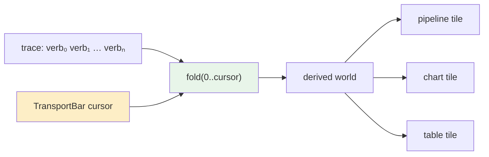

## Who this is for

You have just joined the project. You know React and TypeScript. You have not
seen a presentation-based interface before, you have not read the prototype this
ticket draws from, and you do not yet know why this codebase has thirteen tests
that read source files instead of running them.

By the end of this document you should be able to answer four questions without
looking anything up:

- What a presentation is, and why it is not the same thing as a component.
- Which nine widgets we are adding, and why each one is genuinely absent rather
  than a restyling of something we already ship.
- Why the transport bar is the important one, and what it changes about the
  trace.
- What "verify a guard by breaking it" means here, and why you will be asked to
  do it about eight times.

Read sections 1 through 4 before you write any code. Sections 5 onward are the
build, phase by phase, and you can read those as you reach them.

---

## 1. Where this work comes from

Two files sit in `~/Downloads`, both React prototypes written outside this
repository:

| File | Lines | What it is |
|---|---|---|
| `pbui-shell(1).jsx` | 868 | The original PBUI shell — window manager, presentations, a CLIM listener |
| `pbui-agent-workbench(1).jsx` | 4 309 | A CLIM-flavoured workbench onto the work of a coding agent |

> **Correction, written after phase 7.** The first version of this table called
> the shell's apps "a handful of toy apps" and this document gave the shell two
> paragraphs. That was wrong about one of them. `ListenerApp`
> (`pbui-shell(1).jsx:376-441`) is a CLIM listener and it contains the one idea
> in either prototype that we have half of and should finish — see §5.10 and
> phase 8. The error is left visible here rather than quietly edited out,
> because "I skimmed it and it looked like a demo" is the exact failure this
> section is supposed to guard against.

The shell is the ancestor of what we already have. Our `SplitView`,
`Tile`, `Presentation` and the object menu are all descended from it, and when I
compared them the interesting result was **how little is missing**. The shell's
Blender-style sticky dividers, which snap to 0.25, 1/3, 0.5, 2/3 and 0.75 within
a 0.022 threshold and show four distinct drag states, are already implemented in
`ui/src/components/organisms/SplitView/SplitView.tsx:23-44` via `snapRatio` in
`ui/src/store/layout.ts`. Drag-to-swap-or-dock is already in
`ui/src/components/organisms/Tile/useDrag.ts`. There is nothing to port.

The agent workbench is a different matter. It is a much larger program that
applies the same interface ideas to a domain we do not model at all — the
execution of a coding agent — and in doing so it invents a set of visual
primitives that our design system has no equivalent for.

### The prototype's own architecture, in three sentences

It is worth understanding, because it explains why its widgets look the way they
do.

A **DSL** builds an intermediate representation: `defineRun(r => r.file(…).task(…).step("…", s => s.think(…).tool(…).edit(path, …)))`
compiles to a flat event timeline (`buildIR`, `pbui-agent-workbench(1).jsx:183-244`).
A **simulator** folds that timeline up to a cursor to produce world state at
that instant — files, tasks, memory, context window, diffs (`fold`, `:284`).
Every tile is then a pure function of `fold(cursor, overrides)`, so scrubbing the
cursor re-derives the entire interface, and user manipulations (revert a hunk,
evict a context segment, forget a memory) are *overrides applied during the fold*
rather than mutations, which is why they survive scrubbing.

> The single most transferable idea in the prototype is that one: **make the
> interface a pure function of a cursor into an event log, and make user edits
> overrides inside the fold rather than mutations outside it.** Everything else
> in this document is a widget; that is an architecture.

The prototype also exposes its own telemetry as tidy datasets — `steps`,
`edits`, `tools`, `files`, `context`, `tasks`, each with typed fields
(`DS_DEFS`, `:436-484`) — and feeds them to the same grammar-of-graphics layer
that draws ordinary charts. The agent's behaviour becomes chartable by the
machinery already present. That is a good trick and we should remember it, but
it is not what this ticket builds.

---

## 2. What a presentation is

Skip this section if you have already read the DATADROP-4 material. If you have
not, it is the concept everything else rests on.

An ordinary interface renders **values**: a string here, a number there, and the
things you can do with them live in toolbars and menus written per call site.
A presentation-based interface renders **typed, live handles to objects**. Every
object on screen carries its type, and the type determines the verbs, wherever
that object appears.

The vocabulary in `ui/src/pbui/types.ts` currently has fifteen types — `field`,
`source`, `doc`, `step`, `geom`, `channel`, `datum`, `cat`, `chart`, `tile`,
`workspace`, `stage`, plus four account types. The critical framing, quoted from
that file:

> A presentation type is the type as the *interface* understands it, which is
> not always the type the language understands. `{docId, name}` and
> `{docId, channel}` are both objects to TypeScript; to the interface one is a
> field with the verbs of a field, and the other is a channel with the verbs of
> a channel.

Three pieces make it work, and you will touch all three:

**`<Presentation>`** (`ui/src/pbui/Presentation.tsx`) wraps anything that is an
object. It handles right-click to open the menu, left-click to fire the default
verb, keyboard equivalents, and the accept protocol. It never learns what a
chart is. Its props are `ptype`, `value`, `doc`, `svg`, `block`, `onActivate`,
`activateDoc`, `children`, `testId`.

> **The sharpest edge in the file**, documented at `Presentation.tsx:20-26`: pass
> `svg` when you are inside an `<svg>` element. React silently discards HTML
> elements there, so a `<span>` wrapper means the marks are never drawn — no
> error, no warning, an empty chart.

**A descriptor per type** (`ui/src/pbui/descriptors/*.ts`, fourteen files) says
what a type is called, how to describe it, and what its verbs are:

```ts
interface PresentationDescriptor<V> {
  ptype: PresentationType;
  label(value: V, env: PbuiEnvironment): string;      // menu headers, mouse-doc
  describe(value: V, env: PbuiEnvironment): unknown;  // inspector; JSON-serialisable
  actions(value: V, env: PbuiEnvironment): Action[];  // the menu, likeliest first
  tone: string;                                       // a CSS variable reference
}
```

**Verbs as data.** An `Action` pairs a label with a *serialisable object*, never
a closure: `{ kind: "addFilter", docId: "…", field: "data.temp_c", op: ">", value: "20" }`.
`ui/src/store/applyVerb.ts` is the only place that maps a verb onto a reducer.
This is why menu behaviour is directly assertable in a test with no store, no
provider and no DOM.

### The layer rule you will hit within an hour

The import graph is enforced by `ui/test/layers.test.ts`, and the rule that will
bite you first is this: **`pbui/` may not import from `components/`.** A
descriptor therefore cannot contain a component. The chip that draws a
presentation lives in `components/atoms/`, and the map from type to chip lives
there with it. If you put a component in a descriptor the layer test fails and
tells you the file and the line.

### The other rule: dumb bodies, live wrappers

Look at `ui/src/components/atoms/Chip/Chip.tsx`. Its docstring states the
convention:

> Deliberately dumb: no click handling, no context, no knowledge of what it
> depicts. Presentation wraps it to make it live. Keeping the two apart is what
> lets a chip be rendered in a story with no provider, and what stops the
> "acceptable" appearance from being reimplemented per chip.

**Every widget in this ticket follows that split.** The atom or molecule is a
pure function of props. If it needs to be clickable as an object, the *caller*
wraps it in `<Presentation>`. This is not stylistic tidiness; it is what makes
the Storybook stories possible, and Storybook coverage is enforced by
`ui/test/stories.test.ts`.

---

## 3. The gap analysis

I inventoried our design system against the prototype. Current counts: 21 atoms,
27 molecules, 27 organisms, 25 apps, 14 descriptors.

The method was to take each visual primitive in the prototype and ask two
questions in order. *Do we have something that does this?* and, if we have
something adjacent, *is the difference a prop or a different idea?* A widget only
made the list if the answer to the first is no and the answer to the second is
"a different idea".

### What I checked and rejected

Being explicit about the rejections matters more than the acceptances, because
the failure mode of a ticket like this is fourteen near-duplicate components.

| Prototype widget | Our equivalent | Verdict |
|---|---|---|
| Sticky snapping dividers | `SplitView` + `snapRatio` | **Already have it**, including the four drag states |
| Drag tile to swap / dock | `Tile/useDrag.ts` | **Already have it**, with edge-vs-centre zones |
| `Tag` | `Chip`, `TypeBadge`, `RoleBadge`, `ScopeChip` | **Have it four times over.** A prop, not a widget |
| `Btn`, `Sel`, `Num` | `Button`, `SelectInput`, `TextInput` | Have them, and `no-raw-controls.test.ts` enforces their use |
| `Head`, `Row`, `AppBody`, `Hint` | layout CSS + `HintList` | Layout primitives, not widgets |
| `DocChip`, `FieldChip`, `DocBar` | same names, already ours | Have them |
| `StepChip`, `TaskChip` | `Chip` with a tone | A prop |
| `MoreBar` | `TruncationNotice` | **Adjacent but different** — see below |

`MoreBar` is the interesting rejection-that-became-an-acceptance. Our
`TruncationNotice` is a passive statement that rows were dropped. The
prototype's `MoreBar` (`:2246`) is a *control*: "⋯ 1.2k more lines — click to
show", and it is how every long list in that program stays bounded without
lying about what it hid. That is a different component, and it is on the list.

### The ten we are building

Nine on the first pass, plus `ResultLog`, added after phase 7 when a second
reading of the shell prototype found what the first had skimmed.

| # | Name | Layer | Why it is not something we have |
|---|---|---|---|
| 1 | `Meter` | atom | We have **no** proportional bar of any kind. `grep` for `progressbar`, `Meter`, `ProgressBar` returns nothing |
| 2 | `Sparkline` | atom | No inline series primitive exists. `ChartPanel` is a full chart with scales and axes; this is 46×12 pixels with no axes |
| 3 | `CodeLine` | atom | Nothing renders a source line with a number gutter and an add/remove tone |
| 4 | `MoreBar` | molecule | `TruncationNotice` states; this acts |
| 5 | `JsonBlock` | molecule | The JSON `<pre>` is inlined in `InspectorPanel.tsx:38`. Extracting it removes a duplicate and gives us one place to add folding |
| 6 | `SegmentedBar` | molecule | **The standout.** One bar whose segments are individually presentations, widths proportional to a value. Nothing in our system composes presentations spatially like this |
| 7 | `DiffHunk` | molecule | `SpecDiff` diffs a *chart specification* — two objects. This diffs *text*, with line numbers, `+`/`−` gutters and a unified/split toggle |
| 8 | `KindLegend` | molecule | `Legend` maps categories to chart colours. This maps kinds to counts and totals, with bars. Related, genuinely distinct |
| 9 | `TransportBar` | organism | Nothing. We have no notion of a cursor into a history |
| 10 | `ResultLog` | molecule | **Added after phase 7.** From the shell's `ListenerApp`, not the agent workbench. Nothing renders command *output* as objects — the trace prints strings |

---

## 4. Why the transport bar is the one that matters

The other eight are useful primitives. The transport is a feature.

We already keep a trace. `ui/src/store/trace.ts` records every verb applied,
and `TracePanel` renders it as a list. It is, today, a **log**: a record of what
happened, read top to bottom, with no way to ask what the world looked like at
entry 14.

The prototype's insight is that a log plus a fold function is a **time machine**.
If state at any point is `fold(events.slice(0, cursor))`, then a cursor control
turns the whole interface into a scrubber over its own history.



What that buys a user of *our* product, concretely:

- **Undo becomes navigation.** Not "undo the last thing" but "show me the state
  four verbs ago, and let me look around in it."
- **A lesson can assert about history**, not just about the present. The tour's
  completion predicates run over `RootState`; a scrubbable trace lets a lesson
  ask *did you ever have a filter on `temp_c`* rather than *do you have one now*.
- **A defect report becomes reproducible.** Export the trace, replay it.

### The honest scoping decision

Full time-travel over the real store is a large and invasive change. Our verbs
are applied by reducers that mutate `world`; making the store a fold over a verb
log is a rewrite of `applyVerb.ts` and every reducer, and it is not what this
ticket is for.

**So phase 6 builds the transport against the trace in read-only "review" mode.**
The cursor selects an entry; the panel shows what that verb was, what it
targeted, and the recorded before/after summary. Scrubbing highlights the entry
and drives the other new widgets (the sparkline of activity, the segmented bar of
verb kinds). It does *not* roll the world back.

This is a real limitation and you should not paper over it in the UI. The panel
says what it is:

> *Reviewing entry 14 of 31. This shows what the verb did — it does not roll the
> workbench back. See DATADROP-12 for the fold.*

Making the store a fold is worth a ticket of its own. Write it up when you get
there; do not smuggle it into this one.

---

## 5. What each widget is, precisely

ASCII screenshots below are the intended rendering. They are drawn from the
prototype's behaviour, not invented.

### 5.1 `Meter` — atom

A proportional bar. One value, one maximum, one tone.

```
  churn   ▐███████████▌          ▏  +47 −12
  budget  ▐████████████████████▌ ▏  18.2k / 24k   ← tone flips at 0.75 and 0.9
```

```ts
export interface MeterProps {
  /** 0..1 after clamping. Values outside are clamped, not rejected. */
  fraction: number;
  /** CSS variable reference, e.g. "var(--pbui-tone-step)". */
  tone?: string;
  /** Announced to assistive tech. Required — a bar with no label is decoration. */
  label: string;
  /** Rendered text, e.g. "18.2k / 24k". */
  value?: string;
  size?: "inline" | "row";
}
```

Two decisions worth stating. **`fraction` clamps rather than throws**, because
the callers computing it are doing division and a zero denominator must not take
down a tile. And **`label` is required**, because a `role="progressbar"` with no
accessible name is a lint failure waiting to happen and, more importantly, is
meaningless to a screen reader.

### 5.2 `Sparkline` — atom

A tiny series with no axes, no scales, no legend. It answers "what shape" and
nothing else.

```
  context pressure   ▁▂▃▃▄▅▇█▇▆  ← budget line dashed at 24k
```

```ts
export interface SparklineProps {
  points: number[];
  /** Draws a dashed reference line at this value, e.g. a budget. */
  threshold?: number;
  /** Points at or above `threshold` take the alert tone. */
  tone?: string;
  label: string;
  width?: number;   // default 120
  height?: number;  // default 24
}
```

It renders an `<svg>` with a single `<path>`. **Do not** reach for the charting
layer. `ChartPanel` computes scales, axes and marks through the grammar-of-
graphics pipeline; that is 40× the work for a shape you are drawing at 120×24.

An empty `points` array renders an empty box with the label, not `null` — a
disappearing element makes a layout jump, and a jump reads as a bug.

### 5.3 `CodeLine` — atom

One line of source, with the two line-number gutters a diff needs.

```
   12   12    const ttl = 1000 * 60 * 60 * 24 * 7;
   13    ─  − const s = await db.session.find(id);
    ─   13  + const s = await loadSession(id);
```

```ts
export interface CodeLineProps {
  text: string;
  /** Line number on the "before" side. null renders as blank, not "0". */
  before?: number | null;
  after?: number | null;
  op?: "add" | "remove" | "context";
  /** Blame: who wrote this line. Rendered as a left edge tone only. */
  ownerTone?: string;
}
```

The empty-string case matters: a blank line must still occupy a row, so render
`text || " "`. The prototype does this at `:2271` and it is the difference
between a readable diff and a collapsing one.

### 5.4 `MoreBar` — molecule

The bounded-list control.

```
  ┌──────────────────────────────────────────────┐
  │  ⋯ 1.2k more lines — click to show           │
  └──────────────────────────────────────────────┘
```

```ts
export interface MoreBarProps {
  hidden: number;
  /** Plural noun: "lines", "hunks", "segments", "rows". */
  what: string;
  onReveal: () => void;
}
```

It renders `null` when `hidden <= 0`, so callers can place it unconditionally.
The count goes through the same `kfmt` short-number formatting the rest of the
system uses — write that helper once, in `ui/src/model/format.ts`, and use it in
`Meter` and `Sparkline` too.

### 5.5 `JsonBlock` — molecule

Extract of the `<pre>` currently inlined at `InspectorPanel.tsx:38`.

```ts
export interface JsonBlockProps {
  value: unknown;
  /** Max rendered height in px before it scrolls. Default 220. */
  maxHeight?: number;
}
```

Two reasons this is worth a component rather than a copied `<pre>`. It gives us
one place to add collapsing later. And it is where the guard against
`JSON.stringify` throwing on a circular value belongs — `describe()` is supposed
to return JSON-serialisable data, but "supposed to" is not "does", and a tile
that throws takes the workbench down.

### 5.6 `SegmentedBar` — molecule

The one I would build first if I could only build one, because nothing in our
system does this.

A single bar divided into segments whose widths are proportional to a value, and
**each segment is independently a presentation** — hover it, right-click it, act
on it.

```
  context window                              18.2k / 24k · 76%
  ┌────┬───┬──────────┬────┬───────────┬──────────────────────┐
  │sys │mem│ file     │tool│ messages  │ ░░░ headroom ░░░░░░░ │
  └────┴───┴──────────┴────┴───────────┴──────────────────────┘
   ▲pinned                        ▲ hover → "<ctxseg> tool · bash(…) · 2.1k (8.7%)"
```

```ts
export interface Segment {
  id: string;
  /** Determines width. Not a percentage — the component normalises. */
  weight: number;
  tone: string;
  label: string;
  /** Drawn with an inset outline. */
  pinned?: boolean;
  /** Drawn at reduced opacity. */
  dimmed?: boolean;
}

export interface SegmentedBarProps {
  segments: Segment[];
  /** When set and greater than the sum of weights, the remainder is hatched. */
  total?: number;
  /** Wraps each segment. Return the element; the bar handles geometry. */
  renderSegment?: (segment: Segment, body: ReactNode) => ReactNode;
  label: string;
}
```

The `renderSegment` prop is how the dumb-body rule is honoured. `SegmentedBar`
knows about geometry and nothing else; the caller passes a function that wraps
each segment in `<Presentation ptype="ctxseg" value={id}>`. If you find yourself
importing `Presentation` inside `SegmentedBar`, stop — you have just moved
policy into a layout primitive.

Geometry note, because it is easy to get wrong: use `flex: <weight> 0 0` per
segment with a `minWidth` of about 2px. Percentage widths accumulate rounding
error across many segments and leave a visible gap at the right edge; flex
weights do not.

### 5.7 `DiffHunk` — molecule

Text diff rendering, unified and split.

```
  @@ −41,3 +41,4 @@                                    +2 −1
   41  41    export async function loadSession(id: string) {
   42   ─  −   return db.session.find(id);
    ─  42  +   const s = await db.session.find(id);
    ─  43  +   if (!s || s.expiresAt < Date.now()) return null;
   43  44    }
```

```ts
export interface DiffRow {
  op: "add" | "remove" | "context";
  text: string;
  before: number | null;
  after: number | null;
}

export interface Hunk {
  rows: DiffRow[];
  added: number;
  removed: number;
  beforeStart: number;
  afterStart: number;
}

export interface DiffHunkProps {
  hunk: Hunk;
  split?: boolean;
  /** Rows beyond this collapse behind a MoreBar. Default 160. */
  cap?: number;
}
```

The split-view pairing rule, from `:2279-2291`: walk the rows; a context row goes
to both sides, a removal to the left only, an addition to the right only; then
render `max(left.length, right.length)` paired rows, filling the short side with
blanks. It is four lines and it is the whole algorithm.

**We are not writing a diff algorithm in this ticket.** The prototype has a good
one — LCS with common head/tail trimming to keep the DP table small
(`diffLines`, `:130-154`) — but `DiffHunk` takes an already-computed `Hunk`.
Whether we ever compute diffs is a separate question; the renderer is useful on
its own and testable with a literal.

### 5.8 `KindLegend` — molecule

Kinds, their counts, their totals, and a bar each.

```
  ▪ file       ████████████████░░░░░░░  8.4k · 12
  ▪ tool       ████████░░░░░░░░░░░░░░░  4.1k ·  7
  ▪ system     ████░░░░░░░░░░░░░░░░░░░  1.5k ·  2
```

```ts
export interface LegendKind {
  kind: string;
  tone: string;
  total: number;
  count: number;
}

export interface KindLegendProps {
  kinds: LegendKind[];
  /** Formats `total`. Defaults to the shared short-number formatter. */
  format?: (n: number) => string;
  label: string;
}
```

Sort descending by `total` **inside the component**. Every call site wants that
order and forgetting it produces a legend that reorders as data changes, which
looks like flicker.

### 5.9 `TransportBar` — organism

```
  ┌───────────────────────────────────────────────────────────────┐
  │ ⏮  ◀  ▶  ⏭     ▐──────────●────────────────▌   14 / 31        │
  │                 ▲ setMapping y ← data.temp_c                  │
  │ reviewing entry 14 — this shows what the verb did; it does     │
  │ not roll the workbench back                                   │
  └───────────────────────────────────────────────────────────────┘
```

```ts
export interface TransportBarProps {
  length: number;
  cursor: number;
  onCursor: (next: number) => void;
  /** Label for the entry under the cursor. */
  currentLabel?: string;
  /** Shown beneath. Explains the review-only limitation. */
  note?: string;
}
```

Keyboard is not optional here: `←`/`→` step, `Home`/`End` jump to the ends. The
range input carries `role="slider"` semantics natively; use `<input type="range">`
rather than building one, and let `SelectInput`-style styling do the rest.

Guard the ends in the *handler*, not the render. `onCursor(clamp(next, 0, length - 1))`
computed once beats four disabled-button conditions that drift apart.

### 5.10 `ResultLog` — molecule

**The tenth widget, and the only one that comes from the shell rather than the
agent workbench.** It was missed on the first pass; see the correction in §1.

`ListenerApp` (`pbui-shell(1).jsx:376-441`) is a read-eval-print loop, and the
CLIM idea in it is not the reading or the evaluating. It is the printing:

```js
const r = a.value + b.value;
w.print([{ text: a.value + " + " + b.value + " = " },
         { ptype: "number", value: r }]);   // ← the RESULT is a presentation
```

Command output is **not text**. Every result is a live object, so the output
history becomes *a source of input for the next command*. The prototype's own
prompt says so: *"SUM — click a NUMBER (1 of 2) — numbers app, notes, prior
results all work."* Sum two numbers, then point at the answer as an argument to
the next sum.

```
  ┌──────────────────────────────────────────────────────┐
  │ described ⟦<field> data.temp_c⟧ → see inspector       │
  │ 3 + 4 = ⟦7⟧                     ← ⟦…⟧ is clickable    │
  │ 7 + ⟦7⟧ = ⟦14⟧                    and right-clickable │
  │ picked ⟦#7aa6c9⟧ luminance 0.63                       │
  └──────────────────────────────────────────────────────┘
```

**We already have the hard half.** The accept protocol is real in `pbui/` —
`AcceptBanner`, `MouseDocLine`, accept mode, Esc to abort, and it survives a
workspace switch mid-accept. What is missing is anywhere that *output* is
objects. `TracePanel` renders `entry.type` and `entry.detail` as plain `<Text>`;
after phase 6 the transport's current entry is a presentation, and that is the
only live thing in the panel.

```ts
export type ResultSegment =
  | { kind: "text"; text: string }
  | { kind: "object"; ptype: PresentationType; value: unknown; label: string };

export interface ResultLine {
  id: string;
  segments: ResultSegment[];
  /** Rendered dim and prefixed, for the echoed command. */
  echo?: boolean;
}

export interface ResultLogProps {
  lines: ResultLine[];
  /**
   * Wraps an object segment. Same seam as `Legend`'s `renderEntry` and
   * `SegmentedBar`'s `renderSegment` (DR-38) — the molecule stays
   * provider-free and the caller decides what "live" means.
   */
  renderObject?: (segment: ResultSegment & { kind: "object" }, body: ReactNode) => ReactNode;
  /** Follows its own tail unless the reader has scrolled away. */
  follow?: boolean;
  label: string;
}
```

Two decisions carried over from what phases 1–7 already learned:

- **The seam, not a direct `Presentation` import.** Three molecules now use this
  shape. A molecule that imports `Presentation` cannot be storied without a
  provider, and phase 6 showed exactly what that costs — every `TracePanel`
  story threw at render while the test suite stayed green.
- **`label` on an object segment is required.** The caller knows what the object
  is called; the log must not have to reach into the registry to find out, and
  `labelFor` needs an environment this component has no business holding.

Non-applicability: if every line of your output is a string, this is a `<pre>`
with extra steps. It earns its place only where results are objects the reader
will want to act on.

---

## 6. New presentation types

Three of these widgets want objects that our vocabulary does not have.

| ptype | Value shape | Where it appears | Verbs |
|---|---|---|---|
| `traceEntry` | `{ index: number }` | transport, trace list | Jump here · Copy verb JSON · Filter trace to this kind |
| `ctxseg` | `{ id: string }` | segmented bar | Pin · Summarize · Evict |
| `sem` | `string` (the class name) | semantic chips | Show every change of this class |

**Only `traceEntry` is in scope for this ticket.** `ctxseg` and `sem` describe
objects that exist in the agent domain and not in ours; adding descriptors for
types we cannot populate is how you get the `tile`/`workspace` situation that
DATADROP-4 left behind and DATADROP-8 had to clean up — a declared type, wrapped
in real `<Presentation>` elements, with no descriptor and a menu that says "no
verbs for this object yet".

> **Rule:** do not declare a presentation type until something renders it *and*
> a descriptor answers for it. The vocabulary is not a wish list.

Adding `traceEntry` means, in order:

1. Add `"traceEntry"` to the `PresentationType` union in `ui/src/pbui/types.ts`.
2. Create `ui/src/pbui/descriptors/traceEntry.ts` following `step.ts` as the model.
3. Register it in `ui/src/pbui/registry.ts`.
4. Add a tone variable `--pbui-tone-traceEntry` to the token stylesheet, and run
   `bun run --cwd=ui tokens`.
5. Add the verb kinds to `ui/src/pbui/verbs.ts` and the mapping in
   `ui/src/store/applyVerb.ts`.

Step 4 is the one people forget. `ui/test/tokens-used.test.ts` asserts every
`var(--pbui-…)` in a stylesheet names a declared token, so you will find out —
but you will find out at test time rather than at edit time.

---

## 7. The build, phase by phase

Seven phases. Each ends with a commit, a checked task, and a diary step.

### Phase 1 — The formatting helpers and the three atoms

Create `ui/src/model/format.ts` with `kfmt` (short numbers: `1.2k`), `msfmt`
(durations: `1.4s`, `3m`, `2.1h`) and `clamp`. These exist scattered in the
prototype and will otherwise be reinvented three times.

Then `Meter`, `Sparkline`, `CodeLine` — each with its component, CSS module,
barrel export and stories.

**Done when:** `bun run --cwd=ui test` green, and the three appear in Storybook
under `Atoms/`.

### Phase 2 — `MoreBar`, `JsonBlock`, `KindLegend`

The three simple molecules. `JsonBlock` also **replaces** the inlined `<pre>` in
`InspectorPanel.tsx:38` — do the substitution in this phase, do not leave both.

**Watch for:** `JsonBlock` must not throw on a circular value. Wrap the
stringify and render the error text in the block. Test it with a literal
circular object.

### Phase 3 — `SegmentedBar`

The one with real geometry. Build it, story it with 3 / 12 / 60 segments, and
with a `total` that leaves headroom.

**Verify by breaking:** give it segments whose weights sum to more than `total`
and confirm it does something sane rather than overflowing its container.

### Phase 4 — `DiffHunk`

Unified first, split second. Story both with the same hunk so a reviewer can see
they agree.

**Watch for:** the blank-line case (`text || " "`), and the cap. A 4 000-row
hunk must not render 4 000 nodes.

### Phase 5 — `traceEntry` and the descriptor

The five steps in section 6. Add a menu, verify the actions with a literal value
and no provider, following `ui/test/descriptors.test.ts` as the model.

### Phase 6 — `TransportBar` and the trace review panel

Wire the transport into `TracePanel`. The cursor selects; the panel shows the
selected entry expanded; the sparkline shows verb activity across the trace; the
segmented bar shows the mix of verb kinds.

**The note about review-only mode is part of the deliverable, not a nicety.**

### Phase 8 — `ResultLog`

Added after phase 7. The shell-derived widget of §5.10, with the same
`renderObject` seam the other two composite molecules use.

**Done when:** it is storied both raw and wrapped in presentations, and the
story shows a result being produced *and then re-used* as an argument — the
property that is the entire point.

### Phase 7 — Guards, stories, and the break sweep

- `stories.test.ts` will already be failing if you missed a story; make it pass
  honestly rather than by adding an exemption.
- Add the new components to the barrels.
- **Break every guard you added or touched, one at a time, and paste the
  failure into the diary.** See section 8.

---

## 8. How this codebase verifies things

Two conventions here are stronger than "the tests pass", and you are expected to
follow both.

### A guard is not real until it has been broken once

Thirteen structural tests walk the source tree and assert invariants. The
genre's characteristic failure is that **a structural test can pass while
guarding nothing** — a regex that matches nothing, an allow-list that swallows
everything. The answer applied at least eight times in this repository is to
break the thing the guard protects, watch it fail, and record the failure text.

Real examples from the log:

```text
break: add env.tableFor(null) to a panel        → structural guard fails, names file:line
break: duplicate a help-page slug               → "claimed by both X and Y"
break: unquote a colon in YAML frontmatter      → "declares slug X, which does not resolve"
break: add a fifth FilterOp without a case      → both branches fail to compile
```

Put the verbatim output in the diary. A guard nobody has broken is a guard
nobody has tested.

### Read the rendered output after the build is green

Twice in this project a change passed typecheck, lint and the entire test suite
while being visibly wrong on screen. A comparison panel reported two different
pipelines as matching. A story's prose contradicted its own screenshot. Neither
was catchable by any test that existed or that anyone proposed afterwards.

More recently the DATADROP-8 work found **eight** defects this way, including a
stage switcher rendering white-on-white at a 1.00:1 contrast ratio, and a
Firefox clipboard read that never settles — not rejects, *never settles* — which
made an entire menu entry a dead control.

So: open Storybook, look at every new component, and look at `DiffHunk` and
`SegmentedBar` especially, because both are geometry and geometry is where
"compiles" and "correct" diverge.

### Allow-lists cost a sentence

If you must exempt something from a structural test, the entry states its reason
in prose:

```ts
const ALLOWED: Array<{ prefix: string; because: string }> = [
  { prefix: "components/atoms/",
    because: "the atoms ARE the wrappers — this is where the raw elements live" },
];
```

This is load-bearing. An exemption that costs a written sentence produces
*fewer* exemptions, because writing the sentence is where an author discovers
they do not have one.

---

## 9. Commands you will need

```bash
# the equals sign is mandatory — `--cwd ui` silently runs in the wrong directory
bun run --cwd=ui test
bun run --cwd=ui typecheck
bun run --cwd=ui lint
bun run --cwd=ui storybook       # http://localhost:6006
bun run --cwd=ui tokens          # regenerate token constants after adding a variable
bun run --cwd=ui build:check     # build without writing into pkg/webui/dist

# Go side, if you touch it — GOWORK=off is required in this environment
GOWORK=off go build ./...
```

Ticket bookkeeping:

```bash
docmgr task list  --ticket DATADROP-11
docmgr task check --ticket DATADROP-11 --id <id>
docmgr changelog update --ticket DATADROP-11 --entry "Phase N: …(commit <hash>)"
```

---

## 10. File reference

**Read before you start:**

| Path | Why |
|---|---|
| `ui/src/pbui/Presentation.tsx` | The wrapper. Note the `svg` prop warning |
| `ui/src/pbui/types.ts` | The type vocabulary and `PbuiEnvironment` |
| `ui/src/pbui/descriptors/step.ts` | The shortest complete descriptor — use as the model |
| `ui/src/components/atoms/Chip/Chip.tsx` | The dumb-body convention, stated in its docstring |
| `ui/src/components/organisms/SplitView/SplitView.tsx` | Snapping dividers, already done |
| `ui/GUIDELINES.md` | Design-system rules, including which are enforced and which are review-only |

**Files you will create:**

```
ui/src/model/format.ts
ui/src/components/atoms/Meter/{Meter.tsx,Meter.module.css,Meter.stories.tsx,index.ts}
ui/src/components/atoms/Sparkline/{…}
ui/src/components/atoms/CodeLine/{…}
ui/src/components/molecules/MoreBar/{…}
ui/src/components/molecules/JsonBlock/{…}
ui/src/components/molecules/SegmentedBar/{…}
ui/src/components/molecules/DiffHunk/{…}
ui/src/components/molecules/KindLegend/{…}
ui/src/components/organisms/TransportBar/{…}
ui/src/pbui/descriptors/traceEntry.ts
```

**Files you will modify:**

```
ui/src/pbui/types.ts                 add "traceEntry" to the union
ui/src/pbui/registry.ts              register the descriptor
ui/src/pbui/verbs.ts                 new verb kinds
ui/src/store/applyVerb.ts            map them
ui/src/components/atoms/index.ts     barrel
ui/src/components/molecules/index.ts barrel
ui/src/components/organisms/index.ts barrel
ui/src/components/organisms/TracePanel/TracePanel.tsx   the transport
ui/src/components/organisms/InspectorPanel/InspectorPanel.tsx  use JsonBlock
```

---

## 11. What this ticket deliberately does not do

State these to a reviewer before they ask.

- **No agent-run simulator.** No DSL, no IR, no fold over an agent timeline. The
  prototype's 4 300 lines are mostly that, and it models a domain we do not have.
- **No diff *algorithm*.** `DiffHunk` renders a hunk it is given.
- **No real time travel.** Phase 6 is review-only, and the UI says so. Making the
  store a fold over the verb log is DATADROP-12's job if we want it.
- **No `ctxseg` or `sem` presentation types.** Nothing in our product produces
  those objects yet, and declaring a type with no descriptor is a defect we have
  already had to clean up once.

---

## 12. Related reading

- [[DATADROP-4]] — the PBUI shell and the presentation protocol
- [[DATADROP-6]] — the atomic design split and the structural guard genre
- [[DATADROP-8]] — stages, portable bundles, and the eight look-at-it defects
- `ui/GUIDELINES.md` §10 — the enforcement table
- `pbui-agent-workbench(1).jsx:183-320` — the DSL and the fold, if you want the
  architecture rather than the widgets
