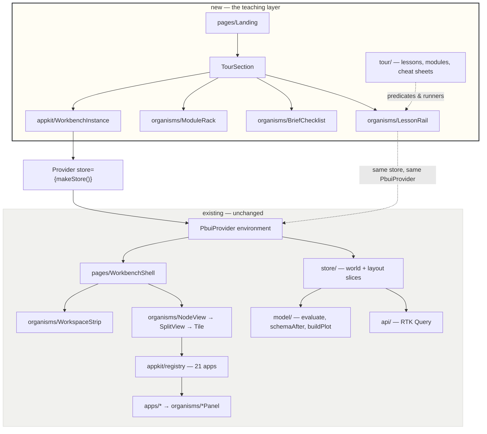
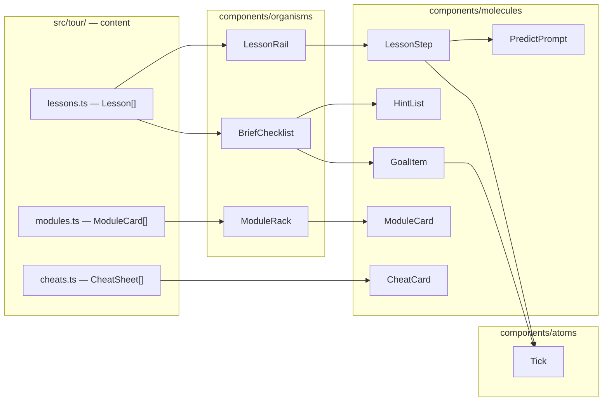
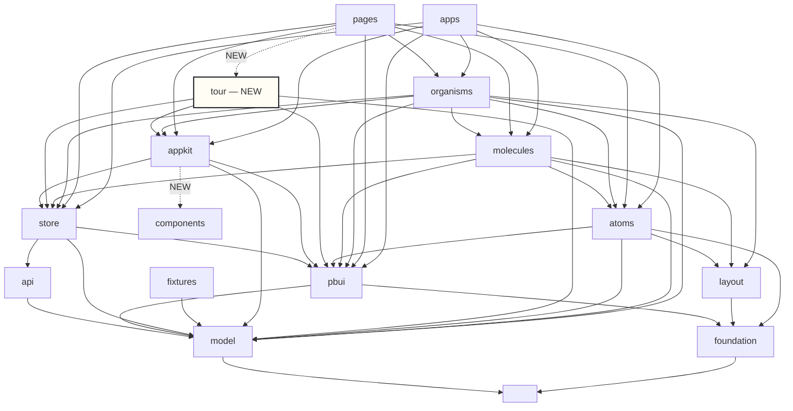

# The landing page, the embedded workbench, and the lesson rail

## Overview

A prototype arrived — `sources/pbui-landing.jsx`, 2 719 lines — that embeds **five
independent copies of the whole workbench into one scrolling page**. Not five
screenshots and not five mockups: five live instances, each with its own
documents, its own tile layout, its own pipeline engine and its own accept
protocol, sharing nothing. Beside each one sits a rail of lesson steps that tick
themselves off by **watching the world**, so any route to the goal counts,
including routes the lesson author never thought of.

This guide is written for someone joining the project who has to implement that
in the real application. It has five parts:

- **Part I** orients you: what arrived, what you need to know first, and a map
  of the prototype file.
- **Part II** reads the prototype closely — every mechanism, with line
  references, and a section on what it gets wrong.
- **Part III** describes our system as it stands today and locates exactly where
  it does and does not fit. This part contains measurements, not opinions.
- **Part IV** is the design: eleven decision records, the component inventory,
  and the layer graph after the change.
- **Part V** is the implementation plan, the acceptance criteria, and the risks.

The single most important finding is in §15, and it is short enough to state
here. Our workbench is **already** instance-scoped everywhere that matters. The
store is a factory (`ui/src/store/index.ts:45`), and across 246 source files
there is **exactly one runtime import of the store singleton** — line 9 of
`ui/src/main.tsx`. Every other file imports only `type RootState`. Multi-instance
embedding is therefore not an architectural rewrite. It is the removal of six
named singletons, all of which are listed in §15 with the line that creates them.

---

# Part I — Orientation

## 1. What arrived, and what it forces

The prototype is a marketing-and-teaching page for the workbench. Its thesis is
stated in its own header comment (`pbui-landing.jsx:3-14`):

> Nothing here is a mockup. Each widget owns its own World, its own workspaces,
> its own accept plumbing. Lesson steps complete by OBSERVING world state, so
> any route to the goal counts — including ones this file never anticipated.

Two claims are doing the work, and they pull in opposite directions.

**The first claim is that the tutorial is the application.** There is no
demonstration mode, no scripted replay, no fake data path. When lesson A2 says
"right-click the `mass_g` chip and choose Inspect", the thing you right-click is
a real presentation, the menu is the real object menu, and Inspect writes into
the real inspector. This is worth having because a walkthrough built from
screenshots is wrong within a month and tells nobody; a walkthrough built from
the application cannot silently rot. It is the same argument our own
`ui/src/apps/tutorials/Tutorial.tsx:8-21` already makes for tutorial tiles.

**The second claim is that there are five of them on one page, and they share
nothing.** That is what forces architectural work. A tutorial *tile* — which is
what we ship today — lives inside the one workbench and therefore inherits the
one world. Five workbenches on one page need five worlds, and every piece of
state that is currently reachable through a module-level import becomes a
collision.

The forcing function, stated precisely:

```
today:     one page  →  one store  →  one world  →  N tiles
required:  one page  →  N stores   →  N worlds   →  N × M tiles
```

Everything in Part III is an enumeration of the places where our code assumes
the first line.

## 2. What you need to know before reading further

You should have read `ui/GUIDELINES.md`, particularly §2 (the layer graph) and
§8 (how to add a component). Beyond that, four ideas from the existing system
recur constantly here.

**A presentation is a typed handle, not a label.** `<Presentation ptype="field"
value={{docId, name}}>` renders its children and attaches a type and a value.
Right-clicking it produces the verbs that type has; left-clicking runs the
default verb; hovering documents it on the mouse-doc line. The mechanism lives
in `ui/src/pbui/`, and `ui/src/pbui/types.ts:13-29` is the vocabulary — fifteen
presentation types, from `field` and `source` through to `token` and `upload`.

**A document is a `ChartSpec` plus an identity.** `ui/src/store/world.ts:24-30`.
There is no parallel "chart object". A tile that is document-bound holds a
`docId` and nothing else, so two tiles on one document move together because
they read one object rather than two copies.

**The layer graph is enforced by a test.** `ui/test/layers.test.ts` names, for
every source directory, the directories it may import. A change that adds an
edge fails the suite. §23 of this guide gives the graph after this ticket, and
that section is normative — if the implementation disagrees with it, one of the
two is wrong and it is worth finding out which before writing more code.

**The pipeline engine is pure.** `evaluate`, `schemaAfter` and `buildPlot`
(`ui/src/model/`) take data and a spec and return data. They import no React and
touch no store, which is why a story can drive the real engine and why lesson
predicates can call them directly.

## 3. A map of the prototype file

`sources/pbui-landing.jsx` is a single 2 719-line module with no imports beyond
React. It is organised in twelve banded sections. This map is the fastest way to
navigate it; every subsequent reference in this guide is to these line numbers.

| Lines | Band | What it is | Our equivalent |
|---|---|---|---|
| 16–48 | palette and helpers | `C` colour object, `MONO`, `clamp`, `fmt`, seeded `rng` | `ui/src/styles/tokens.css`, `ui/src/model/format.ts` |
| 50–144 | datasets | three generated tidy tables, fixed seeds | `ui/src/fixtures/*.json` |
| 146–270 | pipeline engine | `schemaAfter`, `evaluate`, `stepLabel`, `asGgplot` | `ui/src/model/pipeline.ts` |
| 272–423 | `class World` | documents, snapshots, pins, watchlist, trace, subscribers | `ui/src/store/world.ts` |
| 425–603 | plot engine | `niceTicks`, `buildPlot` | `ui/src/model/plot.ts` |
| 605–660 | PBUI core | `UICtx`, `P`, `Pres` | `ui/src/pbui/` |
| 662–763 | chart renderers | `PlotSVG`, `MiniPlot`, `PanelFrame`, `AxisLabels` | `ui/src/components/organisms/ChartPanel` |
| 765–887 | window manager | split tree, `WMDivider`, `TileView` | `ui/src/store/layout.ts`, `organisms/SplitView`, `organisms/Tile` |
| 889–1464 | shared bits and apps | `Btn`, `Sel`, `Num`, `FieldChip`, twelve applications, `APPS` | `ui/src/components/atoms`, `ui/src/apps/`, `ui/src/appkit/registry.ts` |
| 1466–1761 | `Workbench` | **the embeddable shell** | `ui/src/components/pages/Workbench` |
| 1763–1988 | **lesson machinery** | `wedgeOf`, `Predict`, `Tick`, `LessonRail`, `Checklist` | **nothing — this is new** |
| 1990–2044 | **`ModuleRack`** | reference cards with a live specimen | **nothing — this is new** |
| 2046–2129 | page furniture | `Eyebrow`, `Prose`, `Kbd`, `CheatCard`, `Section`, `SectionBody` | partly `foundation`, mostly new |
| 2131–2476 | content | four lesson tracks, `MODULES`, the capstone brief | **new** |
| 2478–2719 | `App` | masthead, sticky nav, hero, five sections, closing | **new** |

Roughly 60 % of the file is a re-implementation of things we already have and
have already refactored better. The 40 % that is genuinely new is lines
1466–1761 (embeddability) and 1763–2719 (the teaching layer). **Read those two
bands and skim the rest.**

---

# Part II — The prototype, read closely

## 4. The five worlds, and what "sandboxed" means

The page mounts six `Workbench` instances: one in the hero and one per section.
The construction is in `SectionBody` (`pbui-landing.jsx:2087-2111`):

```jsx
function SectionBody({ build, lessons, modules, capstone, height, onReset, ... }) {
  const worldRef = useRef(null);
  if (!worldRef.current) worldRef.current = new World(build.world);   // ← one World, once
  const world = worldRef.current;
  const probeRef = useRef({});
  const focusRef = useRef(null);
  const [, force] = useState(0);
  useEffect(() => world.sub(() => force((x) => x + 1)), [world]);      // ← re-render on change
  const buildSpaces = useCallback((w) => build.spaces(w, focusRef), [build]);
  return (
    <div style={{ display: "flex", gap: 14, flexWrap: "wrap" }}>
      <div style={{ flex: "1 1 290px", maxWidth: 400 }}>
        {modules  ? <ModuleRack ... />
       : capstone ? <Checklist ... />
       :            <LessonRail lessons={lessons} world={world} probeRef={probeRef} ... />}
      </div>
      <div style={{ flex: "3 1 540px", minWidth: 0 }}>
        <Workbench world={world} buildSpaces={buildSpaces} height={height} probeRef={probeRef} />
      </div>
    </div>
  );
}
```

Three things are worth extracting from those twenty lines.

**Construction happens in a ref, guarded by a null check, not in `useState`'s
lazy initialiser and not in an effect.** `useState(() => new World(...))` would
also work; an effect would not, because the first render must already have a
world to hand to `Workbench`. Under React 18 StrictMode the double-invoked
render would construct two worlds with `useState`'s initialiser as well, so the
ref-with-null-check is the form that is correct in both modes. We will need the
same shape for the store.

**"Sandboxed" means one thing only: no shared mutable state.** It is not an
iframe, not a shadow root, not a separate React root. The instances share the
module — the same `DATASETS`, the same `evaluate`, the same `APPS` registry, the
same CSS. They share module-global *counters* too (`seqc`, `docc`, `snapc`,
`idc` at lines 278 and 768), which is safe only because those produce unique
ids rather than per-world sequences. Note what is *not* shared: `World.docn` and
`World.snapn` are instance fields (line 300-301) with a comment explaining why —
document names must be α, β, γ *per world*, or the second section's first
document would be called δ.

**Reset is remount.** `Section` holds a `nonce` (line 2114) and passes
`key={nonce}` to `SectionBody` (line 2123). Pressing ↺ increments it, React
throws away the subtree, and the `useRef` null check runs again against a fresh
ref. This is the whole reset mechanism — no `world.reset()` method, no state
diffing. It is worth copying exactly.

## 5. `class World`: state as an object with subscribers

`pbui-landing.jsx:297-403`. A plain class holding seven fields and about thirty
mutating methods:

```js
class World {
  constructor(setup) {
    this.subs = new Set();
    this.docn = 0; this.snapn = 0;
    this.trace = []; this.docs = []; this.activeId = null;
    this.snaps = []; this.pins = [null, null]; this.watch = [];
    this.inspected = { title: "nothing inspected yet", value: {...} };
    if (setup) setup(this);                       // ← per-section seeding
    if (!this.docs.length) this.newDoc("seabirds", true);
    if (!this.activeId) this.activeId = this.docs[0].id;
    this.trace = [];                              // ← seeding is not history
  }
  sub(fn) { this.subs.add(fn); return () => this.subs.delete(fn); }
  bump()  { this.subs.forEach((f) => f()); }
  log(type, data) { this.trace.push({ seq: ++seqc, type, data: data || {} }); this.bump(); }
  addStep(docId, step) { this.doc(docId).chart.steps.push(step); this.log("step_added", {...}); }
  ...
}
```

**The subscriber set, rather than a single notify callback, is the design
decision worth noticing.** The header comment at line 275-276 says so
explicitly: "Subscribers instead of a single notify hook so a lesson rail and a
workbench can both listen." Both `Workbench` (line 1474) and `LessonRail` (line
1826) subscribe, independently, and each forces its own re-render. This is a
hand-rolled version of what `react-redux` gives us for free, and it is the
clearest signal in the file that our Redux arrangement is the right substrate:
**the rail needs to observe the same state the workbench mutates, from outside
the workbench's React subtree.**

**The `setup` callback is how a section seeds its world**, and it runs before
the "ensure at least one document" fallback. Clearing `this.trace` after setup
(line 312) is a small thing that matters: seeding a section with two documents
and a filter step must not make lesson E5's "you have added a filter" predicate
true before the reader has done anything.

Everything else in the class is mutate-then-`log`, and `log` calls `bump`. That
is why `updateStep` (line 357-361) — the one method that must not write a trace
entry, because it fires per keystroke — calls `this.bump()` by hand. Miss that
and a step editor stops updating.

## 6. `Workbench`: the shell, and the `probeRef`

`pbui-landing.jsx:1471-1761`, 290 lines. It holds the layout tree in React
state, builds the `ui` context object, and renders the workspace strip, the
split tree, the trace strip, the status line, the drag ghost and the object
menu.

The signature is the interesting part:

```jsx
function Workbench({ world, buildSpaces, height, probeRef, showTrace })
```

- **`world`** — the state object, constructed by the caller. The shell owns no
  chart state.
- **`buildSpaces(world)`** — a factory returning the initial workspaces. It is
  called once, in `useState`'s lazy initialiser (line 1476), so each instance
  starts in a different layout: the hero opens on chart-beside-pipeline
  (line 2144), section C opens on a four-way split with the spec strip across
  the top (line 2238-2247).
- **`height`** — a number, in pixels. See §12; this is one of the things the
  prototype gets wrong.
- **`showTrace`** — the hero passes `false` (line 2486) because a trace strip
  on a hero widget is noise before anything has happened.
- **`probeRef`** — the escape hatch, and the piece we should *not* copy.

`probeRef` is written **during render**, not in an effect (line 1667-1674):

```jsx
if (probeRef) {
  probeRef.current = {
    spaces, cur, tree,
    leaves: allLeaves(tree), nLeaves: countLeaves(tree),
    docsShown: new Set(allLeaves(tree).filter(l => DOC_APPS.includes(l.app)).map(l => l.doc)),
    apps: allLeaves(tree).map(l => l.app),
    api: { accept, setLeafApp, setLeafDoc, splitLeaf, addSpace, setCur, swapTiles },
  };
}
```

The comment above it explains the timing: "written during render so the rail's
effect (which runs after ours) always sees the current layout". This is a
side effect in a render body — legal only because it writes to a ref, and fragile
under concurrent rendering, where a render may be thrown away.

**It exists because the layout lives in `Workbench`'s `useState` and the lesson
rail is a sibling.** A rail predicate like lesson B2's `(w, p) => p.nLeaves > 2`
cannot read tile count from the `World`, because tile count is not in the world.

**We do not have this problem.** Our layout is a Redux slice
(`ui/src/store/layout.ts`), in the same store as the world, and the rail will be
under the same `<Provider>`. A predicate reads `RootState` and gets both halves.
The probe collapses to nothing, and with it the render-phase side effect. This
is the second-strongest argument in the guide that our substrate is right — see
DR-49.

The one thing the probe supplies that a selector cannot is `api.accept`, which
returns a promise and lives in React context rather than in the store. §21
handles that by placing the rail inside the `PbuiProvider`.

## 7. `LessonRail`: completion as a predicate over state

`pbui-landing.jsx:1821-1913`. This is the centrepiece of the teaching layer and
the part most worth understanding exactly.

A lesson is a plain object:

```js
{
  id: "c4",
  title: "Fix it with the other half",
  body: <>…prose, with <b>bold</b> for things on screen and <Kbd>⌖</Kbd> for controls…</>,
  run:  (world, api, probe) => { /* dispatch the same verbs the UI dispatches */ },
  done: (world, probe) => boolean,          // ← the completion predicate
  manual: true,                             // ← alternative to `run`: a "✓ got it" button
  predict: { q, options, answer, reveal },  // ← optional binary prediction
}
```

The completion loop is an effect with **no dependency array** (line 1828-1839),
so it runs after every render of the rail, and the rail re-renders whenever the
world bumps:

```jsx
useEffect(() => {                                    // no dep array — runs every render
  setDone((d) => {
    let changed = false; const next = { ...d };
    lessons.forEach((l) => {
      if (next[l.id] || !l.done) return;             // already done, or has no predicate
      let ok = false;
      try { ok = !!l.done(world, probeRef.current || {}); } catch { ok = false; }
      if (ok) { next[l.id] = ranRef.current[l.id] ? "watched" : "self"; changed = true; }
    });
    return changed ? next : d;                        // ← identity return stops the loop
  });
});
```

Four properties fall out of this, and each is a deliberate design choice.

**Any route counts.** The predicate for lesson C2 is `(w) => nFilters(w) >= 1`,
where `nFilters` counts `step_added` trace entries of kind `filter` (line 2250).
It does not matter whether the reader used the `+ filter…` button, right-clicked
a legend swatch, right-clicked a dot in the chart, or used the field chip's
object menu — all four write a filter step, so all four tick the box. A tutorial
that checks "did you press *this* button" teaches button locations; a tutorial
that checks "is the world in this state" teaches the system.

**A predicate that throws is false, not a crash.** The `try/catch` matters
because predicates run against a world the reader is free to break — deleting the
document a predicate names is a legal move.

**Completion is monotonic.** `if (next[l.id]) return` means a lesson never
un-ticks. Undoing your filter step does not reopen lesson C2. This is right for
a tutorial and would be wrong for a validator; the capstone (§9) keeps the same
property for the same reason.

**"Watched" is distinguished from "did".** `ranRef` records that the reader
pressed ▶ *do it for me*, and if the predicate then goes true, the tick is grey
and labelled WATCHED (line 1878) instead of green, with the follow-up "you
watched this one. try the same move by hand in the panel." (line 1903). The
comment at the top of the band states the reasoning: "watching is not the same
as knowing". This is cheap to implement — one ref and one extra tick colour —
and it is the difference between a tutorial that measures progress and one that
measures clicking.

The rail also **auto-advances** (line 1841-1846): when the open lesson completes,
it opens the next incomplete one, wrapping to the first if the tail is done.

## 8. `wedgeOf`, `Predict`, `Tick`

Three small components that each carry more weight than their size suggests.

### 8.1 `wedgeOf` — naming the dead end

`pbui-landing.jsx:1773-1784`. A pure function from world to string-or-null,
called by both the rail and the capstone, that detects states the application can
legitimately reach in which the lesson is unreachable:

```js
function wedgeOf(world) {
  const c = world.active().chart;
  const { rows } = evaluate(c.datasetId, c.steps);
  if (c.steps.some(s => s.on) && rows.length === 0)
    return "chart " + d.name + " has no rows left — a filter step is too strict. Switch one off with its ✓ box, or";
  const schema = schemaAfter(c.datasetId, c.steps);
  const lost = SLOTS.filter(sl => c.mapping[sl] && !schema.some(f => f.name === c.mapping[sl]));
  if (lost.length)
    return "chart " + d.name + " maps " + lost.join(" and ") + " to a field the pipeline no longer produces — a group∑ step changes the schema. Re-map it, or";
  return null;
}
```

The banner it renders ends with "↺ start this panel over" so the sentence reads
"…switch one off with its ✓ box, **or** ↺ start this panel over". The header
comment insists: "phrased as a teaching moment, never as an apology."

Both wedges it detects are real and both are reachable in three clicks. The
second — a mapping pointing at a column a `summarize` step removed — is the exact
defect class our DATADROP-6 follow-up chased through `useTableFor`, and our
`EncodingApp` already computes staleness for it. **We can implement `wedgeOf`
from state we already derive.**

### 8.2 `Predict` — a binary question before the reveal

`pbui-landing.jsx:1788-1808`. Four fields — question, two-to-three options, the
index of the right one, and a paragraph shown after the reader commits. The
options are unclickable once picked; the correct one turns mint and gains a ✓;
the others fade to 45 % opacity.

The header comment states the trade explicitly: "costs a line of content and
converts instruction-following into model-building." Three of the four tracks
carry exactly one (A2, B3, C3), always placed **immediately before** the step
that would reveal the answer. Lesson C3's is the best of them:

> A bar geom needs categories on x. x is currently `wing_mm`, a measurement.
> What happens? — *it buckets the numbers for you* / *it says what is wrong*

with the reveal: "Guessing would be worse than useless — you would get a chart
you had not asked for and could not reason about."

That is a design argument for the whole product delivered in one sentence, and
it lands only because the reader has already committed to a guess.

### 8.3 `Tick` — three states in seventeen pixels

`pbui-landing.jsx:1810-1819`. Renders the step number when incomplete, a ✓ on
green when self-completed, a ✓ on grey line-colour when watched.

We already have this component, open-coded and in the wrong place. It is
`ui/src/apps/tutorials/Tutorial.tsx:56-73` — an inline `style={{ ... }}` object of
eleven properties inside an application file. That is precisely the construct
`ui/test/no-raw-controls.test.ts` bans outside `atoms/`, and it survives today
only because the test's allowlist has an entry for it. **This atom is already
owed, independently of this ticket.** See §22.

## 9. `Checklist` — the capstone

`pbui-landing.jsx:1920-1988`. The last section drops the rail entirely: no steps,
no ▶ buttons, no ordering. One question, five goals, and a hint button.

The question (line 2444) is the whole design:

> Which island's **terns** are the heaviest — and can you put the numbers next
> to the picture that convinced you?

The five goals are predicates of exactly the same shape as lesson predicates,
and two of them are worth studying.

**Goal E1 accepts either solution.** "Only terns are left in the data" is
checked *before* any grouping step, via a helper that truncates the pipeline at
the first enabled `summarize` (line 2439-2442):

```js
const preGroup = (c) => {
  const i = c.steps.findIndex(s => s.on && s.kind === "summarize");
  return evaluate(c.datasetId, i < 0 ? c.steps : c.steps.slice(0, i)).rows;
};
// e1: every remaining row is a Tern — whether you kept Terns or excluded the other two
done: (w) => w.docs.some(d => { const r = preGroup(d.chart); return r.length > 0 && r.every(x => String(x.species) === "Tern"); }),
```

Truncating before the summarize is what lets the goal tick after grouping has
collapsed the schema and `species` no longer exists as a column. Without it the
goal would tick, then silently un-tick — except that completion is monotonic, so
it would instead tick only if the reader happened to look at the checklist at the
right moment. This is the subtlest line in the file.

**Goal E3 is "a bar chart that actually draws".** It calls the real plot engine
and asserts the absence of problems:

```js
done: (w) => w.docs.some(d => d.chart.geom === "bar" && !(buildPlot(d.chart, 400, 200, true).problems || []).length),
```

A goal expressed as "the engine can draw this" rather than as a structural check
on the spec. It is both stricter and more forgiving than a structural check, and
it cannot drift from the engine.

**Goal E5 reads the layout, not the world**: a `table` tile and a `chart` tile
pointed at the same document, simultaneously. This is the goal that requires the
probe in the prototype, and the one that becomes a plain selector for us.

The **hints are progressive** (line 1971-1980): seven of them, revealed one press
at a time, ending with "that is every hint. the rest is yours." They are ordered
from navigational ("every tile has an app dropdown in its title bar") through
conceptual ("after a group∑ the schema collapses to two columns, so the x and y
you had before will need re-pointing") to the last mechanical step. None of them
is the answer.

## 10. `ModuleRack` — reference with a live specimen

`pbui-landing.jsx:1994-2044` and the content at 2322-2419. Section D is not a
lesson track. It is a reference card for each of the twelve applications, with
one live tile beside it, and **selecting a card swaps the tile to that
application** (line 1999-2003):

```js
const show = (id) => {
  setSel(id);
  const api = (probeRef.current || {}).api;
  if (api && focusRef.current) api.setLeafApp(focusRef.current, id);
};
```

`focusRef` is set during space construction (`buildD.spaces`, line 2316-2320) to
the id of the leaf that should follow the selection. So the rack is a table of
contents that drives one tile.

Every card has the same five rows, and the vocabulary is the contribution:

| Row | Question it answers |
|---|---|
| **FOR** | what the application is for, in one sentence |
| **EMITS** | which presentation types are *born* in this tile |
| **ACCEPTS** | which types its commands will pause and ask for |
| **L / R** | what left-click and right-click do here |
| **NOT TO BE** | which other module people confuse it with, and why they are different |

`NOT TO BE` is the row that earns its place. Four pairs get confused —
pipeline≠table, charts≠snapshots, watchlist≠inspector, trace≠pipeline — and the
card names each confusion rather than waiting for it:

> **table** — not to be confused with the **pipeline**: that is the recipe, this
> is the food.
>
> **pipeline** — not to be confused with an undo history. Steps are objects you
> can reorder, not events that happened.

The cards are also split into two groups with a heading that states the
distinction the whole shell rests on (line 2024-2029): **doc-bound views carry a
DOC strip and can be re-pointed; world singletons do not and there is only one
of each.** Our `AppDescriptor.docBound` (`ui/src/appkit/registry.ts:44`) already
carries the flag, so the grouping is derivable rather than hand-maintained.

## 11. Page furniture

`pbui-landing.jsx:2049-2129`. Six small pieces, all of which map onto things we
have or nearly have.

- `Eyebrow` (2049) — an uppercase, wide-tracked label above a heading. This is
  our `SectionLabel` (`ui/src/components/foundation/Text`) with more tracking.
- `Prose` (2052) — a max-width text block, 720px or 900px. Our `Text` has a
  `prose` prop already.
- `Kbd` (2055) — we have `ui/src/components/foundation/Kbd`.
- `CheatCard` (2058) — a titled two-column reference table. New; §22.
- `useNarrow` (2076) — a resize listener returning a boolean below 760px. Note
  what it is *not*: a CSS media query. It exists because the layout decision it
  drives is a flex-basis swap in JS. We should use a media query and delete it.
- `Section` / `SectionBody` (2087-2129) — the composition unit, covered in §4.

`Section` also owns the two pieces of per-section UI state: `nonce` for reset,
and `taller`, which adds 260px to the workbench height when the reader presses
"⤢ more room" (line 2124). The second is a workaround for the fixed-height
problem described next.

## 12. What the prototype gets wrong

Read the prototype for its ideas, not its code. Six things should not be
carried across.

**Fixed pixel heights.** `Workbench` takes `height` as a number and the sections
pass 520, 520, 660, 560, 560 (lines 2587, 2609, 2631, 2653, 2675). Section C
needs 660 because it opens a four-way split; the capstone grows by 260 on
demand. Every one of those numbers is a guess about the reader's viewport that
CSS could answer. Our shell has the mirror-image bug — `height: 100vh` at
`ui/src/components/pages/Workbench/Workbench.module.css:5` — and both are the
same mistake: the container deciding its own height instead of accepting one.

**`probeRef` written during render.** §6. Unnecessary for us.

**Inline styles everywhere.** Every element carries a `style` object. This is
correct for a single-file prototype and forbidden by
`ui/test/no-raw-controls.test.ts` in our tree. The prototype's own `Btn`, `Sel`,
`Num`, `TBtn` (lines 894-914, 837) are the fourth independent re-derivation of
controls we already have as atoms.

**Module-global id counters.** `let stepc`, `seqc`, `notec`, `snapc`, `docc`,
`idc` (lines 149, 278, 768). Safe here, but our `newId()` already uses UUIDs
(`ui/src/store/world.ts`) for a documented reason — counters collide after a
reload.

**Mutate-and-notify.** `class World` re-renders every subscriber on every
change, and every subscriber is a whole workbench. With six instances and 90
rows this is imperceptible. Our `evaluate` at the 50 000-row budget takes 12.6 ms
(DATADROP-6 design/02 §2.1), which is why we use selector subscriptions instead.

**No accessibility on the rail.** The lessons are `<div onClick>` with no
`role`, no `aria-expanded`, no keyboard path. The workbench half of the file is
noticeably better — `P` gives every presentation `tabIndex`, `role="button"`,
`aria-label`, Enter/Space, and the Menu key (line 627-638), and deliberately
excludes chart marks from the tab order because "90 focusable dots is a trap".
The rail simply was not finished to that standard.

---

# Part III — Our system today

## 13. The architecture in one diagram

Everything below the dashed line already exists and is unchanged by this ticket.
Everything above it is what the ticket adds or moves.



The load-bearing relationship is the dotted line from `LessonRail` back into
`PbuiProvider`: **the rail is inside the instance's providers, not outside
them.** §21 explains why.

## 14. What is already right

Five properties of the current code make this ticket tractable. Each is a fact
about a specific file, verifiable in one command.

**The store is already a factory.** `ui/src/store/index.ts:45`:

```ts
export function makeStore(preloaded?: PreloadedState) { … }
```

and its docstring already gives the reason we need: *"A factory rather than a
singleton because Storybook needs one per story: a shared store would let a
`play` function in one story leave state behind for the next."* A page with five
workbenches is the same requirement with a different name.

**There is exactly one runtime import of the singleton.**

```console
$ grep -rn 'from "[./]*store"' src .storybook test | grep -v 'import type'
src/main.tsx:9:import { store } from "./store";
```

Sixteen other files name the module, and all sixteen import only `type
RootState` or `type AppDispatch`. Nothing in `apps/`, `components/` or `pbui/`
can reach an ambient store even by accident.

**The shell already holds no state.** `ui/src/components/pages/Workbench/Workbench.tsx`
is 137 lines and every one of its reads is a `useSelector`. It has no `useState`
at all. Compare the prototype's 290 lines, which hold `spaces`, `cur`,
`renaming`, `menu`, `accepting`, `mouseDoc` and `drag`.

**The layout is in the store, not in the shell.** `ui/src/store/layout.ts`, 265
lines, holds the workspace list and the split trees as a slice. This is what
makes the prototype's `probeRef` unnecessary: a lesson predicate that needs tile
count writes `state.layout`, and a predicate that needs the pipeline writes
`state.world`, and both come from the same `useSelector`.

**The environment is already built per-shell.** `ui/src/components/pages/Workbench/Workbench.tsx:76`:

```ts
const environment = useMemo(() => environmentFor(world, tableFor), [world, tableFor]);
```

`environmentFor` (`ui/src/store/applyVerb.ts:173-183`) is a pure function of a
`WorldState` and a table resolver. Nothing about it is global.

## 15. The seven singletons

These are the things that must change. Each is a specific line, and each has a
described failure mode with five instances on a page. This list is the actual
scope of the architectural work; everything else in the ticket is new components.

### 15.1 `export const store` — `ui/src/store/index.ts:79`

```ts
export const store = makeStore({ ...(restored ? { world: restored.world, layout: restored.layout } : {}) });
```

Constructed at module load, restores from `localStorage` at line 78, and seeds a
document at line 94. Importing the module for `makeStore` alone runs all three.

**Failure mode:** none directly, because only `main.tsx` uses it — but its
existence means the next person to write `import { store }` gets a working
import that quietly breaks embedding. This is the one to remove on the *first*
principle: make the wrong thing unavailable rather than discouraged.

### 15.2 The persistence key — `ui/src/store/persist.ts:20`

```ts
const KEY = "datadrop-workbench";
```

`save()` is called from `Workbench.tsx:100`, debounced at 500 ms.

**Failure mode:** severe and silent. Five instances each run the debounced
effect against one key. The last to fire wins, so the reader's real workbench
layout is overwritten by whichever tutorial section they scrolled past most
recently. Worse, `load()` at module scope means every instance would *restore*
the same layout, defeating the per-section `buildSpaces` entirely.

### 15.3 `height: 100vh` — `ui/src/components/pages/Workbench/Workbench.module.css:5`

```css
.shell { display: flex; flex-direction: column; height: 100vh; min-height: 0; }
```

**Failure mode:** five viewport-height panels on a scrolling page. The shell must
accept its height from its container, exactly as `withPbui.tsx`'s wrapper had to
learn to (`.storybook/withPbui.tsx`, the `flex: 1; min-height: 0` comment).

### 15.4 The URL parameter read — `ui/src/components/pages/Workbench/Workbench.tsx:61-68`

```ts
useEffect(() => {
  const params = new URLSearchParams(window.location.search);
  if (params.get("first") !== "1") return;
  dispatch(layoutActions.setCurrentSpace(ACCOUNT_SPACE_ID));
  params.delete("first");
  window.history.replaceState({}, "", window.location.pathname + (query ? `?${query}` : ""));
}, [dispatch]);
```

**Failure mode:** five instances race to consume one query parameter and rewrite
one URL. Exactly one wins; the other four have already read `first=1` and jumped
to the account workspace, discarding their seeded layout.

### 15.5 The signed-out gate — `ui/src/components/pages/Workbench/Workbench.tsx:41,52-56`

```ts
const { data: me } = useMeQuery();
const lockedOut = me?.auth_mode === "oidc" && !me.authenticated;
useEffect(() => { if (lockedOut) dispatch(layoutActions.setCurrentSpace(WELCOME_SPACE_ID)); }, …);
```

**Failure mode:** five `GET /v1/me` requests on page load, and — much worse —
five tutorial sections that force themselves to the `welcome` workspace for an
anonymous visitor. A landing page is *precisely* the place where the visitor is
anonymous. Every embedded instance would show the sign-in tile.

### 15.6 The data path — `ui/src/apps/useTable.ts:31-50`

```ts
const stream  = useStreamTableQuery({ drop, stream, limit, order: "desc" }, { skip: … });
const dataset = useDatasetTableQuery({ drop, dataset, version, path, limit }, { skip: … });
```

**Failure mode:** the landing page has no server and must not need one. A
visitor with no account, no drop and no token must see a chart with data in it
within one second of the page painting. This is the largest single design
question in the ticket and §20 answers it.

### 15.7 The seeded document — `ui/src/store/index.ts:94-96`

```ts
if (store.getState().world.docOrder.length === 0) {
  store.dispatch(worldSlice.actions.newDoc(null));
}
```

Correct behaviour, wrong place: it is a property of *a* store, applied to *the*
store. It moves into the factory.

### Summary

| # | Singleton | File:line | Fix | DR |
|---|---|---|---|---|
| 1 | `export const store` | `store/index.ts:79` | delete; construct in `main.tsx` | DR-46 |
| 2 | persistence key | `store/persist.ts:20` | key becomes a parameter; `null` = memory-only | DR-47 |
| 3 | `height: 100vh` | `Workbench.module.css:5` | `flex: 1; min-height: 0` | DR-51 |
| 4 | `?first=1` read | `Workbench.tsx:61` | move to `main.tsx` | DR-52 |
| 5 | signed-out gate | `Workbench.tsx:41,52` | move to `main.tsx` | DR-52 |
| 6 | data path | `useTable.ts:31` | fixture base query | DR-48 |
| 7 | seeded document | `store/index.ts:94` | move into `makeStore` | DR-46 |

Note that four of the seven are in `Workbench.tsx`, and all four are
*application-level* concerns — routing, authentication, session — that ended up
in the shell because there was only ever one shell. Splitting the shell from the
application is therefore not a new abstraction; it is the separation those four
lines were always implying.

## 16. The data problem, stated exactly

The prototype generates three tables from fixed seeds at module load
(`pbui-landing.jsx:53-144`) and `evaluate` reads them from a module-global
`DATASETS` map. We cannot copy that, because our `evaluate` takes a `Table` and
our `Table` comes from RTK Query, keyed by a `SourceRef`.

The requirements are worth writing down before choosing a mechanism.

1. **No network.** A landing page must render its charts with the server absent,
   returning 500, or requiring authentication.
2. **No change to application code.** `ChartApp`, `TableApp`, `PipelineApp` and
   the rest must be the same components in both contexts. The moment the landing
   page needs a special `ChartApp`, the "nothing here is a mockup" claim is dead
   and so is the anti-rot property.
3. **Deterministic.** Every reader sees the same numbers, and ↺ reset really does
   restore. Our fixtures are committed JSON (`ui/src/fixtures/index.ts`) and
   already satisfy this — the docstring says *"Stories read these rather than
   calling the generator, so a story never fails because of the generator."*
4. **The real budget path.** `SourcePanel`'s row-budget selector, the truncation
   notice and `Table.truncated` must all still work, because §D's module card
   for the source browser describes them.

Four mechanisms were considered. The comparison is the substance of DR-48.

| | Mechanism | Verdict |
|---|---|---|
| a | Mock Service Worker | Rejected: a service worker in the production bundle to serve fixture data is a large amount of machinery, and it intercepts the *real* API too. |
| b | A second `createApi` with a fixture `baseQuery`, chosen per instance | Rejected: `api.reducerPath` and the generated hooks are baked in at `createApi`; two apis means two sets of hooks and a conditional import at every call site. |
| c | A `TableSource` React context supplying the hook | Rejected for phase 1: a hook obtained from context is legal only while the context value never changes identity after mount, which is a rule no test can express and every future contributor can break. |
| d | **A `baseQuery` that consults a fixture map on the store's extra argument** | **Chosen.** ~25 lines, zero call sites changed, and the fixture map travels with the store, which is exactly the scope we need. |

Mechanism (d) works because RTK Query hands `api.extra` — the thunk extra
argument, which `configureStore` accepts per store — to every `baseQuery` call.
Full sketch in §20.

---

# Part IV — The design

## 17. Decision records

**DR-45 — One store per embedded workbench; the store is the instance
boundary.** Everything a workbench instance owns is either in its store (world,
layout) or in React context beneath its `Provider` (accept, menu, mouse-doc). No
instance-scoped state lives in a module. *Consequence:* the lesson rail can be a
sibling of the shell rather than a child, and observes the same store.

**DR-46 — `ui/src/store/index.ts` exports the factory and nothing else.** The
`export const store`, the `load()` call and the seed-a-document block move: the
seed into `makeStore`, the restore and the singleton into `main.tsx`. *Reason:*
the wrong import must be unavailable, not merely discouraged. A guard test
asserts the module has no default instance.

**DR-47 — Persistence is a parameter, not an import.** `makeStore` takes
`{ persistKey?: string | null }`. `null` means memory-only, and it is the
default. The application passes `"datadrop-workbench"`; every embedded instance
passes nothing. *Reason:* §15.2 is the most destructive of the seven, and the
failure is silent — the reader loses their layout and never learns why.

**DR-48 — Fixture data arrives through a `baseQuery`, not through the
components.** See §16 and §20. *Reason:* requirement 2. The applications must be
byte-identical between the landing page and the product, or the tutorial stops
being executable documentation.

**DR-49 — Lesson predicates read `RootState`; there is no probe.** A predicate
has signature `(state: RootState) => boolean` and may call `evaluate`,
`schemaAfter` and `buildPlot`. *Reason:* our layout is already in the store,
which is the exact fact the prototype's `probeRef` exists to work around. This
deletes a render-phase side effect and makes every predicate unit-testable
against a literal state object with no React at all.

**DR-50 — A lesson completes by predicate, never by button press.** The ▶ *do it
for me* button dispatches actions and does not mark anything done; the predicate
does, and records whether ▶ was pressed first so the tick can read WATCHED.
*Reason:* stated in §7 — a tutorial that checks which button you pressed teaches
button locations.

**DR-51 — The shell accepts its height; it does not declare one.** `.shell`
becomes `flex: 1; min-height: 0` and the *application* supplies `height: 100vh`
at the root. Embedded instances supply an aspect-ratio or a min-height in the
section's CSS. *Reason:* §15.3, and it is the same defect
`.storybook/withPbui.tsx` was fixed for during DATADROP-6 — an unbounded middle
in the decorator chain let a table paint outside its tile.

**DR-52 — `Workbench` splits into `WorkbenchShell` and the application.**
`WorkbenchShell` renders the strip, the canvas, the accept banner, the menu and
the mouse-doc line, and takes props. The four application concerns — the
signed-out gate, the `?first=1` read, `useMeQuery`, the persistence effect —
move to `main.tsx` or to a thin `WorkbenchApp` above the shell. *Reason:* §15's
closing observation; those four were always application concerns.

**DR-53 — The app registry stays global; the *visible set* is per instance.**
`registerApp` continues to populate one module-level map — applications are
stateless components and there is no reason to have five registries. Instances
take an optional `apps?: string[]` allow-list, consulted by `Tile`'s application
dropdown and by `LauncherApp`. *Reason:* a section teaching the grammar should
not offer the token manager in its tile dropdown, but a second registry would
mean an application could be registered in one and missing from another, which
is a class of bug with no upside.

**DR-54 — The lesson content is a layer, not a component.** Lessons, modules and
cheat sheets live in `ui/src/tour/`, which may import `model`, `store`, `pbui`
and `appkit` — because predicates read state and runners dispatch actions — but
**not** `components/`. The rail components in `components/organisms/` take
lessons as props and know nothing about what any particular lesson means.
*Reason:* the same separation that made the eight extracted panels work in
DATADROP-6, applied one level up. It is also what lets a lesson be tested
without rendering anything.

**DR-55 — The rail renders inside the instance's `PbuiProvider`.** It is a
sibling of the shell, not a child, but both are under the same providers.
*Reason:* the ▶ runner for lesson A4 must call `accept()`, which returns a
promise and lives in React context. Placing the rail outside the provider would
mean either duplicating the accept protocol or dropping the one lesson that
teaches it — and accept is the least familiar idea in the whole system, so it is
the lesson least worth dropping.

**DR-56 — Progress is not persisted, and the reader is told so.** Completed
lessons live in the rail's `useState` and die with the page. *Reason:* persisting
progress means a storage key per section, a versioning story for when lessons
change, and a decision about what happens when a predicate that was true is now
false. None of that is worth it for a page a reader passes through once. ↺ reset
is a remount, exactly as in the prototype (§4).

## 18. `WorkbenchInstance` — the embeddable unit

Placed in `ui/src/appkit/` because it is the composition contract, not a visual
component and not an application. `appkit` may already import `model`, `pbui`
and `store` (`ui/test/layers.test.ts:65`); this ticket adds `components` to that
list — see §23.

```tsx
// ui/src/appkit/WorkbenchInstance.tsx  — PSEUDOCODE

export interface InstanceConfig {
  /** Seeds the world before first render. Runs once, inside makeStore. */
  world?: (draft: WorldState) => void;
  /** The initial workspaces. Called once, with the seeded world. */
  spaces?: (world: WorldState) => LayoutState;
  /** Tables served without a network, keyed by SourceRef. DR-48. */
  fixtures?: FixtureMap;
  /** Which applications the tile dropdown and launcher offer. DR-53. */
  apps?: string[];
  /** localStorage key, or null for memory-only. DR-47. Default null. */
  persistKey?: string | null;
  /** Hidden on the hero: a trace strip before anything has happened is noise. */
  showTrace?: boolean;
}

export function WorkbenchInstance({ config, children }: { config: InstanceConfig; children?: ReactNode }) {
  // A ref with a null check, not useState's initialiser: correct under
  // StrictMode's double render, and available on the FIRST render, which an
  // effect would not be. Same shape as pbui-landing.jsx:2088-2090.
  const storeRef = useRef<AppStore | null>(null);
  if (!storeRef.current) storeRef.current = makeStore(configToPreloaded(config));

  return (
    <Provider store={storeRef.current}>
      <WorkbenchProviders config={config}>
        {/* children render INSIDE the providers — this is DR-55 */}
        {children}
        <WorkbenchShell showTrace={config.showTrace} apps={config.apps} />
      </WorkbenchProviders>
    </Provider>
  );
}

/** The environment + PBUI half, split out so the rail can be a sibling. */
function WorkbenchProviders({ config, children }) {
  const dispatch = useDispatch();
  const store = useStore<RootState>();
  const world = useSelector((s: RootState) => s.world);
  const tableFor = useTableFor();
  const environment = useMemo(() => environmentFor(world, tableFor), [world, tableFor]);
  const perform = useCallback((verb: Verb) => {
    for (const action of actionsForVerb(verb, store.getState().world, environment)) dispatch(action);
  }, [dispatch, environment, store]);
  return <PbuiProvider environment={environment} onPerform={perform}>{children}</PbuiProvider>;
}
```

The **usage difference between the product and the page** is then this, and it
is the whole point:

```tsx
// main.tsx — the product
<WorkbenchInstance config={{ persistKey: "datadrop-workbench", spaces: defaultSpaces }} />

// a tour section — same component, different config
<WorkbenchInstance config={{ world: seedGrammar, spaces: grammarSpaces, fixtures: TOUR_FIXTURES,
                             apps: ["chart","table","pipeline","encode","sources","launcher"] }}>
  <LessonRail lessons={lessonsC} />
</WorkbenchInstance>
```

## 19. Scoped persistence

`persist.ts` changes in two places. `save` and `load` take the key:

```ts
export function save(key: string, world: WorldState, layout: LayoutState): void { … }
export function load(key: string): Persisted | null { … }
```

and the effect that calls `save` moves out of the shell into a hook that does
nothing when the key is null:

```ts
// ui/src/appkit/usePersistence.ts — PSEUDOCODE
export function usePersistence(key: string | null) {
  const store = useStore<RootState>();
  const world  = useSelector((s: RootState) => s.world);
  const layout = useSelector((s: RootState) => s.layout);
  useEffect(() => {
    if (!key) return;                       // ← memory-only instances: no timer at all
    const timer = setTimeout(() => {
      const s = store.getState();
      save(key, s.world, s.layout);
    }, 500);
    return () => clearTimeout(timer);
  }, [key, world, layout, store]);
}
```

`findSecrets` and the credential refusal (`persist.ts:33-34,124-130`) are
untouched. So is the DR-28 property that a `TokenRef` has no secret field. **A
landing page instance never persists at all, which strictly reduces the surface
those guards protect** — but the guards stay, because the product instance still
writes.

One test is added: *an instance with no `persistKey` writes nothing to
localStorage*, driven by a spy on `setItem`. That is the cheap version of §15.2's
failure mode, and it is the kind of thing that regresses quietly.

## 20. The source adapter

The mechanism chosen in §16. Roughly twenty-five lines, and no call site changes.

```ts
// ui/src/api/fixtureBaseQuery.ts — PSEUDOCODE

/** Fixture tables, keyed by the same fields useTable.ts:117-123 compares on. */
export type FixtureMap = Array<{ source: SourceRef; table: Table }>;

const sameSource = (a: SourceRef, b: SourceRef) =>
  a.kind === b.kind && a.drop === b.drop &&
  (a.stream ?? "") === (b.stream ?? "") &&
  (a.dataset ?? "") === (b.dataset ?? "") &&
  (a.path ?? "") === (b.path ?? "");

export function fixtureBaseQuery(real: BaseQueryFn): BaseQueryFn {
  return async (args, api, extraOptions) => {
    const fixtures = (api.extra as { fixtures?: FixtureMap } | undefined)?.fixtures;
    if (fixtures) {
      const wanted = sourceRefFromRequest(args);       // parse url+params back to a SourceRef
      const hit = wanted && fixtures.find((f) => sameSource(f.source, wanted));
      if (hit) return { data: applyBudget(hit.table, limitOf(args)) };
      if (isDropListing(args)) return { data: dropsFrom(fixtures) };
      // A fixture instance never falls through to the network. An unknown source
      // is a bug in the tour content, and a 404 says so louder than a hung request.
      return { error: { status: 404, data: "no fixture for this source" } };
    }
    return real(args, api, extraOptions);
  };
}
```

wired in `makeStore`:

```ts
export function makeStore(opts: { preloaded?; fixtures?: FixtureMap; persistKey?: string | null } = {}) {
  return configureStore({
    reducer: { [api.reducerPath]: api.reducer, world: worldSlice.reducer, layout: layoutSlice.reducer },
    middleware: (getDefault) =>
      getDefault({ thunk: { extraArgument: { fixtures: opts.fixtures } } }).concat(api.middleware),
    preloadedState: …,
  });
}
```

Two details are easy to get wrong.

**`applyBudget` must actually truncate.** `Table.truncated`, `row_count` and the
`strategy` field are read by `TruncationNotice` and by `SourcePanel`'s budget
control. A fixture that always returns all its rows makes the budget control a
no-op and quietly falsifies requirement 4 in §16. `ui/src/fixtures/batches.json`
exists precisely because it is *already* truncated — its docstring says so —
so there is a fixture to test this against.

**`sourceRefFromRequest` is the fragile part**, because it re-parses a URL the
api client built. The alternative is to intercept at a higher level, but RTK
Query offers no hook between the generated hook and the base query. The
mitigation is a test that round-trips every endpoint: build the request with the
api's own `query` function, parse it back, and assert the `SourceRef` matches.
That test is cheap and it is the only thing standing between a renamed query
parameter and a landing page that shows "no fixture for this source".

## 21. The lesson rail as components

Three organisms and six molecules, all of them presentational: they take data
and callbacks and hold no knowledge of what a lesson means.



The `Lesson` type is the contract between the two halves:

```ts
// ui/src/tour/types.ts
export interface Lesson {
  id: string;
  title: string;
  body: ReactNode;
  /** Complete when this is true of the instance's state. DR-49/DR-50. */
  done?: (state: RootState) => boolean;
  /** "▶ do it for me". Dispatches the same actions the interface dispatches. */
  run?: (ctx: LessonContext) => void | Promise<void>;
  /** No predicate is possible — "sweep the pointer and read the doc line". */
  manual?: boolean;
  predict?: { q: ReactNode; options: string[]; answer: number; reveal: ReactNode };
}

export interface LessonContext {
  dispatch: AppDispatch;
  getState: () => RootState;
  /** From PbuiProvider. Present only because of DR-55. */
  accept: (request: AcceptRequest) => Promise<AcceptResult | null>;
}
```

and the rail's completion loop, which is DR-50 in eleven lines:

```tsx
// ui/src/components/organisms/LessonRail/LessonRail.tsx — PSEUDOCODE
const state = useSelector((s: RootState) => s);      // whole state: predicates may read either slice
const ranRef = useRef<Record<string, true>>({});
const [done, setDone] = useState<Record<string, "self" | "watched">>({});

useEffect(() => {
  setDone((prev) => {
    let next = prev;
    for (const lesson of lessons) {
      if (next[lesson.id] || !lesson.done) continue;      // monotonic: never un-ticks
      let ok = false;
      try { ok = lesson.done(state); } catch { ok = false; }   // a thrown predicate is false
      if (ok) next = { ...next, [lesson.id]: ranRef.current[lesson.id] ? "watched" : "self" };
    }
    return next;                                       // identity return ends the update
  });
}, [state, lessons]);
```

Two differences from the prototype are deliberate. The effect has a dependency
array (`[state, lessons]`) rather than none, because `useSelector` on the whole
state already re-renders on every change and a dependency-free effect would run
on renders caused by the rail's own `setDone`. And `state` is the whole
`RootState` rather than two arguments, which is what makes a predicate a pure
function of one value and therefore trivially testable:

```ts
test("c2 completes once a filter step exists", () => {
  const state = stateWith({ steps: [step.filter("species", "≠", "Tern")] });
  expect(lessonsC.find(l => l.id === "c2")!.done!(state)).toBe(true);
});
```

**`useSelector((s) => s)` is a deliberate choice with a cost**, and the cost
should be named: it re-renders the rail on every store change, including
keystrokes in a step editor. That is acceptable here — the rail is a list of
five to seven collapsed rows — and it is the honest way to support arbitrary
predicates. It would not be acceptable in a tile, and no tile does it.

## 22. The component inventory

What we need, what we already have, and what is deliberately *not* being built.
The last column matters as much as the first: DATADROP-6 dropped four proposed
components for want of a call site, and that was the right call.

### 22.1 Atoms — one new

| Component | Status | Note |
|---|---|---|
| **`Tick`** | **new** | Three states: pending (shows a number), `self` (✓ on `--pbui-ok`), `watched` (✓ on `--pbui-line`). Already exists open-coded at `ui/src/apps/tutorials/Tutorial.tsx:56-73` as an eleven-property inline `style` object. Note that `no-raw-controls.test.ts` does **not** currently catch it: rule 4 matches `const \w+: CSSProperties`, and an inline literal in JSX is not that. Extracting it closes a real gap and lets the four tutorial tiles adopt it. |
| `Chip`, `Button`, `StateGlyph`, `Swatch`, `SelectInput` | have | |
| `Eyebrow` | **not built** | `SectionLabel` plus a tracking token. A second component for a letter-spacing difference is the kind of thing DATADROP-6 §7.2 found six drifted copies of. |
| `ProgressCount` (`3/5`) | **not built** | A `Text` inside the rail header. No second call site. |
| `Chevron` (`▸`/`▾`) | **not built** | Extend `StateGlyph` with `collapsed`/`expanded` rather than adding a peer. |

### 22.2 Molecules — six new

| Component | Props | Why it is a molecule, not part of the organism |
|---|---|---|
| **`LessonStep`** | `n, title, state, open, onToggle, children, actions` | The disclosure row: tick, title, WATCHED label, chevron, body. Storyable in six states (pending/open, pending/closed, self, watched, with-predict, with-run) which is the coverage the rail itself cannot give. |
| **`PredictPrompt`** | `question, options, answer, reveal` | Holds its own "which did you pick" state and nothing else. Pure, and the one component here with a genuinely interesting story set. |
| **`HintList`** | `hints, shown, onReveal` | Progressive disclosure with a terminal message. Used by the brief; a candidate for the rail later. |
| **`GoalItem`** | `done, children` | Checkbox-and-label row for the brief. Differs from `LessonStep` in having no disclosure and no number. |
| **`ModuleCard`** | `title, what, emits, accepts, lr, vs` | The five-row reference block from §10. The row labels are fixed vocabulary, which is exactly what makes it a component rather than a `<dl>` at the call site. |
| **`CheatCard`** | `title, rows: [string, ReactNode][]` | Two-column reference table under each section. |
| `Callout`, `EmptyState`, `Legend`, `StepRow` | have | `wedgeOf`'s stuck banner is `Callout tone="warn"` with a `LinkAction`, not a new component. |

### 22.3 Organisms — three new

| Component | Note |
|---|---|
| **`LessonRail`** | Header with progress and ↺, the stuck banner, the list of `LessonStep`s, auto-advance. Takes `lessons` and `onReset`. |
| **`BriefChecklist`** | Header, question, stuck banner, `GoalItem` list, the completion message, `HintList`. |
| **`ModuleRack`** | Two groups (doc-bound / world singletons, derived from `AppDescriptor.docBound`), chips, and the selected `ModuleCard`. Takes `onSelect` so the section can re-point a tile. |

### 22.4 Pages and appkit — four new

| Component | Layer | Note |
|---|---|---|
| **`WorkbenchInstance`** | `appkit` | §18. |
| **`WorkbenchShell`** | `pages` | What `Workbench.tsx` becomes after DR-52 removes the four application concerns. |
| **`TourSection`** | `pages` | Heading, blurb, the rail-or-rack-or-brief beside a `WorkbenchInstance`, the cheat card, and the reset `key` nonce. |
| **`LandingPage`** | `pages` | Masthead, sticky nav, hero, five `TourSection`s, closing prose. |

**Count: one atom, six molecules, three organisms, four page/appkit components.**
Fourteen components, and every one of them gets a story — `ui/test/stories.test.ts`
will fail the build otherwise, which is the intended pressure.

### 22.5 What the prototype has that we should not build

- `Btn`, `Sel`, `Num`, `TBtn` (`pbui-landing.jsx:894-914,837`) — we have
  `Button`, `SelectInput`, `TextInput`, `IconButton`.
- `useNarrow` (2076) — a CSS media query, not a resize listener in JS.
- `Prose` (2052) — `Text` already has `prose`.
- `Kbd` (2055) — `ui/src/components/foundation/Kbd`.
- `MiniPlot` (745) — `ChartPanel` with a `mini` prop, if the gallery needs it;
  our `GalleryApp` already renders thumbnails.

## 23. The layer graph after this ticket

Two edges are added and one directory is new. `ui/test/layers.test.ts` must be
updated in the same commit as the code, and the "every source directory sits in
the graph" test added during DATADROP-6 phase 5 will fail loudly if `tour` is
forgotten — which is exactly what that test was added for.



The two new edges, each with its justification:

**`appkit → components`.** `WorkbenchInstance` renders `WorkbenchShell`. This is
safe because `components` does not import `appkit`'s *instance* module — only
`organisms/Tile` imports `appkit/registry`, and that is a leaf within `appkit`.
If the cycle detector complains, the fix is to split `appkit/registry.ts` from
`appkit/instance.tsx` in the graph rather than to move the instance elsewhere.
**Check this before writing the code**, because it is the one edge in this design
that could turn out to be illegal.

**`pages → tour`.** `LandingPage` names the four lesson tracks. Nothing in
`tour` imports `components`, so no cycle is possible.

`tour` may import `store` because a predicate takes `RootState` and a runner
returns actions. It may import `model` because predicates call `evaluate` and
`buildPlot` — goal E3 in §9 is the example. It may **not** import `components`,
which is DR-54, and that restriction is what keeps lesson content testable
without a DOM.

## 24. The page shell and where it is served

The Go server mounts the SPA at `/ui/` with a fallback to `index.html`
(`pkg/webui/webui.go`, `MountPath = "/ui/"`), and assets at `/static/`. `GET /`
already 302s to `/ui/`.

The recommendation is **one bundle with a path check in `main.tsx`**, not a
second Vite entry:

```tsx
// main.tsx — PSEUDOCODE
const path = window.location.pathname;
const page = path.startsWith("/ui/tour") ? <LandingPage /> : <WorkbenchApp />;
```

Reasons, in order: a second entry doubles the build output that
`pkg/webui/dist` embeds and that `go:embed` must carry; the landing page shares
the entire component tree with the application, so code-splitting by entry saves
almost nothing; and the SPA fallback already routes any `/ui/*` path to the same
`index.html`, so no server change is needed at all.

If the bundle size becomes a problem later, the split to make is a lazy
`import()` of `tour/` content — the lesson bodies are the only genuinely
landing-page-only payload — not a second entry point.

The `/` → `/ui/` redirect should eventually go to the tour rather than the
workbench for an unauthenticated visitor, but **that is a product decision and
this ticket does not make it.** Building the page at `/ui/tour` and leaving the
redirect alone means the ticket can land without changing what any existing user
sees.

---

# Part V — Implementation

## 25. Phases

Seven phases. Phases 1–3 are the architectural work and are independent of the
content; phases 4–6 are the teaching layer; phase 7 is the page. **Phases 1–3
are worth landing on their own even if the landing page is never finished**,
because they remove seven singletons and split four application concerns out of
the shell.

### Phase 1 — De-singleton the store

*Files:* `ui/src/store/index.ts`, `ui/src/store/persist.ts`, `ui/src/main.tsx`,
`ui/test/store.test.ts` (new).

- `makeStore(opts)` takes `{ preloaded?, fixtures?, seed? }` and seeds a
  document itself (DR-46, §15.7).
- Delete `export const store`; `main.tsx` constructs it.
- `save(key, …)` / `load(key)` (DR-47).
- New `usePersistence(key | null)` hook (§19).
- **Guard test:** the store module exports no constructed instance, and an
  instance with a null key writes nothing to `localStorage`.

*Verification:* `bun run --cwd=ui typecheck && bun test --cwd=ui`. The
application must behave identically — same restore, same seeded document, same
debounce. **Note the equals sign in `--cwd=ui`.** The space-separated form
prints usage and exits 0 without running, which is how `make ui-test` went a
whole ticket without typechecking anything.

### Phase 2 — Split the shell from the application

*Files:* `ui/src/components/pages/Workbench/` → `WorkbenchShell`, new
`ui/src/appkit/WorkbenchInstance.tsx`, `ui/src/main.tsx`,
`ui/src/components/pages/Workbench/Workbench.module.css`.

- `WorkbenchShell` keeps the strip, canvas, banner, menu and doc line.
- The signed-out gate, `useMeQuery`, the `?first=1` read and the persistence
  effect move up (DR-52, §15.4–15.5).
- `.shell` loses `height: 100vh`; the application root gains it (DR-51).
- `WorkbenchInstance` per §18.
- `apps?: string[]` allow-list threaded to `Tile` and `LauncherApp` (DR-53).

*Verification:* a Storybook story that mounts **two** `WorkbenchInstance`s side
by side, seeded differently, and asserts that adding a document to one leaves
the other's document count unchanged. That story is the phase's acceptance test
and it is worth writing before the code.

### Phase 3 — The fixture base query

*Files:* `ui/src/api/fixtureBaseQuery.ts` (new), `ui/src/api/client.ts`,
`ui/src/store/index.ts`, `ui/test/fixture-query.test.ts` (new).

- §20's mechanism.
- `applyBudget` honours the row budget so `truncated` and `row_count` stay real.
- **Round-trip test:** for every endpoint, build the request with the api's own
  `query` function, parse it back with `sourceRefFromRequest`, assert equality.
  §20 explains why this is the load-bearing test of the phase.

*Verification:* a story of `WorkbenchInstance` with `fixtures` and no network,
showing a drawn chart. If that story needs `msw` or a running server, the phase
has failed.

### Phase 4 — The rail components

*Files:* `atoms/Tick`, `molecules/LessonStep`, `molecules/PredictPrompt`,
`molecules/HintList`, `molecules/GoalItem`, `organisms/LessonRail`,
`organisms/BriefChecklist`, plus a story for each.

- `Tick` first, and adopt it in the four tutorial tiles in the same commit —
  otherwise the inline style object at `Tutorial.tsx:56-73` survives beside its
  own replacement, which is how `InlineRename` came to be built in DATADROP-6
  phase 4 and adopted only in phase 6.
- The completion loop per §21, with predicates as pure functions.

*Verification:* every predicate in the shipped tracks has a unit test against a
literal `RootState`. `ui/test/stories.test.ts` fails on any component directory
without a story, which is the coverage gate.

### Phase 5 — The module rack

*Files:* `molecules/ModuleCard`, `molecules/CheatCard`, `organisms/ModuleRack`,
`ui/src/tour/modules.ts`.

- The doc-bound / world-singleton split derives from `AppDescriptor.docBound`
  (`ui/src/appkit/registry.ts:44`), not from a hand-kept list.
- **Write the five rows for all 21 registered applications**, not just the twelve
  the prototype covers. We have nine it does not: `sources`, `spec`, `about`,
  four tutorials, and the four account applications. Several of those will turn
  out to have no useful `NOT TO BE` row, and that is information — an
  application nobody confuses with anything may be an application nobody has a
  model of.

*Verification:* a test that every registered application id appears in
`modules.ts`. Cheap, and it means a new application cannot ship undocumented.

### Phase 6 — The four tracks and the brief

*Files:* `ui/src/tour/lessons/{objects,layout,grammar,brief}.ts`,
`ui/src/tour/fixtures.ts`, `ui/src/tour/wedge.ts`.

- Port the four tracks, retargeted from the prototype's fictional seabirds to
  our committed fixtures. `readings` is an event stream with dotted payload
  columns (`data.temp_c`, not `temp_c`) — the trap `ui/src/fixtures/charts.ts`
  was written to stop, and the reason its docstring exists. Every lesson body
  naming a column must name the real one.
- `wedgeOf` per §8.1, from state we already derive.

*Verification:* every lesson's `run` is executed in a test against a real store,
and its own `done` predicate must then be true. **This is the anti-rot test**, and
it is the whole reason the tutorial is executable: rename an action creator and
this fails.

### Phase 7 — The page

*Files:* `pages/TourSection`, `pages/LandingPage`, `main.tsx`, `index.html`.

- Reset by remount via a `key` nonce (§4).
- Sticky nav via `IntersectionObserver` on the hero, as the prototype does
  (`pbui-landing.jsx:2501-2506`).
- Responsive by media query, not by `useNarrow`.

*Verification:* the page renders with the API returning 500 for everything.

## 26. Acceptance

The ticket is done when all of the following are true.

1. **Two instances, no bleed.** A story mounts two `WorkbenchInstance`s. Adding
   a document, adding a step, switching workspace and opening an object menu in
   one changes nothing observable in the other.
2. **No network.** The landing page renders every chart with the dev server
   stopped. Verified by loading it with the Go server down, not by mocking.
3. **No persistence bleed.** With the landing page open, the product's stored
   layout under `datadrop-workbench` is byte-identical before and after.
4. **Any route counts.** For at least three lessons, the predicate is satisfied
   by two genuinely different routes — for example, filtering by the pipeline's
   `+ filter…` button and by right-clicking a legend swatch — and both are tested.
5. **Watched is distinguished.** Pressing ▶ produces a grey WATCHED tick;
   performing the same move by hand produces a green one.
6. **Executable documentation.** Every `run` in every shipped lesson satisfies
   its own `done`, in a test.
7. **Every application is documented.** Every id in the registry has a module
   card.
8. **Coverage gates pass.** `ui/test/stories.test.ts`, `ui/test/layers.test.ts`
   and `ui/test/no-raw-controls.test.ts` all pass, with `tour` in the layer graph
   and a story for each of the fourteen new components.
9. **The product is unchanged.** Same layout restore, same seeded document, same
   sign-in gate, same debounce interval. A user who never visits the tour sees
   no difference.

## 27. Risks, in descending order of likelihood

**The `appkit → components` edge may be illegal.** §23. `organisms/Tile` imports
`appkit/registry`, and `appkit/WorkbenchInstance` would import
`pages/WorkbenchShell`. Whether that is a cycle depends on how
`ui/test/layers.test.ts` treats directory-level edges — it is a directory graph,
not a module graph, so it probably *will* report a cycle. **Check this in phase
1, before phase 2 depends on it.** The fallback is to put `WorkbenchInstance` in
`components/pages/` beside the shell, which costs nothing except that the
composition contract then lives among the visual components.

**The fixture round-trip is fragile.** §20. A renamed query parameter breaks the
landing page and nothing else. Mitigated by the round-trip test, which must be
written in the same phase as the adapter and not after.

**`useSelector((s) => s)` in the rail.** §21. Named as a deliberate cost. If a
section's rail turns out to be expensive, the fix is per-lesson selectors, not
memoising the whole-state read — and the same argument DATADROP-6 design/02 §3.3
makes about `tableFor` applies: caching a computation the render path should not
be doing is the second-best fix.

**Content drift between the tour and the product.** The tour names buttons and
glyphs in prose. Renaming a control silently invalidates a lesson body in a way
no test catches, because the body is a `ReactNode` and not a selector. There is
no cheap complete fix. The partial fix is that lesson *behaviour* is tested
(acceptance 6), so a rename that changes what a step does fails; only a rename
that changes what a step is *called* slips through.

**Scope.** Seven phases is a large ticket, and phases 1–3 are separable and
valuable on their own. If the landing page is deprioritised, land 1–3 and stop —
the singletons are worth removing regardless, and phase 2's split is the thing
that makes `Workbench.tsx` honest about which of its concerns belong to the
shell.

## 28. Decision record summary

| DR | Decision | Section |
|---|---|---|
| DR-45 | One store per embedded workbench; the store is the instance boundary | §17 |
| DR-46 | `store/index.ts` exports the factory and nothing else | §17, §15.1 |
| DR-47 | Persistence is a parameter; `null` means memory-only | §17, §19 |
| DR-48 | Fixture data arrives through a `baseQuery`, not through components | §16, §20 |
| DR-49 | Lesson predicates read `RootState`; there is no probe | §17, §6 |
| DR-50 | A lesson completes by predicate, never by button press | §17, §7 |
| DR-51 | The shell accepts its height; it does not declare one | §17, §15.3 |
| DR-52 | `Workbench` splits into `WorkbenchShell` and the application | §17, §15 |
| DR-53 | The registry stays global; the visible set is per instance | §17 |
| DR-54 | Lesson content is a layer (`tour/`), not a component | §17, §23 |
| DR-55 | The rail renders inside the instance's `PbuiProvider` | §17, §21 |
| DR-56 | Progress is not persisted; reset is remount | §17, §4 |

## 29. Where to start reading the code

In this order, and it should take about an hour.

1. `sources/pbui-landing.jsx:1466-1761` — `Workbench`, for the embeddable shape
   and the `probeRef` we are not copying.
2. `sources/pbui-landing.jsx:1821-1913` — `LessonRail`, for the completion loop.
   This is the single most important passage in the prototype.
3. `sources/pbui-landing.jsx:2087-2129` — `SectionBody` and `Section`, for
   composition and reset.
4. `ui/src/components/pages/Workbench/Workbench.tsx` — all 137 lines. Identify
   the four application concerns named in §15 and convince yourself they do not
   belong there.
5. `ui/src/store/index.ts` — the factory and the three lines below it that make
   it a singleton anyway.
6. `ui/src/apps/useTable.ts:105-134` — `useTableFor`, and its docstring, which
   is the best short explanation in the tree of why a presentation resolves
   against pipeline output rather than the source.
7. `ui/test/layers.test.ts` — the graph you are about to change.

Then read `ui/GUIDELINES.md` §8 before creating any of the fourteen components,
because it is the procedure and it was written from this project's own mistakes.
