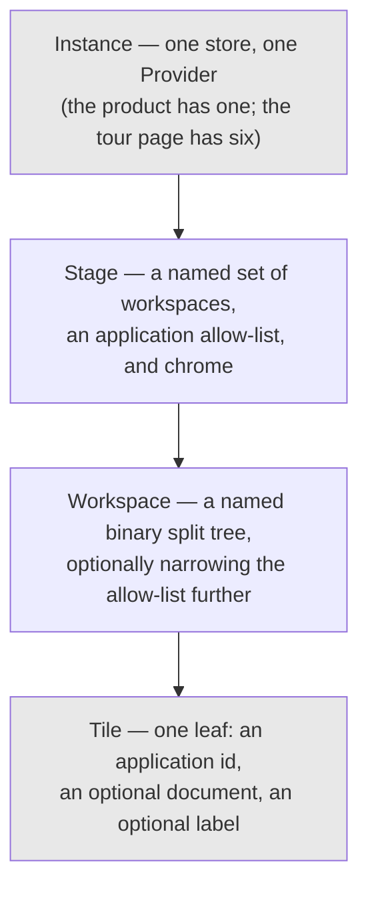
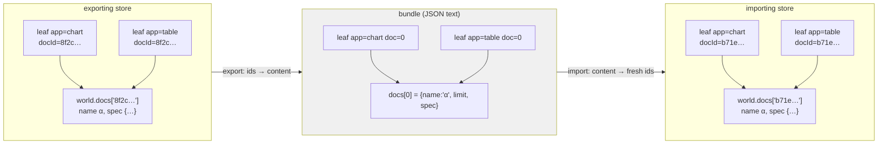
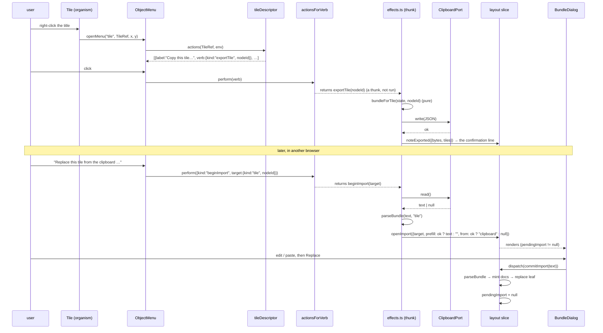

# Stages, bundles and the clipboard

## Overview

This ticket makes the workbench's *arrangement* into a first-class, portable
object. Today a tile arrangement exists only inside one browser's
`localStorage`, under one key, in a shape nothing outside `persist.ts` can
read. After this ticket a tile, a workspace or a whole stage can be copied to
the clipboard as a small JSON document, pasted into another browser, another
account or a chat message, stored under a name and loaded back.

Along the way it introduces the layer the interface has been missing: a
**stage**, which is a named bundle of workspaces together with the set of
applications those workspaces may contain and the chrome the shell should
show. The sign-in screen becomes a stage that offers exactly two applications.
The tutorial becomes a stage. The thing you currently see when you open the
application becomes a stage called `work`, and a control in the top right
switches between them.

This guide is written for someone joining the project who has to implement all
of that. It assumes you have read the DATADROP-4 guide (the presentation
protocol and the atomic design system) and the DATADROP-7 guide (the store as
an instance boundary, and the embedded workbench). It does not assume you
remember them; §2 restates the six ideas you actually need.

It has four parts:

- **Part I** orients you: what was asked for, the concepts the request lands
  on, a map of the code as it stands today, and the one structural accident
  that makes the whole ticket smaller than it looks.
- **Part II** is the design: stages, tile identity, the portable format, the
  clipboard, the widened verb seam, templates, deletion and migration.
  Sixteen decision records, DR-58 through DR-73.
- **Part III** is what to build: the file table, the API reference, seven
  phases with acceptance criteria, and the tests.
- **Part IV** is reference material: the decision records in one place, a
  catalogue of failure modes, open questions and a glossary.

---

# Part I — Orientation

## 1. What was asked for

The request, in the order it was made, with what each item turns into.

**1. "Add a tile action for import and export to clipboard (export clips,
import asks for clipboard / pasting and prefill with clipboard if it
acceptable format)."**

A tile becomes copyable. Export writes a JSON bundle to the clipboard.
Import opens a dialog with a text area; if the clipboard already holds a
bundle of the right kind, the text area starts prefilled with it. This turns
into §7 (the format), §8 (the clipboard) and phase 5.

**2. "Add a workspace action for import / export / store / load (use
localstorage for store / load for now) as well. Allow deleting a workspace /
tile."**

The same four verbs one level up, plus a named library of stored bundles.
This turns into §10 (templates) and §11 (deletion), phases 3 and 6.

**3. "We need the concept of a 'global workspace' that is basically the full
view we currently have. Maybe there are better names — that is always
accessible with a button on the top right that is used to manage account,
stored workspace templates, etc."**

This is the stage. §5 argues the name and the model; phase 1 builds it.

**4. "Limit which tiles / panes can be shown in a certain workspace, for
example, there is a login global workspace that only has help and sign in. The
welcome global workspace has the welcome + tutorial panes available."**

An application allow-list, per stage and per workspace, composed with the one
that already exists per *instance*. §5.5 and DR-61.

**5. "Allow duplicating and renaming tiles so that we can create say, multiple
table tiles to view different data. Only certain tiles can be duplicated, some
are singletons."**

Tile identity: an optional label, a duplicate verb, and two new fields on the
application descriptor. §6 and phase 2.

### 1.1 What is deliberately not in scope

- **Server-side templates.** The request says "use localstorage for store /
  load for now", and the word *now* is doing real work: the bundle format in
  §7 is designed so that a server-backed library is a different storage
  driver behind the same envelope, not a different format. Nothing in phases
  1–7 makes that harder.
- **Sharing by URL.** `model/permalink.ts` already encodes a single `ChartSpec`
  into the location fragment. A workspace bundle is an order of magnitude
  larger and would produce a link no chat client leaves intact. §7.6 explains
  why the clipboard is the right transport and what would have to change for
  a link to be one.
- **Collaborative or live-synced workspaces.** Out of scope entirely.

## 2. The six ideas you need first

You do not need the whole system in your head. You need these six.

### 2.1 The store is the instance boundary

`makeStore()` is a factory and the module exports no constructed store
(`ui/src/store/index.ts`, DATADROP-7 DR-46). A page may hold six workbenches;
each has its own store, and everything instance-scoped is either in that store
or in React context beneath its `Provider`. Nothing instance-scoped may live
in a module-level variable.

This constrains every feature in this ticket. The clipboard is a browser
global and therefore *shared* by all six instances — which is fine, because it
is a user-driven transfer and the user only has one of them. But the template
library is `localStorage`, which is also shared, and that is *not* automatically
fine; §10.3 says what the embedded instances do about it.

### 2.2 The world and the layout are separate slices

`world` holds what the user decided about *data*: documents, snapshots, pins,
the watchlist, the trace. `layout` holds what the user decided about *screen*:
workspaces and their split trees. RTK Query holds what the server said.

The division is why two tiles pointed at one document stay in lockstep — they
read one object rather than two copies — and it is the reason an exported tile
cannot be just its leaf node. A leaf carries `{app, docId}`; the document that
`docId` names lives in the other slice, and the receiving store has never
heard of it. §7.2 is the whole of the consequence.

### 2.3 A workspace is a binary split tree of leaves

```
Workspace { id, name, tree: Node, pinned? }

Node = { id, type: "leaf",  app: AppId, docId: DocId | null }
     | { id, type: "split", dir: "row" | "col", a: Node, b: Node, ratio: number }
```

The operations are pure functions over that tree — `updateNode`, `removeLeaf`,
`findLeaf`, `countLeaves`, `cloneTree` — in `ui/src/store/layout.ts:70-106`,
with no React anywhere near them. `cloneTree` already exists and already mints
fresh ids for every node, which is most of "duplicate a tile" done.

### 2.4 The application registry maps an id to a component

`ui/src/appkit/registry.ts`. Twenty-five applications register themselves by
side effect at import time (`ui/src/apps/all.ts`). A tile names one by id and
carries nothing else, which is why swapping two tiles is a two-field exchange.

An `AppDescriptor` today is:

```ts
interface AppDescriptor {
  id: string;
  title: string;
  tone: string;        // a token name, never a hex value
  docBound: boolean;   // shows a document bar and can be re-pointed
  Component: ComponentType<AppProps>;
}
```

`docBound` is true for exactly four: `chart`, `table`, `pipeline`, `encode`.
Those four are views *of one composition*. Everything else is a view of the
whole world. Hold on to that distinction — §6.2 shows it is very nearly, but
not exactly, the answer to "which tiles may be duplicated".

### 2.5 The presentation protocol: objects, menus, verbs

Anything on screen that is an object of some type is wrapped in a
`<Presentation ptype=… value=…>`. Right-clicking it opens the object menu.
The menu's contents come from a **descriptor**, one file per presentation type
in `ui/src/pbui/descriptors/`, whose `actions(value, env)` is a pure function
returning serialisable **verbs**. A verb is data:

```ts
{ kind: "addFilter", docId: "…", field: "temp_c", op: ">", value: "20" }
```

`ui/src/store/applyVerb.ts` is the only place that maps a verb onto reducers.
Descriptors know nothing about dispatch, which is what lets a test assert the
exact verb a menu entry produces with a literal environment, no store and no
DOM.

### 2.6 Persistence is opt-in and keyed

`usePersistence(key)` writes the world and the layout to `localStorage`, 500 ms
debounced, or does nothing at all when the key is `null` — which is the default
(DATADROP-7 DR-47). `save()` refuses to write a payload containing
credential-shaped keys (`persist.ts:43`, `findSecrets`). `validate()` on the way
back in rejects anything it does not recognise and falls back to defaults
rather than rendering a blank screen.

Read `persist.ts` before you write a line of §7. The import path in this ticket
is the same job — untrusted JSON in, a valid state shape or nothing out — and
it should look like a sibling of `validate()`, not like a new invention.

## 3. The system as it stands

### 3.1 What the product looks like today

```
┌──────────────────────────────────────────────────────────────────────────────┐
│ DATALAB          DATA · EXPLORE · INSPECT · UNDERSTAND                       │  masthead
├──────────────────────────────────────────────────────────────────────────────┤
│ WORKSPACES  ⌾ welcome  ⌾ account  [build] explore gallery 1·objects  …       │  strip
│             + workspace   L switches · double-click renames · R for …        │
├───────────────────────────────────┬──────────────────────────────────────────┤
│ ⠿ PIPELINE · α      [pipeline ▾]  │ ⠿ CHART · α          [chart ▾] ⬌ ⬍ ✕     │
│   1  filter temp_c > 20           │                                          │
│   2  summarize by site            │        ●     ●                           │
│   3  sort mean desc               │     ●     ●     ●                        │
│                                   │  ●                 ●                     │
├───────────────────────────────────┤                                          │
│ ⠿ ENCODING · α      [encode ▾]    ├──────────────────────────────────────────┤
│   x ↦ site      y ↦ mean_temp     │ ⠿ TABLE · α          [table ▾] ⬌ ⬍ ✕     │
│   color ↦ —     size ↦ —          │  site   mean_temp   n                    │
│   geom  ● point ○ line ○ bar      │  north      21.4    18                   │
│                                   │  south      23.9    22                   │
├───────────────────────────────────┴──────────────────────────────────────────┤
│ 4 tiles · 12 workspaces · 1 documents                                        │  mouse-doc
└──────────────────────────────────────────────────────────────────────────────┘
```

Twelve workspaces in one flat strip, two of them code-defined and marked `⌾`,
all of them offering all twenty-five applications.

### 3.2 The files this ticket touches

Paths are relative to `ui/src/`; the last four omit `components/`.

| File | Lines | What it is | What happens to it |
|---|---|---|---|
| `store/layout.ts` | 265 | Workspaces, split trees, tree operations | Gains stages, tile labels, eight reducers |
| `store/spaces.ts` | 112 | `pinnedSpaces()`, `mergePinned()` | Becomes `stages.ts`: the pinned *stages* |
| `store/persist.ts` | 172 | `localStorage`, validation, the secret guard | Version 1 → 2 with a migration; `save` enumerates layout fields |
| `store/applyVerb.ts` | 183 | The verb → reducer seam | Takes whole state; may return thunks |
| `store/index.ts` | 134 | `makeStore` | `clipboard` joins `fixtures` on the extra argument |
| `appkit/registry.ts` | 62 | `AppDescriptor`, the registry | Gains `duplicable` and `singleton` |
| `appkit/AppScope.tsx` | 46 | The per-instance allow-list | Composes three scopes instead of holding one |
| `pbui/types.ts` | 141 | Presentation types and values | `stage` joins `tile` and `workspace` |
| `pbui/verbs.ts` | 124 | The verb union | Fourteen new verbs |
| `pbui/registry.ts` | 101 | Type → descriptor | Three new entries |
| `organisms/Tile` | 189 | The tile chrome | Label, rename, presentation on the whole tile |
| `organisms/WorkspaceStrip` | 85 | The workspace strip | Scoped to the current stage; its right-click hint becomes true |
| `pages/WorkbenchShell` | 155 | The shell | A stage bar in the masthead; chrome from the stage |
| `pages/WorkbenchInstance` | 175 | The embeddable instance | Passes an instance scope into the composition |

New files are listed in §13.

## 4. The keyhole: two presentation types with no descriptors

Here is the structural accident that makes this ticket much smaller than the
feature list suggests.

`ui/src/pbui/types.ts:13-29` declares sixteen presentation types. Two of them
are `tile` and `workspace`. `PresentationValues` at `:117-118` gives both the
value type `string` — a node id and a workspace id. `Tile.tsx:98-102` wraps the
tile's title in `<Presentation ptype="tile" value={node.id}>`.
`WorkspaceStrip.tsx:46-51` wraps each workspace chip in
`<Presentation ptype="workspace" value={space.id}>`.

And `ui/src/pbui/registry.ts:47-59` — the map from presentation type to
descriptor — has eleven entries. Neither `tile` nor `workspace` is among them.

So right-clicking a tile title today produces this
(`ObjectMenu.tsx:105-109`):

```
┌─────────────────────────────────┐
│ <tile> chart · α                │
│   no verbs for this object yet  │
└─────────────────────────────────┘
```

And the workspace strip ends with a line of help text that reads, in full
(`WorkspaceStrip.tsx:78-81`):

> L switches · double-click renames · **R for duplicate / delete** · ⌾ is
> defined in code

Right-clicking a workspace produces the same empty menu. That sentence has
been describing a feature that does not exist since DATADROP-4.

**Every action this ticket adds is a verb of one of those three types.**
Duplicate, rename, close, export, import, store, load, delete — for a tile,
for a workspace, for a stage. The interface for all of them already exists,
is already wired, and is already the mechanism the rest of the application
uses for exactly this purpose. What is missing is three files in
`pbui/descriptors/`, three entries in a map, and the verbs those descriptors
return.

That has a design consequence worth stating early, because it is the single
biggest thing this guide asks you to *not* do:

> **Do not add buttons to the tile title bar.** It already holds a drag grip,
> a title, an application picker and three buttons. Duplicate, rename, export
> and import would make seven controls on a bar that is 22 pixels tall in a
> tile that may be 200 pixels wide. They are verbs of the tile; the tile is
> already a presentation; the object menu is where verbs go.

---

# Part II — The design

## 5. Stages: the layer above workspaces

### 5.1 The name

The request called it a "global workspace" and immediately added "maybe there
are better names". There are, because "global workspace" is a compound of two
words the codebase already uses for other things: `workspace` is the tile
arrangement, and `global` is the flag on `signOut` that means "every session,
everywhere".

**DR-58. The layer above workspaces is called a `stage`.**

The candidates, and why each was rejected or chosen:

| Name | Verdict |
|---|---|
| `shell` | Rejected. `WorkbenchShell` is an existing component and means something else — the chrome around the canvas. Two meanings of `shell` in one file is a reliable source of misreading. |
| `mode` | Rejected. Says the application is in a state without saying what varies. Every boolean flag is a mode. |
| `scope` | Rejected. `AppScope` exists and is one *component* of a stage, not a synonym for it. |
| `environment` | Rejected. `PbuiEnvironment` exists and is the thing descriptors resolve against. |
| `profile` | Rejected. `ProfileApp` exists and shows the signed-in user. |
| `desk` | Considered. Free of collisions and reads naturally in a sentence. Rejected because `desk` and `workspace` are near-synonyms in ordinary use, so the containment relation has to be memorised rather than read. |
| `stage` | **Chosen.** No identifier in `ui/src/` uses it (six occurrences, all prose about upload stages). One syllable. It reads correctly in every sentence the interface needs: "the sign-in stage", "switch stage", "this stage offers two applications". And it is not a near-synonym of `workspace`, so `stage → workspace → tile` is legible the first time. |

The hierarchy, once and for all:



### 5.2 The model

```ts
// ui/src/store/layout.ts

export type StageId = string;

export interface Stage {
  id: StageId;
  name: string;
  /**
   * Which applications this stage offers, or null for every registered one.
   *
   * A *rendering* constraint, applied by the tile picker and the launcher —
   * never a mounting constraint. See DR-61.
   */
  apps: readonly AppId[] | null;
  /** Which parts of the shell chrome this stage shows. */
  chrome: StageChrome;
  /**
   * The workspace this stage was last on.
   *
   * On the stage rather than on the layout, so switching away and back
   * returns you where you were (DR-60).
   */
  currentSpaceId: string;
  /** Defined in code: re-created on every load, cannot be deleted (DR-59). */
  pinned?: boolean;
}

export interface StageChrome {
  /** The DATALAB wordmark. */
  masthead: boolean;
  /** The workspace strip. False for a stage that has exactly one workspace. */
  workspaces: boolean;
  /** The stage switcher in the top right. Almost always true. */
  stageBar: boolean;
}

export interface LayoutState {
  stages: Stage[];
  currentStageId: StageId;
  /** Every workspace across every stage, flat, each naming its owner. */
  spaces: Workspace[];
  currentSpaceId: string;   // mirrors the current stage's; see below
}

export interface Workspace {
  id: string;
  name: string;
  tree: Node;
  /** The stage this workspace belongs to. */
  stageId: StageId;
  /** Narrows the stage's allow-list further, or null to inherit it. */
  apps?: readonly AppId[] | null;
  pinned?: boolean;
}
```

Two things about that shape are deliberate and easy to get wrong.

**`spaces` stays a flat array rather than becoming `Stage.spaces`.** Nesting
looks tidier and is worse. `persist.validate` walks the workspace array;
`removeSpace`, `renameSpace`, `cloneSpace` and `setCurrentSpace` all index into
it; and every one of those would grow a stage lookup for no gain. A flat array
with a foreign key is also what makes "move this workspace to another stage" a
one-field write rather than a splice from one array into another.

**`currentSpaceId` appears in two places, and one of them is a cache.**
`LayoutState.currentSpaceId` is the value every existing selector reads —
twenty-three references across `src/`, seven of them read-sites outside the
slice, in the shell, the tile, the workspace strip, the landing page and two
lesson predicates. `Stage.currentSpaceId` is the durable per-stage
memory. `setCurrentStage` writes the stage's value into the layout's;
`setCurrentSpace` writes the layout's value into the stage's. Keeping both in
one reducer file, adjacent, with a comment saying they are two views of one
fact, is cheaper than rewriting all of them — and a test asserts they
never diverge.

### 5.3 Stages replace pinned workspaces

**DR-59. The two hardwired workspaces become hardwired stages.**

`ui/src/store/spaces.ts` today defines two workspaces with fixed ids —
`ws-welcome` (sign-in beside about) and `ws-account` (profile, tokens, upload)
— that are re-created from source on every load and cannot be deleted or
renamed. They sit in the same strip as the user's own workspaces, marked with
`⌾`, and the workspace strip has to explain in a tooltip that this one is
different.

They were always stages wearing a workspace's clothes. The evidence is that
`Workbench.tsx` has to *force* the current workspace to `ws-welcome` when the
visitor is signed out, and to `ws-account` after a first sign-in — an
application forcing a *layout* value, twice, because there was no layer at
which "which part of the product am I in" could be expressed.

After this ticket:

```ts
// ui/src/store/stages.ts   (was spaces.ts)

export const SIGNIN_STAGE_ID  = "stage-signin";
export const WELCOME_STAGE_ID = "stage-welcome";
export const ACCOUNT_STAGE_ID = "stage-account";
export const WORK_STAGE_ID    = "stage-work";

export function pinnedStages(): { stages: Stage[]; spaces: Workspace[] } {
  return {
    stages: [
      {
        id: SIGNIN_STAGE_ID,
        name: "sign in",
        // The request, exactly: "a login global workspace that only has
        // help and sign in".
        apps: ["signin", "about"],
        chrome: { masthead: true, workspaces: false, stageBar: false },
        currentSpaceId: SIGNIN_SPACE_ID,
        pinned: true,
      },
      {
        id: WELCOME_STAGE_ID,
        name: "welcome",
        // "the welcome global workspace has the welcome + tutorial panes"
        apps: ["about", "tut1", "tut2", "tut3", "tut4", "lessons", "cheat",
               "modules", "brief", "sources", "chart", "table", "pipeline",
               "encode"],
        chrome: { masthead: true, workspaces: true, stageBar: true },
        currentSpaceId: WELCOME_SPACE_ID,
        pinned: true,
      },
      {
        id: ACCOUNT_STAGE_ID,
        name: "account",
        apps: ["profile", "tokens", "upload", "templates", "about"],
        chrome: { masthead: true, workspaces: true, stageBar: true },
        currentSpaceId: ACCOUNT_SPACE_ID,
        pinned: true,
      },
      {
        id: WORK_STAGE_ID,
        name: "work",
        // Everything. This is the full view we have today (request item 3).
        apps: null,
        chrome: { masthead: true, workspaces: true, stageBar: true },
        currentSpaceId: BUILD_SPACE_ID,
        pinned: true,
      },
    ],
    spaces: [ /* one or more per stage, as today */ ],
  };
}
```

Note `stageBar: false` on the sign-in stage. A visitor who is not signed in
must not be offered a switcher to a stage whose every tile would show 401.
That is the same reasoning as the existing signed-out gate (DATADROP-5 DR-31):
one gate at the top rather than a check per tile.

Note also that the sign-in stage is *new*, and that `welcome` changes meaning.
Today `ws-welcome` is `signin | about` and is where an unauthenticated visitor
is forced. After this ticket signing in is its own stage, and `welcome` is what
the request describes: the tutorial. This is a behaviour change and it should
be called out in the changelog rather than slipped in.

**`mergePinned` becomes `mergeStages`, and keeps its asymmetry.** Code-defined
stages and their workspaces are taken wholesale from source on every load;
user-created stages and workspaces come from storage. A user who deleted a
tile from the account stage in a previous release gets it back; a user who
*added* one loses it. That is what "hardwired" means and it is the same rule
`spaces.ts:43-47` states today.

### 5.4 Where the current-space pointer lives

**DR-60. `currentSpaceId` is a property of the stage, mirrored onto the
layout.**

The failure it prevents: you are in the `work` stage on the `gallery`
workspace, you switch to `account` to mint a token, you switch back — and you
are on `build`, because there is one global pointer and `account` overwrote
it. Every workspace switch you make in a two-tile stage costs you your place
in a twelve-workspace one.

The mirror exists because seven read-sites outside the slice — plus every
reducer inside it — take `state.layout.currentSpaceId`, and rewriting them all
to `state.layout.stages.find(…)?.currentSpaceId` is a large diff for no
behavioural gain. The invariant — that the mirror always
equals the current stage's value — is enforced in exactly two reducers and
asserted by a test that walks every reducer in the slice:

```ts
// test/layout.test.ts
test("every reducer leaves the space pointer consistent", () => {
  for (const [name, reducer] of Object.entries(layoutSlice.actions)) {
    const after = /* apply a representative payload */;
    const stage = after.stages.find((s) => s.id === after.currentStageId)!;
    expect(after.currentSpaceId, `${name} desynchronised the pointer`)
      .toBe(stage.currentSpaceId);
  }
});
```

That test is worth more than the invariant it checks. A mirrored field is a
correctness hazard that grows with every new reducer, and the honest way to
carry one is to make the twelfth reducer that forgets fail loudly.

### 5.5 Effective application scope

**DR-61. The effective allow-list is the intersection of the instance's, the
stage's and the workspace's. Most restrictive wins. A tile still renders an
application outside it.**

Three levels now narrow the same set:

| Level | Set by | Why |
|---|---|---|
| Instance | `InstanceConfig.apps` — a prop on `WorkbenchInstance` | A tour section teaching the grammar should not offer the token manager (DATADROP-7 DR-53) |
| Stage | `Stage.apps` | "A login stage that only has help and sign in" |
| Workspace | `Workspace.apps` | "Limit which tiles / panes can be shown in a certain workspace" |

Composition:

```ts
// ui/src/appkit/AppScope.tsx

/** null means "no constraint at this level". */
type Scope = readonly string[] | null;

export function intersectScopes(...scopes: Scope[]): Scope {
  const present = scopes.filter((s): s is readonly string[] => s !== null);
  if (present.length === 0) return null;
  return present.reduce((a, b) => {
    const keep = new Set(b);
    return a.filter((id) => keep.has(id));
  });
}
```

Intersection rather than override, and the reason is that override has no
defensible direction. If the stage wins, an instance embedded in a tutorial
page can be handed a stage that re-offers everything, and DATADROP-7 DR-53 is
undone silently. If the instance wins, a stage cannot narrow anything, and
request item 4 is unimplementable. Intersection is the only composition where
adding a constraint can never remove one.

An empty intersection is possible — a stage offering `["signin"]` inside an
instance offering `["chart"]` — and it must not render an empty dropdown.
`useScopedApps()` returns the empty array, `Tile` falls back to its existing
rule (§5.5.1), and `LauncherApp` shows its existing empty state. A test
constructs exactly that case.

#### 5.5.1 The rule that already exists and must survive

`Tile.tsx:43-46` always includes the tile's *own* application in the picker,
even when the scope excludes it:

```ts
const options = scopedApps.some((d) => d.id === node.app)
  ? scopedApps
  : [...(app ? [app] : []), ...scopedApps];
```

The reason is in the comment above it: a `<select>` whose value matches no
option renders blank and silently reassigns on the next change, so a seeded
layout naming an out-of-scope application would lose that tile the first time
anyone touched the dropdown. With three composed scopes instead of one, the
chance of a layout naming an out-of-scope application goes up, not down. Keep
the rule and keep the comment.

### 5.6 Chrome per stage

`WorkbenchShell` already takes `masthead` and `workspaces` as props
(`WorkbenchShell.tsx:41-49`). They stop being props passed down from the
instance and start being read from the current stage, with the instance able
to force them off:

```ts
const stage = useSelector(currentStage);
const chrome = {
  masthead:  config.masthead  ?? stage.chrome.masthead,
  workspaces: config.workspaces ?? stage.chrome.workspaces,
  stageBar:  config.stageBar  ?? stage.chrome.stageBar,
};
```

`??` and not `&&`: an instance that says nothing defers to the stage, and an
instance that says `false` overrides it. An embedded tour panel says `false`
to the masthead because the page already has one; it says nothing about the
workspace strip because the stage it seeds knows better.

### 5.7 The stage bar

The control the request asked for — "always accessible with a button on the
top right" — lives at the right end of the masthead.

```
┌──────────────────────────────────────────────────────────────────────────────┐
│ DATALAB   DATA · EXPLORE · INSPECT · UNDERSTAND        ▸ work    [ ▾ ]       │
└──────────────────────────────────────────────────────────────────────────────┘
                                                                    │
                     ┌──────────────────────────────────────────────┘
                     ▾
        ┌──────────────────────────────────────────┐
        │ <stage> work                             │
        ├──────────────────────────────────────────┤
        │ ▸ work                        ⌾ current  │
        │   welcome                     ⌾          │
        │   account                     ⌾          │
        │   ─────────────────────────────────────  │
        │   my report layout                       │
        │   client demo                            │
        │   ─────────────────────────────────────  │
        │   new stage from this one …              │
        │   templates …                            │
        │   export this stage to the clipboard     │
        │   import a stage from the clipboard …    │
        └──────────────────────────────────────────┘
```

It is a `<Presentation ptype="stage" value={stageId}>` whose object menu is
the stage descriptor's `actions()`, so the same list is reachable by
right-click and the switcher is not a second mechanism. The `▾` button opens
the same menu programmatically — `pbui.openMenu("stage", id, x, y)` — which is
one line and means there is exactly one place stage verbs are defined.

`templates …` opens the account stage on its templates workspace. That is the
whole of "a button on the top right that is used to manage account, stored
workspace templates": the button is the stage menu, and account management is
a stage.

## 6. Tiles that can be renamed, duplicated and deleted

### 6.1 A tile may carry a label

**DR-62. A leaf gains an optional `label`. The title stays derived when it is
absent.**

```ts
type Node =
  | { id: NodeId; type: "leaf"; app: AppId; docId: DocId | null; label?: string }
  | { id: NodeId; type: "split"; … };
```

Today the title is computed (`Tile.tsx:48-49`):

```ts
const title = app ? app.title : node.app;
const label = docName ? `${title} · ${docName}` : title;
```

That is right and should stay right for every tile nobody has renamed. Four
`TABLE · α` tiles are unhelpful, but four tiles called `TABLE · α`,
`TABLE · β`, `TABLE · γ`, `TABLE · δ` are not — the derived title is already
doing the disambiguation the request is worried about, as long as the tiles
are on different documents.

The rename exists for the case the derivation cannot reach: two tables on the
*same* document showing different pipeline stages, or a tile whose meaning is
"the one I keep the raw feed in". So:

```ts
const label = node.label ?? (docName ? `${title} · ${docName}` : title);
```

`node.label ?? …` and not `node.label || …`. An empty string is how the rename
control reports "the user cleared the field and pressed Enter", and that must
mean *go back to the derived title*, not *render an empty title bar*. The
reducer normalises `""` to `undefined` so there is one representation of
"no label" in state:

```ts
renameLeaf(state, action: PayloadAction<{ nodeId: NodeId; label: string }>) {
  const label = action.payload.label.trim();
  mutateTree(state, (tree) => updateNode(tree, action.payload.nodeId,
    (n) => n.type === "leaf" ? { ...n, label: label || undefined } : n));
}
```

The rename control itself is `InlineRename`
(`ui/src/components/molecules/InlineRename/`), which already exists, is
already used by the workspace strip, and already handles the uncontrolled
read-on-Enter / Escape-means-never-happened semantics. Double-clicking the
tile title enters rename, mirroring the workspace strip exactly. Two
interactions that look the same should be the same component.

### 6.2 Duplicable and singleton are two fields

**DR-63. `AppDescriptor` gains `duplicable` and `singleton`. They are separate
booleans, not one enum, because they answer different questions.**

The request says "only certain tiles can be duplicated, some are singletons",
which sounds like one property with two values. It is not, and the counter-
example is the application you meet first.

- `launcher` is the empty tile. Every split creates one
  (`layout.ts:145-151`). So a workspace may hold many launchers — it is not a
  singleton. But *duplicating* an empty tile produces a second empty tile,
  which is what the split button already does, so it should not offer a
  duplicate verb.
- `trace` shows `world.trace`. A second trace tile renders identical pixels
  forever. It should not be duplicable, and it should be a singleton.
- `chart` is a view of one document. A second chart tile on a second document
  is the entire point. Duplicable, not a singleton.

Two questions, two answers:

| Field | Question | Consumed by |
|---|---|---|
| `duplicable` | Does the object menu offer **duplicate**? | `tileDescriptor.actions()` |
| `singleton` | May a workspace hold at most one? | the application picker, the launcher |

And the assignment across the twenty-five:

| Applications | `duplicable` | `singleton` | Why |
|---|---|---|---|
| `chart`, `table`, `pipeline`, `encode` | true | false | Views of one document; `docBound` is true for exactly these four |
| `launcher` | false | false | Duplicating empty produces empty; splits create them freely |
| `sources`, `charts`, `gallery`, `compare`, `inspector`, `watch`, `trace`, `about` | false | true | Pure functions of the world: a second copy is the same rectangle |
| `signin`, `profile`, `tokens`, `upload`, `templates` | false | true | Account surfaces; two sign-in forms is a defect, not a feature |
| `lessons`, `cheat`, `brief`, `modules`, `tut1`–`tut4` | false | true | Read `TourContent`, which is one context per instance |

Look at the first and third rows: `duplicable === docBound` and
`singleton === !docBound`, with `launcher` the single exception in each
column. That is not a coincidence — it is the same distinction §2.4 named — and
it is close enough to a derivation that a hand-kept list will drift from it.

So make it a required field with a guard rather than an optional field with a
default:

```ts
// test/apps.test.ts
const EXCEPTIONS: Record<string, string> = {
  launcher:
    "the empty tile: splits create them freely, so it is not a singleton, " +
    "but duplicating an empty tile is what the split button already does",
};

test("duplicable and singleton follow docBound unless a reason is written down", () => {
  for (const app of allApps()) {
    if (EXCEPTIONS[app.id]) continue;
    expect(app.duplicable, `${app.id}.duplicable`).toBe(app.docBound);
    expect(app.singleton,  `${app.id}.singleton`).toBe(!app.docBound);
  }
});
```

A new application that disagrees with the rule fails the test, and the fix is
either to change the descriptor or to write a sentence in `EXCEPTIONS`. An
escape hatch that costs a sentence is one people use honestly — the same
pattern `test/no-raw-controls.test.ts:41-44` already uses for raw elements.

### 6.3 A singleton is disabled with a reason, never hidden

The workspace already holds a `trace` tile. You open another tile's
application picker. What do you see?

Not a list with `trace` missing. `verbs.ts:74-81` states the project's position
on this and it applies unchanged:

> Hiding an unavailable verb hides the rule that makes it unavailable: a user
> who never sees "Map to y" on a nominal column never learns that y requires a
> quantitative one.

A user who never sees `trace` in the picker does not learn that it is a
singleton; they conclude the application is missing, or that they imagined it.
So the option is shown, disabled, with the reason:

```
[ application  ▾ ]
┌────────────────────────────────────────────────────┐
│   new tile                                         │
│   sources                                          │
│   chart                                            │
│   table                                            │
│   pipeline                                         │
│   encoding                                         │
│   trace          — already open in this workspace  │  (greyed)
│   watchlist      — already open in this workspace  │  (greyed)
│   tokens         — not offered by the work stage   │  (greyed)
└────────────────────────────────────────────────────┘
```

This requires `SelectInput` to support disabled options, which it does not
today. `SelectOption` gains two optional fields:

```ts
export interface SelectOption {
  value: string;
  label: string;
  /** Rendered greyed and unselectable. */
  disabled?: boolean;
  /** Appended to the label, and used as the title attribute. */
  reason?: string;
}
```

A native `<option disabled>` is unselectable by mouse and by keyboard in every
browser, and screen readers announce it as unavailable. No custom listbox is
needed, and building one here would be a large regression in accessibility for
a cosmetic gain.

Note the third greyed row: out-of-scope applications are shown with a
different reason. That is a change from DATADROP-7, where the scope *filtered*
the list. It is the same argument, and the earlier decision should be
revisited under it — but there is an exception, and it matters: a tour section
teaching four applications should show four, because the list is the lesson's
vocabulary and a greyed list of twenty-five is noise. So:

- **Stage and workspace scope**: shown disabled, with a reason.
- **Instance scope**: filtered out entirely, as today.

The distinction is defensible in one sentence, which is the test of whether a
distinction should exist: *a stage is somewhere you are, and can leave; an
instance is what this page is, and you cannot.*

### 6.4 Duplicating a tile

Duplicate splits the tile in the direction that leaves the two halves closest
to square, and points the new leaf at the same application, the same document
and the same label with `" (copy)"` appended if it had one.

```ts
duplicateLeaf(state, action: PayloadAction<{ nodeId: NodeId; dir?: "row" | "col" }>) {
  mutateTree(state, (tree) =>
    updateNode(tree, action.payload.nodeId, (node) => {
      if (node.type !== "leaf") return node;
      const copy: Node = { ...node, id: newId(),
        label: node.label ? `${node.label} (copy)` : undefined };
      return split(action.payload.dir ?? "row", node, copy);
    }));
}
```

The same document, not a copy of it. Two tiles on one document is the lockstep
property from §2.2 and is very often what "let me see this two ways" means.
A user who wants a *second* document duplicates the document — `duplicateDoc`
already exists as a verb (`verbs.ts:48`) and appears in the document
descriptor's menu.

`dir` defaults to `"row"` and the caller may override. The tile knows its own
rendered aspect ratio and the reducer does not, so if you want the
closest-to-square behaviour, measure in `Tile` and pass it. Do not put a
`getBoundingClientRect` in a reducer.

### 6.5 The tile object menu, assembled

```
 ⠿ TABLE · α                                    [ table ▾ ]  ⬌  ⬍  ✕
   ▲
   └─ right-click here
      ┌───────────────────────────────────────────────────────┐
      │ <tile> TABLE · α                                      │
      ├───────────────────────────────────────────────────────┤
      │ Rename this tile …                                    │
      │ Duplicate                                             │
      │ Split right                                           │
      │ Split below                                           │
      │ ─────────────────────────────────────────────────     │
      │ Copy this tile to the clipboard                       │
      │ Replace this tile from the clipboard …                │
      │ Save as a template …                                  │
      │ ─────────────────────────────────────────────────     │
      │ Close                                                 │
      └───────────────────────────────────────────────────────┘
```

And on a tile that cannot be duplicated, with one tile left in the workspace:

```
      ┌───────────────────────────────────────────────────────────────────┐
      │ <tile> TRACE                                                      │
      ├───────────────────────────────────────────────────────────────────┤
      │ Rename this tile …                                                │
      │ Duplicate            — the trace is the same in every tile        │  (greyed)
      │ Split right                                                       │
      │ Split below                                                       │
      │ ───────────────────────────────────────────────────────────────   │
      │ Copy this tile to the clipboard                                   │
      │ Replace this tile from the clipboard …                            │
      │ Save as a template …                                              │
      │ ───────────────────────────────────────────────────────────────   │
      │ Close                — the last tile in a workspace cannot close  │  (greyed)
      └───────────────────────────────────────────────────────────────────┘
```

`disabledBecause` is already a field on `Action` (`verbs.ts:71-82`) and the
object menu already renders it greyed with the reason beside it
(`ObjectMenu.tsx:87-103`). Nothing new is needed to produce either of those
screens except the descriptor.

---

## 7. The portable format

### 7.1 One envelope, three kinds

```ts
// ui/src/model/portable.ts   — pure, no React, no store, no browser API

export const BUNDLE_VERSION = 1;

export type BundleKind = "tile" | "workspace" | "stage";

export interface Bundle<K extends BundleKind = BundleKind> {
  /** A magic string, so a stray JSON blob is rejected before anything else. */
  format: "datadrop.layout";
  version: number;
  kind: K;
  /** ISO 8601. Informational — shown in the template library, never trusted. */
  exportedAt: string;
  /** Free text the exporter typed, or the object's own name. */
  name: string;
  payload: PayloadFor<K>;
}

export type PayloadFor<K> =
  K extends "tile"      ? TilePayload      :
  K extends "workspace" ? WorkspacePayload :
  K extends "stage"     ? StagePayload     : never;
```

`format` before `version` is not decoration. Users will paste the wrong thing —
a chart permalink, a CSV row, a log line, half a bundle truncated by a chat
client. A magic string means the failure message can be *"that is not a
DATALAB layout"* rather than *"unexpected token < in JSON at position 0"*, and
the difference between those two sentences is whether the user knows what to
do next.

`version` is a number, checked for exact equality on the way in. Version 2 will
exist; a version-2 bundle pasted into a version-1 build must be refused with
"this was exported by a newer version" rather than partially understood.

### 7.2 Ids do not travel

**DR-64. A bundle carries documents by content, and leaves reference them by
array index. No id from the exporting store appears in a bundle.**

This is the most important decision in the format and the one that is easiest
to get wrong, because the obvious implementation — `JSON.stringify(node)` —
compiles, runs, produces a plausible-looking bundle, and is broken.

A leaf is `{ id, type: "leaf", app: "chart", docId: "8f2c…" }`. Three of those
four fields are meaningless in another store:

- `id` is a node id, unique to the exporting tree. Importing it produces two
  nodes with one id if you happen to import into the tree you exported from —
  which is exactly what "duplicate by copy-paste" does — and a duplicate React
  key is a hit-test returning the wrong tile.
- `docId` names a document in the exporting store's `world` slice. The
  receiving store has never seen it. The tile renders "no document".
- `type` is structural and does travel.

So the portable node is a different type from the state node:

```ts
export type PortableNode =
  | { leaf: { app: string; label?: string; doc?: number } }
  | { split: { dir: "row" | "col"; ratio: number; a: PortableNode; b: PortableNode } };

export interface PortableDoc {
  name: string;
  limit: number;
  spec: ChartSpec;      // source, steps, geom, mapping, yScale, typeOverrides
}
```

`doc` is an **index into the bundle's `docs` array**, not an id and not an
inline object. Inlining the document at each leaf would be simpler to write and
would silently destroy the property §2.2 exists to provide: a workspace with a
chart and a table on document α, exported and re-imported, would come back as
two tiles on two independent copies of α, and changing a filter in the pipeline
would stop moving the chart. The user would describe this as "import is
broken" and would be right.

An index preserves sharing exactly. Two leaves with `doc: 0` import to two
leaves pointing at one minted document.



The exporter walks the tree collecting documents into an array and replacing
`docId` with the array index; the importer walks the bundle minting one
document per entry and replacing the index with the new id. Both are about
twenty lines and both are pure functions over plain data, so both are tested
with literals and no store.

### 7.3 The three payloads

```ts
export interface TilePayload {
  app: string;
  label?: string;
  /** Present only for a document-bound application. */
  doc?: PortableDoc;
}

export interface WorkspacePayload {
  name: string;
  tree: PortableNode;
  docs: PortableDoc[];
  /** The workspace's own allow-list, if it had one. */
  apps?: readonly string[] | null;
}

export interface StagePayload {
  name: string;
  apps: readonly string[] | null;
  chrome: StageChrome;
  spaces: WorkspacePayload[];
  /**
   * Documents are hoisted to the stage, because two workspaces in one stage
   * may share a document and the same index argument applies one level up.
   * A workspace payload nested here has an empty `docs` and its leaves index
   * into this array.
   */
  docs: PortableDoc[];
}
```

The tile payload inlines its single document rather than using an array,
because a tile has at most one and an array of length one with an index of
zero is ceremony. This is the one place the format is not uniform, and it is
worth the inconsistency: the tile bundle is the one users will read.

### 7.4 A worked example

The `explore` workspace — a source browser on the left, a chart above an
inspector on the right — exported:

```json
{
  "format": "datadrop.layout",
  "version": 1,
  "kind": "workspace",
  "exportedAt": "2026-07-26T18:04:11.512Z",
  "name": "explore",
  "payload": {
    "name": "explore",
    "apps": null,
    "docs": [
      {
        "name": "α",
        "limit": 2000,
        "spec": {
          "source": { "kind": "stream", "drop": "sensors", "stream": "readings" },
          "steps": [
            { "id": "s1", "kind": "filter", "enabled": true,
              "field": "data.temp_c", "op": ">", "value": "20" }
          ],
          "geom": "point",
          "mapping": { "x": "ts", "y": "data.temp_c",
                       "color": "data.site", "size": null, "facet": null },
          "yScale": "linear"
        }
      }
    ],
    "tree": {
      "split": {
        "dir": "row", "ratio": 0.34,
        "a": { "leaf": { "app": "sources" } },
        "b": { "split": {
          "dir": "col", "ratio": 0.6,
          "a": { "leaf": { "app": "chart", "doc": 0 } },
          "b": { "leaf": { "app": "inspector" } }
        } }
      }
    }
  }
}
```

Four things to notice, because each is a decision:

1. **`sources` and `inspector` have no `doc`.** They are not `docBound`; a
   `doc` field on them would be ignored on import and is therefore not written.
2. **`steps[].id` survives.** A step id is scoped to the spec it lives in and
   never leaves it, so it is not an id that travels *between* stores in the
   sense DR-64 forbids. Re-minting them would work equally well; keeping them
   makes the bundle diffable against a snapshot.
3. **`ratio` survives.** The reader's arrangement is part of what they are
   sharing. `validate` clamps it to `[0.05, 0.95]`, as `persist.ts:69-71`
   already does.
4. **`source` survives verbatim, and it is a reference, not data.** The bundle
   says "the readings stream of the sensors drop". It does not contain a single
   row. §7.6 is about what that means.

### 7.5 Validation is the same job as `persist.validate`

**DR-65. Every bundle is validated by a function that is a sibling of
`persist.validate`, and returns `Bundle | null` — never throws, never
partially applies.**

Read `ui/src/store/persist.ts:88-113` first. It is 25 lines, it validates a
whole `LayoutState`, and it does the four things this needs:

- rejects a wrong version outright;
- checks structure narrowly (`isNode`, `isWorkspace`) rather than trusting
  `as`;
- repairs what is repairable (a `currentSpaceId` naming a missing space
  becomes the first space) rather than failing;
- returns `null` on anything else, and the caller falls back to defaults.

`parseBundle` is the same shape. What it adds, because a clipboard is a more
hostile input than your own `localStorage`:

```ts
/** Caps. A bundle that exceeds any of these is refused, not truncated. */
export const LIMITS = {
  bytes: 512 * 1024,   // a 512 kB layout is not a layout
  leaves: 64,          // 64 tiles is more than any screen can show
  docs: 64,
  depth: 24,           // split-tree depth; guards the recursive walkers
  spaces: 32,          // per stage
} as const;

export function parseBundle(text: string, expect?: BundleKind): ParseResult;

export type ParseResult =
  | { ok: true;  bundle: Bundle }
  | { ok: false; reason: string };   // shown to the user verbatim
```

`ParseResult` rather than `Bundle | null`, and this is the one place the two
functions differ in shape. `persist.validate` returns `null` because its caller
falls back to defaults and writes a console warning nobody reads. `parseBundle`
returns a reason because its caller is a dialog with a human in front of it,
and "that bundle names 91 tiles; the limit is 64" is a sentence that ends the
interaction. A `null` there produces "import failed", which does not.

The reasons, all of them, because they are the specification:

| Reason | Cause |
|---|---|
| `that is not a DATALAB layout` | Not JSON, or `format !== "datadrop.layout"` |
| `that was exported by a newer version of DATALAB` | `version > BUNDLE_VERSION` |
| `that was exported by an older version and cannot be read` | `version < BUNDLE_VERSION` |
| `that is a workspace; this tile can only take a tile` | `expect` given and `kind` differs |
| `that bundle is damaged` | Structure fails `isPortableNode` / `isPortableDoc` |
| `that bundle names N tiles; the limit is 64` | Over `LIMITS.leaves` |
| `that bundle is N kB; the limit is 512 kB` | Over `LIMITS.bytes` |
| `that bundle names applications this build does not have: x, y` | Unknown app ids (see below) |
| `that bundle contains something credential-shaped and was refused` | `findSecrets` found a key |

The unknown-application case deserves a decision of its own, because there are
three defensible answers and only one of them is right. A bundle exported from
a build that has an application yours does not — a colleague on `main`, you on
a release branch — could be **refused**, **imported with those tiles dropped**,
or **imported with those tiles left naming the missing application**.

Take the third. `Tile.tsx:149-155` already renders exactly that case:

> no application called "chartsy" — choose one above

That is a working, tested, deliberate empty state, and it preserves the shape
of what was shared: the reader sees a four-tile layout with one tile they
cannot fill, which is true, rather than a three-tile layout, which is a lie
about what their colleague sent. Refusing outright makes the common case — a
version skew of one application — unrecoverable. So: **warn in the dialog, name
the applications, import anyway.** The reason string above becomes a warning
rather than a refusal, and it is the only entry in the table that does not
abort.

### 7.6 What a bundle must never contain, and what it necessarily does

**Never: a credential.** `findSecrets` (`persist.ts:46-57`) walks a value and
reports any key matching
`/^(token|authorization|auth|bearer|secret|password|apikey|api_key)$/i`. It
already guards `save()`. It must guard *both* directions here — the exporter
refuses to produce a bundle that trips it, and the importer refuses to accept
one. The export side is the load-bearing one: a bundle is *designed to be
shared*, which makes it a far more dangerous carrier than `localStorage` ever
was.

There is no path today by which a token could reach a `ChartSpec`, and that is
not an accident either: `TokenRef` has no secret field, and `pbui/types.ts:79-85`
says the absence is load-bearing. `findSecrets` is the second net under that
one, not a substitute for it.

**Necessarily: a `SourceRef`.** A bundle names drops, streams and datasets —
`{ kind: "stream", drop: "sensors", stream: "readings" }`. That is not data,
but it is not nothing: an internal drop name may itself be sensitive, and a
filter value may be worse. `steps[].value` is free text the user typed, and the
DATADROP-3 permalink work already reasoned about exactly this
(`model/permalink.ts:1-7`):

> The fragment, not a query parameter, for one specific reason: fragments are
> never sent to the server, so a shared link cannot deposit a filter value —
> which may be a patient identifier or an internal hostname — into an access
> log.

The clipboard has the same property and a better one: nothing transmits it
anywhere unless the user pastes it somewhere. That is the argument for the
clipboard over a URL, and it is why §1.1 puts URL sharing out of scope rather
than pending.

The dialog states it plainly, once, on export:

```
┌────────────────────────────────────────────────────────────────┐
│ Copied to the clipboard                                        │
│                                                                │
│ 1 workspace · 3 tiles · 1 document · 2.1 kB                    │
│                                                                │
│ It names the sources these tiles read and the filters you set  │
│ on them. It contains no rows and no credentials.               │
└────────────────────────────────────────────────────────────────┘
```

**Importing a bundle grants no access.** A workspace naming a drop the
importer cannot read imports fine and shows a 403 in that tile. That is
correct: authorisation is the server's job, the bundle is a set of references,
and a client that pre-filtered them would be enforcing a policy it does not
know.

## 8. The clipboard

### 8.1 What the platform actually guarantees

Write and read are not symmetric, and a design that assumes they are will work
on your machine and fail for most users.

| | `navigator.clipboard.writeText` | `navigator.clipboard.readText` |
|---|---|---|
| Secure context required | yes | yes |
| Chromium | works from a user gesture | prompts for the `clipboard-read` permission |
| Firefox | works from a user gesture | **not implemented for web content** |
| Safari | works from a user gesture | requires a gesture and shows a paste confirmation |
| Available in `bun test` | no | no |

The Firefox row is the one that decides the design. There is no permission to
request and no flag to pass; a page cannot read the clipboard. An import flow
built on `readText` is an import flow that does not exist for a large share of
users, and — worse — the failure is a rejected promise inside a click handler,
so the button appears to do nothing.

The application already writes to the clipboard in one place, for the one-time
token secret (`ui/src/apps/TokensApp/TokensApp.tsx:89`):

```ts
onCopy={(secret) => void navigator.clipboard?.writeText(secret)}
```

Note `?.` and `void`. Both are correct and both are the minimum. This ticket
needs more than the minimum, because it needs to *report* failure.

### 8.2 The clipboard rides the thunk extra argument

**DR-66. The clipboard is injected on the store's thunk extra argument, beside
`fixtures`.**

`makeStore` already does this for the fixture map (`store/index.ts:115-118`,
DATADROP-7 DR-48):

```ts
middleware: (getDefault) =>
  getDefault({ thunk: { extraArgument: { fixtures } } }).concat(api.middleware),
```

The docstring on `MakeStoreOptions.fixtures` explains why that channel was
chosen: it is the only per-store channel a base query can read, so its scope is
exactly one store's scope and no call site above it knows it exists. The same
three properties are what the clipboard needs.

```ts
export interface ClipboardPort {
  write(text: string): Promise<void>;
  /** Rejects, or resolves null, when the platform will not allow a read. */
  read(): Promise<string | null>;
}

export const browserClipboard: ClipboardPort = {
  async write(text) {
    if (!navigator.clipboard?.writeText) throw new Error("no clipboard");
    await navigator.clipboard.writeText(text);
  },
  async read() {
    // Everything here is allowed to fail, and failing is not an error.
    try {
      if (!navigator.clipboard?.readText) return null;
      return await navigator.clipboard.readText();
    } catch {
      return null;
    }
  },
};
```

Two consequences, both worth the change:

- **Export is testable with no DOM.** A test builds a store with a fake
  clipboard that records what it was given, dispatches the export thunk, and
  asserts on the JSON. `bun test` never touches a browser API. This is the same
  property that made the fixture base query testable, and it is the reason the
  extra argument is the right channel rather than a module-level import.
- **A future non-browser host works.** The `ClipboardPort` interface is three
  lines and makes "export to a file" or "export to a server" a different
  implementation rather than a different call site.

`read` resolves `null` rather than throwing on refusal, because refusal is the
expected case on Firefox and an exception is the wrong shape for an expected
case. `write` throws, because a failed write is genuinely exceptional and the
user must be told the copy did not happen.

### 8.3 Import never depends on `read`

**DR-67. The import dialog is a text area. The clipboard prefill is an
optimisation that is allowed to fail silently.**

The flow, in order:

1. The user chooses **Replace this tile from the clipboard …**.
2. A thunk calls `clipboard.read()`.
3. If it resolves with text that `parseBundle(text, "tile")` accepts, the
   dialog opens with the text area **prefilled** and a line saying where the
   content came from.
4. Otherwise — Firefox, a denied permission, an empty clipboard, a clipboard
   holding a CSV — the dialog opens **empty and focused**, and the user
   presses ⌘V.

Step 4 is not a degraded path bolted on afterwards; it is the path, and step 3
is the optimisation. Build step 4 first and verify it in Firefox before writing
step 3. The request asked for "prefill with clipboard if it acceptable format",
and the conditional in that sentence is the whole design.

The parse in step 3 is not merely a validity check, it is a *relevance* check.
A clipboard holding a paragraph of prose should not produce a dialog prefilled
with a paragraph of prose that the user must then select and delete. Prefill
only when the content is a bundle of the expected kind.

```
Empty (Firefox, or nothing useful on the clipboard):

┌──────────────────────────────────────────────────────────────────┐
│ Replace this tile from a bundle                                  │
├──────────────────────────────────────────────────────────────────┤
│ Paste a tile bundle below.  ⌘V / Ctrl-V                          │
│ ┌──────────────────────────────────────────────────────────────┐ │
│ │ ▏                                                            │ │
│ │                                                              │ │
│ │                                                              │ │
│ │                                                              │ │
│ └──────────────────────────────────────────────────────────────┘ │
│                                                                  │
│                                     [ Cancel ]  [ Replace tile ] │
│                                                       (disabled) │
└──────────────────────────────────────────────────────────────────┘

Prefilled (Chromium, permission granted, a tile bundle on the clipboard):

┌──────────────────────────────────────────────────────────────────┐
│ Replace this tile from a bundle                                  │
├──────────────────────────────────────────────────────────────────┤
│ ● Read from your clipboard — replace it if you meant another.    │
│ ┌──────────────────────────────────────────────────────────────┐ │
│ │ {                                                            │ │
│ │   "format": "datadrop.layout",                               │ │
│ │   "version": 1,                                              │ │
│ │   "kind": "tile",                                            │ │
│ │   "name": "readings, filtered",                        …     │ │
│ └──────────────────────────────────────────────────────────────┘ │
│ ✓ A tile: chart, on a document called α reading sensors/readings │
│                                                                  │
│                                     [ Cancel ]  [ Replace tile ] │
└──────────────────────────────────────────────────────────────────┘

Rejected (the user pasted something else):

┌──────────────────────────────────────────────────────────────────┐
│ Replace this tile from a bundle                                  │
├──────────────────────────────────────────────────────────────────┤
│ ┌──────────────────────────────────────────────────────────────┐ │
│ │ site,mean_temp,n                                             │ │
│ │ north,21.4,18                                                │ │
│ └──────────────────────────────────────────────────────────────┘ │
│ ✕ That is not a DATALAB layout.                                  │
│                                                                  │
│                                     [ Cancel ]  [ Replace tile ] │
│                                                       (disabled) │
└──────────────────────────────────────────────────────────────────┘
```

The summary line under the text area — `✓ A tile: chart, on a document called
α reading sensors/readings` — is produced by `describeBundle(bundle)`, a pure
function in `model/portable.ts`. It re-parses on every keystroke, which is
cheap at these sizes and means the confirm button is never enabled for content
that will fail. **The user should never be able to press a button that then
reports an error.** That is the same principle as `CHANNEL_ACCEPTS` filtering
the channel dropdown rather than the plot engine rejecting the selection
afterwards (`model/chart.ts:31-42`).

### 8.4 Two atoms and an organism that do not exist yet

| Component | Layer | Why it is new |
|---|---|---|
| `TextArea` | atoms | There is no multi-line input in the tree. `no-raw-controls.test.ts` forbids a raw `<textarea>` outside `atoms/`, and rightly. |
| `Dialog` | organisms | There is no modal. It needs a focus trap, `Escape` to dismiss, a labelled `role="dialog"`, and a backdrop that does not scroll the page behind it. |
| `BundleDialog` | organisms | The import and export dialogs are one component in two modes; both show `describeBundle` output. |

`Dialog` is the one to be careful with, and the temptation is to reach for
`<dialog showModal()>`. Do not. The native dialog renders in the **top layer**,
above everything, and the object menu (`pbui.module.css` `.menu`, a positioned
`div`) would render *behind* it — which breaks the right-click-inside-a-dialog
case and, more subtly, the pending-accept flow, where an accept started from a
dialog must be satisfiable by clicking a presentation in a tile. This is the
same reasoning that made the full-frame control use `position: fixed` rather
than the Fullscreen API in DATADROP-7. A positioned overlay with an explicit
`z-index` beneath the menu's is correct here.

---

## 9. The verb seam, widened

### 9.1 The problem

`ui/src/store/applyVerb.ts` has this signature:

```ts
export function actionsForVerb(
  verb: Verb,
  world: WorldState,
  env: PbuiEnvironment,
): ReturnType<typeof worldActions.setMapping>[]
```

and its one caller passes `store.getState().world`
(`WorkbenchProviders.tsx:51`). Both the parameter and the return type are
world-only. Every verb this ticket adds targets the **layout**, and several of
them — export, import, store, load — are not reducer applications at all but
effects with a promise in the middle.

### 9.2 Full state in, actions or thunks out

**DR-68. `actionsForVerb` takes the whole root state and may return thunks.
The function stays pure: it *returns* a thunk, it never runs one.**

```ts
export type VerbResult = UnknownAction | AppThunk;

export function actionsForVerb(
  verb: Verb,
  state: Pick<RootState, "world" | "layout">,
  env: PbuiEnvironment,
): VerbResult[]
```

and the caller becomes, unchanged in shape:

```ts
const perform = useCallback((verb: Verb) => {
  const { world, layout } = store.getState();
  for (const action of actionsForVerb(verb, { world, layout }, environment)) {
    dispatch(action);            // RTK's dispatch takes thunks
  }
}, [dispatch, environment, store]);
```

The body of `actionsForVerb` splits into three, by target, so the file does not
become a 400-line switch:

```
store/applyVerb.ts        the switch, and the world cases (unchanged)
store/applyLayoutVerb.ts  the layout cases: rename, duplicate, close, scope, stage
store/effects.ts          the thunks: exportBundle, beginImport, commitImport,
                          saveTemplate, loadTemplate, deleteTemplate
```

`applyVerb.ts` keeps ownership of the switch and delegates. That preserves the
property the file was written for: **one place maps a verb to a consequence**,
so adding a verb means adding one case rather than threading a dispatch through
fourteen descriptors.

The purity claim needs to be precise, because "returns a thunk" sounds like a
loophole. It is not, and here is the test that shows it:

```ts
test("exporting a tile writes a bundle and nothing else", async () => {
  const written: string[] = [];
  const store = makeStore({
    preloaded: { layout: oneChartTile() },
    clipboard: { write: async (t) => void written.push(t), read: async () => null },
  });

  const [effect] = actionsForVerb(
    { kind: "exportTile", nodeId: "n1" }, store.getState(), env);
  await store.dispatch(effect as AppThunk);

  const bundle = JSON.parse(written[0]!);
  expect(bundle.kind).toBe("tile");
  expect(bundle.payload.app).toBe("chart");
  expect(JSON.stringify(bundle)).not.toContain("n1");   // DR-64
});
```

No DOM, no browser, no mock of `navigator`. The clipboard is a parameter.

### 9.3 The three descriptors

`ui/src/pbui/descriptors/tile.ts`, `workspace.ts`, `stage.ts`, and three lines
in `pbui/registry.ts`'s `DESCRIPTORS` map. Each has the same four members every
other descriptor has: `ptype`, `label`, `describe`, `actions`, `tone`.

A problem appears immediately, and it is the only genuinely awkward thing in
this ticket. `PbuiEnvironment` (`pbui/types.ts:132-141`) is deliberately narrow
— four members, all about documents and tables — and the docstring says why:

> Deliberately narrow. A descriptor resolves a presentation against the tables
> and documents currently loaded; it does not reach into the store, which is
> what lets `actions` be tested with a literal object and no Provider.

A tile descriptor needs to know things that are not in there: what application
this leaf holds, whether that application is duplicable, whether it is the last
tile in its workspace, what the workspace's scope is. Three options:

1. **Widen `PbuiEnvironment`** with layout members. Rejected: it makes every
   existing descriptor's test fixture grow, and `field.ts` has no business
   being able to see the tile tree.
2. **Pass the layout through the presentation's `value`.** That is, make the
   tile presentation's value a `TileRef` object rather than a node id. Chosen.
3. Reach into the store from the descriptor. Rejected outright — it is the one
   thing the docstring above forbids.

So `PresentationValues["tile"]` changes from `string` to:

```ts
export interface TileRef {
  nodeId: NodeId;
  app: AppId;
  /** The tile's effective title, already resolved (label ?? derived). */
  title: string;
  docId: DocId | null;
  /** Rules the menu needs, resolved by the component that mints the value. */
  duplicable: boolean;
  canClose: boolean;
}
```

`Tile.tsx` mints it. It already computes every one of those five fields for its
own rendering — `app`, `label`, `node.docId`, and `canClose` from a selector at
`Tile.tsx:26-31` — so the value costs one object literal and the descriptor
stays a pure function of it. `WorkspaceRef` and `StageRef` follow the same
pattern.

This is a real widening of the presentation value's job and it should be
recorded as such. The rule it establishes: *a presentation value carries what
its menu needs to decide, resolved by the component that already knows it.*
That rule was implicit before — `MemberRef` carries `isOwner` for exactly this
reason (`pbui/types.ts:87-93`) — and making it explicit is a small piece of
tidying that this ticket happens to force.

### 9.4 The pending import is state, and must not be persisted

**DR-69. The import dialog's state lives in the layout slice, and `save()`
enumerates the layout fields it writes rather than writing the slice.**

The dialog needs to exist somewhere. The options are React state in a component
high enough to be reachable from a menu (which means the shell, which means
prop-drilling through three components), context (a second context beside
`PbuiProvider` doing the same job), or the store.

The store, because the flow is already state-shaped:

```ts
interface LayoutState {
  …
  /** Non-null while an import dialog is open. Never persisted. */
  pendingImport: {
    target:
      | { kind: "tile"; nodeId: NodeId }
      | { kind: "workspace"; stageId: StageId }
      | { kind: "stage" };
    /** Text read from the clipboard, or "" when the read failed or was junk. */
    prefill: string;
    /** Where the prefill came from, for the line above the text area. */
    from: "clipboard" | "template" | null;
  } | null;
}
```

and then the trap, which is why this is a decision record rather than a
paragraph. `usePersistence` writes the layout **wholesale**
(`persist.ts:115-131`):

```ts
const payload: Persisted = {
  version: VERSION,
  world: { docs, docOrder, activeDocId, snapshots, snapshotOrder, pins, watch },
  layout,                        // ← the entire slice
};
```

Look at the asymmetry. The world is enumerated field by field, with a comment
explaining that the trace is deliberately excluded because "restoring
yesterday's transcript beside today's work is confusing rather than useful".
The layout is passed whole, because at the time it was written every field in
it was durable.

Add `pendingImport` and the 500 ms debounce writes an open dialog to
`localStorage`. Reload, and the application opens with an import dialog already
on screen, prefilled with whatever was in the clipboard an hour ago, over a
tile that may no longer exist. It is not a crash and no test fails.

So `save()` gains the same treatment the world already has:

```ts
layout: {
  stages: layout.stages,
  currentStageId: layout.currentStageId,
  spaces: layout.spaces,
  currentSpaceId: layout.currentSpaceId,
  // pendingImport is deliberately not persisted: it is a dialog, and a
  // reload that reopens a dialog over a tile that may be gone is a defect.
  // Enumerated rather than spread for exactly this reason — the next
  // transient field added to this slice must make a decision here.
},
```

The comment is the point. Enumeration turns "someone remembers" into "the
compiler asks".

### 9.5 The whole path, end to end

Exporting a tile, and then importing it:



Read that diagram for one property: **the only impure step is `C.write` /
`C.read`, and it is a parameter.** Everything else — building the bundle,
parsing it, minting documents, replacing the leaf — is a pure function of state
and text, and is tested as one.

`commitImport` being a reducer rather than a thunk needs one note. It mints
document ids, and `newId()` calls `crypto.randomUUID()`, which makes the
reducer impure. The world slice already faced this and solved it by passing the
id in from the caller (`applyVerb.ts:134-136`, `duplicateDoc`):

```ts
case "duplicateDoc":
  out.push(a.duplicateDoc({ docId: verb.docId, id: crypto.randomUUID() }));
```

Follow that. `commitImport` takes `{ text, ids: string[] }` and the caller mints
as many ids as the bundle has documents. The reason is stated in
`applyVerb.ts:143-145` for the snapshot timestamp and applies identically here:
a reducer that calls `Date.now()` or `crypto.randomUUID()` is not a pure
function of its inputs, and a state tree that changes when you replay it is not
replayable.

## 10. Templates: store and load

### 10.1 One blob, not one key per template

**DR-70. The template library is a single `localStorage` key holding an array,
capped in count and size.**

The alternative — a key per template plus an index key — survives a partial
quota failure better, and that is its only advantage. Against it: `localStorage`
has no transactions, so an index that says a template exists and a missing item
key is reachable through a half-completed write, a cleared origin, or two tabs
writing at once. Reconciling an index against reality is more code than the
failure it prevents, and the failure it prevents — one oversized template making
the whole library unreadable — is better handled by refusing the oversized
template at the door.

```ts
// ui/src/store/templates.ts

export const TEMPLATES_KEY = "datadrop-templates";
const TEMPLATES_VERSION = 1;

export const TEMPLATE_LIMITS = {
  count: 50,
  bytesEach: 512 * 1024,     // the same cap parseBundle applies
  bytesTotal: 2 * 1024 * 1024,
} as const;

export interface TemplateRecord {
  id: string;
  name: string;
  kind: BundleKind;
  savedAt: string;
  /** The bundle, verbatim, as an object. */
  bundle: Bundle;
}

export function listTemplates(): TemplateRecord[];
export function saveTemplate(record: TemplateRecord): SaveResult;
export function renameTemplate(id: string, name: string): SaveResult;
export function deleteTemplate(id: string): void;

export type SaveResult = { ok: true } | { ok: false; reason: string };
```

Every one of those takes and returns plain data and touches `localStorage`
directly, exactly as `persist.ts` does — no store, no React. They are called
from thunks in `effects.ts`, which is what makes them testable against a fake
`localStorage`.

`listTemplates()` returns `[]` on anything it cannot read, warns to the
console, and does not throw. Same posture as `load()`.

### 10.2 A template stores a bundle, not a layout

**DR-71. A template holds a `Bundle` verbatim. Loading a template is an
import.**

The tempting shortcut is to store a `Workspace` directly — it is already
serialisable, `persist.ts` already validates it, and it would skip a conversion
in each direction. Take the long way, for three reasons:

- A template stored today must load into a build shipped in six months. The
  bundle has a `version` and a validator built for hostile input; a raw
  `Workspace` has neither, and the moment `LayoutState` changes shape, every
  stored template is silently wrong rather than loudly refused.
- Documents. A raw `Workspace` references `docId`s that will not exist when the
  template is loaded — the identical DR-64 failure, one storage medium over.
- One format means one validator, one describe function, one set of caps and
  one set of tests. "Save to a template" and "copy to the clipboard" become the
  same code with a different sink, which is also why the template library can
  offer **Copy to clipboard** on every row for free.

### 10.3 The library

`TemplatesApp` — a new application, registered like the other twenty-five,
living on the account stage.

```
┌─────────────────────────────────────────────────────────────────────────────┐
│ ⠿ TEMPLATES                                              [ templates ▾ ]    │
├─────────────────────────────────────────────────────────────────────────────┤
│  8 of 50 saved · 214 kB of 2 MB                     [ Import from clipboard ]│
├────┬──────────────────────────┬───────────┬──────────────┬──────────────────┤
│    │ NAME                     │ KIND      │ SAVED        │                  │
├────┼──────────────────────────┼───────────┼──────────────┼──────────────────┤
│ ▸  │ weekly sensor review     │ workspace │ 2026-07-24   │  Load  ⋯         │
│ ▸  │ raw feed, unfiltered     │ tile      │ 2026-07-22   │  Load  ⋯         │
│ ▸  │ client demo              │ stage     │ 2026-07-19   │  Load  ⋯         │
│ ▸  │ α on north only          │ tile      │ 2026-07-19   │  Load  ⋯         │
├────┴──────────────────────────┴───────────┴──────────────┴──────────────────┤
│ ▾ weekly sensor review                                                      │
│   A workspace: 3 tiles, 1 document, reading sensors/readings.               │
│   sources │ chart · α │ table · α                                           │
│                                                                             │
│   [ Load into this stage ]  [ Copy to clipboard ]  [ Rename ]  [ Delete ]   │
└─────────────────────────────────────────────────────────────────────────────┘
```

Each row's name is a `<Presentation ptype="template">`… and here is where to
stop. A fourth presentation type for templates is *possible* and is not worth
it: a template is a stored file, not an object in the interface with verbs
other objects can accept. The row's four buttons are the whole vocabulary and
a menu would be a second way to reach them. Note the restraint explicitly in
the ticket so the question is not reopened.

**Embedded instances and the shared library.** `localStorage` is per origin,
not per store, so six workbenches on the landing page see one template library.
Unlike the layout key (DATADROP-7 DR-47), that is correct — a template library
*should* be one library — but writing to it from a tour panel is not. The rule:
`TemplatesApp` is not in any tour section's `apps` list, and `saveTemplate` is
reached only through a verb, so a stage that does not offer the application
cannot produce the verb. No new mechanism; the scope from §5.5 already does it.

## 11. Deleting

**DR-72. Every level keeps the same guard: the last one cannot be deleted, and
a code-defined one cannot be deleted at all.**

| Object | Reducer | Guard | Menu shows |
|---|---|---|---|
| Tile | `closeLeaf` (exists, `layout.ts:153-158`) | at least one leaf per workspace | greyed, "the last tile in a workspace cannot close" |
| Workspace | `removeSpace` (exists, `:233-239`) | at least one workspace per **stage** — a change, it is currently per layout | greyed, "the last workspace in a stage cannot be deleted" |
| Stage | `removeStage` (new) | at least one unpinned stage; pinned stages never | greyed, "defined in code — cannot be deleted" |
| Template | `deleteTemplate` (new) | none | always available |

The existing `removeSpace` guard is `if (state.spaces.length < 2) return;`.
Under stages that is wrong in the permissive direction: a stage with one
workspace and a layout with twelve would let you delete it, leaving a stage
that renders nothing. Count within the stage.

**Deletion is not confirmed, except for templates.** A deleted tile, workspace
or stage is a layout, and the user can rebuild it or reload the page. A deleted
template may be the only copy of something a colleague sent last month, and
`localStorage` has no undo. So `deleteTemplate` asks, and the other three do
not. Confirming everything trains people to dismiss confirmations, which is how
the one that mattered gets dismissed.

## 12. Migration: persisted layout version 1 → 2

`persist.ts:31` declares `const VERSION = 1`, and `validate` returns `null` when
the stored version differs — which means the caller falls back to
`defaultSpaces()` and the user's arrangement is gone.

**DR-73. Bump to 2 and migrate. Do not discard.**

Discarding is defensible when the old shape is unrecoverable. Here it is
entirely recoverable — every version-1 workspace becomes a version-2 workspace
in the `work` stage — and discarding would throw away every existing user's
twelve workspaces at upgrade, silently, with a console warning as the only
evidence.

```ts
function migrate(raw: unknown): unknown | null {
  const data = raw as { version?: number };
  if (data?.version === 2) return raw;
  if (data?.version !== 1) return null;

  const v1 = raw as PersistedV1;
  // Every user workspace joins the `work` stage. The two v1 pinned spaces
  // (ws-welcome, ws-account) are dropped here rather than migrated: they are
  // re-created from code as stages by mergeStages, so carrying them forward
  // would produce a duplicate of each under the wrong parent (DR-59).
  const spaces = v1.layout.spaces
    .filter((s) => !PINNED_V1_IDS.has(s.id))
    .map((s) => ({ ...s, stageId: WORK_STAGE_ID, pinned: undefined }));

  return {
    version: 2,
    world: v1.world,
    layout: {
      stages: [],                        // mergeStages supplies the pinned four
      currentStageId: WORK_STAGE_ID,
      spaces,
      currentSpaceId: spaces.some((s) => s.id === v1.layout.currentSpaceId)
        ? v1.layout.currentSpaceId
        : (spaces[0]?.id ?? ""),
    },
  };
}
```

`validate` calls `migrate` first and then validates the result, so there is one
validator and the migration cannot produce a shape that skips it. That ordering
is the whole trick: a migration that returns unvalidated state is a second
trust boundary.

Write the test with a **literal version-1 payload pasted from a real browser**,
not one constructed by calling version-1 code that no longer exists. Check it
in as a fixture. That is the only way the test still means anything in a year.

---

# Part III — What to build

## 13. The file table

### 13.1 New files

Paths are relative to `ui/`. `…/` stands for `src/components/`.

| Path | Layer | Lines (est.) | What |
|---|---|---|---|
| `src/model/portable.ts` | model | ~320 | The bundle format: types, `toBundle*`, `fromBundle*`, `parseBundle`, `describeBundle`, `LIMITS` |
| `src/store/stages.ts` | store | ~160 | Replaces `spaces.ts`. `pinnedStages()`, `mergeStages()`, `defaultLayout()` |
| `src/store/templates.ts` | store | ~150 | The `localStorage` template library |
| `src/store/effects.ts` | store | ~200 | The thunks: export, begin/commit import, save/load/delete template |
| `src/store/applyLayoutVerb.ts` | store | ~180 | Layout verbs → layout actions |
| `src/store/clipboard.ts` | store | ~40 | `ClipboardPort`, `browserClipboard` |
| `src/pbui/descriptors/tile.ts` | pbui | ~110 | The tile's menu |
| `src/pbui/descriptors/workspace.ts` | pbui | ~100 | The workspace's menu |
| `src/pbui/descriptors/stage.ts` | pbui | ~110 | The stage's menu, and the switcher's contents |
| `…/atoms/TextArea/` | atoms | ~70 | The only multi-line input in the tree |
| `…/organisms/Dialog/` | organisms | ~140 | Focus trap, Escape, `role="dialog"`, an overlay *below* the object menu |
| `…/organisms/BundleDialog/` | organisms | ~180 | Import and export, one component, two modes |
| `…/organisms/StageBar/` | organisms | ~90 | The control in the top right |
| `…/organisms/TemplateTable/` | organisms | ~170 | The library's rows and detail pane |
| `src/apps/TemplatesApp/` | apps | ~60 | The thin container over `TemplateTable` |
| `test/portable.test.ts` | test | ~260 | Round-trip, sharing, caps, every reject reason |
| `test/templates.test.ts` | test | ~140 | The library against a fake `localStorage` |
| `test/stages.test.ts` | test | ~160 | Scope composition, the space-pointer invariant, migration |
| `test/apps.test.ts` | test | ~60 | `duplicable`/`singleton` follow `docBound` unless excepted |

### 13.2 Changed files

Paths are relative to `ui/`. `…/` stands for `src/components/`.

| Path | Change |
|---|---|
| `src/store/layout.ts` | `Stage`, `StageChrome`, `stageId` on `Workspace`, `label` on a leaf, `pendingImport`; eight new reducers; `removeSpace` counts within a stage |
| `src/store/persist.ts` | `VERSION = 2`, `migrate()`, layout fields enumerated in `save()`, stage validation in `validate()` |
| `src/store/index.ts` | `clipboard` on `MakeStoreOptions` and on the thunk extra argument |
| `src/store/applyVerb.ts` | Signature takes `{world, layout}`; returns `VerbResult[]`; delegates layout verbs |
| `src/appkit/registry.ts` | `duplicable` and `singleton` on `AppDescriptor` |
| `src/appkit/AppScope.tsx` | `intersectScopes`; the provider composes instance ∩ stage ∩ workspace |
| `src/apps/*/…` (25 files) | One line each: the two new descriptor fields |
| `src/pbui/types.ts` | `stage` presentation type; `TileRef`, `WorkspaceRef`, `StageRef` |
| `src/pbui/verbs.ts` | Fourteen new verbs, and `describeVerb` cases for them |
| `src/pbui/registry.ts` | Three entries in `DESCRIPTORS` |
| `…/atoms/SelectInput/` | `disabled` and `reason` on `SelectOption` |
| `…/organisms/Tile/Tile.tsx` | Mints a `TileRef`; `label ?? derived`; double-click renames; disabled options |
| `…/organisms/WorkspaceStrip/` | Scoped to the current stage; the right-click hint becomes true |
| `…/pages/Workbench/WorkbenchShell.tsx` | `StageBar`; chrome from the stage; renders `BundleDialog` when `pendingImport` is set |
| `…/pages/Workbench/Workbench.tsx` | The signed-out gate sets the *stage*, not the workspace |
| `…/pages/WorkbenchInstance/` | Passes the instance scope into the composition; `clipboard` through to `makeStore` |
| `test/layers.test.ts` | No new layers. Confirm `model` still imports nothing |
| `src/tour/fixtures.ts` | The six seeds gain a stage; otherwise untouched |

### 13.3 The layer graph is unchanged

`model/portable.ts` imports `model/chart` and `model/table` and nothing else —
no store, no React, no browser API. That is deliberate and it is what
`test/layers.test.ts` will enforce for free, because `model: []` is the
strictest row in the table (`ui/test/layers.test.ts:22-27`).

It is worth stating why the bundle format belongs in `model/` rather than in
`store/`, since it describes a store shape. The format is a *value type*, like
`ChartSpec`: it has no lifecycle, no reducer, no persistence, and its whole job
is to be converted to and from. The conversion functions that touch
`LayoutState` — `bundleForWorkspace(state, spaceId)` — live in `store/` and
import `model/portable`, which is the right direction. Keep the pure type and
its validator at the bottom, where the tests are cheapest.

## 14. API reference

### 14.1 `model/portable.ts`

```ts
export const BUNDLE_VERSION = 1;
export const LIMITS: { bytes: number; leaves: number; docs: number;
                       depth: number; spaces: number };

export type BundleKind = "tile" | "workspace" | "stage";
export interface Bundle<K extends BundleKind = BundleKind> { … }
export interface TilePayload { app: string; label?: string; doc?: PortableDoc }
export interface WorkspacePayload { name: string; tree: PortableNode;
                                    docs: PortableDoc[];
                                    apps?: readonly string[] | null }
export interface StagePayload { name: string; apps: readonly string[] | null;
                                chrome: StageChrome;
                                spaces: WorkspacePayload[]; docs: PortableDoc[] }
export type PortableNode = { leaf: { app: string; label?: string; doc?: number } }
                         | { split: { dir: "row" | "col"; ratio: number;
                                      a: PortableNode; b: PortableNode } };
export interface PortableDoc { name: string; limit: number; spec: ChartSpec }

/** Text in, a bundle or a reason out. Never throws. */
export function parseBundle(text: string, expect?: BundleKind): ParseResult;

/** One sentence describing a bundle, for the dialog and the library. */
export function describeBundle(bundle: Bundle): string;

/** Counts for the export confirmation. */
export function measureBundle(bundle: Bundle):
  { tiles: number; docs: number; spaces: number; bytes: number };

/** Application ids a bundle names that this build does not have. */
export function unknownApps(bundle: Bundle, known: ReadonlySet<string>): string[];
```

### 14.2 `store/` — conversion and effects

```ts
// store/bundles.ts (or the top of effects.ts)
export function bundleForTile(state: RootState, nodeId: NodeId): Bundle<"tile">;
export function bundleForWorkspace(state: RootState, spaceId: string): Bundle<"workspace">;
export function bundleForStage(state: RootState, stageId: StageId): Bundle<"stage">;

/**
 * The reverse. Pure: takes the ids to mint rather than minting them, so the
 * result is a function of its arguments (applyVerb.ts:143-145 says why).
 */
export function applyTileBundle(
  b: Bundle<"tile">, target: NodeId, ids: string[]
): { world: Partial<WorldState>; leaf: Extract<Node, {type: "leaf"}> };

// store/clipboard.ts
export interface ClipboardPort { write(t: string): Promise<void>;
                                 read(): Promise<string | null> }
export const browserClipboard: ClipboardPort;

// store/effects.ts — thunks
export const exportTile: (nodeId: NodeId) => AppThunk;
export const exportWorkspace: (spaceId: string) => AppThunk;
export const exportStage: (stageId: StageId) => AppThunk;
export const beginImport: (target: ImportTarget) => AppThunk;
export const commitImport: (text: string) => AppThunk;
export const storeAsTemplate: (source: BundleSource, name: string) => AppThunk;
export const loadTemplate: (templateId: string, target: ImportTarget) => AppThunk;
```

### 14.3 `store/layout.ts` — the new reducers

```ts
layoutActions.renameLeaf({ nodeId, label })          // "" clears to derived
layoutActions.duplicateLeaf({ nodeId, dir? })
layoutActions.setSpaceApps({ spaceId, apps })        // null inherits the stage
layoutActions.addStage({ name, apps, chrome })
layoutActions.removeStage(stageId)                   // guarded; never pinned
layoutActions.renameStage({ stageId, name })
layoutActions.setCurrentStage(stageId)               // mirrors currentSpaceId
layoutActions.moveSpaceToStage({ spaceId, stageId })
layoutActions.openImport({ target, prefill, from })
layoutActions.closeImport()
layoutActions.replaceLeafFromBundle({ nodeId, leaf, docs })   // ids supplied
layoutActions.insertWorkspaceFromBundle({ stageId, space, docs })
layoutActions.insertStageFromBundle({ stage, spaces, docs })
```

### 14.4 `pbui/verbs.ts` — the fourteen new verbs

```ts
  // ── tiles ────────────────────────────────────────────────────────────────
  | { kind: "renameTile";     nodeId: NodeId; label: string }
  | { kind: "duplicateTile";  nodeId: NodeId }
  | { kind: "closeTile";      nodeId: NodeId }
  | { kind: "exportTile";     nodeId: NodeId }
  | { kind: "importIntoTile"; nodeId: NodeId }
  // ── workspaces ───────────────────────────────────────────────────────────
  | { kind: "renameWorkspace";    spaceId: string; name: string }
  | { kind: "duplicateWorkspace"; spaceId: string }
  | { kind: "deleteWorkspace";    spaceId: string }
  | { kind: "exportWorkspace";    spaceId: string }
  | { kind: "importWorkspace";    stageId: StageId }
  // ── stages ───────────────────────────────────────────────────────────────
  | { kind: "switchStage";  stageId: StageId }
  | { kind: "exportStage";  stageId: StageId }
  | { kind: "importStage" }
  // ── templates ────────────────────────────────────────────────────────────
  | { kind: "storeTemplate"; source: BundleSource; name: string }
```

Every one is serialisable, every one is a plain object, and `describeVerb`
gains a case for each so the trace reads as prose. Note what is *not* here:
there is no `loadTemplate` verb, because loading is reached from the template
library's buttons rather than from an object menu, and a verb nothing produces
is dead weight in a union that fourteen files switch on.

### 14.5 `appkit/registry.ts`

```ts
export interface AppDescriptor {
  id: string;
  title: string;
  tone: string;
  docBound: boolean;
  /** Does the tile's object menu offer "Duplicate"? See DR-63. */
  duplicable: boolean;
  /** May a workspace hold at most one of these? See DR-63. */
  singleton: boolean;
  Component: ComponentType<AppProps>;
}
```

Required, not optional with a default. Twenty-five one-line diffs are cheap;
a default that is right for twenty-four applications and wrong for one is the
kind of thing nobody finds.

## 15. The seven phases

Each phase is a commit or a small run of them, ends green (`bun run --cwd=ui
typecheck`, `bun test`, both builds), and is independently reviewable. Note the
`--cwd=ui` form: **the equals sign is mandatory**; the space-separated form
prints usage and exits 0 without running anything.

### Phase 1 — Stages: the model, the migration, the bar

**What.** `Stage`, `StageChrome`, `stageId` on `Workspace`, the stages array
and the mirrored space pointer. `spaces.ts` becomes `stages.ts` with four
pinned stages. Persisted version 1 → 2 with `migrate()`. `StageBar` in the
masthead. Chrome read from the stage. The signed-out gate in `Workbench.tsx`
sets `SIGNIN_STAGE_ID` instead of forcing a workspace.

**Why first.** Everything else references a stage. Doing it last means doing
the scope composition twice.

**Acceptance.** A version-1 payload from a real browser, checked in as a
fixture, loads with all twelve workspaces under `work`. The stage bar switches
and remembers each stage's workspace. The sign-in stage shows two applications
and no stage bar.

**Tests.** `stages.test.ts`: migration from the fixture; the space-pointer
invariant across every reducer; `removeSpace` counts within a stage; a pinned
stage refuses `removeStage` and `renameStage`.

### Phase 2 — Tile identity and multiplicity

**What.** `label` on a leaf and `renameLeaf`; `duplicateLeaf`; `duplicable` and
`singleton` on all twenty-five descriptors; `SelectOption.disabled` and
`.reason`; the picker greys singletons already present and applications the
stage does not offer; double-click on the tile title renames.

**Why now.** It is independent of the bundle format and it is the half of the
request that needs no new UI surface. Shipping it early puts the two-tables
case in front of users before the harder half lands.

**Acceptance.** Two `table` tiles on two documents, one renamed. A second
`trace` cannot be chosen and says why. Clearing the rename field restores the
derived title rather than blanking the bar.

**Tests.** `apps.test.ts` (the `docBound` correspondence with its exception
list); `layout.test.ts` for `renameLeaf("")` normalising to `undefined`.

### Phase 3 — The portable format

**What.** All of `model/portable.ts`, plus `bundleForTile` /
`bundleForWorkspace` / `bundleForStage` and their inverses in `store/`. No UI.

**Why now.** It is pure, it is the largest single body of logic, and every
later phase is a consumer of it. Land it with its tests before anything can
call it.

**Acceptance.** `bundleForWorkspace` on the `explore` workspace produces the
JSON in §7.4, byte for byte modulo `exportedAt`.

**Tests.** `portable.test.ts` and it is the most important file in the ticket:

- **round trip** — state → bundle → state preserves apps, ratios, labels,
  document names, specs and limits;
- **sharing survives** — two leaves on one document import to two leaves on one
  document (DR-64), asserted by comparing the two `docId`s for identity;
- **no id travels** — `JSON.stringify(bundle)` contains none of the exporting
  store's node ids or document ids;
- **every reason** — one test per row of the §7.5 table, each asserting the
  exact string, because those strings are the specification;
- **caps** — a 65-leaf tree, a 513 kB payload and a 25-deep tree are each
  refused with the right reason;
- **unknown applications warn, not refuse** — a bundle naming `chartsy`
  imports, and the tile renders the existing empty state;
- **the secret guard fires both ways** — a bundle with a `token` key is
  refused on the way out and on the way in.

### Phase 4 — The verb seam, and the three descriptors

**What.** `actionsForVerb` over the whole state, returning `VerbResult[]`.
`applyLayoutVerb.ts`. `ClipboardPort` on the extra argument.
`effects.ts` with the export thunks. `TileRef`, `WorkspaceRef`, `StageRef` and
the three descriptors. `pendingImport` in the layout slice, and `save()`
enumerating layout fields.

**Why now.** The format exists and the objects exist; this is what connects
them. It is also the phase that makes right-clicking a tile stop saying "no
verbs for this object yet".

**Acceptance.** Right-click a tile → the menu in §6.5. **Copy this tile to the
clipboard** puts a bundle on the clipboard. The workspace strip's twenty-month-
old promise of "R for duplicate / delete" is finally true.

**Tests.** The export test in §9.2 (a fake clipboard, no DOM); a test that
`save()`'s output has no `pendingImport` key, written by opening an import and
then persisting.

### Phase 5 — Export and import in the interface

**What.** `TextArea`, `Dialog`, `BundleDialog`. `beginImport` reading the
clipboard and prefilling only on a successful parse of the expected kind. Live
`describeBundle` under the text area; the confirm button disabled until the
text parses.

**Why now.** Everything beneath it is tested.

**Acceptance, and this one is not optional: verify in Firefox.** The import
dialog must open empty and focused, with no console error, and ⌘V must work.
If you only test in Chromium you will ship a flow that silently does nothing
for a large share of users (§8.1).

**Tests.** Structural, in `stories.test.ts`: `BundleDialog` has a story for
each of the three states in §8.3. The behaviour is covered by phases 3 and 4;
what a story adds is that the three states are all reachable and all rendered.

### Phase 6 — Templates

**What.** `store/templates.ts`, `TemplateTable`, `TemplatesApp`, and the
account stage's templates workspace. Store / load / rename / delete / copy to
clipboard. `deleteTemplate` confirms; nothing else does.

**Acceptance.** Save a workspace, reload the browser, load it into a different
stage. Fill the library to 50 and see the refusal, with a reason naming the
limit, rather than a silent failure.

**Tests.** `templates.test.ts` against a fake `localStorage`: the count cap,
the per-item cap, the total cap, a corrupt blob returning `[]` with a warning,
and a `QuotaExceededError` from `setItem` producing `{ok: false}` rather than
an exception.

### Phase 7 — Guards, stories and the tour

**What.** Stories for `StageBar`, `BundleDialog` ×3, `TemplateTable`,
`TextArea`, `Dialog`, and the tile object menu. Update
`ui/src/tour/fixtures.ts` so the six seeds name a stage. Update the
DATADROP-7 module rack: `templates` is a twenty-sixth application and
`test/tour.test.ts` asserts the rack and the registry hold the same set, so it
will fail until the card is written.

**Acceptance.** All six tour sections render exactly as before. `bun test`
green. Both builds green. A visual pass over the new stories.

**A note on the tour.** `test/tour.test.ts` failing when a new application is
registered is the anti-rot guard working, not an obstacle. Write the module
card.

## 16. How to verify each test by breaking it

Every structural test in this repository was verified by breaking the thing it
guards and watching it fail. Do the same here, and record the result in the
diary. The list, with the one-line break for each:

| Test | Break it by |
|---|---|
| ids do not travel | Returning `node.id` in the portable leaf |
| sharing survives | Inlining the document at each leaf instead of indexing |
| the space-pointer invariant | Adding a reducer that sets `currentSpaceId` without touching the stage |
| `duplicable` follows `docBound` | Flipping `duplicable` on `TableApp` |
| `save()` excludes `pendingImport` | Spreading `layout` instead of enumerating |
| the secret guard | Adding `{ token: "x" }` to a `ChartSpec` fixture |
| caps | Building a 65-leaf tree in the test itself |
| migration | Changing the fixture's `version` to 3 |
| the tour's module set | Registering `templates` without adding its card |

If a test passes when you break the thing it guards, it is not a test; it is a
comment that takes 40 ms to run.

---

# Part IV — Reference

## 17. The four pinned stages, drawn

### `sign in` — two applications, no stage bar, no workspace strip

```
┌──────────────────────────────────────────────────────────────────────────────┐
│ DATALAB          DATA · EXPLORE · INSPECT · UNDERSTAND                       │
├───────────────────────────────────────────┬──────────────────────────────────┤
│ ⠿ SIGN IN                    [ signin ▾ ] │ ⠿ ABOUT             [ about ▾ ]   │
│                                           │                                  │
│   Sign in with your account, or create     │  DATALAB is a workbench for      │
│   one. Uploading and sharing need an       │  looking at streams and          │
│   account; reading a public drop does not. │  datasets. Everything on         │
│                                           │  screen is an object: right-      │
│   [ Sign in ]   [ Create an account ]     │  click it to see its verbs.      │
│                                           │                                  │
│                                           │  ▸ what a document is            │
│                                           │  ▸ what a workspace is           │
├───────────────────────────────────────────┴──────────────────────────────────┤
│ 2 tiles · 1 workspaces · 0 documents                                         │
└──────────────────────────────────────────────────────────────────────────────┘
```

The application picker on either tile lists `signin` and `about` and nothing
else — not greyed, absent, because the instance is the product and the stage
allow-list is the whole vocabulary here. (Strictly: they are greyed, per §6.3,
because this is a *stage* constraint. Twenty-three greyed rows on a sign-in
screen is noise, so `signin` is the one stage that also narrows the *instance*
scope, in `Workbench.tsx`, beside the gate that put you here.)

### `welcome` — the tutorial

```
┌──────────────────────────────────────────────────────────────────────────────┐
│ DATALAB   DATA · EXPLORE · INSPECT · UNDERSTAND        ▸ welcome   [ ▾ ]     │
├──────────────────────────────────────────────────────────────────────────────┤
│ WORKSPACES  [1·objects] 2·pipeline  3·encode  4·docs      + workspace         │
├─────────────────────────────┬────────────────────────────────────────────────┤
│ ⠿ LESSONS      [ lessons ▾ ]│ ⠿ SOURCES                      [ sources ▾ ]   │
│  1/4                     ↺  │   sensors/readings      stream   1 240 rows    │
│  ─────────────────────────  │   sensors/batches       stream     318 rows    │
│  ✓ A1 · point a tile at a   │   census/2024           dataset  4 000 rows    │
│      source                 ├────────────────────────────────────────────────┤
│  □ A2 · right-click a field │ ⠿ INSPECTOR                  [ inspector ▾ ]   │
│  □ A3 · map it to y         │   <field> data.temp_c                          │
│  □ A4 · read the type badge │     type          q  (quantitative)            │
│                             │     inferred from the sampled values           │
├─────────────────────────────┴────────────────────────────────────────────────┤
│ 3 tiles · 4 workspaces · 1 documents                                         │
└──────────────────────────────────────────────────────────────────────────────┘
```

### `account` — and the templates workspace the stage bar's "templates …" opens

```
┌──────────────────────────────────────────────────────────────────────────────┐
│ DATALAB   DATA · EXPLORE · INSPECT · UNDERSTAND        ▸ account   [ ▾ ]     │
├──────────────────────────────────────────────────────────────────────────────┤
│ WORKSPACES  profile  tokens  uploads  [templates]         + workspace         │
├──────────────────────────────────────────────────────────────────────────────┤
│ ⠿ TEMPLATES                                              [ templates ▾ ]     │
│  8 of 50 saved · 214 kB of 2 MB                     [ Import from clipboard ]│
│  ─────────────────────────────────────────────────────────────────────────   │
│  ▸ weekly sensor review      workspace   2026-07-24     Load  ⋯              │
│  ▸ raw feed, unfiltered      tile        2026-07-22     Load  ⋯              │
│  ▸ client demo               stage       2026-07-19     Load  ⋯              │
├──────────────────────────────────────────────────────────────────────────────┤
│ 1 tiles · 4 workspaces · 0 documents                                         │
└──────────────────────────────────────────────────────────────────────────────┘
```

### `work` — every application; what the product is today

Drawn in §3.1, with the stage bar added at the right of the masthead.

## 18. Decision records

| DR | Decision |
|---|---|
| **DR-58** | The layer above workspaces is called a **stage**. `shell`, `mode`, `scope`, `environment` and `profile` all collide with existing identifiers; `desk` is a near-synonym of `workspace` and makes the containment relation unreadable. |
| **DR-59** | The two hardwired *workspaces* become hardwired *stages*, plus a new `signin` stage and a `work` stage. They were always stages: the application had to force a layout value twice because there was no layer at which "which part of the product am I in" could be said. |
| **DR-60** | `currentSpaceId` is a property of the stage, mirrored onto the layout so the twenty-three existing references keep working. The mirror is a hazard, so a test walks every reducer and fails if any desynchronises it. |
| **DR-61** | The effective application allow-list is the **intersection** of the instance's, the stage's and the workspace's. Intersection is the only composition in which adding a constraint cannot remove one. |
| **DR-62** | A leaf gains an optional `label`; the title stays derived when it is absent. `??`, not `||`, because an empty string means "go back to the derived title" and must not render an empty bar. |
| **DR-63** | `duplicable` and `singleton` are two required fields, not one enum with a default. `launcher` is the counter-example: many may exist, but duplicating an empty tile is what the split button already does. A test asserts both follow `docBound` unless a reason is written into an exception map. |
| **DR-64** | **Ids do not travel.** A bundle carries documents by content and leaves reference them by array index, which is what preserves the property that two tiles on one document stay in lockstep after a round trip. |
| **DR-65** | One envelope, three kinds, a magic `format` string checked before anything else, validated by a sibling of `persist.validate` that returns a *reason* rather than `null` — because its caller is a dialog with a human in front of it. |
| **DR-66** | The clipboard is injected on the store's thunk extra argument, beside `fixtures` (DATADROP-7 DR-48). Export becomes testable with no DOM and no mock of `navigator`. |
| **DR-67** | Import never depends on `navigator.clipboard.readText`, which Firefox does not implement for web content. The dialog is a focused text area; the prefill is an optimisation that is allowed to fail silently, and it fires only when the clipboard parses as a bundle of the expected kind. |
| **DR-68** | `actionsForVerb` takes the whole root state and may return thunks. It stays pure — it *returns* a thunk, it never runs one — and the layout cases move to their own file so the switch does not become 400 lines. |
| **DR-69** | The pending import lives in the layout slice, and `save()` therefore enumerates the layout fields it writes rather than passing the slice whole. Otherwise the debounce persists an open dialog and a reload reopens it over a tile that may be gone. |
| **DR-70** | The template library is one `localStorage` key holding an array, capped in count, per-item size and total size. A key-per-template plus an index has no transaction to keep them agreeing. |
| **DR-71** | A template stores a `Bundle` verbatim, not a `Workspace`. One format means one validator, one describe function, one set of caps and one set of tests — and "copy this template to the clipboard" then costs nothing. |
| **DR-72** | The same deletion guard at every level: the last one cannot go, a code-defined one never can. `removeSpace`'s existing count moves from per-layout to per-stage. Only template deletion confirms, because only it is unrecoverable. |
| **DR-73** | Persisted layout version 1 → 2 with a migration, not a discard. `validate` calls `migrate` first and then validates the result, so a migration cannot produce a shape that skips the validator. The test's version-1 payload is a literal captured from a real browser. |

## 19. Failure modes to watch for

These are the specific ways this ticket goes wrong. Each has been the cause of
a real defect in this codebase or in the prototype it came from.

**The bundle that looks fine and has lost its sharing.** Export a workspace
with a chart and a table on one document; import it; change a filter in the
pipeline. If the chart does not move, the documents were inlined per leaf.
Nothing throws and no test fails unless you wrote the identity assertion in
§15 phase 3.

**The duplicate React key.** Copy a tile and paste it into the same workspace.
If the portable node kept `id`, you now have two nodes with one id, and
`findLeaf` returns the first — so dragging one moves the other. This is the
exact class of bug `newId()` exists to remove (`store/world.ts:76-88`).

**The persisted dialog.** Open an import, wait a second, reload. If the dialog
comes back, `save()` is spreading the layout (DR-69).

**The stage that renders nothing.** Delete the last workspace in a stage with
the old per-layout guard, and the canvas is empty with no way back.

**The blank application picker.** Compose an instance scope and a stage scope
with no overlap. `useScopedApps()` returns `[]`. If `Tile`'s own-application
rule was dropped in the refactor, the `<select>` has no matching option, renders
blank, and reassigns the tile on the next change.

**The Firefox import that does nothing.** Build the prefill first and the
fallback second, and it will work on your machine.

**The migration that runs twice.** `migrate` must be idempotent on a version-2
payload — the first line returns `raw` unchanged — or a second load re-wraps
everything into a second `work` stage.

**The tour section that starts persisting.** `WorkbenchInstance` passes
`clipboard` and scope through to `makeStore`. If it also starts passing a
default `persistKey`, six panels fight over one key (DATADROP-7 DR-47). The
default is `null` and must stay `null`.

**A greyed list of twenty-five.** §6.3 shows stage-scoped applications greyed
with a reason. Apply that to *instance* scope as well and every tour tile's
dropdown becomes twenty-five rows of grey. The two are deliberately different.

## 20. Open questions

These are genuinely open and want a decision from the product owner rather
than from the implementer.

1. **Does `/` land on `work` or on `welcome` for a returning user?** DATADROP-7
   left the equivalent question open ("whether `/` should redirect to the
   tour"). Stages make it answerable — it is a one-line default for
   `currentStageId` — but not answered.

2. **Should a user be able to create a stage?** The design supports it
   (`addStage` is in the reducer list) and the stage menu draws two unpinned
   stages. But a stage is a heavier object than a workspace and it is not
   obvious that anyone needs a second unpinned one. Shipping phase 1 with
   `addStage` implemented and the menu entry hidden would answer it with
   evidence rather than with argument.

3. **Should importing a workspace that names an unreadable drop warn?** §7.6
   says the tile shows a 403 and that this is correct. It is *correct* and it
   may still be unhelpful — a bundle from a colleague on a different team could
   import to four tiles all showing 403 with no explanation of why. A pre-flight
   `HEAD` per distinct source in the bundle would produce a better dialog and
   would also be a network call on a paste, which is a different kind of
   surprising.

4. **Should the template library move to the server in this ticket?** §1.1 says
   no and the format is designed so it need not. Worth confirming, because if
   the answer is "in the next ticket", `TemplateRecord` should carry an
   `origin: "local" | "server"` from the start rather than gaining one later.

5. **What happens to a bundle exported from a stage with an allow-list, imported
   into a stage without one?** Currently: the workspaces keep their own `apps`
   and the stage's is not carried by a workspace bundle. That is defensible but
   it means a shared tutorial workspace loses its narrowing. The alternative is
   for a workspace bundle to carry the effective scope rather than the
   workspace's own, which is more faithful and less predictable.

## 21. Glossary

| Term | Meaning |
|---|---|
| **Instance** | One store and the React tree beneath its `Provider`. The product has one; the landing page has six. The unit of isolation. |
| **Stage** | A named set of workspaces plus an application allow-list plus chrome. `work`, `welcome`, `account`, `sign in`. New in this ticket. |
| **Workspace** | A named binary split tree of tiles, belonging to one stage. |
| **Tile** | One leaf: an application id, an optional document id, an optional label. Holds no application state. |
| **Application** | A registered component with an id, a title, a tone and four booleans. Twenty-six after this ticket. |
| **Document** | An identity plus a `ChartSpec`. Lives in the `world` slice. Named α, β, γ … |
| **Bundle** | A versioned JSON envelope holding a tile, a workspace or a stage, portable between stores. New in this ticket. |
| **Template** | A named bundle stored in `localStorage`. New in this ticket. |
| **Presentation** | A wrapper marking something on screen as an object of a type, so it can be right-clicked, inspected and accepted. |
| **Verb** | What a menu entry does, as serialisable data rather than as a closure. |
| **Descriptor** | One file per presentation type: `label`, `describe`, `actions`, `tone`. Pure. |
| **Scope** | An application allow-list. Now composed from three levels by intersection. |
| **`docBound`** | True for `chart`, `table`, `pipeline`, `encode` — the four applications that are views *of one document* rather than of the whole world. |

## 22. Where to start reading the code

In this order, and stop when the shape is clear:

1. `ui/src/store/layout.ts` — the tree operations, then `Workspace`, then the
   reducers. Everything in Part II §5 and §6 is a change to this file.
2. `ui/src/store/persist.ts` — `validate` and `save`. Part II §7.5 and §9.4 are
   both siblings of what is already here.
3. `ui/src/pbui/registry.ts` and any one descriptor, say
   `ui/src/pbui/descriptors/doc.ts` — 47 lines, and the template for the three
   new ones.
4. `ui/src/store/applyVerb.ts` — the switch you are about to widen.
5. `ui/src/components/organisms/Tile/Tile.tsx` — the comment at lines 36–46
   about why a tile always offers its own application. Understand that comment
   before you touch the scope composition.
6. `ui/src/store/index.ts:104-120` — `preloadedState` and the thunk extra
   argument, which is where the clipboard joins.
