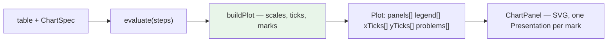

## Who this is for

You have just joined and you are about to change the plot engine, which is the
one part of this codebase where a mistake is invisible. A chart that computes the
wrong geometry still draws a chart. It does not throw, it does not fail a type
check, and unless someone knows what the answer should look like it will ship.

By the end of this document you should be able to answer:

- What our plot engine is, what it can draw today, and where its edges are.
- Which three things the basketball prototype draws that we cannot, and why the
  smallest of the three is worth the most.
- Why "add a radar geom" is the wrong framing, and what the right one is.
- How to tell whether a chart change is correct, given that looking at it is not
  enough.

---

## 1. Where this comes from

`~/Downloads/pbui-basketball.jsx`, 984 lines. It is the third prototype this
project has mined, after the PBUI shell and the agent workbench, and it is the
same framework — presentations, accept, split-tree window manager — pointed at
basketball analytics. Its presentation types are `<player>`, `<team>`, `<game>`.

The framework parts are ours already and there is nothing to port. What is new is
entirely in **what it draws**.

### The method, stated up front because it failed once

The previous ticket's gap analysis compared prototypes to our system **by
shape** — "this is a Chip with a tone", "this is our SplitView" — and shape
comparison is blind to ideas, because a listener and a log have the same shape.
It missed a widget for a whole ticket.

So the rule here, applied per app: **find the one line that makes it
non-obvious.** If there is no such line, it is a demo.

| App | The non-obvious line | Verdict |
|---|---|---|
| `EfficiencyApp` | `<line … strokeDasharray="4 3" />` at the league mean, twice, making quadrants | **new** — §4.1 |
| `RadarApp` | `pt(i, f)` — polar — and `p[a.k] / LEAGUE.max[a.k]` — per-axis normalisation | **new** — §4.2 |
| `ShotChartApp` | `<CourtLines />` beneath the marks; positions are *court* coordinates | **new** — §4.3 |
| `TrendsApp` | the dashed season-average line — the same idea as Efficiency's crosshairs | folds into §4.1 |
| `LeadersApp` | a sortable table | have it (`TablePanel`) |
| `StandingsApp` | win% as a proportional bar | have it (`Meter`, DATADROP-11) |
| `WatchlistApp` | a list of presentations | have it (`WatchlistPanel`) |
| `InspectorApp` / `TraceApp` | — | have both |

Two claims in the file's own header were checked and are **already true of us**,
so they produced nothing: *"commands accept objects from any tile, mid-command"*
(our accept protocol does this, `AcceptBanner` survives a workspace switch) and
*"two tiles = two views of one state"* (our tiles bind to documents, and two
tiles on one document already track each other).

---

## 2. What our plot engine is

`ui/src/model/plot.ts` is a pure function from `(table, spec, width, height)` to
drawable geometry. No SVG, no React, no DOM. Its docstring states why:

> Splitting geometry from rendering is what makes this testable: a test can
> assert that the mark for row 3 lands at x = 214.5 without a browser and without
> a snapshot file.

That separation is the most important fact in this document, and everything below
has to preserve it.

**What it can draw today:**

```ts
export type Geom = "point" | "line" | "bar" | "area";
export type Channel = "x" | "y" | "color" | "size" | "facet";

export type Mark =
  | { kind: "circle"; x: number; y: number; r: number; fill: string; row: Row }
  | { kind: "rect"; x: number; y: number; w: number; h: number; fill: string; row: Row }
  | { kind: "path"; d: string; stroke?: string; fill?: string; fillOpacity?: number };
```

Four geoms, five channels, three mark kinds, one coordinate system — cartesian,
with `padL`/`padB` for axes and a legend gutter on the right.

It also refuses rather than guessing. `buildPlot` returns `problems: string[]`
and draws nothing when that is non-empty, and every refusal names what to change:
*"bar wants a nominal or temporal x — add a summarize step, or map x to a
category"*. That is the house style for this layer; new code matches it.



---

## 3. What this ticket does not do

State these to a reviewer before they ask.

- **No basketball.** No `<player>`, `<team>` or `<game>`. Those are the
  prototype's domain. Adding presentation types nothing produces is the
  DATADROP-4 defect, and `descriptor-coverage.test.ts` now fails on it.
- **No court component.** The court is the *worked example* for the backdrop
  mechanism, and it lives in a story.
- **No charting library.** The engine stays ours and stays pure.

---

## 4. The three gaps

### 4.1 Reference lines — the smallest, and worth the most

A constant drawn across the plot, dashed, optionally labelled. The prototype uses
it twice, for two different jobs:

```jsx
// EfficiencyApp — two of them, turning a scatter into quadrants
<line x1={px(LEAGUE.meanUsg)} y1={padT} x2={px(LEAGUE.meanUsg)} y2={H - padB}
      stroke={C.line} strokeDasharray="4 3" />
<line x1={padL} y1={py(LEAGUE.meanTs)} x2={W - padR} y2={py(LEAGUE.meanTs)}
      stroke={C.line} strokeDasharray="4 3" />

// TrendsApp — one, the season average
<line … y1={py(avg)} y2={py(avg)} stroke={C.red} strokeDasharray="4 3" />
```

```
  TS% |                    :  * Vale
      |            * Okonkwo      :  <- upper right: high volume AND efficient
   ---+--------------------+---------  league mean TS%
      |   * Reyes          :
      |            * Diallo:
      +--------------------+---------> USG%
                   league mean USG%
```

**Why it is worth the most.** About twenty lines, no new coordinate system, and
it changes what a scatter *means*. A scatter of usage against efficiency is a
cloud; the same scatter with the two means drawn is a claim with four named
quadrants. We can draw neither line today — `grep` for `strokeDasharray`,
`refLine` and `referenceLine` across `ui/src` returns nothing.

```ts
// model/chart.ts
export interface ReferenceLine {
  /** Which axis the constant lives on. */
  on: "x" | "y";
  /**
   * The constant, in DATA units — not pixels.
   *
   * Data units, so the line survives a resize, a scale change and a facet. A
   * pixel constant is correct exactly once, at the size it was authored.
   */
  value: number;
  label?: string;
  /** "mean" and "target" read differently and should look different. */
  intent?: "reference" | "target" | "limit";
}

// added to ChartSpec
references?: ReferenceLine[];

// model/plot.ts — a fourth Mark kind
| { kind: "rule"; x1: number; y1: number; x2: number; y2: number;
    label?: string; intent: "reference" | "target" | "limit" }
```

Three decisions to get right:

- **A reference outside the domain is clipped, not dropped silently.** A target
  line above every observed value is *the most interesting case* — it says you
  are nowhere near it. Dropping it hides the exact fact it exists to show. Either
  extend the domain to include it, or draw it at the edge and say so in
  `problems`. This is the same defect class as `Sparkline`'s `threshold` in
  DATADROP-11, which had to include the threshold in its domain for precisely
  this reason.
- **`on: "x"` draws a *vertical* line.** It is a constant *in x*, so it runs
  perpendicular to the x axis. This reads backwards to about half of people, so
  the field is documented and a test names it.
- **A reference line is not a presentation.** It is chrome, not an object in the
  data. Do not wrap it in `<Presentation>`.

### 4.2 Radar — a second coordinate system

```
             PTS
              /\
        TS%  /  \  REB
            / ## \            ## = one player's polygon
       3P% |  ##  | AST       rings at 0.25 0.5 0.75 1
            \ ## /
        BLK  \  /  STL
              \/
```

```js
const ang = (i) => -Math.PI / 2 + (i / n) * 2 * Math.PI;
const pt  = (i, f) => [cx + Math.cos(ang(i)) * R * f, cy + Math.sin(ang(i)) * R * f];
const polyFor = (p) => RAXES.map((a, i) =>
  pt(i, clamp(p[a.k] / LEAGUE.max[a.k], 0.05, 1)).join(",")).join(" ");
```

**"Add a radar geom" is the wrong framing**, and getting this wrong is the main
risk in the ticket. A geom is a mark shape drawn *inside* a coordinate system:
point, line, bar and area all consume the same `px`/`py` from the same scales.
Radar replaces the coordinate system. There is no x, no y, no `padL`, no axis
ticks — every one of `buildPlot`'s cartesian assumptions is wrong inside it.

So it is a **sibling of `buildPlot`, not a branch within it**:

```ts
// model/radar.ts — a separate pure function with the same contract shape
export interface RadarAxis { field: string; label: string; max: number }
export interface RadarSeries { key: string; label: string; color: string; values: number[] }

export interface RadarPlot {
  problems: string[];          // the same refusal contract as buildPlot
  cx: number; cy: number; r: number;
  rings: number[];             // fractions, for the concentric guides
  axes: Array<{ label: string; x: number; y: number; labelX: number; labelY: number }>;
  polygons: Array<{ key: string; color: string; points: Array<[number, number]> }>;
}

export function buildRadar(axes, series, size): RadarPlot
```

Details that are easy to get wrong:

- **`-Math.PI / 2` starts the first spoke at the top.** Without it the first axis
  sits at three o'clock and every radar you have seen looks rotated.
- **Per-axis normalisation is a *choice*, and it must be visible.** Each spoke is
  scaled by that axis's own maximum, so the shape says "relative to the leader in
  each category" and **not** "these values are comparable". A reader who assumes
  the second is being misled by the picture. The prototype says so in an on-screen
  `Hint`; ours must too.
- **The `clamp(…, 0.05, 1)` floor is load-bearing.** A zero collapses that vertex
  onto the centre and the polygon self-intersects into a bowtie.
- **Three series maximum, enforced.** The prototype caps at three with
  `.slice(-3)`. Four overlapping translucent polygons are unreadable, and
  comparison is the whole job.

### 4.3 Backdrop — marks on a spatial frame

```
   +----------------------------------+
   |        +--------------+          |   o = miss (outlined)
   |   *    |              |   o      |   * = make (filled)
   |        |      *       |          |
   |  o     |   *     o    |    *     |   the backdrop IS the
   |        +--------------+          |   coordinate system --
   |      *        (+)       o        |   there are no axes
   +----------------------------------+
      AT RIM 68% 15/22   MID 41%   3PT 37%
```

The shot chart plots marks at `(s.x, s.y)` on a court drawn beneath them. There
are no axes and no ticks, because the *backdrop* is the reference frame: a
position means something because of where the three-point arc is, not because of
a number on an axis.

Generalised — and the generalisation is the point:

> Some data is positional in a space the reader already knows: a court, a field,
> a floor plan, a rack elevation, a wafer map. For that data an axis is noise and
> the picture is the scale.

```ts
export interface Backdrop {
  /** The frame's own coordinate space, e.g. 500x470 for the court. */
  width: number;
  height: number;
  /** Drawn beneath the marks. Supplied by the caller — the engine ships none. */
  render: () => ReactNode;
  label: string;
}
```

`buildPlot` is reused wholesale — the marks are still circles at `(x, y)` — with
the scales set to the identity over the backdrop's own dimensions rather than
derived from the data. That is the whole mechanism, and it is why this is the
*last* phase rather than the biggest: most of it already exists.

**Two things worth taking from the shot chart that are not the backdrop:**

The make/miss encoding is filled-versus-outlined **and** green-versus-red — two
redundant channels for one binary. `ui/GUIDELINES.md` requires exactly this
("meaning is never carried by colour alone") and cannot enforce it. This is a
good example to point at when someone asks what the rule looks like in practice.

The zone summary (`AT RIM 68% 15/22`) is derived from *position* — a spatial
aggregation, computed by distance from the hoop. Our pipeline can summarize by a
category but has no notion of a spatial bin. Out of scope; worth recording.

---

## 5. The build

| Phase | What | Why this order |
|---|---|---|
| 1 | `ReferenceLine` | Smallest, no new coordinate system, most value per line |
| 2 | `RadarChart` | A self-contained new coordinate system; touches nothing existing |
| 3 | `BackdropPlot` | Reuses `buildPlot`; cheapest last, because phases 1–2 inform it |
| 4 | Guards and the break sweep | — |

### Phase 1 — `ReferenceLine`

`ReferenceLine` in `model/chart.ts`, a `rule` Mark kind, emission in `buildPlot`,
rendering in `ChartPanel`, and tests asserting **pixel positions** rather than
that something rendered.

**Done when:** a reference at the data mean lands on the same y as a row holding
that value, and a reference outside the domain is visible and reported.

### Phase 2 — `RadarChart`

`model/radar.ts` as a sibling of `buildPlot`, then a `RadarPanel` organism.
Geometry pure and tested with literals: with four axes all at maximum, the
polygon vertices sit at the top, right, bottom and left of the circle, and those
four coordinates can be asserted exactly.

### Phase 3 — `BackdropPlot`

The `Backdrop` interface and a `BackdropPanel`. The court goes in a **story**,
not in the component tree.

### Phase 4 — Guards

Extend `plot.test.ts`, add `radar.test.ts`. Break each new invariant and paste
the failure into the diary.

---

## 6. How to know a chart change is correct

Read this twice. Charts are the one place in this codebase where the usual
signals are all wrong.

**Looking at it is not enough.** A chart with wrong scales looks like a chart.
DATADROP-11 found a comparison panel reporting two different pipelines as
matching, and a meter drawing `+Infinity` as an *empty* bar. Both looked fine.

**So assert coordinates.** `plot.test.ts` already does this and it is the model:
given a table and a spec, the mark for row 3 is at x = 214.5. A test asserting
"three marks were produced" passes for every wrong answer that produces three
marks.

**And verify each guard by breaking it.** Flip the sign, drop the
`-Math.PI / 2`, remove the clamp floor — then watch the test fail and paste the
output into the diary. A guard nobody has broken is a guard nobody has tested:
the DATADROP-11 break sweep found two that were silent, and the test written to
close them found a defect that had been shipping for two tickets.

---

## 7. File reference

**Read first:**

| Path | Why |
|---|---|
| `ui/src/model/plot.ts` | The engine. Note `problems[]` and the refusal style |
| `ui/src/model/chart.ts` | `ChartSpec`, `Geom`, `Channel` |
| `ui/test/plot.test.ts` | How a geometry assertion is written here |
| `ui/src/components/organisms/ChartPanel/ChartPanel.tsx` | The `svg` prop hazard on `Presentation` |
| `ui/src/components/atoms/Sparkline/Sparkline.tsx` | Its `threshold` had the same domain bug §4.1 warns about |

**Create:**

```
ui/src/model/radar.ts
ui/src/components/organisms/RadarPanel/{RadarPanel.tsx,.module.css,.stories.tsx,index.ts}
ui/src/components/organisms/BackdropPanel/{…}
ui/test/radar.test.ts
```

**Modify:**

```
ui/src/model/chart.ts     ReferenceLine, ChartSpec.references
ui/src/model/plot.ts      the rule Mark kind, emission, domain handling
ui/src/components/organisms/ChartPanel/ChartPanel.tsx
ui/src/components/organisms/index.ts
ui/test/plot.test.ts
```

---

## 8. Related

- [[DATADROP-3]] — the grammar-of-graphics workbench this extends
- [[DATADROP-11]] — the widget vocabulary, and the break-sweep discipline
- `ui/GUIDELINES.md` — including the colour-alone rule that §4.3 illustrates
